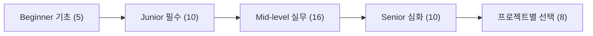
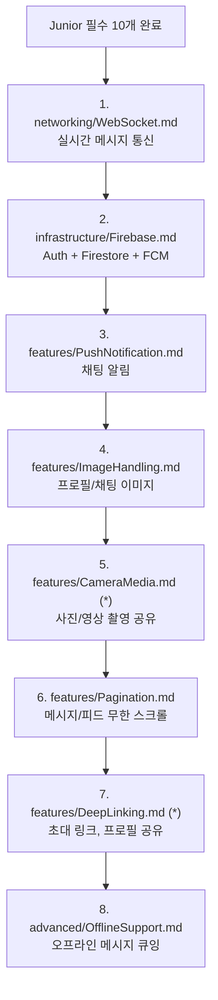
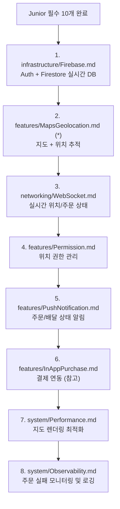
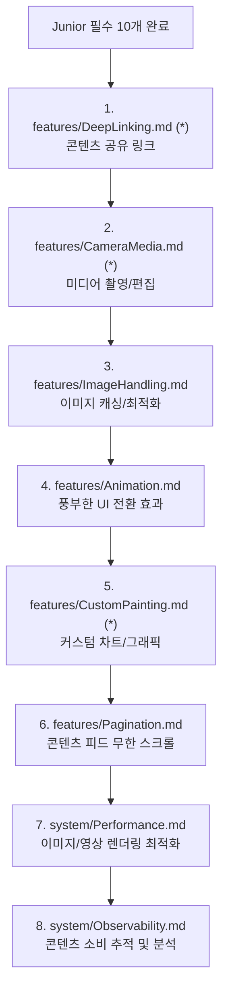
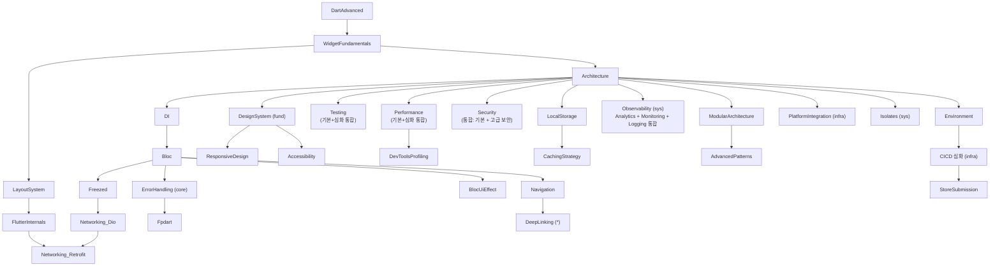

# Flutter 팀 교육 커리큘럼

> 56개 학습 문서 기반 레벨별 교육 과정

---

## 개요

이 커리큘럼은 flutter-study 저장소의 56개 문서를 기반으로, 개발자 경력 수준에 맞춘 체계적 학습 경로를 제공합니다.

| 레벨 | 대상 | 기간 | 문서 수 | 핵심 목표 |
|------|------|------|---------|-----------|
| Beginner | 입문 | 4주 | 5개 | Dart 언어와 Flutter Widget 기본기 이해 |
| Junior | 0-6개월 | 12주 | 10개 | Clean Architecture 기반 앱 구조를 이해하고 기본 CRUD 앱 구현 |
| Mid-level | 6-12개월 | 12주 | 16개 | 실무 수준의 기능 구현과 품질 관리 역량 확보 |
| Senior | 1년+ | 자율 | 10개 | 아키텍처 설계, 성능 최적화, 프로덕션 운영 주도 |

**전체 문서 분류 (56개)**

---

## 0. Beginner 레벨 (입문)

### 0.1 기초 문서 5개

Dart 언어와 Flutter의 핵심 개념을 이해합니다. 다른 플랫폼(iOS, Android, Web) 경험자가 Flutter로 전환할 때 필수적으로 학습해야 하는 기초입니다.

| 순서 | 문서 | 카테고리 | 핵심 학습 내용 | 예상 시간 |
|------|------|----------|---------------|-----------|
| 1 | `fundamentals/DartAdvanced.md` | Fundamentals | Generics, Extension, Mixin, Sealed Class, Pattern Matching | 6h |
| 2 | `fundamentals/WidgetFundamentals.md` | Fundamentals | Widget/Element/RenderObject 트리, BuildContext, Key, State Lifecycle | 5h |
| 3 | `fundamentals/LayoutSystem.md` | Fundamentals | Constraints 전파, Flex 레이아웃, Sliver 시스템 | 5h |
| 4 | `system/DevToolsProfiling.md` | System | DevTools 실전, 성능 프로파일링, 메모리 릭 디버깅 | 4h |
| 5 | `fundamentals/FlutterInternals.md` | Fundamentals | 렌더링 파이프라인, Build/Layout/Paint/Composite | 4h |

**총 예상 학습 시간: 24시간**

### 0.2 주차별 학습 계획 (4주)

| 주차 | 학습 문서 | 학습 목표 | 실습 |
|------|----------|----------|------|
| **1주** | `DartAdvanced.md` | Dart 심화 문법 (Generics, Extension, Mixin, Sealed Class) | Extension Method로 유틸리티 작성 |
| **2주** | `WidgetFundamentals.md` | Widget Tree, BuildContext, Key의 동작 원리 | StatefulWidget Lifecycle 실습 |
| **3주** | `LayoutSystem.md` | Constraints 전파 원리, Sliver 기반 스크롤 레이아웃 | 복잡한 UI 레이아웃 구현 |
| **4주** | `system/DevToolsProfiling.md` + `FlutterInternals.md` | 렌더링 파이프라인 이해, DevTools로 프로파일링 | DevTools로 리빌드 추적 및 최적화 |

---

## 1. Junior 레벨 (0-6개월)

### 1.1 필수 기초 문서 10개

아래 순서대로 학습합니다. 각 문서의 선행 요건이 이전 문서에서 충족되도록 배치했습니다.

| 순서 | 문서 | 카테고리 | 핵심 학습 내용 | 예상 시간 |
|------|------|----------|---------------|-----------|
| 1 | `core/Architecture.md` | Core | Clean Architecture 3-Layer, Feature 모듈화 | 4h |
| 2 | `infrastructure/DI.md` | Infra | GetIt + Injectable 의존성 주입 | 3h |
| 3 | `core/Bloc.md` | Core | Event/State 설계, BlocProvider, Transformer | 6h |
| 4 | `core/Freezed.md` | Core | 불변 데이터 클래스, Union Type, copyWith | 4h |
| 5 | `networking/Networking_Dio.md` | Network | Dio 설정, Interceptor, 토큰 갱신 | 4h |
| 6 | `networking/Networking_Retrofit.md` | Network | Retrofit API 서비스 정의, 코드 생성 | 3h |
| 7 | `core/ErrorHandling.md` | Core | Failure sealed class, Either 에러 처리 | 4h |
| 8 | `features/Navigation.md` | Features | GoRouter, 인증 리다이렉트, ShellRoute | 4h |
| 9 | `fundamentals/DesignSystem.md` | Fundamentals | Material 3 테마, 다크 모드, ThemeExtension, 디자인 토큰 | 3h |
| 10 | `features/FormValidation.md` | Patterns | 폼 유효성 검사, ValidatorBuilder, Form Bloc | 3h |

**총 예상 학습 시간: 38시간**

### 1.2 주차별 학습 계획 (12주)

| 주차 | 학습 문서 | 학습 목표 | 실습 |
|------|----------|----------|------|
| **1주** | `Architecture.md` | Clean Architecture 3-Layer 구조 이해, Presentation/Domain/Data 역할 구분 | 빈 프로젝트에 폴더 구조 생성 |
| **2주** | `DI.md` | GetIt 컨테이너 설정, Injectable 어노테이션 사용, 모듈 등록 | DI 설정 및 서비스 등록 실습 |
| **3주** | `Bloc.md` (전반) | Bloc 개념, Event/State 정의, BlocProvider 구성 | 간단한 Counter Bloc 구현 |
| **4주** | `Bloc.md` (후반) | Transformer, BlocObserver, 멀티 Bloc 구성 | 로그인/로그아웃 상태 관리 |
| **5주** | `Freezed.md` | 불변 클래스, Union Type(Sealed), JSON 직렬화, copyWith | User/Product 모델 정의 |
| **6주** | `Networking_Dio.md` | Dio 인스턴스 설정, Interceptor 체인, 토큰 갱신 로직 | REST API 연동 (JSONPlaceholder) |
| **7주** | `Networking_Retrofit.md` | API 인터페이스 정의, 코드 생성, 응답 매핑 | Retrofit으로 CRUD API 서비스 작성 |
| **8주** | `ErrorHandling.md` | Failure 패턴, Dio 에러 매핑, ErrorView 위젯, 재시도 로직 | 네트워크 에러 처리 구현 |
| **9주** | `Navigation.md` | GoRouter 설정, 딥링크, 인증 가드, ShellRoute | 멀티 탭 네비게이션 구현 |
| **10주** | `DesignSystem.md` | Material 3 테마 구성, 다크 모드 토글, 디자인 토큰 적용 | 라이트/다크 테마 전환 구현 |
| **11주** | `FormValidation.md` | 실시간 유효성 검사, Form Bloc 통합, ValidatorBuilder | 회원가입 폼 구현 |
| **12주** | **종합 실습** | 1-11주 내용 통합 | 실습 과제 수행 (아래 참조) |

### 1.3 실습 과제 3개

#### 과제 1: Todo CRUD 앱 (4-5주차 완료 후)

**목표:** Clean Architecture + Bloc + Freezed 패턴으로 기본 CRUD 앱 구현

| 항목 | 내용 |
|------|------|
| 관련 문서 | Architecture, DI, Bloc, Freezed |
| 구현 범위 | Todo 목록 조회, 추가, 수정, 삭제, 완료 토글 |
| 필수 요구사항 | Feature 기반 폴더 구조, Freezed State 사용, BlocProvider로 상태 주입 |
| 평가 기준 | 레이어 분리 준수, State 불변성, 이벤트 기반 상태 전이 |

#### 과제 2: 뉴스 리더 앱 (8주차 완료 후)

**목표:** REST API 연동과 에러 처리가 포함된 앱 구현

| 항목 | 내용 |
|------|------|
| 관련 문서 | Networking_Dio, Networking_Retrofit, ErrorHandling |
| 구현 범위 | 뉴스 API(NewsAPI 등) 연동, 기사 목록/상세, 에러 화면 |
| 필수 요구사항 | Retrofit API 서비스, Dio Interceptor, Failure 패턴 적용, 재시도 버튼 |
| 평가 기준 | API 통신 구조, 에러 타입별 처리, 로딩/에러/데이터 상태 관리 |

#### 과제 3: 회원 관리 앱 (12주차 종합)

**목표:** 전체 학습 내용을 통합한 완성형 앱

| 항목 | 내용 |
|------|------|
| 관련 문서 | 1-10번 전체 |
| 구현 범위 | 로그인/회원가입 폼, 프로필 조회/수정, 테마 설정, 탭 네비게이션 |
| 필수 요구사항 | GoRouter 인증 가드, FormValidation, Material 3 테마, 다크 모드, GetIt DI |
| 평가 기준 | 아키텍처 일관성, 네비게이션 구조, 폼 유효성 검사, 테마 시스템 통합 |

---

## 2. Mid-level 레벨 (6-12개월)

### 2.1 실무 필수 문서 14개

Junior 과정 완료를 전제로 합니다. 실무 프로젝트에서 자주 마주치는 기능과 품질 관리 역량을 키웁니다.

| 순서 | 문서 | 카테고리 | 핵심 학습 내용 | 예상 시간 |
|------|------|----------|---------------|-----------|
| 1 | `core/Fpdart.md` | Core | Either/Option/TaskEither 함수형 에러 처리 | 5h |
| 2 | `core/BlocUiEffect.md` | Core | 일회성 UI 이벤트 (Toast, Dialog, Navigation) | 3h |
| 3 | `infrastructure/Environment.md` | Infra | Flavor 구성, dev/stg/prod 환경 분리 | 3h |
| 4 | `infrastructure/LocalStorage.md` | Infra | SharedPreferences, Hive, SecureStorage | 4h |
| 5 | `features/Localization.md` | Features | easy_localization, JSON 번역, 런타임 언어 변경 | 4h |
| 6 | `features/Permission.md` | Features | permission_handler, 플랫폼별 설정, 권한 플로우 | 3h |
| 7 | `features/PushNotification.md` | Features | FCM, 로컬 알림, 토픽 구독, 백그라운드 처리 | 5h |
| 8 | `features/Pagination.md` | Patterns | 무한 스크롤, 커서 기반, PaginationState | 4h |
| 9 | `features/ImageHandling.md` | Patterns | 이미지 캐싱, 크롭, 압축, 서버 업로드 | 4h |
| 10 | `system/Observability.md` | System | Analytics, Logging, Monitoring 통합 - 이벤트 추적, 구조화 로깅, Crashlytics | 5h |
| 11 | `features/Animation.md` | Patterns | 암시적/명시적 애니메이션, Lottie, Hero | 4h |
| 12 | `system/Testing.md` | System | Unit/Widget/Integration 테스트, Mocktail, BlocTest | 6h |
| 13 | `system/Performance.md` | System | 렌더링 최적화, 메모리 관리, DevTools | 4h |
| 14 | `system/Security.md` | System | 데이터 암호화, Certificate Pinning, 인증 보안 | 4h |

**총 예상 학습 시간: 57시간**

### 2.2 주차별 학습 계획 (12주)

| 주차 | 학습 문서 | 학습 목표 | 실습 |
|------|----------|----------|------|
| **1주** | `Fpdart.md` | Either/Option 패턴, TaskEither로 비동기 체이닝 | UseCase를 TaskEither로 리팩토링 |
| **2주** | `BlocUiEffect.md` | 일회성 이벤트 처리, Side Effect 분리 | Toast/Dialog/Navigation 이펙트 구현 |
| **3주** | `Environment.md` + `LocalStorage.md` | 환경 분리, 로컬 데이터 저장 전략 | dev/prod Flavor 설정, Hive 캐시 구현 |
| **4주** | `Localization.md` | 다국어(KR/JP/TW) 지원 구조 | JSON 번역 파일 + 런타임 언어 변경 |
| **5주** | `Permission.md` + `PushNotification.md` (전반) | 권한 요청 플로우, FCM 기초 설정 | 카메라/위치 권한 + FCM 토큰 등록 |
| **6주** | `PushNotification.md` (후반) | 토픽 구독, 백그라운드 알림 처리 | 알림 클릭 시 특정 화면 이동 |
| **7주** | `Pagination.md` + `ImageHandling.md` | 무한 스크롤 + 이미지 처리 통합 | 이미지 포함 무한 스크롤 목록 구현 |
| **8주** | `Observability.md` | Analytics 이벤트 설계, 구조화된 로깅, Monitoring 설정 | Analytics 이벤트 + BlocObserver 로깅 + Crashlytics |
| **9주** | `Animation.md` | 암시적/명시적 애니메이션, 페이지 전환 | Hero 애니메이션 + 커스텀 전환 효과 |
| **10주** | `Testing.md` | Unit/Widget/Integration 테스트 작성 | 기존 코드에 테스트 추가 (커버리지 70% 목표) |
| **11주** | `Performance.md` + `Security.md` | 렌더링 최적화, 보안 설정 | DevTools 프로파일링 + Certificate Pinning |
| **12주** | **미니 프로젝트 시작** | 학습 내용 통합 | 미니 프로젝트 수행 (아래 참조) |

### 2.3 미니 프로젝트 2개

#### 프로젝트 A: 실시간 커뮤니티 앱 (Bloc + Dio + Firebase)

**기간:** 3-4주 (12주차 이후)

| 항목 | 내용 |
|------|------|
| 기술 스택 | Bloc, Dio/Retrofit, Firebase Auth/Firestore, FCM, GoRouter |
| 기능 | 이메일 로그인, 게시글 CRUD, 댓글, 좋아요, 푸시 알림, 이미지 업로드 |
| 품질 요구사항 | Unit 테스트 커버리지 60%+, BlocObserver 로깅, Analytics 이벤트 10개+ |
| 학습 포인트 | Firebase 실시간 데이터 동기화, 페이지네이션, 이미지 압축 업로드 |

**평가 체크리스트:**

- [ ] Clean Architecture 레이어 분리
- [ ] Freezed State + Either 에러 처리
- [ ] Firebase Auth 로그인/로그아웃 플로우
- [ ] Firestore 실시간 데이터 구독
- [ ] 이미지 압축 후 Cloud Storage 업로드
- [ ] 무한 스크롤 페이지네이션
- [ ] FCM 푸시 알림 (포그라운드 + 백그라운드)
- [ ] KR/JP 2개 언어 지원
- [ ] 라이트/다크 테마 지원
- [ ] Bloc Unit 테스트 작성

#### 프로젝트 B: 오프라인 지원 메모 앱

**기간:** 2-3주

| 항목 | 내용 |
|------|------|
| 기술 스택 | Bloc, Hive, Dio, fpdart |
| 추가 참고 문서 | `advanced/OfflineSupport.md` |
| 기능 | 메모 CRUD, 오프라인 작성/편집, 온라인 동기화, 충돌 해결 |
| 품질 요구사항 | 오프라인 동작 완전 지원, 동기화 큐 구현, 성능 프로파일링 |
| 학습 포인트 | Offline-first 아키텍처, Sync Queue, Conflict Resolution |

**평가 체크리스트:**

- [ ] Hive 로컬 DB로 오프라인 CRUD
- [ ] 네트워크 상태 모니터링 (Connectivity)
- [ ] Sync Queue로 미전송 데이터 관리
- [ ] 충돌 해결 전략 (Last-write-wins 또는 UI 선택)
- [ ] TaskEither를 활용한 비동기 에러 체이닝
- [ ] DevTools로 메모리/렌더링 프로파일링

---

## 3. Senior 레벨 (1년+)

### 3.1 심화 문서 10개

실무 경험을 바탕으로 아키텍처 설계, 고급 최적화, 프로덕션 운영 역량을 키웁니다. 순서는 권장 사항이며, 관심 분야에 따라 조정 가능합니다.

| 순서 | 문서 | 카테고리 | 핵심 학습 내용 | 난이도 |
|------|------|----------|---------------|--------|
| 1 | `advanced/AdvancedStateManagement.md` | Core | CQRS, Event Sourcing, Optimistic UI, Undo/Redo | ★★★ |
| 2 | `advanced/ModularArchitecture.md` | Core | Mono-repo, Melos, Micro Frontend | ★★★ |
| 3 | `advanced/AdvancedPatterns.md` | Patterns | DDD, Hexagonal, Saga, Specification | ★★★ |
| 4 | `infrastructure/PlatformIntegration.md` | Infra | Platform Channel, FFI, Pigeon | ★★★ |
| 5 | `system/Isolates.md` | System | Isolate 기반 병렬 처리, Compute, IsolateChannel | ★★★ |
| 6 | `system/Testing.md` (심화) | System | Property-based, Golden Test, Mutation, Contract, Fuzz, E2E Patrol | ★★★ |
| 7 | `system/Performance.md` (심화) | System | Custom RenderObject, Impeller, Memory Profiling | ★★★ |
| 8 | `infrastructure/CICD.md` (심화) | Infra | Trunk-based, Canary Release, Shorebird OTA | ★★★ |
| 9 | `system/ProductionOperations.md` | System | SLO/SLI, Crash-free Rate, Incident Management | ★★★ |
| 10 | `advanced/OfflineSupport.md` | Patterns | Offline-first, Drift ORM, Sync Queue, Conflict Resolution | ★★★ |

### 3.2 아키텍처 리뷰 과제

Senior 개발자는 코드 작성뿐 아니라 설계 의사결정을 주도해야 합니다.

#### 과제 1: 기존 프로젝트 아키텍처 감사 (Architecture Audit)

| 항목 | 내용 |
|------|------|
| 관련 문서 | Architecture, ModularArchitecture, AdvancedPatterns |
| 과제 내용 | 실제 운영 중인 프로젝트의 아키텍처를 분석하고 개선안 작성 |
| 산출물 | 아키텍처 감사 보고서 (현재 상태, 문제점, 개선안, 마이그레이션 계획) |
| 평가 기준 | SOLID 원칙 적용, 레이어 의존성 검증, 모듈화 수준 평가 |

**보고서 포함 항목:**
1. 의존성 그래프 분석 (순환 의존 탐지)
2. 레이어 위반 사례 목록
3. 테스트 커버리지 분석
4. 모듈 분리 계획 (Melos 기반)
5. 단계별 마이그레이션 로드맵

#### 과제 2: 성능 최적화 리포트

| 항목 | 내용 |
|------|------|
| 관련 문서 | Performance (기본+심화 통합), Observability |
| 과제 내용 | 실제 앱의 성능 병목을 분석하고 최적화 수행 |
| 산출물 | 성능 최적화 리포트 (Before/After 비교 데이터 포함) |
| 평가 기준 | 프레임 드롭 감소율, 메모리 사용량 개선, 앱 시작 시간 단축 |

**리포트 포함 항목:**
1. DevTools Timeline 분석
2. Memory Profiling 결과
3. Widget Rebuild 최적화 (const, key, selector 활용)
4. 이미지/네트워크 캐싱 전략
5. Impeller 렌더러 성능 비교

#### 과제 3: 보안 감사 및 CI/CD 파이프라인 설계

| 항목 | 내용 |
|------|------|
| 관련 문서 | Security, CICD (심화), ProductionOperations |
| 과제 내용 | 보안 체크리스트 기반 감사 + CI/CD 파이프라인 전체 설계 |
| 산출물 | 보안 감사 보고서 + CI/CD 파이프라인 설계 문서 |
| 평가 기준 | OWASP Mobile Top 10 대응, Canary Release 전략, SLO 정의 |

### 3.3 기술 발표 주제 3개

팀 내 지식 공유를 위한 발표 주제입니다. 각 주제는 30-45분 발표 + 15분 Q&A로 구성합니다.

#### 발표 1: "Flutter에서 DDD와 Clean Architecture 실전 적용기"

| 항목 | 내용 |
|------|------|
| 관련 문서 | Architecture, AdvancedPatterns, ModularArchitecture |
| 발표 내용 | DDD Aggregate/Entity/Value Object를 Flutter에 적용하는 방법, Hexagonal Architecture와 Clean Architecture의 비교, 실제 프로젝트 리팩토링 사례 |
| 청중 | Mid-level 이상 개발자 |
| 준비물 | 코드 Before/After 비교, 아키텍처 다이어그램 |

#### 발표 2: "Flutter 앱 성능 최적화: 60fps를 지키는 전략"

| 항목 | 내용 |
|------|------|
| 관련 문서 | Performance (기본+심화 통합), Observability |
| 발표 내용 | Rendering Pipeline 이해, Custom RenderObject 활용, Impeller vs Skia, 실제 프로파일링 데모 |
| 청중 | Junior 이상 전체 |
| 준비물 | DevTools 라이브 데모, Before/After 성능 비교 영상 |

#### 발표 3: "모바일 앱 보안: 공격 벡터와 방어 전략"

| 항목 | 내용 |
|------|------|
| 관련 문서 | Security, ProductionOperations |
| 발표 내용 | OWASP Mobile Top 10 대응, Certificate Pinning/mTLS 구현, RASP, Jailbreak Detection, 실제 취약점 사례와 대응 방법 |
| 청중 | Mid-level 이상 개발자 |
| 준비물 | 취약점 시연 (안전한 환경), 보안 체크리스트 배포 |

---

## 4. 프로젝트 타입별 학습 경로

Junior 필수 10개 문서를 완료한 후, 프로젝트 특성에 맞는 추가 문서를 선별하여 학습합니다.

### 4.1 SNS / 채팅 앱

실시간 통신, 미디어 처리, 소셜 기능이 핵심인 앱

**핵심 기술 조합:** WebSocket + Firebase Auth + Firestore + FCM + Image 처리

| 주요 과제 | 관련 문서 | 난이도 |
|-----------|----------|--------|
| 1:1 채팅 구현 | WebSocket, Firebase | ★★ |
| 그룹 채팅 + 읽음 표시 | WebSocket, Firestore | ★★★ |
| 미디어 메시지 (사진/영상) | CameraMedia, ImageHandling | ★★ |
| 실시간 온라인 상태 | WebSocket, AppLifecycle | ★★ |

---

### 4.2 O2O 서비스 (배달 / 택시)

위치 기반 서비스, 실시간 추적, 결제가 핵심인 앱

**핵심 기술 조합:** Google Maps + Geolocator + WebSocket + Firebase + FCM

| 주요 과제 | 관련 문서 | 난이도 |
|-----------|----------|--------|
| 실시간 위치 추적 지도 | MapsGeolocation, WebSocket | ★★★ |
| 주문 상태 실시간 업데이트 | WebSocket, Firebase | ★★ |
| Geofencing 알림 | MapsGeolocation, PushNotification | ★★★ |
| 경로 표시 및 ETA 계산 | MapsGeolocation, Performance | ★★★ |

---

### 4.3 콘텐츠 / 미디어 앱

미디어 재생, 콘텐츠 탐색, 공유 기능이 핵심인 앱

**핵심 기술 조합:** Deep Link + Media 처리 + Animation + Custom Painting + 캐싱

| 주요 과제 | 관련 문서 | 난이도 |
|-----------|----------|--------|
| 미디어 피드 (Instagram 스타일) | CameraMedia, ImageHandling, Pagination | ★★ |
| 콘텐츠 딥링크 공유 | DeepLinking, Navigation | ★★ |
| 커스텀 비디오 플레이어 | CameraMedia, Animation | ★★★ |
| 데이터 시각화 차트 | CustomPainting, Animation | ★★★ |

---

## 5. 전체 문서 매핑 (56개)

모든 문서가 어느 레벨에 배정되었는지 한눈에 확인할 수 있는 표입니다.

### 레벨별 배정

| 레벨 | 문서 (카테고리) |
|------|----------------|
| **Beginner 기초** (5) | DartAdvanced (fund), WidgetFundamentals (fund), LayoutSystem (fund), DevToolsProfiling (fund), FlutterInternals (fund) |
| **Junior 필수** (10) | Architecture (core), DI (infra), Bloc (core), Freezed (core), Networking_Dio (net), Networking_Retrofit (net), ErrorHandling (core), Navigation (feat), DesignSystem (fund), FormValidation (feat) |
| **Mid-level 필수** (16) | Fpdart (core), BlocUiEffect (core), Environment (infra), LocalStorage (infra), Localization (feat), Permission (feat), PushNotification (feat), Pagination (feat), ImageHandling (feat), Observability (sys), Animation (feat), Testing (sys), Performance (sys), Security (sys), **ResponsiveDesign (feat)**, **CachingStrategy (infra)** |
| **Senior 심화** (10) | AdvancedStateManagement (core), ModularArchitecture (core), AdvancedPatterns (adv), PlatformIntegration (infra), Isolates (sys), Testing 심화 (sys), Performance 심화 (sys), CICD 심화 (infra), ProductionOperations (sys), OfflineSupport (adv) |
| **프로젝트별 선택** (8) | Riverpod (core), WebSocket (net), Firebase (infra), InAppPurchase (feat), AppLifecycle (sys), Accessibility (sys), StoreSubmission (infra), **ServerDrivenUI (adv)** |

### 의존성 다이어그램

---

## 6. 학습 효과 측정 기준

### Junior 졸업 조건

| 항목 | 기준 |
|------|------|
| 아키텍처 | Clean Architecture 3-Layer를 설명하고 새 Feature 모듈을 독립적으로 생성 가능 |
| 상태 관리 | Bloc Event/State를 설계하고 BlocProvider로 위젯 트리에 주입 가능 |
| API 통신 | Retrofit API 서비스를 정의하고 Dio Interceptor로 인증/에러 처리 가능 |
| 네비게이션 | GoRouter로 인증 가드 포함 라우팅 구성 가능 |
| 종합 과제 | 회원 관리 앱 과제 완료 (코드 리뷰 통과) |

### Mid-level 졸업 조건

| 항목 | 기준 |
|------|------|
| 테스트 | BlocTest로 Unit 테스트 작성, Widget 테스트 경험 |
| 보안 | SecureStorage 활용, Certificate Pinning 적용 가능 |
| 성능 | DevTools로 프로파일링하고 Widget Rebuild 최적화 수행 가능 |
| 품질 | 테스트 커버리지 60%+, 구조화된 로깅, Analytics 이벤트 설계 가능 |
| 종합 과제 | 미니 프로젝트 A 또는 B 완료 (코드 리뷰 통과) |

### Senior 역량 기준

| 항목 | 기준 |
|------|------|
| 설계 | 프로젝트 아키텍처를 독립적으로 설계하고 팀에 제안 가능 |
| 최적화 | 성능 병목을 분석하고 Custom RenderObject 수준의 최적화 수행 가능 |
| 운영 | SLO/SLI 정의, Incident Management 프로세스 수립 가능 |
| 리더십 | 기술 발표 수행, Junior/Mid-level 코드 리뷰 주도 |
| 종합 | 아키텍처 리뷰 과제 1개 이상 + 기술 발표 1회 이상 완료 |

---

**마지막 업데이트:** 2026-02-07
**기반 문서 수:** 56개 (Analytics + Monitoring + Logging → Observability 통합, 경로 재구성, 중복 제거)
