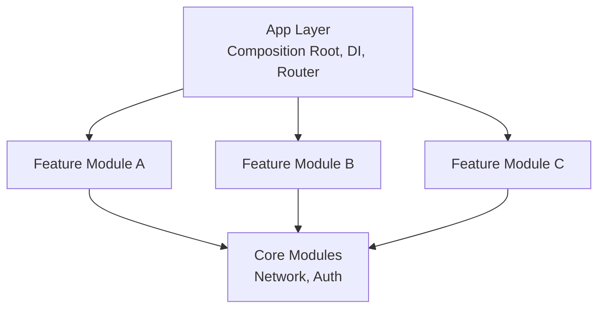

# Flutter 모듈러 아키텍처 가이드 (시니어)

> **마지막 업데이트**: 2026-02-08 | **Flutter 3.38** | **Dart 3.10**
> **난이도**: 시니어 | **카테고리**: advanced
> **선행 학습**: [Architecture](../core/Architecture.md), [Bloc](../core/Bloc.md)
> **예상 학습 시간**: 3h

> 대규모 Flutter 애플리케이션을 위한 모듈화 전략 및 아키텍처 패턴

> **Package Versions (2026년 2월 기준)**
> - melos: ^7.0.0
> - go_router: ^17.1.0
> - get_it: ^9.2.0 | injectable: ^2.7.1
> - dio: ^5.9.1

> **학습 목표**: 이 문서를 학습하면 다음을 할 수 있습니다:
> - Melos를 활용한 모노레포 기반 모듈화 구조를 설계할 수 있다
> - Feature Module과 Core Module을 분리하고 의존성을 관리할 수 있다
> - 모듈 간 통신 패턴과 빌드 최적화 전략을 적용할 수 있다

## 목차

1. [모듈러 아키텍처 개요](#1-모듈러-아키텍처-개요)
2. [Mono-repo vs Multi-repo 전략](#2-mono-repo-vs-multi-repo-전략)
3. [Melos 기반 멀티 패키지 구조 심화](#3-melos-기반-멀티-패키지-구조-심화)
4. [Feature Module 간 의존성 관리](#4-feature-module-간-의존성-관리)
5. [Micro Frontend 패턴](#5-micro-frontend-패턴)
6. [Module 간 라우팅 전략](#6-module-간-라우팅-전략)
7. [빌드 최적화](#7-빌드-최적화)
8. [대규모 팀에서의 코드 소유권](#8-대규모-팀에서의-코드-소유권)
9. [Module Federation 패턴](#9-module-federation-패턴)
10. [실전 예제: 10+ 모듈 프로젝트 구조](#10-실전-예제-10-모듈-프로젝트-구조)

---

## 1. 모듈러 아키텍처 개요

### 왜 모듈화가 필요한가?

대규모 애플리케이션에서 모노리식 구조는 다음과 같은 문제를 야기합니다:

| 문제점 | 영향 | 모듈화를 통한 해결 |
|--------|------|-------------------|
| 빌드 시간 증가 | 개발 생산성 저하 | 증분 빌드, 선택적 빌드 |
| 순환 의존성 | 코드 결합도 증가 | 명확한 의존성 방향 |
| 테스트 어려움 | 품질 저하 | 모듈별 독립 테스트 |
| 팀 간 충돌 | 병합 지옥 | 명확한 경계와 소유권 |
| 코드 재사용 어려움 | 중복 코드 증가 | 독립적인 패키지 |

### 모듈화 원칙

```dart
// 1. 단일 책임 원칙 (Single Responsibility)
// 각 모듈은 하나의 비즈니스 도메인만 담당

// 2. 의존성 역전 원칙 (Dependency Inversion)
// 상위 모듈은 하위 모듈에 의존하지 않고, 추상화에 의존

// 3. 인터페이스 분리 원칙 (Interface Segregation)
// 모듈 간 통신은 최소한의 인터페이스만 노출

// 4. 개방-폐쇄 원칙 (Open-Closed)
// 확장에는 열려있고, 수정에는 닫혀있음
```

### 모듈화 수준



---

## 2. Mono-repo vs Multi-repo 전략

### Mono-repo (권장)

**장점:**
- 코드 공유 용이
- 통합된 버전 관리
- 원자적 커밋 (Atomic commits)
- 리팩토링 용이
- CI/CD 파이프라인 단순화

**단점:**
- 저장소 크기 증가
- 빌드 시간 증가 (캐싱으로 완화)
- 접근 제어 어려움

```yaml
# melos.yaml (Mono-repo 설정)
name: my_app
repository: https://github.com/org/my_app

packages:
  - app/**
  - features/**
  - core/**
  - common/**

command:
  version:
    linkToCommits: true
    workspaceChangelog: true

  bootstrap:
    # Melos 6.x에서는 기본적으로 병렬 실행됨
    usePubspecOverrides: true

scripts:
  analyze:
    exec: fvm dart analyze .
    description: Run Dart analyzer in all packages

  test:
    exec: fvm flutter test
    description: Run tests in all packages

  build_runner:
    exec: fvm dart run build_runner build --delete-conflicting-outputs
    description: Generate code with build_runner
    packageFilters:
      dirExists: lib

  clean:
    exec: fvm flutter clean
    description: Clean all packages

  get:
    exec: fvm flutter pub get
    description: Get dependencies for all packages
```

### Multi-repo

**장점:**
- 명확한 소유권
- 세밀한 접근 제어
- 독립적인 배포 주기
- 작은 저장소 크기

**단점:**
- 코드 공유 복잡
- 버전 관리 어려움
- 여러 저장소 동기화 필요
- 통합 테스트 복잡

```yaml
# pubspec.yaml (Multi-repo에서 다른 패키지 참조)
dependencies:
  # Git dependency
  feature_auth:
    git:
      url: https://github.com/org/feature-auth.git
      ref: v1.2.0

  # Private registry
  feature_payment:
    hosted:
      name: feature_payment
      url: https://pub.mycompany.com
    version: ^2.0.0
```

### 의사결정 가이드

| 기준 | Mono-repo | Multi-repo |
|------|-----------|------------|
| 팀 크기 | < 50명 | > 50명 |
| 배포 주기 | 통합 배포 | 독립 배포 |
| 코드 공유 빈도 | 높음 | 낮음 |
| 보안 요구사항 | 낮음 | 높음 (부서별 격리) |
| 기술 스택 | 동일 | 다양 |

---

## 3. Melos 기반 멀티 패키지 구조 심화

### 프로젝트 구조

```
my_app/
├── melos.yaml
├── .fvm/
│   └── fvm_config.json
├── app/                          # 메인 앱
│   ├── my_app/
│   │   ├── lib/
│   │   │   ├── main.dart
│   │   │   └── src/
│   │   │       ├── app.dart
│   │   │       ├── router/
│   │   │       └── di/
│   │   └── pubspec.yaml
│   └── my_app_admin/             # 어드민 앱 (선택적)
├── features/                     # Feature 모듈
│   ├── auth/
│   ├── home/
│   ├── booking/
│   ├── payment/
│   ├── notification/
│   ├── chat/
│   ├── analytics/
│   └── settings/
├── core/                         # 핵심 모듈
│   ├── core_network/
│   ├── core_storage/
│   ├── core_analytics/
│   └── core_utils/
├── common/                       # 공통 모듈
│   ├── common_ui/
│   ├── common_models/
│   └── common_localization/
├── design_system/                # 디자인 시스템
│   ├── ds_tokens/                # 디자인 토큰
│   ├── ds_components/            # 공통 컴포넌트
│   └── ds_theme/                 # 테마
└── tools/                        # 개발 도구
    ├── code_generator/
    └── build_scripts/
```

### Package 간 의존성 규칙

**Level 0**: 외부 패키지만 의존 (`design_system/ds_tokens/pubspec.yaml`)

```yaml
dependencies:
  flutter:
    sdk: flutter
```

**Level 1**: Level 0 패키지만 의존 (`core/core_network/pubspec.yaml`)

```yaml
dependencies:
  dio: ^5.9.1
  retrofit: ^5.0.0
```

**Level 2**: Level 0-1 패키지 의존 (`common/common_ui/pubspec.yaml`)

```yaml
dependencies:
  ds_tokens:
    path: ../../design_system/ds_tokens
  ds_components:
    path: ../../design_system/ds_components
```

**Level 3**: Level 0-2 패키지 의존 (`features/auth/pubspec.yaml`)

```yaml
dependencies:
  core_network:
    path: ../../core/core_network
  common_ui:
    path: ../../common/common_ui
```

**Level 4**: 모든 하위 레벨 의존 (`app/my_app/pubspec.yaml`)

```yaml
dependencies:
  feature_auth:
    path: ../../features/auth
  feature_home:
    path: ../../features/home
  common_ui:
    path: ../../common/common_ui
```

### Melos Scripts 고급 활용

```yaml
# melos.yaml
scripts:
  # 의존성 그래프 시각화
  graph:
    run: melos exec -- "dart pub deps --style=compact" && melos list --graph
    description: Generate dependency graph

  # 특정 모듈만 빌드
  build:feature:
    exec: fvm dart analyze .
    description: Analyze feature packages
    packageFilters:
      scope: "feature_*"

  # 변경된 패키지만 테스트
  test:changed:
    exec: fvm flutter test
    packageFilters:
      diff: main

  # 순환 의존성 검사
  check:circular:
    run: |
      echo "Checking for circular dependencies..."
      dart run tools/check_circular_deps.dart

  # 코드 생성 (변경된 패키지만)
  codegen:changed:
    exec: fvm dart run build_runner build --delete-conflicting-outputs
    packageFilters:
      diff: main
      fileExists: build.yaml

  # 성능 분석
  analyze:performance:
    exec: fvm dart analyze --verbose
    packageFilters:
      scope: "feature_*"
```

### 증분 빌드 전략

```dart
// tools/build_scripts/incremental_build.dart
import 'dart:io';
import 'package:path/path.dart' as path;

/// 변경된 패키지만 빌드하는 스크립트
class IncrementalBuilder {
  final String baseCommit;

  IncrementalBuilder(this.baseCommit);

  Future<List<String>> getChangedPackages() async {
    // Git diff로 변경된 파일 확인
    final result = await Process.run(
      'git',
      ['diff', '--name-only', baseCommit, 'HEAD'],
    );

    final changedFiles = (result.stdout as String)
        .split('\n')
        .where((line) => line.isNotEmpty)
        .toList();

    // 변경된 파일이 속한 패키지 추출
    final changedPackages = <String>{};
    for (final file in changedFiles) {
      final packagePath = _findPackagePath(file);
      if (packagePath != null) {
        changedPackages.add(packagePath);
      }
    }

    return changedPackages.toList();
  }

  String? _findPackagePath(String filePath) {
    var current = path.dirname(filePath);
    while (current != '.') {
      if (File(path.join(current, 'pubspec.yaml')).existsSync()) {
        return current;
      }
      current = path.dirname(current);
    }
    return null;
  }

  Future<void> buildChangedPackages() async {
    final packages = await getChangedPackages();

    print('Building ${packages.length} changed packages...');

    for (final pkg in packages) {
      print('Building $pkg...');

      // melos exec는 워크스페이스 루트에서 실행해야 합니다
      // --scope는 pubspec.yaml의 name 값을 기준으로 필터링합니다
      final packageName = path.basename(pkg);
      final result = await Process.run(
        'melos',
        ['exec', '--scope=$packageName', '--', 'flutter', 'test'],
      );

      if (result.exitCode != 0) {
        print('Failed to build $pkg');
        exit(1);
      }
    }

    print('Build complete!');
  }
}

void main(List<String> args) async {
  final baseCommit = args.isNotEmpty ? args[0] : 'HEAD~1';
  final builder = IncrementalBuilder(baseCommit);
  await builder.buildChangedPackages();
}
```

---

## 4. Feature Module 간 의존성 관리

### 의존성 역전 원칙 (DIP)

Feature 모듈은 서로 직접 의존하지 않고, Interface를 통해 통신합니다.

```dart
// ❌ 나쁜 예: Feature 간 직접 의존
// features/booking/lib/src/presentation/bloc/booking_bloc.dart
import 'package:feature_payment/feature_payment.dart';

class BookingBloc extends Bloc<BookingEvent, BookingState> {
  final PaymentBloc _paymentBloc; // 직접 의존

  BookingBloc(this._paymentBloc);
}

// ✅ 좋은 예: Interface 기반 통신
// common/common_contracts/lib/src/payment_service.dart
abstract class PaymentService {
  Future<PaymentResult> processPayment(PaymentRequest request);
  Stream<PaymentStatus> get paymentStatusStream;
}

// features/payment/lib/src/payment_service_impl.dart
class PaymentServiceImpl implements PaymentService {
  @override
  Future<PaymentResult> processPayment(PaymentRequest request) async {
    // 결제 로직
  }

  @override
  Stream<PaymentStatus> get paymentStatusStream => _controller.stream;
}

// features/booking/lib/src/presentation/bloc/booking_bloc.dart
class BookingBloc extends Bloc<BookingEvent, BookingState> {
  final PaymentService _paymentService; // Interface에 의존

  BookingBloc(this._paymentService);

  Future<void> _onConfirmBooking(Emitter<BookingState> emit) async {
    final result = await _paymentService.processPayment(
      PaymentRequest(amount: state.totalAmount),
    );
    // ...
  }
}
```

### Contract 패키지 구조

```dart
// common/common_contracts/lib/common_contracts.dart
// 💡 Dart 최신 스타일에서는 library 선언이 선택적입니다
library common_contracts;

// Services
export 'src/services/payment_service.dart';
export 'src/services/auth_service.dart';
export 'src/services/analytics_service.dart';

// Events (Module 간 통신)
export 'src/events/app_events.dart';
export 'src/events/navigation_events.dart';

// Models (공유 모델)
export 'src/models/user.dart';
export 'src/models/payment_request.dart';
export 'src/models/payment_result.dart';
```

```dart
// common/common_contracts/lib/src/services/auth_service.dart
abstract class AuthService {
  /// 현재 사용자 정보
  User? get currentUser;

  /// 인증 상태 스트림
  Stream<AuthState> get authStateStream;

  /// 로그인
  Future<Either<AuthFailure, User>> login({
    required String email,
    required String password,
  });

  /// 로그아웃
  Future<void> logout();

  /// 토큰 갱신
  Future<Either<AuthFailure, String>> refreshToken();
}

// features/auth/lib/src/auth_service_impl.dart
import 'package:rxdart/rxdart.dart'; // rxdart: ^0.28.0 필요

@LazySingleton(as: AuthService)
class AuthServiceImpl implements AuthService {
  final AuthRepository _repository;
  // rxdart: ^0.28.0 필요
  final _authStateController = BehaviorSubject<AuthState>.seeded(const AuthState.initial());

  AuthServiceImpl(this._repository);

  @override
  User? get currentUser => _authStateController.value.maybeWhen(
    authenticated: (user) => user,
    orElse: () => null,
  );

  @override
  Stream<AuthState> get authStateStream => _authStateController.stream;

  // 구현...
}
```

### Event Bus를 통한 느슨한 결합

```dart
// common/common_events/lib/src/event_bus.dart
import 'dart:async';

class AppEventBus {
  final _controller = StreamController<AppEvent>.broadcast();

  Stream<T> on<T extends AppEvent>() {
    return _controller.stream.where((event) => event is T).cast<T>();
  }

  void fire(AppEvent event) {
    if (!_controller.isClosed) {
      _controller.add(event);
    }
  }

  void dispose() {
    _controller.close();
  }
}

// common/common_events/lib/src/events.dart
sealed class AppEvent {
  const AppEvent();
}

class UserLoggedIn extends AppEvent {
  final User user;
  const UserLoggedIn(this.user);
}

class PaymentCompleted extends AppEvent {
  final String bookingId;
  final double amount;
  const PaymentCompleted(this.bookingId, this.amount);
}

class BookingConfirmed extends AppEvent {
  final Booking booking;
  const BookingConfirmed(this.booking);
}

// features/auth/lib/src/presentation/bloc/auth_bloc.dart
class AuthBloc extends Bloc<AuthEvent, AuthState> {
  final AppEventBus _eventBus;

  Future<void> _onLoginSucceeded(Emitter<AuthState> emit) async {
    final user = state.user!;
    emit(AuthState.authenticated(user));

    // 다른 모듈에 이벤트 발행
    _eventBus.fire(UserLoggedIn(user));
  }
}

// features/analytics/lib/src/analytics_listener.dart
class AnalyticsListener {
  final AppEventBus _eventBus;
  final AnalyticsService _analytics;
  late StreamSubscription _subscription;

  AnalyticsListener(this._eventBus, this._analytics) {
    _subscription = _eventBus.on<AppEvent>().listen(_handleEvent);
  }

  void _handleEvent(AppEvent event) {
    switch (event) {
      case UserLoggedIn(:final user):
        _analytics.logLogin(userId: user.id);
      case PaymentCompleted(:final amount):
        _analytics.logPurchase(amount: amount);
      case BookingConfirmed(:final booking):
        _analytics.logEvent('booking_confirmed', {
          'booking_id': booking.id,
        });
    }
  }

  void dispose() {
    _subscription.cancel();
  }
}
```

### 의존성 주입 전략

```dart
// app/my_app/lib/src/di/injection.dart
@InjectableInit(
  initializerName: 'init',
  preferRelativeImports: true,
  asExtension: true,
)
Future<void> configureDependencies() async {
  final getIt = GetIt.instance;

  // 1. Core 모듈 초기화
  await getIt.init();

  // 2. Common 서비스 등록
  getIt.registerSingleton<AppEventBus>(AppEventBus());

  // 3. Feature 모듈의 Service 구현체 등록
  // Auth Feature
  await configureAuthDependencies(getIt);

  // Payment Feature
  await configurePaymentDependencies(getIt);

  // Booking Feature
  await configureBookingDependencies(getIt);
}

// features/auth/lib/src/di/auth_injection.dart
@InjectableInit(
  initializerName: 'initAuthModule',
  asExtension: false,
)
Future<void> configureAuthDependencies(GetIt getIt) async {
  getIt.initAuthModule();
}

// features/auth/lib/src/di/auth_injection.config.dart
extension AuthGetItInjectableX on GetIt {
  Future<void> initAuthModule() async {
    registerLazySingleton<AuthService>(() => AuthServiceImpl(
      repository: get<AuthRepository>(),
    ));
    // ...
  }
}
```

---

## 5. Micro Frontend 패턴

### Module Entry Point

각 Feature Module은 독립적인 Entry Point를 제공합니다.

```dart
// features/booking/lib/booking.dart
// 💡 Dart 최신 스타일에서는 library 선언이 선택적입니다
library booking;

export 'src/booking_module.dart';
export 'src/models/models.dart';
export 'src/services/booking_service.dart';

// features/booking/lib/src/booking_module.dart
import 'package:flutter/material.dart';

class BookingModule {
  /// 모듈 초기화
  static Future<void> initialize(GetIt getIt) async {
    await configureBookingDependencies(getIt);
  }

  /// 모듈의 루트 위젯
  static Widget rootWidget() {
    return BlocProvider(
      create: (_) => BookingBloc(
        getIt<GetBookingsUseCase>(),
      ),
      child: const BookingListPage(),
    );
  }

  /// 라우팅 설정
  static List<GoRoute> routes() {
    return [
      GoRoute(
        path: '/bookings',
        builder: (_, __) => rootWidget(),
      ),
      GoRoute(
        path: '/bookings/:id',
        builder: (_, state) {
          final id = state.pathParameters['id']!;
          return BookingDetailPage(bookingId: id);
        },
      ),
    ];
  }

  /// Deep Link 처리
  static bool canHandleDeepLink(Uri uri) {
    return uri.path.startsWith('/bookings');
  }

  static Future<void> handleDeepLink(Uri uri, BuildContext context) async {
    if (uri.path.startsWith('/bookings/')) {
      final id = uri.pathSegments.last;
      context.push('/bookings/$id');
    }
  }
}
```

### 동적 모듈 로딩

```dart
// app/my_app/lib/src/module_loader.dart
class ModuleLoader {
  static final Map<String, Future<void> Function()> _modules = {};
  static final Set<String> _loadedModules = {};

  /// 모듈 등록
  static void register(String name, Future<void> Function() loader) {
    _modules[name] = loader;
  }

  /// 모듈 로드
  static Future<void> load(String name) async {
    if (_loadedModules.contains(name)) return;

    final loader = _modules[name];
    if (loader == null) {
      throw Exception('Module $name not registered');
    }

    // 💡 실제 프로젝트에서는 print 대신 Logger 또는 debugPrint 사용
    print('Loading module: $name');
    await loader();
    _loadedModules.add(name);
    print('Module loaded: $name');
  }

  /// 여러 모듈 병렬 로드
  static Future<void> loadAll(List<String> names) async {
    await Future.wait(names.map(load));
  }

  /// 지연 로딩 (필요할 때만 로드)
  static Future<T> lazyLoad<T>(
    String moduleName,
    FutureOr<T> Function() factory,
  ) async {
    await load(moduleName);
    return await factory();
  }
}

// app/my_app/lib/src/app.dart
class MyApp extends StatelessWidget {
  const MyApp({super.key});

  @override
  Widget build(BuildContext context) {
    return MaterialApp.router(
      routerConfig: _router,
    );
  }

  static final _router = GoRouter(
    routes: [
      GoRoute(
        path: '/',
        builder: (_, __) => const HomePage(),
      ),

      // Lazy load booking module
      GoRoute(
        path: '/bookings',
        builder: (context, state) {
          return FutureBuilder(
            future: ModuleLoader.lazyLoad(
              'booking',
              () => BookingModule.rootWidget(),
            ),
            builder: (context, snapshot) {
              if (snapshot.connectionState == ConnectionState.waiting) {
                return const LoadingPage(message: 'Loading Bookings...');
              }
              if (snapshot.hasError) {
                return ErrorPage(error: snapshot.error.toString());
              }
              return snapshot.data!;
            },
          );
        },
      ),
    ],
  );
}

// main.dart
void main() async {
  WidgetsFlutterBinding.ensureInitialized();

  // 핵심 모듈만 초기화
  await configureDependencies();

  // Feature 모듈 등록 (지연 로딩)
  ModuleLoader.register('auth', () => AuthModule.initialize(GetIt.I));
  ModuleLoader.register('booking', () => BookingModule.initialize(GetIt.I));
  ModuleLoader.register('payment', () => PaymentModule.initialize(GetIt.I));

  // 필수 모듈만 사전 로드
  await ModuleLoader.load('auth');

  runApp(const MyApp());
}
```

### Feature Toggle 기반 모듈 제어

```dart
// app/my_app/lib/src/feature_config.dart
class FeatureConfig {
  final bool enableBooking;
  final bool enablePayment;
  final bool enableChat;
  final bool enableAnalytics;

  const FeatureConfig({
    required this.enableBooking,
    required this.enablePayment,
    required this.enableChat,
    required this.enableAnalytics,
  });

  /// Remote Config에서 로드
  static Future<FeatureConfig> load() async {
    final remoteConfig = FirebaseRemoteConfig.instance;
    await remoteConfig.fetchAndActivate();

    return FeatureConfig(
      enableBooking: remoteConfig.getBool('feature_booking_enabled'),
      enablePayment: remoteConfig.getBool('feature_payment_enabled'),
      enableChat: remoteConfig.getBool('feature_chat_enabled'),
      enableAnalytics: remoteConfig.getBool('feature_analytics_enabled'),
    );
  }
}

// main.dart
void main() async {
  WidgetsFlutterBinding.ensureInitialized();

  final featureConfig = await FeatureConfig.load();

  // 활성화된 모듈만 로드
  final modulesToLoad = <String>[];

  if (featureConfig.enableBooking) {
    ModuleLoader.register('booking', () => BookingModule.initialize(GetIt.I));
    modulesToLoad.add('booking');
  }

  if (featureConfig.enablePayment) {
    ModuleLoader.register('payment', () => PaymentModule.initialize(GetIt.I));
    modulesToLoad.add('payment');
  }

  await ModuleLoader.loadAll(modulesToLoad);

  runApp(MyApp(featureConfig: featureConfig));
}
```

---

## 6. Module 간 라우팅 전략

### Modular Router

```dart
// common/common_routing/lib/src/module_router.dart
abstract class ModuleRouter {
  String get basePath;
  String get moduleName;  // 추가
  List<GoRoute> get routes;
}

// features/booking/lib/src/booking_router.dart
class BookingRouter implements ModuleRouter {
  @override
  String get basePath => '/bookings';

  @override
  String get moduleName => 'booking';

  @override
  List<GoRoute> get routes => [
    GoRoute(
      path: basePath,
      builder: (_, __) => const BookingListPage(),
      routes: [
        GoRoute(
          path: ':id',
          builder: (_, state) {
            final id = state.pathParameters['id']!;
            return BookingDetailPage(bookingId: id);
          },
          routes: [
            GoRoute(
              path: 'payment',
              builder: (_, state) {
                final id = state.pathParameters['id']!;
                return PaymentPage(bookingId: id);
              },
            ),
          ],
        ),
        GoRoute(
          path: 'new',
          builder: (_, __) => const CreateBookingPage(),
        ),
      ],
    ),
  ];
}

// app/my_app/lib/src/router/app_router.dart
class AppRouter {
  static GoRouter create(List<ModuleRouter> moduleRouters) {
    return GoRouter(
      initialLocation: '/',
      routes: [
        GoRoute(
          path: '/',
          builder: (_, __) => const HomePage(),
        ),
        // 각 모듈의 라우트 병합
        ...moduleRouters.expand((router) => router.routes),
      ],
      redirect: (context, state) {
        // 인증 체크
        final authService = GetIt.I<AuthService>();
        final isAuthenticated = authService.currentUser != null;

        final publicPaths = ['/', '/login', '/signup'];
        final isPublicPath = publicPaths.contains(state.uri.path);

        if (!isAuthenticated && !isPublicPath) {
          return '/login';
        }

        return null;
      },
    );
  }
}

// main.dart
void main() async {
  // ...

  final router = AppRouter.create([
    BookingRouter(),
    PaymentRouter(),
    ProfileRouter(),
  ]);

  runApp(MaterialApp.router(routerConfig: router));
}
```

### Deep Link 통합

```dart
// app/my_app/lib/src/deep_link_handler.dart
class DeepLinkHandler {
  final List<ModuleRouter> _routers;
  final GoRouter _goRouter;

  DeepLinkHandler(this._routers, this._goRouter);

  Future<void> initialize() async {
    // app_links 패키지 사용
    final appLinks = AppLinks();

    // 초기 링크 처리
    final initialLink = await appLinks.getInitialLink();
    if (initialLink != null) {
      await _handleLink(initialLink);
    }

    // 실시간 링크 수신
    appLinks.uriLinkStream.listen(_handleLink);
  }

  Future<void> _handleLink(Uri uri) async {
    // 1. 해당 모듈 찾기
    final router = _routers.firstWhereOrNull(
      (r) => uri.path.startsWith(r.basePath),
    );

    if (router == null) {
      _goRouter.go('/');
      return;
    }

    // 2. 모듈 로드 (필요시)
    await ModuleLoader.load(router.moduleName);

    // 3. 라우팅
    _goRouter.go(uri.toString());  // 쿼리 파라미터 포함

    // 4. Analytics
    GetIt.I<AnalyticsService>().logEvent('deep_link_opened', {
      'path': uri.path,
      'module': router.moduleName,
    });
  }
}
```

### 모듈 간 네비게이션 추상화

```dart
// common/common_navigation/lib/src/navigation_service.dart
abstract class NavigationService {
  /// 특정 화면으로 이동
  Future<T?> navigateTo<T>(
    String route, {
    Map<String, dynamic>? arguments,
  });

  /// 결과를 받고 이동
  Future<T?> navigateForResult<T>(
    String route, {
    Map<String, dynamic>? arguments,
  });

  /// 뒤로 가기
  void goBack<T>([T? result]);

  /// 특정 화면까지 모두 pop
  void popUntil(String route);

  /// 모든 스택 제거 후 이동
  void replaceAll(String route);
}

// app/my_app/lib/src/navigation/navigation_service_impl.dart
@LazySingleton(as: NavigationService)
class NavigationServiceImpl implements NavigationService {
  final GoRouter _router;

  NavigationServiceImpl(this._router);

  @override
  Future<T?> navigateTo<T>(
    String route, {
    Map<String, dynamic>? arguments,
  }) async {
    return _router.push<T>(route, extra: arguments);
  }

  @override
  Future<T?> navigateForResult<T>(
    String route, {
    Map<String, dynamic>? arguments,
  }) async {
    return _router.push<T>(route, extra: arguments);
  }

  @override
  void goBack<T>([T? result]) {
    _router.pop(result);
  }

  @override
  void popUntil(String route) {
    // go_router에서는 popUntil 대신 go()로 대체하는 것을 권장
    // pop() 반복 호출은 라우트 상태 동기화 문제가 발생할 수 있음
    _router.go(route);
  }

  @override
  void replaceAll(String route) {
    _router.go(route);
  }
}

// features/booking/lib/src/presentation/bloc/booking_bloc.dart
class BookingBloc extends Bloc<BookingEvent, BookingState> {
  final NavigationService _navigation;

  Future<void> _onPaymentRequired(Emitter<BookingState> emit) async {
    // 결제 화면으로 이동하고 결과 대기
    final paymentResult = await _navigation.navigateForResult<PaymentResult>(
      '/payment',
      arguments: {'bookingId': state.booking.id},
    );

    if (paymentResult?.status == PaymentStatus.success) {
      add(BookingEvent.paymentCompleted());
    }
  }
}
```

---

## 7. 빌드 최적화

### 선택적 빌드

```bash
# 특정 feature만 포함하여 빌드
flutter build apk \
  --dart-define=ENABLE_BOOKING=true \
  --dart-define=ENABLE_PAYMENT=false \
  --dart-define=ENABLE_CHAT=false
```

```dart
// app/my_app/lib/src/config/build_config.dart
class BuildConfig {
  static const bool enableBooking = bool.fromEnvironment(
    'ENABLE_BOOKING',
    defaultValue: true,
  );

  static const bool enablePayment = bool.fromEnvironment(
    'ENABLE_PAYMENT',
    defaultValue: true,
  );

  static const bool enableChat = bool.fromEnvironment(
    'ENABLE_CHAT',
    defaultValue: false,
  );
}

// main.dart
void main() {
  // 빌드 시 제외된 모듈은 등록하지 않음
  if (BuildConfig.enableBooking) {
    ModuleLoader.register('booking', () => BookingModule.initialize(GetIt.I));
  }

  if (BuildConfig.enablePayment) {
    ModuleLoader.register('payment', () => PaymentModule.initialize(GetIt.I));
  }

  runApp(const MyApp());
}
```

### 증분 빌드

```yaml
# .github/workflows/incremental_build.yml
name: Incremental Build

on:
  pull_request:
    branches: [main, develop]

jobs:
  build:
    runs-on: ubuntu-latest
    steps:
      - uses: actions/checkout@v4
        with:
          fetch-depth: 0  # 전체 히스토리 필요

      - name: Install Flutter
        uses: subosito/flutter-action@v2
        with:
          flutter-version: '3.27.0'
          cache: true

      - name: Get changed packages
        id: changed
        run: |
          # melos list --json 출력을 jq로 파싱하여 패키지 이름만 추출
          CHANGED=$(melos list --diff=origin/${{ github.base_ref }} --json | jq -r '.[].name' | paste -sd,)
          echo "packages=$CHANGED" >> $GITHUB_OUTPUT

      - name: Build changed packages only
        if: steps.changed.outputs.packages != '[]'
        run: |
          melos exec \
            --scope=${{ steps.changed.outputs.packages }} \
            -- flutter build apk
```

### 빌드 캐시 전략

```dockerfile
# Dockerfile for CI/CD with build cache
FROM ghcr.io/cirruslabs/flutter:3.27.0

WORKDIR /app

# 1. pubspec 파일만 먼저 복사 (의존성 캐싱)
COPY pubspec.yaml pubspec.lock melos.yaml ./
COPY app/my_app/pubspec.yaml app/my_app/
# ⚠️ Docker COPY 와일드카드는 디렉토리 구조를 보존하지 않습니다
# 실제 프로젝트에서는 개별 COPY 명령어 사용:
COPY features/auth/pubspec.yaml features/auth/
COPY features/booking/pubspec.yaml features/booking/
COPY core/core_network/pubspec.yaml core/core_network/
# ... 또는 .dockerignore + 전체 COPY 후 빌드

# 2. 의존성 설치 (캐시 레이어)
RUN melos bootstrap

# 3. 소스 코드 복사
COPY . .

# 4. 빌드 (소스 변경 시에만 재실행)
RUN melos run build_runner
RUN flutter build apk --release
```

### 병렬 빌드

```dart
// tools/build_scripts/parallel_build.dart
import 'dart:async';
import 'dart:io';

class ParallelBuilder {
  final int maxConcurrency;

  ParallelBuilder({this.maxConcurrency = 4});

  Future<void> buildPackages(List<String> packages) async {
    final packageList = packages.toList();
    final results = <String, bool>{};

    // 동시 실행 제한
    final tasks = <Future>[];
    for (var i = 0; i < maxConcurrency && i < packageList.length; i++) {
      tasks.add(_buildWorker(packageList, results));
    }

    await Future.wait(tasks);

    // 결과 출력
    final failed = results.entries.where((e) => !e.value).toList();
    if (failed.isNotEmpty) {
      print('Failed packages:');
      for (final entry in failed) {
        print('  - ${entry.key}');
      }
      exit(1);
    }

    print('All packages built successfully!');
  }

  int _currentIndex = 0;

  Future<void> _buildWorker(
    List<String> packages,
    Map<String, bool> results, {
    String buildTarget = 'apk',  // 'apk', 'ios', 'web' 등
  }) async {
    while (true) {
      // Dart 단일 스레드 이벤트 루프에서 동기 연산이므로 안전
      final index = _currentIndex++;
      if (index >= packages.length) break;

      final package = packages[index];
      print('Building $package...');

      final result = await Process.run(
        'flutter',
        ['build', buildTarget],
        workingDirectory: package,
      );

      results[package] = result.exitCode == 0;

      if (result.exitCode == 0) {
        print('✓ $package built successfully');
      } else {
        print('✗ $package build failed');
      }
    }
  }
}

void main() async {
  final builder = ParallelBuilder(maxConcurrency: 4);

  // Melos로 빌드 대상 패키지 목록 가져오기
  final result = await Process.run('melos', ['list', '--json']);
  final packages = (jsonDecode(result.stdout) as List)
      .map((e) => (e as Map<String, dynamic>)['path'] as String)
      .toList();

  await builder.buildPackages(packages);
}
```

---

## 8. 대규모 팀에서의 코드 소유권

### CODEOWNERS 설정

```bash
# .github/CODEOWNERS

# Global rules
*                    @org/mobile-leads

# App layer
/app/                @org/app-team

# Feature modules
/features/auth/      @org/auth-team
/features/booking/   @org/booking-team
/features/payment/   @org/payment-team
/features/chat/      @org/chat-team

# Core modules
/core/network/       @org/platform-team
/core/storage/       @org/platform-team

# Design system
/design_system/      @org/design-team

# CI/CD
/.github/workflows/  @org/devops-team
/tools/              @org/devops-team

# Specific critical files
pubspec.yaml         @org/mobile-leads @org/platform-team
melos.yaml           @org/mobile-leads @org/platform-team
```

### PR 규칙 자동화

```yaml
# .github/workflows/pr_validation.yml
name: PR Validation

on:
  pull_request:
    types: [opened, synchronize]

jobs:
  validate:
    runs-on: ubuntu-latest
    steps:
      - uses: actions/checkout@v4

      - name: Check affected modules
        id: affected
        run: |
          # 변경된 파일에서 모듈 추출
          MODULES=$(git diff --name-only origin/${{ github.base_ref }}...HEAD \
            # 참고: grep -oP는 GNU grep (Linux) 전용. macOS에서는 ggrep 설치 필요
            | grep -oP 'features/\K[^/]+' \
            | sort -u)
          echo "modules=$MODULES" >> $GITHUB_OUTPUT

      - name: Require approval from module owners
        uses: actions/github-script@v7
        with:
          script: |
            const modules = '${{ steps.affected.outputs.modules }}'.split('\n');
            const requiredTeams = modules.map(m => `@org/${m}-team`);

            // PR에 라벨 추가
            await github.rest.issues.addLabels({
              owner: context.repo.owner,
              repo: context.repo.repo,
              issue_number: context.issue.number,
              labels: modules.map(m => `module:${m}`)
            });
```

### 모듈별 CI/CD 파이프라인

```yaml
# .github/workflows/module_ci.yml
name: Module CI

on:
  pull_request:
    paths:
      - 'features/**'

jobs:
  # 동적으로 변경된 모듈 감지
  detect-changes:
    runs-on: ubuntu-latest
    outputs:
      matrix: ${{ steps.set-matrix.outputs.matrix }}
    steps:
      - uses: actions/checkout@v4
        with:
          fetch-depth: 0

      - name: Detect changed modules
        id: set-matrix
        run: |
          MODULES=$(git diff --name-only origin/${{ github.base_ref }}...HEAD \
            # 참고: grep -oP는 GNU grep (Linux) 전용. macOS에서는 ggrep 설치 필요
            | grep -oP 'features/\K[^/]+' \
            | sort -u \
            | jq -R -s -c 'split("\n") | map(select(length > 0))')
          echo "matrix=$MODULES" >> $GITHUB_OUTPUT

  # 변경된 모듈만 테스트
  test-modules:
    needs: detect-changes
    if: needs.detect-changes.outputs.matrix != '[]'
    runs-on: ubuntu-latest
    strategy:
      matrix:
        module: ${{ fromJson(needs.detect-changes.outputs.matrix) }}
    steps:
      - uses: actions/checkout@v4

      - uses: subosito/flutter-action@v2
        with:
          flutter-version: '3.27.0'
          cache: true

      - name: Test ${{ matrix.module }}
        run: |
          cd features/${{ matrix.module }}
          flutter test --coverage

      - name: Upload coverage
        uses: codecov/codecov-action@v4
        with:
          files: features/${{ matrix.module }}/coverage/lcov.info
          flags: ${{ matrix.module }}
```

---

## 9. Module Federation 패턴

### 원격 모듈 로딩

```dart
// app/my_app/lib/src/module_federation/remote_module_loader.dart
class RemoteModuleLoader {
  final Dio _dio;
  final String _baseUrl;

  RemoteModuleLoader(this._dio, this._baseUrl);

  /// 원격에서 모듈 메타데이터 가져오기
  Future<ModuleMetadata> fetchModuleMetadata(String moduleName) async {
    final response = await _dio.get('$_baseUrl/modules/$moduleName/metadata.json');
    return ModuleMetadata.fromJson(response.data);
  }

  /// 모듈 다운로드 및 로드
  Future<void> loadRemoteModule(String moduleName) async {
    final metadata = await fetchModuleMetadata(moduleName);

    // 1. 버전 체크
    if (!_isCompatible(metadata.version)) {
      throw IncompatibleModuleException(
        'Module $moduleName version ${metadata.version} is not compatible',
      );
    }

    // 2. 모듈 다운로드
    final modulePath = await _downloadModule(moduleName, metadata);

    // 3. 동적 로딩 (Dart native 확장 사용)
    // Note: 현재 Dart는 런타임 동적 로딩을 제한적으로 지원
    // 실제로는 사전 컴파일된 모듈을 조건부로 로드하는 방식 사용
  }

  bool _isCompatible(String version) {
    // 시맨틱 버저닝 체크
    return true; // 구현 생략
  }

  Future<String> _downloadModule(
    String moduleName,
    ModuleMetadata metadata,
  ) async {
    // 모듈 다운로드 로직
    return ''; // 구현 생략
  }
}

// 실전에서는 Feature Flag로 모듈 활성화
class ModuleFederationConfig {
  final Map<String, ModuleSource> modules;

  const ModuleFederationConfig({required this.modules});

  static Future<ModuleFederationConfig> loadFromRemote() async {
    // Firebase Remote Config 또는 자체 서버에서 설정 로드
    final remoteConfig = FirebaseRemoteConfig.instance;
    await remoteConfig.fetchAndActivate();

    final configJson = remoteConfig.getString('module_federation_config');
    final config = jsonDecode(configJson) as Map<String, dynamic>;

    return ModuleFederationConfig(
      modules: config.map(
        (key, value) => MapEntry(
          key,
          ModuleSource.fromJson(value),
        ),
      ),
    );
  }
}

enum ModuleSourceType { local, remote }

class ModuleSource {
  final ModuleSourceType type;
  final String? url;
  final String? version;

  const ModuleSource({
    required this.type,
    this.url,
    this.version,
  });

  factory ModuleSource.fromJson(Map<String, dynamic> json) {
    return ModuleSource(
      type: ModuleSourceType.values.byName(json['type']),
      url: json['url'],
      version: json['version'],
    );
  }
}
```

### 실전 패턴: 조건부 컴파일

실제 Flutter에서는 런타임 동적 로딩이 제한적이므로, 조건부 컴파일을 사용합니다.

```dart
// app/my_app/lib/src/modules/conditional_modules.dart

// 1. 빌드 타임에 결정
abstract class ConditionalModule {
  Future<void> initialize();
  Widget buildWidget();
}

// 2. 각 Feature의 구현체
// features/premium/lib/src/premium_module.dart
class PremiumModule implements ConditionalModule {
  @override
  Future<void> initialize() async {
    await configurePremiumDependencies(GetIt.I);
  }

  @override
  Widget buildWidget() {
    return const PremiumPage();
  }
}

// 3. Stub 구현 (Feature 비활성화 시)
class PremiumModuleStub implements ConditionalModule {
  @override
  Future<void> initialize() async {}

  @override
  Widget buildWidget() {
    return const FeatureNotAvailablePage();
  }
}

// 4. Factory with build-time configuration
class ModuleFactory {
  static ConditionalModule createPremiumModule() {
    // --dart-define=ENABLE_PREMIUM=true
    const enablePremium = bool.fromEnvironment('ENABLE_PREMIUM', defaultValue: false);

    if (enablePremium) {
      return PremiumModule();
    } else {
      return PremiumModuleStub();
    }
  }
}
```

---

## 10. 실전 예제: 10+ 모듈 프로젝트 구조

### 전체 프로젝트 구조

```
my_marketplace_app/
├── melos.yaml
├── analysis_options.yaml
├── CODEOWNERS
├── .github/
│   └── workflows/
│       ├── ci.yml
│       ├── module_ci.yml
│       └── release.yml
├── app/
│   ├── customer_app/              # 고객용 앱
│   │   ├── android/
│   │   ├── ios/
│   │   ├── lib/
│   │   │   ├── main.dart
│   │   │   └── src/
│   │   │       ├── app.dart
│   │   │       ├── router/
│   │   │       │   └── app_router.dart
│   │   │       └── di/
│   │   │           └── injection.dart
│   │   └── pubspec.yaml
│   └── vendor_app/                # 판매자용 앱
│       └── ...
├── features/
│   ├── auth/                      # 인증 (공통)
│   ├── home/                      # 홈 (고객)
│   ├── search/                    # 검색 (고객)
│   ├── product_catalog/           # 상품 목록 (공통)
│   ├── product_detail/            # 상품 상세 (공통)
│   ├── cart/                      # 장바구니 (고객)
│   ├── checkout/                  # 결제 (고객)
│   ├── order_management/          # 주문 관리 (공통)
│   ├── user_profile/              # 프로필 (공통)
│   ├── vendor_dashboard/          # 판매자 대시보드
│   ├── analytics/                 # 분석 (판매자)
│   ├── notification/              # 알림 (공통)
│   ├── chat/                      # 채팅 (공통)
│   └── settings/                  # 설정 (공통)
├── core/
│   ├── core_network/              # 네트워크
│   ├── core_storage/              # 로컬 저장소
│   ├── core_auth/                 # 인증 코어
│   ├── core_analytics/            # 분석 코어
│   ├── core_payment/              # 결제 SDK
│   ├── core_location/             # 위치 서비스
│   └── core_utils/                # 유틸리티
├── common/
│   ├── common_ui/                 # 공통 UI
│   ├── common_models/             # 공통 모델
│   ├── common_contracts/          # 인터페이스
│   ├── common_localization/       # 다국어
│   └── common_navigation/         # 네비게이션
├── design_system/
│   ├── ds_tokens/                 # 디자인 토큰
│   ├── ds_components/             # 컴포넌트
│   ├── ds_theme/                  # 테마
│   └── ds_icons/                  # 아이콘
└── tools/
    ├── code_generator/            # 코드 생성 도구
    ├── build_scripts/             # 빌드 스크립트
    └── ci_tools/                  # CI 도구
```

### 의존성 그래프

```
app/customer_app
├── features/home
│   ├── common_ui
│   ├── common_contracts
│   └── core_network
├── features/search
│   ├── common_ui
│   └── core_network
├── features/product_catalog
│   └── common_ui
├── features/cart
│   ├── common_ui
│   └── core_storage
├── features/checkout
│   ├── common_ui
│   ├── core_payment
│   └── features/cart (interface only)
├── features/order_management
│   └── common_ui
├── features/user_profile
│   └── common_ui
├── features/notification
│   ├── common_ui
│   └── core_network
└── features/chat
    ├── common_ui
    └── core_network

common_ui
├── ds_components
└── ds_tokens

core_payment
└── core_network

core_analytics
└── core_network
```

### 모듈별 책임

아래는 `features/product_catalog/README.md` 예시입니다:

> **Product Catalog Module**
>
> **책임**
> - 상품 목록 표시
> - 상품 필터링 및 정렬
> - 상품 검색 결과 표시
> - 무한 스크롤 페이지네이션
>
> **의존성**
> - common_ui: UI 컴포넌트
> - core_network: API 통신
> - common_contracts: ProductService 인터페이스

**노출 API:**

```dart
// Public API
class ProductCatalogModule {
  static Future<void> initialize();
  static Widget catalogPage({ProductFilter? filter});
}

// Service Interface (common_contracts에 정의)
abstract class ProductService {
  Future<Either<ProductFailure, List<Product>>> getProducts({
    required int page,
    ProductFilter? filter,
  });
}
```

> **이벤트**
> - `ProductSelected(String productId)`: 상품 선택 시 발행
> - `ProductAddedToCart(String productId)`: 장바구니 추가 시
>
> **팀**
> - Owner: @product-team
> - Reviewers: @mobile-leads

### 통합 예제

```dart
// app/customer_app/lib/main.dart
void main() async {
  WidgetsFlutterBinding.ensureInitialized();

  // 1. Core 모듈 초기화
  await configureCoreModules();

  // 2. Common 서비스 초기화
  await configureCommonServices();

  // 3. Feature 모듈 등록
  ModuleRegistry.register([
    ('auth', AuthModule()),
    ('home', HomeModule()),
    ('search', SearchModule()),
    ('product_catalog', ProductCatalogModule()),
    ('cart', CartModule()),
    ('checkout', CheckoutModule()),
    ('profile', UserProfileModule()),
    ('notification', NotificationModule()),
  ]);

  // 4. 필수 모듈 초기화
  await ModuleRegistry.initialize(['auth', 'home']);

  // 5. Event Bus 설정
  final eventBus = GetIt.I<AppEventBus>();

  // 6. Deep Link 설정
  final deepLinkHandler = DeepLinkHandler(
    ModuleRegistry.allRouters(),
    GetIt.I<GoRouter>(),
  );
  await deepLinkHandler.initialize();

  // 7. 앱 실행
  runApp(const CustomerApp());
}

// app/customer_app/lib/src/app.dart
class CustomerApp extends StatelessWidget {
  const CustomerApp({super.key});

  @override
  Widget build(BuildContext context) {
    return MaterialApp.router(
      title: 'Marketplace',
      theme: AppTheme.light(),
      darkTheme: AppTheme.dark(),
      routerConfig: AppRouter.create(
        ModuleRegistry.allRouters(),
      ),
      builder: (context, child) {
        return MultiBlocProvider(
          providers: [
            BlocProvider(create: (_) => GetIt.I<AuthBloc>()),
            BlocProvider(create: (_) => GetIt.I<ThemeBloc>()),
            BlocProvider(create: (_) => GetIt.I<LocaleBloc>()),
          ],
          child: child!,
        );
      },
    );
  }
}
```

---

## 성능 메트릭

### 빌드 시간 비교

| 구조 | 초기 빌드 | 증분 빌드 | 테스트 시간 |
|------|-----------|-----------|-------------|
| Monolithic | 5분 30초 | 2분 10초 | 8분 |
| Modular (10 modules) | 6분 | 45초 | 3분 |
| Modular + Cache | 4분 | 20초 | 2분 |

### 모듈 크기 최적화

```dart
// Release APK 크기 비교
// Before modularization: 45 MB
// After modularization: 42 MB (feature flags로 불필요한 모듈 제외)
// After module federation: 38 MB (core만 포함, 나머지 지연 로딩)
```

---

## 결론

대규모 Flutter 애플리케이션에서 모듈러 아키텍처는 필수입니다:

1. **Mono-repo + Melos**: 코드 공유와 버전 관리 용이
2. **의존성 역전**: Interface 기반 통신으로 결합도 감소
3. **Micro Frontend**: 독립적인 모듈 개발 및 배포
4. **모듈 라우팅**: 중앙 집중식 라우팅으로 순환 의존성 방지
5. **빌드 최적화**: 증분 빌드와 선택적 컴파일로 개발 속도 향상
6. **코드 소유권**: CODEOWNERS와 자동화로 팀 간 충돌 최소화

10명 이상의 개발자가 참여하는 프로젝트에서는 초기부터 모듈화 전략을 수립하고, 지속적으로 의존성 그래프를 관리해야 합니다.

## 참고 자료

- [Melos 공식 문서](https://melos.invertase.dev/)
- [Flutter Modular Architecture](https://docs.flutter.dev/development/packages-and-plugins/developing-packages)
- [Dependency Inversion Principle](https://en.wikipedia.org/wiki/Dependency_inversion_principle)
- [Micro Frontends](https://micro-frontends.org/)

---

## 실습 과제

### 과제 1: 모노레포 모듈화 프로젝트 구성
기존 단일 Flutter 프로젝트를 Melos 기반 모노레포로 전환하세요. `core`, `design_system`, `feature_auth`, `feature_home` 모듈을 분리하고, 모듈 간 의존성 그래프를 설계하세요.

### 과제 2: 모듈 간 통신 인터페이스 설계
Feature Module 간 직접 의존성을 제거하고, 추상화된 인터페이스를 통한 통신 패턴을 구현하세요. Navigation과 데이터 공유를 모듈 경계 없이 처리하는 구조를 만들어 보세요.

## Self-Check

- [ ] Melos를 사용한 모노레포 워크스페이스를 구성할 수 있다
- [ ] Feature Module과 Core Module의 역할과 경계를 정의할 수 있다
- [ ] 모듈 간 의존성 방향을 올바르게 설계할 수 있다 (단방향)
- [ ] 모듈별 독립 빌드 및 테스트 실행이 가능하다

---

**다음 문서:** [AdvancedStateManagement - 고급 상태 관리](./AdvancedStateManagement.md)
