# Flutter 오프라인 우선 아키텍처

> **난이도**: 고급 | **카테고리**: advanced
> **선행 학습**: [LocalStorage](../infrastructure/LocalStorage.md)
> **예상 학습 시간**: 2h

> **학습 목표**: 이 문서를 학습하면 다음을 할 수 있습니다:
> - 오프라인 우선 아키텍처의 원리와 동기화 전략을 이해할 수 있다
> - 로컬 DB와 네트워크 데이터 간 충돌 해결 패턴을 구현할 수 있다
> - SyncQueue를 활용한 백그라운드 동기화를 구축할 수 있다

## 개요

오프라인 우선(Offline-First) 아키텍처는 네트워크 연결 없이도 앱이 완전히 동작하도록 설계하는 패턴입니다. 로컬 데이터를 먼저 사용하고, 네트워크가 가능할 때 동기화하여 사용자 경험을 극대화합니다.

## 설치 및 설정

### 의존성 추가

오프라인 우선 아키텍처에 필요한 핵심 패키지:

```yaml
# pubspec.yaml
dependencies:
  # 네트워크 상태 감지
  connectivity_plus: ^7.0.0  # 2026년 2월 기준 최신 버전

  # 상태 관리
  flutter_bloc: ^9.1.1
  freezed_annotation: ^3.1.0  # Dart 3.6 호환

  # UUID 생성
  uuid: ^4.0.0

  # 함수형 프로그래밍
  fpdart: ^1.2.0

  # 백그라운드 작업
  workmanager: ^0.9.0

dev_dependencies:
  freezed: ^3.2.5            # Dart 3.6 호환
  build_runner: ^2.11.0
```

> 📖 **로컬 데이터베이스 설정**:
> - **Drift, Hive, Isar Plus** 등 로컬 저장소 설정은 [LocalStorage.md](../infrastructure/LocalStorage.md) 참조
> - Drift (SQLite) 권장: 타입 안전한 쿼리, 마이그레이션, Stream 지원

## 오프라인 우선 아키텍처 개념

### 핵심 원칙

```mermaid
flowchart TD
    U["사용자 인터랙션"]
    L["로컬 데이터 - 우선<br/>즉각적인 응답<br/>오프라인에서도 동작<br/>낙관적 업데이트"]
    S["동기화 레이어<br/>변경사항 큐잉<br/>충돌 해결<br/>재시도 로직"]
    R["원격 서버"]
    U --> L
    L -->|백그라운드| S
    S --> R
```



### 데이터 흐름 전략

```dart
// lib/core/offline/offline_strategy.dart
enum OfflineStrategy {
  /// 로컬 우선: 항상 로컬 데이터 반환, 백그라운드 동기화
  localFirst,

  /// 네트워크 우선: 네트워크 시도 후 실패 시 로컬
  networkFirst,

  /// 캐시 전용: 로컬만 사용 (읽기 전용 데이터)
  cacheOnly,

  /// 네트워크 전용: 항상 네트워크 (실시간 데이터)
  networkOnly,

  /// Stale-While-Revalidate: 캐시 반환 후 백그라운드 갱신
  staleWhileRevalidate,
}
```

## 네트워크 상태 감지

### Connectivity Service

```dart
// lib/core/network/connectivity_service.dart
import 'dart:async';
import 'dart:io';

import 'package:connectivity_plus/connectivity_plus.dart';
import 'package:injectable/injectable.dart';

@lazySingleton
class ConnectivityService {
  final Connectivity _connectivity = Connectivity();

  StreamController<bool>? _connectionChangeController;
  bool _isConnected = true;

  /// 현재 연결 상태
  bool get isConnected => _isConnected;

  /// 연결 상태 변화 스트림
  Stream<bool> get onConnectivityChanged {
    _connectionChangeController ??= StreamController<bool>.broadcast();
    return _connectionChangeController!.stream;
  }

  /// 초기화
  Future<void> initialize() async {
    // 초기 상태 확인
    final results = await _connectivity.checkConnectivity();
    _isConnected = _hasConnection(results);

    // 상태 변화 구독
    _connectivity.onConnectivityChanged.listen((results) {
      final connected = _hasConnection(results);
      if (_isConnected != connected) {
        _isConnected = connected;
        _connectionChangeController?.add(connected);
      }
    });
  }

  /// 연결 여부 확인 (여러 연결 타입 지원)
  bool _hasConnection(List<ConnectivityResult> results) {
    return results.any((result) =>
        result == ConnectivityResult.wifi ||
        result == ConnectivityResult.mobile ||
        result == ConnectivityResult.ethernet);
  }

  /// 현재 연결 타입 조회
  Future<List<ConnectivityResult>> getConnectionTypes() async {
    return _connectivity.checkConnectivity();
  }

  /// 실제 인터넷 연결 확인 (서버 ping)
  Future<bool> hasInternetAccess() async {
    if (!_isConnected) return false;

    try {
      // 실제 서버에 요청하여 인터넷 접근 확인
      // DNS 확인만으로는 불충분할 수 있음
      final result = await InternetAddress.lookup('google.com')
          .timeout(const Duration(seconds: 5));
      return result.isNotEmpty && result[0].rawAddress.isNotEmpty;
    } catch (_) {
      return false;
    }
  }

  void dispose() {
    _connectionChangeController?.close();
  }
}
```

### Connectivity Bloc

```dart
// lib/core/network/connectivity_bloc.dart
import 'dart:async';

import 'package:flutter_bloc/flutter_bloc.dart';
import 'package:freezed_annotation/freezed_annotation.dart';

import 'connectivity_service.dart';

part 'connectivity_bloc.freezed.dart';

@freezed
class ConnectivityState with _$ConnectivityState {
  const factory ConnectivityState({
    required bool isConnected,
    required bool isChecking,
    DateTime? lastOnlineAt,
  }) = _ConnectivityState;

  factory ConnectivityState.initial() => const ConnectivityState(
        isConnected: true,
        isChecking: true,
      );
}

@freezed
class ConnectivityEvent with _$ConnectivityEvent {
  const factory ConnectivityEvent.started() = _Started;
  const factory ConnectivityEvent.changed(bool isConnected) = _Changed;
  const factory ConnectivityEvent.checked() = _Checked;
}

class ConnectivityBloc extends Bloc<ConnectivityEvent, ConnectivityState> {
  final ConnectivityService _connectivityService;
  StreamSubscription<bool>? _subscription;

  ConnectivityBloc({
    required ConnectivityService connectivityService,
  })  : _connectivityService = connectivityService,
        super(ConnectivityState.initial()) {
    on<ConnectivityEvent>((event, emit) async {
      await event.when(
        started: () => _onStarted(emit),
        changed: (isConnected) => _onChanged(isConnected, emit),
        checked: () => _onChecked(emit),
      );
    });
  }

  Future<void> _onStarted(Emitter<ConnectivityState> emit) async {
    await _connectivityService.initialize();

    emit(state.copyWith(
      isConnected: _connectivityService.isConnected,
      isChecking: false,
      lastOnlineAt: _connectivityService.isConnected ? DateTime.now() : null,
    ));

    _subscription = _connectivityService.onConnectivityChanged.listen(
      (isConnected) => add(ConnectivityEvent.changed(isConnected)),
    );
  }

  Future<void> _onChanged(
    bool isConnected,
    Emitter<ConnectivityState> emit,
  ) async {
    emit(state.copyWith(
      isConnected: isConnected,
      lastOnlineAt: isConnected ? DateTime.now() : state.lastOnlineAt,
    ));
  }

  Future<void> _onChecked(Emitter<ConnectivityState> emit) async {
    emit(state.copyWith(isChecking: true));

    final hasInternet = await _connectivityService.hasInternetAccess();

    emit(state.copyWith(
      isConnected: hasInternet,
      isChecking: false,
      lastOnlineAt: hasInternet ? DateTime.now() : state.lastOnlineAt,
    ));
  }

  @override
  Future<void> close() {
    _subscription?.cancel();
    return super.close();
  }
}
```

## 로컬 데이터 저장

> 📖 **데이터베이스 설정 참고:**
> - **Drift (SQLite)**: [LocalStorage.md](../infrastructure/LocalStorage.md#4-drift-sqlite) - 테이블 정의, DAO 패턴, CRUD, 마이그레이션
> - **Isar Plus (NoSQL)**: [LocalStorage.md](../infrastructure/LocalStorage.md#4-isar-plus-database) - Collection 정의, Database 설정, Repository 패턴
> - **Hive (Key-Value)**: [LocalStorage.md](../infrastructure/LocalStorage.md) - 경량 캐시 저장소

이 문서에서는 데이터베이스 설정 방법 대신, **오프라인 동기화에 필요한 공통 구조**만 다룹니다.

### 동기화 상태 정의

오프라인 우선 앱에서는 모든 로컬 데이터에 동기화 상태를 추적해야 합니다.

```dart
/// 데이터 동기화 상태 (Drift/Isar 공통)
enum SyncStatus {
  synced,    // 서버와 동기화됨
  pending,   // 동기화 대기 중
  failed,    // 동기화 실패
  conflict,  // 충돌 발생
}
```

### 동기화 큐 테이블 (Drift)

동기화 큐는 오프라인에서 발생한 변경사항을 서버에 순서대로 전달하기 위한 구조입니다.

```dart
// 동기화 큐 테이블 정의 (Drift)
class SyncQueue extends Table {
  IntColumn get id => integer().autoIncrement()();
  TextColumn get entityType => text()();
  TextColumn get entityId => text()();
  TextColumn get operation => text()();  // create, update, delete
  TextColumn get payload => text()();    // JSON 데이터
  DateTimeColumn get createdAt => dateTime()();
  IntColumn get retryCount => integer().withDefault(const Constant(0))();
  TextColumn get lastError => text().nullable()();

  @override
  Set<Column> get primaryKey => {id};
}
```

### 로컬 데이터 소스 인터페이스

DB에 관계없이 오프라인 우선 Repository가 의존할 공통 인터페이스입니다.

```dart
/// 오프라인 우선 로컬 데이터 소스 인터페이스 (DB-agnostic)
abstract class OfflineLocalDataSource<T> {
  Future<List<T>> getAll();
  Future<T?> getById(String id);
  Future<void> save(T entity);
  Future<void> saveAll(List<T> entities);
  Future<void> delete(String id);
  Future<List<T>> getBySyncStatus(SyncStatus status);
  Future<void> updateSyncStatus(String id, SyncStatus status);
  Stream<List<T>> watchAll();
}
```

> 💡 위 인터페이스를 Drift 또는 Isar Plus로 구현하세요. 구체적인 CRUD 구현은 각 DB 문서를 참조하세요.

## Repository 패턴 (오프라인 우선)

### Offline-First Repository

> **구현 예시:** 아래 코드는 Drift 기반 구현 예시입니다. Isar Plus나 다른 DB를 사용하는 경우 `OfflineLocalDataSource<T>` 인터페이스를 해당 DB로 구현하세요.

```dart
// lib/features/diary/data/repositories/diary_repository_impl.dart (Drift 기반 구현 예시)
import 'package:fpdart/fpdart.dart';
import 'package:injectable/injectable.dart';
import 'package:uuid/uuid.dart';

import '../../../../core/database/app_database.dart';  // Drift 기반
import '../../../../core/database/local_data_source.dart';  // Drift 기반
import '../../../../core/error/failure.dart';
import '../../../../core/network/connectivity_service.dart';
import '../../domain/entities/diary_entry.dart';
import '../../domain/repositories/diary_repository.dart';
import '../datasources/diary_remote_data_source.dart';
import '../models/diary_entry_model.dart';

@LazySingleton(as: DiaryRepository)
class DiaryRepositoryImpl implements DiaryRepository {
  final DiaryLocalDataSource _localDataSource;
  final DiaryRemoteDataSource _remoteDataSource;
  final ConnectivityService _connectivityService;
  final SyncQueueManager _syncQueue;

  DiaryRepositoryImpl(
    this._localDataSource,
    this._remoteDataSource,
    this._connectivityService,
    this._syncQueue,
  );

  @override
  Future<Either<Failure, List<DiaryEntry>>> getAll({
    bool forceRefresh = false,
  }) async {
    try {
      // 1. 로컬 데이터 먼저 반환
      final localData = await _localDataSource.getAll();

      if (localData.isNotEmpty && !forceRefresh) {
        // 백그라운드에서 동기화
        _syncInBackground();
        // 참고: Drift 테이블 데이터를 Entity로 변환하는 매퍼 필요
        // extension DiaryEntryDataExt on DiaryEntryData {
        //   DiaryEntry toEntity() => DiaryEntry(id: id, title: title, ...);
        // }
        return Right(localData.map((e) => e.toEntity()).toList());
      }

      // 2. 네트워크에서 가져오기 시도
      if (_connectivityService.isConnected) {
        try {
          final remoteData = await _remoteDataSource.getAll();

          // 로컬에 저장
          await _localDataSource.saveAll(
            remoteData.map((e) => e.toCompanion()).toList(),
          );

          return Right(remoteData.map((e) => e.toEntity()).toList());
        } on Exception catch (e) {
          // 네트워크 실패 시 로컬 데이터 반환
          if (localData.isNotEmpty) {
            return Right(localData.map((e) => e.toEntity()).toList());
          }
          return Left(Failure.network(message: e.toString()));
        }
      }

      // 3. 오프라인이면 로컬 데이터 반환
      return Right(localData.map((e) => e.toEntity()).toList());
    } catch (e) {
      return Left(Failure.unknown(message: e.toString()));
    }
  }

  @override
  Future<Either<Failure, DiaryEntry>> create(DiaryEntry entry) async {
    try {
      final id = const Uuid().v4();
      final now = DateTime.now();

      final newEntry = entry.copyWith(
        id: id,
        createdAt: now,
        updatedAt: now,
      );

      // 1. 로컬에 즉시 저장 (낙관적 업데이트)
      // 참고: Companion 클래스는 copyWith을 제공하지 않으므로
      // 직접 Companion 생성하거나 Model에서 syncStatus 포함하여 변환
      final companion = DiaryEntriesCompanion(
        id: Value(newEntry.id),
        title: Value(newEntry.title),
        content: Value(newEntry.content),
        createdAt: Value(newEntry.createdAt),
        updatedAt: Value(newEntry.updatedAt),
        syncStatus: Value(SyncStatus.pending),
      );
      await _localDataSource.save(companion);

      // 2. 동기화 큐에 추가
      await _syncQueue.enqueue(
        SyncOperation(
          entityType: 'diary',
          entityId: id,
          operation: OperationType.create,
          payload: DiaryEntryModel.fromEntity(newEntry).toJson(),
        ),
      );

      // 3. 온라인이면 즉시 동기화 시도
      if (_connectivityService.isConnected) {
        _syncQueue.processQueue();
      }

      return Right(newEntry);
    } catch (e) {
      return Left(Failure.unknown(message: e.toString()));
    }
  }

  @override
  Future<Either<Failure, DiaryEntry>> update(DiaryEntry entry) async {
    try {
      final updatedEntry = entry.copyWith(updatedAt: DateTime.now());

      // 1. 로컬 업데이트
      // 참고: Companion 클래스는 copyWith을 제공하지 않으므로
      // 직접 Companion 생성하거나 Model에서 syncStatus 포함하여 변환
      final companion = DiaryEntriesCompanion(
        id: Value(updatedEntry.id),
        title: Value(updatedEntry.title),
        content: Value(updatedEntry.content),
        createdAt: Value(updatedEntry.createdAt),
        updatedAt: Value(updatedEntry.updatedAt),
        syncStatus: Value(SyncStatus.pending),
      );
      await _localDataSource.save(companion);

      // 2. 동기화 큐에 추가
      await _syncQueue.enqueue(
        SyncOperation(
          entityType: 'diary',
          entityId: entry.id,
          operation: OperationType.update,
          payload: DiaryEntryModel.fromEntity(updatedEntry).toJson(),
        ),
      );

      // 3. 온라인이면 즉시 동기화 시도
      if (_connectivityService.isConnected) {
        _syncQueue.processQueue();
      }

      return Right(updatedEntry);
    } catch (e) {
      return Left(Failure.unknown(message: e.toString()));
    }
  }

  @override
  Future<Either<Failure, Unit>> delete(String id) async {
    try {
      // 1. 로컬에서 soft delete (실제 삭제는 동기화 후)
      await _localDataSource.updateSyncStatus(id, SyncStatus.pending);

      // 2. 동기화 큐에 삭제 작업 추가
      await _syncQueue.enqueue(
        SyncOperation(
          entityType: 'diary',
          entityId: id,
          operation: OperationType.delete,
          payload: '{"id": "$id"}',
        ),
      );

      // 3. 온라인이면 즉시 동기화 시도
      if (_connectivityService.isConnected) {
        _syncQueue.processQueue();
      }

      // 4. UI에서는 즉시 숨김 처리
      await _localDataSource.delete(id);

      return const Right(unit);
    } catch (e) {
      return Left(Failure.unknown(message: e.toString()));
    }
  }

  /// 백그라운드 동기화
  Future<void> _syncInBackground() async {
    if (!_connectivityService.isConnected) return;

    try {
      // 1. 서버에서 최신 데이터 가져오기
      final remoteData = await _remoteDataSource.getAll();

      // 2. 로컬의 synced 데이터와 병합
      final localPending = await _localDataSource.getBySyncStatus(
        SyncStatus.pending,
      );

      // 3. 로컬 pending 항목 제외하고 업데이트
      final pendingIds = localPending.map((e) => e.id).toSet();
      final toUpdate = remoteData
          .where((e) => !pendingIds.contains(e.id))
          .map((e) => e.toCompanion())
          .toList();

      await _localDataSource.saveAll(toUpdate);
    } catch (_) {
      // 백그라운드 동기화 실패는 무시
    }
  }
}
```

## 동기화 큐 시스템

### Sync Queue Manager

```dart
// lib/core/sync/sync_queue_manager.dart
import 'dart:async';
import 'dart:convert';

import 'package:drift/drift.dart';
import 'package:injectable/injectable.dart';

import '../database/app_database.dart';
import '../network/connectivity_service.dart';

enum OperationType { create, update, delete }

class SyncOperation {
  final String entityType;
  final String entityId;
  final OperationType operation;
  final String payload;
  final DateTime createdAt;
  final int retryCount;
  final String? lastError;

  SyncOperation({
    required this.entityType,
    required this.entityId,
    required this.operation,
    required this.payload,
    DateTime? createdAt,
    this.retryCount = 0,
    this.lastError,
  }) : createdAt = createdAt ?? DateTime.now();
}

@lazySingleton
class SyncQueueManager {
  final AppDatabase _db;
  final ConnectivityService _connectivityService;
  final Map<String, SyncHandler> _handlers = {};

  Timer? _retryTimer;
  bool _isProcessing = false;

  static const int maxRetries = 5;
  static const Duration retryDelay = Duration(minutes: 1);

  /// 동기화 상태 스트림
  final StreamController<SyncProgress> _progressController =
      StreamController<SyncProgress>.broadcast();
  Stream<SyncProgress> get progressStream => _progressController.stream;

  SyncQueueManager(this._db, this._connectivityService) {
    // 연결 복구 시 자동 동기화
    _connectivityService.onConnectivityChanged.listen((isConnected) {
      if (isConnected) {
        processQueue();
      }
    });
  }

  /// 핸들러 등록
  void registerHandler(String entityType, SyncHandler handler) {
    _handlers[entityType] = handler;
  }

  /// 큐에 작업 추가
  Future<void> enqueue(SyncOperation operation) async {
    await _db.into(_db.syncQueue).insert(
      SyncQueueCompanion.insert(
        entityType: operation.entityType,
        entityId: operation.entityId,
        operation: operation.operation.name,
        payload: operation.payload,
        createdAt: operation.createdAt,
      ),
    );
  }

  /// 대기 중인 작업 수
  Future<int> get pendingCount async {
    final count = await (_db.selectOnly(_db.syncQueue)
          ..addColumns([_db.syncQueue.id.count()]))
        .map((row) => row.read(_db.syncQueue.id.count()))
        .getSingle();
    return count ?? 0;
  }

  /// 큐 처리
  Future<void> processQueue() async {
    if (_isProcessing) return;
    if (!_connectivityService.isConnected) return;

    _isProcessing = true;

    try {
      final pending = await (_db.select(_db.syncQueue)
            ..orderBy([(t) => OrderingTerm.asc(t.createdAt)])
            ..where((t) => t.retryCount.isSmallerThan(Variable(maxRetries))))
          .get();

      if (pending.isEmpty) {
        _progressController.add(SyncProgress(
          total: 0,
          completed: 0,
          status: SyncProgressStatus.idle,
        ));
        return;
      }

      _progressController.add(SyncProgress(
        total: pending.length,
        completed: 0,
        status: SyncProgressStatus.syncing,
      ));

      int completed = 0;

      for (final op in pending) {
        final handler = _handlers[op.entityType];
        if (handler == null) {
          await _markFailed(op.id, 'No handler registered for ${op.entityType}');
          continue;
        }

        try {
          await _executeOperation(op, handler);
          await _removeFromQueue(op.id);
          completed++;

          _progressController.add(SyncProgress(
            total: pending.length,
            completed: completed,
            status: SyncProgressStatus.syncing,
          ));
        } on ConflictException catch (e) {
          await _handleConflict(op, e);
        } catch (e) {
          await _incrementRetry(op.id, e.toString());
        }
      }

      _progressController.add(SyncProgress(
        total: pending.length,
        completed: completed,
        status: completed == pending.length
            ? SyncProgressStatus.completed
            : SyncProgressStatus.partiallyCompleted,
      ));
    } finally {
      _isProcessing = false;
      _scheduleRetry();
    }
  }

  Future<void> _executeOperation(
    SyncQueueData op,
    SyncHandler handler,
  ) async {
    final operationType = OperationType.values.byName(op.operation);
    final payload = jsonDecode(op.payload) as Map<String, dynamic>;

    switch (operationType) {
      case OperationType.create:
        await handler.onCreate(op.entityId, payload);
      case OperationType.update:
        await handler.onUpdate(op.entityId, payload);
      case OperationType.delete:
        await handler.onDelete(op.entityId);
    }
  }

  Future<void> _removeFromQueue(int id) async {
    await (_db.delete(_db.syncQueue)..where((t) => t.id.equals(id))).go();
  }

  Future<void> _incrementRetry(int id, String error) async {
    // 먼저 현재 값을 읽고 증가
    final current = await (_db.select(_db.syncQueue)
          ..where((t) => t.id.equals(id)))
        .getSingle();

    await (_db.update(_db.syncQueue)..where((t) => t.id.equals(id))).write(
      SyncQueueCompanion(
        retryCount: Value(current.retryCount + 1),
        lastError: Value(error),
      ),
    );
  }

  Future<void> _markFailed(int id, String error) async {
    await (_db.update(_db.syncQueue)..where((t) => t.id.equals(id))).write(
      SyncQueueCompanion(
        retryCount: const Value(maxRetries),
        lastError: Value(error),
      ),
    );
  }

  Future<void> _handleConflict(SyncQueueData op, ConflictException e) async {
    // 충돌 처리는 별도 로직 필요
    await _markFailed(op.id, 'Conflict: ${e.message}');
  }

  void _scheduleRetry() {
    _retryTimer?.cancel();
    _retryTimer = Timer(retryDelay, () {
      if (_connectivityService.isConnected) {
        processQueue();
      }
    });
  }

  void dispose() {
    _retryTimer?.cancel();
    _progressController.close();
  }
}

/// 엔티티별 동기화 핸들러 인터페이스
abstract class SyncHandler {
  Future<void> onCreate(String entityId, Map<String, dynamic> payload);
  Future<void> onUpdate(String entityId, Map<String, dynamic> payload);
  Future<void> onDelete(String entityId);
}

class SyncProgress {
  final int total;
  final int completed;
  final SyncProgressStatus status;
  final String? error;

  SyncProgress({
    required this.total,
    required this.completed,
    required this.status,
    this.error,
  });

  double get progress => total == 0 ? 0 : completed / total;
}

/// 동기화 진행 상태 (Entity용 SyncStatus와 구분)
enum SyncProgressStatus {
  idle,
  syncing,
  completed,
  partiallyCompleted,
  failed,
}

class ConflictException implements Exception {
  final String message;
  final dynamic localData;
  final dynamic remoteData;

  ConflictException(this.message, {this.localData, this.remoteData});
}
```

### Diary Sync Handler

```dart
// lib/features/diary/data/sync/diary_sync_handler.dart
import 'package:injectable/injectable.dart';

import '../../../../core/sync/sync_queue_manager.dart';
import '../datasources/diary_remote_data_source.dart';
import '../models/diary_entry_model.dart';

@lazySingleton
class DiarySyncHandler implements SyncHandler {
  final DiaryRemoteDataSource _remoteDataSource;

  DiarySyncHandler(this._remoteDataSource);

  @override
  Future<void> onCreate(String entityId, Map<String, dynamic> payload) async {
    final model = DiaryEntryModel.fromJson(payload);
    await _remoteDataSource.create(model);
  }

  @override
  Future<void> onUpdate(String entityId, Map<String, dynamic> payload) async {
    final model = DiaryEntryModel.fromJson(payload);

    // 서버의 현재 버전 확인
    final remote = await _remoteDataSource.getById(entityId);

    if (remote != null && remote.updatedAt.isAfter(model.updatedAt)) {
      throw ConflictException(
        'Server has newer version',
        localData: model,
        remoteData: remote,
      );
    }

    await _remoteDataSource.update(model);
  }

  @override
  Future<void> onDelete(String entityId) async {
    await _remoteDataSource.delete(entityId);
  }
}
```

## 충돌 해결

### Conflict Resolver

```dart
// lib/core/sync/conflict_resolver.dart
import 'package:freezed_annotation/freezed_annotation.dart';

part 'conflict_resolver.freezed.dart';

/// 충돌 해결 전략
enum ConflictResolutionStrategy {
  /// 서버 데이터 우선
  serverWins,

  /// 클라이언트 데이터 우선
  clientWins,

  /// 최신 타임스탬프 우선
  lastWriteWins,

  /// 사용자에게 선택 요청
  manual,

  /// 필드별 병합
  merge,
}

@freezed
class ConflictInfo<T> with _$ConflictInfo<T> {
  const factory ConflictInfo({
    required String entityId,
    required T localData,
    required T remoteData,
    required DateTime localUpdatedAt,
    required DateTime remoteUpdatedAt,
  }) = _ConflictInfo<T>;
}

@freezed
class ConflictResolution<T> with _$ConflictResolution<T> {
  const factory ConflictResolution.resolved(T data) = _Resolved<T>;
  const factory ConflictResolution.needsManualReview(ConflictInfo<T> conflict) =
      _NeedsManualReview<T>;
}

abstract class ConflictResolver<T> {
  final ConflictResolutionStrategy strategy;

  ConflictResolver(this.strategy);

  ConflictResolution<T> resolve(ConflictInfo<T> conflict) {
    switch (strategy) {
      case ConflictResolutionStrategy.serverWins:
        return ConflictResolution.resolved(conflict.remoteData);

      case ConflictResolutionStrategy.clientWins:
        return ConflictResolution.resolved(conflict.localData);

      case ConflictResolutionStrategy.lastWriteWins:
        if (conflict.localUpdatedAt.isAfter(conflict.remoteUpdatedAt)) {
          return ConflictResolution.resolved(conflict.localData);
        } else {
          return ConflictResolution.resolved(conflict.remoteData);
        }

      case ConflictResolutionStrategy.manual:
        return ConflictResolution.needsManualReview(conflict);

      case ConflictResolutionStrategy.merge:
        return ConflictResolution.resolved(mergeData(conflict));
    }
  }

  /// 필드별 병합 로직 (서브클래스에서 구현)
  T mergeData(ConflictInfo<T> conflict);
}

/// 일기 엔티티 충돌 해결기
class DiaryConflictResolver extends ConflictResolver<DiaryEntry> {
  DiaryConflictResolver([
    ConflictResolutionStrategy strategy = ConflictResolutionStrategy.lastWriteWins,
  ]) : super(strategy);

  @override
  DiaryEntry mergeData(ConflictInfo<DiaryEntry> conflict) {
    final local = conflict.localData;
    final remote = conflict.remoteData;

    // 필드별로 최신 값 선택
    return local.copyWith(
      title: conflict.localUpdatedAt.isAfter(conflict.remoteUpdatedAt)
          ? local.title
          : remote.title,
      content: conflict.localUpdatedAt.isAfter(conflict.remoteUpdatedAt)
          ? local.content
          : remote.content,
      // 태그는 합집합
      tags: {...local.tags, ...remote.tags}.toList(),
      // 최신 타임스탬프 사용
      updatedAt: conflict.localUpdatedAt.isAfter(conflict.remoteUpdatedAt)
          ? conflict.localUpdatedAt
          : conflict.remoteUpdatedAt,
    );
  }
}
```

### Conflict Resolution UI

```dart
// lib/core/sync/widgets/conflict_resolution_dialog.dart
import 'package:flutter/material.dart';

import '../conflict_resolver.dart';

class ConflictResolutionDialog<T> extends StatelessWidget {
  final ConflictInfo<T> conflict;
  final Widget Function(T data) dataPreviewBuilder;

  const ConflictResolutionDialog({
    super.key,
    required this.conflict,
    required this.dataPreviewBuilder,
  });

  @override
  Widget build(BuildContext context) {
    return AlertDialog(
      title: const Text('데이터 충돌'),
      content: SingleChildScrollView(
        child: Column(
          mainAxisSize: MainAxisSize.min,
          crossAxisAlignment: CrossAxisAlignment.start,
          children: [
            const Text(
              '동일한 항목이 다른 기기에서 수정되었습니다. '
              '어떤 버전을 유지하시겠습니까?',
            ),
            const SizedBox(height: 16),

            // 로컬 버전
            Card(
              child: Padding(
                padding: const EdgeInsets.all(12),
                child: Column(
                  crossAxisAlignment: CrossAxisAlignment.start,
                  children: [
                    Row(
                      children: [
                        const Icon(Icons.phone_android, size: 16),
                        const SizedBox(width: 4),
                        Text(
                          '이 기기 버전',
                          style: Theme.of(context).textTheme.titleSmall,
                        ),
                        const Spacer(),
                        Text(
                          _formatDate(conflict.localUpdatedAt),
                          style: Theme.of(context).textTheme.bodySmall,
                        ),
                      ],
                    ),
                    const Divider(),
                    dataPreviewBuilder(conflict.localData),
                  ],
                ),
              ),
            ),

            const SizedBox(height: 8),

            // 서버 버전
            Card(
              child: Padding(
                padding: const EdgeInsets.all(12),
                child: Column(
                  crossAxisAlignment: CrossAxisAlignment.start,
                  children: [
                    Row(
                      children: [
                        const Icon(Icons.cloud, size: 16),
                        const SizedBox(width: 4),
                        Text(
                          '서버 버전',
                          style: Theme.of(context).textTheme.titleSmall,
                        ),
                        const Spacer(),
                        Text(
                          _formatDate(conflict.remoteUpdatedAt),
                          style: Theme.of(context).textTheme.bodySmall,
                        ),
                      ],
                    ),
                    const Divider(),
                    dataPreviewBuilder(conflict.remoteData),
                  ],
                ),
              ),
            ),
          ],
        ),
      ),
      actions: [
        TextButton(
          onPressed: () => Navigator.pop(context, conflict.localData),
          child: const Text('이 기기 버전 유지'),
        ),
        TextButton(
          onPressed: () => Navigator.pop(context, conflict.remoteData),
          child: const Text('서버 버전 사용'),
        ),
      ],
    );
  }

  String _formatDate(DateTime date) {
    return '${date.month}/${date.day} ${date.hour}:${date.minute.toString().padLeft(2, '0')}';
  }
}

/// 충돌 해결 다이얼로그 표시
Future<T?> showConflictDialog<T>({
  required BuildContext context,
  required ConflictInfo<T> conflict,
  required Widget Function(T data) dataPreviewBuilder,
}) {
  return showDialog<T>(
    context: context,
    barrierDismissible: false,
    builder: (context) => ConflictResolutionDialog(
      conflict: conflict,
      dataPreviewBuilder: dataPreviewBuilder,
    ),
  );
}
```

## Bloc 통합

### Sync State

```dart
// lib/core/sync/bloc/sync_state.dart
import 'package:freezed_annotation/freezed_annotation.dart';

import '../sync_queue_manager.dart';

part 'sync_state.freezed.dart';

@freezed
class SyncState with _$SyncState {
  const factory SyncState({
    @Default(true) bool isOnline,
    @Default(0) int pendingChanges,
    @Default(SyncProgressStatus.idle) SyncProgressStatus status,
    @Default(0.0) double progress,
    DateTime? lastSyncedAt,
    String? error,
    @Default([]) List<ConflictInfo<DiaryEntry>> pendingConflicts,
  }) = _SyncState;

  const SyncState._();

  bool get hasPendingChanges => pendingChanges > 0;
  bool get isSyncing => status == SyncProgressStatus.syncing;
  bool get hasConflicts => pendingConflicts.isNotEmpty;
}
```

### Sync Event

```dart
// lib/core/sync/bloc/sync_event.dart
import 'package:freezed_annotation/freezed_annotation.dart';

part 'sync_event.freezed.dart';

@freezed
class SyncEvent with _$SyncEvent {
  /// 초기화
  const factory SyncEvent.started() = _Started;

  /// 연결 상태 변경
  const factory SyncEvent.connectivityChanged(bool isOnline) = _ConnectivityChanged;

  /// 수동 동기화 요청
  const factory SyncEvent.syncRequested() = _SyncRequested;

  /// 동기화 진행 상황 업데이트
  const factory SyncEvent.progressUpdated(double progress) = _ProgressUpdated;

  /// 동기화 완료
  const factory SyncEvent.completed(DateTime syncedAt) = _Completed;

  /// 동기화 실패
  const factory SyncEvent.failed(String error) = _Failed;

  /// 펜딩 변경사항 업데이트
  const factory SyncEvent.pendingChanged(int count) = _PendingChanged;

  /// 충돌 발생
  const factory SyncEvent.conflictDetected(ConflictInfo conflict) = _ConflictDetected;

  /// 충돌 해결됨
  const factory SyncEvent.conflictResolved(String entityId) = _ConflictResolved;
}
```

### Sync Bloc

```dart
// lib/core/sync/bloc/sync_bloc.dart
import 'dart:async';

import 'package:flutter_bloc/flutter_bloc.dart';

import '../../network/connectivity_service.dart';
import '../sync_queue_manager.dart';
import 'sync_event.dart';
import 'sync_state.dart';

class SyncBloc extends Bloc<SyncEvent, SyncState> {
  final ConnectivityService _connectivityService;
  final SyncQueueManager _syncQueueManager;

  StreamSubscription<bool>? _connectivitySubscription;
  StreamSubscription<SyncProgress>? _syncProgressSubscription;

  SyncBloc({
    required ConnectivityService connectivityService,
    required SyncQueueManager syncQueueManager,
  })  : _connectivityService = connectivityService,
        _syncQueueManager = syncQueueManager,
        super(const SyncState()) {
    on<SyncEvent>((event, emit) async {
      await event.when(
        started: () => _onStarted(emit),
        connectivityChanged: (isOnline) => _onConnectivityChanged(isOnline, emit),
        syncRequested: () => _onSyncRequested(emit),
        progressUpdated: (progress) => _onProgressUpdated(progress, emit),
        completed: (syncedAt) => _onCompleted(syncedAt, emit),
        failed: (error) => _onFailed(error, emit),
        pendingChanged: (count) => _onPendingChanged(count, emit),
        conflictDetected: (conflict) => _onConflictDetected(conflict, emit),
        conflictResolved: (entityId) => _onConflictResolved(entityId, emit),
      );
    });
  }

  Future<void> _onStarted(Emitter<SyncState> emit) async {
    // 초기 연결 상태
    emit(state.copyWith(isOnline: _connectivityService.isConnected));

    // 연결 상태 구독
    _connectivitySubscription = _connectivityService.onConnectivityChanged.listen(
      (isOnline) => add(SyncEvent.connectivityChanged(isOnline)),
    );

    // 동기화 진행 상황 구독
    _syncProgressSubscription = _syncQueueManager.progressStream.listen(
      (progress) {
        add(SyncEvent.progressUpdated(progress.progress));
        if (progress.status == SyncProgressStatus.completed) {
          add(SyncEvent.completed(DateTime.now()));
        } else if (progress.status == SyncProgressStatus.failed) {
          add(SyncEvent.failed(progress.error ?? 'Unknown error'));
        }
      },
    );

    // 초기 펜딩 카운트
    final pendingCount = await _syncQueueManager.pendingCount;
    add(SyncEvent.pendingChanged(pendingCount));

    // 온라인이면 동기화 시작
    if (_connectivityService.isConnected) {
      _syncQueueManager.processQueue();
    }
  }

  Future<void> _onConnectivityChanged(
    bool isOnline,
    Emitter<SyncState> emit,
  ) async {
    emit(state.copyWith(isOnline: isOnline));

    if (isOnline && state.pendingChanges > 0) {
      _syncQueueManager.processQueue();
    }
  }

  Future<void> _onSyncRequested(Emitter<SyncState> emit) async {
    if (!state.isOnline) {
      emit(state.copyWith(error: '오프라인 상태에서는 동기화할 수 없습니다'));
      return;
    }

    emit(state.copyWith(status: SyncProgressStatus.syncing, error: null));
    _syncQueueManager.processQueue();
  }

  Future<void> _onProgressUpdated(
    double progress,
    Emitter<SyncState> emit,
  ) async {
    emit(state.copyWith(
      progress: progress,
      status: SyncProgressStatus.syncing,
    ));
  }

  Future<void> _onCompleted(
    DateTime syncedAt,
    Emitter<SyncState> emit,
  ) async {
    emit(state.copyWith(
      status: SyncProgressStatus.completed,
      lastSyncedAt: syncedAt,
      pendingChanges: 0,
      progress: 1.0,
    ));
  }

  Future<void> _onFailed(
    String error,
    Emitter<SyncState> emit,
  ) async {
    emit(state.copyWith(
      status: SyncProgressStatus.failed,
      error: error,
    ));
  }

  Future<void> _onPendingChanged(
    int count,
    Emitter<SyncState> emit,
  ) async {
    emit(state.copyWith(pendingChanges: count));
  }

  Future<void> _onConflictDetected(
    ConflictInfo conflict,
    Emitter<SyncState> emit,
  ) async {
    emit(state.copyWith(
      pendingConflicts: [...state.pendingConflicts, conflict],
    ));
  }

  Future<void> _onConflictResolved(
    String entityId,
    Emitter<SyncState> emit,
  ) async {
    emit(state.copyWith(
      pendingConflicts: state.pendingConflicts
          .where((c) => c.entityId != entityId)
          .toList(),
    ));
  }

  @override
  Future<void> close() {
    _connectivitySubscription?.cancel();
    _syncProgressSubscription?.cancel();
    return super.close();
  }
}
```

## UI/UX 패턴

### 오프라인 상태 배너

```dart
// lib/core/widgets/offline_banner.dart
import 'package:flutter/material.dart';
import 'package:flutter_bloc/flutter_bloc.dart';

import '../sync/bloc/sync_bloc.dart';
import '../sync/bloc/sync_state.dart';

class OfflineBanner extends StatelessWidget {
  const OfflineBanner({super.key});

  @override
  Widget build(BuildContext context) {
    return BlocBuilder<SyncBloc, SyncState>(
      buildWhen: (previous, current) =>
          previous.isOnline != current.isOnline,
      builder: (context, state) {
        if (state.isOnline) return const SizedBox.shrink();

        return Material(
          color: Colors.grey[800],
          child: SafeArea(
            bottom: false,
            child: Container(
              padding: const EdgeInsets.symmetric(
                horizontal: 16,
                vertical: 8,
              ),
              child: Row(
                children: [
                  Icon(
                    Icons.cloud_off,
                    size: 16,
                    color: Colors.grey[300],
                  ),
                  const SizedBox(width: 8),
                  Text(
                    '오프라인 모드',
                    style: TextStyle(
                      color: Colors.grey[300],
                      fontSize: 13,
                    ),
                  ),
                  const Spacer(),
                  if (state.lastSyncedAt != null)
                    Text(
                      '마지막 동기화: ${_formatLastSync(state.lastSyncedAt!)}',
                      style: TextStyle(
                        color: Colors.grey[400],
                        fontSize: 12,
                      ),
                    ),
                ],
              ),
            ),
          ),
        );
      },
    );
  }

  String _formatLastSync(DateTime lastSync) {
    final now = DateTime.now();
    final diff = now.difference(lastSync);

    if (diff.inMinutes < 1) return '방금 전';
    if (diff.inMinutes < 60) return '${diff.inMinutes}분 전';
    if (diff.inHours < 24) return '${diff.inHours}시간 전';
    return '${diff.inDays}일 전';
  }
}
```

### 동기화 상태 표시

```dart
// lib/core/widgets/sync_status_indicator.dart
import 'package:flutter/material.dart';
import 'package:flutter_bloc/flutter_bloc.dart';

import '../sync/bloc/sync_bloc.dart';
import '../sync/bloc/sync_state.dart';
import '../sync/sync_queue_manager.dart';

class SyncStatusIndicator extends StatelessWidget {
  const SyncStatusIndicator({super.key});

  @override
  Widget build(BuildContext context) {
    return BlocBuilder<SyncBloc, SyncState>(
      builder: (context, state) {
        return GestureDetector(
          onTap: () => _showSyncDetails(context, state),
          child: Container(
            padding: const EdgeInsets.symmetric(horizontal: 8, vertical: 4),
            decoration: BoxDecoration(
              color: _getBackgroundColor(state),
              borderRadius: BorderRadius.circular(12),
            ),
            child: Row(
              mainAxisSize: MainAxisSize.min,
              children: [
                _buildIcon(state),
                if (state.pendingChanges > 0) ...[
                  const SizedBox(width: 4),
                  Text(
                    '${state.pendingChanges}',
                    style: TextStyle(
                      color: _getTextColor(state),
                      fontSize: 12,
                      fontWeight: FontWeight.w500,
                    ),
                  ),
                ],
              ],
            ),
          ),
        );
      },
    );
  }

  Widget _buildIcon(SyncState state) {
    if (state.isSyncing) {
      return SizedBox(
        width: 14,
        height: 14,
        child: CircularProgressIndicator(
          strokeWidth: 2,
          value: state.progress > 0 ? state.progress : null,
          color: Colors.white,
        ),
      );
    }

    if (!state.isOnline) {
      return const Icon(Icons.cloud_off, size: 14, color: Colors.white);
    }

    if (state.status == SyncProgressStatus.failed) {
      return const Icon(Icons.error_outline, size: 14, color: Colors.white);
    }

    if (state.pendingChanges > 0) {
      return const Icon(Icons.cloud_upload, size: 14, color: Colors.white);
    }

    return const Icon(Icons.cloud_done, size: 14, color: Colors.white);
  }

  Color _getBackgroundColor(SyncState state) {
    if (!state.isOnline) return Colors.grey;
    if (state.status == SyncProgressStatus.failed) return Colors.red;
    if (state.pendingChanges > 0) return Colors.orange;
    return Colors.green;
  }

  Color _getTextColor(SyncState state) {
    return Colors.white;
  }

  void _showSyncDetails(BuildContext context, SyncState state) {
    showModalBottomSheet(
      context: context,
      builder: (context) => SyncDetailsSheet(state: state),
    );
  }
}

class SyncDetailsSheet extends StatelessWidget {
  final SyncState state;

  const SyncDetailsSheet({super.key, required this.state});

  @override
  Widget build(BuildContext context) {
    return SafeArea(
      child: Padding(
        padding: const EdgeInsets.all(16),
        child: Column(
          mainAxisSize: MainAxisSize.min,
          crossAxisAlignment: CrossAxisAlignment.start,
          children: [
            Row(
              children: [
                Icon(
                  state.isOnline ? Icons.cloud_done : Icons.cloud_off,
                  color: state.isOnline ? Colors.green : Colors.grey,
                ),
                const SizedBox(width: 8),
                Text(
                  state.isOnline ? '온라인' : '오프라인',
                  style: Theme.of(context).textTheme.titleMedium,
                ),
              ],
            ),
            const SizedBox(height: 16),

            _buildInfoRow(
              context,
              '대기 중인 변경사항',
              '${state.pendingChanges}개',
            ),

            if (state.lastSyncedAt != null)
              _buildInfoRow(
                context,
                '마지막 동기화',
                _formatDateTime(state.lastSyncedAt!),
              ),

            if (state.error != null)
              Padding(
                padding: const EdgeInsets.only(top: 8),
                child: Text(
                  state.error!,
                  style: TextStyle(color: Colors.red[400], fontSize: 13),
                ),
              ),

            const SizedBox(height: 16),

            if (state.isOnline && state.pendingChanges > 0)
              SizedBox(
                width: double.infinity,
                child: ElevatedButton.icon(
                  onPressed: () {
                    context.read<SyncBloc>().add(const SyncEvent.syncRequested());
                    Navigator.pop(context);
                  },
                  icon: const Icon(Icons.sync),
                  label: const Text('지금 동기화'),
                ),
              ),
          ],
        ),
      ),
    );
  }

  Widget _buildInfoRow(BuildContext context, String label, String value) {
    return Padding(
      padding: const EdgeInsets.symmetric(vertical: 4),
      child: Row(
        mainAxisAlignment: MainAxisAlignment.spaceBetween,
        children: [
          Text(label, style: Theme.of(context).textTheme.bodyMedium),
          Text(value, style: Theme.of(context).textTheme.bodyMedium?.copyWith(
            fontWeight: FontWeight.w500,
          )),
        ],
      ),
    );
  }

  String _formatDateTime(DateTime dateTime) {
    final now = DateTime.now();
    if (dateTime.day == now.day) {
      return '오늘 ${dateTime.hour}:${dateTime.minute.toString().padLeft(2, '0')}';
    }
    return '${dateTime.month}/${dateTime.day} ${dateTime.hour}:${dateTime.minute.toString().padLeft(2, '0')}';
  }
}
```

### 펜딩 변경사항 표시

```dart
// lib/core/widgets/pending_changes_badge.dart
import 'package:flutter/material.dart';
import 'package:flutter_bloc/flutter_bloc.dart';

import '../sync/bloc/sync_bloc.dart';
import '../sync/bloc/sync_state.dart';

class PendingChangesBadge extends StatelessWidget {
  final Widget child;

  const PendingChangesBadge({
    super.key,
    required this.child,
  });

  @override
  Widget build(BuildContext context) {
    return BlocBuilder<SyncBloc, SyncState>(
      buildWhen: (previous, current) =>
          previous.pendingChanges != current.pendingChanges,
      builder: (context, state) {
        return Badge(
          isLabelVisible: state.pendingChanges > 0,
          label: Text('${state.pendingChanges}'),
          child: child,
        );
      },
    );
  }
}
```

### 아이템별 동기화 상태 아이콘

```dart
// lib/core/widgets/sync_status_icon.dart
import 'package:flutter/material.dart';

import '../database/app_database.dart';

class SyncStatusIcon extends StatelessWidget {
  final SyncStatus status;
  final double size;

  const SyncStatusIcon({
    super.key,
    required this.status,
    this.size = 16,
  });

  @override
  Widget build(BuildContext context) {
    return switch (status) {
      SyncStatus.synced => Icon(
          Icons.cloud_done,
          size: size,
          color: Colors.green,
        ),
      SyncStatus.pending => Icon(
          Icons.cloud_upload,
          size: size,
          color: Colors.orange,
        ),
      SyncStatus.failed => Icon(
          Icons.cloud_off,
          size: size,
          color: Colors.red,
        ),
      SyncStatus.conflict => Icon(
          Icons.warning,
          size: size,
          color: Colors.amber,
        ),
    };
  }
}
```

## 백그라운드 동기화

### WorkManager 설정

```dart
// lib/core/sync/background_sync_service.dart
import 'package:injectable/injectable.dart';
import 'package:workmanager/workmanager.dart';

import 'sync_queue_manager.dart';

const String backgroundSyncTask = 'backgroundSync';

@pragma('vm:entry-point')
void callbackDispatcher() {
  Workmanager().executeTask((task, inputData) async {
    switch (task) {
      case backgroundSyncTask:
        // DI 초기화 후 동기화 실행
        await _performBackgroundSync();
        return true;
      default:
        return Future.value(false);
    }
  });
}

Future<void> _performBackgroundSync() async {
  // 실제 구현에서는 DI를 통해 SyncQueueManager 주입
  // final syncManager = getIt<SyncQueueManager>();
  // await syncManager.processQueue();
}

@lazySingleton
class BackgroundSyncService {
  /// 백그라운드 동기화 초기화
  Future<void> initialize() async {
    await Workmanager().initialize(
      callbackDispatcher,
      isInDebugMode: false,
    );
  }

  /// 주기적 동기화 등록
  Future<void> registerPeriodicSync() async {
    await Workmanager().registerPeriodicTask(
      'periodic-sync',
      backgroundSyncTask,
      frequency: const Duration(hours: 1),
      constraints: Constraints(
        networkType: NetworkType.connected,
        requiresBatteryNotLow: true,
      ),
      existingWorkPolicy: ExistingWorkPolicy.keep,
    );
  }

  /// 즉시 동기화 요청
  Future<void> requestImmediateSync() async {
    await Workmanager().registerOneOffTask(
      'immediate-sync-${DateTime.now().millisecondsSinceEpoch}',
      backgroundSyncTask,
      constraints: Constraints(
        networkType: NetworkType.connected,
      ),
    );
  }

  /// 모든 동기화 작업 취소
  Future<void> cancelAll() async {
    await Workmanager().cancelAll();
  }
}
```

## 낙관적 업데이트 패턴

### Optimistic Update Helper

```dart
// lib/core/sync/optimistic_update.dart
import 'package:flutter_bloc/flutter_bloc.dart';

/// 낙관적 업데이트를 위한 헬퍼 믹스인
mixin OptimisticUpdateMixin<E, S> on Bloc<E, S> {
  /// 낙관적 업데이트 실행
  ///
  /// 1. 로컬 상태를 즉시 업데이트
  /// 2. 서버에 요청
  /// 3. 실패 시 롤백
  Future<void> optimisticUpdate<T>({
    required Emitter<S> emit,
    required S optimisticState,
    required S Function() getCurrentState,
    required Future<T> Function() apiCall,
    required S Function(T result) onSuccess,
    required S Function(Object error, S previousState) onError,
  }) async {
    final previousState = getCurrentState();

    // 1. 낙관적 업데이트
    emit(optimisticState);

    try {
      // 2. 서버 요청
      final result = await apiCall();

      // 3. 성공 시 최종 상태
      emit(onSuccess(result));
    } catch (e) {
      // 4. 실패 시 롤백
      emit(onError(e, previousState));
    }
  }
}

// 사용 예시
class DiaryBloc extends Bloc<DiaryEvent, DiaryState>
    with OptimisticUpdateMixin<DiaryEvent, DiaryState> {

  Future<void> _onDeleted(
    String id,
    Emitter<DiaryState> emit,
  ) async {
    await optimisticUpdate(
      emit: emit,
      // 즉시 목록에서 제거
      optimisticState: state.copyWith(
        entries: state.entries.where((e) => e.id != id).toList(),
      ),
      getCurrentState: () => state,
      apiCall: () => _repository.delete(id),
      onSuccess: (_) => state, // 이미 업데이트됨
      onError: (error, previous) => previous.copyWith(
        error: '삭제 실패: $error',
      ),
    );
  }
}
```

## 테스트

### Repository 테스트

```dart
void main() {
  late DiaryRepositoryImpl repository;
  late MockDiaryLocalDataSource mockLocalDataSource;
  late MockDiaryRemoteDataSource mockRemoteDataSource;
  late MockConnectivityService mockConnectivityService;
  late MockSyncQueueManager mockSyncQueue;

  setUp(() {
    mockLocalDataSource = MockDiaryLocalDataSource();
    mockRemoteDataSource = MockDiaryRemoteDataSource();
    mockConnectivityService = MockConnectivityService();
    mockSyncQueue = MockSyncQueueManager();

    repository = DiaryRepositoryImpl(
      mockLocalDataSource,
      mockRemoteDataSource,
      mockConnectivityService,
      mockSyncQueue,
    );
  });

  group('getAll', () {
    test('should return local data when available and not forcing refresh', () async {
      // Arrange
      final localEntries = [mockDiaryEntry];
      when(() => mockLocalDataSource.getAll())
          .thenAnswer((_) async => localEntries);
      when(() => mockConnectivityService.isConnected).thenReturn(true);

      // Act
      final result = await repository.getAll();

      // Assert
      expect(result.isRight(), true);
      result.fold(
        (l) => fail('should return right'),
        (r) => expect(r.length, 1),
      );
      verify(() => mockLocalDataSource.getAll()).called(1);
      verifyNever(() => mockRemoteDataSource.getAll());
    });

    test('should fetch from remote when local is empty', () async {
      // Arrange
      when(() => mockLocalDataSource.getAll())
          .thenAnswer((_) async => []);
      when(() => mockConnectivityService.isConnected).thenReturn(true);
      when(() => mockRemoteDataSource.getAll())
          .thenAnswer((_) async => [mockDiaryEntryModel]);
      when(() => mockLocalDataSource.saveAll(any()))
          .thenAnswer((_) async {});

      // Act
      final result = await repository.getAll();

      // Assert
      expect(result.isRight(), true);
      verify(() => mockRemoteDataSource.getAll()).called(1);
      verify(() => mockLocalDataSource.saveAll(any())).called(1);
    });

    test('should return local data when offline', () async {
      // Arrange
      final localEntries = [mockDiaryEntry];
      when(() => mockLocalDataSource.getAll())
          .thenAnswer((_) async => localEntries);
      when(() => mockConnectivityService.isConnected).thenReturn(false);

      // Act
      final result = await repository.getAll();

      // Assert
      expect(result.isRight(), true);
      verifyNever(() => mockRemoteDataSource.getAll());
    });
  });

  group('create', () {
    test('should save locally and enqueue sync operation', () async {
      // Arrange
      final entry = DiaryEntry(title: 'Test', content: 'Content');
      when(() => mockLocalDataSource.save(any()))
          .thenAnswer((_) async {});
      when(() => mockSyncQueue.enqueue(any()))
          .thenAnswer((_) async {});
      when(() => mockConnectivityService.isConnected).thenReturn(false);

      // Act
      final result = await repository.create(entry);

      // Assert
      expect(result.isRight(), true);
      verify(() => mockLocalDataSource.save(any())).called(1);
      verify(() => mockSyncQueue.enqueue(any())).called(1);
    });
  });
}
```

### Sync Queue 테스트

```dart
void main() {
  late SyncQueueManager syncQueueManager;
  late MockAppDatabase mockDatabase;
  late MockConnectivityService mockConnectivityService;

  setUp(() {
    mockDatabase = MockAppDatabase();
    mockConnectivityService = MockConnectivityService();

    syncQueueManager = SyncQueueManager(
      mockDatabase,
      mockConnectivityService,
    );
  });

  group('processQueue', () {
    test('should not process when offline', () async {
      // Arrange
      when(() => mockConnectivityService.isConnected).thenReturn(false);

      // Act
      await syncQueueManager.processQueue();

      // Assert
      verifyNever(() => mockDatabase.select(any()));
    });

    test('should process pending operations in order', () async {
      // Arrange
      when(() => mockConnectivityService.isConnected).thenReturn(true);
      when(() => mockDatabase.select(any())).thenReturn(mockQuery);

      final mockHandler = MockSyncHandler();
      syncQueueManager.registerHandler('diary', mockHandler);

      when(() => mockHandler.onCreate(any(), any()))
          .thenAnswer((_) async {});

      // Act
      await syncQueueManager.processQueue();

      // Assert
      verify(() => mockHandler.onCreate(any(), any())).called(1);
    });
  });
}
```

## Best Practices

### 1. 데이터 우선순위 결정

```dart
/// 데이터 유형별 오프라인 전략
class OfflineStrategyConfig {
  static const Map<String, OfflineStrategy> entityStrategies = {
    'user_profile': OfflineStrategy.networkFirst,    // 항상 최신 필요
    'diary_entries': OfflineStrategy.localFirst,     // 로컬 우선, 백그라운드 동기화
    'settings': OfflineStrategy.cacheOnly,           // 로컬만 사용
    'notifications': OfflineStrategy.networkOnly,   // 실시간 필요
    'products': OfflineStrategy.staleWhileRevalidate, // 캐시 후 갱신
  };
}
```

### 2. 동기화 주기 최적화

```dart
class SyncScheduler {
  /// 데이터 중요도에 따른 동기화 주기
  static const Duration highPrioritySyncInterval = Duration(minutes: 5);
  static const Duration normalSyncInterval = Duration(minutes: 30);
  static const Duration lowPrioritySyncInterval = Duration(hours: 2);

  /// 배터리/네트워크 상태 고려
  Duration getSyncInterval(BatteryState battery, NetworkType network) {
    if (battery == BatteryState.low) {
      return lowPrioritySyncInterval;
    }

    if (network == NetworkType.wifi) {
      return highPrioritySyncInterval;
    }

    return normalSyncInterval;
  }
}
```

### 3. 충돌 방지 패턴

```dart
/// 문서 잠금 패턴
class DocumentLock {
  final String documentId;
  final String userId;
  final DateTime lockedAt;
  final DateTime expiresAt;

  bool get isExpired => DateTime.now().isAfter(expiresAt);
}

/// 편집 시작 시 잠금 획득
Future<Either<Failure, DocumentLock>> acquireLock(String documentId) async {
  // 1. 기존 잠금 확인
  final existingLock = await _lockService.getLock(documentId);
  if (existingLock != null && !existingLock.isExpired) {
    return Left(Failure.locked(
      message: '${existingLock.userId}가 편집 중입니다',
    ));
  }

  // 2. 새 잠금 생성
  final lock = await _lockService.createLock(
    documentId: documentId,
    expiresAt: DateTime.now().add(const Duration(minutes: 30)),
  );

  return Right(lock);
}
```

### 4. 에러 복구 전략

```dart
class SyncErrorRecovery {
  /// 재시도 가능한 에러인지 확인
  bool isRetryable(Object error) {
    if (error is NetworkException) return true;
    if (error is TimeoutException) return true;
    if (error is ServerException && error.statusCode >= 500) return true;
    return false;
  }

  /// 지수 백오프 계산
  Duration getRetryDelay(int retryCount) {
    // 1초, 2초, 4초, 8초, 16초 (최대)
    final seconds = (1 << retryCount).clamp(1, 16);
    return Duration(seconds: seconds);
  }
}
```

### 5. 저장 공간 관리

```dart
class StorageManager {
  static const int maxLocalEntries = 1000;
  static const int maxCacheSizeMB = 100;

  /// 오래된 동기화 완료 데이터 정리
  Future<void> cleanup() async {
    // 1. 동기화 완료된 항목 중 30일 이상 된 것 삭제
    await (_db.delete(_db.diaryEntries)
      ..where((t) => t.syncStatus.equals(SyncStatus.synced.index))
      ..where((t) => t.updatedAt.isSmallerThan(
        Variable(DateTime.now().subtract(const Duration(days: 30))),
      ))).go();

    // 2. 캐시 크기 확인 및 정리
    final cacheSize = await _getCacheSize();
    if (cacheSize > maxCacheSizeMB * 1024 * 1024) {
      await _cleanupOldCache();
    }
  }
}
```

## 체크리스트

- [ ] connectivity_plus 설치 및 ConnectivityService 구현
- [ ] 로컬 데이터베이스 설정 (Drift/Hive)
- [ ] SyncStatus enum 정의 (synced, pending, failed, conflict)
- [ ] 오프라인 우선 Repository 패턴 구현
- [ ] SyncQueue 테이블 및 매니저 구현
- [ ] 엔티티별 SyncHandler 구현
- [ ] ConflictResolver 및 충돌 해결 전략 구현
- [ ] SyncBloc 상태 관리 구현
- [ ] 오프라인 배너 UI 컴포넌트
- [ ] 동기화 상태 인디케이터
- [ ] 펜딩 변경사항 배지
- [ ] 아이템별 동기화 상태 아이콘
- [ ] 충돌 해결 다이얼로그
- [ ] 낙관적 업데이트 패턴 적용
- [ ] 백그라운드 동기화 (WorkManager) 설정
- [ ] 연결 복구 시 자동 동기화
- [ ] 재시도 로직 (지수 백오프)
- [ ] 저장 공간 관리 및 정리
- [ ] Repository 테스트 작성
- [ ] SyncQueue 테스트 작성

---

## 실습 과제

### 과제 1: 오프라인 우선 CRUD 구현
로컬 DB(Hive/Drift)를 주 저장소로, 서버 API를 동기화 대상으로 하는 오프라인 우선 CRUD Repository를 구현하세요. 네트워크 복구 시 자동 동기화와 충돌 해결 전략을 포함해 주세요.

### 과제 2: SyncQueue 시스템 구현
오프라인 상태에서 발생한 변경사항을 큐에 저장하고, 온라인 복구 시 순차적으로 서버에 반영하는 SyncQueue를 구현하세요. 실패 시 재시도(지수 백오프)와 충돌 감지를 포함하세요.

---

## 관련 문서

- [LocalStorage](../infrastructure/LocalStorage.md) - Drift, Hive, Isar Plus 로컬 데이터베이스
- [Architecture](../core/Architecture.md) - Repository 패턴과 데이터 레이어 설계
- [Bloc](../core/Bloc.md) - Sync Bloc 및 오프라인 상태 관리
- [CachingStrategy](../infrastructure/CachingStrategy.md) - 캐싱 전략 및 데이터 무효화
- [Networking_Dio](../networking/Networking_Dio.md) - API 동기화 및 네트워크 통신

---

## Self-Check

- [ ] 오프라인 우선 아키텍처의 데이터 흐름을 설명할 수 있다
- [ ] 로컬 DB와 서버 데이터 간 동기화 전략을 설계할 수 있다
- [ ] 충돌 해결 정책(Last-Write-Wins, Merge 등)을 구현할 수 있다
- [ ] 네트워크 상태 감지와 자동 동기화 트리거를 구현할 수 있다
