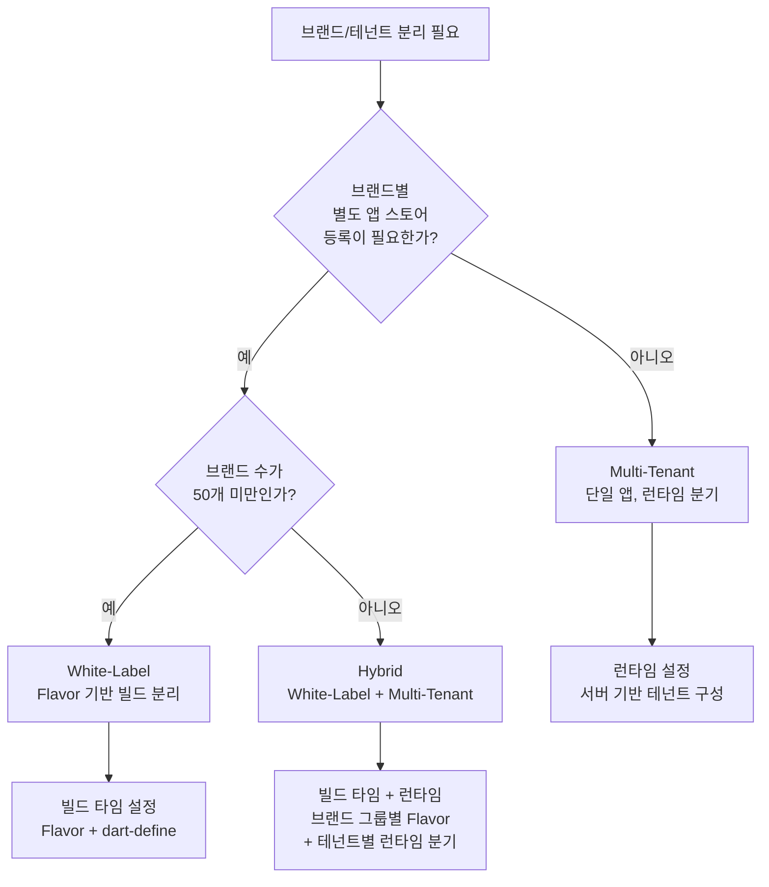
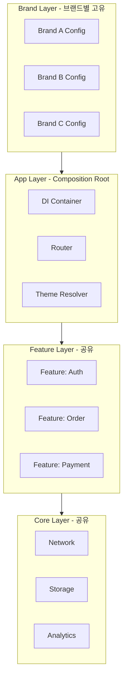
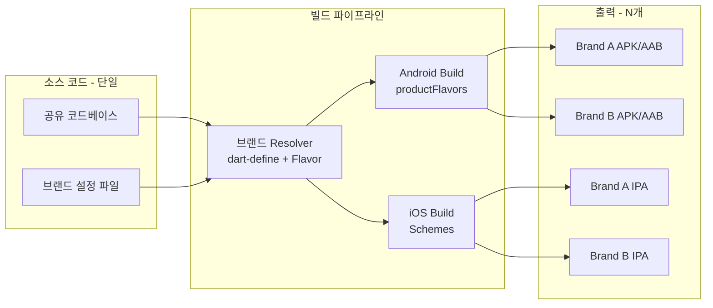
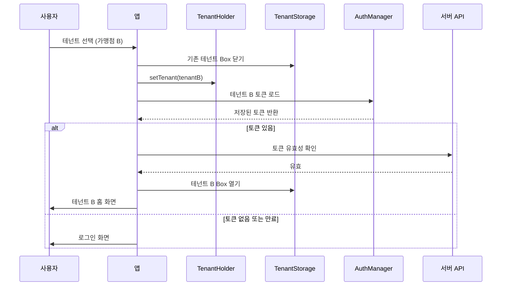
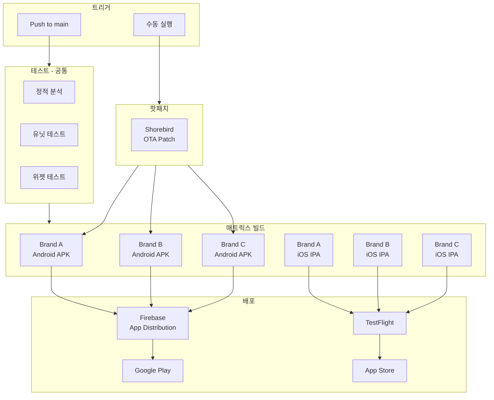
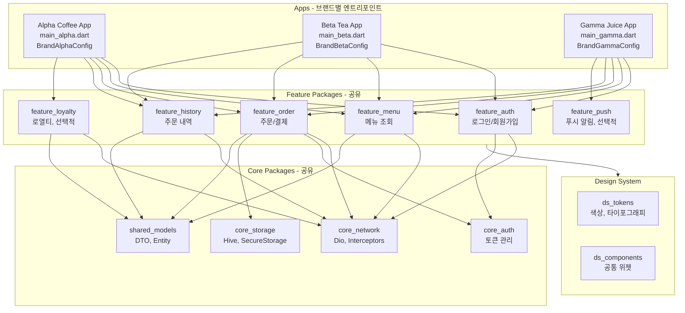

# Flutter White-Label / Multi-Tenant 아키텍처 가이드

> **마지막 업데이트**: 2026-02-08 | **Flutter 3.38** | **Dart 3.10**
> **난이도**: 시니어 | **카테고리**: advanced
> **선행 학습**: [Architecture](../core/Architecture.md), [Bloc](../core/Bloc.md), [Environment](../infrastructure/Environment.md)
> **예상 학습 시간**: 3h

> 하나의 코드베이스로 N개 브랜드 앱을 빌드하고 배포하는 White-Label / Multi-Tenant 아키텍처 전략

> **Package Versions (2026년 2월 기준)**
> - flutter_bloc: ^9.1.1
> - get_it: ^9.2.0 | injectable: ^2.7.1
> - dio: ^5.9.1
> - go_router: ^17.1.0
> - hive_ce: ^2.10.0
> - firebase_remote_config: ^5.3.0
> - melos: ^7.0.0
> - shorebird: ^1.7.0

> **학습 목표**: 이 문서를 학습하면 다음을 할 수 있습니다:
> - White-Label과 Multi-Tenant 아키텍처의 차이점과 적용 시나리오를 구분할 수 있다
> - Flutter Flavor와 dart-define을 활용하여 브랜드별 빌드 파이프라인을 구성할 수 있다
> - ThemeData와 ThemeExtension을 활용한 동적 테마 시스템을 설계할 수 있다
> - Feature Toggle 패턴으로 브랜드별 기능을 분기할 수 있다
> - Multi-Tenant 환경에서 데이터 격리와 인증을 구현할 수 있다
> - GitHub Actions 매트릭스 빌드와 Shorebird OTA로 N개 브랜드를 자동 배포할 수 있다

## 목차

1. [White-Label 앱 개요](#1-white-label-앱-개요)
2. [Flavor/Environment 기반 브랜드 분리](#2-flavorenvironment-기반-브랜드-분리)
3. [테마/디자인 시스템 동적 구성](#3-테마디자인-시스템-동적-구성)
4. [Feature Toggle / 기능 분기](#4-feature-toggle--기능-분기)
5. [Multi-Tenant 데이터 격리](#5-multi-tenant-데이터-격리)
6. [빌드/배포 자동화](#6-빌드배포-자동화)
7. [테스트 전략](#7-테스트-전략)
8. [실무 사례: 프랜차이즈 앱 아키텍처](#8-실무-사례-프랜차이즈-앱-아키텍처)

---

## 1. White-Label 앱 개요

### 1.1 White-Label vs Multi-Tenant 차이점

**White-Label**은 동일한 코드베이스에서 브랜드별로 별도의 앱 바이너리를 생성하는 전략이고, **Multi-Tenant**는 하나의 앱 바이너리가 런타임에 테넌트를 식별하여 동작을 분기하는 전략입니다.

| 구분 | White-Label | Multi-Tenant |
|------|-------------|--------------|
| **바이너리** | 브랜드별 별도 앱 (N개) | 단일 앱 (1개) |
| **스토어 등록** | 브랜드별 별도 등록 | 하나의 앱만 등록 |
| **패키지명** | `com.brandA.app`, `com.brandB.app` | `com.platform.app` |
| **테마/디자인** | 빌드 타임에 결정 | 런타임에 동적 전환 |
| **기능 분기** | 빌드 타임 Feature Flag | 런타임 Feature Flag |
| **데이터 격리** | 앱 자체가 분리됨 | 테넌트 ID로 논리적 격리 |
| **배포** | 브랜드별 독립 배포 | 단일 배포로 전체 적용 |
| **적합한 규모** | 5~50개 브랜드 | 50개 이상 테넌트 |

### 1.2 사용 사례

#### B2B SaaS 플랫폼

```
예시: 배달 앱 솔루션
├── 브랜드 A (피자 프랜차이즈) → White-Label 앱
├── 브랜드 B (치킨 프랜차이즈) → White-Label 앱
├── 브랜드 C (카페 프랜차이즈) → White-Label 앱
└── 공통 코드베이스 (주문, 결제, 배달 추적)
```

#### 프랜차이즈 앱

```
예시: 프랜차이즈 본사
├── 본사 관리 앱 (White-Label)
├── 가맹점 A 앱 (White-Label + Multi-Tenant)
├── 가맹점 B 앱 (White-Label + Multi-Tenant)
└── 고객 앱 (Multi-Tenant, 가맹점 선택)
```

#### 화이트라벨 솔루션

```
예시: 금융 앱 솔루션
├── 은행 A 모바일뱅킹 → 고유 디자인, 풀 기능
├── 은행 B 모바일뱅킹 → 고유 디자인, 기본 기능만
├── 증권사 C 앱 → 고유 디자인, 투자 기능 추가
└── 핵심 금융 엔진 공유 (계좌, 이체, 인증)
```

### 1.3 아키텍처 결정 기준



### 1.4 전체 아키텍처 레이어

White-Label 앱의 계층 구조는 Clean Architecture를 확장합니다.

> Clean Architecture 기본 구조는 [Architecture](../core/Architecture.md) 문서를 참조하세요.



---

## 2. Flavor/Environment 기반 브랜드 분리

> Flavor 기본 설정(dev/stg/prod 분리)은 [Environment](../infrastructure/Environment.md) 문서를 참조하세요.
> 이 섹션에서는 White-Label에 특화된 **브랜드별 Flavor 확장 전략**을 다룹니다.

### 2.1 프로젝트 구조

```
white_label_app/
├── lib/
│   ├── main_brand_a.dart          # 브랜드 A 엔트리포인트
│   ├── main_brand_b.dart          # 브랜드 B 엔트리포인트
│   ├── main_brand_c.dart          # 브랜드 C 엔트리포인트
│   └── src/
│       ├── app.dart               # 공통 App 위젯
│       ├── brand/
│       │   ├── brand_config.dart   # 브랜드 설정 인터페이스
│       │   ├── brand_registry.dart # 브랜드 등록소
│       │   └── brands/
│       │       ├── brand_a.dart
│       │       ├── brand_b.dart
│       │       └── brand_c.dart
│       ├── config/
│       │   ├── app_config.dart
│       │   └── feature_flags.dart
│       ├── features/              # 공유 Feature 모듈
│       └── core/                  # 공유 Core 모듈
├── assets/
│   ├── brand_a/                   # 브랜드 A 전용 에셋
│   │   ├── images/
│   │   ├── fonts/
│   │   └── config.json
│   ├── brand_b/
│   └── brand_c/
├── config/
│   ├── brand_a_dev.json           # dart-define-from-file용
│   ├── brand_a_prod.json
│   ├── brand_b_dev.json
│   └── brand_b_prod.json
├── android/
│   └── app/
│       └── src/
│           ├── brandA/            # Android Flavor
│           │   ├── res/mipmap-*/ic_launcher.png
│           │   └── google-services.json
│           ├── brandB/
│           └── brandC/
└── ios/
    └── Runner/
        ├── BrandA/                # iOS Scheme 별 설정
        │   ├── Info.plist
        │   ├── GoogleService-Info.plist
        │   └── Assets.xcassets/AppIcon.appiconset/
        ├── BrandB/
        └── BrandC/
```

### 2.2 브랜드 설정 인터페이스

```dart
// lib/src/brand/brand_config.dart
import 'package:flutter/material.dart';

/// 브랜드별로 구현해야 하는 설정 인터페이스
abstract class BrandConfig {
  /// 브랜드 고유 식별자
  String get brandId;

  /// 브랜드 표시명
  String get brandName;

  /// 앱 표시명 (런처에 표시)
  String get appDisplayName;

  /// API Base URL
  String get apiBaseUrl;

  /// 테마 설정
  ThemeData get lightTheme;
  ThemeData get darkTheme;

  /// 브랜드별 에셋 경로
  String get assetPrefix => 'assets/$brandId';

  /// 로고 에셋 경로
  String get logoPath => '$assetPrefix/images/logo.png';

  /// 스플래시 로고 경로
  String get splashLogoPath => '$assetPrefix/images/splash_logo.png';

  /// 활성화된 Feature 목록
  Set<Feature> get enabledFeatures;

  /// Firebase 프로젝트 ID (브랜드별 분리)
  String get firebaseProjectId;

  /// 추가 설정 (브랜드별 커스텀)
  Map<String, dynamic> get extras => {};
}

/// 앱에서 사용할 수 있는 Feature 열거형
enum Feature {
  ordering,
  payment,
  loyalty,
  chat,
  pushNotification,
  analytics,
  review,
  coupon,
  delivery,
  reservation,
}
```

### 2.3 브랜드별 구현

```dart
// lib/src/brand/brands/brand_a.dart
class BrandAConfig extends BrandConfig {
  @override
  String get brandId => 'brand_a';

  @override
  String get brandName => 'Alpha Coffee';

  @override
  String get appDisplayName => 'Alpha Coffee';

  @override
  String get apiBaseUrl => 'https://api.alpha-coffee.com/v1';

  @override
  ThemeData get lightTheme => ThemeData(
    colorScheme: ColorScheme.fromSeed(
      seedColor: const Color(0xFF6B4226),  // 커피 브라운
      brightness: Brightness.light,
    ),
    useMaterial3: true,
  );

  @override
  ThemeData get darkTheme => ThemeData(
    colorScheme: ColorScheme.fromSeed(
      seedColor: const Color(0xFF6B4226),
      brightness: Brightness.dark,
    ),
    useMaterial3: true,
  );

  @override
  Set<Feature> get enabledFeatures => {
    Feature.ordering,
    Feature.payment,
    Feature.loyalty,
    Feature.pushNotification,
    Feature.coupon,
  };

  @override
  String get firebaseProjectId => 'alpha-coffee-prod';
}
```

```dart
// lib/src/brand/brands/brand_b.dart
class BrandBConfig extends BrandConfig {
  @override
  String get brandId => 'brand_b';

  @override
  String get brandName => 'Beta Burger';

  @override
  String get appDisplayName => 'Beta Burger';

  @override
  String get apiBaseUrl => 'https://api.beta-burger.com/v1';

  @override
  ThemeData get lightTheme => ThemeData(
    colorScheme: ColorScheme.fromSeed(
      seedColor: const Color(0xFFE53935),  // 버거 레드
      brightness: Brightness.light,
    ),
    useMaterial3: true,
  );

  @override
  ThemeData get darkTheme => ThemeData(
    colorScheme: ColorScheme.fromSeed(
      seedColor: const Color(0xFFE53935),
      brightness: Brightness.dark,
    ),
    useMaterial3: true,
  );

  @override
  Set<Feature> get enabledFeatures => {
    Feature.ordering,
    Feature.payment,
    Feature.delivery,
    Feature.pushNotification,
    Feature.review,
    Feature.chat,
  };

  @override
  String get firebaseProjectId => 'beta-burger-prod';
}
```

### 2.4 브랜드 레지스트리와 엔트리포인트

```dart
// lib/src/brand/brand_registry.dart
import 'package:get_it/get_it.dart';

class BrandRegistry {
  static late final BrandConfig _config;

  /// 앱 시작 시 한 번만 호출
  static void initialize(BrandConfig config) {
    _config = config;
    GetIt.I.registerSingleton<BrandConfig>(config);
  }

  /// 현재 브랜드 설정 접근
  static BrandConfig get current => _config;

  /// 특정 Feature 활성화 여부
  static bool isFeatureEnabled(Feature feature) {
    return _config.enabledFeatures.contains(feature);
  }
}
```

```dart
// lib/main_brand_a.dart
import 'package:white_label_app/src/app.dart';
import 'package:white_label_app/src/brand/brands/brand_a.dart';
import 'package:white_label_app/src/brand/brand_registry.dart';

void main() async {
  WidgetsFlutterBinding.ensureInitialized();

  // 브랜드 설정 등록
  BrandRegistry.initialize(BrandAConfig());

  // 공통 초기화 (DI, Firebase 등)
  await initializeApp();

  runApp(const WhiteLabelApp());
}
```

### 2.5 dart-define을 활용한 빌드 타임 설정

```dart
// lib/src/config/app_config.dart

/// dart-define으로 전달되는 빌드 타임 설정
class AppConfig {
  /// 환경 (dev, staging, prod)
  static const String environment = String.fromEnvironment(
    'ENV',
    defaultValue: 'dev',
  );

  /// 브랜드 식별자
  static const String brandId = String.fromEnvironment(
    'BRAND_ID',
    defaultValue: 'brand_a',
  );

  /// API 오버라이드 (테스트용)
  static const String apiOverride = String.fromEnvironment(
    'API_BASE_URL',
    defaultValue: '',
  );

  /// 디버그 모드 강제 활성화
  static const bool forceDebug = bool.fromEnvironment(
    'FORCE_DEBUG',
    defaultValue: false,
  );

  static bool get isProduction => environment == 'prod';
  static bool get isStaging => environment == 'staging';
  static bool get isDevelopment => environment == 'dev';
}
```

빌드 명령:

```bash
# 브랜드 A - 개발 환경
flutter run \
  --dart-define=BRAND_ID=brand_a \
  --dart-define=ENV=dev \
  --target=lib/main_brand_a.dart

# 브랜드 B - 프로덕션 빌드
flutter build apk \
  --dart-define=BRAND_ID=brand_b \
  --dart-define=ENV=prod \
  --target=lib/main_brand_b.dart \
  --flavor brandB

# dart-define-from-file 활용 (Flutter 3.10+)
flutter build apk \
  --dart-define-from-file=config/brand_a_prod.json \
  --target=lib/main_brand_a.dart \
  --flavor brandA
```

```json
// config/brand_a_prod.json
{
  "BRAND_ID": "brand_a",
  "ENV": "prod",
  "API_BASE_URL": "https://api.alpha-coffee.com/v1",
  "SENTRY_DSN": "https://abc@sentry.io/123"
}
```

### 2.6 Android productFlavors 설정

```groovy
// android/app/build.gradle.kts
android {
    // ...

    flavorDimensions += "brand"

    productFlavors {
        create("brandA") {
            dimension = "brand"
            applicationId = "com.alphacoffee.app"
            resValue("string", "app_name", "Alpha Coffee")
            versionNameSuffix = "-alpha"
        }

        create("brandB") {
            dimension = "brand"
            applicationId = "com.betaburger.app"
            resValue("string", "app_name", "Beta Burger")
            versionNameSuffix = "-beta"
        }

        create("brandC") {
            dimension = "brand"
            applicationId = "com.gammapizza.app"
            resValue("string", "app_name", "Gamma Pizza")
            versionNameSuffix = "-gamma"
        }
    }
}
```

### 2.7 iOS Schemes 설정

```ruby
# ios/Podfile
platform :ios, '16.0'

project 'Runner', {
  'Debug-BrandA'   => :debug,
  'Release-BrandA' => :release,
  'Debug-BrandB'   => :debug,
  'Release-BrandB' => :release,
  'Debug-BrandC'   => :debug,
  'Release-BrandC' => :release,
}
```

Xcode에서 브랜드별 Bundle Identifier와 앱 아이콘을 분리합니다:

```
ios/Runner/
├── BrandA/
│   ├── Info.plist                     # Bundle ID: com.alphacoffee.app
│   ├── GoogleService-Info.plist       # 브랜드 A Firebase
│   └── Assets.xcassets/
│       └── AppIcon.appiconset/        # 브랜드 A 아이콘
├── BrandB/
│   ├── Info.plist
│   ├── GoogleService-Info.plist
│   └── Assets.xcassets/
└── BrandC/
    └── ...
```

### 2.8 빌드 파이프라인 구조



---

## 3. 테마/디자인 시스템 동적 구성

### 3.1 ThemeData 동적 생성

브랜드마다 고유한 테마를 적용하되, 공통 구조를 유지합니다.

```dart
// lib/src/theme/brand_theme_factory.dart
import 'package:flutter/material.dart';

class BrandThemeFactory {
  /// 브랜드 색상으로 완전한 ThemeData 생성
  static ThemeData createTheme({
    required Color primaryColor,
    required Color secondaryColor,
    required Brightness brightness,
    String? fontFamily,
    BrandThemeExtension? brandExtension,
  }) {
    final colorScheme = ColorScheme.fromSeed(
      seedColor: primaryColor,
      secondary: secondaryColor,
      brightness: brightness,
    );

    return ThemeData(
      colorScheme: colorScheme,
      useMaterial3: true,
      fontFamily: fontFamily,

      // AppBar 테마
      appBarTheme: AppBarTheme(
        backgroundColor: colorScheme.surface,
        foregroundColor: colorScheme.onSurface,
        elevation: 0,
        centerTitle: true,
      ),

      // 카드 테마
      cardTheme: CardThemeData(
        elevation: 2,
        shape: RoundedRectangleBorder(
          borderRadius: BorderRadius.circular(12),
        ),
      ),

      // 버튼 테마
      elevatedButtonTheme: ElevatedButtonThemeData(
        style: ElevatedButton.styleFrom(
          backgroundColor: colorScheme.primary,
          foregroundColor: colorScheme.onPrimary,
          minimumSize: const Size(double.infinity, 48),
          shape: RoundedRectangleBorder(
            borderRadius: BorderRadius.circular(12),
          ),
        ),
      ),

      // 입력 필드 테마
      inputDecorationTheme: InputDecorationTheme(
        border: OutlineInputBorder(
          borderRadius: BorderRadius.circular(12),
        ),
        filled: true,
        fillColor: colorScheme.surfaceContainerHighest.withValues(alpha: 0.3),
      ),

      // 브랜드 확장 테마 등록
      extensions: [
        if (brandExtension != null) brandExtension,
      ],
    );
  }
}
```

### 3.2 ThemeExtension 활용

Material Theme에 포함되지 않는 브랜드 고유 디자인 토큰을 정의합니다.

```dart
// lib/src/theme/brand_theme_extension.dart
import 'package:flutter/material.dart';

/// 브랜드별 커스텀 테마 확장
class BrandThemeExtension extends ThemeExtension<BrandThemeExtension> {
  /// 브랜드 그라데이션 (헤더, CTA 버튼 등)
  final LinearGradient? headerGradient;

  /// 브랜드 로고 색상 (SVG 착색용)
  final Color logoColor;

  /// CTA 버튼 스타일
  final double buttonRadius;
  final double buttonElevation;

  /// 카드 스타일
  final double cardRadius;

  /// 브랜드 전용 Spacing
  final double contentPadding;

  /// 프로모션 배너 색상
  final Color promotionBannerColor;
  final Color promotionTextColor;

  const BrandThemeExtension({
    this.headerGradient,
    required this.logoColor,
    this.buttonRadius = 12.0,
    this.buttonElevation = 2.0,
    this.cardRadius = 12.0,
    this.contentPadding = 16.0,
    required this.promotionBannerColor,
    required this.promotionTextColor,
  });

  @override
  BrandThemeExtension copyWith({
    LinearGradient? headerGradient,
    Color? logoColor,
    double? buttonRadius,
    double? buttonElevation,
    double? cardRadius,
    double? contentPadding,
    Color? promotionBannerColor,
    Color? promotionTextColor,
  }) {
    return BrandThemeExtension(
      headerGradient: headerGradient ?? this.headerGradient,
      logoColor: logoColor ?? this.logoColor,
      buttonRadius: buttonRadius ?? this.buttonRadius,
      buttonElevation: buttonElevation ?? this.buttonElevation,
      cardRadius: cardRadius ?? this.cardRadius,
      contentPadding: contentPadding ?? this.contentPadding,
      promotionBannerColor: promotionBannerColor ?? this.promotionBannerColor,
      promotionTextColor: promotionTextColor ?? this.promotionTextColor,
    );
  }

  @override
  BrandThemeExtension lerp(
    covariant BrandThemeExtension? other,
    double t,
  ) {
    if (other == null) return this;
    return BrandThemeExtension(
      headerGradient: LinearGradient.lerp(
        headerGradient, other.headerGradient, t,
      ),
      logoColor: Color.lerp(logoColor, other.logoColor, t)!,
      buttonRadius: lerpDouble(buttonRadius, other.buttonRadius, t)!,
      buttonElevation: lerpDouble(buttonElevation, other.buttonElevation, t)!,
      cardRadius: lerpDouble(cardRadius, other.cardRadius, t)!,
      contentPadding: lerpDouble(contentPadding, other.contentPadding, t)!,
      promotionBannerColor: Color.lerp(
        promotionBannerColor, other.promotionBannerColor, t,
      )!,
      promotionTextColor: Color.lerp(
        promotionTextColor, other.promotionTextColor, t,
      )!,
    );
  }
}

/// 편의 확장 메서드
extension BrandThemeExtensionAccess on BuildContext {
  BrandThemeExtension get brandTheme =>
      Theme.of(this).extension<BrandThemeExtension>()!;
}
```

위젯에서 사용:

```dart
// 브랜드 확장 테마를 위젯에서 활용
class PromotionBanner extends StatelessWidget {
  final String message;

  const PromotionBanner({super.key, required this.message});

  @override
  Widget build(BuildContext context) {
    final brand = context.brandTheme;

    return Container(
      padding: EdgeInsets.all(brand.contentPadding),
      decoration: BoxDecoration(
        color: brand.promotionBannerColor,
        borderRadius: BorderRadius.circular(brand.cardRadius),
        gradient: brand.headerGradient,
      ),
      child: Text(
        message,
        style: TextStyle(color: brand.promotionTextColor),
      ),
    );
  }
}
```

### 3.3 서버에서 테마 JSON 로드

런타임에 서버에서 테마를 내려받아 적용하는 패턴입니다. Multi-Tenant 시나리오에서 유용합니다.

```dart
// lib/src/theme/remote_theme_loader.dart
import 'dart:convert';
import 'package:dio/dio.dart';
import 'package:flutter/material.dart';

/// 서버에서 테마 JSON을 로드하여 ThemeData로 변환
class RemoteThemeLoader {
  final Dio _dio;

  RemoteThemeLoader(this._dio);

  /// 테넌트 ID로 테마 로드
  Future<ThemeData> loadTheme(String tenantId) async {
    final response = await _dio.get('/tenants/$tenantId/theme');
    final json = response.data as Map<String, dynamic>;
    return _parseTheme(json);
  }

  ThemeData _parseTheme(Map<String, dynamic> json) {
    final primary = _parseColor(json['primaryColor'] as String);
    final secondary = _parseColor(json['secondaryColor'] as String);
    final brightness = json['brightness'] == 'dark'
        ? Brightness.dark
        : Brightness.light;

    return BrandThemeFactory.createTheme(
      primaryColor: primary,
      secondaryColor: secondary,
      brightness: brightness,
      fontFamily: json['fontFamily'] as String?,
      brandExtension: BrandThemeExtension(
        logoColor: _parseColor(json['logoColor'] as String? ?? '#000000'),
        buttonRadius: (json['buttonRadius'] as num?)?.toDouble() ?? 12.0,
        cardRadius: (json['cardRadius'] as num?)?.toDouble() ?? 12.0,
        contentPadding: (json['contentPadding'] as num?)?.toDouble() ?? 16.0,
        promotionBannerColor: _parseColor(
          json['promotionBannerColor'] as String? ?? '#FF5722',
        ),
        promotionTextColor: _parseColor(
          json['promotionTextColor'] as String? ?? '#FFFFFF',
        ),
      ),
    );
  }

  Color _parseColor(String hex) {
    final buffer = StringBuffer();
    if (hex.length == 7) buffer.write('FF'); // #RRGGBB -> FFRRGGBB
    buffer.write(hex.replaceFirst('#', ''));
    return Color(int.parse(buffer.toString(), radix: 16));
  }
}
```

서버 응답 예시:

```json
{
  "primaryColor": "#6B4226",
  "secondaryColor": "#D4A574",
  "brightness": "light",
  "fontFamily": "Pretendard",
  "logoColor": "#6B4226",
  "buttonRadius": 16,
  "cardRadius": 12,
  "contentPadding": 20,
  "promotionBannerColor": "#FFF3E0",
  "promotionTextColor": "#6B4226"
}
```

### 3.4 ThemeBloc으로 테마 상태 관리

```dart
// lib/src/theme/bloc/theme_bloc.dart
import 'package:flutter_bloc/flutter_bloc.dart';
import 'package:freezed_annotation/freezed_annotation.dart';

part 'theme_bloc.freezed.dart';

@freezed
sealed class ThemeEvent with _$ThemeEvent {
  const factory ThemeEvent.initialize() = _Initialize;
  const factory ThemeEvent.toggleBrightness() = _ToggleBrightness;
  const factory ThemeEvent.remoteThemeLoaded(ThemeData theme) = _RemoteThemeLoaded;
}

@freezed
sealed class ThemeState with _$ThemeState {
  const factory ThemeState({
    required ThemeData lightTheme,
    required ThemeData darkTheme,
    required ThemeMode themeMode,
  }) = _ThemeState;
}

class ThemeBloc extends Bloc<ThemeEvent, ThemeState> {
  final BrandConfig _brandConfig;
  final RemoteThemeLoader? _remoteLoader;

  ThemeBloc({
    required BrandConfig brandConfig,
    RemoteThemeLoader? remoteLoader,
  })  : _brandConfig = brandConfig,
        _remoteLoader = remoteLoader,
        super(ThemeState(
          lightTheme: brandConfig.lightTheme,
          darkTheme: brandConfig.darkTheme,
          themeMode: ThemeMode.system,
        )) {
    on<ThemeEvent>((event, emit) async {
      switch (event) {
        case _Initialize():
          await _onInitialize(emit);
        case _ToggleBrightness():
          _onToggleBrightness(emit);
        case _RemoteThemeLoaded(:final theme):
          _onRemoteThemeLoaded(theme, emit);
      }
    });
  }

  Future<void> _onInitialize(Emitter<ThemeState> emit) async {
    if (_remoteLoader != null) {
      try {
        final remoteTheme = await _remoteLoader.loadTheme(
          _brandConfig.brandId,
        );
        emit(state.copyWith(lightTheme: remoteTheme));
      } catch (_) {
        // 실패 시 로컬 테마 유지
      }
    }
  }

  void _onToggleBrightness(Emitter<ThemeState> emit) {
    final newMode = state.themeMode == ThemeMode.light
        ? ThemeMode.dark
        : ThemeMode.light;
    emit(state.copyWith(themeMode: newMode));
  }

  void _onRemoteThemeLoaded(ThemeData theme, Emitter<ThemeState> emit) {
    emit(state.copyWith(lightTheme: theme));
  }
}
```

### 3.5 Asset 관리 전략

```dart
// lib/src/brand/brand_assets.dart

/// 브랜드별 에셋 경로를 해석하는 유틸리티
class BrandAssets {
  final String _brandId;

  BrandAssets(this._brandId);

  /// 이미지 경로
  String image(String name) => 'assets/$_brandId/images/$name';

  /// 로고
  String get logo => image('logo.png');
  String get logoWide => image('logo_wide.png');
  String get splashLogo => image('splash_logo.png');

  /// 온보딩 이미지
  String onboarding(int index) => image('onboarding_$index.png');

  /// 아이콘
  String icon(String name) => 'assets/$_brandId/icons/$name.svg';

  /// 공통 에셋 (브랜드 무관)
  static String common(String name) => 'assets/common/$name';

  /// 폰트 패밀리
  String? get fontFamily {
    return switch (_brandId) {
      'brand_a' => 'Pretendard',
      'brand_b' => 'SpoqaHanSansNeo',
      _ => null,  // 시스템 기본 폰트
    };
  }
}
```

pubspec.yaml 에셋 등록:

```yaml
# pubspec.yaml
flutter:
  assets:
    - assets/common/
    - assets/brand_a/images/
    - assets/brand_a/icons/
    - assets/brand_b/images/
    - assets/brand_b/icons/
    - assets/brand_c/images/
    - assets/brand_c/icons/

  fonts:
    - family: Pretendard
      fonts:
        - asset: assets/brand_a/fonts/Pretendard-Regular.otf
        - asset: assets/brand_a/fonts/Pretendard-Bold.otf
          weight: 700
    - family: SpoqaHanSansNeo
      fonts:
        - asset: assets/brand_b/fonts/SpoqaHanSansNeo-Regular.otf
        - asset: assets/brand_b/fonts/SpoqaHanSansNeo-Bold.otf
          weight: 700
```

> **Tip**: 모든 브랜드 에셋을 하나의 APK/IPA에 포함하면 앱 크기가 증가합니다. Flavor별로 빌드 스크립트에서 해당 브랜드 에셋만 포함하도록 필터링하세요.

---

## 4. Feature Toggle / 기능 분기

### 4.1 Feature Flag 패턴

```dart
// lib/src/config/feature_flags.dart

/// 빌드 타임 + 런타임 Feature Flag 통합 관리
class FeatureFlags {
  final BrandConfig _brandConfig;
  final Map<Feature, bool> _runtimeOverrides = {};

  FeatureFlags(this._brandConfig);

  /// Feature 활성화 여부 확인
  /// 우선순위: 런타임 오버라이드 > 브랜드 설정
  bool isEnabled(Feature feature) {
    // 1. 런타임 오버라이드 확인 (서버에서 동적 변경 가능)
    if (_runtimeOverrides.containsKey(feature)) {
      return _runtimeOverrides[feature]!;
    }

    // 2. 브랜드 설정 확인
    return _brandConfig.enabledFeatures.contains(feature);
  }

  /// 서버에서 받은 Feature Flag 적용
  void applyRemoteFlags(Map<String, bool> flags) {
    for (final entry in flags.entries) {
      try {
        final feature = Feature.values.byName(entry.key);
        _runtimeOverrides[feature] = entry.value;
      } catch (_) {
        // 알 수 없는 Feature는 무시
      }
    }
  }

  /// 특정 Feature 런타임 토글 (디버그용)
  void override(Feature feature, bool enabled) {
    _runtimeOverrides[feature] = enabled;
  }

  /// 런타임 오버라이드 초기화
  void clearOverrides() {
    _runtimeOverrides.clear();
  }
}
```

### 4.2 Injectable을 활용한 Feature DI

> DI 기본 설정은 [DI](../infrastructure/DI.md) 문서를 참조하세요.

```dart
// lib/src/di/feature_module.dart
import 'package:injectable/injectable.dart';

/// Feature별 DI 모듈
/// 브랜드 설정에 따라 구현체를 조건부 등록
@module
abstract class FeatureModule {
  @lazySingleton
  FeatureFlags featureFlags(BrandConfig config) => FeatureFlags(config);
}

// lib/src/features/loyalty/loyalty_module.dart

/// Loyalty Feature 모듈
/// 브랜드 설정에 따라 활성화/비활성화됨
class LoyaltyModule {
  static bool _initialized = false;

  static Future<void> initialize(GetIt getIt) async {
    if (_initialized) return;

    // Domain Layer
    getIt.registerLazySingleton<LoyaltyRepository>(
      () => LoyaltyRepositoryImpl(getIt()),
    );
    getIt.registerLazySingleton(() => GetLoyaltyPointsUseCase(getIt()));
    getIt.registerLazySingleton(() => RedeemPointsUseCase(getIt()));

    // Data Layer
    getIt.registerLazySingleton<LoyaltyRemoteDataSource>(
      () => LoyaltyRemoteDataSourceImpl(getIt()),
    );

    _initialized = true;
  }

  /// 모듈 라우트 (활성화된 경우에만 등록)
  static List<GoRoute> get routes => [
    GoRoute(
      path: '/loyalty',
      builder: (_, __) => BlocProvider(
        create: (_) => LoyaltyBloc(
          getLoyaltyPoints: GetIt.I(),
          redeemPoints: GetIt.I(),
        )..add(const LoyaltyEvent.started()),
        child: const LoyaltyScreen(),
      ),
    ),
  ];
}
```

### 4.3 FeatureGate 위젯 - UI에서 기능 분기

```dart
// lib/src/presentation/widgets/feature_gate.dart
import 'package:flutter/material.dart';
import 'package:get_it/get_it.dart';

/// Feature가 활성화된 경우에만 child를 렌더링
class FeatureGate extends StatelessWidget {
  final Feature feature;
  final Widget child;
  final Widget? fallback;

  const FeatureGate({
    super.key,
    required this.feature,
    required this.child,
    this.fallback,
  });

  @override
  Widget build(BuildContext context) {
    final flags = GetIt.I<FeatureFlags>();

    if (flags.isEnabled(feature)) {
      return child;
    }

    return fallback ?? const SizedBox.shrink();
  }
}

// 사용 예시
class HomeScreen extends StatelessWidget {
  const HomeScreen({super.key});

  @override
  Widget build(BuildContext context) {
    return Scaffold(
      body: Column(
        children: [
          // 모든 브랜드 공통
          const OrderSection(),

          // Loyalty 기능이 있는 브랜드만
          FeatureGate(
            feature: Feature.loyalty,
            child: const LoyaltyPointsCard(),
          ),

          // 채팅 기능이 있는 브랜드만
          FeatureGate(
            feature: Feature.chat,
            child: const ChatFloatingButton(),
            fallback: const ContactUsButton(),  // 대체 UI
          ),

          // 쿠폰 기능이 있는 브랜드만
          FeatureGate(
            feature: Feature.coupon,
            child: const CouponBanner(),
          ),
        ],
      ),
    );
  }
}
```

### 4.4 서버 기반 Feature Toggle (Firebase Remote Config)

```dart
// lib/src/config/remote_feature_flag_service.dart
import 'package:firebase_remote_config/firebase_remote_config.dart';

/// Firebase Remote Config를 통한 런타임 Feature Toggle
class RemoteFeatureFlagService {
  final FirebaseRemoteConfig _remoteConfig;
  final FeatureFlags _featureFlags;

  RemoteFeatureFlagService(this._remoteConfig, this._featureFlags);

  /// 초기화 및 Feature Flag 동기화
  Future<void> initialize() async {
    await _remoteConfig.setConfigSettings(RemoteConfigSettings(
      fetchTimeout: const Duration(seconds: 10),
      minimumFetchInterval: const Duration(hours: 1),
    ));

    // 기본값 설정
    await _remoteConfig.setDefaults({
      for (final feature in Feature.values)
        'feature_${feature.name}': false,
    });

    // 서버에서 최신 값 가져오기
    await _remoteConfig.fetchAndActivate();
    _syncFlags();

    // 실시간 업데이트 수신
    _remoteConfig.onConfigUpdated.listen((_) async {
      await _remoteConfig.activate();
      _syncFlags();
    });
  }

  void _syncFlags() {
    final flags = <String, bool>{};
    for (final feature in Feature.values) {
      final key = 'feature_${feature.name}';
      flags[feature.name] = _remoteConfig.getBool(key);
    }
    _featureFlags.applyRemoteFlags(flags);
  }
}
```

### 4.5 Clean Architecture에서 Feature 모듈 분리

> Feature Module 분리의 기본 원칙은 [ModularArchitecture](./ModularArchitecture.md)를 참조하세요.

```dart
// main에서 조건부 모듈 등록
void main() async {
  WidgetsFlutterBinding.ensureInitialized();
  BrandRegistry.initialize(BrandAConfig());

  final getIt = GetIt.I;

  // 필수 모듈 초기화
  await CoreModule.initialize(getIt);
  await AuthModule.initialize(getIt);
  await OrderModule.initialize(getIt);

  // 브랜드별 선택적 모듈 초기화
  if (BrandRegistry.isFeatureEnabled(Feature.loyalty)) {
    await LoyaltyModule.initialize(getIt);
  }
  if (BrandRegistry.isFeatureEnabled(Feature.chat)) {
    await ChatModule.initialize(getIt);
  }
  if (BrandRegistry.isFeatureEnabled(Feature.delivery)) {
    await DeliveryModule.initialize(getIt);
  }

  // 라우터 구성 (활성화된 모듈의 라우트만 포함)
  final routes = <RouteBase>[
    ...AuthModule.routes,
    ...OrderModule.routes,
    if (BrandRegistry.isFeatureEnabled(Feature.loyalty))
      ...LoyaltyModule.routes,
    if (BrandRegistry.isFeatureEnabled(Feature.chat))
      ...ChatModule.routes,
  ];

  getIt.registerSingleton<GoRouter>(GoRouter(routes: routes));

  runApp(const WhiteLabelApp());
}
```

---

## 5. Multi-Tenant 데이터 격리

### 5.1 테넌트 컨텍스트 관리

```dart
// lib/src/core/tenant/tenant_context.dart
import 'package:freezed_annotation/freezed_annotation.dart';

part 'tenant_context.freezed.dart';
part 'tenant_context.g.dart';

/// 현재 활성 테넌트 정보
@freezed
sealed class TenantContext with _$TenantContext {
  const factory TenantContext({
    required String tenantId,
    required String tenantName,
    required String apiBaseUrl,
    String? logoUrl,
    Map<String, dynamic>? metadata,
  }) = _TenantContext;

  factory TenantContext.fromJson(Map<String, dynamic> json) =>
      _$TenantContextFromJson(json);
}

/// 테넌트 컨텍스트를 관리하는 싱글턴
@LazySingleton()
class TenantContextHolder {
  TenantContext? _current;

  TenantContext get current {
    final ctx = _current;
    if (ctx == null) {
      throw StateError('TenantContext가 초기화되지 않았습니다. '
          'setTenant()를 먼저 호출하세요.');
    }
    return ctx;
  }

  bool get isInitialized => _current != null;

  void setTenant(TenantContext context) {
    _current = context;
  }

  void clear() {
    _current = null;
  }
}
```

### 5.2 테넌트별 API Endpoint 라우팅

```dart
// lib/src/core/network/tenant_interceptor.dart
import 'package:dio/dio.dart';

/// 모든 API 요청에 테넌트 헤더를 자동 주입하는 Interceptor
class TenantInterceptor extends Interceptor {
  final TenantContextHolder _tenantHolder;

  TenantInterceptor(this._tenantHolder);

  @override
  void onRequest(
    RequestOptions options,
    RequestInterceptorHandler handler,
  ) {
    if (_tenantHolder.isInitialized) {
      final tenant = _tenantHolder.current;

      // 1. 테넌트 헤더 주입
      options.headers['X-Tenant-ID'] = tenant.tenantId;

      // 2. 테넌트별 Base URL로 교체
      if (options.baseUrl.isEmpty || options.baseUrl == '/') {
        options.baseUrl = tenant.apiBaseUrl;
      }
    }

    handler.next(options);
  }

  @override
  void onError(DioException err, ErrorInterceptorHandler handler) {
    if (err.response?.statusCode == 403) {
      final errorCode = err.response?.data['code'];
      if (errorCode == 'TENANT_SUSPENDED') {
        _tenantHolder.clear();
      }
    }
    handler.next(err);
  }
}

/// Dio 설정에 Interceptor 등록
@module
abstract class NetworkModule {
  @lazySingleton
  Dio dio(
    TenantInterceptor tenantInterceptor,
    AuthInterceptor authInterceptor,
  ) {
    final dio = Dio(BaseOptions(
      connectTimeout: const Duration(seconds: 10),
      receiveTimeout: const Duration(seconds: 10),
    ));

    dio.interceptors.addAll([
      tenantInterceptor,    // 테넌트 헤더 주입
      authInterceptor,      // 인증 토큰 주입
      LogInterceptor(requestBody: true, responseBody: true),
    ]);

    return dio;
  }
}
```

### 5.3 로컬 스토리지 격리 (Hive box per tenant)

```dart
// lib/src/core/storage/tenant_storage.dart
import 'package:hive_ce/hive_ce.dart';

/// 테넌트별로 격리된 로컬 스토리지
class TenantStorage {
  final TenantContextHolder _tenantHolder;
  final Map<String, Box> _openBoxes = {};

  TenantStorage(this._tenantHolder);

  /// 테넌트별 Box 이름 생성
  String _boxName(String name) {
    final tenantId = _tenantHolder.current.tenantId;
    return '${tenantId}_$name';
  }

  /// 테넌트 전용 Box 열기
  Future<Box<T>> openBox<T>(String name) async {
    final fullName = _boxName(name);

    if (_openBoxes.containsKey(fullName)) {
      return _openBoxes[fullName] as Box<T>;
    }

    final box = await Hive.openBox<T>(fullName);
    _openBoxes[fullName] = box;
    return box;
  }

  /// 테넌트 전환 시 기존 Box 모두 닫기
  Future<void> closeAll() async {
    for (final box in _openBoxes.values) {
      await box.close();
    }
    _openBoxes.clear();
  }

  /// 특정 테넌트의 모든 데이터 삭제
  Future<void> clearTenantData(String tenantId) async {
    final boxNames = _openBoxes.keys
        .where((name) => name.startsWith('${tenantId}_'))
        .toList();

    for (final name in boxNames) {
      await _openBoxes[name]?.deleteFromDisk();
      _openBoxes.remove(name);
    }
  }
}

// 사용 예시
class OrderLocalDataSource {
  final TenantStorage _storage;

  OrderLocalDataSource(this._storage);

  Future<void> cacheOrders(List<OrderDto> orders) async {
    // 테넌트 A의 데이터는 'tenantA_orders' Box에,
    // 테넌트 B의 데이터는 'tenantB_orders' Box에 자동 격리
    final box = await _storage.openBox<OrderDto>('orders');
    for (final order in orders) {
      await box.put(order.id, order);
    }
  }

  Future<List<OrderDto>> getCachedOrders() async {
    final box = await _storage.openBox<OrderDto>('orders');
    return box.values.toList();
  }
}
```

### 5.4 인증 토큰 관리 (Multi-Tenant JWT)

```dart
// lib/src/core/auth/tenant_auth_manager.dart
import 'package:flutter_secure_storage/flutter_secure_storage.dart';

/// Multi-Tenant 환경에서 테넌트별 인증 토큰 관리
class TenantAuthManager {
  final FlutterSecureStorage _secureStorage;
  final TenantContextHolder _tenantHolder;

  TenantAuthManager(this._secureStorage, this._tenantHolder);

  String _tokenKey(String tenantId) => 'auth_token_$tenantId';
  String _refreshTokenKey(String tenantId) => 'refresh_token_$tenantId';

  /// 현재 테넌트의 액세스 토큰 저장
  Future<void> saveTokens({
    required String accessToken,
    required String refreshToken,
  }) async {
    final tenantId = _tenantHolder.current.tenantId;
    await _secureStorage.write(
      key: _tokenKey(tenantId),
      value: accessToken,
    );
    await _secureStorage.write(
      key: _refreshTokenKey(tenantId),
      value: refreshToken,
    );
  }

  /// 현재 테넌트의 액세스 토큰 조회
  Future<String?> getAccessToken() async {
    final tenantId = _tenantHolder.current.tenantId;
    return _secureStorage.read(key: _tokenKey(tenantId));
  }

  /// 현재 테넌트의 리프레시 토큰 조회
  Future<String?> getRefreshToken() async {
    final tenantId = _tenantHolder.current.tenantId;
    return _secureStorage.read(key: _refreshTokenKey(tenantId));
  }

  /// 현재 테넌트의 토큰 삭제 (로그아웃)
  Future<void> clearTokens() async {
    final tenantId = _tenantHolder.current.tenantId;
    await _secureStorage.delete(key: _tokenKey(tenantId));
    await _secureStorage.delete(key: _refreshTokenKey(tenantId));
  }

  /// 모든 테넌트의 토큰 삭제 (앱 초기화)
  Future<void> clearAllTokens() async {
    await _secureStorage.deleteAll();
  }
}
```

### 5.5 Dio Interceptor에서 테넌트 토큰 자동 주입

```dart
// lib/src/core/network/auth_interceptor.dart
import 'package:dio/dio.dart';

class AuthInterceptor extends QueuedInterceptor {
  final TenantAuthManager _authManager;
  final Dio _refreshDio;  // 토큰 갱신 전용 Dio (순환 방지)

  AuthInterceptor(this._authManager, this._refreshDio);

  @override
  void onRequest(
    RequestOptions options,
    RequestInterceptorHandler handler,
  ) async {
    final token = await _authManager.getAccessToken();
    if (token != null) {
      options.headers['Authorization'] = 'Bearer $token';
    }
    handler.next(options);
  }

  @override
  void onError(
    DioException err,
    ErrorInterceptorHandler handler,
  ) async {
    if (err.response?.statusCode == 401) {
      final refreshToken = await _authManager.getRefreshToken();
      if (refreshToken == null) {
        handler.next(err);
        return;
      }

      try {
        final response = await _refreshDio.post(
          '/auth/refresh',
          data: {'refreshToken': refreshToken},
        );

        final newAccessToken = response.data['accessToken'] as String;
        final newRefreshToken = response.data['refreshToken'] as String;

        await _authManager.saveTokens(
          accessToken: newAccessToken,
          refreshToken: newRefreshToken,
        );

        // 실패한 요청 재시도
        final retryOptions = err.requestOptions;
        retryOptions.headers['Authorization'] = 'Bearer $newAccessToken';
        final retryResponse = await _refreshDio.fetch(retryOptions);
        handler.resolve(retryResponse);
      } catch (_) {
        await _authManager.clearTokens();
        handler.next(err);
      }
    } else {
      handler.next(err);
    }
  }
}
```

### 5.6 테넌트 전환 흐름



---

## 6. 빌드/배포 자동화

> CI/CD 기본 파이프라인 설정은 [CICD](../infrastructure/CICD.md) 문서를 참조하세요.
> 이 섹션에서는 **N개 브랜드 동시 빌드**에 특화된 전략을 다룹니다.

### 6.1 Melos를 활용한 모노레포 구조

> Melos 기본 설정은 [ModularArchitecture](./ModularArchitecture.md) 문서를 참조하세요.

White-Label 프로젝트에 최적화된 Melos 구조:

```yaml
# melos.yaml
name: white_label_workspace
sdkPath: .fvm/flutter_sdk

packages:
  - apps/**          # 브랜드별 앱
  - packages/**      # 공유 패키지
  - design_system/** # 디자인 시스템

command:
  bootstrap:
    usePubspecOverrides: true

scripts:
  analyze:
    run: melos exec -- flutter analyze --no-fatal-infos
    description: 전체 패키지 정적 분석

  test:all:
    run: melos exec -- flutter test
    description: 전체 패키지 테스트

  # 특정 브랜드만 빌드
  build:brand:
    run: |
      cd apps/$BRAND && flutter build apk \
        --flavor $BRAND \
        --dart-define-from-file=../../config/${BRAND}_${ENV}.json \
        --target=lib/main.dart
    description: 특정 브랜드 APK 빌드
    env:
      BRAND: brand_a
      ENV: prod

  generate:
    run: melos exec -- dart run build_runner build --delete-conflicting-outputs
    description: 코드 생성
```

프로젝트 디렉토리:

```
white_label_workspace/
├── melos.yaml
├── config/
│   ├── brand_a_dev.json
│   ├── brand_a_prod.json
│   ├── brand_b_dev.json
│   ├── brand_b_prod.json
│   └── brand_c_prod.json
├── apps/
│   ├── brand_a/                # 브랜드 A 앱 (최소 코드)
│   │   ├── lib/main.dart
│   │   ├── pubspec.yaml        # 공유 패키지 의존
│   │   ├── android/
│   │   └── ios/
│   ├── brand_b/
│   └── brand_c/
├── packages/
│   ├── core_network/
│   ├── core_auth/
│   ├── feature_order/
│   ├── feature_payment/
│   └── shared_models/
└── design_system/
    ├── ds_tokens/
    └── ds_components/
```

### 6.2 GitHub Actions 매트릭스 빌드 (N개 브랜드 동시)

```yaml
# .github/workflows/build_all_brands.yml
name: Build All Brands

on:
  push:
    branches: [main]
  pull_request:
    branches: [main]

env:
  FLUTTER_VERSION: '3.38.0'

jobs:
  # 1단계: 공통 테스트
  test:
    runs-on: ubuntu-latest
    steps:
      - uses: actions/checkout@v4

      - uses: subosito/flutter-action@v2
        with:
          flutter-version: ${{ env.FLUTTER_VERSION }}
          cache: true

      - name: Install Melos
        run: dart pub global activate melos

      - name: Bootstrap
        run: melos bootstrap

      - name: Analyze
        run: melos run analyze

      - name: Test
        run: melos run test:all

  # 2단계: 브랜드별 Android 빌드 (매트릭스)
  build-android:
    needs: test
    runs-on: ubuntu-latest
    strategy:
      matrix:
        brand: [brand_a, brand_b, brand_c]
      fail-fast: false  # 한 브랜드 실패해도 나머지 계속

    steps:
      - uses: actions/checkout@v4

      - uses: subosito/flutter-action@v2
        with:
          flutter-version: ${{ env.FLUTTER_VERSION }}
          cache: true

      - name: Install Melos
        run: dart pub global activate melos

      - name: Bootstrap
        run: melos bootstrap

      - name: Generate code
        run: melos run generate

      - name: Build ${{ matrix.brand }} APK
        working-directory: apps/${{ matrix.brand }}
        run: |
          flutter build apk \
            --release \
            --flavor ${{ matrix.brand }} \
            --dart-define-from-file=../../config/${{ matrix.brand }}_prod.json

      - name: Upload APK
        uses: actions/upload-artifact@v4
        with:
          name: ${{ matrix.brand }}-apk
          path: apps/${{ matrix.brand }}/build/app/outputs/flutter-apk/

  # 3단계: 브랜드별 iOS 빌드 (매트릭스)
  build-ios:
    needs: test
    runs-on: macos-latest
    strategy:
      matrix:
        brand: [brand_a, brand_b, brand_c]
      fail-fast: false

    steps:
      - uses: actions/checkout@v4

      - uses: subosito/flutter-action@v2
        with:
          flutter-version: ${{ env.FLUTTER_VERSION }}
          cache: true

      - name: Install Melos
        run: dart pub global activate melos

      - name: Bootstrap
        run: melos bootstrap

      - name: Generate code
        run: melos run generate

      - name: Setup iOS signing
        env:
          MATCH_PASSWORD: ${{ secrets[format('{0}_MATCH_PASSWORD', matrix.brand)] }}
        run: |
          cd apps/${{ matrix.brand }}/ios
          bundle exec fastlane match appstore --readonly

      - name: Build ${{ matrix.brand }} IPA
        working-directory: apps/${{ matrix.brand }}
        run: |
          flutter build ipa \
            --release \
            --flavor ${{ matrix.brand }} \
            --dart-define-from-file=../../config/${{ matrix.brand }}_prod.json \
            --export-options-plist=ios/ExportOptions.plist

      - name: Upload IPA
        uses: actions/upload-artifact@v4
        with:
          name: ${{ matrix.brand }}-ipa
          path: apps/${{ matrix.brand }}/build/ios/ipa/
```

### 6.3 Fastlane match로 iOS 인증서 관리

```ruby
# apps/brand_a/ios/fastlane/Matchfile
git_url("https://github.com/org/certificates")
storage_mode("git")

type("appstore")
app_identifier("com.alphacoffee.app")
team_id("TEAM_ID_A")

# 브랜드별 분리된 인증서 경로
git_branch("brand_a")
```

```ruby
# apps/brand_a/ios/fastlane/Fastfile
default_platform(:ios)

platform :ios do
  desc "Deploy to TestFlight"
  lane :release do
    # 1. 인증서 동기화
    match(type: "appstore", readonly: true)

    # 2. 빌드 번호 증가
    increment_build_number(
      build_number: ENV["BUILD_NUMBER"] || latest_testflight_build_number + 1
    )

    # 3. TestFlight 업로드
    upload_to_testflight(
      ipa: "../build/ios/ipa/AlphaCoffee.ipa",
      skip_waiting_for_build_processing: true,
    )

    # 4. Slack 알림
    slack(
      message: "Brand A iOS deployed to TestFlight",
      slack_url: ENV["SLACK_WEBHOOK_URL"],
    )
  end
end
```

### 6.4 Shorebird OTA로 브랜드별 핫패치

```yaml
# apps/brand_a/shorebird.yaml
app_id: brand-a-app-id
auto_update: true
```

```yaml
# .github/workflows/shorebird_patch.yml
name: Shorebird Patch All Brands

on:
  workflow_dispatch:
    inputs:
      brands:
        description: '패치할 브랜드 (쉼표 구분)'
        required: true
        default: 'brand_a,brand_b,brand_c'
      platform:
        description: '플랫폼'
        required: true
        type: choice
        options:
          - android
          - ios
          - both

jobs:
  patch:
    runs-on: ubuntu-latest
    strategy:
      matrix:
        brand: [brand_a, brand_b, brand_c]

    steps:
      - uses: actions/checkout@v4

      - uses: subosito/flutter-action@v2
        with:
          flutter-version: '3.38.0'

      - name: Setup Shorebird
        uses: shorebirdtech/setup-shorebird@v1
        with:
          token: ${{ secrets.SHOREBIRD_TOKEN }}

      - name: Install Melos & Bootstrap
        run: |
          dart pub global activate melos
          melos bootstrap

      - name: Patch ${{ matrix.brand }} (Android)
        if: inputs.platform == 'android' || inputs.platform == 'both'
        working-directory: apps/${{ matrix.brand }}
        run: |
          shorebird patch android \
            --flavor ${{ matrix.brand }} \
            --dart-define-from-file=../../config/${{ matrix.brand }}_prod.json

      - name: Patch ${{ matrix.brand }} (iOS)
        if: inputs.platform == 'ios' || inputs.platform == 'both'
        working-directory: apps/${{ matrix.brand }}
        run: |
          shorebird patch ios \
            --flavor ${{ matrix.brand }} \
            --dart-define-from-file=../../config/${{ matrix.brand }}_prod.json
```

### 6.5 전체 빌드/배포 파이프라인



---

## 7. 테스트 전략

### 7.1 브랜드별 Widget Test 설정

```dart
// test/helpers/brand_test_helper.dart

/// 브랜드별 테스트 환경 설정 헬퍼
class BrandTestHelper {
  /// 특정 브랜드 설정으로 위젯 테스트 환경 구성
  static Widget wrapWithBrand({
    required Widget child,
    BrandConfig? brandConfig,
  }) {
    final config = brandConfig ?? _TestBrandConfig();

    final getIt = GetIt.instance;
    if (!getIt.isRegistered<BrandConfig>()) {
      getIt.registerSingleton<BrandConfig>(config);
      getIt.registerSingleton(FeatureFlags(config));
    }

    return MaterialApp(
      theme: config.lightTheme,
      darkTheme: config.darkTheme,
      home: child,
    );
  }

  /// 브랜드별 테스트를 반복 실행하는 헬퍼
  static void testAllBrands(
    String description,
    void Function(BrandConfig config) body,
  ) {
    final brands = [
      BrandAConfig(),
      BrandBConfig(),
      BrandCConfig(),
    ];

    for (final brand in brands) {
      group('[${brand.brandName}]', () {
        setUp(() {
          final getIt = GetIt.instance;
          getIt.reset();
          getIt.registerSingleton<BrandConfig>(brand);
          getIt.registerSingleton(FeatureFlags(brand));
        });

        body(brand);
      });
    }
  }
}

/// 테스트 전용 브랜드 설정
class _TestBrandConfig extends BrandConfig {
  @override
  String get brandId => 'test_brand';
  @override
  String get brandName => 'Test Brand';
  @override
  String get appDisplayName => 'Test App';
  @override
  String get apiBaseUrl => 'https://api.test.com';
  @override
  ThemeData get lightTheme => ThemeData.light(useMaterial3: true);
  @override
  ThemeData get darkTheme => ThemeData.dark(useMaterial3: true);
  @override
  Set<Feature> get enabledFeatures => Feature.values.toSet();
  @override
  String get firebaseProjectId => 'test-project';
}
```

### 7.2 FeatureGate Widget Test

```dart
// test/presentation/widgets/feature_gate_test.dart
import 'package:flutter_test/flutter_test.dart';

void main() {
  group('FeatureGate', () {
    late GetIt getIt;

    setUp(() {
      getIt = GetIt.instance;
      getIt.reset();
    });

    testWidgets('Feature 활성화 시 child 렌더링', (tester) async {
      final config = BrandAConfig(); // loyalty 활성화됨
      getIt.registerSingleton(FeatureFlags(config));

      await tester.pumpWidget(
        BrandTestHelper.wrapWithBrand(
          brandConfig: config,
          child: const FeatureGate(
            feature: Feature.loyalty,
            child: Text('Loyalty Card'),
            fallback: Text('Not Available'),
          ),
        ),
      );

      expect(find.text('Loyalty Card'), findsOneWidget);
      expect(find.text('Not Available'), findsNothing);
    });

    testWidgets('Feature 비활성화 시 fallback 렌더링', (tester) async {
      final config = _NoBonusBrandConfig();
      getIt.registerSingleton(FeatureFlags(config));

      await tester.pumpWidget(
        BrandTestHelper.wrapWithBrand(
          brandConfig: config,
          child: const FeatureGate(
            feature: Feature.loyalty,
            child: Text('Loyalty Card'),
            fallback: Text('Not Available'),
          ),
        ),
      );

      expect(find.text('Loyalty Card'), findsNothing);
      expect(find.text('Not Available'), findsOneWidget);
    });
  });

  // 모든 브랜드에서 공통 기능 동작 확인
  BrandTestHelper.testAllBrands('주문 화면은 모든 브랜드에서 동작', (config) {
    testWidgets('주문 목록이 정상 표시됨', (tester) async {
      await tester.pumpWidget(
        BrandTestHelper.wrapWithBrand(
          brandConfig: config,
          child: const OrderListScreen(),
        ),
      );

      expect(find.byType(OrderListScreen), findsOneWidget);
    });
  });
}

class _NoBonusBrandConfig extends BrandAConfig {
  @override
  Set<Feature> get enabledFeatures => {
    Feature.ordering,
    Feature.payment,
    // loyalty 제외
  };
}
```

### 7.3 Golden Test로 각 브랜드 UI 검증

```dart
// test/golden/brand_theme_golden_test.dart
import 'package:flutter_test/flutter_test.dart';

void main() {
  group('Brand Theme Golden Tests', () {
    final brands = <String, BrandConfig>{
      'brand_a': BrandAConfig(),
      'brand_b': BrandBConfig(),
      'brand_c': BrandCConfig(),
    };

    for (final entry in brands.entries) {
      testWidgets('${entry.key} - 홈 화면 스냅샷', (tester) async {
        await tester.pumpWidget(
          BrandTestHelper.wrapWithBrand(
            brandConfig: entry.value,
            child: const HomeScreen(),
          ),
        );

        await expectLater(
          find.byType(HomeScreen),
          matchesGoldenFile('goldens/${entry.key}/home_screen.png'),
        );
      });

      testWidgets('${entry.key} - 로그인 화면 스냅샷', (tester) async {
        await tester.pumpWidget(
          BrandTestHelper.wrapWithBrand(
            brandConfig: entry.value,
            child: const LoginScreen(),
          ),
        );

        await expectLater(
          find.byType(LoginScreen),
          matchesGoldenFile('goldens/${entry.key}/login_screen.png'),
        );
      });

      testWidgets('${entry.key} - 다크 모드 스냅샷', (tester) async {
        await tester.pumpWidget(
          MaterialApp(
            theme: entry.value.darkTheme,
            home: const HomeScreen(),
          ),
        );

        await expectLater(
          find.byType(HomeScreen),
          matchesGoldenFile('goldens/${entry.key}/home_screen_dark.png'),
        );
      });
    }
  });
}
```

Golden 파일 디렉토리 구조:

```
test/golden/goldens/
├── brand_a/
│   ├── home_screen.png
│   ├── home_screen_dark.png
│   └── login_screen.png
├── brand_b/
│   ├── home_screen.png
│   ├── home_screen_dark.png
│   └── login_screen.png
└── brand_c/
    ├── home_screen.png
    ├── home_screen_dark.png
    └── login_screen.png
```

Golden 업데이트 명령:

```bash
# 모든 브랜드의 Golden 파일 업데이트
flutter test --update-goldens test/golden/

# 특정 테스트만 업데이트
flutter test --update-goldens test/golden/brand_theme_golden_test.dart \
  --name "brand_a"
```

### 7.4 Integration Test 매트릭스

```dart
// integration_test/brand_integration_test.dart
import 'package:flutter_test/flutter_test.dart';
import 'package:integration_test/integration_test.dart';

void main() {
  IntegrationTestWidgetsFlutterBinding.ensureInitialized();

  group('브랜드 통합 테스트', () {
    testWidgets('앱 시작 -> 로그인 -> 홈 화면 이동', (tester) async {
      await tester.pumpWidget(const WhiteLabelApp());
      await tester.pumpAndSettle();

      // 1. 스플래시/온보딩 확인
      expect(find.byType(SplashScreen), findsOneWidget);
      await tester.pumpAndSettle(const Duration(seconds: 3));

      // 2. 로그인 화면 확인
      expect(find.byType(LoginScreen), findsOneWidget);

      // 3. 로그인 수행
      await tester.enterText(
        find.byKey(const Key('email_field')),
        'test@example.com',
      );
      await tester.enterText(
        find.byKey(const Key('password_field')),
        'password123',
      );
      await tester.tap(find.byKey(const Key('login_button')));
      await tester.pumpAndSettle();

      // 4. 홈 화면 도달 확인
      expect(find.byType(HomeScreen), findsOneWidget);

      // 5. 브랜드별 Feature 확인
      final flags = GetIt.I<FeatureFlags>();
      if (flags.isEnabled(Feature.loyalty)) {
        expect(find.byType(LoyaltyPointsCard), findsOneWidget);
      }
      if (flags.isEnabled(Feature.chat)) {
        expect(find.byType(ChatFloatingButton), findsOneWidget);
      }
    });
  });
}
```

CI에서 브랜드별 Integration Test 실행:

```yaml
# .github/workflows/integration_test.yml
name: Integration Tests

on:
  pull_request:
    branches: [main]

jobs:
  integration-test:
    runs-on: macos-latest
    strategy:
      matrix:
        brand: [brand_a, brand_b, brand_c]

    steps:
      - uses: actions/checkout@v4

      - uses: subosito/flutter-action@v2
        with:
          flutter-version: '3.38.0'

      - name: Run integration tests for ${{ matrix.brand }}
        working-directory: apps/${{ matrix.brand }}
        run: |
          flutter test integration_test/ \
            --flavor ${{ matrix.brand }} \
            --dart-define-from-file=../../config/${{ matrix.brand }}_dev.json
```

---

## 8. 실무 사례: 프랜차이즈 앱 아키텍처

### 8.1 시나리오

커피 프랜차이즈 본사가 가맹점별 주문 앱을 제공하는 상황입니다:

- **본사**: 3개 브랜드 (Alpha Coffee, Beta Tea, Gamma Juice)
- **공통 기능**: 메뉴 조회, 주문, 결제, 주문 내역
- **브랜드별 차이**: 테마, 로고, 메뉴 구성, 로열티 프로그램 유무
- **목표**: 코드 공유율 80% 이상, 신규 브랜드 온보딩 1주일 이내

### 8.2 전체 구조



### 8.3 코드 공유율 최적화 (80% 공유 / 20% 커스텀)

| 계층 | 공유/커스텀 | 비율 | 내용 |
|------|------------|------|------|
| Core | 100% 공유 | 20% | 네트워크, 인증, 저장소 |
| Feature | 95% 공유 | 40% | 비즈니스 로직, UI |
| Design System | 80% 공유 | 15% | 공통 컴포넌트 + 브랜드 토큰 |
| Brand Config | 100% 커스텀 | 5% | 설정, 에셋 |
| App Shell | 90% 공유 | 10% | DI, 라우터, 테마 리졸버 |
| **전체** | | **약 85% 공유** | |

### 8.4 브랜드별 차이점 관리 원칙

```dart
// ❌ 안티패턴: 코드에 브랜드 분기
class OrderScreen extends StatelessWidget {
  @override
  Widget build(BuildContext context) {
    if (BrandRegistry.current.brandId == 'brand_a') {
      return AlphaOrderScreen();  // 브랜드별 분기 금지
    }
    return DefaultOrderScreen();
  }
}

// ✅ 올바른 패턴: 설정 기반 동작 변경
class OrderScreen extends StatelessWidget {
  const OrderScreen({super.key});

  @override
  Widget build(BuildContext context) {
    final brand = GetIt.I<BrandConfig>();

    return Scaffold(
      appBar: AppBar(
        title: Text('${brand.brandName} 주문'),  // 설정값 사용
      ),
      body: Column(
        children: [
          Image.asset(brand.logoPath),  // 브랜드 로고
          const MenuList(),             // 공유 위젯
          const CartSummary(),          // 공유 위젯

          // Feature Gate로 조건부 표시
          FeatureGate(
            feature: Feature.loyalty,
            child: const LoyaltyBanner(),
          ),
        ],
      ),
    );
  }
}
```

### 8.5 신규 브랜드 온보딩 체크리스트

새로운 브랜드를 추가할 때 수행해야 하는 작업 목록:

```markdown
## 신규 브랜드 온보딩 체크리스트

### Day 1: 설정
- [ ] BrandConfig 구현체 생성 (lib/src/brand/brands/brand_d.dart)
- [ ] config/brand_d_dev.json, config/brand_d_prod.json 생성
- [ ] 엔트리포인트 생성 (lib/main_brand_d.dart)

### Day 2: 네이티브 설정
- [ ] Android productFlavors에 brandD 추가
- [ ] Android 브랜드 D 리소스 디렉토리 생성 (android/app/src/brandD/)
- [ ] iOS Scheme 추가 (BrandD)
- [ ] iOS 브랜드 D 설정 디렉토리 생성
- [ ] google-services.json / GoogleService-Info.plist 배치

### Day 3: 에셋
- [ ] 로고 (PNG, 1024x1024)
- [ ] 앱 아이콘 (Android mipmap-*, iOS AppIcon.appiconset)
- [ ] 스플래시 이미지
- [ ] 브랜드 색상 코드 확인 (primary, secondary)
- [ ] 커스텀 폰트 (있는 경우)

### Day 4: Feature 설정
- [ ] 활성화할 Feature 목록 결정
- [ ] Feature Flag 기본값 설정
- [ ] Firebase Remote Config 초기값 설정

### Day 5: 빌드/배포
- [ ] CI/CD 매트릭스에 brand_d 추가
- [ ] Fastlane Match에 인증서 등록 (iOS)
- [ ] Shorebird 앱 ID 생성
- [ ] Firebase App Distribution 프로젝트 생성

### Day 6-7: 검증
- [ ] 로컬 빌드 테스트 (Android + iOS)
- [ ] Golden Test 스냅샷 생성
- [ ] Integration Test 실행
- [ ] QA 팀 검증
```

### 8.6 브랜드 추가 자동화 스크립트

```dart
// tools/create_brand.dart
import 'dart:io';

/// 새 브랜드 추가를 자동화하는 스크립트
/// 실행: dart run tools/create_brand.dart --brand-id=brand_d --brand-name="Delta Bakery"
void main(List<String> args) async {
  final brandId = _getArg(args, 'brand-id');
  final brandName = _getArg(args, 'brand-name');

  if (brandId == null || brandName == null) {
    print('Usage: dart run tools/create_brand.dart '
        '--brand-id=brand_d --brand-name="Delta Bakery"');
    exit(1);
  }

  print('Creating brand: $brandName ($brandId)');

  // 1. BrandConfig 파일 생성
  await _createBrandConfig(brandId, brandName);
  print('  [OK] BrandConfig created');

  // 2. 엔트리포인트 생성
  await _createEntryPoint(brandId);
  print('  [OK] Entry point created');

  // 3. 설정 JSON 생성
  await _createConfigJson(brandId, 'dev');
  await _createConfigJson(brandId, 'prod');
  print('  [OK] Config JSON files created');

  // 4. 에셋 디렉토리 생성
  await _createAssetDirectories(brandId);
  print('  [OK] Asset directories created');

  // 5. Android Flavor 디렉토리 생성
  await _createAndroidFlavor(brandId);
  print('  [OK] Android flavor directory created');

  print('\nDone! Next steps:');
  print('  1. Add brand colors and logo assets');
  print('  2. Add productFlavor in android/app/build.gradle.kts');
  print('  3. Add iOS scheme in Xcode');
  print('  4. Add google-services.json / GoogleService-Info.plist');
  print('  5. Update CI/CD matrix to include $brandId');
}

String? _getArg(List<String> args, String name) {
  final prefix = '--$name=';
  final match = args.where((a) => a.startsWith(prefix)).firstOrNull;
  return match?.substring(prefix.length);
}

Future<void> _createBrandConfig(String brandId, String brandName) async {
  final className = _toPascalCase(brandId);
  final content = '''
import 'package:flutter/material.dart';
import 'package:white_label_app/src/brand/brand_config.dart';

class ${className}Config extends BrandConfig {
  @override
  String get brandId => '$brandId';

  @override
  String get brandName => '$brandName';

  @override
  String get appDisplayName => '$brandName';

  @override
  String get apiBaseUrl => 'https://api.${brandId.replaceAll('_', '-')}.com/v1';

  @override
  ThemeData get lightTheme => ThemeData(
    colorScheme: ColorScheme.fromSeed(
      seedColor: const Color(0xFF2196F3),  // TODO: 실제 색상으로 변경
      brightness: Brightness.light,
    ),
    useMaterial3: true,
  );

  @override
  ThemeData get darkTheme => ThemeData(
    colorScheme: ColorScheme.fromSeed(
      seedColor: const Color(0xFF2196F3),  // TODO: 실제 색상으로 변경
      brightness: Brightness.dark,
    ),
    useMaterial3: true,
  );

  @override
  Set<Feature> get enabledFeatures => {
    Feature.ordering,
    Feature.payment,
    Feature.pushNotification,
  };

  @override
  String get firebaseProjectId => '$brandId-prod';
}
''';

  final file = File('lib/src/brand/brands/$brandId.dart');
  await file.create(recursive: true);
  await file.writeAsString(content);
}

Future<void> _createEntryPoint(String brandId) async {
  final className = _toPascalCase(brandId);
  final content = '''
import 'package:flutter/widgets.dart';
import 'package:white_label_app/src/app.dart';
import 'package:white_label_app/src/brand/brands/$brandId.dart';
import 'package:white_label_app/src/brand/brand_registry.dart';

void main() async {
  WidgetsFlutterBinding.ensureInitialized();
  BrandRegistry.initialize(${className}Config());
  await initializeApp();
  runApp(const WhiteLabelApp());
}
''';

  final file = File('lib/main_$brandId.dart');
  await file.writeAsString(content);
}

Future<void> _createConfigJson(String brandId, String env) async {
  final content = '''{
  "BRAND_ID": "$brandId",
  "ENV": "$env",
  "API_BASE_URL": "https://api.${brandId.replaceAll('_', '-')}.com/v1"
}
''';

  final file = File('config/${brandId}_$env.json');
  await file.create(recursive: true);
  await file.writeAsString(content);
}

Future<void> _createAssetDirectories(String brandId) async {
  final dirs = [
    'assets/$brandId/images',
    'assets/$brandId/icons',
    'assets/$brandId/fonts',
  ];
  for (final dir in dirs) {
    await Directory(dir).create(recursive: true);
  }
}

Future<void> _createAndroidFlavor(String brandId) async {
  final dirs = [
    'android/app/src/$brandId/res/mipmap-hdpi',
    'android/app/src/$brandId/res/mipmap-xhdpi',
    'android/app/src/$brandId/res/mipmap-xxhdpi',
    'android/app/src/$brandId/res/mipmap-xxxhdpi',
    'android/app/src/$brandId/res/values',
  ];
  for (final dir in dirs) {
    await Directory(dir).create(recursive: true);
  }
}

String _toPascalCase(String input) {
  return input.split('_').map((word) {
    if (word.isEmpty) return word;
    return word[0].toUpperCase() + word.substring(1);
  }).join();
}
```

### 8.7 운영 시 주의사항

| 주의사항 | 설명 | 해결 방법 |
|----------|------|-----------|
| 에셋 크기 증가 | N개 브랜드 에셋이 모두 포함됨 | Flavor별 빌드 스크립트에서 에셋 필터링 |
| 테스트 시간 증가 | 브랜드 수 x 테스트 수 | 매트릭스 빌드 병렬화, Golden Test 선별 실행 |
| 설정 파편화 | 브랜드별 설정이 산재 | `BrandConfig` 인터페이스로 일원화 |
| 코드 복잡도 | Feature 분기가 많아지면 복잡 | `FeatureGate` 위젯으로 선언적 분기 |
| 스토어 관리 | N개 앱 스토어 등록/업데이트 | Fastlane + CI/CD 자동화 |
| 핫픽스 배포 | N개 앱에 동시 패치 필요 | Shorebird OTA 매트릭스 패치 |

---

## 실습 과제

### 과제 1: White-Label 프로젝트 구성

기존 단일 Flutter 프로젝트를 White-Label 구조로 전환하세요. 2개 브랜드(`brand_a`, `brand_b`)에 대해 `BrandConfig`, 엔트리포인트, Flavor 설정을 구현하고, 각 브랜드별로 빌드가 정상 동작하는지 확인하세요.

### 과제 2: 동적 테마 시스템 구현

서버에서 테마 JSON을 받아 `ThemeData`로 변환하는 `RemoteThemeLoader`를 구현하세요. `ThemeExtension`을 활용하여 브랜드별 커스텀 디자인 토큰(그라데이션, 버튼 스타일 등)을 정의하고, `ThemeBloc`으로 테마 전환을 관리하세요.

### 과제 3: Feature Toggle 시스템

`FeatureFlags`와 `FeatureGate` 위젯을 구현하고, Firebase Remote Config와 연동하여 런타임에 Feature를 토글할 수 있도록 구성하세요. 3개 브랜드에서 각각 다른 Feature 조합이 정상 동작하는지 Widget Test로 검증하세요.

## Self-Check

- [ ] White-Label과 Multi-Tenant의 차이점을 설명하고 적합한 시나리오를 구분할 수 있다
- [ ] Flutter Flavor와 dart-define을 활용하여 브랜드별 빌드를 구성할 수 있다
- [ ] `BrandConfig` 인터페이스를 설계하고 브랜드별 구현체를 만들 수 있다
- [ ] `ThemeExtension`으로 브랜드별 커스텀 디자인 토큰을 정의할 수 있다
- [ ] 서버에서 테마 JSON을 로드하여 `ThemeData`로 변환할 수 있다
- [ ] `FeatureGate` 위젯으로 브랜드별 기능을 선언적으로 분기할 수 있다
- [ ] Firebase Remote Config로 런타임 Feature Toggle을 구현할 수 있다
- [ ] Multi-Tenant 환경에서 Dio Interceptor로 테넌트 헤더를 자동 주입할 수 있다
- [ ] 테넌트별 로컬 스토리지 격리(Hive box per tenant)를 구현할 수 있다
- [ ] GitHub Actions 매트릭스 빌드로 N개 브랜드를 동시에 빌드/배포할 수 있다
- [ ] Golden Test로 각 브랜드의 UI 일관성을 검증할 수 있다
- [ ] 신규 브랜드 온보딩 체크리스트를 작성하고 1주일 내 추가할 수 있다

---

## 관련 문서

- [Architecture](../core/Architecture.md) - Clean Architecture 기본 구조
- [Bloc](../core/Bloc.md) - Bloc 패턴 상세
- [Environment](../infrastructure/Environment.md) - Flavor 기본 설정, 다국가 환경 구성
- [DI](../infrastructure/DI.md) - GetIt + Injectable 의존성 주입
- [CICD](../infrastructure/CICD.md) - GitHub Actions 기본 CI/CD 파이프라인
- [ModularArchitecture](./ModularArchitecture.md) - Melos 모노레포, Feature Module 분리
- [ServerDrivenUI](./ServerDrivenUI.md) - 서버 주도 UI 패턴, Feature Flag 연동

---

## 참고 자료

- [Flutter Flavors 공식 문서](https://docs.flutter.dev/deployment/flavors)
- [Shorebird Code Push](https://shorebird.dev/)
- [Firebase Remote Config](https://firebase.google.com/docs/remote-config)
- [Melos 공식 문서](https://melos.invertase.dev/)
- [Fastlane Match](https://docs.fastlane.tools/actions/match/)

---

**다음 문서:** [AdvancedPatterns - 고급 디자인 패턴](./AdvancedPatterns.md)
