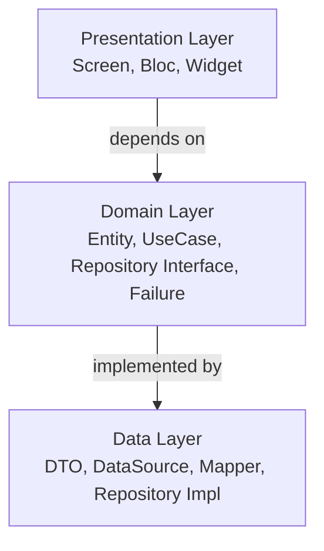
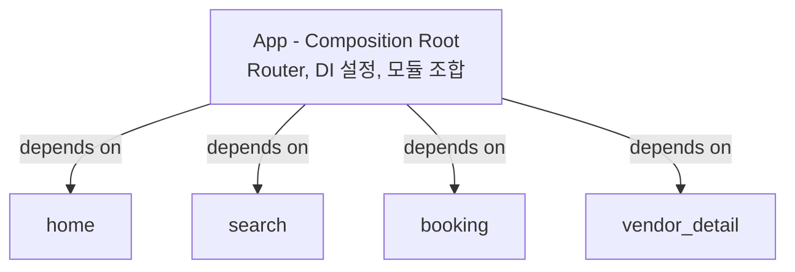

# Flutter Clean Architecture Guide

> **난이도**: 중급 | **카테고리**: core
> **선행 학습**: 없음
> **예상 학습 시간**: 2h

> 이 문서는 AI 에이전트(Claude, Copilot 등)가 프로젝트를 이해하고 작업할 때 반드시 참고해야 하는 가이드입니다.

> **학습 목표**: 이 문서를 학습하면 다음을 할 수 있습니다:
> - Flutter Clean Architecture의 3개 레이어(Presentation, Domain, Data) 구조를 이해하고 적용할 수 있습니다
> - Feature 기반 모듈화와 의존성 방향 규칙을 준수하여 프로젝트를 구조화할 수 있습니다
> - Repository 패턴, UseCase 패턴, Bloc 생명주기 관리 등 핵심 패턴을 실무에 적용할 수 있습니다

> **패키지 버전 (2026년 2월 기준)**
> ```yaml
> dependencies:
>   flutter_bloc: ^9.1.1
>   freezed_annotation: ^3.2.5
>   fpdart: ^1.2.0
>   get_it: ^8.0.3
>   injectable: ^2.7.1
>   go_router: ^14.8.1
>   dio: ^5.8.0+1
>   app_links: ^6.4.0
>
> dev_dependencies:
>   freezed: ^3.2.5
>   json_serializable: ^6.12.0
>   injectable_generator: ^2.7.1
>   build_runner: ^2.11.0
> ```

## 1. 프로젝트 개요

- **플랫폼**: Flutter
- **아키텍처**: Clean Architecture + Feature-based Modularization
- **패키지 관리**: Melos Monorepo
- **Flutter 버전 관리**: FVM

## 2. 절대 규칙 (MUST)

### 2.1 1 클래스 1 파일 원칙

```
Dart에서는 1클래스 1파일이 기본입니다. (위젯 코드 제외)
```

- **DTO, Entity, UseCase, Repository, Mapper, Failure** 등은 반드시 개별 파일로 분리
- **위젯(Widget)만 예외**: 하나의 Screen 파일에 private 위젯(`_WidgetName`) 포함 가능
- **Freezed로 생성된 union type**은 하나의 파일에 있어도 됨

### 2.2 Bloc 생명주기 관리

- **Bloc**: BlocProvider에서 직접 생성 (생명주기 자동 관리)
- **UseCase/Repository**: GetIt으로 관리 (singleton, 재사용)
- **이유**: BlocProvider가 close한 Bloc을 GetIt이 다시 반환하면 에러 발생

> 상세 내용은 [Bloc](./Bloc.md)의 "생명주기 관리" 섹션 참조

### 2.3 비즈니스 로직은 Bloc에

```dart
// ❌ Screen(State)에 비즈니스 로직 금지
class _MyScreenState extends State<MyScreen> {
  Future<void> _doSomething() async {
    await Future.delayed(const Duration(seconds: 1));  // 비즈니스 로직
    await someUseCase.call();  // 직접 호출
  }
}

// ✅ Bloc에서 처리
class MyBloc extends Bloc<MyEvent, MyState> {
  Future<void> _onStarted(Emitter<MyState> emit) async {
    emit(const MyState.loading());
    await Future.delayed(const Duration(seconds: 1));
    emit(const MyState.completed());
  }
}
```

## 3. 프로젝트 구조

```
{project}/
├── app/                    # 메인 앱 (라우터, DI 설정)
├── common/
│   ├── common_ui/          # 공통 UI 컴포넌트
│   ├── common_data/        # 공통 Data 레이어
│   └── common_auth/        # 공통 인증
├── core/
│   ├── core_network/       # 네트워크 (Dio)
│   └── core_utils/         # 유틸리티
└── features/
    ├── auth/               # 인증
    ├── home/               # 홈
    ├── intro/              # 인트로 (스플래시)
    ├── profile/            # 프로필
    ├── settings/           # 설정
    └── ...                 # 도메인별 feature 모듈
```

## 4. Feature 내부 구조

```
features/{feature_name}/lib/
├── {feature_name}.dart          # 메인 barrel 파일
├── data/
│   ├── data.dart                # Data 레이어 barrel
│   ├── datasources/
│   │   └── {feature}_remote_datasource.dart
│   ├── dto/
│   │   ├── {name}_dto.dart      # 1 DTO 1 파일
│   │   └── {name}_dto.g.dart    # json_serializable 생성
│   ├── mappers/
│   │   ├── {feature}_mapper.dart
│   │   └── {feature}_failure_mapper.dart
│   └── repositories/
│       └── {feature}_repository_impl.dart
├── domain/
│   ├── domain.dart              # Domain 레이어 barrel
│   ├── entities/
│   │   └── {name}.dart          # 1 Entity 1 파일
│   ├── failures/
│   │   └── {feature}_failure.dart
│   ├── repositories/
│   │   └── {feature}_repository.dart  # Interface
│   └── usecases/
│       └── {action}_{feature}_usecase.dart
├── presentation/
│   ├── presentation.dart        # Presentation 레이어 barrel
│   ├── bloc/
│   │   ├── {feature}_bloc.dart
│   │   ├── {feature}_event.dart
│   │   └── {feature}_state.dart
│   ├── screens/
│   │   └── {feature}_screen.dart
│   └── widgets/
│       └── {widget_name}.dart
└── src/
    ├── injection.dart
    └── injection.config.dart    # injectable 자동 생성
```

## 5. Barrel 파일 규칙

### 5.1 레이어별 Barrel

```dart
// data/data.dart
export 'datasources/home_remote_datasource.dart';
export 'dto/home_dto.dart';
export 'mappers/home_mapper.dart';
export 'repositories/home_repository_impl.dart';

// domain/domain.dart
export 'entities/home_data.dart';
export 'failures/home_failure.dart';
export 'repositories/home_repository.dart';
export 'usecases/get_home_data_usecase.dart';

// presentation/presentation.dart
export 'bloc/home_bloc.dart';
export 'bloc/home_event.dart';
export 'bloc/home_state.dart';
export 'screens/home_screen.dart';
```

### 5.2 Import 규칙

```dart
// ✅ 같은 feature 내에서는 barrel 파일 사용
import '../../domain/domain.dart';

// ✅ 같은 폴더 내 파일은 직접 import
import 'home_event.dart';
import 'home_state.dart';

// ✅ 외부 패키지는 직접 import
import 'package:flutter_bloc/flutter_bloc.dart';
```

## 6. 의존성 방향



- **Domain 레이어는 외부 의존성 없음** (순수 Dart)
- **Data → Domain**: Repository Interface 구현
- **Presentation → Domain**: UseCase 호출, Entity 사용

## 7. 라우팅 (Navigation)

### 7.1 라우팅은 App에서 중앙 관리



> 서로를 모름 - 완전히 독립적

### 7.2 이유: Feature 모듈 간 순환 의존성 방지

```
만약 각 Feature에서 라우팅을 정의하면:

home → vendor_detail 이동 → home이 vendor_detail 의존
vendor_detail → booking 이동 → vendor_detail이 booking 의존
booking → home 돌아가기 → booking이 home 의존

→ 순환 의존성 발생!
```

### 7.3 App Router 패턴

```dart
// app/lib/src/router/app_router.dart
GoRouter createAppRouter(AppAuthNotifier authNotifier) {
  return GoRouter(
    initialLocation: AppRoutes.splash,
    routes: [
      // intro feature
      // (_, _): Dart 3.0+ wildcard - context, state 모두 미사용 시
      GoRoute(
        path: AppRoutes.splash,
        builder: (_, _) => IntroScreen(onAuthCheck: authNotifier.checkAuthStatus),
      ),
      // auth feature
      GoRoute(
        path: AppRoutes.login,
        builder: (_, _) => LoginScreen(...),
      ),
      // home feature
      GoRoute(
        path: AppRoutes.home,
        builder: (_, _) => const HomeScreen(),
      ),
      // vendor_detail feature
      GoRoute(
        path: '/vendor/:id',
        builder: (_, state) => VendorDetailScreen(
          vendorId: state.pathParameters['id']!,
        ),
      ),
    ],
  );
}
```

### 7.4 Feature 모듈의 역할

```dart
// ✅ Feature는 Screen만 export
// features/home/lib/home.dart
export 'presentation/presentation.dart';  // HomeScreen 포함

// ❌ Feature에서 다른 Feature로 직접 라우팅 금지
// features/home/lib/presentation/screens/home_screen.dart
import 'package:vendor_detail/vendor_detail.dart';  // 금지!
Navigator.push(context, VendorDetailScreen(...));   // 금지!

// ✅ go_router의 path로 이동 (Feature 간 의존성 없음)
context.push('/vendor/$vendorId');
```

### 7.5 다른 플랫폼과의 비교

| 플랫폼 | 패턴 | 위치 |
|--------|------|------|
| Android | Navigation Graph (nav_graph.xml) | app 모듈 |
| iOS | Coordinator Pattern | AppCoordinator |
| Flutter | GoRouter | app/lib/src/router/ |

**핵심**: 모든 플랫폼에서 Navigation은 최상위 레이어(App)에서 관리

## 8. Failure 패턴 (Feature별 Failure)

### 핵심 원칙

- **Feature별 Failure 정의**: 공통 Failure가 아닌 각 Feature에서 자체 Failure 정의
- **Domain 순수성**: Domain 레이어는 외부 의존성이 없어야 함
- **Feature 독립성**: 각 Feature는 독립적으로 배포/테스트 가능

```dart
// features/home/lib/domain/failures/home_failure.dart
@freezed
class HomeFailure with _$HomeFailure {
  const factory HomeFailure.network() = _Network;
  const factory HomeFailure.server(String message) = _Server;
  const factory HomeFailure.unknown() = _Unknown;
}

// features/auth/lib/domain/failures/auth_failure.dart
@freezed
class AuthFailure with _$AuthFailure {
  const factory AuthFailure.network() = _Network;
  const factory AuthFailure.invalidCredentials() = _InvalidCredentials;  // auth 전용
  // ...
}
```

> 상세 내용(Failure Mapper 패턴, Feature별 정의 이유)은 [ErrorHandling](./ErrorHandling.md) 참조

## 9. 네이밍 컨벤션

| 타입 | 파일명 | 클래스명 |
|------|--------|----------|
| DTO | `{name}_dto.dart` | `{Name}Dto` |
| Entity | `{name}.dart` | `{Name}` |
| UseCase | `{action}_{name}_usecase.dart` | `{Action}{Name}UseCase` |
| Repository Interface | `{feature}_repository.dart` | `{Feature}Repository` |
| Repository Impl | `{feature}_repository_impl.dart` | `{Feature}RepositoryImpl` |
| DataSource | `{feature}_remote_datasource.dart` | `{Feature}RemoteDataSource` |
| Mapper | `{feature}_mapper.dart` | `{Feature}Mapper` |
| Failure | `{feature}_failure.dart` | `{Feature}Failure` |
| Bloc | `{feature}_bloc.dart` | `{Feature}Bloc` |
| Event | `{feature}_event.dart` | `{Feature}Event` |
| State | `{feature}_state.dart` | `{Feature}State` |
| Screen | `{feature}_screen.dart` | `{Feature}Screen` |

## Advanced Topics

> 아래 섹션은 고급 주제로, 기본 아키텍처 이해 후 필요 시 참고하세요.

## 10. Feature Flag 아키텍처

### 10.1 Feature Flag 서비스

```dart
// lib/core/feature_flags/feature_flag_service.dart
abstract class FeatureFlagService {
  Future<void> initialize();
  bool isEnabled(FeatureFlag flag);
  T getValue<T>(FeatureFlag flag);
  Stream<void> get onConfigUpdated;
}

enum FeatureFlag {
  newCheckoutFlow,
  darkModeV2,
  aiRecommendations,
  experimentalCamera,
}

// Firebase Remote Config 구현
class RemoteConfigFeatureFlags implements FeatureFlagService {
  final FirebaseRemoteConfig _remoteConfig;
  final _updateController = StreamController<void>.broadcast();

  RemoteConfigFeatureFlags(this._remoteConfig);

  @override
  Stream<void> get onConfigUpdated => _updateController.stream;

  void dispose() {
    _updateController.close();
  }

  @override
  Future<void> initialize() async {
    await _remoteConfig.setDefaults({
      'new_checkout_flow': false,
      'dark_mode_v2': false,
      'ai_recommendations': false,
      'experimental_camera': false,
    });

    await _remoteConfig.fetchAndActivate();

    // 실시간 업데이트 리스닝
    _remoteConfig.onConfigUpdated.listen((_) async {
      await _remoteConfig.activate();
      _updateController.add(null);
    });
  }

  @override
  bool isEnabled(FeatureFlag flag) {
    return _remoteConfig.getBool(_flagKey(flag));
  }

  @override
  T getValue<T>(FeatureFlag flag) {
    final key = _flagKey(flag);
    if (T == bool) return _remoteConfig.getBool(key) as T;
    if (T == String) return _remoteConfig.getString(key) as T;
    if (T == int) return _remoteConfig.getInt(key) as T;
    if (T == double) return _remoteConfig.getDouble(key) as T;
    throw UnsupportedError('Type $T not supported');
  }

  String _flagKey(FeatureFlag flag) {
    final snake = flag.name.replaceAllMapped(
      RegExp('([A-Z])'),
      (m) => '_${m.group(1)!.toLowerCase()}',
    );
    // PascalCase 입력 시 선행 underscore만 제거
    return snake.startsWith('_') ? snake.substring(1) : snake;
  }
}
```

### 10.2 UI에서 Feature Flag 사용

```dart
class CheckoutPage extends StatelessWidget {
  const CheckoutPage({super.key});

  @override
  Widget build(BuildContext context) {
    final featureFlags = context.read<FeatureFlagService>();

    if (featureFlags.isEnabled(FeatureFlag.newCheckoutFlow)) {
      return const NewCheckoutFlow();
    }
    return const LegacyCheckoutFlow();
  }
}

// 또는 위젯으로 래핑
class FeatureGate extends StatelessWidget {
  final FeatureFlag flag;
  final Widget enabled;
  final Widget disabled;

  const FeatureGate({
    super.key,
    required this.flag,
    required this.enabled,
    required this.disabled,
  });

  @override
  Widget build(BuildContext context) {
    final featureFlags = context.read<FeatureFlagService>();
    return StreamBuilder<void>(
      stream: featureFlags.onConfigUpdated,
      builder: (context, _) {
        final isEnabled = featureFlags.isEnabled(flag);
        return isEnabled ? enabled : disabled;
      },
    );
  }
}
```

### 10.3 점진적 롤아웃

```dart
// 사용자 버킷 기반 롤아웃
bool shouldEnableForUser(String userId, double rolloutPercentage) {
  // rolloutPercentage: 0.0 ~ 1.0 (예: 0.1 = 10%)
  final hash = userId.hashCode.abs();
  final bucket = hash % 100;
  return bucket < (rolloutPercentage * 100);
}
```

## 11. Deep Linking

### 11.1 GoRouter Deep Link 설정

```dart
final router = GoRouter(
  routes: [
    GoRoute(
      path: '/product/:id',
      builder: (context, state) {
        final productId = state.pathParameters['id']!;
        return ProductDetailPage(productId: productId);
      },
    ),
    GoRoute(
      path: '/invite/:code',
      redirect: (context, state) {
        final code = state.pathParameters['code']!;
        InviteService.processCode(code);
        return '/home';
      },
    ),
  ],
);
```

### 11.2 Android 설정

```xml
<!-- android/app/src/main/AndroidManifest.xml -->
<intent-filter android:autoVerify="true">
  <action android:name="android.intent.action.VIEW" />
  <category android:name="android.intent.category.DEFAULT" />
  <category android:name="android.intent.category.BROWSABLE" />
  <data
    android:scheme="https"
    android:host="example.com"
    android:pathPrefix="/product" />
</intent-filter>
```

### 11.3 iOS 설정

```xml
<!-- ios/Runner/Info.plist -->
<key>CFBundleURLTypes</key>
<array>
  <dict>
    <key>CFBundleURLSchemes</key>
    <array>
      <string>myapp</string>
    </array>
  </dict>
</array>

<key>FlutterDeepLinkingEnabled</key>
<true/>
```

### 11.4 Universal Links / App Links

```dart
// Requires: app_links package
// dependencies:
//   app_links: ^6.4.0

// 딥링크 핸들러
class DeepLinkHandler {
  static final _appLinks = AppLinks();

  static Future<void> handleInitialLink() async {
    // app_links 6.x API 사용
    final initialLink = await _appLinks.getInitialLink();
    if (initialLink != null) {
      _processLink(initialLink);
    }
  }

  static void listenToLinks() {
    // app_links 6.x API: uriLinkStream 사용
    _appLinks.uriLinkStream.listen((Uri uri) {
      _processLink(uri);
    });
  }

  static void _processLink(Uri uri) {
    // UTM 파라미터 추출
    final campaign = uri.queryParameters['utm_campaign'];
    if (campaign != null) {
      AnalyticsService.trackCampaign(campaign);
    }

    // 라우팅
    router.go(uri.path);
  }
}
```

## 12. 라이브러리 사용

| 용도 | 라이브러리 | 버전 |
|------|-----------|------|
| 상태 관리 | flutter_bloc | ^9.1.1 |
| DI | get_it + injectable | ^8.0.3 / ^2.7.1 |
| 불변 객체 | freezed + freezed_annotation | ^3.2.5 / ^3.2.5 |
| JSON 직렬화 | json_annotation + json_serializable | ^4.10.0 / ^6.12.0 |
| 함수형 | fpdart (Either, Option) | ^1.2.0 |
| 라우팅 | go_router | ^14.8.1 |
| 네트워크 | dio | ^5.8.0+1 |
| 코드 생성 | build_runner | ^2.11.0 |

## 13. Freezed 사용 패턴

### 13.1 Event

```dart
import 'package:freezed_annotation/freezed_annotation.dart';
part 'home_event.freezed.dart';

@freezed
class HomeEvent with _$HomeEvent {
  const factory HomeEvent.started() = _Started;
  const factory HomeEvent.refresh() = _Refresh;
  const factory HomeEvent.loadMore() = _LoadMore;
}
```

### 13.2 State

```dart
import 'package:freezed_annotation/freezed_annotation.dart';
part 'home_state.freezed.dart';

@freezed
class HomeState with _$HomeState {
  const factory HomeState.initial() = _Initial;
  const factory HomeState.loading() = _Loading;
  const factory HomeState.loaded(HomeData data) = _Loaded;
  const factory HomeState.error(String message) = _Error;
}
```

### 13.3 Failure

```dart
import 'package:freezed_annotation/freezed_annotation.dart';
part 'home_failure.freezed.dart';

@freezed
class HomeFailure with _$HomeFailure {
  const factory HomeFailure.network() = _Network;
  const factory HomeFailure.server(String message) = _Server;
  const factory HomeFailure.unknown() = _Unknown;
}
```

## 14. DTO 패턴 (json_serializable)

```dart
import 'package:json_annotation/json_annotation.dart';
part 'home_dto.g.dart';

@JsonSerializable(fieldRename: FieldRename.snake)
class HomeDto {
  final String id;
  final String title;
  final DateTime createdAt;

  HomeDto({
    required this.id,
    required this.title,
    required this.createdAt,
  });

  factory HomeDto.fromJson(Map<String, dynamic> json) => _$HomeDtoFromJson(json);
  Map<String, dynamic> toJson() => _$HomeDtoToJson(this);
}
```

## 15. UseCase 패턴

```dart
@injectable
class GetHomeDataUseCase {
  final HomeRepository _repository;
  GetHomeDataUseCase(this._repository);

  Future<Either<HomeFailure, HomeData>> call() => _repository.getHomeData();
}
```

## 16. Repository 패턴

```dart
// Interface (Domain)
abstract class HomeRepository {
  Future<Either<HomeFailure, HomeData>> getHomeData();
}

// Implementation (Data)
@LazySingleton(as: HomeRepository)
class HomeRepositoryImpl implements HomeRepository {
  @override
  Future<Either<HomeFailure, HomeData>> getHomeData() async {
    try {
      final dto = await _dataSource.getHomeData();
      return Right(_mapper.toEntity(dto));
    } on DioException catch (e) {
      return Left(HomeFailureMapper.fromDioException(e));
    }
  }
}
```

> Either 패턴, fold 사용법 등 함수형 에러 처리 상세 내용은 [Fpdart](./Fpdart.md) 참조

## 17. Bloc 패턴

```dart
class HomeBloc extends Bloc<HomeEvent, HomeState> {
  final GetHomeDataUseCase _getHomeDataUseCase;

  HomeBloc(this._getHomeDataUseCase) : super(const HomeState.initial()) {
    on<HomeEvent>(_onEvent);
  }

  Future<void> _onEvent(HomeEvent event, Emitter<HomeState> emit) async {
    await event.when(
      started: () => _onStarted(emit),
      refresh: () => _onRefresh(emit),
    );
  }

  Future<void> _onStarted(Emitter<HomeState> emit) async {
    emit(const HomeState.loading());
    final result = await _getHomeDataUseCase();
    result.fold(
      (failure) => emit(HomeState.error(_mapFailureMessage(failure))),
      (data) => emit(HomeState.loaded(data)),
    );
  }
}
```

> 상세 내용(Transformer, 동시성 처리, 테스트 등)은 [Bloc](./Bloc.md) 참조

## 18. Screen 패턴

```dart
import 'package:flutter/material.dart';
import 'package:flutter_bloc/flutter_bloc.dart';
import 'package:get_it/get_it.dart';

class HomeScreen extends StatelessWidget {
  const HomeScreen({super.key});

  @override
  Widget build(BuildContext context) {
    return BlocProvider(
      create: (_) => HomeBloc(
        GetIt.I<GetHomeDataUseCase>(),
      )..add(const HomeEvent.started()),
      child: const _HomeView(),
    );
  }
}

class _HomeView extends StatelessWidget {
  const _HomeView();

  @override
  Widget build(BuildContext context) {
    // LoadingIndicator, ErrorView: common_ui 패키지에서 정의된 공통 위젯
    return BlocBuilder<HomeBloc, HomeState>(
      builder: (context, state) {
        return state.when(
          initial: () => const SizedBox.shrink(),
          loading: () => const LoadingIndicator(),
          loaded: (data) => _buildContent(data),
          error: (message) => ErrorView(message: message),
        );
      },
    );
  }
}
```

## 19. 코드 생성 명령어

```bash
# 특정 feature에서 build_runner 실행
cd features/{feature_name}
fvm dart run build_runner build --delete-conflicting-outputs

# 전체 프로젝트 분석
melos run analyze

# 전체 프로젝트 build_runner (melos에 설정된 경우)
melos run build_runner
```

## 20. 새 Feature 생성 체크리스트

1. [ ] `features/{feature_name}/` 폴더 생성
2. [ ] `pubspec.yaml` 작성
3. [ ] 레이어 폴더 구조 생성 (data, domain, presentation, src)
4. [ ] Domain 레이어 먼저 작성 (Entity, Failure, Repository Interface, UseCase)
5. [ ] Data 레이어 작성 (DTO, DataSource, Mapper, Repository Impl)
6. [ ] Presentation 레이어 작성 (Bloc, Event, State, Screen)
7. [ ] Barrel 파일 작성 (data.dart, domain.dart, presentation.dart, {feature}.dart)
8. [ ] injection.dart 설정
9. [ ] build_runner 실행
10. [ ] melos bootstrap 실행
11. [ ] analyze 통과 확인

## 21. 자주 하는 실수

### ❌ 여러 클래스를 한 파일에

```dart
// ❌ 금지
// user_dto.dart
class UserDto { ... }
class UserResponseDto { ... }  // 별도 파일로 분리 필요
```

### ❌ Bloc을 Injectable로 등록

```dart
// ❌ 금지 - 생명주기 문제 발생
@injectable
class HomeBloc extends Bloc { ... }
```

### ❌ Screen에서 비즈니스 로직

```dart
// ❌ 금지
class _MyScreenState extends State<MyScreen> {
  void _onTap() async {
    await Future.delayed(const Duration(seconds: 1));  // Bloc으로 이동
  }
}
```

### ❌ 개별 파일 import (같은 feature 내)

```dart
// ❌ 비권장
import '../../domain/entities/home_data.dart';
import '../../domain/failures/home_failure.dart';

// ✅ 권장
import '../../domain/domain.dart';
```

### ❌ 공통 Failure 사용

```dart
// ❌ 금지 - Domain 순수성 및 Feature 독립성 위반
// common/lib/failures/common_failure.dart
class CommonFailure { ... }

// ✅ 권장 - Feature별 Failure 정의
// features/home/lib/domain/failures/home_failure.dart
class HomeFailure { ... }
```

## 22. 참고 사항

- **언어**: 코드 주석은 한글 가능, 변수/함수/클래스명은 영문
- **분석 도구**: `melos run analyze`로 전체 프로젝트 린트 체크
- **테스트**: 각 feature의 `test/` 폴더에 작성

## 관련 문서

| 문서 | 설명 |
|------|------|
| [Bloc.md](./Bloc.md) | 상태 관리 패턴 상세 |
| [BlocUiEffect.md](./BlocUiEffect.md) | 일회성 UI 이벤트 처리 |
| [Freezed.md](./Freezed.md) | 불변 데이터 모델 |
| [Fpdart.md](./Fpdart.md) | Either/TaskEither 함수형 에러 처리 |
| [DI.md](../infrastructure/DI.md) | 의존성 주입 설정 |
| [ErrorHandling.md](./ErrorHandling.md) | 에러 처리 전략 |
| [Networking_Dio.md](../networking/Networking_Dio.md) | 네트워크 통신 |

---
## 실습 과제

### 과제 1: 새로운 Feature 모듈 생성
새로운 기능을 Clean Architecture로 구현해보세요.

1. `features/product/` 폴더 구조 생성
2. Domain 레이어: Product Entity, ProductRepository Interface, GetProductsUseCase 작성
3. Data 레이어: ProductDto, ProductRemoteDataSource, ProductRepositoryImpl 작성
4. Presentation 레이어: ProductBloc, ProductEvent, ProductState, ProductScreen 작성
5. Barrel 파일(data.dart, domain.dart, presentation.dart) 작성
6. build_runner 실행 및 analyze 통과 확인

### 과제 2: Feature별 Failure 구현
기존 공통 Failure를 Feature별로 분리하는 리팩토링 작업을 수행하세요.

1. `auth` feature에 AuthFailure 정의 (invalidCredentials, userNotFound 포함)
2. `profile` feature에 ProfileFailure 정의 (permissionDenied, dataNotFound 포함)
3. 각 Repository에서 Feature별 Failure 사용하도록 수정
4. Bloc에서 Failure 처리 로직 업데이트

### 과제 3: Repository 패턴 구현
API 통신을 포함한 완전한 Repository를 구현하세요.

1. DataSource에서 Dio를 사용한 API 호출 구현
2. DTO → Entity 변환을 위한 Mapper 작성
3. DioException을 Feature Failure로 변환하는 FailureMapper 작성
4. Repository에서 Either<Failure, Entity> 반환하도록 구현
5. Unit 테스트 작성 (Mock을 사용한 성공/실패 케이스)

## Self-Check
- [ ] Clean Architecture의 3개 레이어(Presentation, Domain, Data)의 역할과 의존성 방향을 설명할 수 있다
- [ ] 1 클래스 1 파일 원칙을 이해하고, 예외 케이스(Widget, Freezed)를 구분할 수 있다
- [ ] Bloc을 GetIt에 등록하지 않는 이유와 BlocProvider로 생명주기를 관리하는 방법을 설명할 수 있다
- [ ] Feature 모듈의 폴더 구조를 올바르게 생성할 수 있다
- [ ] Barrel 파일의 목적과 사용 규칙을 이해하고 작성할 수 있다
- [ ] Navigation을 App 레이어에서 중앙 관리하는 이유를 설명할 수 있다
- [ ] Feature별 Failure를 정의하는 이유와 장점을 설명할 수 있다
- [ ] Repository 패턴에서 Interface(Domain)와 Implementation(Data)의 분리 이유를 설명할 수 있다
- [ ] Either<Failure, Entity> 패턴을 사용하여 에러를 처리할 수 있다
- [ ] 새 Feature를 생성할 때 올바른 순서(Domain → Data → Presentation)로 작업할 수 있다
- [ ] Feature Flag 서비스를 구현하고 Remote Config와 연동하는 방법을 이해한다
- [ ] Deep Link 설정(Android/iOS)과 GoRouter 연동 방법을 설명할 수 있다

---

학습 완료 후 다음 문서: [Bloc](./Bloc.md)
