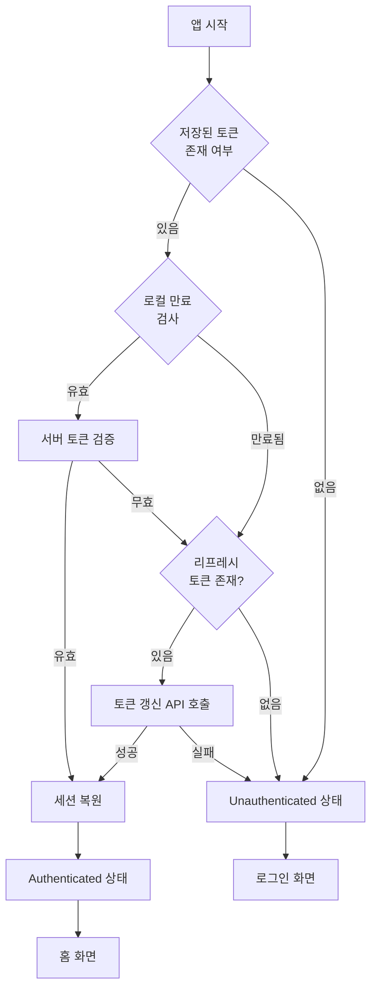
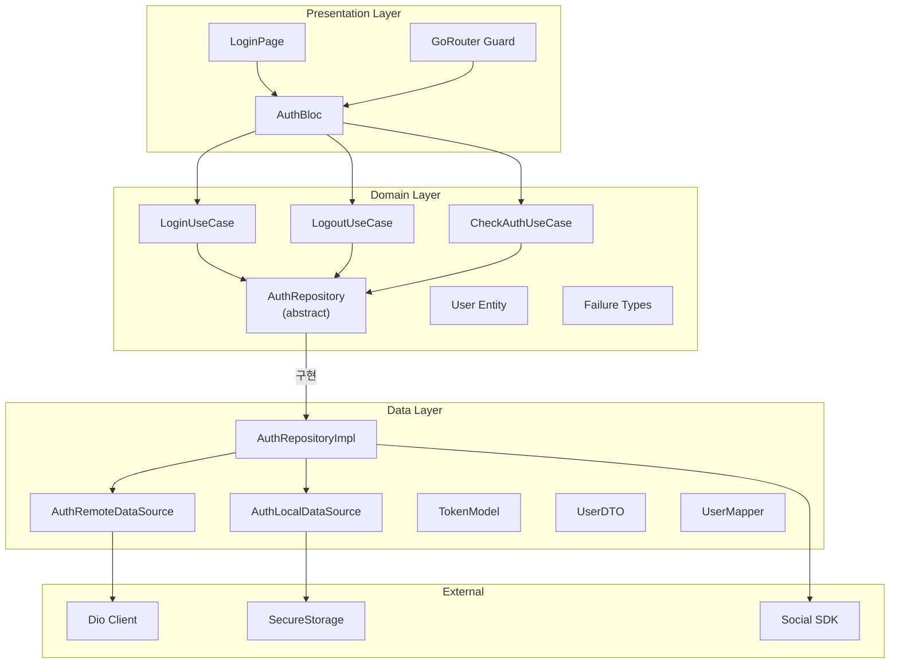
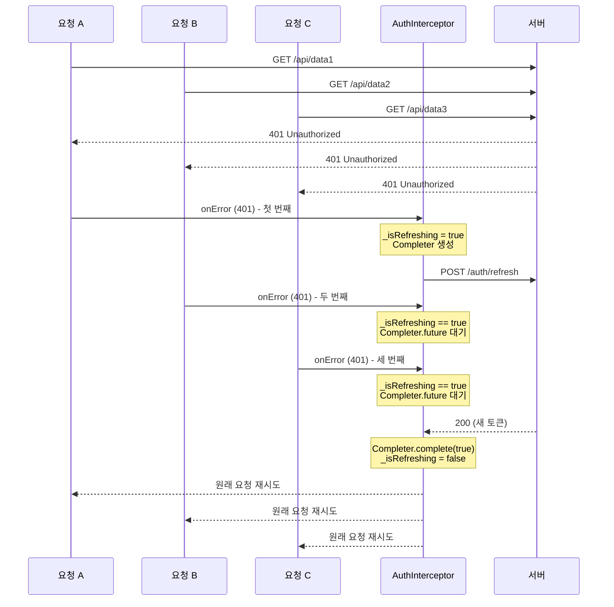
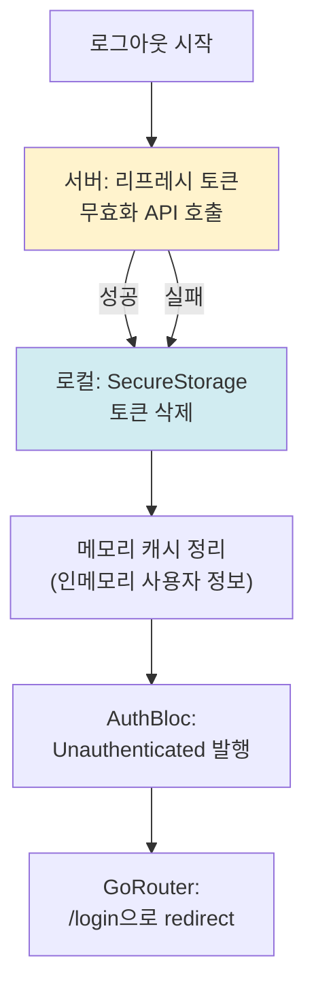
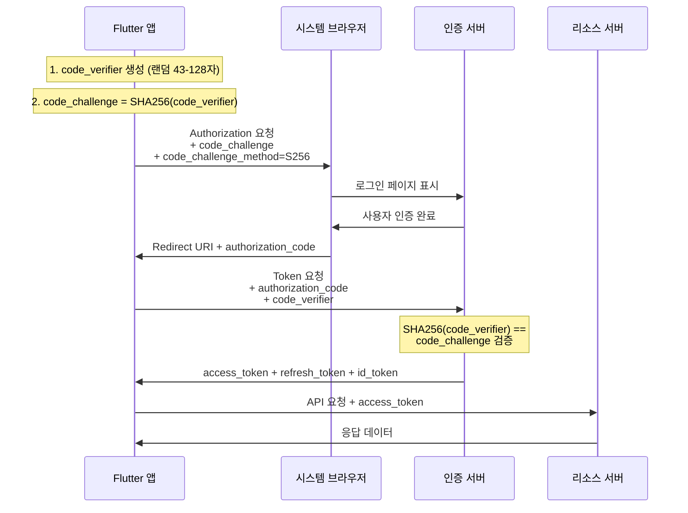
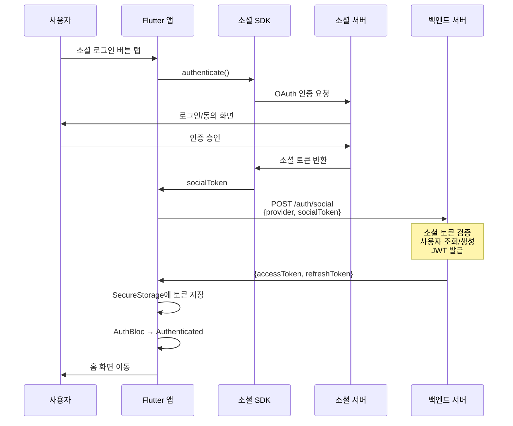
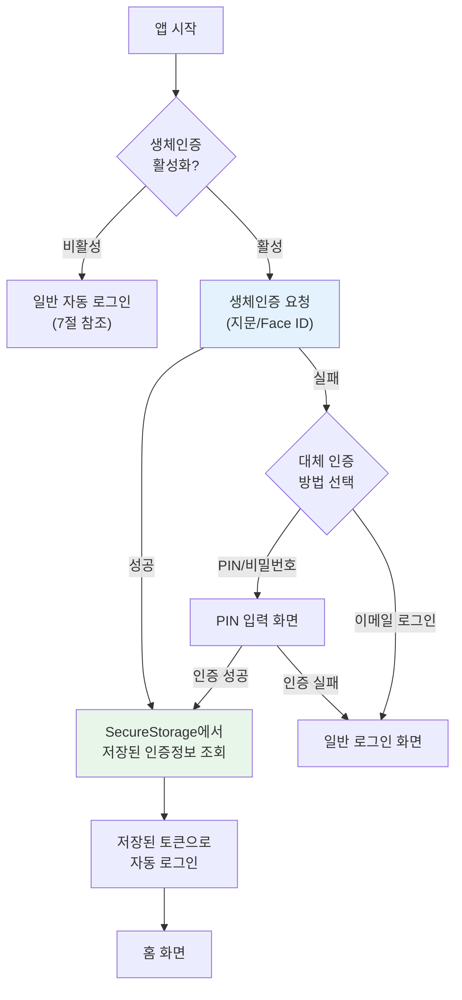

# Flutter 인증 통합 가이드 (Authentication)

> **마지막 업데이트**: 2026-02-08 | **Flutter 3.38** | **Dart 3.10**
> **난이도**: 고급 | **카테고리**: features
> **선행 학습**: [Architecture](../core/Architecture.md), [Bloc](../core/Bloc.md), [Networking](../networking/Networking_Dio.md), [Security](../system/Security.md)
> **예상 학습 시간**: 3h

## 학습 목표

이 문서를 학습하면 다음을 할 수 있습니다:

1. 인증 시스템의 전체 아키텍처를 Clean Architecture 레이어별로 설계하고 구현할 수 있다
2. 커스텀 백엔드 JWT 인증 흐름(로그인, 토큰 갱신, 로그아웃)을 완전하게 구현할 수 있다
3. OAuth2/OIDC + PKCE 흐름을 이해하고 Flutter 앱에 통합할 수 있다
4. 카카오 로그인을 포함한 소셜 로그인 통합 패턴을 설계하고 구현할 수 있다
5. 자동 로그인, 생체인증 연동, 역할 기반 접근 제어(RBAC) 흐름을 구현할 수 있다
6. 동시 401 에러 발생 시 Completer 패턴으로 토큰 갱신 큐를 관리할 수 있다
7. AuthBloc 단위 테스트와 인증 통합 테스트를 작성할 수 있다

## 개요

인증(Authentication)은 모든 모바일 앱의 핵심 기반입니다. 이 문서는 Flutter 앱에서 인증 시스템을 **Clean Architecture + Bloc 패턴**으로 설계하고 구현하는 전체 과정을 다룹니다.

기존 문서에서 다루는 개별 기술(토큰 저장, Auth Interceptor, Firebase Auth, GoRouter redirect 등)을 **하나의 인증 아키텍처**로 통합하는 것이 이 문서의 핵심 목적입니다.

> **이미 다른 문서에서 다루는 내용 (참조만 제공)**
>
> | 주제 | 참조 문서 |
> |------|----------|
> | Dio AuthInterceptor (토큰 부착 + 401 갱신 + 재시도) | [Auth Interceptor](../networking/Networking_Dio.md#41-auth-interceptor-토큰-관리) |
> | flutter_secure_storage 설정 및 토큰 CRUD | [SecureStorage](../system/Security.md) |
> | Firebase Auth (이메일/비밀번호, Google, Apple 로그인) | [Firebase Auth](../infrastructure/Firebase.md) |
> | GoRouter redirect 기본 패턴 | [GoRouter redirect](../core/BlocUiEffect.md) |
> | AuthState Freezed 정의 | [AuthState](../core/Freezed.md) |
> | local_auth 생체인증 기초 | [생체인증](../system/Security.md) |
> | 세션 만료 / AuthBloc.sessionExpired | [세션 만료](../system/AppLifecycle.md) |
> | UnauthorizedFailure 정의 | [인증 에러](../core/ErrorHandling.md) |

---

## 1. 인증 아키텍처 전체 구조

### 1.1 인증 플로우 전체 흐름

앱 시작부터 인증 상태 결정까지의 전체 흐름입니다.



### 1.2 인증 레이어 아키텍처

Clean Architecture 원칙에 따른 인증 레이어 구조입니다.



### 1.3 Clean Architecture 레이어 매핑

| 레이어 | 파일 | 역할 |
|--------|------|------|
| **Presentation** | `login_page.dart` | 로그인 UI |
| **Presentation** | `auth_bloc.dart` | 인증 상태 관리 |
| **Presentation** | `router.dart` | GoRouter guard |
| **Domain** | `user.dart` | User 엔티티 |
| **Domain** | `auth_repository.dart` | Repository 인터페이스 |
| **Domain** | `login_use_case.dart` | 로그인 유스케이스 |
| **Domain** | `auth_failure.dart` | 인증 실패 타입 |
| **Data** | `auth_repository_impl.dart` | Repository 구현체 |
| **Data** | `auth_remote_data_source.dart` | API 통신 |
| **Data** | `auth_local_data_source.dart` | 토큰 로컬 저장 |
| **Data** | `token_model.dart` | 토큰 데이터 모델 |
| **Data** | `user_dto.dart` | 서버 응답 DTO |

### 1.4 기존 문서 교차 참조

각 기존 문서가 인증 아키텍처의 어느 부분을 담당하는지 매핑합니다.

| 아키텍처 영역 | 담당 문서 | 핵심 내용 |
|---------------|-----------|-----------|
| 토큰 저장/조회/삭제 | [Security.md](../system/Security.md) | `flutter_secure_storage` CRUD |
| HTTP 요청 시 토큰 부착 | [Networking_Dio.md](../networking/Networking_Dio.md) | `AuthInterceptor.onRequest` |
| 401 응답 시 토큰 갱신 | [Networking_Dio.md](../networking/Networking_Dio.md) | `AuthInterceptor.onError` |
| AuthState 정의 (Freezed) | [Freezed.md](../core/Freezed.md) | `@freezed class AuthState` |
| 인증 기반 라우팅 | [BlocUiEffect.md](../core/BlocUiEffect.md) | `GoRouter.redirect` |
| Firebase 소셜 로그인 | [Firebase.md](../infrastructure/Firebase.md) | Google/Apple Sign-In |
| 인증 에러 처리 | [ErrorHandling.md](../core/ErrorHandling.md) | `UnauthorizedFailure` |
| 세션 만료 감지 | [AppLifecycle.md](../system/AppLifecycle.md) | `AuthBloc.sessionExpired` |
| 생체인증 기초 | [Security.md](../system/Security.md) | `local_auth` 패키지 |

---

## 2. 패키지 설정

```yaml
# pubspec.yaml (2026년 2월 기준)
dependencies:
  # 상태 관리
  flutter_bloc: ^9.1.1
  freezed_annotation: ^3.1.0

  # 네트워킹
  dio: ^5.9.1

  # 보안 저장소
  flutter_secure_storage: ^10.0.0

  # 라우팅
  go_router: ^17.1.0

  # 소셜 로그인
  google_sign_in: ^7.2.0
  sign_in_with_apple: ^7.0.1
  kakao_flutter_sdk_user: ^1.9.6

  # 생체인증
  local_auth: ^3.0.0

  # JWT 디코딩
  jwt_decoder: ^3.0.1

  # 함수형 에러 처리
  fpdart: ^1.2.0

  # DI
  get_it: ^9.2.0
  injectable: ^2.7.1

dev_dependencies:
  freezed: ^3.2.5
  json_serializable: ^6.12.0
  injectable_generator: ^2.12.0
  build_runner: ^2.11.0
  bloc_test: ^10.0.1
  mocktail: ^1.0.7
```

---

## 3. 완전한 AuthBloc 구현

### 3.1 User 엔티티

```dart
// domain/entities/user.dart

/// 인증된 사용자 엔티티
/// Domain 레이어에 위치하며 외부 의존성 없음
class User {
  final String id;
  final String email;
  final String name;
  final String? profileImageUrl;
  final UserRole role;
  final DateTime createdAt;

  const User({
    required this.id,
    required this.email,
    required this.name,
    this.profileImageUrl,
    required this.role,
    required this.createdAt,
  });
}

/// 사용자 역할 정의
enum UserRole {
  guest,
  user,
  admin;

  /// 해당 역할이 지정된 역할 이상의 권한을 가지는지 확인
  bool hasPermission(UserRole required) {
    return index >= required.index;
  }
}
```

### 3.2 Token 모델

```dart
// data/models/token_model.dart
import 'package:json_annotation/json_annotation.dart';
import 'package:jwt_decoder/jwt_decoder.dart';

part 'token_model.g.dart';

@JsonSerializable()
class TokenModel {
  final String accessToken;
  final String refreshToken;
  final int expiresIn; // 초 단위

  const TokenModel({
    required this.accessToken,
    required this.refreshToken,
    required this.expiresIn,
  });

  factory TokenModel.fromJson(Map<String, dynamic> json) =>
      _$TokenModelFromJson(json);

  Map<String, dynamic> toJson() => _$TokenModelToJson(this);

  /// JWT 토큰 만료 여부 확인 (로컬 검사)
  bool get isAccessTokenExpired => JwtDecoder.isExpired(accessToken);

  /// 토큰 만료까지 남은 시간
  Duration get remainingTime => JwtDecoder.getRemainingTime(accessToken);

  /// 만료 임박 여부 (5분 이내)
  bool get isAboutToExpire => remainingTime.inMinutes < 5;

  /// JWT 페이로드에서 사용자 ID 추출
  String? get userId {
    try {
      final payload = JwtDecoder.decode(accessToken);
      return payload['sub'] as String?;
    } catch (_) {
      return null;
    }
  }
}
```

### 3.3 AuthEvent 정의

```dart
// presentation/bloc/auth_event.dart
import 'package:freezed_annotation/freezed_annotation.dart';

part 'auth_event.freezed.dart';

/// 인증 이벤트 정의
/// Freezed union type으로 모든 인증 관련 이벤트를 정의
/// AuthState Freezed 패턴은 [Freezed.md](../core/Freezed.md) 참조
@freezed
sealed class AuthEvent with _$AuthEvent {
  /// 앱 시작 시 저장된 인증 상태 확인
  const factory AuthEvent.checkAuth() = CheckAuth;

  /// 이메일/비밀번호 로그인
  const factory AuthEvent.login({
    required String email,
    required String password,
  }) = Login;

  /// 소셜 로그인 (provider 지정)
  const factory AuthEvent.socialLogin({
    required SocialProvider provider,
  }) = SocialLogin;

  /// 로그아웃
  const factory AuthEvent.logout() = Logout;

  /// 토큰 갱신
  const factory AuthEvent.refreshToken() = RefreshToken;

  /// 회원 탈퇴
  const factory AuthEvent.deleteAccount() = DeleteAccount;

  /// 세션 만료 (외부에서 발행)
  /// 상세: [세션 만료](../system/AppLifecycle.md)
  const factory AuthEvent.sessionExpired() = SessionExpired;
}

/// 소셜 로그인 제공자
enum SocialProvider {
  google,
  apple,
  kakao,
}
```

### 3.4 AuthState 정의

```dart
// presentation/bloc/auth_state.dart
import 'package:freezed_annotation/freezed_annotation.dart';

part 'auth_state.freezed.dart';

/// 인증 상태 정의
/// Freezed union type 활용 → [AuthState 정의](../core/Freezed.md) 참조
@freezed
sealed class AuthState with _$AuthState {
  /// 초기 상태 (앱 시작, 아직 인증 확인 전)
  const factory AuthState.initial() = AuthInitial;

  /// 인증 처리 중 (로그인, 토큰 갱신 등)
  const factory AuthState.loading() = AuthLoading;

  /// 인증 완료 상태
  const factory AuthState.authenticated(User user) = Authenticated;

  /// 미인증 상태 (로그아웃, 토큰 만료 등)
  const factory AuthState.unauthenticated() = Unauthenticated;

  /// 인증 에러 상태
  const factory AuthState.error(String message) = AuthError;
}
```

### 3.5 AuthRepository 인터페이스

```dart
// domain/repositories/auth_repository.dart
import 'package:fpdart/fpdart.dart';

/// 인증 Repository 인터페이스 (Domain 레이어)
/// fpdart Either 패턴으로 에러 처리 → [Fpdart](../core/Fpdart.md) 참조
abstract class AuthRepository {
  /// 이메일/비밀번호 로그인
  Future<Either<Failure, User>> login({
    required String email,
    required String password,
  });

  /// 소셜 로그인
  Future<Either<Failure, User>> socialLogin(SocialProvider provider);

  /// 로그아웃 (서버 + 로컬)
  Future<Either<Failure, Unit>> logout();

  /// 토큰 갱신
  Future<Either<Failure, User>> refreshToken();

  /// 저장된 토큰으로 인증 상태 확인
  Future<Either<Failure, User>> checkAuth();

  /// 회원 탈퇴
  Future<Either<Failure, Unit>> deleteAccount();

  /// 현재 인증 상태 스트림
  Stream<bool> get isAuthenticated;
}
```

### 3.6 AuthRepository 구현체

```dart
// data/repositories/auth_repository_impl.dart
import 'package:fpdart/fpdart.dart';
import 'package:injectable/injectable.dart';

/// AuthRepository 구현체 (Data 레이어)
/// DI 설정: [DI](../infrastructure/DI.md) 참조
@LazySingleton(as: AuthRepository)
class AuthRepositoryImpl implements AuthRepository {
  final AuthRemoteDataSource _remoteDataSource;
  final AuthLocalDataSource _localDataSource;
  final SocialAuthProviderFactory _socialAuthFactory;
  final _authController = StreamController<bool>.broadcast();

  AuthRepositoryImpl(
    this._remoteDataSource,
    this._localDataSource,
    this._socialAuthFactory,
  );

  @override
  Stream<bool> get isAuthenticated => _authController.stream;

  @override
  Future<Either<Failure, User>> login({
    required String email,
    required String password,
  }) async {
    try {
      // 1. 서버 로그인 API 호출
      final tokenModel = await _remoteDataSource.login(
        email: email,
        password: password,
      );

      // 2. 토큰 로컬 저장
      // SecureStorage 상세: [SecureStorage](../system/Security.md)
      await _localDataSource.saveTokens(tokenModel);

      // 3. 사용자 정보 조회
      final userDto = await _remoteDataSource.getProfile();
      final user = userDto.toEntity();

      // 4. 인증 상태 알림
      _authController.add(true);

      return Right(user);
    } on DioException catch (e) {
      return Left(_mapDioError(e));
    } catch (e) {
      return Left(UnexpectedFailure(message: e.toString()));
    }
  }

  @override
  Future<Either<Failure, User>> socialLogin(SocialProvider provider) async {
    try {
      // 1. 소셜 SDK에서 인증 토큰 획득
      final socialAuth = _socialAuthFactory.create(provider);
      final socialToken = await socialAuth.authenticate();

      if (socialToken == null) {
        return const Left(AuthFailure.cancelled());
      }

      // 2. 소셜 토큰으로 백엔드 인증
      final tokenModel = await _remoteDataSource.socialLogin(
        provider: provider.name,
        socialToken: socialToken,
      );

      // 3. 토큰 저장
      await _localDataSource.saveTokens(tokenModel);

      // 4. 사용자 정보 조회
      final userDto = await _remoteDataSource.getProfile();
      final user = userDto.toEntity();

      _authController.add(true);
      return Right(user);
    } on SocialAuthCancelledException {
      return const Left(AuthFailure.cancelled());
    } catch (e) {
      return Left(UnexpectedFailure(message: e.toString()));
    }
  }

  @override
  Future<Either<Failure, Unit>> logout() async {
    try {
      // 1. 서버에 로그아웃 요청 (리프레시 토큰 무효화)
      final refreshToken = await _localDataSource.getRefreshToken();
      if (refreshToken != null) {
        await _remoteDataSource.logout(refreshToken: refreshToken);
      }
    } catch (_) {
      // 서버 로그아웃 실패해도 로컬은 반드시 정리
    } finally {
      // 2. 로컬 토큰 삭제
      await _localDataSource.clearTokens();
      _authController.add(false);
    }
    return const Right(unit);
  }

  @override
  Future<Either<Failure, User>> refreshToken() async {
    try {
      final refreshToken = await _localDataSource.getRefreshToken();
      if (refreshToken == null) {
        return const Left(AuthFailure.tokenNotFound());
      }

      final tokenModel = await _remoteDataSource.refreshToken(
        refreshToken: refreshToken,
      );

      await _localDataSource.saveTokens(tokenModel);

      final userDto = await _remoteDataSource.getProfile();
      return Right(userDto.toEntity());
    } on DioException catch (e) {
      if (e.response?.statusCode == 401) {
        // 리프레시 토큰도 만료됨 → 로컬 정리
        await _localDataSource.clearTokens();
        _authController.add(false);
        return const Left(AuthFailure.sessionExpired());
      }
      return Left(_mapDioError(e));
    } catch (e) {
      return Left(UnexpectedFailure(message: e.toString()));
    }
  }

  @override
  Future<Either<Failure, User>> checkAuth() async {
    try {
      // 1. 저장된 토큰 확인
      final accessToken = await _localDataSource.getAccessToken();
      if (accessToken == null) {
        return const Left(AuthFailure.tokenNotFound());
      }

      // 2. 로컬 만료 검사 (네트워크 비용 절약)
      final tokenModel = TokenModel(
        accessToken: accessToken,
        refreshToken: await _localDataSource.getRefreshToken() ?? '',
        expiresIn: 0,
      );

      if (tokenModel.isAccessTokenExpired) {
        // 3. 만료됨 → 갱신 시도
        return refreshToken();
      }

      // 4. 서버에서 사용자 정보 확인
      final userDto = await _remoteDataSource.getProfile();
      _authController.add(true);
      return Right(userDto.toEntity());
    } catch (e) {
      return refreshToken();
    }
  }

  @override
  Future<Either<Failure, Unit>> deleteAccount() async {
    try {
      await _remoteDataSource.deleteAccount();
      await _localDataSource.clearTokens();
      _authController.add(false);
      return const Right(unit);
    } on DioException catch (e) {
      return Left(_mapDioError(e));
    } catch (e) {
      return Left(UnexpectedFailure(message: e.toString()));
    }
  }

  /// DioException → Failure 매핑
  /// 상세: [인증 에러](../core/ErrorHandling.md)
  Failure _mapDioError(DioException e) {
    return switch (e.response?.statusCode) {
      401 => const UnauthorizedFailure(),
      403 => const AuthFailure.forbidden(),
      404 => const AuthFailure.userNotFound(),
      409 => const AuthFailure.duplicateEmail(),
      422 => AuthFailure.validation(
          message: e.response?.data?['message'] ?? '입력값이 올바르지 않습니다',
        ),
      _ => ServerFailure(
          statusCode: e.response?.statusCode,
          message: e.message ?? '서버 오류가 발생했습니다',
        ),
    };
  }
}
```

### 3.7 AuthBloc 구현

```dart
// presentation/bloc/auth_bloc.dart
import 'package:flutter_bloc/flutter_bloc.dart';
import 'package:injectable/injectable.dart';

/// AuthBloc - 인증 상태 관리의 중심
/// Bloc 패턴 상세: [Bloc](../core/Bloc.md)
/// Bloc 생명주기 관리: BlocProvider에서 생성, GetIt에서 관리하지 않음
@injectable
class AuthBloc extends Bloc<AuthEvent, AuthState> {
  final AuthRepository _authRepository;

  AuthBloc(this._authRepository) : super(const AuthState.initial()) {
    on<CheckAuth>(_onCheckAuth);
    on<Login>(_onLogin);
    on<SocialLogin>(_onSocialLogin);
    on<Logout>(_onLogout);
    on<RefreshToken>(_onRefreshToken);
    on<DeleteAccount>(_onDeleteAccount);
    on<SessionExpired>(_onSessionExpired);
  }

  /// 앱 시작 시 저장된 인증 상태 확인
  Future<void> _onCheckAuth(
    CheckAuth event,
    Emitter<AuthState> emit,
  ) async {
    emit(const AuthState.loading());

    final result = await _authRepository.checkAuth();

    result.fold(
      (failure) => emit(const AuthState.unauthenticated()),
      (user) => emit(AuthState.authenticated(user)),
    );
  }

  /// 이메일/비밀번호 로그인
  Future<void> _onLogin(
    Login event,
    Emitter<AuthState> emit,
  ) async {
    emit(const AuthState.loading());

    final result = await _authRepository.login(
      email: event.email,
      password: event.password,
    );

    result.fold(
      (failure) => emit(AuthState.error(_mapFailureMessage(failure))),
      (user) => emit(AuthState.authenticated(user)),
    );
  }

  /// 소셜 로그인
  Future<void> _onSocialLogin(
    SocialLogin event,
    Emitter<AuthState> emit,
  ) async {
    emit(const AuthState.loading());

    final result = await _authRepository.socialLogin(event.provider);

    result.fold(
      (failure) {
        // 사용자 취소는 에러가 아닌 이전 상태 유지
        if (failure is AuthFailure && failure == const AuthFailure.cancelled()) {
          emit(const AuthState.unauthenticated());
        } else {
          emit(AuthState.error(_mapFailureMessage(failure)));
        }
      },
      (user) => emit(AuthState.authenticated(user)),
    );
  }

  /// 로그아웃
  Future<void> _onLogout(
    Logout event,
    Emitter<AuthState> emit,
  ) async {
    emit(const AuthState.loading());
    await _authRepository.logout();
    emit(const AuthState.unauthenticated());
  }

  /// 토큰 갱신
  Future<void> _onRefreshToken(
    RefreshToken event,
    Emitter<AuthState> emit,
  ) async {
    final result = await _authRepository.refreshToken();

    result.fold(
      (failure) => emit(const AuthState.unauthenticated()),
      (user) => emit(AuthState.authenticated(user)),
    );
  }

  /// 회원 탈퇴
  Future<void> _onDeleteAccount(
    DeleteAccount event,
    Emitter<AuthState> emit,
  ) async {
    emit(const AuthState.loading());

    final result = await _authRepository.deleteAccount();

    result.fold(
      (failure) => emit(AuthState.error(_mapFailureMessage(failure))),
      (_) => emit(const AuthState.unauthenticated()),
    );
  }

  /// 세션 만료 처리
  /// AppLifecycle에서 발행: [세션 만료](../system/AppLifecycle.md)
  Future<void> _onSessionExpired(
    SessionExpired event,
    Emitter<AuthState> emit,
  ) async {
    await _authRepository.logout();
    emit(const AuthState.unauthenticated());
  }

  /// Failure → 사용자 메시지 변환
  String _mapFailureMessage(Failure failure) {
    return switch (failure) {
      UnauthorizedFailure() => '이메일 또는 비밀번호가 올바르지 않습니다',
      AuthFailure(:final message) when message != null => message,
      ServerFailure(:final message) => message ?? '서버 오류가 발생했습니다',
      NetworkFailure() => '네트워크 연결을 확인해주세요',
      _ => '알 수 없는 오류가 발생했습니다',
    };
  }
}
```

---

## 4. 커스텀 백엔드 JWT 인증 (비-Firebase)

Firebase를 사용하지 않고 자체 백엔드 서버와 JWT 기반 인증을 구현하는 패턴입니다.

### 4.1 AuthRemoteDataSource

```dart
// data/datasources/auth_remote_data_source.dart
import 'package:dio/dio.dart';
import 'package:injectable/injectable.dart';

/// 인증 관련 API 통신 담당
/// Dio 설정 상세: [Networking_Dio](../networking/Networking_Dio.md)
@LazySingleton()
class AuthRemoteDataSource {
  final Dio _dio;

  AuthRemoteDataSource(this._dio);

  /// 이메일/비밀번호 로그인
  Future<TokenModel> login({
    required String email,
    required String password,
  }) async {
    final response = await _dio.post(
      '/auth/login',
      data: {
        'email': email,
        'password': password,
      },
    );
    return TokenModel.fromJson(response.data);
  }

  /// 소셜 로그인 (백엔드에 소셜 토큰 전달)
  Future<TokenModel> socialLogin({
    required String provider,
    required String socialToken,
  }) async {
    final response = await _dio.post(
      '/auth/social',
      data: {
        'provider': provider,
        'token': socialToken,
      },
    );
    return TokenModel.fromJson(response.data);
  }

  /// 토큰 갱신
  Future<TokenModel> refreshToken({required String refreshToken}) async {
    final response = await _dio.post(
      '/auth/refresh',
      data: {'refresh_token': refreshToken},
    );
    return TokenModel.fromJson(response.data);
  }

  /// 사용자 프로필 조회
  Future<UserDto> getProfile() async {
    final response = await _dio.get('/auth/profile');
    return UserDto.fromJson(response.data);
  }

  /// 로그아웃 (리프레시 토큰 서버 무효화)
  Future<void> logout({required String refreshToken}) async {
    await _dio.post(
      '/auth/logout',
      data: {'refresh_token': refreshToken},
    );
  }

  /// 회원 탈퇴
  Future<void> deleteAccount() async {
    await _dio.delete('/auth/account');
  }
}
```

### 4.2 AuthLocalDataSource

```dart
// data/datasources/auth_local_data_source.dart
import 'package:flutter_secure_storage/flutter_secure_storage.dart';
import 'package:injectable/injectable.dart';

/// 토큰 로컬 저장소
/// SecureStorage 기본 설정: [SecureStorage](../system/Security.md)
@LazySingleton()
class AuthLocalDataSource {
  final FlutterSecureStorage _storage;

  // 키 상수 정의
  static const _accessTokenKey = 'access_token';
  static const _refreshTokenKey = 'refresh_token';
  static const _biometricEnabledKey = 'biometric_enabled';
  static const _savedEmailKey = 'saved_email';

  AuthLocalDataSource(this._storage);

  /// 토큰 저장
  Future<void> saveTokens(TokenModel tokens) async {
    await Future.wait([
      _storage.write(key: _accessTokenKey, value: tokens.accessToken),
      _storage.write(key: _refreshTokenKey, value: tokens.refreshToken),
    ]);
  }

  /// 액세스 토큰 조회
  Future<String?> getAccessToken() async {
    return _storage.read(key: _accessTokenKey);
  }

  /// 리프레시 토큰 조회
  Future<String?> getRefreshToken() async {
    return _storage.read(key: _refreshTokenKey);
  }

  /// 모든 토큰 삭제
  Future<void> clearTokens() async {
    await Future.wait([
      _storage.delete(key: _accessTokenKey),
      _storage.delete(key: _refreshTokenKey),
    ]);
  }

  /// 생체인증 활성화 여부 저장
  Future<void> setBiometricEnabled(bool enabled) async {
    await _storage.write(
      key: _biometricEnabledKey,
      value: enabled.toString(),
    );
  }

  /// 생체인증 활성화 여부 조회
  Future<bool> isBiometricEnabled() async {
    final value = await _storage.read(key: _biometricEnabledKey);
    return value == 'true';
  }

  /// 자동 로그인용 이메일 저장
  Future<void> saveEmail(String email) async {
    await _storage.write(key: _savedEmailKey, value: email);
  }

  /// 저장된 이메일 조회
  Future<String?> getSavedEmail() async {
    return _storage.read(key: _savedEmailKey);
  }
}
```

### 4.3 동시 401 처리: Completer 패턴

[Networking_Dio.md](../networking/Networking_Dio.md)의 기본 AuthInterceptor는 단일 요청의 401 처리만 다룹니다.
실제 앱에서는 **여러 API 요청이 동시에 401을 받는 경우**가 빈번합니다. 이때 토큰 갱신 요청이 중복 발생하지 않도록 `Completer` 패턴으로 큐를 관리해야 합니다.



```dart
// data/interceptors/queue_auth_interceptor.dart
import 'dart:async';
import 'package:dio/dio.dart';

/// 동시 401 처리를 위한 큐잉 AuthInterceptor
/// 기본 AuthInterceptor: [Auth Interceptor](../networking/Networking_Dio.md#41-auth-interceptor-토큰-관리)
class QueueAuthInterceptor extends Interceptor {
  final Dio _dio;
  final AuthLocalDataSource _localDataSource;
  final AuthRemoteDataSource _remoteDataSource;

  // 토큰 갱신 중 여부
  bool _isRefreshing = false;
  // 갱신 완료를 기다리는 Completer
  Completer<bool>? _refreshCompleter;

  QueueAuthInterceptor(
    this._dio,
    this._localDataSource,
    this._remoteDataSource,
  );

  @override
  void onRequest(
    RequestOptions options,
    RequestInterceptorHandler handler,
  ) async {
    try {
      // 공개 엔드포인트 스킵
      if (_isPublicEndpoint(options.path)) {
        return handler.next(options);
      }

      // 갱신 중이면 완료될 때까지 대기
      if (_isRefreshing) {
        final success = await _refreshCompleter?.future ?? false;
        if (!success) {
          return handler.reject(
            DioException(requestOptions: options, type: DioExceptionType.cancel),
          );
        }
      }

      // 토큰 부착
      final token = await _localDataSource.getAccessToken();
      if (token != null) {
        options.headers['Authorization'] = 'Bearer $token';
      }

      handler.next(options);
    } catch (e) {
      handler.reject(
        DioException(requestOptions: options, error: e),
      );
    }
  }

  @override
  void onError(DioException err, ErrorInterceptorHandler handler) async {
    try {
      if (err.response?.statusCode != 401) {
        return handler.next(err);
      }

      // 리프레시 엔드포인트 자체가 401이면 → 완전 만료
      if (err.requestOptions.path.contains('/auth/refresh')) {
        await _handleRefreshFailure();
        return handler.next(err);
      }

      // 이미 갱신 중이면 → 완료 대기 후 재시도
      if (_isRefreshing) {
        final success = await _refreshCompleter?.future ?? false;
        if (success) {
          final response = await _retryRequest(err.requestOptions);
          return handler.resolve(response);
        }
        return handler.next(err);
      }

      // 첫 번째 401 → 갱신 시작
      _isRefreshing = true;
      _refreshCompleter = Completer<bool>();

      try {
        final refreshToken = await _localDataSource.getRefreshToken();
        if (refreshToken == null) {
          _completeRefresh(false);
          return handler.next(err);
        }

        // 토큰 갱신 API 호출
        final tokenModel = await _remoteDataSource.refreshToken(
          refreshToken: refreshToken,
        );

        // 새 토큰 저장
        await _localDataSource.saveTokens(tokenModel);

        // 대기 중인 모든 요청에 성공 알림
        _completeRefresh(true);

        // 원래 요청 재시도
        final response = await _retryRequest(err.requestOptions);
        return handler.resolve(response);
      } catch (_) {
        _completeRefresh(false);
        await _handleRefreshFailure();
        return handler.next(err);
      }
    } catch (e) {
      handler.next(err);
    }
  }

  /// Completer 완료 처리
  void _completeRefresh(bool success) {
    _refreshCompleter?.complete(success);
    _isRefreshing = false;
    _refreshCompleter = null;
  }

  /// 갱신 실패 시 로컬 토큰 정리
  Future<void> _handleRefreshFailure() async {
    await _localDataSource.clearTokens();
  }

  /// 새 토큰으로 원래 요청 재시도
  Future<Response<dynamic>> _retryRequest(RequestOptions options) async {
    final token = await _localDataSource.getAccessToken();
    options.headers['Authorization'] = 'Bearer $token';

    return _dio.fetch(options);
  }

  /// 공개 엔드포인트 여부 확인
  bool _isPublicEndpoint(String path) {
    const publicPaths = ['/auth/login', '/auth/register', '/auth/refresh'];
    return publicPaths.any((p) => path.contains(p));
  }
}
```

### 4.4 로그아웃 플로우

로그아웃은 서버와 로컬 양쪽의 정리가 필요합니다.



> **중요**: 서버 로그아웃이 실패하더라도 로컬 토큰은 반드시 삭제해야 합니다. `finally` 블록으로 보장합니다 (3.6절 `logout` 참조).

---

## 5. OAuth2 / OIDC with PKCE

### 5.1 PKCE 흐름 설명

PKCE(Proof Key for Code Exchange)는 모바일 앱처럼 client secret을 안전하게 저장할 수 없는 환경에서 OAuth2 Authorization Code 흐름을 보호하는 확장 메커니즘입니다.



### 5.2 PKCE 구현

```dart
// data/datasources/oauth_data_source.dart
import 'dart:convert';
import 'dart:math';
import 'package:crypto/crypto.dart';
import 'package:url_launcher/url_launcher.dart';
import 'package:app_links/app_links.dart';
import 'package:dio/dio.dart';

/// OAuth2 + PKCE 인증 구현
/// 딥링크 설정: [DeepLinking](../features/DeepLinking.md)
class OAuthDataSource {
  final Dio _dio;
  final AppLinks _appLinks;
  final OAuthConfig _config;

  OAuthDataSource(this._dio, this._appLinks, this._config);

  /// PKCE 인증 플로우 시작
  Future<TokenModel> authenticate() async {
    // 1. code_verifier 생성 (43-128자 랜덤 문자열)
    final codeVerifier = _generateCodeVerifier();

    // 2. code_challenge 생성 (SHA256 해시)
    final codeChallenge = _generateCodeChallenge(codeVerifier);

    // 3. state 생성 (CSRF 방지)
    final state = _generateRandomString(32);

    // 4. Authorization URL 구성
    final authUrl = Uri.parse(_config.authorizationEndpoint).replace(
      queryParameters: {
        'response_type': 'code',
        'client_id': _config.clientId,
        'redirect_uri': _config.redirectUri,
        'scope': _config.scopes.join(' '),
        'code_challenge': codeChallenge,
        'code_challenge_method': 'S256',
        'state': state,
      },
    );

    // 5. 시스템 브라우저로 인증 페이지 열기
    await launchUrl(authUrl, mode: LaunchMode.externalApplication);

    // 6. Redirect URI에서 authorization code 수신 대기
    final redirectUri = await _appLinks.uriLinkStream.firstWhere(
      (uri) => uri.toString().startsWith(_config.redirectUri),
    );

    // 7. state 검증 (CSRF 방지)
    final receivedState = redirectUri.queryParameters['state'];
    if (receivedState != state) {
      throw const AuthException('잘못된 state 값입니다. CSRF 공격 가능성');
    }

    // 8. authorization code 추출
    final code = redirectUri.queryParameters['code'];
    if (code == null) {
      final error = redirectUri.queryParameters['error'];
      throw AuthException('인증 실패: $error');
    }

    // 9. authorization code → token 교환
    return _exchangeCodeForTokens(code, codeVerifier);
  }

  /// Authorization Code → Token 교환
  Future<TokenModel> _exchangeCodeForTokens(
    String code,
    String codeVerifier,
  ) async {
    final response = await _dio.post(
      _config.tokenEndpoint,
      data: {
        'grant_type': 'authorization_code',
        'code': code,
        'redirect_uri': _config.redirectUri,
        'client_id': _config.clientId,
        'code_verifier': codeVerifier,
      },
      options: Options(
        contentType: Headers.formUrlEncodedContentType,
      ),
    );

    return TokenModel.fromJson(response.data);
  }

  /// code_verifier 생성 (RFC 7636)
  String _generateCodeVerifier() {
    return _generateRandomString(128);
  }

  /// code_challenge 생성 (SHA256)
  String _generateCodeChallenge(String verifier) {
    final bytes = utf8.encode(verifier);
    final digest = sha256.convert(bytes);
    return base64Url.encode(digest.bytes).replaceAll('=', '');
  }

  /// 랜덤 문자열 생성
  String _generateRandomString(int length) {
    const chars =
        'ABCDEFGHIJKLMNOPQRSTUVWXYZabcdefghijklmnopqrstuvwxyz0123456789-._~';
    final random = Random.secure();
    return List.generate(length, (_) => chars[random.nextInt(chars.length)])
        .join();
  }
}

/// OAuth 설정
class OAuthConfig {
  final String clientId;
  final String authorizationEndpoint;
  final String tokenEndpoint;
  final String redirectUri;
  final List<String> scopes;

  const OAuthConfig({
    required this.clientId,
    required this.authorizationEndpoint,
    required this.tokenEndpoint,
    required this.redirectUri,
    this.scopes = const ['openid', 'profile', 'email'],
  });
}
```

### 5.3 ID Token 검증

```dart
// data/utils/id_token_validator.dart
import 'package:jwt_decoder/jwt_decoder.dart';

/// OIDC ID Token 검증
/// 프로덕션에서는 서버 사이드 검증을 권장
class IdTokenValidator {
  final String issuer;
  final String clientId;

  const IdTokenValidator({
    required this.issuer,
    required this.clientId,
  });

  /// ID Token 검증 (기본 클레임 확인)
  /// 프로덕션에서는 서명 검증을 서버에서 수행해야 함
  ValidationResult validate(String idToken) {
    try {
      // 1. 만료 여부 확인
      if (JwtDecoder.isExpired(idToken)) {
        return const ValidationResult.invalid('ID Token이 만료되었습니다');
      }

      final payload = JwtDecoder.decode(idToken);

      // 2. issuer(iss) 확인
      if (payload['iss'] != issuer) {
        return const ValidationResult.invalid('잘못된 issuer입니다');
      }

      // 3. audience(aud) 확인
      final aud = payload['aud'];
      final isValidAud = aud is String
          ? aud == clientId
          : (aud as List?)?.contains(clientId) ?? false;
      if (!isValidAud) {
        return const ValidationResult.invalid('잘못된 audience입니다');
      }

      // 4. subject(sub) 존재 확인
      if (payload['sub'] == null) {
        return const ValidationResult.invalid('sub 클레임이 없습니다');
      }

      return ValidationResult.valid(payload);
    } catch (e) {
      return ValidationResult.invalid('토큰 파싱 실패: $e');
    }
  }
}

/// ID Token 검증 결과
sealed class ValidationResult {
  const ValidationResult();

  const factory ValidationResult.valid(Map<String, dynamic> claims) =
      ValidToken;
  const factory ValidationResult.invalid(String reason) = InvalidToken;
}

class ValidToken extends ValidationResult {
  final Map<String, dynamic> claims;
  const ValidToken(this.claims);
}

class InvalidToken extends ValidationResult {
  final String reason;
  const InvalidToken(this.reason);
}
```

---

## 6. 소셜 로그인 통합 패턴

### 6.1 SocialAuthProvider 추상화

여러 소셜 로그인 제공자를 일관된 인터페이스로 통합합니다.

```dart
// domain/auth/social_auth_provider.dart

/// 소셜 인증 제공자 인터페이스
/// 각 소셜 SDK의 차이를 추상화
abstract class SocialAuthProvider {
  /// 소셜 로그인 수행 → 소셜 토큰 반환
  /// 사용자 취소 시 null 반환
  Future<String?> authenticate();

  /// 소셜 계정 연결 해제
  Future<void> disconnect();

  /// 제공자 타입
  SocialProvider get type;
}
```

### 6.2 Provider Factory 패턴

```dart
// data/auth/social_auth_provider_factory.dart
import 'package:injectable/injectable.dart';

/// 소셜 인증 제공자 팩토리
/// 런타임에 적절한 소셜 로그인 구현체를 생성
@LazySingleton()
class SocialAuthProviderFactory {
  final GoogleAuthProvider _googleAuth;
  final AppleAuthProvider _appleAuth;
  final KakaoAuthProvider _kakaoAuth;

  SocialAuthProviderFactory(
    this._googleAuth,
    this._appleAuth,
    this._kakaoAuth,
  );

  /// 소셜 제공자 타입에 따라 적절한 구현체 반환
  SocialAuthProvider create(SocialProvider provider) {
    return switch (provider) {
      SocialProvider.google => _googleAuth,
      SocialProvider.apple => _appleAuth,
      SocialProvider.kakao => _kakaoAuth,
    };
  }
}
```

### 6.3 Google 로그인 구현

```dart
// data/auth/google_auth_provider.dart
import 'package:google_sign_in/google_sign_in.dart';
import 'package:injectable/injectable.dart';

/// Google 로그인 구현
/// Firebase 연동 방식: [Firebase Auth](../infrastructure/Firebase.md)
/// 여기서는 Firebase 없이 커스텀 백엔드 방식
@LazySingleton()
class GoogleAuthProvider implements SocialAuthProvider {
  final GoogleSignIn _googleSignIn = GoogleSignIn(
    scopes: ['email', 'profile'],
  );

  @override
  SocialProvider get type => SocialProvider.google;

  @override
  Future<String?> authenticate() async {
    try {
      final account = await _googleSignIn.signIn();
      if (account == null) return null; // 사용자 취소

      final auth = await account.authentication;
      // ID Token을 백엔드에 전달하여 서버 사이드 검증
      return auth.idToken;
    } catch (e) {
      throw SocialAuthException('Google 로그인 실패: $e');
    }
  }

  @override
  Future<void> disconnect() async {
    await _googleSignIn.disconnect();
  }
}
```

### 6.4 Apple 로그인 구현

```dart
// data/auth/apple_auth_provider.dart
import 'package:sign_in_with_apple/sign_in_with_apple.dart';
import 'package:injectable/injectable.dart';

/// Apple 로그인 구현
/// iOS에서는 소셜 로그인 제공 시 Apple 로그인 필수 (App Store 정책)
@LazySingleton()
class AppleAuthProvider implements SocialAuthProvider {
  @override
  SocialProvider get type => SocialProvider.apple;

  @override
  Future<String?> authenticate() async {
    try {
      final credential = await SignInWithApple.getAppleIDCredential(
        scopes: [
          AppleIDAuthorizationScopes.email,
          AppleIDAuthorizationScopes.fullName,
        ],
      );

      // identityToken을 백엔드에 전달하여 서버 사이드 검증
      return credential.identityToken;
    } on SignInWithAppleAuthorizationException catch (e) {
      if (e.code == AuthorizationErrorCode.canceled) {
        return null; // 사용자 취소
      }
      throw SocialAuthException('Apple 로그인 실패: ${e.message}');
    }
  }

  @override
  Future<void> disconnect() async {
    // Apple은 SDK 레벨에서 disconnect 미지원
    // 서버에서 토큰 revoke 처리 필요
  }
}
```

### 6.5 카카오 로그인 구현

```dart
// data/auth/kakao_auth_provider.dart
import 'package:kakao_flutter_sdk_user/kakao_flutter_sdk_user.dart';
import 'package:injectable/injectable.dart';

/// 카카오 로그인 구현 (kakao_flutter_sdk_user ^1.9.6)
/// 한국 서비스에서 필수적인 소셜 로그인 제공자
@LazySingleton()
class KakaoAuthProvider implements SocialAuthProvider {
  @override
  SocialProvider get type => SocialProvider.kakao;

  @override
  Future<String?> authenticate() async {
    try {
      OAuthToken token;

      // 카카오톡 앱이 설치되어 있으면 앱 로그인, 아니면 웹 로그인
      if (await isKakaoTalkInstalled()) {
        token = await UserApi.instance.loginWithKakaoTalk();
      } else {
        token = await UserApi.instance.loginWithKakaoAccount();
      }

      // 카카오 액세스 토큰을 백엔드에 전달
      return token.accessToken;
    } on KakaoAuthException catch (e) {
      // 사용자 취소인 경우
      if (e.error == AuthErrorCause.accessDenied) {
        return null;
      }
      throw SocialAuthException('카카오 로그인 실패: ${e.message}');
    } catch (e) {
      throw SocialAuthException('카카오 로그인 실패: $e');
    }
  }

  @override
  Future<void> disconnect() async {
    try {
      await UserApi.instance.unlink();
    } catch (_) {
      // 연결 해제 실패는 무시 (이미 해제되었을 수 있음)
    }
  }
}
```

#### 카카오 SDK 초기화 설정

```dart
// main.dart
import 'package:kakao_flutter_sdk_user/kakao_flutter_sdk_user.dart';

void main() {
  WidgetsFlutterBinding.ensureInitialized();

  // 카카오 SDK 초기화
  KakaoSdk.init(
    nativeAppKey: const String.fromEnvironment('KAKAO_NATIVE_APP_KEY'),
    javaScriptAppKey: const String.fromEnvironment('KAKAO_JS_APP_KEY'),
  );

  runApp(const MyApp());
}
```

```xml
<!-- Android: android/app/src/main/AndroidManifest.xml -->
<activity
    android:name="com.kakao.sdk.flutter.AuthCodeCustomTabsActivity"
    android:exported="true">
    <intent-filter android:label="flutter_web_auth2">
        <action android:name="android.intent.action.VIEW" />
        <category android:name="android.intent.category.DEFAULT" />
        <category android:name="android.intent.category.BROWSABLE" />
        <data android:scheme="kakao${KAKAO_NATIVE_APP_KEY}"
              android:host="oauth" />
    </intent-filter>
</activity>
```

```xml
<!-- iOS: ios/Runner/Info.plist -->
<key>CFBundleURLTypes</key>
<array>
    <dict>
        <key>CFBundleURLSchemes</key>
        <array>
            <string>kakao${KAKAO_NATIVE_APP_KEY}</string>
        </array>
    </dict>
</array>
<key>LSApplicationQueriesSchemes</key>
<array>
    <string>kakaokompassauth</string>
    <string>kakaolink</string>
    <string>kakaoplus</string>
</array>
```

### 6.6 계정 연결 (Account Linking)

하나의 사용자 계정에 여러 소셜 로그인을 연결하는 패턴입니다.

```dart
// data/datasources/account_linking_data_source.dart

/// 계정 연결 API 통신
class AccountLinkingDataSource {
  final Dio _dio;

  AccountLinkingDataSource(this._dio);

  /// 현재 계정에 소셜 로그인 연결
  Future<void> linkSocialAccount({
    required String provider,
    required String socialToken,
  }) async {
    await _dio.post(
      '/auth/link',
      data: {
        'provider': provider,
        'token': socialToken,
      },
    );
  }

  /// 소셜 로그인 연결 해제
  Future<void> unlinkSocialAccount({required String provider}) async {
    await _dio.delete('/auth/link/$provider');
  }

  /// 연결된 소셜 계정 목록 조회
  Future<List<LinkedAccount>> getLinkedAccounts() async {
    final response = await _dio.get('/auth/linked-accounts');
    return (response.data as List)
        .map((e) => LinkedAccount.fromJson(e))
        .toList();
  }
}

/// 연결된 소셜 계정 정보
class LinkedAccount {
  final String provider;
  final String socialEmail;
  final DateTime linkedAt;

  const LinkedAccount({
    required this.provider,
    required this.socialEmail,
    required this.linkedAt,
  });

  factory LinkedAccount.fromJson(Map<String, dynamic> json) {
    return LinkedAccount(
      provider: json['provider'] as String,
      socialEmail: json['social_email'] as String,
      linkedAt: DateTime.parse(json['linked_at'] as String),
    );
  }
}
```

### 6.7 소셜 로그인 + 커스텀 백엔드 전체 흐름



---

## 7. 자동 로그인 플로우

### 7.1 앱 시작 시 완전한 자동 로그인 흐름

```mermaid
flowchart TD
    AppStart["앱 시작\n(SplashScreen)"] --> Init["앱 초기화\n(DI, SDK 등)"]
    Init --> DispatchCheck["AuthBloc.add\n(CheckAuth)"]
    DispatchCheck --> HasToken{"SecureStorage\n토큰 존재?"}

    HasToken -->|없음| GoLogin["LoginPage 이동"]
    HasToken -->|있음| CheckExpiry{"JWT 로컬\n만료 검사"}

    CheckExpiry -->|유효| ServerCheck["서버 프로필 조회\n(토큰 유효성 확인)"]
    CheckExpiry -->|만료| HasRefresh{"리프레시\n토큰 존재?"}

    ServerCheck -->|성공| GoHome["HomePage 이동"]
    ServerCheck -->|실패 (401)| HasRefresh

    HasRefresh -->|없음| ClearAndLogin["토큰 삭제\nLoginPage 이동"]
    HasRefresh -->|있음| Refresh["토큰 갱신\nAPI 호출"]

    Refresh -->|성공| SaveAndGo["새 토큰 저장\nHomePage 이동"]
    Refresh -->|실패| ClearAndLogin

    style AppStart fill:#e8f5e9
    style GoHome fill:#c8e6c9
    style GoLogin fill:#ffccbc
    style ClearAndLogin fill:#ffccbc
```

### 7.2 SplashScreen 구현

```dart
// presentation/pages/splash_page.dart
import 'package:flutter/material.dart';
import 'package:flutter_bloc/flutter_bloc.dart';

/// 스플래시 화면 - 자동 로그인 처리
/// 앱 시작 시 AuthBloc.checkAuth를 발행하고 결과에 따라 라우팅
class SplashPage extends StatefulWidget {
  const SplashPage({super.key});

  @override
  State<SplashPage> createState() => _SplashPageState();
}

class _SplashPageState extends State<SplashPage> {
  @override
  void initState() {
    super.initState();
    // 앱 시작 시 인증 상태 확인 이벤트 발행
    context.read<AuthBloc>().add(const AuthEvent.checkAuth());
  }

  @override
  Widget build(BuildContext context) {
    return const Scaffold(
      body: Center(
        child: CircularProgressIndicator(),
      ),
    );
  }
}
```

### 7.3 GoRouter 설정과 연동

```dart
// presentation/router/app_router.dart
import 'package:go_router/go_router.dart';
import 'package:flutter_bloc/flutter_bloc.dart';

/// GoRouter 인증 기반 라우팅
/// 기본 redirect 패턴: [GoRouter redirect](../core/BlocUiEffect.md)
GoRouter appRouter(AuthBloc authBloc) => GoRouter(
  initialLocation: '/splash',

  // AuthBloc 상태 변경 시 라우팅 재평가
  refreshListenable: GoRouterRefreshStream(authBloc.stream),

  redirect: (context, state) {
    final authState = authBloc.state;
    final currentPath = state.matchedLocation;

    // 스플래시 화면에서는 redirect하지 않음 (초기 로딩 중)
    if (authState is AuthInitial || authState is AuthLoading) {
      if (currentPath != '/splash') return '/splash';
      return null;
    }

    final isAuthenticated = authState is Authenticated;
    final isAuthRoute = currentPath == '/login' ||
        currentPath == '/register' ||
        currentPath == '/splash';

    // 미인증 + 인증 필요 페이지 → 로그인으로
    if (!isAuthenticated && !isAuthRoute) return '/login';

    // 인증됨 + 인증 페이지에 있음 → 홈으로
    if (isAuthenticated && isAuthRoute) return '/home';

    return null;
  },

  routes: [
    GoRoute(
      path: '/splash',
      builder: (_, __) => const SplashPage(),
    ),
    GoRoute(
      path: '/login',
      builder: (_, __) => const LoginPage(),
    ),
    GoRoute(
      path: '/home',
      builder: (_, __) => const HomePage(),
    ),
    // ... 추가 라우트
  ],
);

/// Bloc Stream → Listenable 변환 (GoRouter refreshListenable용)
class GoRouterRefreshStream extends ChangeNotifier {
  GoRouterRefreshStream(Stream<dynamic> stream) {
    _subscription = stream.listen((_) => notifyListeners());
  }

  late final StreamSubscription<dynamic> _subscription;

  @override
  void dispose() {
    _subscription.cancel();
    super.dispose();
  }
}
```

---

## 8. 역할 기반 접근 제어 (RBAC)

### 8.1 라우트 메타데이터 정의

```dart
// presentation/router/route_config.dart

/// 라우트별 접근 권한 설정
/// GoRouter redirect 기본 패턴 확장: [GoRouter redirect](../core/BlocUiEffect.md)
class RouteConfig {
  /// 라우트 경로 → 필요 역할 매핑
  static const Map<String, UserRole> routePermissions = {
    '/admin': UserRole.admin,
    '/admin/users': UserRole.admin,
    '/admin/settings': UserRole.admin,
    '/dashboard': UserRole.user,
    '/profile': UserRole.user,
    '/settings': UserRole.user,
    '/public': UserRole.guest,
  };

  /// 해당 경로에 접근하기 위해 필요한 최소 역할
  static UserRole requiredRole(String path) {
    // 정확한 경로 매치 → 접두사 매치 순서로 검색
    if (routePermissions.containsKey(path)) {
      return routePermissions[path]!;
    }

    // 접두사 매치 (하위 경로 포함)
    for (final entry in routePermissions.entries) {
      if (path.startsWith(entry.key)) {
        return entry.value;
      }
    }

    // 기본: 인증된 사용자
    return UserRole.user;
  }
}
```

### 8.2 역할 기반 GoRouter Guard

```dart
// presentation/router/role_based_router.dart

/// 역할 기반 접근 제어를 포함한 GoRouter
GoRouter roleBasedRouter(AuthBloc authBloc) => GoRouter(
  initialLocation: '/splash',
  refreshListenable: GoRouterRefreshStream(authBloc.stream),

  redirect: (context, state) {
    final authState = authBloc.state;
    final currentPath = state.matchedLocation;

    // 1. 인증 상태 확인 (기본 redirect)
    if (authState is AuthInitial || authState is AuthLoading) {
      if (currentPath != '/splash') return '/splash';
      return null;
    }

    final isAuthenticated = authState is Authenticated;
    final isAuthRoute = currentPath == '/login' ||
        currentPath == '/register' ||
        currentPath == '/splash';

    if (!isAuthenticated && !isAuthRoute) return '/login';
    if (isAuthenticated && isAuthRoute) return '/home';

    // 2. 역할 기반 접근 제어
    if (isAuthenticated) {
      final user = (authState as Authenticated).user;
      final requiredRole = RouteConfig.requiredRole(currentPath);

      if (!user.role.hasPermission(requiredRole)) {
        // 권한 부족 → 권한 없음 페이지로 이동
        return '/unauthorized';
      }
    }

    return null;
  },

  routes: [
    GoRoute(
      path: '/splash',
      builder: (_, __) => const SplashPage(),
    ),
    GoRoute(
      path: '/login',
      builder: (_, __) => const LoginPage(),
    ),
    GoRoute(
      path: '/home',
      builder: (_, __) => const HomePage(),
    ),
    GoRoute(
      path: '/admin',
      builder: (_, __) => const AdminPage(),
      routes: [
        GoRoute(
          path: 'users',
          builder: (_, __) => const AdminUsersPage(),
        ),
        GoRoute(
          path: 'settings',
          builder: (_, __) => const AdminSettingsPage(),
        ),
      ],
    ),
    GoRoute(
      path: '/unauthorized',
      builder: (_, __) => const UnauthorizedPage(),
    ),
  ],
);
```

### 8.3 위젯 레벨 역할 제어

```dart
// presentation/widgets/role_guard_widget.dart

/// 역할에 따라 위젯 표시/숨김 처리
class RoleGuard extends StatelessWidget {
  final UserRole requiredRole;
  final Widget child;
  final Widget? fallback;

  const RoleGuard({
    super.key,
    required this.requiredRole,
    required this.child,
    this.fallback,
  });

  @override
  Widget build(BuildContext context) {
    return BlocSelector<AuthBloc, AuthState, bool>(
      selector: (state) {
        if (state is! Authenticated) return false;
        return state.user.role.hasPermission(requiredRole);
      },
      builder: (context, hasPermission) {
        if (hasPermission) return child;
        return fallback ?? const SizedBox.shrink();
      },
    );
  }
}

// 사용 예시
class SettingsPage extends StatelessWidget {
  const SettingsPage({super.key});

  @override
  Widget build(BuildContext context) {
    return Column(
      children: [
        // 모든 사용자에게 표시
        const ProfileSettingsTile(),
        const NotificationSettingsTile(),

        // 관리자에게만 표시
        RoleGuard(
          requiredRole: UserRole.admin,
          child: const AdminSettingsTile(),
        ),
      ],
    );
  }
}
```

---

## 9. 생체인증 통합

이 섹션은 `local_auth`의 기본 사용법이 아닌, **생체인증과 토큰 기반 인증을 결합하는 고급 패턴**을 다룹니다.

> `local_auth` 기본 설정 및 사용법: [생체인증](../system/Security.md)

### 9.1 생체인증 + 토큰 인증 결합 흐름



### 9.2 BiometricAuthService 구현

```dart
// data/services/biometric_auth_service.dart
import 'package:local_auth/local_auth.dart';
import 'package:injectable/injectable.dart';

/// 생체인증 + 토큰 인증 통합 서비스
/// local_auth 기본 설정: [생체인증](../system/Security.md)
@LazySingleton()
class BiometricAuthService {
  final LocalAuthentication _localAuth;
  final AuthLocalDataSource _localDataSource;
  final AuthRepository _authRepository;

  BiometricAuthService(
    this._localAuth,
    this._localDataSource,
    this._authRepository,
  );

  /// 생체인증 사용 가능 여부 확인
  Future<bool> isAvailable() async {
    final canCheck = await _localAuth.canCheckBiometrics;
    final isDeviceSupported = await _localAuth.isDeviceSupported();
    return canCheck && isDeviceSupported;
  }

  /// 사용 가능한 생체인증 유형 조회
  Future<List<BiometricType>> getAvailableBiometrics() async {
    return _localAuth.getAvailableBiometrics();
  }

  /// 생체인증이 앱에서 활성화되어 있는지 확인
  Future<bool> isEnabled() async {
    return _localDataSource.isBiometricEnabled();
  }

  /// 생체인증으로 로그인 시도
  /// 1. 생체인증 검증
  /// 2. 검증 성공 시 저장된 토큰으로 자동 로그인
  Future<Either<Failure, User>> authenticateWithBiometric() async {
    try {
      // 1. 생체인증 활성화 여부 확인
      final enabled = await _localDataSource.isBiometricEnabled();
      if (!enabled) {
        return const Left(AuthFailure.biometricNotEnabled());
      }

      // 2. 생체인증 수행
      final authenticated = await _localAuth.authenticate(
        localizedReason: '로그인을 위해 생체인증을 사용합니다',
        options: const AuthenticationOptions(
          stickyAuth: true,
          biometricOnly: false, // PIN/패턴 대체 허용
        ),
      );

      if (!authenticated) {
        return const Left(AuthFailure.biometricFailed());
      }

      // 3. 저장된 토큰으로 인증 상태 복원
      return _authRepository.checkAuth();
    } catch (e) {
      return Left(UnexpectedFailure(message: '생체인증 실패: $e'));
    }
  }

  /// 생체인증 활성화 (로그인 상태에서 설정)
  Future<Either<Failure, Unit>> enableBiometric() async {
    try {
      // 1. 기기 지원 여부 확인
      final available = await isAvailable();
      if (!available) {
        return const Left(AuthFailure.biometricNotAvailable());
      }

      // 2. 생체인증 한 번 검증 (활성화 확인)
      final authenticated = await _localAuth.authenticate(
        localizedReason: '생체인증을 활성화하려면 인증해주세요',
        options: const AuthenticationOptions(
          stickyAuth: true,
          biometricOnly: true,
        ),
      );

      if (!authenticated) {
        return const Left(AuthFailure.biometricFailed());
      }

      // 3. 활성화 플래그 저장
      await _localDataSource.setBiometricEnabled(true);

      return const Right(unit);
    } catch (e) {
      return Left(UnexpectedFailure(message: '생체인증 활성화 실패: $e'));
    }
  }

  /// 생체인증 비활성화
  Future<void> disableBiometric() async {
    await _localDataSource.setBiometricEnabled(false);
  }
}
```

### 9.3 생체인증 설정 UI

```dart
// presentation/widgets/biometric_settings_tile.dart

/// 설정 화면의 생체인증 토글 위젯
class BiometricSettingsTile extends StatelessWidget {
  const BiometricSettingsTile({super.key});

  @override
  Widget build(BuildContext context) {
    return FutureBuilder<bool>(
      future: context.read<BiometricAuthService>().isAvailable(),
      builder: (context, snapshot) {
        // 생체인증 미지원 기기에서는 숨김
        if (snapshot.data != true) return const SizedBox.shrink();

        return FutureBuilder<bool>(
          future: context.read<BiometricAuthService>().isEnabled(),
          builder: (context, enabledSnapshot) {
            final isEnabled = enabledSnapshot.data ?? false;

            return SwitchListTile(
              title: const Text('생체인증으로 로그인'),
              subtitle: const Text('지문 또는 Face ID로 빠르게 로그인'),
              value: isEnabled,
              onChanged: (value) async {
                final service = context.read<BiometricAuthService>();
                if (value) {
                  final result = await service.enableBiometric();
                  result.fold(
                    (failure) => ScaffoldMessenger.of(context).showSnackBar(
                      SnackBar(content: Text('활성화 실패: $failure')),
                    ),
                    (_) => setState(() {}),
                  );
                } else {
                  await service.disableBiometric();
                }
              },
            );
          },
        );
      },
    );
  }
}
```

---

## 10. 인증 테스트 전략

### 10.1 MockAuthRepository

```dart
// test/mocks/mock_auth_repository.dart
import 'package:mocktail/mocktail.dart';
import 'package:fpdart/fpdart.dart';

/// 테스트용 Mock AuthRepository
/// 테스트 패턴 상세: [Testing](../system/Testing.md)
class MockAuthRepository extends Mock implements AuthRepository {}

/// 테스트용 고정 사용자 데이터
class TestFixtures {
  static const testUser = User(
    id: 'test-user-1',
    email: 'test@example.com',
    name: '테스트 사용자',
    profileImageUrl: null,
    role: UserRole.user,
    createdAt: DateTime(2026, 1, 1),
  );

  static const adminUser = User(
    id: 'admin-user-1',
    email: 'admin@example.com',
    name: '관리자',
    profileImageUrl: null,
    role: UserRole.admin,
    createdAt: DateTime(2026, 1, 1),
  );

  static const testToken = TokenModel(
    accessToken: 'test-access-token',
    refreshToken: 'test-refresh-token',
    expiresIn: 3600,
  );
}
```

### 10.2 AuthBloc 단위 테스트

```dart
// test/presentation/bloc/auth_bloc_test.dart
import 'package:bloc_test/bloc_test.dart';
import 'package:flutter_test/flutter_test.dart';
import 'package:fpdart/fpdart.dart';
import 'package:mocktail/mocktail.dart';

void main() {
  late AuthBloc authBloc;
  late MockAuthRepository mockAuthRepository;

  setUp(() {
    mockAuthRepository = MockAuthRepository();
    authBloc = AuthBloc(mockAuthRepository);

    // 기본 스트림 설정
    when(() => mockAuthRepository.isAuthenticated)
        .thenAnswer((_) => const Stream.empty());
  });

  tearDown(() {
    authBloc.close();
  });

  group('AuthBloc', () {
    test('초기 상태는 AuthInitial이다', () {
      expect(authBloc.state, const AuthState.initial());
    });

    group('Login', () {
      blocTest<AuthBloc, AuthState>(
        '로그인 성공 시 Authenticated 상태를 발행한다',
        build: () {
          when(
            () => mockAuthRepository.login(
              email: any(named: 'email'),
              password: any(named: 'password'),
            ),
          ).thenAnswer((_) async => Right(TestFixtures.testUser));
          return authBloc;
        },
        act: (bloc) => bloc.add(
          const AuthEvent.login(
            email: 'test@example.com',
            password: 'password123',
          ),
        ),
        expect: () => [
          const AuthState.loading(),
          AuthState.authenticated(TestFixtures.testUser),
        ],
        verify: (_) {
          verify(
            () => mockAuthRepository.login(
              email: 'test@example.com',
              password: 'password123',
            ),
          ).called(1);
        },
      );

      blocTest<AuthBloc, AuthState>(
        '로그인 실패 시 Error 상태를 발행한다',
        build: () {
          when(
            () => mockAuthRepository.login(
              email: any(named: 'email'),
              password: any(named: 'password'),
            ),
          ).thenAnswer(
            (_) async => const Left(UnauthorizedFailure()),
          );
          return authBloc;
        },
        act: (bloc) => bloc.add(
          const AuthEvent.login(
            email: 'test@example.com',
            password: 'wrong-password',
          ),
        ),
        expect: () => [
          const AuthState.loading(),
          const AuthState.error('이메일 또는 비밀번호가 올바르지 않습니다'),
        ],
      );
    });

    group('CheckAuth', () {
      blocTest<AuthBloc, AuthState>(
        '저장된 토큰이 유효하면 Authenticated 상태를 발행한다',
        build: () {
          when(() => mockAuthRepository.checkAuth())
              .thenAnswer((_) async => Right(TestFixtures.testUser));
          return authBloc;
        },
        act: (bloc) => bloc.add(const AuthEvent.checkAuth()),
        expect: () => [
          const AuthState.loading(),
          AuthState.authenticated(TestFixtures.testUser),
        ],
      );

      blocTest<AuthBloc, AuthState>(
        '저장된 토큰이 없으면 Unauthenticated 상태를 발행한다',
        build: () {
          when(() => mockAuthRepository.checkAuth())
              .thenAnswer((_) async => const Left(AuthFailure.tokenNotFound()));
          return authBloc;
        },
        act: (bloc) => bloc.add(const AuthEvent.checkAuth()),
        expect: () => [
          const AuthState.loading(),
          const AuthState.unauthenticated(),
        ],
      );
    });

    group('RefreshToken', () {
      blocTest<AuthBloc, AuthState>(
        '토큰 갱신 성공 시 Authenticated 상태를 발행한다',
        build: () {
          when(() => mockAuthRepository.refreshToken())
              .thenAnswer((_) async => Right(TestFixtures.testUser));
          return authBloc;
        },
        act: (bloc) => bloc.add(const AuthEvent.refreshToken()),
        expect: () => [
          AuthState.authenticated(TestFixtures.testUser),
        ],
      );

      blocTest<AuthBloc, AuthState>(
        '토큰 갱신 실패 시 Unauthenticated 상태를 발행한다',
        build: () {
          when(() => mockAuthRepository.refreshToken()).thenAnswer(
            (_) async => const Left(AuthFailure.sessionExpired()),
          );
          return authBloc;
        },
        act: (bloc) => bloc.add(const AuthEvent.refreshToken()),
        expect: () => [
          const AuthState.unauthenticated(),
        ],
      );
    });

    group('Logout', () {
      blocTest<AuthBloc, AuthState>(
        '로그아웃 시 Unauthenticated 상태를 발행한다',
        build: () {
          when(() => mockAuthRepository.logout())
              .thenAnswer((_) async => const Right(unit));
          return authBloc;
        },
        act: (bloc) => bloc.add(const AuthEvent.logout()),
        expect: () => [
          const AuthState.loading(),
          const AuthState.unauthenticated(),
        ],
      );
    });

    group('DeleteAccount', () {
      blocTest<AuthBloc, AuthState>(
        '회원 탈퇴 성공 시 Unauthenticated 상태를 발행한다',
        build: () {
          when(() => mockAuthRepository.deleteAccount())
              .thenAnswer((_) async => const Right(unit));
          return authBloc;
        },
        act: (bloc) => bloc.add(const AuthEvent.deleteAccount()),
        expect: () => [
          const AuthState.loading(),
          const AuthState.unauthenticated(),
        ],
      );
    });

    group('SessionExpired', () {
      blocTest<AuthBloc, AuthState>(
        '세션 만료 시 로그아웃 후 Unauthenticated 상태를 발행한다',
        build: () {
          when(() => mockAuthRepository.logout())
              .thenAnswer((_) async => const Right(unit));
          return authBloc;
        },
        act: (bloc) => bloc.add(const AuthEvent.sessionExpired()),
        expect: () => [
          const AuthState.unauthenticated(),
        ],
      );
    });
  });
}
```

### 10.3 위젯 테스트

```dart
// test/presentation/pages/login_page_test.dart
import 'package:flutter/material.dart';
import 'package:flutter_bloc/flutter_bloc.dart';
import 'package:flutter_test/flutter_test.dart';
import 'package:bloc_test/bloc_test.dart';
import 'package:mocktail/mocktail.dart';

class MockAuthBloc extends MockBloc<AuthEvent, AuthState>
    implements AuthBloc {}

void main() {
  late MockAuthBloc mockAuthBloc;

  setUp(() {
    mockAuthBloc = MockAuthBloc();
  });

  Widget createTestWidget() {
    return MaterialApp(
      home: BlocProvider<AuthBloc>.value(
        value: mockAuthBloc,
        child: const LoginPage(),
      ),
    );
  }

  group('LoginPage', () {
    testWidgets('로딩 중일 때 로딩 인디케이터를 표시한다', (tester) async {
      when(() => mockAuthBloc.state).thenReturn(const AuthState.loading());

      await tester.pumpWidget(createTestWidget());
      await tester.pump();

      expect(find.byType(CircularProgressIndicator), findsOneWidget);
    });

    testWidgets('에러 상태일 때 에러 메시지를 표시한다', (tester) async {
      when(() => mockAuthBloc.state).thenReturn(
        const AuthState.error('이메일 또는 비밀번호가 올바르지 않습니다'),
      );

      await tester.pumpWidget(createTestWidget());
      await tester.pump();

      expect(find.text('이메일 또는 비밀번호가 올바르지 않습니다'), findsOneWidget);
    });

    testWidgets('로그인 버튼 탭 시 Login 이벤트를 발행한다', (tester) async {
      when(() => mockAuthBloc.state)
          .thenReturn(const AuthState.unauthenticated());

      await tester.pumpWidget(createTestWidget());

      // 이메일 입력
      await tester.enterText(
        find.byKey(const Key('email_field')),
        'test@example.com',
      );

      // 비밀번호 입력
      await tester.enterText(
        find.byKey(const Key('password_field')),
        'password123',
      );

      // 로그인 버튼 탭
      await tester.tap(find.byKey(const Key('login_button')));
      await tester.pump();

      verify(
        () => mockAuthBloc.add(
          const AuthEvent.login(
            email: 'test@example.com',
            password: 'password123',
          ),
        ),
      ).called(1);
    });
  });
}
```

### 10.4 통합 테스트

```dart
// integration_test/auth_flow_test.dart
import 'package:flutter_test/flutter_test.dart';
import 'package:integration_test/integration_test.dart';
import 'package:flutter/material.dart';

void main() {
  IntegrationTestWidgetsFlutterBinding.ensureInitialized();

  group('인증 플로우 통합 테스트', () {
    testWidgets('비인증 상태에서 앱 시작 시 로그인 화면으로 이동한다', (tester) async {
      // 앱 시작 (토큰 없는 상태)
      await tester.pumpWidget(const MyApp());
      await tester.pumpAndSettle();

      // 스플래시 → 로그인 화면 전환 확인
      expect(find.byType(LoginPage), findsOneWidget);
    });

    testWidgets('로그인 성공 시 홈 화면으로 이동한다', (tester) async {
      await tester.pumpWidget(const MyApp());
      await tester.pumpAndSettle();

      // 이메일 입력
      await tester.enterText(
        find.byKey(const Key('email_field')),
        'test@example.com',
      );

      // 비밀번호 입력
      await tester.enterText(
        find.byKey(const Key('password_field')),
        'password123',
      );

      // 로그인 버튼 탭
      await tester.tap(find.byKey(const Key('login_button')));
      await tester.pumpAndSettle();

      // 홈 화면 이동 확인
      expect(find.byType(HomePage), findsOneWidget);
    });

    testWidgets('로그아웃 시 로그인 화면으로 이동한다', (tester) async {
      // 이미 로그인된 상태에서 시작 (테스트용 토큰 주입)
      await tester.pumpWidget(const MyApp());
      await tester.pumpAndSettle();

      // 설정 화면으로 이동
      await tester.tap(find.byIcon(Icons.settings));
      await tester.pumpAndSettle();

      // 로그아웃 버튼 탭
      await tester.tap(find.text('로그아웃'));
      await tester.pumpAndSettle();

      // 확인 다이얼로그에서 확인
      await tester.tap(find.text('확인'));
      await tester.pumpAndSettle();

      // 로그인 화면 이동 확인
      expect(find.byType(LoginPage), findsOneWidget);
    });
  });
}
```

---

## 11. 보안 체크리스트 및 베스트 프랙티스

### 토큰 저장 보안

- [ ] 토큰은 반드시 `flutter_secure_storage`에 저장 (SharedPreferences 사용 금지)
- [ ] 액세스 토큰 수명은 짧게 설정 (15분~1시간 권장)
- [ ] 리프레시 토큰은 서버 사이드 로테이션 적용 (사용 시마다 새 토큰 발급)
- [ ] 로그아웃 시 서버에서 리프레시 토큰 무효화 (블랙리스트)

> SecureStorage 상세 설정: [SecureStorage](../system/Security.md)

### 네트워크 보안

- [ ] HTTPS만 사용 (HTTP 통신 금지)
- [ ] Certificate Pinning 적용 (MITM 공격 방지)
- [ ] 공개 엔드포인트와 인증 필요 엔드포인트 명확히 분리

> Certificate Pinning 설정: [Security](../system/Security.md)

### 앱 보안

- [ ] Jailbreak/Root 감지 시 인증 기능 제한
- [ ] 앱 백그라운드 전환 시 민감 정보 마스킹
- [ ] 세션 타임아웃 설정 (비활성 시 자동 로그아웃)
- [ ] 비밀번호 입력 필드에 `obscureText: true` 적용
- [ ] 비밀번호 복잡성 검증은 서버와 클라이언트 양쪽에서 수행

> 세션 타임아웃: [세션 만료](../system/AppLifecycle.md)

### 소셜 로그인 보안

- [ ] 소셜 토큰은 반드시 서버에서 검증 (클라이언트만 신뢰 금지)
- [ ] Apple 로그인: 첫 로그인 시만 이름/이메일 제공 → 서버에 저장 필수
- [ ] OAuth2 PKCE 사용 (client secret을 앱에 포함하지 않음)
- [ ] Deep Link redirect URI는 앱 고유 스킴 사용

### 에러 처리 보안

- [ ] 로그인 실패 메시지에 구체적 이유 미노출 ("이메일 또는 비밀번호가 올바르지 않습니다")
- [ ] 서버 에러 상세 정보는 프로덕션에서 로깅만 (사용자에게 미표시)
- [ ] 연속 로그인 실패 시 요청 제한(Rate Limiting) 적용

> 에러 처리 패턴: [인증 에러](../core/ErrorHandling.md)

---

## 관련 문서

- [Architecture](../core/Architecture.md) - Clean Architecture 레이어 구조
- [Bloc](../core/Bloc.md) - Bloc 상태 관리 패턴
- [Freezed](../core/Freezed.md) - AuthState/AuthEvent Freezed 정의
- [Fpdart](../core/Fpdart.md) - Either 기반 에러 처리
- [ErrorHandling](../core/ErrorHandling.md) - Failure 타입 및 전역 에러 처리
- [Networking_Dio](../networking/Networking_Dio.md) - Dio 설정 및 Auth Interceptor
- [Security](../system/Security.md) - SecureStorage, 생체인증, Certificate Pinning
- [AppLifecycle](../system/AppLifecycle.md) - 세션 만료 감지
- [BlocUiEffect](../core/BlocUiEffect.md) - GoRouter redirect 패턴
- [Firebase](../infrastructure/Firebase.md) - Firebase Auth 소셜 로그인
- [DI](../infrastructure/DI.md) - injectable/get_it 의존성 주입
- [DeepLinking](../features/DeepLinking.md) - OAuth redirect URI 딥링크 처리
- [Navigation](../features/Navigation.md) - GoRouter 라우팅 설정
- [Testing](../system/Testing.md) - 테스트 전략 및 패턴

---

## Self-Check (자가 점검)

- [ ] 인증 아키텍처의 전체 흐름(앱 시작 → 토큰 확인 → 인증 상태 결정)을 설명할 수 있는가?
- [ ] Clean Architecture에서 인증 관련 코드가 어느 레이어에 위치하는지 매핑할 수 있는가?
- [ ] AuthBloc의 모든 이벤트(login, logout, socialLogin, checkAuth, refreshToken, deleteAccount)를 구현할 수 있는가?
- [ ] JWT 토큰의 로컬 만료 검사와 서버 검증의 차이를 설명할 수 있는가?
- [ ] 동시 401 발생 시 Completer 패턴으로 토큰 갱신 큐를 관리하는 이유와 구현 방법을 이해하고 있는가?
- [ ] OAuth2 + PKCE 흐름에서 code_verifier와 code_challenge의 역할을 설명할 수 있는가?
- [ ] 소셜 로그인 토큰을 커스텀 백엔드에 전달하여 JWT를 발급받는 전체 흐름을 구현할 수 있는가?
- [ ] 카카오 로그인에서 카카오톡 앱 설치 여부에 따른 분기 처리를 구현할 수 있는가?
- [ ] 계정 연결(Account Linking)의 필요성과 구현 패턴을 설명할 수 있는가?
- [ ] 자동 로그인 플로우의 5단계(토큰 확인 → 만료 검사 → 갱신 시도 → 세션 복원 → 라우팅)를 구현할 수 있는가?
- [ ] GoRouter에서 역할 기반 접근 제어(RBAC)를 redirect로 구현할 수 있는가?
- [ ] 위젯 레벨에서 역할에 따른 UI 표시/숨김을 처리할 수 있는가?
- [ ] 생체인증과 토큰 기반 인증을 결합한 로그인 흐름을 구현할 수 있는가?
- [ ] 생체인증 활성화/비활성화 설정 흐름을 구현할 수 있는가?
- [ ] MockAuthRepository를 사용한 AuthBloc 단위 테스트를 작성할 수 있는가?
- [ ] bloc_test의 blocTest를 사용하여 상태 전이를 검증할 수 있는가?
- [ ] 로그아웃 시 서버 토큰 무효화가 실패해도 로컬 정리가 보장되는 이유를 설명할 수 있는가?
- [ ] 토큰 저장에 SharedPreferences 대신 SecureStorage를 사용해야 하는 보안상 이유를 설명할 수 있는가?
- [ ] Apple 로그인에서 첫 로그인 시에만 이름/이메일이 제공되는 특성에 대한 대응 방법을 이해하고 있는가?
- [ ] 인증 에러 메시지에 구체적 실패 이유를 노출하지 않아야 하는 보안상 이유를 설명할 수 있는가?
