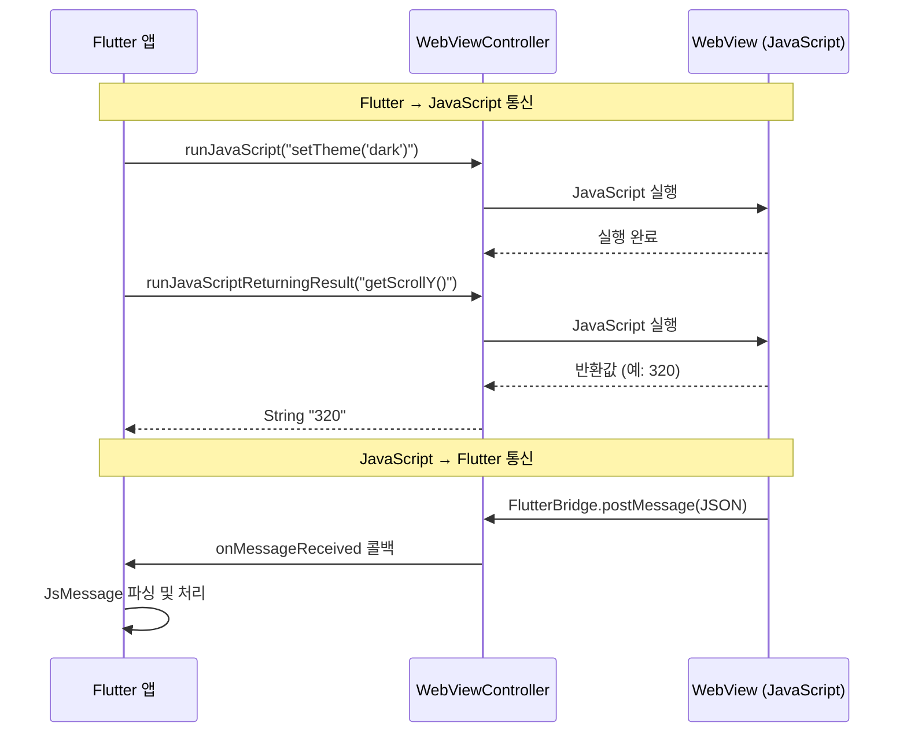
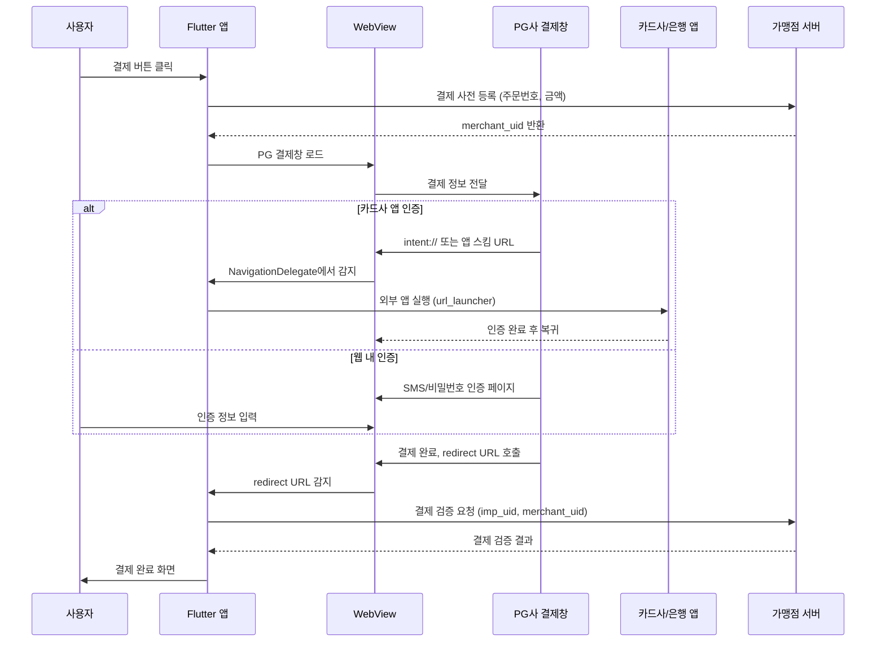
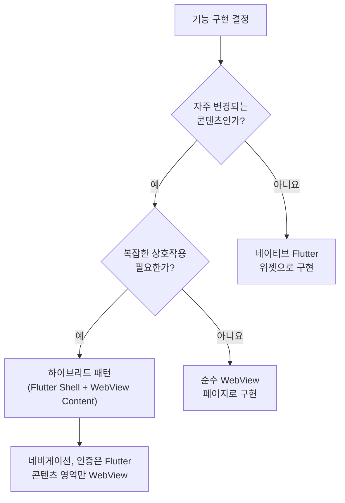

# Flutter WebView 통합 가이드

> **마지막 업데이트**: 2026-02-08 | **Flutter 3.38** | **Dart 3.10**
> **난이도**: 중급~고급 | **카테고리**: features
> **선행 학습**: [Architecture](../core/Architecture.md), [Bloc](../core/Bloc.md), [Navigation](./Navigation.md)
> **예상 학습 시간**: 2h

## 학습 목표

이 문서를 학습하면 다음을 할 수 있습니다:

1. WebView의 적절한 사용 사례를 판단하고 webview_flutter / flutter_inappwebview 패키지를 선택할 수 있다
2. WebViewController를 활용하여 URL, HTML 문자열, 로컬 에셋을 로드하고 네비게이션을 제어할 수 있다
3. JavaScript Bridge를 통해 Flutter와 웹 콘텐츠 간 양방향 메시지 통신을 구현할 수 있다
4. 한국 PG 결제(아임포트/포트원)를 WebView로 연동하고 intent:// 스킴 등 앱 스킴 처리를 구현할 수 있다
5. OAuth 웹 로그인에서 WebView 대신 Custom Tabs / ASWebAuthenticationSession을 우선 적용할 수 있다
6. 하이브리드 앱 패턴에서 쿠키/세션 동기화, 다크 모드 연동, 캐시 전략을 설계할 수 있다
7. WebView 보안(SSL Pinning, URL 화이트리스트, JS Injection 방지)과 성능 최적화를 적용할 수 있다

## 1. 개요

### 1.1 WebView 사용 사례

모바일 앱에서 WebView는 네이티브 구현이 비효율적이거나 웹 콘텐츠를 직접 렌더링해야 하는 상황에서 사용합니다.

**주요 사용 사례:**
- **PG 결제**: 한국 PG사(아임포트/포트원, 토스페이먼츠 등)의 결제창은 웹 기반이므로 WebView 필수
- **OAuth 콜백**: 소셜 로그인 인증 페이지 표시 (단, Custom Tabs 우선 권장)
- **약관/개인정보처리방침**: 서버에서 관리하는 HTML 문서 표시
- **하이브리드 콘텐츠**: CMS에서 관리하는 이벤트 페이지, 공지사항 등
- **외부 웹 콘텐츠**: 뉴스 기사, 블로그 포스트 등 인앱 브라우저

### 1.2 패키지 비교

| 기준 | webview_flutter | flutter_inappwebview |
|------|----------------|---------------------|
| **유지 관리** | Flutter 공식 팀 | 커뮤니티 (Lorenzo Pichilli) |
| **최신 버전** | ^4.12.0 | ^6.1.5 |
| **파일 업로드** | 미지원 | 지원 |
| **다운로드 관리** | 미지원 | 지원 |
| **쿠키 관리** | 기본 | 고급 (세밀한 제어) |
| **스크린샷** | 미지원 | 지원 |
| **커스텀 스킴** | 제한적 | 완전 지원 |
| **인쇄** | 미지원 | 지원 |
| **번들 크기** | 작음 | 큼 |
| **PG 결제 호환** | 추가 작업 필요 | intent:// 스킴 기본 지원 |

> **선택 기준**: 단순 웹 페이지 표시는 `webview_flutter`, PG 결제나 고급 기능이 필요하면 `flutter_inappwebview`를 선택합니다.

### 1.3 WebView vs 네이티브 구현

```dart
// ✅ WebView가 적합한 경우:
// 1. 서버에서 콘텐츠를 자주 변경하는 페이지 (약관, 이벤트)
// 2. PG 결제처럼 웹 기반 SDK만 제공되는 경우
// 3. 기존 웹 자산을 빠르게 재활용해야 하는 경우

// ❌ 네이티브 구현이 적합한 경우:
// 1. 복잡한 사용자 상호작용이 필요한 화면
// 2. 오프라인 지원이 핵심인 기능
// 3. 네이티브 성능이 필수인 애니메이션/그래픽
// 4. 플랫폼 네이티브 UX와 일관성이 중요한 경우
```

> **참고**: Platform View 렌더링 메커니즘(Hybrid Composition, Virtual Display)에 대한 상세 내용은 [PlatformIntegration](../infrastructure/PlatformIntegration.md#5-네이티브-뷰-임베딩)을 참조하세요.

---

## 2. 패키지 설정

### 2.1 의존성 추가

```yaml
# pubspec.yaml (2026년 2월 기준)
dependencies:
  # 공식 WebView 패키지
  webview_flutter: ^4.12.0

  # 또는 고급 기능이 필요한 경우
  flutter_inappwebview: ^6.1.5

  # 상태 관리
  flutter_bloc: ^9.1.1

  # 코드 생성
  freezed_annotation: ^3.1.0
  json_annotation: ^4.10.0

  # 함수형 프로그래밍
  fpdart: ^1.2.0

  # URL 런처 (외부 앱 스킴 처리)
  url_launcher: ^6.3.1

dev_dependencies:
  flutter_test:
    sdk: flutter
  build_runner: ^2.11.0
  freezed: ^3.2.5
  json_serializable: ^6.12.0
  mocktail: ^1.0.4
  bloc_test: ^10.0.0
```

### 2.2 Android 설정

```kotlin
// android/app/build.gradle.kts
android {
    defaultConfig {
        // WebView 최소 SDK 버전
        minSdk = 21
    }
}
```

```xml
<!-- android/app/src/main/AndroidManifest.xml -->
<manifest>
    <!-- 인터넷 권한 -->
    <uses-permission android:name="android.permission.INTERNET" />

    <application
        android:usesCleartextTraffic="false">
        <!-- ... -->
    </application>
</manifest>
```

HTTP 트래픽이 필요한 개발 환경에서는 네트워크 보안 설정을 추가합니다.

```xml
<!-- android/app/src/main/res/xml/network_security_config.xml -->
<?xml version="1.0" encoding="utf-8"?>
<network-security-config>
    <!-- 프로덕션: HTTPS만 허용 -->
    <base-config cleartextTrafficPermitted="false">
        <trust-anchors>
            <certificates src="system" />
        </trust-anchors>
    </base-config>

    <!-- 개발 환경: 로컬 서버 HTTP 허용 -->
    <domain-config cleartextTrafficPermitted="true">
        <domain includeSubdomains="true">10.0.2.2</domain>
        <domain includeSubdomains="true">localhost</domain>
    </domain-config>
</network-security-config>
```

```xml
<!-- AndroidManifest.xml에서 참조 -->
<application
    android:networkSecurityConfig="@xml/network_security_config">
</application>
```

### 2.3 iOS 설정

```xml
<!-- ios/Runner/Info.plist -->
<dict>
    <!-- 앱 내 웹뷰에서 HTTP 허용 (개발용, 프로덕션에서는 제거) -->
    <key>NSAppTransportSecurity</key>
    <dict>
        <key>NSAllowsArbitraryLoads</key>
        <false/>
        <!-- 특정 도메인만 HTTP 허용 -->
        <key>NSExceptionDomains</key>
        <dict>
            <key>localhost</key>
            <dict>
                <key>NSExceptionAllowsInsecureHTTPLoads</key>
                <true/>
            </dict>
        </dict>
    </dict>

    <!-- PG 결제 앱 스킴 (6절 참조) -->
    <key>LSApplicationQueriesSchemes</key>
    <array>
        <string>ispmobile</string>
        <string>shinhan-sr-ansimclick</string>
        <string>kb-acp</string>
        <string>mpocket.online.ansimclick</string>
        <string>hdcardappcardansimclick</string>
        <string>smhyundaiansimclick</string>
        <string>nhappcardansimclick</string>
        <string>citimobileapp</string>
        <string>kakaotalk</string>
        <string>supertoss</string>
    </array>
</dict>
```

---

## 3. 기본 WebView 구현

### 3.1 WebView 상태 정의

```dart
// lib/features/webview/domain/entities/webview_state.dart
import 'package:freezed_annotation/freezed_annotation.dart';

part 'webview_state.freezed.dart';

@freezed
class WebViewPageState with _$WebViewPageState {
  /// 초기 상태
  const factory WebViewPageState.initial() = _Initial;

  /// 페이지 로딩 중 (progress: 0.0 ~ 1.0)
  const factory WebViewPageState.loading({
    required double progress,
  }) = _Loading;

  /// 페이지 로드 완료
  const factory WebViewPageState.loaded({
    required String currentUrl,
    required String title,
    required bool canGoBack,
    required bool canGoForward,
  }) = _Loaded;

  /// 에러 발생
  const factory WebViewPageState.error({
    required String message,
    required String failedUrl,
  }) = _Error;
}
```

### 3.2 WebView 이벤트 정의

```dart
// lib/features/webview/presentation/bloc/webview_event.dart
import 'package:freezed_annotation/freezed_annotation.dart';

part 'webview_event.freezed.dart';

@freezed
class WebViewEvent with _$WebViewEvent {
  /// URL 로드 요청
  const factory WebViewEvent.loadUrl(String url) = _LoadUrl;

  /// HTML 문자열 로드 요청
  const factory WebViewEvent.loadHtml(String html) = _LoadHtml;

  /// 페이지 로딩 진행률 업데이트
  const factory WebViewEvent.progressChanged(double progress) = _ProgressChanged;

  /// 페이지 로드 완료
  const factory WebViewEvent.pageFinished({
    required String url,
    required String title,
  }) = _PageFinished;

  /// 네비게이션 상태 업데이트
  const factory WebViewEvent.navigationStateChanged({
    required bool canGoBack,
    required bool canGoForward,
  }) = _NavigationStateChanged;

  /// 뒤로 가기
  const factory WebViewEvent.goBack() = _GoBack;

  /// 앞으로 가기
  const factory WebViewEvent.goForward() = _GoForward;

  /// 새로고침
  const factory WebViewEvent.reload() = _Reload;

  /// 에러 발생
  const factory WebViewEvent.onError({
    required String message,
    required String failedUrl,
  }) = _OnError;
}
```

### 3.3 WebView Bloc 구현

```dart
// lib/features/webview/presentation/bloc/webview_bloc.dart
import 'package:flutter_bloc/flutter_bloc.dart';
import 'webview_event.dart';
import '../../domain/entities/webview_state.dart';

class WebViewBloc extends Bloc<WebViewEvent, WebViewPageState> {
  WebViewBloc() : super(const WebViewPageState.initial()) {
    on<WebViewEvent>((event, emit) async {
      await event.map(
        loadUrl: (e) async {
          emit(const WebViewPageState.loading(progress: 0.0));
        },
        loadHtml: (e) async {
          emit(const WebViewPageState.loading(progress: 0.0));
        },
        progressChanged: (e) async {
          emit(WebViewPageState.loading(progress: e.progress));
        },
        pageFinished: (e) async {
          emit(WebViewPageState.loaded(
            currentUrl: e.url,
            title: e.title,
            canGoBack: false,
            canGoForward: false,
          ));
        },
        navigationStateChanged: (e) async {
          // 현재 loaded 상태일 때만 네비게이션 상태 업데이트
          final currentState = state;
          if (currentState is _Loaded) {
            emit(currentState.copyWith(
              canGoBack: e.canGoBack,
              canGoForward: e.canGoForward,
            ));
          }
        },
        goBack: (_) async {
          // WebViewController.goBack()은 위젯에서 직접 호출
        },
        goForward: (_) async {
          // WebViewController.goForward()은 위젯에서 직접 호출
        },
        reload: (_) async {
          emit(const WebViewPageState.loading(progress: 0.0));
        },
        onError: (e) async {
          emit(WebViewPageState.error(
            message: e.message,
            failedUrl: e.failedUrl,
          ));
        },
      );
    });
  }
}
```

### 3.4 WebView 위젯 구현

```dart
// lib/features/webview/presentation/pages/webview_page.dart
import 'package:flutter/material.dart';
import 'package:flutter_bloc/flutter_bloc.dart';
import 'package:webview_flutter/webview_flutter.dart';
import '../bloc/webview_bloc.dart';
import '../../domain/entities/webview_state.dart';

class WebViewPage extends StatefulWidget {
  final String initialUrl;
  final String? title;

  const WebViewPage({
    super.key,
    required this.initialUrl,
    this.title,
  });

  @override
  State<WebViewPage> createState() => _WebViewPageState();
}

class _WebViewPageState extends State<WebViewPage> {
  late final WebViewController _controller;

  @override
  void initState() {
    super.initState();
    _initWebView();
  }

  void _initWebView() {
    _controller = WebViewController()
      ..setJavaScriptMode(JavaScriptMode.unrestricted)
      ..setNavigationDelegate(
        NavigationDelegate(
          // URL 필터링: 허용된 도메인만 로드
          onNavigationRequest: (request) {
            final uri = Uri.parse(request.url);
            if (_isAllowedDomain(uri.host)) {
              return NavigationDecision.navigate;
            }
            return NavigationDecision.prevent;
          },
          // 로딩 진행률
          onProgress: (progress) {
            context.read<WebViewBloc>().add(
              WebViewEvent.progressChanged(progress / 100.0),
            );
          },
          // 페이지 로드 완료
          onPageFinished: (url) async {
            final title = await _controller.getTitle() ?? '';
            if (mounted) {
              context.read<WebViewBloc>().add(
                WebViewEvent.pageFinished(url: url, title: title),
              );
            }
          },
          // 에러 처리
          onWebResourceError: (error) {
            context.read<WebViewBloc>().add(
              WebViewEvent.onError(
                message: error.description,
                failedUrl: error.url ?? '',
              ),
            );
          },
        ),
      )
      ..loadRequest(Uri.parse(widget.initialUrl));

    // 로드 시작 이벤트 발행
    context.read<WebViewBloc>().add(
      WebViewEvent.loadUrl(widget.initialUrl),
    );
  }

  bool _isAllowedDomain(String host) {
    const allowedDomains = [
      'example.com',
      'payment.example.com',
      'auth.example.com',
    ];
    return allowedDomains.any(
      (domain) => host == domain || host.endsWith('.$domain'),
    );
  }

  @override
  Widget build(BuildContext context) {
    return Scaffold(
      appBar: AppBar(
        title: Text(widget.title ?? ''),
        actions: [
          // 새로고침 버튼
          IconButton(
            icon: const Icon(Icons.refresh),
            onPressed: () {
              _controller.reload();
              context.read<WebViewBloc>().add(const WebViewEvent.reload());
            },
          ),
        ],
      ),
      body: Stack(
        children: [
          // WebView 본체
          WebViewWidget(controller: _controller),

          // 로딩 인디케이터
          BlocBuilder<WebViewBloc, WebViewPageState>(
            builder: (context, state) {
              return state.maybeWhen(
                loading: (progress) => Column(
                  children: [
                    LinearProgressIndicator(value: progress),
                  ],
                ),
                error: (message, failedUrl) => Center(
                  child: _ErrorView(
                    message: message,
                    onRetry: () {
                      _controller.loadRequest(Uri.parse(failedUrl));
                      context.read<WebViewBloc>().add(
                        WebViewEvent.loadUrl(failedUrl),
                      );
                    },
                  ),
                ),
                orElse: () => const SizedBox.shrink(),
              );
            },
          ),
        ],
      ),
    );
  }
}

/// 에러 표시 위젯
class _ErrorView extends StatelessWidget {
  final String message;
  final VoidCallback onRetry;

  const _ErrorView({required this.message, required this.onRetry});

  @override
  Widget build(BuildContext context) {
    return Column(
      mainAxisAlignment: MainAxisAlignment.center,
      children: [
        const Icon(Icons.error_outline, size: 48, color: Colors.red),
        const SizedBox(height: 16),
        Text(
          '페이지를 불러올 수 없습니다',
          style: Theme.of(context).textTheme.titleMedium,
        ),
        const SizedBox(height: 8),
        Text(message, textAlign: TextAlign.center),
        const SizedBox(height: 16),
        FilledButton.icon(
          onPressed: onRetry,
          icon: const Icon(Icons.refresh),
          label: const Text('다시 시도'),
        ),
      ],
    );
  }
}
```

### 3.5 HTML 문자열 및 로컬 에셋 로드

```dart
// HTML 문자열 로드
await controller.loadHtmlString('''
  <html>
    <head>
      <meta name="viewport" content="width=device-width, initial-scale=1.0">
      <style>
        body { font-family: -apple-system, sans-serif; padding: 16px; }
      </style>
    </head>
    <body>
      <h1>이용약관</h1>
      <p>서비스 이용약관 내용...</p>
    </body>
  </html>
''');

// 로컬 에셋 로드
// 1. pubspec.yaml에 에셋 등록
//    assets:
//      - assets/html/

// 2. 에셋 파일 로드
import 'package:flutter/services.dart' show rootBundle;

Future<void> loadLocalHtml(WebViewController controller) async {
  final html = await rootBundle.loadString('assets/html/terms.html');
  await controller.loadHtmlString(html);
}
```

---

## 4. JavaScript Bridge

### 4.0 JavaScript Bridge 통신 구조



### 4.1 Flutter에서 JavaScript 호출

```dart
// lib/features/webview/presentation/helpers/js_bridge.dart
import 'package:webview_flutter/webview_flutter.dart';

/// Flutter → JavaScript 통신 헬퍼
class JsBridge {
  final WebViewController _controller;

  const JsBridge(this._controller);

  /// JavaScript 실행 (반환값 없음)
  Future<void> execute(String script) async {
    await _controller.runJavaScript(script);
  }

  /// JavaScript 실행 (반환값 있음)
  Future<String> evaluate(String script) async {
    final result = await _controller.runJavaScriptReturningResult(script);
    return result.toString();
  }

  /// 웹 페이지에 데이터 전달
  Future<void> sendData(String channel, Map<String, dynamic> data) async {
    final jsonStr = _escapeJson(data.toString());
    await execute('window.$channel && window.$channel("$jsonStr")');
  }

  /// 웹 페이지 스크롤 위치 조회
  Future<double> getScrollPosition() async {
    final result = await evaluate('window.scrollY');
    return double.tryParse(result) ?? 0.0;
  }

  /// 웹 페이지 다크 모드 적용
  Future<void> setDarkMode(bool isDark) async {
    await execute('''
      document.documentElement.setAttribute(
        'data-theme', '${isDark ? 'dark' : 'light'}'
      );
    ''');
  }

  /// JSON 문자열 이스케이프 처리
  String _escapeJson(String json) {
    return json
        .replaceAll('\\', '\\\\')
        .replaceAll('"', '\\"')
        .replaceAll("'", "\\'")
        .replaceAll('\n', '\\n');
  }
}
```

### 4.2 JavaScript에서 Flutter 호출

```dart
// lib/features/webview/presentation/helpers/js_channel_handler.dart
import 'dart:convert';
import 'package:flutter/foundation.dart';
import 'package:webview_flutter/webview_flutter.dart';

/// JavaScript → Flutter 통신 채널 핸들러
class JsChannelHandler {
  /// 허용된 채널 목록 (보안을 위해 화이트리스트)
  static const _allowedChannels = {
    'FlutterBridge',
    'PaymentCallback',
    'AuthCallback',
  };

  /// JavaScript 채널 등록
  static void registerChannels({
    required WebViewController controller,
    required void Function(JsMessage) onMessage,
  }) {
    for (final channel in _allowedChannels) {
      controller.addJavaScriptChannel(
        channel,
        onMessageReceived: (message) {
          final parsed = _parseMessage(channel, message.message);
          if (parsed != null) {
            onMessage(parsed);
          }
        },
      );
    }
  }

  /// 메시지 파싱 및 검증
  static JsMessage? _parseMessage(String channel, String rawMessage) {
    try {
      // JSON 형식 메시지 파싱
      final decoded = jsonDecode(rawMessage) as Map<String, dynamic>;
      final type = decoded['type'] as String?;
      final data = decoded['data'];

      if (type == null) {
        debugPrint('JS 메시지에 type 필드가 없습니다: $rawMessage');
        return null;
      }

      // 메시지 크기 제한 (10KB)
      if (rawMessage.length > 10240) {
        debugPrint('JS 메시지 크기 초과: ${rawMessage.length} bytes');
        return null;
      }

      return JsMessage(
        channel: channel,
        type: type,
        data: data,
      );
    } catch (e) {
      debugPrint('JS 메시지 파싱 실패: $e');
      return null;
    }
  }
}

/// 타입화된 JS 메시지
class JsMessage {
  final String channel;
  final String type;
  final dynamic data;

  const JsMessage({
    required this.channel,
    required this.type,
    this.data,
  });

  @override
  String toString() => 'JsMessage(channel: $channel, type: $type, data: $data)';
}
```

### 4.3 양방향 통신 예제

```dart
// 웹 페이지 (JavaScript 측)
// <script>
//   // Flutter로 메시지 전송
//   function sendToFlutter(type, data) {
//     FlutterBridge.postMessage(JSON.stringify({ type, data }));
//   }
//
//   // Flutter에서 호출될 함수 등록
//   window.onFlutterData = function(jsonStr) {
//     const data = JSON.parse(jsonStr);
//     console.log('Flutter에서 받은 데이터:', data);
//   };
//
//   // 사용 예: 사용자 정보 요청
//   sendToFlutter('requestUserInfo', { fields: ['name', 'email'] });
// </script>

// Flutter 측: 메시지 수신 및 응답
void _handleJsMessage(JsMessage message) {
  switch (message.type) {
    case 'requestUserInfo':
      // 사용자 정보를 웹으로 전달
      final userInfo = {'name': '홍길동', 'email': 'hong@example.com'};
      _jsBridge.sendData(
        'onFlutterData',
        userInfo,
      );
    case 'closeWebView':
      // WebView 닫기
      Navigator.of(context).pop(message.data);
    case 'openNativeScreen':
      // 네이티브 화면으로 이동
      final route = message.data['route'] as String;
      context.go(route);
    default:
      debugPrint('알 수 없는 JS 메시지 타입: ${message.type}');
  }
}
```

### 4.4 JavaScript Bridge 보안 체크리스트

```dart
/// JavaScript Bridge 보안 가이드라인
///
/// 1. 채널 화이트리스트: 허용된 채널명만 등록 (임의 채널 방지)
/// 2. 메시지 크기 제한: 대용량 메시지를 통한 DoS 방지 (10KB 제한)
/// 3. 타입 검증: 메시지의 type 필드를 switch로 엄격하게 검증
/// 4. 데이터 새니타이징: JSON 파싱 실패 시 안전하게 무시
/// 5. 민감 정보 제한: 토큰, 비밀번호 등을 JS 채널로 전달하지 않음
/// 6. eval() 금지: runJavaScript에 사용자 입력을 직접 삽입하지 않음
///
/// ❌ 위험한 패턴
// final userInput = "'; alert('xss'); //";
// controller.runJavaScript("setName('$userInput')");  // XSS 취약
///
/// ✅ 안전한 패턴
// final encoded = jsonEncode(userInput);
// controller.runJavaScript("setName($encoded)");  // JSON 인코딩
```

---

## 5. PG 결제 연동

한국 PG 결제는 WebView 기반 결제창을 사용하므로 Flutter 앱에서 가장 빈번한 WebView 사용 사례입니다.

### 5.1 결제 흐름



### 5.2 결제 상태 정의

```dart
// lib/features/payment/domain/entities/payment_state.dart
import 'package:freezed_annotation/freezed_annotation.dart';

part 'payment_state.freezed.dart';

@freezed
class PaymentState with _$PaymentState {
  /// 결제 초기 상태
  const factory PaymentState.initial() = _Initial;

  /// 결제 준비 중 (사전 등록)
  const factory PaymentState.preparing({
    required String orderId,
    required int amount,
  }) = _Preparing;

  /// 결제창 로딩 중
  const factory PaymentState.webViewLoading() = _WebViewLoading;

  /// 결제 진행 중 (사용자가 결제창에서 인증 중)
  const factory PaymentState.inProgress() = _InProgress;

  /// 결제 완료 (서버 검증 대기)
  const factory PaymentState.verifying({
    required String impUid,
    required String merchantUid,
  }) = _Verifying;

  /// 결제 성공
  const factory PaymentState.success({
    required PaymentResult result,
  }) = _Success;

  /// 결제 실패
  const factory PaymentState.failure({
    required PaymentFailure failure,
  }) = _Failure;

  /// 결제 취소
  const factory PaymentState.cancelled() = _Cancelled;
}

/// 결제 결과 모델
@freezed
class PaymentResult with _$PaymentResult {
  const factory PaymentResult({
    required String impUid,
    required String merchantUid,
    required int paidAmount,
    required String payMethod,
    required DateTime paidAt,
  }) = _PaymentResult;
}

/// 결제 실패 타입
@freezed
class PaymentFailure with _$PaymentFailure {
  /// 사전 등록 실패
  const factory PaymentFailure.preparationFailed(String message) =
      _PreparationFailed;

  /// 결제 검증 실패
  const factory PaymentFailure.verificationFailed(String message) =
      _VerificationFailed;

  /// 타임아웃
  const factory PaymentFailure.timeout() = _Timeout;

  /// 네트워크 에러
  const factory PaymentFailure.networkError(String message) = _NetworkError;

  /// 알 수 없는 에러
  const factory PaymentFailure.unknown(String message) = _Unknown;
}
```

### 5.3 결제 Repository

```dart
// lib/features/payment/domain/repositories/payment_repository.dart
import 'package:fpdart/fpdart.dart';
import '../entities/payment_state.dart';

/// 결제 Repository 인터페이스
abstract class PaymentRepository {
  /// 결제 사전 등록
  Future<Either<PaymentFailure, String>> preparePayment({
    required String orderId,
    required int amount,
    required String itemName,
    required String buyerName,
    required String buyerEmail,
  });

  /// 결제 검증
  Future<Either<PaymentFailure, PaymentResult>> verifyPayment({
    required String impUid,
    required String merchantUid,
  });
}
```

### 5.4 PaymentBloc 구현

```dart
// lib/features/payment/presentation/bloc/payment_bloc.dart
import 'package:flutter_bloc/flutter_bloc.dart';
import 'package:freezed_annotation/freezed_annotation.dart';
import '../../domain/entities/payment_state.dart';
import '../../domain/repositories/payment_repository.dart';

part 'payment_event.freezed.dart';

@freezed
class PaymentEvent with _$PaymentEvent {
  const factory PaymentEvent.startPayment({
    required String orderId,
    required int amount,
    required String itemName,
    required String buyerName,
    required String buyerEmail,
  }) = _StartPayment;

  const factory PaymentEvent.webViewLoaded() = _WebViewLoaded;

  const factory PaymentEvent.paymentCompleted({
    required String impUid,
    required String merchantUid,
  }) = _PaymentCompleted;

  const factory PaymentEvent.paymentFailed(String message) = _PaymentFailed;

  const factory PaymentEvent.paymentCancelled() = _PaymentCancelled;
}

class PaymentBloc extends Bloc<PaymentEvent, PaymentState> {
  final PaymentRepository _repository;

  PaymentBloc({required PaymentRepository repository})
      : _repository = repository,
        super(const PaymentState.initial()) {
    on<PaymentEvent>((event, emit) async {
      await event.map(
        startPayment: (e) => _onStartPayment(e, emit),
        webViewLoaded: (_) async => emit(const PaymentState.inProgress()),
        paymentCompleted: (e) => _onPaymentCompleted(e, emit),
        paymentFailed: (e) async =>
            emit(PaymentState.failure(
              failure: PaymentFailure.unknown(e.message),
            )),
        paymentCancelled: (_) async =>
            emit(const PaymentState.cancelled()),
      );
    });
  }

  Future<void> _onStartPayment(
    _StartPayment event,
    Emitter<PaymentState> emit,
  ) async {
    emit(PaymentState.preparing(
      orderId: event.orderId,
      amount: event.amount,
    ));

    final result = await _repository.preparePayment(
      orderId: event.orderId,
      amount: event.amount,
      itemName: event.itemName,
      buyerName: event.buyerName,
      buyerEmail: event.buyerEmail,
    );

    result.fold(
      (failure) => emit(PaymentState.failure(failure: failure)),
      (_) => emit(const PaymentState.webViewLoading()),
    );
  }

  Future<void> _onPaymentCompleted(
    _PaymentCompleted event,
    Emitter<PaymentState> emit,
  ) async {
    emit(PaymentState.verifying(
      impUid: event.impUid,
      merchantUid: event.merchantUid,
    ));

    final result = await _repository.verifyPayment(
      impUid: event.impUid,
      merchantUid: event.merchantUid,
    );

    result.fold(
      (failure) => emit(PaymentState.failure(failure: failure)),
      (paymentResult) => emit(PaymentState.success(result: paymentResult)),
    );
  }
}
```

### 5.5 PG 결제 WebView 구현

```dart
// lib/features/payment/presentation/pages/payment_webview_page.dart
import 'dart:io';
import 'package:flutter/material.dart';
import 'package:flutter_bloc/flutter_bloc.dart';
import 'package:url_launcher/url_launcher.dart';
import 'package:webview_flutter/webview_flutter.dart';
import '../bloc/payment_bloc.dart';
import '../../domain/entities/payment_state.dart';

class PaymentWebViewPage extends StatefulWidget {
  final String paymentUrl;
  final String merchantUid;

  const PaymentWebViewPage({
    super.key,
    required this.paymentUrl,
    required this.merchantUid,
  });

  @override
  State<PaymentWebViewPage> createState() => _PaymentWebViewPageState();
}

class _PaymentWebViewPageState extends State<PaymentWebViewPage> {
  late final WebViewController _controller;

  /// 결제 앱 스킴 목록 (카드사/은행 앱)
  static const _paymentAppSchemes = [
    'ispmobile',          // ISP/페이북
    'shinhan-sr-ansimclick', // 신한카드
    'kb-acp',             // KB국민카드
    'mpocket.online.ansimclick', // 삼성카드
    'hdcardappcardansimclick',   // 현대카드
    'smhyundaiansimclick',       // 현대카드 (구)
    'nhappcardansimclick',       // NH농협카드
    'citimobileapp',             // 시티카드
    'kakaotalk',                 // 카카오페이
    'supertoss',                 // 토스
    'lpayapp',                   // L.pay
    'naversearchapp',            // 네이버페이
    'smshinhanansimclick',       // 신한 앱카드
  ];

  @override
  void initState() {
    super.initState();
    _initPaymentWebView();
  }

  void _initPaymentWebView() {
    _controller = WebViewController()
      ..setJavaScriptMode(JavaScriptMode.unrestricted)
      ..setNavigationDelegate(
        NavigationDelegate(
          onNavigationRequest: (request) =>
              _handleNavigationRequest(request),
          onPageFinished: (_) {
            context.read<PaymentBloc>().add(
              const PaymentEvent.webViewLoaded(),
            );
          },
          onWebResourceError: (error) {
            context.read<PaymentBloc>().add(
              PaymentEvent.paymentFailed(error.description),
            );
          },
        ),
      )
      ..loadRequest(Uri.parse(widget.paymentUrl));
  }

  /// URL 네비게이션 요청 처리
  NavigationDecision _handleNavigationRequest(NavigationRequest request) {
    final url = request.url;
    final uri = Uri.parse(url);

    // 1. 결제 완료 콜백 URL 감지
    if (_isPaymentCallbackUrl(url)) {
      _processPaymentCallback(uri);
      return NavigationDecision.prevent;
    }

    // 2. Android intent:// 스킴 처리
    if (url.startsWith('intent://')) {
      _handleIntentScheme(url);
      return NavigationDecision.prevent;
    }

    // 3. 결제 앱 스킴 처리
    if (_isPaymentAppScheme(uri.scheme)) {
      _launchExternalApp(url);
      return NavigationDecision.prevent;
    }

    // 4. 일반 HTTP/HTTPS URL은 WebView에서 로드
    return NavigationDecision.navigate;
  }

  /// 결제 콜백 URL 여부 확인
  bool _isPaymentCallbackUrl(String url) {
    return url.contains('/payment/callback') ||
           url.contains('/payment/complete');
  }

  /// 결제 콜백 처리
  void _processPaymentCallback(Uri uri) {
    final impUid = uri.queryParameters['imp_uid'];
    final merchantUid = uri.queryParameters['merchant_uid'];
    final success = uri.queryParameters['success'];

    if (success == 'false') {
      final errorMsg = uri.queryParameters['error_msg'] ?? '결제가 취소되었습니다';
      context.read<PaymentBloc>().add(PaymentEvent.paymentFailed(errorMsg));
      return;
    }

    if (impUid != null && merchantUid != null) {
      context.read<PaymentBloc>().add(
        PaymentEvent.paymentCompleted(
          impUid: impUid,
          merchantUid: merchantUid,
        ),
      );
    }
  }

  /// Android intent:// 스킴 처리
  Future<void> _handleIntentScheme(String url) async {
    try {
      // intent:// URL에서 패키지명 추출
      // 형식: intent://path#Intent;scheme=xxx;package=com.xxx;end
      final intentUri = Uri.parse(url.replaceFirst('intent:', 'https:'));
      final scheme = _extractIntentParam(url, 'scheme');
      final packageName = _extractIntentParam(url, 'package');

      if (scheme != null) {
        // 스킴 URL로 앱 실행 시도
        final appUrl = '$scheme://${intentUri.host}${intentUri.path}'
            '${intentUri.hasQuery ? '?${intentUri.query}' : ''}';
        final launched = await launchUrl(
          Uri.parse(appUrl),
          mode: LaunchMode.externalApplication,
        );

        if (!launched && packageName != null && Platform.isAndroid) {
          // 앱이 설치되지 않은 경우 Play Store로 이동
          await launchUrl(
            Uri.parse('market://details?id=$packageName'),
            mode: LaunchMode.externalApplication,
          );
        }
      }
    } catch (e) {
      debugPrint('Intent 스킴 처리 실패: $e');
    }
  }

  /// intent:// URL에서 파라미터 추출
  String? _extractIntentParam(String url, String param) {
    final regex = RegExp('$param=([^;]+)');
    final match = regex.firstMatch(url);
    return match?.group(1);
  }

  /// 결제 앱 스킴 여부 확인
  bool _isPaymentAppScheme(String scheme) {
    return _paymentAppSchemes.contains(scheme);
  }

  /// 외부 앱 실행
  Future<void> _launchExternalApp(String url) async {
    try {
      final launched = await launchUrl(
        Uri.parse(url),
        mode: LaunchMode.externalApplication,
      );
      if (!launched) {
        debugPrint('앱 실행 실패: $url');
      }
    } catch (e) {
      debugPrint('외부 앱 실행 에러: $e');
    }
  }

  @override
  Widget build(BuildContext context) {
    return PopScope(
      // 결제 중 뒤로가기 방지
      canPop: false,
      onPopInvokedWithResult: (didPop, _) {
        if (!didPop) {
          _showExitConfirmDialog();
        }
      },
      child: Scaffold(
        appBar: AppBar(
          title: const Text('결제'),
          leading: IconButton(
            icon: const Icon(Icons.close),
            onPressed: _showExitConfirmDialog,
          ),
        ),
        body: BlocConsumer<PaymentBloc, PaymentState>(
          listener: (context, state) {
            state.whenOrNull(
              success: (result) {
                Navigator.of(context).pop(result);
              },
              failure: (failure) {
                Navigator.of(context).pop(failure);
              },
              cancelled: () {
                Navigator.of(context).pop();
              },
            );
          },
          builder: (context, state) {
            return Stack(
              children: [
                WebViewWidget(controller: _controller),
                if (state is _Verifying)
                  const Center(
                    child: Column(
                      mainAxisAlignment: MainAxisAlignment.center,
                      children: [
                        CircularProgressIndicator(),
                        SizedBox(height: 16),
                        Text('결제를 확인하고 있습니다...'),
                      ],
                    ),
                  ),
              ],
            );
          },
        ),
      ),
    );
  }

  /// 결제 취소 확인 다이얼로그
  Future<void> _showExitConfirmDialog() async {
    final result = await showDialog<bool>(
      context: context,
      builder: (context) => AlertDialog(
        title: const Text('결제 취소'),
        content: const Text('결제를 취소하시겠습니까?'),
        actions: [
          TextButton(
            onPressed: () => Navigator.of(context).pop(false),
            child: const Text('아니요'),
          ),
          TextButton(
            onPressed: () => Navigator.of(context).pop(true),
            child: const Text('예'),
          ),
        ],
      ),
    );

    if (result == true && mounted) {
      context.read<PaymentBloc>().add(const PaymentEvent.paymentCancelled());
    }
  }
}
```

### 5.6 포트원(아임포트) 연동 패턴

```dart
// lib/features/payment/data/datasources/portone_payment_source.dart
/// 포트원(구 아임포트) 결제 HTML 생성
class PortOnePaymentSource {
  final String merchantId; // 가맹점 식별코드

  const PortOnePaymentSource({required this.merchantId});

  /// 결제 요청 HTML 생성
  String buildPaymentHtml({
    required String merchantUid,
    required int amount,
    required String itemName,
    required String buyerName,
    required String buyerEmail,
    required String buyerTel,
    String pgProvider = 'html5_inicis', // 이니시스
    String payMethod = 'card',
    required String callbackUrl,
  }) {
    return '''
<!DOCTYPE html>
<html>
<head>
  <meta charset="UTF-8">
  <meta name="viewport"
        content="width=device-width, initial-scale=1.0, user-scalable=no">
  <script src="https://cdn.iamport.kr/v1/iamport.js"></script>
</head>
<body>
<script>
  var IMP = window.IMP;
  IMP.init("$merchantId");

  IMP.request_pay({
    pg: "$pgProvider",
    pay_method: "$payMethod",
    merchant_uid: "$merchantUid",
    name: "$itemName",
    amount: $amount,
    buyer_email: "$buyerEmail",
    buyer_name: "$buyerName",
    buyer_tel: "$buyerTel",
    m_redirect_url: "$callbackUrl",
    app_scheme: "myapp",
  }, function(response) {
    // 콜백 방식 (SPA)
    if (response.success) {
      FlutterBridge.postMessage(JSON.stringify({
        type: "payment_success",
        data: {
          imp_uid: response.imp_uid,
          merchant_uid: response.merchant_uid
        }
      }));
    } else {
      FlutterBridge.postMessage(JSON.stringify({
        type: "payment_failed",
        data: {
          error_msg: response.error_msg
        }
      }));
    }
  });
</script>
</body>
</html>
''';
  }
}
```

### 5.7 결제 에러 처리 및 타임아웃

```dart
// lib/features/payment/presentation/helpers/payment_timeout_handler.dart
import 'dart:async';
import 'package:flutter_bloc/flutter_bloc.dart';
import '../bloc/payment_bloc.dart';
import '../../domain/entities/payment_state.dart';

/// 결제 타임아웃 관리
class PaymentTimeoutHandler {
  Timer? _timer;

  /// 결제 타임아웃 시작 (기본 5분)
  void startTimeout({
    required PaymentBloc bloc,
    Duration timeout = const Duration(minutes: 5),
  }) {
    _timer?.cancel();
    _timer = Timer(timeout, () {
      // 아직 결제 진행 중이면 타임아웃 처리
      final currentState = bloc.state;
      if (currentState is _InProgress || currentState is _WebViewLoading) {
        bloc.add(const PaymentEvent.paymentFailed('결제 시간이 초과되었습니다'));
      }
    });
  }

  /// 타이머 취소
  void cancel() {
    _timer?.cancel();
    _timer = null;
  }

  /// 리소스 해제
  void dispose() {
    cancel();
  }
}
```

---

## 6. OAuth 웹 로그인

### 6.1 OAuth 인증 방식 비교

| 방식 | 보안 | UX | 구현 복잡도 |
|------|------|-----|------------|
| **Custom Tabs (Android) / ASWebAuthenticationSession (iOS)** | 높음 (쿠키 격리) | 좋음 (시스템 UI) | 낮음 |
| **시스템 브라우저** | 높음 | 보통 (앱 전환) | 낮음 |
| **WebView** | 낮음 (피싱 위험) | 좋음 (인앱) | 중간 |

> **권장**: OAuth 인증에는 Custom Tabs / ASWebAuthenticationSession을 우선 사용합니다. WebView는 사용자 자격 증명을 앱이 가로챌 수 있어 Google, Apple 등 주요 OAuth 제공자가 WebView 기반 인증을 차단합니다.

### 6.2 Custom Tabs / ASWebAuthenticationSession 구현

```dart
// lib/features/auth/data/datasources/oauth_web_auth_source.dart
import 'package:flutter/services.dart';
import 'package:url_launcher/url_launcher.dart';

/// OAuth 웹 인증 데이터 소스
/// Custom Tabs (Android) / ASWebAuthenticationSession (iOS) 사용
class OAuthWebAuthSource {
  /// OAuth 인증 흐름 시작
  Future<Uri?> authenticate({
    required Uri authorizationUrl,
    required String callbackUrlScheme,
  }) async {
    try {
      // url_launcher를 통한 Custom Tabs / SFSafariViewController 실행
      final launched = await launchUrl(
        authorizationUrl,
        mode: LaunchMode.externalApplication,
      );

      if (!launched) {
        throw PlatformException(
          code: 'LAUNCH_FAILED',
          message: 'OAuth 인증 페이지를 열 수 없습니다',
        );
      }

      // redirect URI는 DeepLinking으로 앱에서 수신
      // DeepLinking.md 참조: app_links 패키지로 콜백 수신
      return null; // redirect는 별도 스트림으로 처리
    } catch (e) {
      rethrow;
    }
  }
}
```

### 6.3 WebView 폴백 패턴

Custom Tabs를 사용할 수 없는 환경에서의 WebView 폴백입니다.

```dart
// lib/features/auth/presentation/pages/oauth_webview_page.dart
import 'package:flutter/material.dart';
import 'package:webview_flutter/webview_flutter.dart';

/// OAuth WebView 폴백 페이지
/// Custom Tabs 실패 시에만 사용
class OAuthWebViewPage extends StatefulWidget {
  final String authUrl;
  final String redirectUri;

  const OAuthWebViewPage({
    super.key,
    required this.authUrl,
    required this.redirectUri,
  });

  @override
  State<OAuthWebViewPage> createState() => _OAuthWebViewPageState();
}

class _OAuthWebViewPageState extends State<OAuthWebViewPage> {
  late final WebViewController _controller;

  @override
  void initState() {
    super.initState();
    _controller = WebViewController()
      ..setJavaScriptMode(JavaScriptMode.unrestricted)
      ..setNavigationDelegate(
        NavigationDelegate(
          onNavigationRequest: (request) {
            // redirect URI 감지 → 토큰 추출
            if (request.url.startsWith(widget.redirectUri)) {
              _extractToken(Uri.parse(request.url));
              return NavigationDecision.prevent;
            }
            return NavigationDecision.navigate;
          },
        ),
      )
      ..loadRequest(Uri.parse(widget.authUrl));
  }

  /// redirect URL에서 authorization code 또는 토큰 추출
  void _extractToken(Uri redirectUri) {
    final code = redirectUri.queryParameters['code'];
    final error = redirectUri.queryParameters['error'];

    if (error != null) {
      Navigator.of(context).pop(OAuthResult.failure(error));
      return;
    }

    if (code != null) {
      Navigator.of(context).pop(OAuthResult.success(code));
      return;
    }

    Navigator.of(context).pop(
      OAuthResult.failure('인증 코드를 받지 못했습니다'),
    );
  }

  @override
  Widget build(BuildContext context) {
    return Scaffold(
      appBar: AppBar(title: const Text('로그인')),
      body: WebViewWidget(controller: _controller),
    );
  }
}

/// OAuth 결과
sealed class OAuthResult {
  const OAuthResult();
  const factory OAuthResult.success(String code) = OAuthSuccess;
  const factory OAuthResult.failure(String error) = OAuthFailure;
}

class OAuthSuccess extends OAuthResult {
  final String code;
  const OAuthSuccess(this.code);
}

class OAuthFailure extends OAuthResult {
  final String error;
  const OAuthFailure(this.error);
}
```

> **참고**: OAuth 인증의 전체 PKCE 흐름, 토큰 교환, 소셜 로그인 통합 패턴은 [Authentication](./Authentication.md)을 참조하세요.

---

## 7. 하이브리드 앱 패턴

### 7.1 하이브리드 앱이 적합한 경우



### 7.2 쿠키 / 세션 동기화

```dart
// lib/features/webview/data/helpers/cookie_sync_manager.dart
import 'package:webview_flutter/webview_flutter.dart';

/// Flutter 앱과 WebView 간 쿠키/세션 동기화
class CookieSyncManager {
  final WebViewCookieManager _cookieManager = WebViewCookieManager();

  /// Flutter 앱의 인증 토큰을 WebView 쿠키로 설정
  Future<void> syncAuthToken({
    required String domain,
    required String accessToken,
  }) async {
    // 기존 쿠키 정리
    await _cookieManager.clearCookies();

    // 인증 쿠키 설정
    await _cookieManager.setCookie(
      WebViewCookie(
        name: 'access_token',
        value: accessToken,
        domain: domain,
        path: '/',
      ),
    );
  }

  /// 세션 쿠키 설정 (서버에서 발급한 세션 ID)
  Future<void> setSessionCookie({
    required String domain,
    required String sessionId,
  }) async {
    await _cookieManager.setCookie(
      WebViewCookie(
        name: 'SESSIONID',
        value: sessionId,
        domain: domain,
        path: '/',
      ),
    );
  }

  /// 모든 쿠키 삭제 (로그아웃 시)
  Future<void> clearAll() async {
    await _cookieManager.clearCookies();
  }
}
```

### 7.3 Flutter ↔ WebView 네비게이션 브릿지

```dart
// lib/features/webview/presentation/helpers/navigation_bridge.dart
import 'dart:convert';
import 'package:flutter/material.dart';
import 'package:go_router/go_router.dart';
import 'package:webview_flutter/webview_flutter.dart';

/// WebView 내 링크 클릭을 Flutter 네비게이션으로 연결
class NavigationBridge {
  final BuildContext context;
  final WebViewController controller;

  NavigationBridge({required this.context, required this.controller});

  /// WebView → Flutter 화면 전환 채널 등록
  void register() {
    controller.addJavaScriptChannel(
      'FlutterNavigation',
      onMessageReceived: (message) {
        try {
          final data = jsonDecode(message.message) as Map<String, dynamic>;
          final route = data['route'] as String?;
          final params = data['params'] as Map<String, dynamic>?;

          if (route != null) {
            _navigateToFlutterRoute(route, params);
          }
        } catch (e) {
          debugPrint('네비게이션 브릿지 메시지 파싱 실패: $e');
        }
      },
    );
  }

  /// Flutter 라우트로 이동
  void _navigateToFlutterRoute(
    String route,
    Map<String, dynamic>? params,
  ) {
    switch (route) {
      case '/product':
        final productId = params?['id'] as String?;
        if (productId != null) {
          context.push('/product/$productId');
        }
      case '/cart':
        context.push('/cart');
      case '/back':
        context.pop();
      default:
        debugPrint('알 수 없는 Flutter 라우트: $route');
    }
  }
}

// 웹 측 사용 예시 (JavaScript):
// <a href="#" onclick="FlutterNavigation.postMessage(JSON.stringify({
//   route: '/product',
//   params: { id: '123' }
// }))">상품 보기</a>
```

### 7.4 다크 모드 / 테마 동기화

```dart
// lib/features/webview/presentation/helpers/theme_sync.dart
import 'package:flutter/material.dart';
import 'package:webview_flutter/webview_flutter.dart';

/// Flutter 테마를 WebView 콘텐츠에 동기화
class ThemeSync {
  final WebViewController controller;

  const ThemeSync({required this.controller});

  /// 현재 테마 상태를 WebView에 적용
  Future<void> syncTheme(ThemeData theme) async {
    final isDark = theme.brightness == Brightness.dark;
    final primaryColor = _colorToHex(theme.colorScheme.primary);
    final backgroundColor = _colorToHex(theme.colorScheme.surface);
    final textColor = _colorToHex(theme.colorScheme.onSurface);

    await controller.runJavaScript('''
      (function() {
        document.documentElement.setAttribute('data-theme',
          '${isDark ? 'dark' : 'light'}');
        document.documentElement.style.setProperty('--primary-color',
          '$primaryColor');
        document.documentElement.style.setProperty('--bg-color',
          '$backgroundColor');
        document.documentElement.style.setProperty('--text-color',
          '$textColor');
      })();
    ''');
  }

  String _colorToHex(Color color) {
    return '#${color.toARGB32().toRadixString(16).substring(2)}';
  }
}
```

### 7.5 캐시 및 오프라인 지원

```dart
// lib/features/webview/data/helpers/webview_cache_manager.dart

/// WebView 캐시 전략
///
/// 1. HTML 콘텐츠 프리캐시: 자주 접근하는 페이지를 로컬에 저장
/// 2. 오프라인 폴백: 네트워크 없을 때 캐시된 콘텐츠 표시
/// 3. 캐시 만료: TTL 기반으로 캐시 갱신
class WebViewCacheManager {
  /// 캐시 디렉토리 경로
  final String _cacheDir;

  WebViewCacheManager({required String cacheDir}) : _cacheDir = cacheDir;

  /// 오프라인 폴백 HTML 생성
  String buildOfflineFallbackHtml() {
    return '''
<!DOCTYPE html>
<html>
<head>
  <meta charset="UTF-8">
  <meta name="viewport"
        content="width=device-width, initial-scale=1.0">
  <style>
    body {
      display: flex; justify-content: center; align-items: center;
      min-height: 100vh; margin: 0;
      font-family: -apple-system, sans-serif;
      background: #f5f5f5; color: #333;
    }
    .container { text-align: center; padding: 20px; }
    .icon { font-size: 48px; margin-bottom: 16px; }
    h2 { margin-bottom: 8px; }
    p { color: #666; }
  </style>
</head>
<body>
  <div class="container">
    <div class="icon">&#128268;</div>
    <h2>오프라인 상태</h2>
    <p>인터넷 연결을 확인한 후 다시 시도해 주세요.</p>
  </div>
</body>
</html>
''';
  }

  /// 캐시 전체 삭제
  Future<void> clearCache() async {
    // WebViewController.clearCache()와 함께 로컬 캐시도 정리
    // 구현은 path_provider + 파일 시스템 삭제
  }
}
```

---

## 8. 보안

### 8.1 SSL Pinning

```dart
// lib/features/webview/data/helpers/ssl_pinning_handler.dart
import 'package:flutter_inappwebview/flutter_inappwebview.dart';

/// WebView SSL Pinning 설정 (flutter_inappwebview 전용)
///
/// webview_flutter는 SSL Pinning을 직접 지원하지 않습니다.
/// SSL Pinning이 필수인 경우 flutter_inappwebview를 사용합니다.
class SslPinningHandler {
  /// 허용된 인증서 핑거프린트 목록 (SHA-256)
  static const _allowedFingerprints = [
    'AA:BB:CC:DD:EE:FF:00:11:22:33:44:55:66:77:88:99'
        ':AA:BB:CC:DD:EE:FF:00:11:22:33:44:55:66:77:88:99',
  ];

  /// SSL 인증서 검증 콜백
  static Future<ServerTrustAuthResponse> onReceivedServerTrustAuthRequest(
    InAppWebViewController controller,
    URLAuthenticationChallenge challenge,
  ) async {
    final serverCert = challenge.protectionSpace.sslCertificate;

    if (serverCert != null) {
      // 인증서 핑거프린트 검증
      final fingerprint = serverCert.x509Certificate
          ?.sha256Fingerprint?.toString().toUpperCase();

      if (fingerprint != null &&
          _allowedFingerprints.contains(fingerprint)) {
        return ServerTrustAuthResponse(
          action: ServerTrustAuthResponseAction.PROCEED,
        );
      }
    }

    // 핑거프린트 불일치 → 연결 거부
    return ServerTrustAuthResponse(
      action: ServerTrustAuthResponseAction.CANCEL,
    );
  }
}
```

### 8.2 URL 화이트리스트 / 블랙리스트

```dart
// lib/features/webview/domain/validators/url_validator.dart

/// URL 접근 제어
class UrlValidator {
  /// 허용된 도메인 목록
  final Set<String> _allowedDomains;

  /// 차단된 URL 패턴
  final List<RegExp> _blockedPatterns;

  UrlValidator({
    required Set<String> allowedDomains,
    List<RegExp>? blockedPatterns,
  })  : _allowedDomains = allowedDomains,
        _blockedPatterns = blockedPatterns ?? _defaultBlockedPatterns;

  /// 기본 차단 패턴
  static final _defaultBlockedPatterns = [
    RegExp(r'javascript:', caseSensitive: false),
    RegExp(r'data:text/html', caseSensitive: false),
    RegExp(r'blob:', caseSensitive: false),
    RegExp(r'file://', caseSensitive: false),
  ];

  /// URL 접근 허용 여부 판단
  bool isAllowed(String url) {
    // 차단 패턴 검사
    for (final pattern in _blockedPatterns) {
      if (pattern.hasMatch(url)) {
        return false;
      }
    }

    // HTTP/HTTPS URL에 대해 도메인 화이트리스트 검사
    final uri = Uri.tryParse(url);
    if (uri == null) return false;

    if (uri.scheme == 'http' || uri.scheme == 'https') {
      return _isDomainAllowed(uri.host);
    }

    // 기타 스킴(intent://, 결제 앱 등)은 별도 처리
    return false;
  }

  /// 도메인 허용 여부 (서브도메인 포함)
  bool _isDomainAllowed(String host) {
    return _allowedDomains.any(
      (domain) => host == domain || host.endsWith('.$domain'),
    );
  }
}
```

### 8.3 JavaScript Injection 방지

```dart
/// JavaScript Injection 방지 가이드라인
///
/// 1. 사용자 입력을 JavaScript에 직접 삽입하지 않음
/// 2. 동적 스크립트에는 반드시 JSON 인코딩 사용
/// 3. eval() 사용 금지
/// 4. innerHTML 대신 textContent 사용

// ❌ 위험한 패턴
void unsafeExample(WebViewController controller, String userInput) {
  // SQL Injection과 유사한 JS Injection 취약점
  controller.runJavaScript("document.title = '$userInput'");
}

// ✅ 안전한 패턴
void safeExample(WebViewController controller, String userInput) {
  // JSON 인코딩으로 문자열 이스케이프 보장
  final encoded = Uri.encodeComponent(userInput);
  controller.runJavaScript('''
    document.title = decodeURIComponent("$encoded");
  ''');
}
```

### 8.4 결제 보안 (PCI Compliance)

```dart
/// PG 결제 WebView 보안 체크리스트
///
/// 1. HTTPS 전용: 결제 페이지는 반드시 HTTPS로 로드
/// 2. 카드 정보 미저장: 카드번호, CVV 등을 앱 메모리/스토리지에 저장하지 않음
/// 3. PG사 SDK 사용: 직접 카드 정보를 수집하지 않고 PG사 결제창 사용
/// 4. 서버 사이드 검증: 클라이언트의 결제 결과를 신뢰하지 않고 서버에서 검증
/// 5. 네트워크 스니핑 방지: SSL Pinning 적용
/// 6. 스크린 캡처 방지: FLAG_SECURE 설정 (Android)
/// 7. 로그 마스킹: 카드번호 등 민감 정보를 로그에 남기지 않음
```

### 8.5 쿠키 보안

```dart
// 쿠키 보안 설정
// WebView 쿠키에 민감 정보를 저장할 때 주의사항

/// 안전한 쿠키 설정 가이드
///
/// 1. Secure 플래그: HTTPS에서만 전송 (서버 측 Set-Cookie에서 설정)
/// 2. HttpOnly 플래그: JavaScript에서 접근 불가 (XSS 방지)
/// 3. SameSite 속성: CSRF 방지
/// 4. 만료 시간: 세션 쿠키는 앱 종료 시 삭제
/// 5. 로그아웃 시 쿠키 완전 삭제: clearCookies() 호출
///
/// WebView 쿠키 격리:
/// - 각 WebView 인스턴스는 앱의 쿠키 저장소를 공유합니다
/// - 로그아웃 시 WebViewCookieManager.clearCookies()를 반드시 호출하세요
/// - 민감한 인증 정보는 쿠키보다 flutter_secure_storage 사용을 권장합니다
```

---

## 9. 성능 최적화

### 9.1 WebView 프리로딩

```dart
// lib/features/webview/presentation/helpers/webview_preloader.dart
import 'package:webview_flutter/webview_flutter.dart';

/// WebView 프리로딩 관리자
/// 자주 접근하는 페이지를 미리 로드하여 사용자 체감 속도를 개선
class WebViewPreloader {
  WebViewController? _preloadedController;
  bool _isPreloaded = false;

  /// WebView 프리로드 (스플래시 화면 등에서 미리 호출)
  Future<void> preload(String url) async {
    _preloadedController = WebViewController()
      ..setJavaScriptMode(JavaScriptMode.unrestricted)
      ..loadRequest(Uri.parse(url));
    _isPreloaded = true;
  }

  /// 프리로드된 컨트롤러 반환 (1회용)
  WebViewController? getPreloadedController() {
    if (_isPreloaded) {
      _isPreloaded = false;
      final controller = _preloadedController;
      _preloadedController = null;
      return controller;
    }
    return null;
  }

  /// 리소스 해제
  void dispose() {
    _preloadedController = null;
    _isPreloaded = false;
  }
}
```

### 9.2 메모리 관리

```dart
/// WebView 메모리 관리 가이드
///
/// WebView는 네이티브 리소스를 많이 사용합니다.
/// 적절한 메모리 관리가 없으면 메모리 누수와 앱 크래시가 발생합니다.

// ✅ 올바른 해제 패턴
class WebViewScreen extends StatefulWidget {
  const WebViewScreen({super.key});

  @override
  State<WebViewScreen> createState() => _WebViewScreenState();
}

class _WebViewScreenState extends State<WebViewScreen> {
  late final WebViewController _controller;

  @override
  void initState() {
    super.initState();
    _controller = WebViewController()
      ..setJavaScriptMode(JavaScriptMode.unrestricted);
  }

  @override
  void dispose() {
    // WebView 리소스 정리
    // 1. 빈 페이지 로드로 현재 페이지 리소스 해제
    _controller.loadRequest(Uri.parse('about:blank'));
    // 2. JavaScript 채널 정리는 자동으로 처리됨
    super.dispose();
  }

  @override
  Widget build(BuildContext context) {
    return WebViewWidget(controller: _controller);
  }
}
```

### 9.3 다중 WebView 인스턴스 회피

```dart
/// 다중 WebView 사용 시 주의사항
///
/// 1. 한 화면에 여러 WebView를 배치하지 않음 (심각한 성능 저하)
/// 2. 탭 전환 시 WebView를 재생성하지 않고 visibility로 제어
/// 3. 스크롤 리스트 내 WebView 사용 금지 (ListView 아이템으로 WebView 사용 X)
///
/// 추천 패턴:
/// - 단일 WebView + URL 전환
/// - 필요 시 IndexedStack으로 WebView 상태 보존

// IndexedStack으로 WebView 상태 보존
class MultiContentPage extends StatefulWidget {
  const MultiContentPage({super.key});

  @override
  State<MultiContentPage> createState() => _MultiContentPageState();
}

class _MultiContentPageState extends State<MultiContentPage> {
  int _currentIndex = 0;
  final List<WebViewController> _controllers = [];

  @override
  void initState() {
    super.initState();
    // 최대 2~3개로 제한
    for (final url in ['https://page1.example.com', 'https://page2.example.com']) {
      final controller = WebViewController()
        ..setJavaScriptMode(JavaScriptMode.unrestricted)
        ..loadRequest(Uri.parse(url));
      _controllers.add(controller);
    }
  }

  @override
  Widget build(BuildContext context) {
    return Scaffold(
      body: IndexedStack(
        index: _currentIndex,
        children: _controllers
            .map((c) => WebViewWidget(controller: c))
            .toList(),
      ),
      bottomNavigationBar: NavigationBar(
        selectedIndex: _currentIndex,
        onDestinationSelected: (index) {
          setState(() => _currentIndex = index);
        },
        destinations: const [
          NavigationDestination(icon: Icon(Icons.article), label: '뉴스'),
          NavigationDestination(icon: Icon(Icons.event), label: '이벤트'),
        ],
      ),
    );
  }

  @override
  void dispose() {
    for (final controller in _controllers) {
      controller.loadRequest(Uri.parse('about:blank'));
    }
    super.dispose();
  }
}
```

### 9.4 플랫폼별 성능 팁

```dart
/// 플랫폼별 WebView 성능 최적화
///
/// [Android]
/// - Hybrid Composition 모드 사용 (기본값, 정확한 렌더링)
/// - 하드웨어 가속 활성화 확인
/// - WebView 프로세스 분리 고려 (메모리 절약)
///
/// [iOS]
/// - WKWebView 사용 (기본값, UIWebView는 deprecated)
/// - contentMode를 .mobile로 설정하여 불필요한 데스크톱 렌더링 방지
/// - 백그라운드 진입 시 WebView 일시 정지 고려
///
/// [공통]
/// - 이미지가 많은 페이지: lazy loading 활용
/// - 불필요한 리소스 차단: 광고 스크립트, 트래커 등
/// - 캐시 정책: Cache-Control 헤더 활용
```

---

## 10. 테스트

### 10.1 WebView Bloc 단위 테스트

```dart
// test/features/webview/presentation/bloc/webview_bloc_test.dart
import 'package:bloc_test/bloc_test.dart';
import 'package:flutter_test/flutter_test.dart';

// WebView Bloc 테스트
void main() {
  group('WebViewBloc', () {
    late WebViewBloc bloc;

    setUp(() {
      bloc = WebViewBloc();
    });

    tearDown(() {
      bloc.close();
    });

    test('초기 상태는 initial이다', () {
      expect(bloc.state, const WebViewPageState.initial());
    });

    blocTest<WebViewBloc, WebViewPageState>(
      'loadUrl 이벤트 → loading 상태로 전환',
      build: () => WebViewBloc(),
      act: (bloc) => bloc.add(
        const WebViewEvent.loadUrl('https://example.com'),
      ),
      expect: () => [
        const WebViewPageState.loading(progress: 0.0),
      ],
    );

    blocTest<WebViewBloc, WebViewPageState>(
      'progressChanged 이벤트 → 진행률 업데이트',
      build: () => WebViewBloc(),
      seed: () => const WebViewPageState.loading(progress: 0.0),
      act: (bloc) => bloc.add(
        const WebViewEvent.progressChanged(0.5),
      ),
      expect: () => [
        const WebViewPageState.loading(progress: 0.5),
      ],
    );

    blocTest<WebViewBloc, WebViewPageState>(
      'pageFinished 이벤트 → loaded 상태로 전환',
      build: () => WebViewBloc(),
      act: (bloc) => bloc.add(
        const WebViewEvent.pageFinished(
          url: 'https://example.com',
          title: 'Example',
        ),
      ),
      expect: () => [
        const WebViewPageState.loaded(
          currentUrl: 'https://example.com',
          title: 'Example',
          canGoBack: false,
          canGoForward: false,
        ),
      ],
    );

    blocTest<WebViewBloc, WebViewPageState>(
      'onError 이벤트 → error 상태로 전환',
      build: () => WebViewBloc(),
      act: (bloc) => bloc.add(
        const WebViewEvent.onError(
          message: '네트워크 연결 실패',
          failedUrl: 'https://example.com',
        ),
      ),
      expect: () => [
        const WebViewPageState.error(
          message: '네트워크 연결 실패',
          failedUrl: 'https://example.com',
        ),
      ],
    );
  });
}
```

### 10.2 PaymentBloc 단위 테스트

```dart
// test/features/payment/presentation/bloc/payment_bloc_test.dart
import 'package:bloc_test/bloc_test.dart';
import 'package:flutter_test/flutter_test.dart';
import 'package:fpdart/fpdart.dart';
import 'package:mocktail/mocktail.dart';

class MockPaymentRepository extends Mock implements PaymentRepository {}

void main() {
  late MockPaymentRepository mockRepository;

  setUp(() {
    mockRepository = MockPaymentRepository();
  });

  group('PaymentBloc', () {
    blocTest<PaymentBloc, PaymentState>(
      '결제 시작 → 사전 등록 성공 → webViewLoading 상태',
      setUp: () {
        when(() => mockRepository.preparePayment(
          orderId: any(named: 'orderId'),
          amount: any(named: 'amount'),
          itemName: any(named: 'itemName'),
          buyerName: any(named: 'buyerName'),
          buyerEmail: any(named: 'buyerEmail'),
        )).thenAnswer((_) async => const Right('merchant_uid_123'));
      },
      build: () => PaymentBloc(repository: mockRepository),
      act: (bloc) => bloc.add(const PaymentEvent.startPayment(
        orderId: 'order_001',
        amount: 10000,
        itemName: '테스트 상품',
        buyerName: '홍길동',
        buyerEmail: 'hong@example.com',
      )),
      expect: () => [
        const PaymentState.preparing(orderId: 'order_001', amount: 10000),
        const PaymentState.webViewLoading(),
      ],
    );

    blocTest<PaymentBloc, PaymentState>(
      '결제 완료 → 검증 성공 → success 상태',
      setUp: () {
        when(() => mockRepository.verifyPayment(
          impUid: any(named: 'impUid'),
          merchantUid: any(named: 'merchantUid'),
        )).thenAnswer((_) async => Right(PaymentResult(
          impUid: 'imp_123',
          merchantUid: 'merchant_123',
          paidAmount: 10000,
          payMethod: 'card',
          paidAt: DateTime(2026, 2, 8),
        )));
      },
      build: () => PaymentBloc(repository: mockRepository),
      act: (bloc) => bloc.add(const PaymentEvent.paymentCompleted(
        impUid: 'imp_123',
        merchantUid: 'merchant_123',
      )),
      expect: () => [
        isA<PaymentState>(), // verifying
        isA<PaymentState>(), // success
      ],
    );

    blocTest<PaymentBloc, PaymentState>(
      '결제 검증 실패 → failure 상태',
      setUp: () {
        when(() => mockRepository.verifyPayment(
          impUid: any(named: 'impUid'),
          merchantUid: any(named: 'merchantUid'),
        )).thenAnswer((_) async => const Left(
          PaymentFailure.verificationFailed('결제 금액 불일치'),
        ));
      },
      build: () => PaymentBloc(repository: mockRepository),
      act: (bloc) => bloc.add(const PaymentEvent.paymentCompleted(
        impUid: 'imp_123',
        merchantUid: 'merchant_123',
      )),
      expect: () => [
        isA<PaymentState>(), // verifying
        isA<PaymentState>(), // failure
      ],
      verify: (_) {
        verify(() => mockRepository.verifyPayment(
          impUid: 'imp_123',
          merchantUid: 'merchant_123',
        )).called(1);
      },
    );
  });
}
```

### 10.3 URL 검증 유닛 테스트

```dart
// test/features/webview/domain/validators/url_validator_test.dart
import 'package:flutter_test/flutter_test.dart';

void main() {
  late UrlValidator validator;

  setUp(() {
    validator = UrlValidator(
      allowedDomains: {'example.com', 'payment.example.com'},
    );
  });

  group('UrlValidator', () {
    test('허용된 도메인은 true를 반환한다', () {
      expect(validator.isAllowed('https://example.com/page'), isTrue);
      expect(validator.isAllowed('https://sub.example.com/page'), isTrue);
      expect(validator.isAllowed('https://payment.example.com'), isTrue);
    });

    test('허용되지 않은 도메인은 false를 반환한다', () {
      expect(validator.isAllowed('https://malicious.com'), isFalse);
      expect(validator.isAllowed('https://example.com.evil.com'), isFalse);
    });

    test('javascript: 스킴은 차단된다', () {
      expect(validator.isAllowed('javascript:alert(1)'), isFalse);
    });

    test('data: 스킴은 차단된다', () {
      expect(validator.isAllowed('data:text/html,<h1>XSS</h1>'), isFalse);
    });

    test('file:// 스킴은 차단된다', () {
      expect(validator.isAllowed('file:///etc/passwd'), isFalse);
    });

    test('유효하지 않은 URL은 false를 반환한다', () {
      expect(validator.isAllowed('not a url'), isFalse);
    });
  });
}
```

### 10.4 결제 플로우 통합 테스트 전략

```dart
/// 결제 통합 테스트 전략
///
/// WebView 기반 결제는 실제 WebView 렌더링이 필요하므로
/// 완전한 자동화 테스트가 어렵습니다. 다음 전략을 조합합니다.
///
/// [레이어별 테스트]
///
/// 1. Domain Layer (유닛 테스트):
///    - PaymentState 상태 전이 검증
///    - PaymentFailure 타입 매핑 검증
///    - PaymentRepository 인터페이스 계약 검증
///
/// 2. Data Layer (유닛 테스트):
///    - PortOnePaymentSource HTML 생성 검증
///    - 콜백 URL 파싱 검증
///    - intent:// 스킴 파싱 검증
///
/// 3. Presentation Layer (위젯 테스트):
///    - PaymentBloc 상태 전이 검증 (bloc_test)
///    - 결제 취소 다이얼로그 표시 검증
///    - 결제 결과 화면 전환 검증
///
/// 4. 통합 테스트 (수동 + 자동화):
///    - PG 테스트 모드로 실제 결제 흐름 수동 테스트
///    - 결제 성공/실패/취소 시나리오별 검증
///    - 각 카드사 앱 스킴 처리 검증 (실기기 필요)
///
/// [Mock 전략]
///
/// - MockPaymentRepository: 서버 API 목킹
/// - WebView 콜백 시뮬레이션: 직접 PaymentEvent 발행
/// - PG 테스트 모드: 실제 결제 없이 결제 흐름 테스트
```

---

## 관련 문서

- [Architecture](../core/Architecture.md) - Clean Architecture 레이어 구조
- [Bloc](../core/Bloc.md) - Bloc 패턴 상세
- [Navigation](./Navigation.md) - GoRouter 라우팅 설정
- [DeepLinking](./DeepLinking.md) - 딥링크 처리 (OAuth redirect URI 수신)
- [Authentication](./Authentication.md) - OAuth2/PKCE 전체 인증 흐름
- [PlatformIntegration](../infrastructure/PlatformIntegration.md) - Platform View, 네이티브 뷰 임베딩
- [InAppPurchase](./InAppPurchase.md) - 인앱 결제 (앱스토어/플레이스토어 결제는 별도)
- [Security](../system/Security.md) - SecureStorage, Certificate Pinning

---

## Self-Check (자가 점검)

- [ ] WebView의 적절한 사용 사례와 네이티브 구현과의 선택 기준을 설명할 수 있는가?
- [ ] webview_flutter와 flutter_inappwebview의 차이를 이해하고 상황에 맞는 패키지를 선택할 수 있는가?
- [ ] WebViewController를 설정하고 URL, HTML 문자열, 로컬 에셋을 로드할 수 있는가?
- [ ] NavigationDelegate를 사용하여 URL 필터링과 로딩 상태를 제어할 수 있는가?
- [ ] WebView Bloc 패턴으로 WebView 상태(initial, loading, loaded, error)를 관리할 수 있는가?
- [ ] Flutter에서 JavaScript를 실행하고 반환값을 받을 수 있는가 (runJavaScript, runJavaScriptReturningResult)?
- [ ] JavaScript에서 Flutter로 메시지를 전달하는 채널을 등록하고 메시지를 파싱할 수 있는가?
- [ ] JavaScript Bridge 보안 가이드라인(채널 화이트리스트, 메시지 크기 제한, JSON 인코딩)을 적용할 수 있는가?
- [ ] 한국 PG 결제(포트원/아임포트)의 전체 흐름(사전 등록 → 결제창 → 콜백 → 서버 검증)을 설명할 수 있는가?
- [ ] Android intent:// 스킴을 파싱하여 결제 앱을 실행하고, 미설치 시 스토어로 이동하는 로직을 구현할 수 있는가?
- [ ] iOS에서 결제 앱 스킴(ispmobile, kakaotalk 등)을 Info.plist에 등록하고 처리할 수 있는가?
- [ ] PaymentBloc으로 결제 상태 전이(preparing → webViewLoading → inProgress → verifying → success/failure)를 관리할 수 있는가?
- [ ] OAuth 인증에서 WebView 대신 Custom Tabs / ASWebAuthenticationSession을 우선 사용해야 하는 보안상 이유를 설명할 수 있는가?
- [ ] 하이브리드 앱에서 Flutter 앱의 인증 토큰을 WebView 쿠키로 동기화할 수 있는가?
- [ ] WebView ↔ Flutter 네비게이션 브릿지를 구현하여 웹 링크 클릭을 Flutter 라우트로 연결할 수 있는가?
- [ ] URL 화이트리스트/블랙리스트와 JavaScript Injection 방지를 적용할 수 있는가?
- [ ] WebView의 메모리 누수를 방지하기 위한 올바른 dispose 패턴을 적용할 수 있는가?
- [ ] MockPaymentRepository를 사용한 PaymentBloc 단위 테스트를 작성할 수 있는가?
