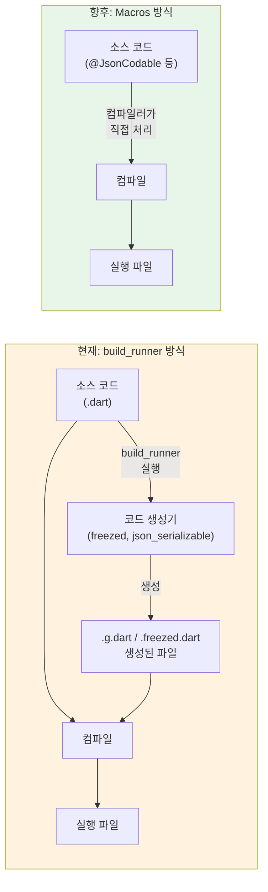

# Dart 언어 심화 가이드

> **마지막 업데이트**: 2026-02-08 | **Flutter 3.38** | **Dart 3.10**
> **난이도**: 중급 | **카테고리**: fundamentals
> **선행 학습**: 없음
> **예상 학습 시간**: 6h

> Flutter Clean Architecture + Bloc 패턴 기반 교육 자료
> Package versions: flutter_bloc ^9.1.1, freezed ^3.2.5, fpdart ^1.2.0, go_router ^17.1.0, get_it ^9.2.0, injectable ^2.7.1

> **학습 목표**:
> - Dart의 고급 타입 시스템(Generics, Sealed Class, Records)을 실전에서 활용할 수 있다
> - Extension Methods와 Mixin을 활용해 재사용 가능한 코드를 작성할 수 있다
> - 비동기 프로그래밍의 심화 기법(Stream, Zone, Isolate)을 이해하고 적용할 수 있다

## 목차

1. [Generics 심화](#1-generics-심화)
2. [Extension Methods](#2-extension-methods)
3. [Extension Types (Dart 3.3+)](#3-extension-types-dart-33)
4. [Mixin](#4-mixin)
5. [Sealed Class & Pattern Matching](#5-sealed-class--pattern-matching)
6. [Records & Destructuring](#6-records--destructuring)
7. [비동기 심화](#7-비동기-심화)
8. [메타프로그래밍](#8-메타프로그래밍)
9. [메모리 관리](#9-메모리-관리)
10. [Isolate 기초](#10-isolate-기초)
11. [Dart Macros (향후 대비)](#11-dart-macros-향후-대비)
12. [실습 과제](#실습-과제)
13. [Self-Check](#self-check)

---

## 1. Generics 심화

### 1.1 제네릭 클래스와 메서드

Generics는 타입 안정성을 유지하면서 재사용 가능한 코드를 작성하는 핵심 기법입니다.

```dart
// 기본 제네릭 클래스
class Result<T> {
  final T? data;
  final String? error;

  Result.success(this.data) : error = null;
  Result.failure(this.error) : data = null;

  bool get isSuccess => error == null;
  bool get isFailure => error != null;
}

// 사용 예시
Result<User> userResult = Result.success(User(name: 'Alice'));
Result<int> countResult = Result.failure('Network error');
```

### 1.2 타입 바운드 (Type Bounds)

제네릭 타입에 제약을 걸어 특정 타입만 허용할 수 있습니다.

```dart
// Comparable을 구현한 타입만 허용
class SortedList<T extends Comparable<T>> {
  final List<T> _items = [];

  void add(T item) {
    _items.add(item);
    _items.sort();
  }

  T? get min => _items.isEmpty ? null : _items.first;
  T? get max => _items.isEmpty ? null : _items.last;
}

// 사용 가능
final numbers = SortedList<int>();
numbers.add(5);
numbers.add(2);
print(numbers.min); // 2
```

### 1.3 제네릭 메서드

```dart
// 제네릭 메서드
T firstWhere<T>(List<T> items, bool Function(T) test, {required T orElse}) {
  for (final item in items) {
    if (test(item)) return item;
  }
  return orElse;
}

// 사용 예시
final numbers = [1, 2, 3, 4, 5];
final result = firstWhere<int>(
  numbers,
  (n) => n > 3,
  orElse: -1,
); // 4
```

### 1.4 공변과 반변 (Covariance & Contravariance)

Dart의 제네릭은 기본적으로 공변(covariant)입니다.

```dart
class Animal {
  void makeSound() => print('Some sound');
}

class Dog extends Animal {
  @override
  void makeSound() => print('Bark');
}

// 공변: Iterable은 읽기 전용이므로 안전
void printAnimalsIterable(Iterable<Animal> animals) {
  for (final animal in animals) {
    animal.makeSound();
  }
}

void covariantExample() {
  final dogs = <Dog>[Dog(), Dog()];
  printAnimalsIterable(dogs); // OK!
}

// ⚠️ 주의: Dart의 제네릭 공변성은 unsound합니다
// 컴파일은 통과하지만 런타임 에러가 발생할 수 있습니다
void unsoundExample() {
  List<Animal> animals = <Dog>[Dog(), Dog()]; // 컴파일 OK
  // animals.add(Cat()); // 런타임 TypeError! List<Dog>에 Cat 추가 불가
}

// covariant 키워드: 메서드 파라미터의 타입을 하위 타입으로 좁힐 때
class AnimalShelter {
  void adopt(covariant Animal animal) {}
}

class DogShelter extends AnimalShelter {
  @override
  void adopt(Dog dog) {} // covariant 덕분에 Dog로 좁힐 수 있음
}
```

---

## 2. Extension Methods

Extension Methods는 기존 클래스를 수정하지 않고 새로운 기능을 추가할 수 있는 강력한 기능입니다.

### 2.1 기본 Extension

```dart
// String 확장
extension StringExtensions on String {
  String capitalize() {
    if (isEmpty) return this;
    return '${this[0].toUpperCase()}${substring(1)}';
  }

  // 참고: 실무에서는 서버 측 검증을 병행하세요
  bool get isValidEmail {
    final emailRegex = RegExp(r'^[\w-\.]+@([\w-]+\.)+[\w-]{2,}$');
    return emailRegex.hasMatch(this);
  }

  // Dart 내장: 'abc' * 3 == 'abcabcabc'
  // 대신 더 유용한 extension을 정의합시다
  String truncate(int maxLength, {String suffix = '...'}) {
    if (length <= maxLength) return this;
    return '${substring(0, maxLength - suffix.length)}$suffix';
  }
}

// 사용
print('hello'.capitalize()); // Hello
print('test@example.com'.isValidEmail); // true
print('Hello, World!'.truncate(8)); // Hello...
```

### 2.2 List Extension

```dart
// 참고: package:collection에 동일한 extension이 존재합니다
// 실무에서는 공식 패키지 사용을 권장하며, 여기서는 학습 목적으로 직접 구현합니다
extension ListExtensions<T> on List<T> {
  T? getOrNull(int index) {
    if (index < 0 || index >= length) return null;
    return this[index];
  }

  T? firstWhereOrNull(bool Function(T) test) {
    for (final element in this) {
      if (test(element)) return element;
    }
    return null;
  }

  Map<K, List<T>> groupBy<K>(K Function(T) keySelector) {
    final map = <K, List<T>>{};
    for (final element in this) {
      final key = keySelector(element);
      map.putIfAbsent(key, () => []).add(element);
    }
    return map;
  }
}
```

### 2.3 Nullable Extension

```dart
extension NullableExtensions<T> on T? {
  T orElse(T defaultValue) {
    return this ?? defaultValue;
  }

  R? let<R>(R Function(T) transform) {
    final value = this;
    return value != null ? transform(value) : null;
  }
}
```

---

## 3. Extension Types (Dart 3.3+)

Extension Types는 Dart 3.3에서 도입된 기능으로, 기존 타입을 zero-cost로 래핑하여 새로운 타입처럼 사용할 수 있게 합니다. Extension Methods와 달리, Extension Types는 완전히 새로운 정적 타입을 생성합니다.

### 3.1 기본 개념

Extension Types는 컴파일 타임에만 존재하며, 런타임에는 완전히 사라집니다. 이를 통해 성능 오버헤드 없이 타입 안전성을 강화할 수 있습니다.

```dart
// 기본 Extension Type
extension type UserId(String value) {
  // 추가 메서드 정의 가능
  String get displayValue => 'User#$value';

  bool get isValid => value.isNotEmpty && value.length >= 3;
}

// 사용
void processUser(UserId id) {
  print(id.displayValue);
}

void main() {
  final id = UserId('user_123');
  processUser(id);

  // ❌ 컴파일 에러: String을 UserId로 전달 불가
  // processUser('user_123');
}
```

### 3.2 Extension Types vs Extension Methods

```dart
// Extension Method: 기존 타입에 메서드 추가
extension StringUtils on String {
  String toTitleCase() => /* ... */;
}

// Extension Type: 새로운 타입 생성 (zero-cost wrapper)
extension type EmailAddress(String value) {
  bool get isValid => value.contains('@');
}

void example() {
  // Extension Method: String 타입 그대로
  String name = 'hello';
  name.toTitleCase(); // OK

  // Extension Type: EmailAddress는 String과 다른 타입
  EmailAddress email = EmailAddress('test@example.com');
  // String email2 = email; // ❌ 컴파일 에러 (implements 없이는)
}
```

### 3.3 implements를 통한 인터페이스 노출

`implements` 키워드를 사용하면 representation type의 인터페이스를 노출할 수 있습니다.

```dart
// implements String: String의 모든 메서드를 사용 가능
extension type EmailAddress(String value) implements String {
  EmailAddress.create(String email) : this(email.toLowerCase());

  bool get isValid {
    final emailRegex = RegExp(r'^[\w-\.]+@([\w-]+\.)+[\w-]{2,}$');
    return emailRegex.hasMatch(value);
  }

  String get domain => split('@').last;
}

void main() {
  final email = EmailAddress.create('User@Example.COM');

  // implements String 덕분에 String 메서드 사용 가능
  print(email.toLowerCase()); // user@example.com
  print(email.length); // 16
  print(email.domain); // example.com

  // String 타입으로 할당 가능
  String str = email; // OK!
}
```

### 3.4 실전 활용: Type-safe IDs

```dart
// 타입 안전한 ID 시스템
extension type UserId(String value) implements String {
  UserId.generate() : this('user_${DateTime.now().millisecondsSinceEpoch}');
}

extension type ProductId(String value) implements String {
  ProductId.generate() : this('prod_${DateTime.now().millisecondsSinceEpoch}');
}

class UserRepository {
  // UserId만 받음 - ProductId 전달 시 컴파일 에러
  Future<User?> findById(UserId id) async {
    return null; // 실제 구현
  }
}

class ProductRepository {
  Future<Product?> findById(ProductId id) async {
    return null;
  }
}

void main() {
  final userId = UserId('u123');
  final productId = ProductId('p456');

  final userRepo = UserRepository();
  final productRepo = ProductRepository();

  userRepo.findById(userId); // ✅ OK
  // userRepo.findById(productId); // ❌ 컴파일 에러!

  productRepo.findById(productId); // ✅ OK
  // productRepo.findById(userId); // ❌ 컴파일 에러!
}
```

### 3.5 Extension Types와 Sealed Class 조합

```dart
// API 응답 래퍼
extension type ApiResponse<T>(({int status, T? data, String? error}) value) {
  int get statusCode => value.status;
  T? get data => value.data;
  String? get error => value.error;

  bool get isSuccess => statusCode >= 200 && statusCode < 300;
  bool get isError => statusCode >= 400;
}

// 사용
Future<ApiResponse<User>> fetchUser(String id) async {
  try {
    final user = User(id: id, name: 'Alice', email: 'alice@example.com');
    return ApiResponse((status: 200, data: user, error: null));
  } catch (e) {
    return ApiResponse((status: 500, data: null, error: e.toString()));
  }
}
```

> **핵심 차이점**:
> - **Extension Methods**: 기존 타입에 메서드만 추가 (타입은 그대로)
> - **Extension Types**: 새로운 타입을 생성 (컴파일 타임 타입 안전성 강화)
> - **런타임 비용**: Extension Types는 zero-cost abstraction (런타임에 완전히 사라짐)

---

## 4. Mixin

Mixin은 클래스의 코드를 다른 클래스에서 재사용하는 방법입니다.

### 3.1 기본 Mixin

```dart
mixin Timestamps {
  DateTime? createdAt;
  DateTime? updatedAt;

  void markCreated() {
    createdAt = DateTime.now();
  }

  void markUpdated() {
    updatedAt = DateTime.now();
  }
}

mixin Validation {
  final List<String> _errors = [];

  List<String> get errors => List.unmodifiable(_errors);
  bool get isValid => _errors.isEmpty;

  void addError(String error) {
    _errors.add(error);
  }

  void clearErrors() {
    _errors.clear();
  }
}

// Mixin 사용
class User with Timestamps, Validation {
  String name;
  String email;

  User(this.name, this.email) {
    markCreated();
    validate();
  }

  void validate() {
    clearErrors();
    if (name.isEmpty) addError('Name is required');
    if (!email.contains('@')) addError('Invalid email');
  }
}
```

### 3.2 Mixin의 제약 조건

```dart
abstract class Animal {
  String get species;
  void makeSound();
}

mixin Flyable on Animal {
  double wingSpan = 0;

  void fly() {
    print('$species is flying with ${wingSpan}m wingspan');
  }
}

mixin Swimmable on Animal {
  double swimSpeed = 0;

  void swim() {
    print('$species is swimming at ${swimSpeed}km/h');
  }
}

// Animal을 상속한 클래스만 Flyable, Swimmable 사용 가능
class Duck extends Animal with Flyable, Swimmable {
  @override
  String get species => 'Duck';

  @override
  void makeSound() => print('Quack');

  Duck() {
    wingSpan = 0.5;
    swimSpeed = 3.0;
  }
}
```

### 3.3 Mixin Class (Dart 3.0+)

`mixin class`는 클래스와 mixin 두 가지 역할을 동시에 수행할 수 있습니다.

```dart
// mixin class: 클래스로도, mixin으로도 사용 가능
mixin class Identifiable {
  String id = '';

  String get shortId => id.length >= 8 ? id.substring(0, 8) : id;
}

// mixin으로 사용
class User with Identifiable {
  String name;
  User(this.name);
}

// 클래스로 상속
class AdminUser extends Identifiable {
  String role;
  AdminUser(this.role);
}
```

> **mixin vs mixin class**: 일반 `mixin`은 `with`로만 사용 가능하고, `mixin class`는 `extends`와 `with` 모두 가능합니다. 단, `mixin class`는 `on` 절을 사용할 수 없습니다.

---

## 5. Sealed Class & Pattern Matching

Dart 3.0에서 도입된 Sealed Class는 타입 안전한 상태 관리와 패턴 매칭을 가능하게 합니다.

### 4.1 Sealed Class 기본

```dart
sealed class Result<T> {
  const Result();
}

class Success<T> extends Result<T> {
  final T data;
  const Success(this.data);
}

class Failure<T> extends Result<T> {
  final String message;
  const Failure(this.message);
}

class Loading<T> extends Result<T> {
  const Loading();
}

// 패턴 매칭
String handleResult<T>(Result<T> result) {
  return switch (result) {
    Success(:final data) => 'Success: $data',
    Failure(:final message) => 'Error: $message',
    Loading() => 'Loading...',
  };
}
```

### 4.2 Guard Clauses

```dart
sealed class Shape {}

class Circle extends Shape {
  final double radius;
  Circle(this.radius);
}

class Rectangle extends Shape {
  final double width;
  final double height;
  Rectangle(this.width, this.height);
}

// import 'dart:math' show pi;
double calculateArea(Shape shape) {
  return switch (shape) {
    Circle(:final radius) when radius > 0 => pi * radius * radius,
    Circle() => throw ArgumentError('Invalid radius'),
    Rectangle(:final width, :final height) when width > 0 && height > 0 =>
      width * height,
    Rectangle() => throw ArgumentError('Invalid dimensions'),
  };
}
```

---

## 6. Records & Destructuring

Dart 3.0에서 도입된 Records는 여러 값을 묶어 반환하거나 전달하는 간단한 방법을 제공합니다.

### 5.1 Record 기본

```dart
// Positional record
(int, String) getUserInfo() {
  return (42, 'Alice');
}

// Named record
({int age, String name}) getUserInfoNamed() {
  return (age: 42, name: 'Alice');
}

// 사용
void recordExample() {
  // Destructuring
  final (age, name) = getUserInfo();
  print('$name is $age years old');

  // Named destructuring
  final (age: userAge, name: userName) = getUserInfoNamed();
  print('$userName is $userAge years old');
}
```

### 5.2 Multiple Return Values

```dart
// 통계 계산
(double mean, double median) calculateStats(List<double> values) {
  if (values.isEmpty) return (0, 0);

  final sum = values.reduce((a, b) => a + b);
  final mean = sum / values.length;

  final sorted = List<double>.from(values)..sort();
  final mid = sorted.length ~/ 2;
  final median = sorted.length.isOdd
      ? sorted[mid]
      : (sorted[mid - 1] + sorted[mid]) / 2;

  return (mean, median);
}

// 사용
final (mean, median) = calculateStats([1.0, 2.0, 3.0, 4.0, 5.0]);
print('Mean: $mean, Median: $median');
```

---

## 7. 비동기 심화

### 6.1 Future 고급 패턴

```dart
// 병렬 실행
Future<void> parallelExecution() async {
  final futures = [
    fetchData(1),
    fetchData(2),
    fetchData(3),
  ];

  final results = await Future.wait(futures);
  print('Results: $results');
}

// 첫 번째 완료된 결과만 사용
Future<void> raceExecution() async {
  final result = await Future.any([
    fetchData(1, delay: 3),
    fetchData(2, delay: 1),
    fetchData(3, delay: 2),
  ]);
  print('First result: $result');
}

Future<int> fetchData(int id, {int delay = 1}) async {
  await Future.delayed(Duration(seconds: delay));
  return id * 10;
}
```

### 6.2 Stream 기초와 심화

```dart
// 기본 Stream 생성
Stream<int> countStream(int max) async* {
  for (var i = 1; i <= max; i++) {
    await Future.delayed(Duration(milliseconds: 500));
    yield i;
  }
}

// import 'dart:async';
class EventBus {
  final _controller = StreamController<String>.broadcast();

  Stream<String> get stream => _controller.stream;

  void emit(String event) {
    _controller.add(event);
  }

  void close() {
    _controller.close();
  }
}
```

### 6.3 Retry 패턴

```dart
// 지수 백오프를 사용한 재시도
Future<T> retryWithExponentialBackoff<T>(
  Future<T> Function() operation, {
  int maxAttempts = 3,
  Duration initialDelay = const Duration(seconds: 1),
  double backoffMultiplier = 2.0,
}) async {
  var attempt = 0;
  var delay = initialDelay;

  while (true) {
    try {
      return await operation();
    } catch (e) {
      attempt++;
      if (attempt >= maxAttempts) rethrow;

      print('Attempt $attempt failed, retrying in ${delay.inSeconds}s...');
      await Future.delayed(delay);
      delay = delay * backoffMultiplier;
    }
  }
}
```

---

## 8. 메타프로그래밍

### 7.1 Annotation 기초

```dart
// 커스텀 annotation
class ApiEndpoint {
  final String path;
  final String method;

  const ApiEndpoint({
    required this.path,
    this.method = 'GET',
  });
}

// 사용
@ApiEndpoint(path: '/users', method: 'GET')
class UserApi {
  // API 엔드포인트 구현
}
```

### 7.2 freezed 패턴

```dart
import 'package:freezed_annotation/freezed_annotation.dart';

part 'user.freezed.dart';
part 'user.g.dart';

@freezed
class User with _$User {
  const factory User({
    required String id,
    required String name,
    required String email,
    int? age,
  }) = _User;

  factory User.fromJson(Map<String, dynamic> json) => _$UserFromJson(json);
}
```

> **코드 생성 실행**: freezed, injectable 등은 `build_runner`로 코드를 생성합니다.
> ```bash
> # 일회성 빌드
> dart run build_runner build --delete-conflicting-outputs
>
> # 파일 변경 감지 자동 빌드 (개발 중 권장)
> dart run build_runner watch --delete-conflicting-outputs
> ```
> `part 'user.freezed.dart'`는 build_runner가 생성할 파일을 선언합니다. 이 파일은 직접 수정하지 않으며, 소스 코드 변경 시 자동으로 재생성됩니다.

### 7.3 injectable 패턴

```dart
import 'package:injectable/injectable.dart';

@injectable
class ApiService {
  Future<String> fetchData() async {
    return 'Data from API';
  }
}

@injectable
class UserRepository {
  final ApiService _apiService;

  UserRepository(this._apiService);

  Future<User?> getUser(String id) async {
    return null;
  }
}

@singleton
class AppSettings {
  String apiUrl = 'https://api.example.com';
}
```

---

## 9. 메모리 관리

### 8.1 Garbage Collection 이해

```dart
import 'dart:async';

// ❌ Bad: 캐시 크기 제한 없음 → 메모리 무한 증가
class UnboundedCache {
  final Map<String, Object> _cache = {};

  void put(String key, Object value) {
    _cache[key] = value; // 계속 쌓임
  }
}

// ✅ Good: LRU 방식으로 크기 제한
class BoundedCache {
  final int maxSize;
  final Map<String, Object> _cache = {};

  BoundedCache({this.maxSize = 100});

  void put(String key, Object value) {
    if (_cache.length >= maxSize) {
      _cache.remove(_cache.keys.first); // 가장 오래된 항목 제거
    }
    _cache[key] = value;
  }

  Object? get(String key) => _cache[key];
}

// Stream 구독 누수 방지
class StreamExample {
  StreamSubscription? _subscription;

  void startListening(Stream<int> stream) {
    _subscription = stream.listen((data) {
      print(data);
    });
  }

  void dispose() {
    _subscription?.cancel();
  }
}
```

### 8.2 WeakReference

```dart
class CacheWithWeakReference {
  final Map<String, WeakReference<Object>> _cache = {};

  void put(String key, Object value) {
    _cache[key] = WeakReference(value);
  }

  Object? get(String key) {
    final ref = _cache[key];
    return ref?.target;
  }

  void cleanup() {
    _cache.removeWhere((key, ref) => ref.target == null);
  }
}
```

---

## 10. Isolate 기초

### 9.1 Isolate.run() (권장)

Dart 2.19+에서 도입된 `Isolate.run()`은 가장 간단한 Isolate 사용법입니다.

```dart
import 'dart:isolate';

// 단순하고 현대적인 방식 (권장)
Future<int> calculateInBackground(int n) async {
  return await Isolate.run(() {
    var sum = 0;
    for (var i = 1; i <= n; i++) {
      sum += i;
    }
    return sum;
  });
}
```

### 9.2 Isolate.spawn (양방향 통신)

양방향으로 메시지를 주고받아야 할 때는 `Isolate.spawn`을 사용합니다.

```dart
import 'dart:isolate';

Future<int> runInIsolate(int n) async {
  final receivePort = ReceivePort();

  await Isolate.spawn(_calculateSum, [receivePort.sendPort, n]);

  final result = await receivePort.first as int;
  return result;
}

void _calculateSum(List<dynamic> args) {
  final sendPort = args[0] as SendPort;
  final n = args[1] as int;

  var sum = 0;
  for (var i = 1; i <= n; i++) {
    sum += i;
  }

  sendPort.send(sum);
}
```

### 9.3 Compute 함수 (Flutter)

```dart
import 'package:flutter/foundation.dart';

int _heavyComputation(int n) {
  var sum = 0;
  for (var i = 1; i <= n; i++) {
    sum += i;
  }
  return sum;
}

Future<void> computeExample() async {
  final result = await compute(_heavyComputation, 1000000);
  print('Result: $result');
}
```

> **참고**: Flutter 3.x에서 `compute`는 여전히 사용 가능하지만, `Isolate.run()`이 Dart 팀이 공식 권장하는 대안입니다.

### 9.4 참고

Isolate에 대한 더 자세한 내용은 [system/Isolates.md](../system/Isolates.md)를 참조하세요.

---

## 11. Dart Macros (향후 대비)

### 11.1 Macros란?

Dart Macros는 **컴파일 타임 코드 생성** 기능으로, 기존 `build_runner` + 코드 생성 패키지(freezed, json_serializable, injectable 등)를 **언어 레벨에서 대체**하는 것을 목표로 합니다.

> **현재 상태 (2026년 2월 기준)**: Macros는 Dart 팀에서 활발히 개발 중이며, `@JsonCodable` 등 일부 매크로가
> 실험적으로 제공되고 있습니다. 프로덕션 사용은 아직 권장되지 않으나, 향후 Flutter 개발 방식에
> 큰 변화를 가져올 핵심 기능이므로 개념을 미리 이해하는 것이 중요합니다.

### 11.2 build_runner vs Macros 비교



| 항목 | build_runner (현재) | Macros (향후) |
|------|-------------------|--------------|
| **실행 시점** | 빌드 전 별도 단계 | 컴파일 중 자동 실행 |
| **생성 파일** | `.g.dart`, `.freezed.dart` 등 | 없음 (컴파일러 내부 처리) |
| **빌드 속도** | 느림 (전체 프로젝트 스캔) | 빠름 (증분 컴파일) |
| **IDE 지원** | 생성 파일 직접 확인 가능 | IDE가 가상 코드 표시 |
| **설정 복잡도** | `build.yaml`, `part` 지시어 필요 | 어노테이션만 추가 |
| **디버깅** | 생성된 코드 직접 확인 | 컴파일러 출력 분석 |
| **안정성** | ✅ 프로덕션 검증됨 | ⚠️ 실험 단계 |

### 11.3 `@JsonCodable` 미리보기

현재 실험적으로 제공되는 `@JsonCodable` 매크로 예시:

```dart
// ⚠️ 실험적 기능 — 프로덕션 사용 비권장
// pubspec.yaml에서 experiment flag 필요
// dart --enable-experiment=macros run lib/main.dart

// 향후 Macros 방식 (미리보기)
@JsonCodable()
class User {
  final String name;
  final int age;
  final String email;
}

// ✅ 위 코드만으로 아래가 자동 생성됨:
// - User.fromJson(Map<String, dynamic> json)
// - Map<String, dynamic> toJson()
// - 별도 .g.dart 파일 없음, part 지시어 불필요
```

**현재 build_runner 방식과 비교:**

```dart
// 현재 방식 — json_serializable 사용
import 'package:json_annotation/json_annotation.dart';

part 'user.g.dart';  // ← Macros에서는 불필요

@JsonSerializable()
class User {
  final String name;
  final int age;
  final String email;

  User({required this.name, required this.age, required this.email});

  // ← 이 보일러플레이트가 Macros에서는 불필요
  factory User.fromJson(Map<String, dynamic> json) => _$UserFromJson(json);
  Map<String, dynamic> toJson() => _$UserToJson(this);
}

// dart run build_runner build ← 이 단계가 Macros에서는 불필요
```

### 11.4 Macros가 대체할 주요 패키지

현재 프로젝트에서 사용 중인 코드 생성 패키지와 향후 Macros 대체 전망:

| 패키지 | 용도 | Macros 대체 가능성 | 마이그레이션 전략 |
|--------|------|-------------------|-----------------|
| **json_serializable** | JSON ↔ Object | ✅ 높음 (`@JsonCodable`) | 가장 먼저 대체 예상 |
| **freezed** | Immutable class + Union | ⚠️ 중간 (부분 대체) | sealed class로 일부 대체, 나머지 Macros 대기 |
| **injectable** | DI 코드 생성 | ⚠️ 중간 | `@Injectable` 매크로 가능성 |
| **retrofit** | API 클라이언트 생성 | ⚠️ 중간 | HTTP 클라이언트 매크로 가능성 |
| **auto_route** | 라우터 코드 생성 | ❌ 낮음 (go_router가 대체) | 이미 go_router 사용 권장 |
| **hive_generator** | Hive 어댑터 생성 | ✅ 높음 | 직렬화 매크로로 대체 가능 |

### 11.5 마이그레이션 준비 전략

Macros가 안정화되기 전 현재 프로젝트에서 준비할 수 있는 사항:

**1단계: 현재 (build_runner 유지)**

```yaml
# pubspec.yaml — 현재 권장 설정
dependencies:
  freezed_annotation: ^3.1.0
  json_annotation: ^4.9.0

dev_dependencies:
  build_runner: ^2.4.15
  freezed: ^3.1.0
  json_serializable: ^6.9.5
```

**2단계: 준비 (코드 구조 정리)**

```dart
// ✅ 좋은 패턴: 모델과 직렬화 분리
// 향후 Macros 전환 시 모델 클래스만 어노테이션 변경하면 됨

// domain/entities/user.dart — 순수 도메인 모델
class User {
  final String name;
  final int age;
  const User({required this.name, required this.age});
}

// data/models/user_dto.dart — 직렬화 담당
// 향후 @JsonSerializable → @JsonCodable로 변경만 하면 됨
@JsonSerializable()
class UserDto {
  final String name;
  final int age;
  // ...
}
```

**3단계: 전환 (Macros 안정화 후)**

```dart
// 향후 전환 예상 — 변경 최소화
// 1. part 지시어 제거
// 2. 어노테이션 변경
// 3. 보일러플레이트 팩토리/메서드 제거
// 4. build_runner 의존성 제거

@JsonCodable()  // @JsonSerializable() → @JsonCodable()
class UserDto {
  final String name;
  final int age;
  // fromJson, toJson 자동 생성 — 보일러플레이트 제거
}
```

### 11.6 주의사항

1. **프로덕션에서 Macros를 사용하지 마세요** — 아직 실험 단계이며 API가 변경될 수 있습니다
2. **build_runner 방식은 당분간 유효합니다** — Macros가 안정화되어도 점진적 전환 기간이 있습니다
3. **Dart 팀의 공식 발표를 추적하세요** — [Dart 공식 블로그](https://medium.com/dartlang)와 [GitHub](https://github.com/dart-lang/language/tree/main/working/macros)에서 진행 상황을 확인하세요
4. **sealed class를 적극 활용하세요** — Dart 3.0의 sealed class는 freezed의 union type 일부를 이미 대체합니다. 이는 Macros 전환 시 마이그레이션 범위를 줄여줍니다

> **참고**: Freezed와 sealed class 활용은 [Freezed](../core/Freezed.md)를 참조하세요.
> build_runner 설정은 [메타프로그래밍](#8-메타프로그래밍) 섹션을 참조하세요.

---

## 실습 과제

### 과제 1: Generic Repository 구현

다음 요구사항을 만족하는 Generic Repository를 구현하세요:

**요구사항:**
1. `Repository<T extends Entity>` 인터페이스 정의
2. `InMemoryRepository<T>` 구현
3. Extension Methods 추가
4. 테스트 코드 작성

**평가 기준:**
- 타입 안정성
- Stream 메모리 누수 방지
- Extension 활용

### 과제 2: Sealed Class로 상태 관리 구현

Bloc 패턴을 사용하여 Todo 앱의 상태 관리를 구현하세요:

**요구사항:**
1. Sealed Class로 상태 정의
2. Sealed Class로 이벤트 정의
3. TodoBloc 구현
4. Widget에서 사용

**평가 기준:**
- Sealed class의 exhaustive checking 활용
- Pattern matching의 가독성
- 상태 전환 로직의 정확성

### 과제 3: 비동기 처리 고급 패턴

실전에서 자주 사용하는 비동기 패턴을 구현하세요:

**요구사항:**
1. `RetryPolicy` 클래스
2. `CacheManager` 클래스
3. `ApiClient` 클래스
4. Stream 변환 유틸리티

**평가 기준:**
- 비동기 에러 처리의 견고성
- 메모리 누수 방지
- 실전 활용 가능성

---

## Self-Check

다음 항목을 체크하며 학습 내용을 점검하세요:

- [ ] Generics의 공변/반변 개념을 이해하고, 타입 바운드를 적절히 사용할 수 있다
- [ ] Extension Methods를 활용해 기존 클래스를 확장하고, nullable 타입을 안전하게 처리할 수 있다
- [ ] Mixin과 mixin class의 차이를 이해하고, on 키워드로 제약을 설정할 수 있다
- [ ] Sealed class로 exhaustive pattern matching을 구현하고, guard clause를 활용할 수 있다
- [ ] Records와 destructuring을 사용해 다중 값을 반환하고 간결한 코드를 작성할 수 있다
- [ ] Future와 Stream의 차이를 이해하고, StreamController로 커스텀 스트림을 만들 수 있다
- [ ] Future.wait, Future.any를 활용한 병렬/경쟁 실행 패턴을 이해하고, retry 패턴을 구현할 수 있다
- [ ] build_runner와 code generation의 원리를 이해하고, freezed/injectable을 활용할 수 있다
- [ ] WeakReference를 사용한 캐시 패턴을 이해하고, Stream 구독 해제로 메모리 누수를 방지할 수 있다
- [ ] Isolate의 메모리 격리 개념을 이해하고, compute 함수로 무거운 연산을 백그라운드에서 처리할 수 있다
- [ ] Dart Macros의 개념과 build_runner 대비 장점(생성 파일 불필요, 빌드 속도)을 설명할 수 있다
- [ ] `@JsonCodable` 매크로와 기존 `@JsonSerializable` + `build_runner` 방식의 차이를 비교할 수 있다
- [ ] Macros 안정화 대비 현재 코드 구조를 준비하는 전략(모델/DTO 분리, sealed class 활용)을 이해하고 있다

---

## 관련 문서

**다음 단계**:
- [WidgetFundamentals](./WidgetFundamentals.md) - Widget/Element/RenderObject 트리와 BuildContext 학습

**심화 학습**:
- [system/Isolates](../system/Isolates.md) - Isolate 상세 가이드
- [core/ErrorHandling](../core/ErrorHandling.md) - 에러 처리 패턴

---

**학습 완료 후**: [fundamentals/WidgetFundamentals.md](./WidgetFundamentals.md)로 진행하여 Widget/Element/RenderObject 트리와 BuildContext를 학습하세요.
