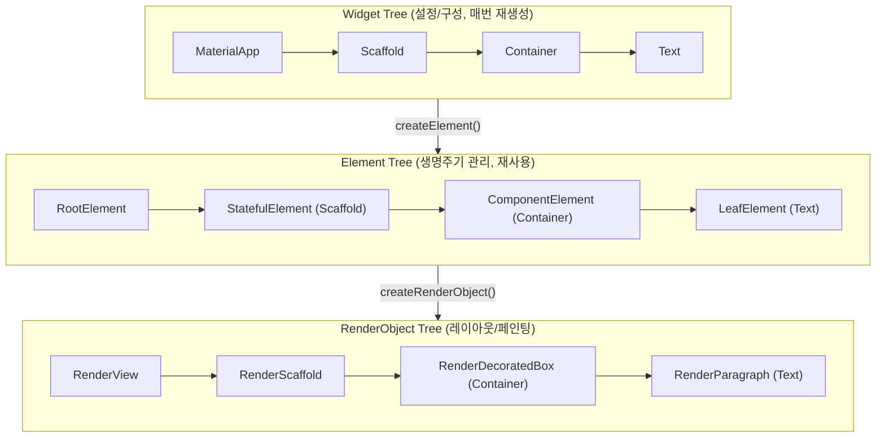
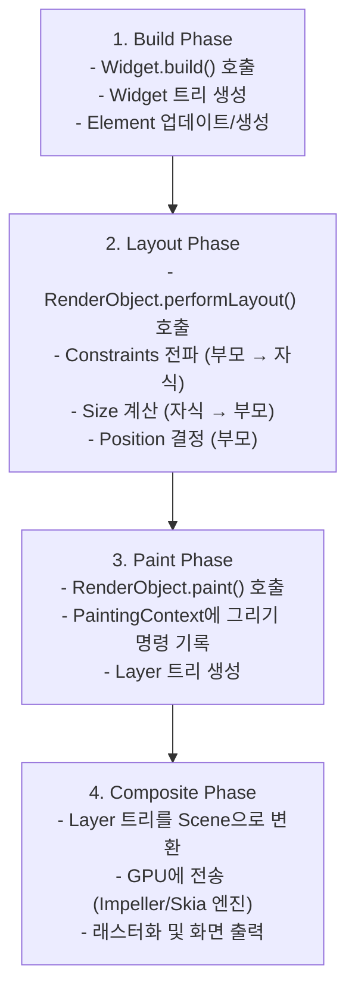
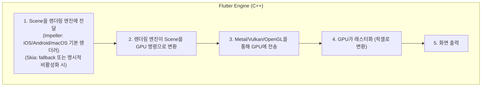
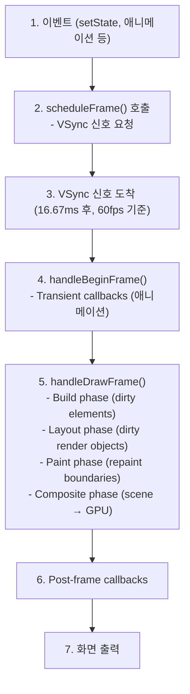
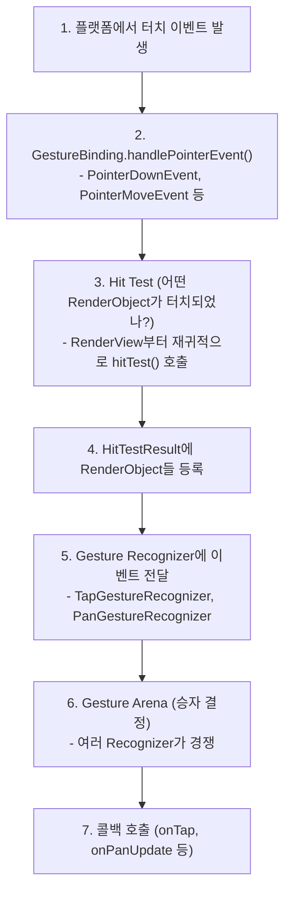
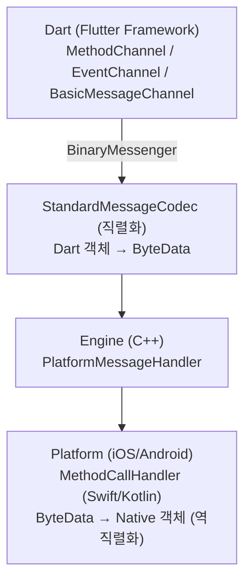

# Flutter 렌더링 파이프라인 가이드

> **난이도**: 중급 | **카테고리**: fundamentals
> **선행 학습**: [WidgetFundamentals](./WidgetFundamentals.md)
> **예상 학습 시간**: 2h

Flutter의 내부 동작 원리 (Widget → Element → RenderObject → 화면)를 다루는 가이드입니다.

> **패키지 버전**
> - Flutter SDK: 3.38.x
> - Dart SDK: 3.7.x

> **학습 목표**: 이 문서를 학습하면 다음을 할 수 있습니다:
> - Widget Tree, Element Tree, RenderObject Tree의 3개 트리 구조와 내부 동작 원리를 이해할 수 있습니다
> - Build → Layout → Paint → Composite 렌더링 파이프라인의 각 단계를 설명할 수 있습니다
> - Dirty checking 메커니즘, VSync, Frame 처리 흐름 등 내부 최적화 원리를 이해할 수 있습니다
>
> **관련 문서**: Widget 사용법, BuildContext, State Lifecycle 등 실용적 사용법은 [WidgetFundamentals](./WidgetFundamentals.md) 참조

---

## 목차

1. [3개 트리 구조](#1-3개-트리-구조)
2. [렌더링 파이프라인](#2-렌더링-파이프라인)
3. [Build Phase](#3-build-phase)
4. [Layout Phase](#4-layout-phase)
5. [Paint Phase](#5-paint-phase)
6. [Compositing Phase](#6-compositing-phase)
7. [Frame 처리 흐름](#7-frame-처리-흐름)
8. [Dirty 체크와 최적화](#8-dirty-체크와-최적화)
9. [GestureBinding](#9-gesturebinding)
10. [Platform Channel 내부](#10-platform-channel-내부)

---

> **Quick Start (5분 요약)**
>
> Flutter는 3개 트리로 UI를 관리합니다:
> ```dart
> // Widget Tree (설정/구성)
> Container(
>   color: Colors.blue,
>   child: Text('Hello'),
> )
>
> // → Element Tree (생명주기 관리, 변경 감지)
> // → RenderObject Tree (실제 레이아웃/페인팅)
> ```
>
> 렌더링 파이프라인 4단계:
> ```
> 1. Build: Widget 트리 생성
> 2. Layout: 크기/위치 계산 (RenderObject.performLayout)
> 3. Paint: 그리기 명령 생성 (RenderObject.paint)
> 4. Composite: GPU로 전송하여 화면에 출력
> ```
>
> 최적화 핵심:
> - `const` 생성자: 리빌드 방지
> - `RepaintBoundary`: 리페인트 범위 격리
> - `Keys`: Element 재사용
>
> **실용적 사용법**: BuildContext, State Lifecycle, InheritedWidget 등 위젯 사용법은 [WidgetFundamentals](./WidgetFundamentals.md) 참조

---

## 1. 3개 트리 구조

### Widget Tree

**Widget은 불변(immutable) 설정 객체**입니다. 매 빌드마다 새로 생성됩니다.

```dart
class MyWidget extends StatelessWidget {
  @override
  Widget build(BuildContext context) {
    // 매번 새로운 Container 인스턴스 생성
    return Container(
      color: Colors.blue,
      child: Text('Hello'),
    );
  }
}

// Widget은 경량 객체 (설정만 담음)
// Flutter의 Container 내부 구조 (개념적 단순화):
//   - color, child, width, height 등의 설정값만 보유
//   - build() 호출 시 실제 RenderObject 생성을 위임
//   - @immutable: 생성 후 변경 불가
```

> **Widget 사용법**: Widget의 종류(StatelessWidget, StatefulWidget, InheritedWidget)와 실용적 사용법은 [WidgetFundamentals](./WidgetFundamentals.md) 참조

### Element Tree

**Element는 Widget과 RenderObject를 연결하는 중간 계층**입니다. 수명이 길며, Widget 변경 시 재사용됩니다.

```dart
abstract class Element extends DiagnosticableTree implements BuildContext {
  Widget _widget; // 현재 위젯
  RenderObject? _renderObject; // 연결된 RenderObject
  Element? _parent; // 부모 Element
  
  // Element가 dirty 상태인지 (리빌드 필요)
  bool _dirty = true;
  
  // 위젯 업데이트
  void update(Widget newWidget) {
    _widget = newWidget;
    // RenderObject에 변경 사항 전달
  }
}

// StatelessElement: StatelessWidget용 Element
class StatelessElement extends ComponentElement {
  @override
  Widget build() => widget.build(this);
}

// StatefulElement: StatefulWidget용 Element
class StatefulElement extends ComponentElement {
  State _state;
  
  @override
  Widget build() => _state.build(this);
  
  void _firstBuild() {
    _state = widget.createState();
    _state._element = this;
    _state.initState();
  }
}
```

### RenderObject Tree

**RenderObject는 실제 레이아웃과 페인팅을 수행**합니다. 가장 무겁고 수명이 깁니다.

```dart
abstract class RenderObject extends AbstractNode with DiagnosticableTreeMixin {
  // 부모 RenderObject
  RenderObject? parent;
  
  // Constraints (부모로부터 받은 제약)
  Constraints get constraints => _constraints!;
  Constraints? _constraints;
  
  // Layout 수행
  void performLayout();
  
  // Paint 수행
  void paint(PaintingContext context, Offset offset);
  
  // Hit test (터치 이벤트 처리)
  bool hitTest(HitTestResult result, {required Offset position});
}

// 예시: RenderBox (박스 모델 렌더 객체)
class RenderBox extends RenderObject {
  Size _size = Size.zero;
  
  @override
  void performLayout() {
    // 자식 레이아웃
    // 크기 결정
    size = constraints.biggest;
  }
  
  @override
  void paint(PaintingContext context, Offset offset) {
    // Canvas에 그리기
    context.canvas.drawRect(
      offset & size,
      Paint()..color = Colors.blue,
    );
  }
}
```

### 3개 트리 관계도



### Widget-Element-RenderObject 생성 흐름

```dart
// 1. Widget 생성 (build 메서드)
Widget build(BuildContext context) {
  return Container( // Widget 인스턴스
    color: Colors.blue,
    child: Text('Hello'),
  );
}

// 2. Element 생성 (Flutter 프레임워크)
Element createElement() {
  // Widget 타입에 따라 적절한 Element 생성
  if (widget is StatelessWidget) {
    return StatelessElement(widget);
  } else if (widget is StatefulWidget) {
    return StatefulElement(widget);
  } else if (widget is RenderObjectWidget) {
    return RenderObjectElement(widget);
  }
}

// 3. RenderObject 생성 (RenderObjectWidget만)
RenderObject createRenderObject(BuildContext context) {
  return RenderDecoratedBox(
    decoration: BoxDecoration(color: color),
  );
}

// 4. 트리 연결
void mount(Element? parent, Object? newSlot) {
  _parent = parent;
  _slot = newSlot;
  
  // RenderObject 생성 (RenderObjectElement만)
  if (widget is RenderObjectWidget) {
    _renderObject = widget.createRenderObject(this);
    attachRenderObject(newSlot);
  }
  
  // 자식 빌드
  _firstBuild();
}
```

### Element 재사용 메커니즘

```dart
class MyWidget extends StatefulWidget {
  @override
  _MyWidgetState createState() => _MyWidgetState();
}

class _MyWidgetState extends State<MyWidget> {
  bool _showRed = true;

  @override
  Widget build(BuildContext context) {
    return Column(
      children: [
        if (_showRed)
          Container(key: ValueKey('red'), color: Colors.red, height: 100),
        Container(key: ValueKey('green'), color: Colors.green, height: 100),
        ElevatedButton(
          onPressed: () => setState(() => _showRed = !_showRed),
          child: Text('Toggle'),
        ),
      ],
    );
  }
}

// Key가 있으면 Element 재사용 가능
// 1. 이전 Widget Tree: [red, green]
// 2. 새 Widget Tree: [green] (red 제거)
// 3. Flutter는 Key로 green Element를 찾아서 재사용
// 4. Key가 없으면 순서대로 매칭 (red → green으로 업데이트되는 문제 발생)
```

> **Key 사용법**: Key의 종류(ValueKey, ObjectKey, GlobalKey, UniqueKey)와 실전 사용 시나리오는 [WidgetFundamentals](./WidgetFundamentals.md#5-key의-역할) 참조

---

## 2. 렌더링 파이프라인

Flutter 렌더링은 **4단계 파이프라인**을 거칩니다:



### 파이프라인 트리거

```dart
// 1. setState() → Build Phase 트리거
setState(() {
  _counter++;
});
// → Element를 dirty로 마킹
// → 다음 프레임에 build() 호출

// 2. markNeedsLayout() → Layout Phase 트리거
void _updateSize() {
  renderObject.markNeedsLayout();
}
// → RenderObject를 레이아웃 dirty로 마킹
// → 다음 프레임에 performLayout() 호출

// 3. markNeedsPaint() → Paint Phase 트리거
void _updateColor() {
  renderObject.markNeedsPaint();
}
// → RenderObject를 페인트 dirty로 마킹
// → 다음 프레임에 paint() 호출

// 4. markNeedsCompositingBitsUpdate() → Composite Phase 트리거
void _updateOpacity() {
  renderObject.markNeedsCompositingBitsUpdate();
}
```

### 파이프라인 최적화 원칙

```dart
// ❌ 나쁨: 매 프레임마다 전체 리빌드
class BadExample extends StatefulWidget {
  @override
  _BadExampleState createState() => _BadExampleState();
}

class _BadExampleState extends State<BadExample> {
  @override
  Widget build(BuildContext context) {
    return Column(
      children: [
        ExpensiveWidget(), // 매번 재생성
        ExpensiveWidget(),
        ExpensiveWidget(),
      ],
    );
  }
}

// ✅ 좋음: const로 리빌드 방지
class GoodExample extends StatefulWidget {
  @override
  _GoodExampleState createState() => _GoodExampleState();
}

class _GoodExampleState extends State<GoodExample> {
  int _counter = 0;

  @override
  Widget build(BuildContext context) {
    return Column(
      children: [
        const ExpensiveWidget(), // const → 리빌드 안됨
        const ExpensiveWidget(),
        Text('Counter: $_counter'), // 이것만 리빌드
        ElevatedButton(
          onPressed: () => setState(() => _counter++),
          child: const Text('Increment'), // const
        ),
      ],
    );
  }
}
```

---

## 3. Build Phase

### Build 스케줄링

```dart
// setState() 호출 시 내부 동작
void setState(VoidCallback fn) {
  _element.markNeedsBuild(); // Element를 dirty로 마킹
}

// Element.markNeedsBuild()
void markNeedsBuild() {
  if (_dirty) return; // 이미 dirty면 스킵
  
  _dirty = true;
  owner!.scheduleBuildFor(this); // BuildOwner에 스케줄링
}

// BuildOwner.scheduleBuildFor()
void scheduleBuildFor(Element element) {
  _dirtyElements.add(element); // dirty 리스트에 추가
  
  if (!_scheduledFlushDirtyElements) {
    _scheduledFlushDirtyElements = true;
    // 다음 프레임에 실행 예약
    SchedulerBinding.instance.scheduleFrame();
  }
}
```

### Build 실행

```dart
// BuildOwner.buildScope()
void buildScope(Element context) {
  // dirty element들을 깊이순으로 정렬 (부모 → 자식)
  _dirtyElements.sort((a, b) => a.depth.compareTo(b.depth));
  
  // 각 element 리빌드
  for (final element in _dirtyElements) {
    if (element._dirty && element._inDirtyList) {
      element.rebuild(); // rebuild 호출
    }
  }
  
  _dirtyElements.clear();
}

// Element.rebuild()
void rebuild() {
  if (!_active || !_dirty) return;
  
  performRebuild(); // 실제 빌드 수행
}

// ComponentElement.performRebuild() (StatelessElement/StatefulElement)
void performRebuild() {
  Widget built;
  
  // build() 호출
  try {
    built = build(); // widget.build(this) or state.build(this)
  } catch (e) {
    // 에러 처리
  }
  
  // 이전 child와 비교하여 업데이트
  _child = updateChild(_child, built, slot);
  
  _dirty = false;
}
```

### updateChild 알고리즘

```dart
Element? updateChild(Element? child, Widget? newWidget, Object? newSlot) {
  // Case 1: newWidget이 null → 자식 제거
  if (newWidget == null) {
    if (child != null) {
      deactivateChild(child);
    }
    return null;
  }
  
  // Case 2: child가 null → 새 자식 생성
  if (child == null) {
    return inflateWidget(newWidget, newSlot);
  }
  
  // Case 3: Widget 타입이 같고 Key도 같음 → Element 재사용
  if (child.widget == newWidget) {
    // Widget 인스턴스가 완전히 동일 (const 등)
    if (child.slot != newSlot) {
      updateSlotForChild(child, newSlot);
    }
    return child;
  }
  
  if (Widget.canUpdate(child.widget, newWidget)) {
    // 타입과 Key가 같으면 업데이트 가능
    if (child.slot != newSlot) {
      updateSlotForChild(child, newSlot);
    }
    child.update(newWidget); // Element 업데이트
    return child;
  }
  
  // Case 4: 타입이나 Key가 다름 → Element 교체
  deactivateChild(child);
  return inflateWidget(newWidget, newSlot);
}

// Widget.canUpdate() - Element 재사용 가능 여부 판단
static bool canUpdate(Widget oldWidget, Widget newWidget) {
  return oldWidget.runtimeType == newWidget.runtimeType &&
         oldWidget.key == newWidget.key;
}
```

### Build 최적화: const 생성자

```dart
// const Widget은 컴파일 타임에 단일 인스턴스 생성
class MyWidget extends StatelessWidget {
  @override
  Widget build(BuildContext context) {
    return Column(
      children: [
        const Text('Title'), // 항상 동일한 인스턴스
        Text('Dynamic: ${DateTime.now()}'), // 매번 새 인스턴스
      ],
    );
  }
}

// updateChild에서 child.widget == newWidget 체크
// const이면 true → Element 재사용, build() 호출 안함!
```

> **리빌드 최적화 패턴**: const 생성자, Widget 분리, Builder 패턴 등 실용적 최적화 기법은 [WidgetFundamentals - 리빌드 최적화](./WidgetFundamentals.md#6-widget-리빌드-최적화) 참조

### Build 최적화: Key 사용

```dart
// ColorBox: Key 예제를 위한 StatefulWidget
class ColorBox extends StatefulWidget {
  final Color color;
  const ColorBox({super.key, required this.color});

  @override
  State<ColorBox> createState() => _ColorBoxState();
}

class _ColorBoxState extends State<ColorBox> {
  @override
  Widget build(BuildContext context) {
    return Container(
      height: 100,
      color: widget.color,
    );
  }
}

// ❌ Key 없음: 순서 변경 시 Element 잘못 재사용
class WithoutKey extends StatefulWidget {
  @override
  _WithoutKeyState createState() => _WithoutKeyState();
}

class _WithoutKeyState extends State<WithoutKey> {
  List<Color> colors = [Colors.red, Colors.green, Colors.blue];

  @override
  Widget build(BuildContext context) {
    return Column(
      children: colors.map((color) {
        return ColorBox(color: color); // Key 없음
      }).toList(),
    );
  }
}
// colors를 섞으면 Element는 그대로이고 Widget만 업데이트됨
// → 의도와 다른 동작 (State가 뒤섞임)

// ✅ Key 사용: 순서 변경 시 Element도 함께 이동
class WithKey extends StatefulWidget {
  @override
  _WithKeyState createState() => _WithKeyState();
}

class _WithKeyState extends State<WithKey> {
  List<Color> colors = [Colors.red, Colors.green, Colors.blue];

  @override
  Widget build(BuildContext context) {
    return Column(
      children: colors.map((color) {
        return ColorBox(
          key: ValueKey(color), // Key로 Element 식별
          color: color,
        );
      }).toList(),
    );
  }
}
// colors를 섞으면 Element도 함께 이동
// → State가 올바르게 유지됨
```

---

## 4. Layout Phase

### Layout 스케줄링

```dart
// RenderObject.markNeedsLayout()
void markNeedsLayout() {
  if (_needsLayout) return; // 이미 마킹되어 있으면 스킵
  
  _needsLayout = true;
  
  if (parent != null) {
    // 부모에게 자식이 레이아웃 필요함을 알림
    parent!.markNeedsLayout();
  } else {
    // 루트 RenderObject
    owner!._nodesNeedingLayout.add(this);
  }
}
```

### Layout 실행

```dart
// PipelineOwner.flushLayout()
void flushLayout() {
  // dirty RenderObject들을 깊이순으로 정렬 (부모 → 자식)
  _nodesNeedingLayout.sort((a, b) => a.depth.compareTo(b.depth));
  
  for (final node in _nodesNeedingLayout) {
    if (node._needsLayout && node.owner == this) {
      node._layoutWithoutResize(); // 레이아웃 수행
    }
  }
  
  _nodesNeedingLayout.clear();
}

// RenderObject._layoutWithoutResize()
void _layoutWithoutResize() {
  try {
    performLayout(); // 실제 레이아웃 로직
    markNeedsSemanticsUpdate();
  } catch (e) {
    // 에러 처리
  }
  
  _needsLayout = false;
  markNeedsPaint(); // 레이아웃 변경 → 페인트도 필요
}
```

### Layout 알고리즘: RenderBox

```dart
class RenderBox extends RenderObject {
  BoxConstraints _constraints;
  Size _size;
  
  @override
  void performLayout() {
    // 1. 자식 레이아웃 (Constraints 전달)
    if (child != null) {
      child!.layout(
        BoxConstraints.tight(Size(100, 100)), // 자식에게 제약 전달
        parentUsesSize: true, // 자식 크기를 사용할 것인지
      );
    }
    
    // 2. 자신의 크기 결정
    size = constraints.constrain(Size(200, 200));
    
    // 3. 자식 위치 결정
    if (child != null) {
      final childParentData = child!.parentData as BoxParentData;
      childParentData.offset = Offset(10, 10); // 자식 위치
    }
  }
}

// RenderObject.layout()
void layout(Constraints constraints, {bool parentUsesSize = false}) {
  RenderObject? relayoutBoundary;
  
  if (!parentUsesSize || sizedByParent || constraints.isTight) {
    // Relayout boundary: 이 노드까지만 레이아웃 재수행
    relayoutBoundary = this;
  } else {
    // 부모도 레이아웃 필요
    relayoutBoundary = parent;
  }
  
  if (_constraints != constraints ||
      _relayoutBoundary != relayoutBoundary) {
    _constraints = constraints;
    _relayoutBoundary = relayoutBoundary;
    
    if (sizedByParent) {
      performResize(); // 크기만 재계산
    }
    performLayout(); // 레이아웃 수행
    markNeedsPaint(); // 페인트 필요
  }
}
```

### Relayout Boundary 최적화

```dart
// Relayout boundary: 레이아웃 재수행 범위 제한
// parentUsesSize: false면 자식 크기 변경이 부모에게 영향 없음

class OptimizedLayout extends RenderBox {
  @override
  void performLayout() {
    if (child != null) {
      child!.layout(
        constraints,
        parentUsesSize: false, // ← 자식 크기를 사용하지 않음
      );
      // → 자식이 relayout boundary가 됨
      // → 자식 크기 변경 시 부모는 레이아웃 재수행 안함
    }
    
    size = constraints.biggest; // 부모 제약만 사용
  }
}

// 예시: ListView
// - 각 item이 relayout boundary
// - item 크기 변경 시 다른 item들은 레이아웃 재수행 안함
```

### Layout 성능 측정

```dart
void main() {
  // Layout 성능 프로파일링
  debugPrintMarkNeedsLayoutStacks = true; // Layout 스택 출력
  debugProfileLayoutsEnabled = true; // Layout 프로파일링
  
  runApp(MyApp());
}

// DevTools Performance 탭에서 확인:
// - Layout 시간
// - Layout된 RenderObject 수
// - Relayout boundary 효과
```

---

## 5. Paint Phase

### Paint 스케줄링

```dart
// RenderObject.markNeedsPaint()
void markNeedsPaint() {
  if (_needsPaint) return;
  
  _needsPaint = true;
  
  // Repaint boundary를 찾아서 등록
  if (isRepaintBoundary) {
    // 자신이 repaint boundary
    owner!._nodesNeedingPaint.add(this);
  } else if (parent != null) {
    // 부모에게 전파
    parent!.markNeedsPaint();
  }
}
```

### Paint 실행

```dart
// PipelineOwner.flushPaint()
void flushPaint() {
  // Repaint boundary들을 정렬
  final dirtyNodes = _nodesNeedingPaint;
  _nodesNeedingPaint = [];
  
  for (final node in dirtyNodes.reversed) {
    if (node._needsPaint && node.owner == this) {
      if (node._layer == null) {
        node._layer = node.updateCompositedLayer(oldLayer: null);
      } else {
        node._layer = node.updateCompositedLayer(oldLayer: node._layer);
      }
      node._needsPaint = false;
    }
  }
}

// RenderObject.updateCompositedLayer()
OffsetLayer updateCompositedLayer({required OffsetLayer? oldLayer}) {
  final OffsetLayer layer = oldLayer ?? OffsetLayer();
  
  // PaintingContext 생성
  final PaintingContext context = PaintingContext(layer, Offset.zero & size);
  
  // 자신 + 자식들 페인트
  paint(context, Offset.zero);
  
  return layer;
}
```

### PaintingContext

```dart
class PaintingContext {
  final ContainerLayer _containerLayer;
  Canvas? _canvas;
  
  // Canvas 가져오기 (지연 생성)
  Canvas get canvas {
    if (_canvas == null) {
      _startRecording();
    }
    return _canvas!;
  }
  
  void _startRecording() {
    _currentLayer = PictureLayer(_estimatedBounds);
    _canvas = _currentLayer!.recorder.beginRecording(_estimatedBounds);
    _containerLayer.append(_currentLayer!);
  }
  
  // 자식 페인트
  void paintChild(RenderObject child, Offset offset) {
    if (child.isRepaintBoundary) {
      // RepaintBoundary면 새 레이어로 분리
      stopRecordingIfNeeded();
      _compositeChild(child, offset);
    } else {
      // 같은 레이어에 페인트
      child._paintWithContext(this, offset);
    }
  }
}
```

### Paint 구현 예시

```dart
class RenderCustomBox extends RenderBox {
  Color color;
  
  RenderCustomBox({required this.color});
  
  @override
  void paint(PaintingContext context, Offset offset) {
    final Canvas canvas = context.canvas;
    
    // 1. 배경 그리기
    final paint = Paint()
      ..color = color
      ..style = PaintingStyle.fill;
    canvas.drawRect(offset & size, paint);
    
    // 2. 테두리 그리기
    final borderPaint = Paint()
      ..color = Colors.black
      ..style = PaintingStyle.stroke
      ..strokeWidth = 2.0;
    canvas.drawRect(offset & size, borderPaint);
    
    // 3. 자식 페인트
    if (child != null) {
      context.paintChild(child!, offset + Offset(10, 10));
    }
  }
}
```

### RepaintBoundary 최적화

```dart
// RepaintBoundary: 리페인트 범위 격리
class RepaintBoundaryExample extends StatefulWidget {
  @override
  _RepaintBoundaryExampleState createState() => _RepaintBoundaryExampleState();
}

class _RepaintBoundaryExampleState extends State<RepaintBoundaryExample> {
  int _counter = 0;

  @override
  Widget build(BuildContext context) {
    return Column(
      children: [
        // ❌ RepaintBoundary 없음: 전체 리페인트
        ExpensiveStaticWidget(), // counter 변경 시 리페인트됨
        
        Text('Counter: $_counter'),
        
        // ✅ RepaintBoundary 사용: 격리된 리페인트
        RepaintBoundary(
          child: ExpensiveStaticWidget(), // counter 변경 시 리페인트 안됨
        ),
        
        ElevatedButton(
          onPressed: () => setState(() => _counter++),
          child: Text('Increment'),
        ),
      ],
    );
  }
}

class ExpensiveStaticWidget extends StatelessWidget {
  const ExpensiveStaticWidget({super.key});

  @override
  Widget build(BuildContext context) {
    return CustomPaint(
      size: Size(200, 200),
      painter: ExpensivePainter(),
    );
  }
}

class ExpensivePainter extends CustomPainter {
  @override
  void paint(Canvas canvas, Size size) {
    debugPrint('ExpensivePainter.paint() called'); // 디버깅용 (프로덕션에서는 제거할 것)
    
    // 복잡한 그리기
    for (int i = 0; i < 1000; i++) {
      canvas.drawCircle(
        Offset(size.width / 2, size.height / 2),
        i.toDouble(),
        Paint()..color = Colors.blue.withValues(alpha: 0.01),
      );
    }
  }

  @override
  bool shouldRepaint(covariant CustomPainter oldDelegate) => false;
}
```

### Layer Tree

```dart
// Layer: 페인트 결과를 담는 컨테이너
abstract class Layer extends AbstractNode {
  ContainerLayer? parent;
  
  // 다음 프레임에 업로드할지 여부
  bool get alwaysNeedsCompositing;
}

// PictureLayer: Canvas 그리기 결과
class PictureLayer extends Layer {
  ui.Picture? _picture;
  
  final ui.PictureRecorder recorder = ui.PictureRecorder();
  
  void endRecording() {
    _picture = recorder.endRecording();
  }
}

// OffsetLayer: 자식 레이어를 담는 컨테이너
class OffsetLayer extends ContainerLayer {
  Offset offset = Offset.zero;
  
  final List<Layer> _children = [];
  
  void append(Layer child) {
    child.parent = this;
    _children.add(child);
  }
}

// OpacityLayer, TransformLayer, ClipLayer 등도 존재
```

---

## 6. Compositing Phase

### Scene 생성

```dart
// RenderView.compositeFrame()
void compositeFrame() {
  final ui.SceneBuilder builder = ui.SceneBuilder();
  final ui.Scene scene = layer!.buildScene(builder);
  
  // Flutter 3.x 이전: window.render(scene)
  // Flutter 3.x 이후: PlatformDispatcher 사용
  _platformDispatcher.views.first.render(scene);
  scene.dispose();
}

// Layer.buildScene()
ui.Scene buildScene(ui.SceneBuilder builder) {
  updateSubtreeNeedsAddToScene();
  addToScene(builder);
  return builder.build();
}
```

### Layer → Scene 변환

```dart
// OffsetLayer.addToScene()
void addToScene(ui.SceneBuilder builder) {
  builder.pushOffset(offset.dx, offset.dy);
  
  // 자식 레이어들 추가
  for (final child in _children) {
    child.addToScene(builder);
  }
  
  builder.pop();
}

// PictureLayer.addToScene()
void addToScene(ui.SceneBuilder builder) {
  if (_picture != null) {
    builder.addPicture(Offset.zero, _picture!);
  }
}

// OpacityLayer.addToScene()
void addToScene(ui.SceneBuilder builder) {
  builder.pushOpacity(alpha);
  super.addToScene(builder); // 자식들 추가
  builder.pop();
}

// TransformLayer.addToScene()
void addToScene(ui.SceneBuilder builder) {
  builder.pushTransform(transform.storage);
  super.addToScene(builder); // 자식들 추가
  builder.pop();
}
```

### GPU 래스터화



### Compositing Bits

```dart
// RenderObject._needsCompositing
// 자신 또는 자손 중 합성이 필요한지 여부
bool _needsCompositing = false;

void markNeedsCompositingBitsUpdate() {
  if (_needsCompositingBitsUpdate) return;
  _needsCompositingBitsUpdate = true;
  
  if (parent != null) {
    parent!.markNeedsCompositingBitsUpdate();
  }
}

// 합성이 필요한 경우:
// - Opacity < 1.0
// - Transform
// - ClipPath
// - RepaintBoundary
// 등등
```

---

## 7. Frame 처리 흐름

### VSync과 Frame 스케줄링

```dart
// SchedulerBinding.scheduleFrame()
void scheduleFrame() {
  if (_hasScheduledFrame) return;
  
  _hasScheduledFrame = true;
  
  // Flutter 3.x 이전: window.scheduleFrame()
  // Flutter 3.x 이후: PlatformDispatcher 사용
  platformDispatcher.scheduleFrame();
}

// VSync 신호 도착 시 엔진이 순서대로 호출
void handleBeginFrame(Duration timeStamp) {
  _currentFrameTimeStamp = timeStamp;
  // Transient callbacks (애니메이션 틱)
  _invokeTransientCallbacks(timeStamp);
}

// handleBeginFrame 완료 후 엔진이 별도로 호출
void handleDrawFrame() {
  // 1. Persistent callbacks (빌드/레이아웃/페인트)
  _invokePersistentFrameCallbacks();

  // 2. Post-frame callbacks (프레임 완료 후 처리)
  _invokePostFrameCallbacks();
}
```

### Frame Callback 순서

```dart
void _invokePersistentFrameCallbacks() {
  // 1. WidgetsBinding.drawFrame()
  //    → BuildOwner.buildScope() (Build phase)
  
  // 2. RendererBinding.drawFrame()
  //    → PipelineOwner.flushLayout() (Layout phase)
  //    → PipelineOwner.flushCompositingBits()
  //    → PipelineOwner.flushPaint() (Paint phase)
  //    → RenderView.compositeFrame() (Composite phase)
}
```

### 전체 프레임 흐름



### Frame Budget (프레임 예산)

```dart
// 60fps = 16.67ms per frame
// 프레임 예산 내에 모든 작업을 완료해야 함

void main() {
  // 프레임 콜백에서 시간 측정
  SchedulerBinding.instance.addTimingsCallback((List<FrameTiming> timings) {
    for (final timing in timings) {
      debugPrint('Build: ${timing.buildDuration}');
      debugPrint('Raster: ${timing.rasterDuration}');
      debugPrint('Total: ${timing.totalSpan}');
      
      // Jank 감지: 16.67ms 초과
      if (timing.totalSpan.inMilliseconds > 16) {
        debugPrint('⚠️ Frame drop detected!');
      }
    }
  });
  
  runApp(MyApp());
}
```

---

## 8. Dirty 체크와 최적화

### Dirty Marking 전략

```dart
// Element dirty
// - setState() → element.markNeedsBuild()
// - widget 변경 → element.update() → markNeedsBuild()

// RenderObject dirty
// - Layout: markNeedsLayout()
// - Paint: markNeedsPaint()
// - Compositing: markNeedsCompositingBitsUpdate()
// - Semantics: markNeedsSemanticsUpdate()

// Dirty 전파 방향
// - Build: 하향 전파 (부모 → 자식)
// - Layout: 상향 전파 (자식 → 부모), 단 relayout boundary에서 중단
// - Paint: 상향 전파 (자식 → 부모), 단 repaint boundary에서 중단
```

### 최적화 1: const Constructor

```dart
// const: 컴파일 타임에 단일 인스턴스 생성
class ConstExample extends StatelessWidget {
  // const 생성자
  const ConstExample({super.key});
  
  @override
  Widget build(BuildContext context) {
    return Column(
      children: [
        const Text('Static Text'), // ← const
        // updateChild()에서 widget 인스턴스 비교 시
        // 동일 인스턴스로 판정 → build() 호출 안함
        
        Text('Dynamic: ${DateTime.now()}'), // ← 매번 새 인스턴스
      ],
    );
  }
}
```

### 최적화 2: RepaintBoundary

```dart
// RepaintBoundary: 리페인트 범위 격리
// - 자주 변경되는 부분을 격리하여 성능 향상
// - 정적인 부분과 동적인 부분 분리

class RepaintBoundaryOptimization extends StatefulWidget {
  @override
  _RepaintBoundaryOptimizationState createState() => 
      _RepaintBoundaryOptimizationState();
}

class _RepaintBoundaryOptimizationState 
    extends State<RepaintBoundaryOptimization> 
    with SingleTickerProviderStateMixin {
  late AnimationController _controller;

  @override
  void initState() {
    super.initState();
    _controller = AnimationController(
      duration: Duration(seconds: 2),
      vsync: this,
    )..repeat();
  }

  @override
  void dispose() {
    _controller.dispose();
    super.dispose();
  }

  @override
  Widget build(BuildContext context) {
    return Column(
      children: [
        // 정적 부분: RepaintBoundary로 격리
        RepaintBoundary(
          child: ExpensiveStaticWidget(),
        ),
        
        // 동적 부분: 애니메이션
        AnimatedBuilder(
          animation: _controller,
          builder: (context, child) {
            return Transform.rotate(
              angle: _controller.value * 2 * pi, // import 'dart:math' 필요
              child: child,
            );
          },
          child: RepaintBoundary(
            child: Container(
              width: 100,
              height: 100,
              color: Colors.blue,
            ),
          ),
        ),
      ],
    );
  }
}
```

### 최적화 3: Keys

```dart
// GlobalKey: Element를 전역적으로 식별
class GlobalKeyExample extends StatefulWidget {
  @override
  _GlobalKeyExampleState createState() => _GlobalKeyExampleState();
}

class _GlobalKeyExampleState extends State<GlobalKeyExample> {
  final GlobalKey<FormState> _formKey = GlobalKey<FormState>();

  @override
  Widget build(BuildContext context) {
    return Form(
      key: _formKey, // GlobalKey 할당
      child: Column(
        children: [
          TextFormField(
            validator: (value) {
              if (value == null || value.isEmpty) {
                return 'Required';
              }
              return null;
            },
          ),
          ElevatedButton(
            onPressed: () {
              // GlobalKey로 FormState에 접근
              if (_formKey.currentState!.validate()) {
                debugPrint('Form is valid');
              }
            },
            child: Text('Submit'),
          ),
        ],
      ),
    );
  }
}

// ValueKey: 값으로 Element 식별
class ValueKeyExample extends StatefulWidget {
  @override
  _ValueKeyExampleState createState() => _ValueKeyExampleState();
}

class _ValueKeyExampleState extends State<ValueKeyExample> {
  List<String> items = ['A', 'B', 'C'];

  @override
  Widget build(BuildContext context) {
    return Column(
      children: items.map((item) {
        return ListTile(
          key: ValueKey(item), // ValueKey로 Element 식별
          title: Text(item),
          trailing: IconButton(
            icon: Icon(Icons.delete),
            onPressed: () {
              setState(() {
                items.remove(item);
              });
            },
          ),
        );
      }).toList(),
    );
  }
}

// ObjectKey: 객체로 Element 식별
class ObjectKeyExample extends StatefulWidget {
  @override
  _ObjectKeyExampleState createState() => _ObjectKeyExampleState();
}

class _ObjectKeyExampleState extends State<ObjectKeyExample> {
  List<User> users = [
    User(id: 1, name: 'Alice'),
    User(id: 2, name: 'Bob'),
  ];

  @override
  Widget build(BuildContext context) {
    return Column(
      children: users.map((user) {
        return ListTile(
          key: ObjectKey(user), // ObjectKey로 Element 식별
          title: Text(user.name),
        );
      }).toList(),
    );
  }
}

class User {
  final int id;
  final String name;
  User({required this.id, required this.name});
}
```

### 최적화 4: shouldRebuild 패턴

```dart
// InheritedWidget: 데이터 변경 시 선택적 리빌드
class MyInheritedWidget extends InheritedWidget {
  final int data;

  const MyInheritedWidget({
    super.key,
    required this.data,
    required super.child,
  });

  @override
  bool updateShouldNotify(MyInheritedWidget oldWidget) {
    // data가 변경된 경우에만 의존하는 위젯들 리빌드
    return data != oldWidget.data;
  }

  static MyInheritedWidget? of(BuildContext context) {
    return context.dependOnInheritedWidgetOfExactType<MyInheritedWidget>();
  }
}
```

> **InheritedWidget 실전 활용**: InheritedWidget, InheritedModel의 사용법과 패턴은 [WidgetFundamentals - InheritedWidget 심화](./WidgetFundamentals.md#7-inheritedwidget-심화) 참조

```dart

// CustomPainter: 리페인트 조건 제어
class MyPainter extends CustomPainter {
  final Color color;

  MyPainter(this.color);

  @override
  void paint(Canvas canvas, Size size) {
    canvas.drawRect(
      Offset.zero & size,
      Paint()..color = color,
    );
  }

  @override
  bool shouldRepaint(MyPainter oldDelegate) {
    // color가 변경된 경우에만 리페인트
    return color != oldDelegate.color;
  }
}
```

---

## 9. GestureBinding

### 터치 이벤트 플로우



### Hit Test 구현

```dart
// RenderBox.hitTest()
bool hitTest(BoxHitTestResult result, {required Offset position}) {
  // 1. 자신의 영역 안에 있는지 체크
  if (size.contains(position)) {
    // 2. 자식들 hit test (역순으로, 위에 있는 것부터)
    if (hitTestChildren(result, position: position) ||
        hitTestSelf(position)) {
      // 3. HitTestResult에 자신 등록
      result.add(BoxHitTestEntry(this, position));
      return true;
    }
  }
  return false;
}

// RenderStack.hitTestChildren() 예시
bool hitTestChildren(BoxHitTestResult result, {required Offset position}) {
  // 역순으로 (마지막 자식부터, 즉 최상단부터)
  for (int i = _children.length - 1; i >= 0; i--) {
    final child = _children[i];
    final childParentData = child.parentData as StackParentData;
    
    // 자식 좌표계로 변환
    final childPosition = position - childParentData.offset;
    
    if (child.hitTest(result, position: childPosition)) {
      return true; // 자식이 히트하면 중단
    }
  }
  return false;
}
```

### Gesture Recognizer

```dart
// TapGestureRecognizer
class TapGestureRecognizer extends PrimaryPointerGestureRecognizer {
  GestureTapCallback? onTap;

  @override
  void handlePrimaryPointer(PointerEvent event) {
    if (event is PointerDownEvent) {
      // 터치 시작
    } else if (event is PointerUpEvent) {
      // 터치 종료 → tap!
      if (onTap != null) {
        invokeCallback('onTap', onTap!);
      }
    }
  }
}

// GestureDetector 사용 예시
GestureDetector(
  onTap: () {
    debugPrint('Tapped!');
  },
  onDoubleTap: () {
    debugPrint('Double tapped!');
  },
  onLongPress: () {
    debugPrint('Long pressed!');
  },
  onPanUpdate: (details) {
    debugPrint('Pan: ${details.delta}');
  },
  child: Container(
    width: 200,
    height: 200,
    color: Colors.blue,
  ),
)
```

### Gesture Arena

```dart
// 여러 Recognizer가 동시에 제스처를 인식하려 할 때
// Arena에서 승자 결정

// 예시: Tap vs Pan
GestureDetector(
  onTap: () {
    debugPrint('Tap');
  },
  onPanUpdate: (details) {
    debugPrint('Pan: ${details.delta}');
  },
  child: Container(
    width: 200,
    height: 200,
    color: Colors.blue,
  ),
)

// PointerDown → TapRecognizer와 PanRecognizer 모두 등록
// PointerMove → PanRecognizer 승리 (tap은 취소)
// PointerUp (이동 없음) → TapRecognizer 승리
```

---

## 10. Platform Channel 내부

### Platform Channel 아키텍처



### MethodChannel 사용

```dart
// Dart 측
class BatteryLevel {
  static const platform = MethodChannel('samples.flutter.dev/battery');

  Future<int> getBatteryLevel() async {
    try {
      // 1. Method 호출
      final int result = await platform.invokeMethod('getBatteryLevel');
      return result;
    } on PlatformException catch (e) {
      debugPrint('Error: ${e.message}');
      return -1;
    }
  }
}

// Android 측 (Kotlin)
class MainActivity: FlutterActivity() {
  private val CHANNEL = "samples.flutter.dev/battery"

  override fun configureFlutterEngine(flutterEngine: FlutterEngine) {
    super.configureFlutterEngine(flutterEngine)
    
    MethodChannel(flutterEngine.dartExecutor.binaryMessenger, CHANNEL)
      .setMethodCallHandler { call, result ->
        if (call.method == "getBatteryLevel") {
          val batteryLevel = getBatteryLevel()
          
          if (batteryLevel != -1) {
            result.success(batteryLevel) // 2. 결과 반환
          } else {
            result.error("UNAVAILABLE", "Battery level not available.", null)
          }
        } else {
          result.notImplemented()
        }
      }
  }

  private fun getBatteryLevel(): Int {
    val batteryManager = getSystemService(Context.BATTERY_SERVICE) as BatteryManager
    return batteryManager.getIntProperty(BatteryManager.BATTERY_PROPERTY_CAPACITY)
  }
}
```

### BinaryMessenger 구현

```dart
// BinaryMessenger: 메시지 송수신 인터페이스
abstract class BinaryMessenger {
  Future<ByteData?> send(String channel, ByteData? message);
  
  void setMessageHandler(
    String channel,
    MessageHandler? handler,
  );
}

// ServicesBinding._defaultBinaryMessenger
class _DefaultBinaryMessenger extends BinaryMessenger {
  @override
  Future<ByteData?> send(String channel, ByteData? message) {
    // 1. C++ 엔진으로 메시지 전송
    final Completer<ByteData?> completer = Completer<ByteData?>();
    
    ui.channelBuffers.push(channel, message, (ByteData? reply) {
      completer.complete(reply);
    });
    
    return completer.future;
  }
  
  @override
  void setMessageHandler(String channel, MessageHandler? handler) {
    if (handler == null) {
      ui.channelBuffers.clearListener(channel);
    } else {
      ui.channelBuffers.drain(channel, (ByteData? data, ui.PlatformMessageResponseCallback callback) {
        handler(data).then((ByteData? response) {
          callback(response);
        });
      });
    }
  }
}
```

### StandardMessageCodec

```dart
// 직렬화 포맷
class StandardMessageCodec {
  // Dart → ByteData
  ByteData? encodeMessage(dynamic message) {
    if (message == null) return null;
    
    final WriteBuffer buffer = WriteBuffer();
    writeValue(buffer, message);
    return buffer.done();
  }
  
  void writeValue(WriteBuffer buffer, dynamic value) {
    if (value == null) {
      buffer.putUint8(0); // null
    } else if (value is bool) {
      buffer.putUint8(value ? 1 : 2); // true / false
    } else if (value is int) {
      buffer.putUint8(3);
      buffer.putInt32(value);
    } else if (value is double) {
      buffer.putUint8(6);
      buffer.putFloat64(value);
    } else if (value is String) {
      buffer.putUint8(7);
      final List<int> bytes = utf8.encode(value);
      writeSize(buffer, bytes.length);
      buffer.putUint8List(bytes);
    } else if (value is List) {
      buffer.putUint8(12);
      writeSize(buffer, value.length);
      for (final item in value) {
        writeValue(buffer, item);
      }
    } else if (value is Map) {
      buffer.putUint8(13);
      writeSize(buffer, value.length);
      value.forEach((key, val) {
        writeValue(buffer, key);
        writeValue(buffer, val);
      });
    }
  }
  
  // ByteData → Dart
  dynamic decodeMessage(ByteData? message) {
    if (message == null) return null;
    
    final ReadBuffer buffer = ReadBuffer(message);
    return readValue(buffer);
  }
}
```

---

## 실습 과제

### 과제 1: Custom RenderObject 구현

다음 요구사항을 만족하는 커스텀 RenderObject를 구현하세요:

1. **RenderCircularProgress**
   - 원형 프로그레스 바
   - `progress` 속성 (0.0 ~ 1.0)
   - `color` 속성
   - 크기는 부모 제약에 맞춤
   - performLayout(): 정사각형 크기 결정
   - paint(): Arc 그리기

```dart
class CircularProgress extends LeafRenderObjectWidget {
  final double progress;
  final Color color;

  const CircularProgress({
    super.key,
    required this.progress,
    required this.color,
  });

  @override
  RenderObject createRenderObject(BuildContext context) {
    // TODO: RenderCircularProgress 반환
  }

  @override
  void updateRenderObject(BuildContext context, RenderCircularProgress renderObject) {
    // TODO: 속성 업데이트
  }
}

class RenderCircularProgress extends RenderBox {
  // TODO: 구현
}
```

### 과제 2: Dirty Tracking 디버깅

다음 코드의 성능 문제를 분석하고 최적화하세요:

```dart
class PerformanceProblem extends StatefulWidget {
  @override
  _PerformanceProblemState createState() => _PerformanceProblemState();
}

class _PerformanceProblemState extends State<PerformanceProblem> 
    with SingleTickerProviderStateMixin {
  late AnimationController _controller;
  int _counter = 0;

  @override
  void initState() {
    super.initState();
    _controller = AnimationController(
      duration: Duration(seconds: 2),
      vsync: this,
    )..repeat();
  }

  @override
  void dispose() {
    _controller.dispose();
    super.dispose();
  }

  @override
  Widget build(BuildContext context) {
    return Column(
      children: [
        // 문제 1: 애니메이션 때문에 전체 리빌드
        AnimatedBuilder(
          animation: _controller,
          builder: (context, child) {
            return Column(
              children: [
                ExpensiveWidget(),
                Transform.rotate(
                  angle: _controller.value * 2 * pi, // import 'dart:math' 필요
                  child: Container(width: 100, height: 100, color: Colors.blue),
                ),
                ExpensiveWidget(),
              ],
            );
          },
        ),
        
        // 문제 2: counter 변경 시 ExpensiveWidget도 리빌드
        Text('Counter: $_counter'),
        ExpensiveWidget(),
        
        ElevatedButton(
          onPressed: () => setState(() => _counter++),
          child: Text('Increment'),
        ),
      ],
    );
  }
}

class ExpensiveWidget extends StatelessWidget {
  const ExpensiveWidget({super.key});

  @override
  Widget build(BuildContext context) {
    debugPrint('ExpensiveWidget rebuilt'); // 리빌드 감지
    return Container(
      height: 200,
      child: CustomPaint(
        painter: ExpensivePainter(),
      ),
    );
  }
}
```

**요구사항:**
1. `debugPrintRebuildDirtyWidgets = true` 설정하여 리빌드 추적
2. `debugPrintMarkNeedsPaintStacks = true` 설정하여 리페인트 추적
3. const, RepaintBoundary, child 패턴 등을 활용하여 최적화
4. 최적화 전후 성능 비교

### 과제 3: Platform Channel 구현

배터리 상태를 실시간으로 모니터링하는 Platform Channel을 구현하세요:

**요구사항:**
1. **EventChannel** 사용 (MethodChannel이 아님)
2. Dart 측: Stream으로 배터리 레벨 수신
3. Android 측: BroadcastReceiver로 배터리 변경 감지
4. iOS 측: NotificationCenter로 배터리 변경 감지

```dart
// Dart 측
class BatteryMonitor {
  static const eventChannel = EventChannel('samples.flutter.dev/battery');

  Stream<int> get batteryLevel {
    // TODO: 구현
  }
}

// 사용 예시
StreamBuilder<int>(
  stream: BatteryMonitor().batteryLevel,
  builder: (context, snapshot) {
    if (snapshot.hasData) {
      return Text('Battery: ${snapshot.data}%');
    }
    return CircularProgressIndicator();
  },
)
```

---

## Self-Check

학습 내용을 제대로 이해했는지 확인하세요:

- [ ] Widget Tree, Element Tree, RenderObject Tree의 역할과 관계를 설명할 수 있다
- [ ] Build → Layout → Paint → Composite 파이프라인의 각 단계를 이해한다
- [ ] Element.updateChild() 알고리즘과 Widget.canUpdate() 조건을 안다
- [ ] Relayout boundary와 Repaint boundary의 최적화 원리를 설명할 수 있다
- [ ] const 생성자가 리빌드를 방지하는 메커니즘을 이해한다
- [ ] Key의 종류(GlobalKey, ValueKey, ObjectKey)와 사용 시나리오를 안다
- [ ] VSync와 Frame 스케줄링 흐름을 설명할 수 있다
- [ ] Hit Test 알고리즘과 Gesture Arena를 이해한다
- [ ] Platform Channel의 메시지 직렬화/역직렬화 과정을 안다
- [ ] Impeller와 Skia의 차이점과 Flutter에서의 역할 전환을 이해한다
- [ ] Custom RenderObject를 구현할 수 있다

---

## 관련 문서

**선행 학습**:
- [WidgetFundamentals](./WidgetFundamentals.md) - Widget/Element/RenderObject 기본 개념

**병행 학습**:
- [LayoutSystem](./LayoutSystem.md) - Constraints 전파와 레이아웃 원리

**다음 단계**:
- [DevToolsProfiling](../system/DevToolsProfiling.md) - 렌더링 파이프라인 디버깅과 최적화
- [core/Architecture](../core/Architecture.md) - Clean Architecture 적용

**심화 학습**:
- [infrastructure/PlatformIntegration](../infrastructure/PlatformIntegration.md) - Platform Channel 상세 가이드

---

학습 완료 후 다음 문서: [Architecture](../core/Architecture.md)
