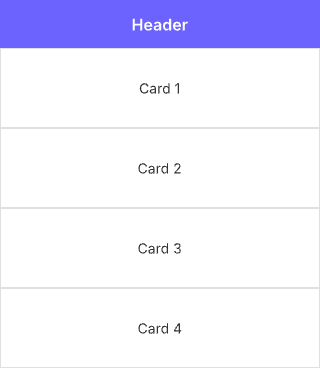
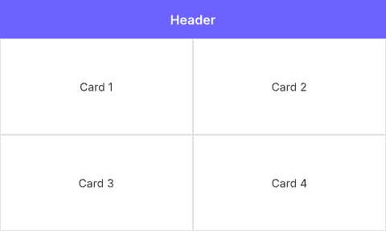
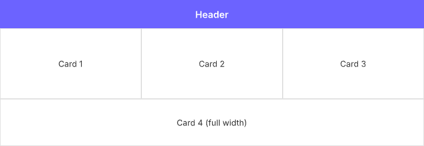

# Flutter 레이아웃 시스템 가이드

> **난이도**: 중급 | **카테고리**: fundamentals
> **선행 학습**: [WidgetFundamentals](./WidgetFundamentals.md)
> **예상 학습 시간**: 5h

Flutter의 Constraints 기반 레이아웃 원리와 고급 레이아웃 패턴을 다루는 가이드입니다.

> **학습 목표**: 이 문서를 학습하면 다음을 할 수 있습니다:
> - "Constraints go down, Sizes go up, Parent sets position" 원리를 이해하고 레이아웃 디버깅에 적용할 수 있습니다
> - Flex, Stack, Sliver 등 고급 레이아웃 패턴을 실전 UI 구현에 활용할 수 있습니다
> - 흔한 레이아웃 에러(Unbounded constraints, RenderFlex overflow)를 진단하고 해결할 수 있습니다

---

## 목차

1. [Constraints 전파 원리](#1-constraints-전파-원리)
2. [BoxConstraints 이해](#2-boxconstraints-이해)
3. [Flex 레이아웃](#3-flex-레이아웃)
4. [Stack & Positioned](#4-stack--positioned)
5. [CustomMultiChildLayout](#5-custommultichildlayout)
6. [Sliver 시스템](#6-sliver-시스템)
7. [LayoutBuilder & ConstrainedBox](#7-layoutbuilder--constrainedbox)
8. [Intrinsic 위젯](#8-intrinsic-위젯)
9. [흔한 레이아웃 에러](#9-흔한-레이아웃-에러)
10. [실전 레이아웃 패턴](#10-실전-레이아웃-패턴)

---

> **Quick Start (5분 요약)**
>
> Flutter 레이아웃의 핵심 3원칙:
> ```dart
> // 1. Constraints go down (부모 → 자식으로 제약 전달)
> Container(
>   width: 300, // 부모가 자식에게 "너는 300px 폭이어야 해" 제약
>   child: Text('Hello'),
> );
>
> // 2. Sizes go up (자식 → 부모로 크기 반환)
> // Text가 실제 렌더링된 크기를 부모에게 보고
>
> // 3. Parent sets position (부모가 자식 위치 결정)
> // Container가 Text를 배치할 좌표 결정
> ```
>
> 가장 흔한 에러와 해결법:
> ```dart
> // ❌ Unbounded width error
> Row(
>   children: [
>     TextField(), // Error: needs bounded width
>   ],
> );
>
> // ✅ 해결: Expanded로 제약 제공
> Row(
>   children: [
>     Expanded(child: TextField()),
>   ],
> );
> ```

---

## 1. Constraints 전파 원리

### 레이아웃의 3단계 법칙

Flutter 레이아웃은 다음 3단계로 동작합니다:

```
1. Constraints go down
   부모 위젯이 자식에게 "이 크기 범위 내에서 그려져야 해" 제약 전달

2. Sizes go up
   자식 위젯이 실제 렌더링된 크기를 부모에게 반환

3. Parent sets position
   부모가 자식을 배치할 위치(offset) 결정
```

### 실제 동작 예시

```dart
class ConstraintFlowExample extends StatelessWidget {
  @override
  Widget build(BuildContext context) {
    return Scaffold(
      body: Center( // 1단계: Center는 화면 전체 크기를 자식에게 전달
        child: Container(
          // 2단계: Container는 "나는 200x200이면 돼" 부모에게 반환
          width: 200,
          height: 200,
          color: Colors.blue,
          child: Align(
            alignment: Alignment.topLeft,
            child: Container(
              // 3단계: Align이 이 Container를 (0, 0) 위치에 배치
              width: 100,
              height: 100,
              color: Colors.red,
            ),
          ),
        ),
      ),
    );
  }
}
```

### 제약의 종류

| 제약 타입 | 설명 | 예시 |
|----------|------|------|
| **Tight constraints** | min == max인 제약 (정확한 크기 강제) | `BoxConstraints.tight(Size(100, 100))` |
| **Loose constraints** | min == 0인 제약 (자식이 크기 선택 가능) | `BoxConstraints.loose(Size(100, 100))` |
| **Bounded constraints** | max가 유한한 제약 | `BoxConstraints(maxWidth: 300, maxHeight: 400)` |
| **Unbounded constraints** | max가 무한인 제약 | `BoxConstraints(maxWidth: double.infinity)` |

### Tight Constraints 예시

```dart
// SizedBox는 자식에게 tight constraints 전달
SizedBox(
  width: 100,
  height: 100,
  child: Container(
    width: 200, // ⚠️ 무시됨! 부모의 tight constraint가 우선
    height: 200,
    color: Colors.green,
  ),
)
// 결과: 100x100 크기로 렌더링됨
```

### Loose Constraints 예시

```dart
// Center는 자식에게 loose constraints 전달
Center(
  child: Container(
    width: 50, // ✅ 자식이 크기 결정 가능
    height: 50,
    color: Colors.orange,
  ),
)
// 결과: 50x50 크기로 렌더링되고, Center가 중앙에 배치
```

### 제약 전파 시각화

```dart
class ConstraintVisualizer extends StatelessWidget {
  @override
  Widget build(BuildContext context) {
    return Scaffold(
      body: LayoutBuilder(
        builder: (context, constraints) {
          debugPrint('Screen constraints: $constraints');
          // 출력: BoxConstraints(0.0<=w<=392.0, 0.0<=h<=856.0)

          return Container(
            width: 300,
            height: 300,
            color: Colors.blue.shade100,
            child: LayoutBuilder(
              builder: (context, constraints) {
                debugPrint('Container constraints: $constraints');
                // 출력: BoxConstraints(w=300.0, h=300.0) - Tight!

                return Center(
                  child: LayoutBuilder(
                    builder: (context, constraints) {
                      debugPrint('Center constraints: $constraints');
                      // 출력: BoxConstraints(0.0<=w<=300.0, 0.0<=h<=300.0) - Loose!

                      return Container(
                        width: 100,
                        height: 100,
                        color: Colors.red,
                      );
                    },
                  ),
                );
              },
            ),
          );
        },
      ),
    );
  }
}
```

### 제약 우선순위 규칙

Flutter에서 제약은 항상 **부모가 우선**입니다:

```dart
// 규칙 1: 부모의 tight constraint는 절대적
SizedBox(
  width: 100,
  height: 100,
  child: Container(
    width: 500, // 무시됨
    child: Text('Tight parent wins'),
  ),
)

// 규칙 2: 부모의 max constraint를 초과할 수 없음
ConstrainedBox(
  constraints: BoxConstraints(maxWidth: 200),
  child: Container(
    width: 300, // 200으로 제한됨
    child: Text('Max constraint limits'),
  ),
)

// 규칙 3: 부모의 min constraint보다 작을 수 없음
ConstrainedBox(
  constraints: BoxConstraints(minWidth: 200),
  child: Container(
    width: 100, // 200으로 확장됨
    child: Text('Min constraint expands'),
  ),
)
```

### 제약 체인의 이해

```dart
class ConstraintChain extends StatelessWidget {
  @override
  Widget build(BuildContext context) {
    // 제약 체인: Screen → Container → Padding → Center → SizedBox → Text
    
    return Container(
      width: 300,  // Tight 300x300 제약 생성
      height: 300,
      color: Colors.blue.shade100,
      child: Padding(
        padding: EdgeInsets.all(20), // 260x260 제약으로 축소
        child: Container(
          color: Colors.green.shade100,
          child: Center( // Loose 260x260 제약 전달
            child: SizedBox(
              width: 100, // Tight 100x100 제약 생성
              height: 100,
              child: Container(
                color: Colors.red,
                child: FittedBox( // 100x100 제약 내에서 Text 스케일링
                  child: Text(
                    'Scaled Text',
                    style: TextStyle(fontSize: 50),
                  ),
                ),
              ),
            ),
          ),
        ),
      ),
    );
  }
}
```

---

## 2. BoxConstraints 이해

### BoxConstraints 구조

```dart
class BoxConstraints {
  const BoxConstraints({
    this.minWidth = 0.0,
    this.maxWidth = double.infinity,
    this.minHeight = 0.0,
    this.maxHeight = double.infinity,
  });

  final double minWidth;
  final double maxWidth;
  final double minHeight;
  final double maxHeight;
}
```

### 주요 생성자

```dart
// 1. Tight constraints (정확한 크기 강제)
BoxConstraints.tight(Size size)
// 예: BoxConstraints.tight(Size(100, 100))
// 결과: BoxConstraints(w=100.0, h=100.0)

// 2. Loose constraints (최대 크기만 제한)
BoxConstraints.loose(Size size)
// 예: BoxConstraints.loose(Size(100, 100))
// 결과: BoxConstraints(0.0<=w<=100.0, 0.0<=h<=100.0)

// 3. Expand (부모 크기에 맞춤)
BoxConstraints.expand({double? width, double? height})
// 예: BoxConstraints.expand()
// 결과: BoxConstraints(w=∞, h=∞)

// 4. TightFor (특정 축만 tight)
BoxConstraints.tightFor({double? width, double? height})
// 예: BoxConstraints.tightFor(width: 100)
// 결과: BoxConstraints(w=100.0, 0.0<=h<=∞)

// 5. TightForFinite (유한 값만 tight)
BoxConstraints.tightForFinite({
  double width = double.infinity,
  double height = double.infinity
})
```

### 제약 조합 메서드

```dart
class ConstraintCombination extends StatelessWidget {
  @override
  Widget build(BuildContext context) {
    final parentConstraints = BoxConstraints(
      minWidth: 100,
      maxWidth: 300,
      minHeight: 100,
      maxHeight: 300,
    );

    // enforce: 부모 제약을 자식에게 강제
    final enforced = parentConstraints.enforce(
      BoxConstraints(
        minWidth: 50,
        maxWidth: 500, // 부모 max를 초과 → 300으로 제한됨
        minHeight: 50,
        maxHeight: 500,
      ),
    );
    // 결과: BoxConstraints(100.0<=w<=300.0, 100.0<=h<=300.0)

    // loosen: min을 0으로 완화
    final loosened = parentConstraints.loosen();
    // 결과: BoxConstraints(0.0<=w<=300.0, 0.0<=h<=300.0)

    // tighten: 범위 좁히기
    final tightened = parentConstraints.tighten(width: 200);
    // 결과: BoxConstraints(w=200.0, 100.0<=h<=300.0)

    // constrain: Size를 제약 내로 제한
    final size = parentConstraints.constrain(Size(400, 400));
    // 결과: Size(300.0, 300.0) - max를 초과하면 max로 제한

    // constrainWidth/constrainHeight: 개별 축 제한
    final width = parentConstraints.constrainWidth(250); // 250 (범위 내)
    final height = parentConstraints.constrainHeight(500); // 300 (max로 제한)

    return Container();
  }
}
```

### 제약 판별 속성

```dart
void analyzeConstraints(BoxConstraints constraints) {
  // Tight 판별 (min == max)
  debugPrint('isTight: ${constraints.isTight}');
  // true이면 BoxConstraints(w=100.0, h=100.0) 형태

  // Normalized 판별 (유효한 제약인지)
  debugPrint('isNormalized: ${constraints.isNormalized}');
  // false면 min > max 같은 비정상 상태

  // 최대 크기
  debugPrint('biggest: ${constraints.biggest}');
  // Size(maxWidth, maxHeight)

  // 최소 크기
  debugPrint('smallest: ${constraints.smallest}');
  // Size(minWidth, minHeight)

  // Width/Height만 tight 판별
  debugPrint('hasTightWidth: ${constraints.hasTightWidth}');
  debugPrint('hasTightHeight: ${constraints.hasTightHeight}');

  // Bounded 판별 (max가 유한한지)
  debugPrint('hasBoundedWidth: ${constraints.hasBoundedWidth}');
  debugPrint('hasBoundedHeight: ${constraints.hasBoundedHeight}');

  // Infinite 판별
  debugPrint('hasInfiniteWidth: ${constraints.hasInfiniteWidth}');
  debugPrint('hasInfiniteHeight: ${constraints.hasInfiniteHeight}');
}
```

### 실전 제약 디버깅

```dart
class ConstraintDebugger extends StatelessWidget {
  @override
  Widget build(BuildContext context) {
    return Scaffold(
      appBar: AppBar(title: Text('Constraint Debugger')),
      body: LayoutBuilder(
        builder: (context, constraints) {
          return SingleChildScrollView(
            child: Column(
              crossAxisAlignment: CrossAxisAlignment.start,
              children: [
                _buildConstraintInfo('Root', constraints),

                Container(
                  width: 300,
                  height: 200,
                  color: Colors.blue.shade100,
                  child: LayoutBuilder(
                    builder: (context, innerConstraints) {
                      return Column(
                        children: [
                          _buildConstraintInfo('Container', innerConstraints),
                          Expanded(
                            child: LayoutBuilder(
                              builder: (context, expandedConstraints) {
                                return _buildConstraintInfo(
                                  'Expanded',
                                  expandedConstraints,
                                );
                              },
                            ),
                          ),
                        ],
                      );
                    },
                  ),
                ),

                SizedBox(height: 20),

                // Unbounded constraint 테스트
                Container(
                  height: 100,
                  color: Colors.green.shade100,
                  child: Row(
                    children: [
                      Expanded(
                        child: LayoutBuilder(
                          builder: (context, rowConstraints) {
                            return _buildConstraintInfo(
                              'Row child',
                              rowConstraints,
                            );
                          },
                        ),
                      ),
                    ],
                  ),
                ),
              ],
            ),
          );
        },
      ),
    );
  }

  Widget _buildConstraintInfo(String label, BoxConstraints constraints) {
    return Container(
      margin: EdgeInsets.all(8),
      padding: EdgeInsets.all(12),
      decoration: BoxDecoration(
        border: Border.all(color: Colors.grey),
        borderRadius: BorderRadius.circular(8),
      ),
      child: Column(
        crossAxisAlignment: CrossAxisAlignment.start,
        children: [
          Text(
            label,
            style: TextStyle(fontWeight: FontWeight.bold, fontSize: 16),
          ),
          SizedBox(height: 4),
          Text('minWidth: ${_formatValue(constraints.minWidth)}'),
          Text('maxWidth: ${_formatValue(constraints.maxWidth)}'),
          Text('minHeight: ${_formatValue(constraints.minHeight)}'),
          Text('maxHeight: ${_formatValue(constraints.maxHeight)}'),
          Divider(),
          Text('isTight: ${constraints.isTight}'),
          Text('hasBoundedWidth: ${constraints.hasBoundedWidth}'),
          Text('hasBoundedHeight: ${constraints.hasBoundedHeight}'),
          Text('hasTightWidth: ${constraints.hasTightWidth}'),
          Text('hasTightHeight: ${constraints.hasTightHeight}'),
        ],
      ),
    );
  }

  String _formatValue(double value) {
    if (value == double.infinity) return '∞';
    return value.toStringAsFixed(1);
  }
}
```

### 제약 변환 패턴

```dart
class ConstraintTransformations extends StatelessWidget {
  @override
  Widget build(BuildContext context) {
    return Column(
      children: [
        // 1. Tight → Loose 변환
        LayoutBuilder(
          builder: (context, tight) {
            // tight는 일반적으로 tight constraint
            final loose = tight.loosen();
            return Container(
              constraints: loose, // Loose constraint 전달
              child: Text('Can choose size'),
            );
          },
        ),

        // 2. Unbounded → Bounded 변환
        Row(
          children: [
            // Row는 가로가 unbounded
            LayoutBuilder(
              builder: (context, unbounded) {
                return ConstrainedBox(
                  constraints: BoxConstraints(
                    maxWidth: 200, // Bounded로 변환
                  ),
                  child: Text('Bounded width'),
                );
              },
            ),
          ],
        ),

        // 3. Loose → Tight 변환
        Center(
          child: SizedBox.expand( // Loose를 받아서 Tight로 변환
            child: Container(color: Colors.blue),
          ),
        ),
      ],
    );
  }
}
```

---

## 3. Flex 레이아웃

### Row와 Column 기본

```dart
class FlexBasics extends StatelessWidget {
  @override
  Widget build(BuildContext context) {
    return Scaffold(
      body: Column(
        // MainAxis: 세로 방향 (Column의 주축)
        mainAxisAlignment: MainAxisAlignment.center, // 세로 정렬
        mainAxisSize: MainAxisSize.max, // 세로 공간 전체 사용

        // CrossAxis: 가로 방향 (Column의 교차축)
        crossAxisAlignment: CrossAxisAlignment.center, // 가로 정렬

        children: [
          Container(width: 100, height: 100, color: Colors.red),
          Container(width: 100, height: 100, color: Colors.green),
          Container(width: 100, height: 100, color: Colors.blue),
        ],
      ),
    );
  }
}
```

### MainAxisAlignment 옵션

| 옵션 | 설명 | 시각화 (Row 기준) |
|------|------|------------------|
| `start` | 시작점 정렬 | `[■■■      ]` |
| `end` | 끝점 정렬 | `[      ■■■]` |
| `center` | 중앙 정렬 | `[   ■■■   ]` |
| `spaceBetween` | 양 끝 배치 + 균등 간격 | `[■  ■  ■]` |
| `spaceAround` | 균등 간격 (양 끝 간격 절반) | `[ ■ ■ ■ ]` |
| `spaceEvenly` | 완전 균등 간격 | `[ ■ ■ ■ ]` |

```dart
class MainAxisAlignmentDemo extends StatelessWidget {
  @override
  Widget build(BuildContext context) {
    return Scaffold(
      appBar: AppBar(title: Text('MainAxisAlignment Demo')),
      body: SingleChildScrollView(
        child: Column(
          children: [
            _buildRow('start', MainAxisAlignment.start),
            _buildRow('end', MainAxisAlignment.end),
            _buildRow('center', MainAxisAlignment.center),
            _buildRow('spaceBetween', MainAxisAlignment.spaceBetween),
            _buildRow('spaceAround', MainAxisAlignment.spaceAround),
            _buildRow('spaceEvenly', MainAxisAlignment.spaceEvenly),
          ],
        ),
      ),
    );
  }

  Widget _buildRow(String label, MainAxisAlignment alignment) {
    return Container(
      margin: EdgeInsets.all(8),
      height: 60,
      decoration: BoxDecoration(
        border: Border.all(color: Colors.grey),
        color: Colors.grey.shade100,
      ),
      child: Column(
        crossAxisAlignment: CrossAxisAlignment.start,
        children: [
          Padding(
            padding: EdgeInsets.all(4),
            child: Text(label, style: TextStyle(fontSize: 12)),
          ),
          Expanded(
            child: Row(
              mainAxisAlignment: alignment,
              children: [
                _box(Colors.red),
                _box(Colors.green),
                _box(Colors.blue),
              ],
            ),
          ),
        ],
      ),
    );
  }

  Widget _box(Color color) {
    return Container(width: 40, height: 40, color: color);
  }
}
```

### CrossAxisAlignment 옵션

| 옵션 | 설명 |
|------|------|
| `start` | 교차축 시작점 정렬 |
| `end` | 교차축 끝점 정렬 |
| `center` | 교차축 중앙 정렬 (기본값) |
| `stretch` | 교차축 방향으로 늘림 |
| `baseline` | 텍스트 베이스라인 정렬 |

```dart
class CrossAxisAlignmentDemo extends StatelessWidget {
  @override
  Widget build(BuildContext context) {
    return Scaffold(
      appBar: AppBar(title: Text('CrossAxisAlignment Demo')),
      body: SingleChildScrollView(
        child: Column(
          children: [
            _buildExample('start', CrossAxisAlignment.start),
            _buildExample('end', CrossAxisAlignment.end),
            _buildExample('center', CrossAxisAlignment.center),
            _buildExample('stretch', CrossAxisAlignment.stretch),
            _buildBaselineExample(),
          ],
        ),
      ),
    );
  }

  Widget _buildExample(String label, CrossAxisAlignment alignment) {
    return Container(
      margin: EdgeInsets.all(8),
      height: 120,
      decoration: BoxDecoration(
        border: Border.all(color: Colors.grey),
        color: Colors.grey.shade100,
      ),
      child: Column(
        crossAxisAlignment: CrossAxisAlignment.start,
        children: [
          Padding(
            padding: EdgeInsets.all(4),
            child: Text(label, style: TextStyle(fontSize: 12)),
          ),
          Expanded(
            child: Row(
              crossAxisAlignment: alignment,
              children: [
                Container(width: 60, height: 40, color: Colors.red),
                Container(width: 60, height: 60, color: Colors.green),
                Container(width: 60, height: 80, color: Colors.blue),
              ],
            ),
          ),
        ],
      ),
    );
  }

  Widget _buildBaselineExample() {
    return Container(
      margin: EdgeInsets.all(8),
      padding: EdgeInsets.all(8),
      decoration: BoxDecoration(
        border: Border.all(color: Colors.grey),
        color: Colors.grey.shade100,
      ),
      child: Column(
        crossAxisAlignment: CrossAxisAlignment.start,
        children: [
          Text('baseline', style: TextStyle(fontSize: 12)),
          SizedBox(height: 4),
          Row(
            crossAxisAlignment: CrossAxisAlignment.baseline,
            textBaseline: TextBaseline.alphabetic, // baseline 정렬 시 필수
            children: [
              Text('Small', style: TextStyle(fontSize: 20)),
              Text('Medium', style: TextStyle(fontSize: 30)),
              Text('Large', style: TextStyle(fontSize: 40)),
            ],
          ),
        ],
      ),
    );
  }
}
```

### Expanded vs Flexible

```dart
class ExpandedVsFlexible extends StatelessWidget {
  @override
  Widget build(BuildContext context) {
    return Scaffold(
      appBar: AppBar(title: Text('Expanded vs Flexible')),
      body: SingleChildScrollView(
        child: Column(
          crossAxisAlignment: CrossAxisAlignment.start,
          children: [
            // 1. Expanded: 남은 공간을 flex 비율로 나눠 차지 (tight)
            Padding(
              padding: EdgeInsets.all(8),
              child: Text('Expanded (FlexFit.tight)', 
                style: TextStyle(fontWeight: FontWeight.bold)),
            ),
            Container(
              height: 60,
              color: Colors.grey.shade200,
              child: Row(
                children: [
                  Expanded(
                    flex: 1, // 1/4 차지
                    child: Container(
                      color: Colors.red,
                      child: Center(child: Text('flex: 1', style: TextStyle(color: Colors.white))),
                    ),
                  ),
                  Expanded(
                    flex: 2, // 2/4 차지
                    child: Container(
                      color: Colors.green,
                      child: Center(child: Text('flex: 2', style: TextStyle(color: Colors.white))),
                    ),
                  ),
                  Expanded(
                    flex: 1, // 1/4 차지
                    child: Container(
                      color: Colors.blue,
                      child: Center(child: Text('flex: 1', style: TextStyle(color: Colors.white))),
                    ),
                  ),
                ],
              ),
            ),

            SizedBox(height: 20),

            // 2. Flexible: 남은 공간까지만 차지 (loose)
            Padding(
              padding: EdgeInsets.all(8),
              child: Text('Flexible (FlexFit.loose)', 
                style: TextStyle(fontWeight: FontWeight.bold)),
            ),
            Container(
              height: 60,
              color: Colors.grey.shade200,
              child: Row(
                children: [
                  Flexible(
                    flex: 1,
                    fit: FlexFit.loose, // 최대 flex 비율까지만 (기본값)
                    child: Container(
                      width: 50, // 50px만 사용 (flex 비율보다 작으면 작은 값 사용)
                      color: Colors.orange,
                      child: Center(child: Text('50px', style: TextStyle(fontSize: 10))),
                    ),
                  ),
                  Flexible(
                    flex: 2,
                    fit: FlexFit.tight, // flex 비율만큼 강제 (Expanded와 동일)
                    child: Container(
                      color: Colors.purple,
                      child: Center(child: Text('tight', style: TextStyle(color: Colors.white))),
                    ),
                  ),
                  Flexible(
                    flex: 1,
                    fit: FlexFit.loose,
                    child: Container(
                      width: 80,
                      color: Colors.teal,
                      child: Center(child: Text('80px', style: TextStyle(fontSize: 10, color: Colors.white))),
                    ),
                  ),
                ],
              ),
            ),

            SizedBox(height: 20),

            // 3. 비교: 고정 크기 vs Expanded
            Padding(
              padding: EdgeInsets.all(8),
              child: Text('Mixed: Fixed + Expanded', 
                style: TextStyle(fontWeight: FontWeight.bold)),
            ),
            Container(
              height: 60,
              color: Colors.grey.shade200,
              child: Row(
                children: [
                  Container(
                    width: 80,
                    color: Colors.red,
                    child: Center(child: Text('80px', style: TextStyle(color: Colors.white))),
                  ),
                  Expanded(
                    child: Container(
                      color: Colors.green,
                      child: Center(child: Text('Expanded', style: TextStyle(color: Colors.white))),
                    ),
                  ),
                  Container(
                    width: 80,
                    color: Colors.blue,
                    child: Center(child: Text('80px', style: TextStyle(color: Colors.white))),
                  ),
                ],
              ),
            ),
          ],
        ),
      ),
    );
  }
}
```

### Spacer 위젯

```dart
class SpacerExample extends StatelessWidget {
  @override
  Widget build(BuildContext context) {
    return Scaffold(
      appBar: AppBar(title: Text('Spacer Demo')),
      body: Column(
        children: [
          // Spacer는 Expanded(child: SizedBox())와 동일
          Container(
            height: 60,
            color: Colors.grey.shade200,
            child: Row(
              children: [
                Container(width: 50, height: 50, color: Colors.red),
                Spacer(flex: 1), // 1배 공간
                Container(width: 50, height: 50, color: Colors.green),
                Spacer(flex: 2), // 2배 공간
                Container(width: 50, height: 50, color: Colors.blue),
              ],
            ),
          ),

          SizedBox(height: 20),

          // 실전 사용: 좌우 정렬
          Container(
            height: 60,
            padding: EdgeInsets.symmetric(horizontal: 16),
            color: Colors.blue.shade100,
            child: Row(
              children: [
                Icon(Icons.menu),
                SizedBox(width: 16),
                Text('Title', style: TextStyle(fontSize: 20)),
                Spacer(), // 남은 공간 차지
                Icon(Icons.search),
                SizedBox(width: 16),
                Icon(Icons.more_vert),
              ],
            ),
          ),
        ],
      ),
    );
  }
}
```

### 복잡한 Flex 레이아웃

```dart
class ComplexFlexLayout extends StatelessWidget {
  @override
  Widget build(BuildContext context) {
    return Scaffold(
      body: Column(
        children: [
          // 헤더 (고정 높이)
          Container(
            height: 100,
            color: Colors.blue,
            child: Row(
              children: [
                IconButton(
                  icon: Icon(Icons.menu, color: Colors.white),
                  onPressed: () {},
                ),
                Expanded(
                  child: Text(
                    'Complex Layout',
                    textAlign: TextAlign.center,
                    style: TextStyle(color: Colors.white, fontSize: 20),
                  ),
                ),
                IconButton(
                  icon: Icon(Icons.search, color: Colors.white),
                  onPressed: () {},
                ),
              ],
            ),
          ),

          // 본문 (남은 공간 전체)
          Expanded(
            child: Row(
              children: [
                // 사이드바 (고정 폭)
                Container(
                  width: 80,
                  color: Colors.grey.shade300,
                  child: Column(
                    children: [
                      _sidebarItem(Icons.home, 'Home'),
                      _sidebarItem(Icons.person, 'Profile'),
                      _sidebarItem(Icons.settings, 'Settings'),
                      Spacer(),
                      _sidebarItem(Icons.logout, 'Logout'),
                    ],
                  ),
                ),

                // 메인 컨텐츠 (남은 공간)
                Expanded(
                  child: Container(
                    color: Colors.white,
                    padding: EdgeInsets.all(16),
                    child: Column(
                      crossAxisAlignment: CrossAxisAlignment.start,
                      children: [
                        Text(
                          'Main Content',
                          style: TextStyle(fontSize: 24, fontWeight: FontWeight.bold),
                        ),
                        SizedBox(height: 16),
                        Expanded(
                          child: GridView.count(
                            crossAxisCount: 2,
                            mainAxisSpacing: 16,
                            crossAxisSpacing: 16,
                            children: List.generate(
                              6,
                              (index) => Card(
                                color: Colors.primaries[index % Colors.primaries.length],
                                child: Center(
                                  child: Text(
                                    'Card ${index + 1}',
                                    style: TextStyle(color: Colors.white, fontSize: 18),
                                  ),
                                ),
                              ),
                            ),
                          ),
                        ),
                      ],
                    ),
                  ),
                ),
              ],
            ),
          ),

          // 푸터 (고정 높이)
          Container(
            height: 60,
            color: Colors.grey.shade800,
            child: Row(
              mainAxisAlignment: MainAxisAlignment.spaceEvenly,
              children: [
                _footerButton(Icons.home, 'Home'),
                _footerButton(Icons.search, 'Search'),
                _footerButton(Icons.notifications, 'Alerts'),
                _footerButton(Icons.person, 'Profile'),
              ],
            ),
          ),
        ],
      ),
    );
  }

  Widget _sidebarItem(IconData icon, String label) {
    return Container(
      margin: EdgeInsets.all(8),
      child: Column(
        mainAxisSize: MainAxisSize.min,
        children: [
          Icon(icon, size: 28),
          SizedBox(height: 4),
          Text(label, style: TextStyle(fontSize: 10)),
        ],
      ),
    );
  }

  Widget _footerButton(IconData icon, String label) {
    return Column(
      mainAxisSize: MainAxisSize.min,
      children: [
        Icon(icon, color: Colors.white),
        SizedBox(height: 4),
        Text(label, style: TextStyle(color: Colors.white, fontSize: 12)),
      ],
    );
  }
}
```

### MainAxisSize의 영향

```dart
class MainAxisSizeDemo extends StatelessWidget {
  @override
  Widget build(BuildContext context) {
    return Scaffold(
      appBar: AppBar(title: Text('MainAxisSize Demo')),
      body: Center(
        child: Column(
          mainAxisAlignment: MainAxisAlignment.center,
          children: [
            // MainAxisSize.max (기본값): 가능한 최대 공간 차지
            Expanded(
              child: Container(
                color: Colors.blue.shade100,
                child: Column(
                  mainAxisSize: MainAxisSize.max,
                  children: [
                    Text('MainAxisSize.max'),
                    Container(width: 100, height: 50, color: Colors.red),
                    Container(width: 100, height: 50, color: Colors.green),
                  ],
                ),
              ),
            ),

            SizedBox(height: 20),

            // MainAxisSize.min: 자식 크기만큼만 차지
            Expanded(
              child: Container(
                color: Colors.green.shade100,
                child: Column(
                  mainAxisSize: MainAxisSize.min,
                  children: [
                    Text('MainAxisSize.min'),
                    Container(width: 100, height: 50, color: Colors.red),
                    Container(width: 100, height: 50, color: Colors.green),
                  ],
                ),
              ),
            ),
          ],
        ),
      ),
    );
  }
}
```

---

## 4. Stack & Positioned

### Stack 기본

```dart
class StackBasics extends StatelessWidget {
  @override
  Widget build(BuildContext context) {
    return Scaffold(
      appBar: AppBar(title: Text('Stack Basics')),
      body: Center(
        child: SizedBox(
          width: 300,
          height: 300,
          child: Stack(
            // alignment: 정렬 기준점 (기본값: Alignment.topLeft)
            alignment: Alignment.center,

            // fit: 자식 크기 조정 방식
            // - loose: 자식이 크기 선택 (기본값)
            // - expand: Stack 크기로 확장
            // - passthrough: 부모 제약 그대로 전달
            fit: StackFit.loose,

            // clipBehavior: 넘치는 자식 잘라내기
            clipBehavior: Clip.none, // none, hardEdge, antiAlias, antiAliasWithSaveLayer

            children: [
              // 첫 번째 자식이 바닥에 깔림
              Container(
                width: 300,
                height: 300,
                color: Colors.blue.shade200,
                child: Center(child: Text('Background')),
              ),

              // 두 번째 자식이 위에 쌓임
              Container(
                width: 200,
                height: 200,
                color: Colors.red.shade200,
                child: Center(child: Text('Middle')),
              ),

              // 세 번째 자식이 최상단
              Container(
                width: 100,
                height: 100,
                color: Colors.green.shade200,
                child: Center(child: Text('Top')),
              ),
            ],
          ),
        ),
      ),
    );
  }
}
```

### StackFit 비교

```dart
class StackFitDemo extends StatelessWidget {
  @override
  Widget build(BuildContext context) {
    return Scaffold(
      appBar: AppBar(title: Text('StackFit Demo')),
      body: Column(
        children: [
          // StackFit.loose: 자식이 크기 선택
          _buildStackExample('StackFit.loose', StackFit.loose),

          // StackFit.expand: Stack 크기로 확장
          _buildStackExample('StackFit.expand', StackFit.expand),

          // StackFit.passthrough: 부모 제약 그대로 전달
          _buildStackExample('StackFit.passthrough', StackFit.passthrough),
        ],
      ),
    );
  }

  Widget _buildStackExample(String label, StackFit fit) {
    return Expanded(
      child: Container(
        margin: EdgeInsets.all(8),
        decoration: BoxDecoration(
          border: Border.all(color: Colors.grey),
        ),
        child: Column(
          children: [
            Padding(
              padding: EdgeInsets.all(8),
              child: Text(label, style: TextStyle(fontWeight: FontWeight.bold)),
            ),
            Expanded(
              child: Stack(
                fit: fit,
                alignment: Alignment.center,
                children: [
                  Container(
                    color: Colors.blue.withValues(alpha: 0.3),
                    child: Center(child: Text('Child 1')),
                  ),
                  Container(
                    width: 100,
                    height: 100,
                    color: Colors.red.withValues(alpha: 0.3),
                    child: Center(child: Text('Child 2')),
                  ),
                ],
              ),
            ),
          ],
        ),
      ),
    );
  }
}
```

### Positioned 위젯

```dart
class PositionedExample extends StatelessWidget {
  @override
  Widget build(BuildContext context) {
    return Scaffold(
      appBar: AppBar(title: Text('Positioned Example')),
      body: Stack(
        children: [
          // 배경 (Positioned 없으면 Stack의 alignment 기준으로 배치)
          Container(
            width: double.infinity,
            height: double.infinity,
            color: Colors.grey.shade300,
          ),

          // 왼쪽 상단
          Positioned(
            left: 0,
            top: 0,
            child: Container(
              width: 100,
              height: 100,
              color: Colors.red,
              child: Center(child: Text('LT', style: TextStyle(color: Colors.white))),
            ),
          ),

          // 오른쪽 상단
          Positioned(
            right: 0,
            top: 0,
            child: Container(
              width: 100,
              height: 100,
              color: Colors.green,
              child: Center(child: Text('RT', style: TextStyle(color: Colors.white))),
            ),
          ),

          // 왼쪽 하단
          Positioned(
            left: 0,
            bottom: 0,
            child: Container(
              width: 100,
              height: 100,
              color: Colors.blue,
              child: Center(child: Text('LB', style: TextStyle(color: Colors.white))),
            ),
          ),

          // 오른쪽 하단
          Positioned(
            right: 0,
            bottom: 0,
            child: Container(
              width: 100,
              height: 100,
              color: Colors.orange,
              child: Center(child: Text('RB', style: TextStyle(color: Colors.white))),
            ),
          ),

          // 중앙 (left/right/top/bottom으로 늘림)
          Positioned(
            left: 50,
            right: 50,
            top: 50,
            bottom: 50,
            child: Container(
              color: Colors.purple.withValues(alpha: 0.5),
              child: Center(
                child: Text(
                  'Stretched',
                  style: TextStyle(color: Colors.white, fontSize: 20),
                ),
              ),
            ),
          ),

          // Positioned.fill (전체 채우기 = left:0, right:0, top:0, bottom:0)
          Positioned.fill(
            child: Container(
              color: Colors.black.withValues(alpha: 0.3),
              child: Center(
                child: Text(
                  'Overlay',
                  style: TextStyle(color: Colors.white, fontSize: 24, fontWeight: FontWeight.bold),
                ),
              ),
            ),
          ),
        ],
      ),
    );
  }
}
```

### Positioned.directional

```dart
class PositionedDirectionalExample extends StatelessWidget {
  @override
  Widget build(BuildContext context) {
    return Scaffold(
      appBar: AppBar(title: Text('Positioned.directional')),
      body: Column(
        children: [
          // LTR (Left-to-Right) 언어
          Expanded(
            child: _buildDirectionalStack(TextDirection.ltr, 'LTR'),
          ),

          // RTL (Right-to-Left) 언어 (아랍어, 히브리어 등)
          Expanded(
            child: _buildDirectionalStack(TextDirection.rtl, 'RTL'),
          ),
        ],
      ),
    );
  }

  Widget _buildDirectionalStack(TextDirection direction, String label) {
    return Container(
      margin: EdgeInsets.all(8),
      child: Stack(
        children: [
          Container(color: Colors.grey.shade300),

          // start = LTR에서는 left, RTL에서는 right
          Positioned.directional(
            textDirection: direction,
            start: 20,
            top: 20,
            child: Container(
              width: 100,
              height: 80,
              color: Colors.red,
              child: Center(
                child: Text(
                  'START\n($label)',
                  textAlign: TextAlign.center,
                  style: TextStyle(color: Colors.white),
                ),
              ),
            ),
          ),

          // end = LTR에서는 right, RTL에서는 left
          Positioned.directional(
            textDirection: direction,
            end: 20,
            top: 20,
            child: Container(
              width: 100,
              height: 80,
              color: Colors.blue,
              child: Center(
                child: Text(
                  'END\n($label)',
                  textAlign: TextAlign.center,
                  style: TextStyle(color: Colors.white),
                ),
              ),
            ),
          ),
        ],
      ),
    );
  }
}
```

### IndexedStack

```dart
class IndexedStackExample extends StatefulWidget {
  @override
  _IndexedStackExampleState createState() => _IndexedStackExampleState();
}

class _IndexedStackExampleState extends State<IndexedStackExample> {
  int _currentIndex = 0;

  @override
  Widget build(BuildContext context) {
    return Scaffold(
      appBar: AppBar(title: Text('IndexedStack Demo')),
      body: Column(
        children: [
          // IndexedStack: 한 번에 하나만 보여주는 Stack
          // 모든 자식이 메모리에 유지됨 (상태 보존)
          Expanded(
            child: IndexedStack(
              index: _currentIndex,
              children: [
                _buildTab(Colors.red, 'Tab 1', Icons.home),
                _buildTab(Colors.green, 'Tab 2', Icons.search),
                _buildTab(Colors.blue, 'Tab 3', Icons.person),
              ],
            ),
          ),

          // 탭 버튼
          Container(
            color: Colors.grey.shade200,
            child: Row(
              mainAxisAlignment: MainAxisAlignment.spaceEvenly,
              children: [
                _buildTabButton(0, Icons.home, 'Tab 1'),
                _buildTabButton(1, Icons.search, 'Tab 2'),
                _buildTabButton(2, Icons.person, 'Tab 3'),
              ],
            ),
          ),
        ],
      ),
    );
  }

  Widget _buildTab(Color color, String label, IconData icon) {
    return Container(
      color: color.withValues(alpha: 0.3),
      child: Center(
        child: Column(
          mainAxisSize: MainAxisSize.min,
          children: [
            Icon(icon, size: 64, color: color),
            SizedBox(height: 16),
            Text(
              label,
              style: TextStyle(fontSize: 24, fontWeight: FontWeight.bold),
            ),
          ],
        ),
      ),
    );
  }

  Widget _buildTabButton(int index, IconData icon, String label) {
    final isSelected = _currentIndex == index;
    return InkWell(
      onTap: () => setState(() => _currentIndex = index),
      child: Container(
        padding: EdgeInsets.symmetric(vertical: 12, horizontal: 24),
        decoration: BoxDecoration(
          border: Border(
            top: BorderSide(
              color: isSelected ? Colors.blue : Colors.transparent,
              width: 3,
            ),
          ),
        ),
        child: Column(
          mainAxisSize: MainAxisSize.min,
          children: [
            Icon(icon, color: isSelected ? Colors.blue : Colors.grey),
            SizedBox(height: 4),
            Text(
              label,
              style: TextStyle(
                fontSize: 12,
                color: isSelected ? Colors.blue : Colors.grey,
              ),
            ),
          ],
        ),
      ),
    );
  }
}
```

### 실전: 플로팅 액션 버튼 오버레이

```dart
class FloatingOverlay extends StatelessWidget {
  @override
  Widget build(BuildContext context) {
    return Scaffold(
      appBar: AppBar(title: Text('Floating Overlay')),
      body: Stack(
        children: [
          // 배경 컨텐츠
          ListView.builder(
            itemCount: 20,
            itemBuilder: (context, index) {
              return ListTile(
                leading: CircleAvatar(child: Text('$index')),
                title: Text('Item $index'),
                subtitle: Text('Subtitle for item $index'),
              );
            },
          ),

          // 우측 하단 FAB
          Positioned(
            right: 16,
            bottom: 16,
            child: FloatingActionButton(
              onPressed: () {},
              child: Icon(Icons.add),
              heroTag: 'fab1',
            ),
          ),

          // 좌측 하단 속도계 버튼
          Positioned(
            left: 16,
            bottom: 16,
            child: SpeedDial(),
          ),
        ],
      ),
    );
  }
}

class SpeedDial extends StatefulWidget {
  @override
  _SpeedDialState createState() => _SpeedDialState();
}

class _SpeedDialState extends State<SpeedDial> with SingleTickerProviderStateMixin {
  bool _isOpen = false;
  late AnimationController _controller;
  late Animation<double> _animation;

  @override
  void initState() {
    super.initState();
    _controller = AnimationController(
      duration: Duration(milliseconds: 200),
      vsync: this,
    );
    _animation = CurvedAnimation(
      parent: _controller,
      curve: Curves.easeInOut,
    );
  }

  @override
  void dispose() {
    _controller.dispose();
    super.dispose();
  }

  void _toggle() {
    setState(() {
      _isOpen = !_isOpen;
      if (_isOpen) {
        _controller.forward();
      } else {
        _controller.reverse();
      }
    });
  }

  @override
  Widget build(BuildContext context) {
    return Column(
      mainAxisSize: MainAxisSize.min,
      crossAxisAlignment: CrossAxisAlignment.start,
      children: [
        ScaleTransition(
          scale: _animation,
          child: Column(
            mainAxisSize: MainAxisSize.min,
            crossAxisAlignment: CrossAxisAlignment.start,
            children: [
              _buildOption(Icons.edit, 'Edit', Colors.blue),
              SizedBox(height: 8),
              _buildOption(Icons.share, 'Share', Colors.green),
              SizedBox(height: 8),
              _buildOption(Icons.delete, 'Delete', Colors.red),
              SizedBox(height: 8),
            ],
          ),
        ),
        FloatingActionButton(
          onPressed: _toggle,
          child: AnimatedRotation(
            turns: _isOpen ? 0.125 : 0, // 45도 회전
            duration: Duration(milliseconds: 200),
            child: Icon(_isOpen ? Icons.close : Icons.menu),
          ),
          heroTag: 'speedDial',
        ),
      ],
    );
  }

  Widget _buildOption(IconData icon, String label, Color color) {
    return Row(
      mainAxisSize: MainAxisSize.min,
      children: [
        Container(
          padding: EdgeInsets.symmetric(horizontal: 12, vertical: 6),
          decoration: BoxDecoration(
            color: Colors.white,
            borderRadius: BorderRadius.circular(4),
            boxShadow: [
              BoxShadow(color: Colors.black26, blurRadius: 4),
            ],
          ),
          child: Text(label, style: TextStyle(fontSize: 14)),
        ),
        SizedBox(width: 8),
        FloatingActionButton.small(
          onPressed: () {
            ScaffoldMessenger.of(context).showSnackBar(
              SnackBar(content: Text('$label pressed')),
            );
          },
          backgroundColor: color,
          child: Icon(icon),
          heroTag: 'option_$label',
        ),
      ],
    );
  }
}
```

---

## 5. CustomMultiChildLayout

### CustomMultiChildLayout 기본

```dart
class CustomLayoutExample extends StatelessWidget {
  @override
  Widget build(BuildContext context) {
    return Scaffold(
      appBar: AppBar(title: Text('CustomMultiChildLayout')),
      body: CustomMultiChildLayout(
        delegate: MyLayoutDelegate(),
        children: [
          LayoutId(
            id: 'header',
            child: Container(
              color: Colors.blue,
              child: Center(
                child: Text(
                  'Header',
                  style: TextStyle(color: Colors.white, fontSize: 20),
                ),
              ),
            ),
          ),
          LayoutId(
            id: 'content',
            child: Container(
              color: Colors.white,
              child: Center(child: Text('Content')),
            ),
          ),
          LayoutId(
            id: 'footer',
            child: Container(
              color: Colors.grey,
              child: Center(
                child: Text(
                  'Footer',
                  style: TextStyle(color: Colors.white),
                ),
              ),
            ),
          ),
        ],
      ),
    );
  }
}

class MyLayoutDelegate extends MultiChildLayoutDelegate {
  @override
  void performLayout(Size size) {
    final headerHeight = 100.0;
    final footerHeight = 60.0;

    // 1. Header 레이아웃
    if (hasChild('header')) {
      layoutChild(
        'header',
        BoxConstraints.tightFor(width: size.width, height: headerHeight),
      );
      positionChild('header', Offset(0, 0));
    }

    // 2. Footer 레이아웃
    if (hasChild('footer')) {
      layoutChild(
        'footer',
        BoxConstraints.tightFor(width: size.width, height: footerHeight),
      );
      positionChild('footer', Offset(0, size.height - footerHeight));
    }

    // 3. Content 레이아웃 (남은 공간)
    if (hasChild('content')) {
      final contentHeight = size.height - headerHeight - footerHeight;
      layoutChild(
        'content',
        BoxConstraints.tightFor(width: size.width, height: contentHeight),
      );
      positionChild('content', Offset(0, headerHeight));
    }
  }

  @override
  bool shouldRelayout(covariant MultiChildLayoutDelegate oldDelegate) {
    return false;
  }
}
```

### 고급: 반응형 그리드 레이아웃

```dart
class ResponsiveGridDelegate extends MultiChildLayoutDelegate {
  ResponsiveGridDelegate({
    required this.columnCount,
    this.spacing = 8.0,
  });

  final int columnCount;
  final double spacing;

  @override
  void performLayout(Size size) {
    final columnWidth = (size.width - spacing * (columnCount - 1)) / columnCount;

    int row = 0;
    int col = 0;

    for (int i = 0; hasChild(i); i++) {
      // 자식 크기 측정
      layoutChild(
        i,
        BoxConstraints.tightFor(width: columnWidth, height: columnWidth),
      );

      // 위치 계산
      final x = col * (columnWidth + spacing);
      final y = row * (columnWidth + spacing);
      positionChild(i, Offset(x, y));

      // 다음 위치
      col++;
      if (col >= columnCount) {
        col = 0;
        row++;
      }
    }
  }

  @override
  bool shouldRelayout(ResponsiveGridDelegate oldDelegate) {
    return oldDelegate.columnCount != columnCount ||
           oldDelegate.spacing != spacing;
  }
}

class ResponsiveGridExample extends StatelessWidget {
  @override
  Widget build(BuildContext context) {
    return Scaffold(
      appBar: AppBar(title: Text('Responsive Grid')),
      body: LayoutBuilder(
        builder: (context, constraints) {
          // 화면 폭에 따라 컬럼 수 조정
          int columnCount;
          if (constraints.maxWidth < 600) {
            columnCount = 2; // 모바일
          } else if (constraints.maxWidth < 900) {
            columnCount = 3; // 태블릿
          } else {
            columnCount = 4; // 데스크톱
          }

          // ⚠️ CustomMultiChildLayout은 intrinsic size를 지원하지 않으므로
          // SingleChildScrollView 안에서는 반드시 SizedBox로 명시적 높이를 제공하세요.
          return SingleChildScrollView(
            padding: EdgeInsets.all(8),
            child: SizedBox(
              height: (120.0 * (12 / columnCount).ceil()) + (8.0 * ((12 / columnCount).ceil() - 1)),
              child: CustomMultiChildLayout(
                delegate: ResponsiveGridDelegate(columnCount: columnCount),
              children: List.generate(
                12,
                (index) => LayoutId(
                  id: index,
                  child: Container(
                    decoration: BoxDecoration(
                      color: Colors.primaries[index % Colors.primaries.length],
                      borderRadius: BorderRadius.circular(8),
                    ),
                    child: Center(
                      child: Text(
                        '$index',
                        style: TextStyle(
                          color: Colors.white,
                          fontSize: 32,
                          fontWeight: FontWeight.bold,
                        ),
                      ),
                    ),
                  ),
                ),
              ),
              ),
            ),
          );
        },
      ),
    );
  }
}
```

### Masonry 레이아웃

```dart
class MasonryLayoutDelegate extends MultiChildLayoutDelegate {
  MasonryLayoutDelegate({
    required this.columnCount,
    required this.spacing,
    required this.itemHeights,
  });

  final int columnCount;
  final double spacing;
  final List<double> itemHeights;

  @override
  void performLayout(Size size) {
    final columnWidth = (size.width - spacing * (columnCount - 1)) / columnCount;
    
    // 각 컬럼의 현재 높이 추적
    final columnHeights = List.filled(columnCount, 0.0);

    for (int i = 0; i < itemHeights.length && hasChild(i); i++) {
      // 가장 짧은 컬럼 찾기
      int shortestColumn = 0;
      double shortestHeight = columnHeights[0];
      for (int col = 1; col < columnCount; col++) {
        if (columnHeights[col] < shortestHeight) {
          shortestColumn = col;
          shortestHeight = columnHeights[col];
        }
      }

      // 자식 레이아웃
      layoutChild(
        i,
        BoxConstraints.tightFor(
          width: columnWidth,
          height: itemHeights[i],
        ),
      );

      // 위치 계산
      final x = shortestColumn * (columnWidth + spacing);
      final y = columnHeights[shortestColumn];
      positionChild(i, Offset(x, y));

      // 컬럼 높이 업데이트
      columnHeights[shortestColumn] += itemHeights[i] + spacing;
    }
  }

  @override
  bool shouldRelayout(MasonryLayoutDelegate oldDelegate) {
    return oldDelegate.columnCount != columnCount ||
           oldDelegate.spacing != spacing ||
           oldDelegate.itemHeights != itemHeights;
  }
}

class MasonryLayoutExample extends StatelessWidget {
  final itemHeights = [120.0, 200.0, 150.0, 180.0, 100.0, 220.0, 
                       140.0, 190.0, 160.0, 130.0, 210.0, 170.0];

  @override
  Widget build(BuildContext context) {
    return Scaffold(
      appBar: AppBar(title: Text('Masonry Layout')),
      // ⚠️ CustomMultiChildLayout은 intrinsic size를 지원하지 않으므로
      // SingleChildScrollView 안에서는 반드시 SizedBox로 명시적 높이를 제공하세요.
      body: SingleChildScrollView(
        padding: EdgeInsets.all(8),
        child: SizedBox(
          height: 1200, // delegate가 계산할 총 높이를 명시적으로 제공
          child: CustomMultiChildLayout(
            delegate: MasonryLayoutDelegate(
              columnCount: 2,
              spacing: 8,
              itemHeights: itemHeights,
            ),
            children: List.generate(
              itemHeights.length,
              (index) => LayoutId(
                id: index,
                child: Card(
                  color: Colors.primaries[index % Colors.primaries.length],
                  child: Center(
                    child: Text(
                      'Item $index\n${itemHeights[index].toInt()}px',
                      textAlign: TextAlign.center,
                      style: TextStyle(color: Colors.white, fontSize: 16),
                    ),
                  ),
                ),
              ),
            ),
          ),
        ),
      ),
    );
  }
}
```

---

## 6. Sliver 시스템

### CustomScrollView 기본

```dart
class SliverBasics extends StatelessWidget {
  @override
  Widget build(BuildContext context) {
    return Scaffold(
      body: CustomScrollView(
        slivers: [
          // 1. SliverAppBar (스크롤 시 축소되는 앱바)
          SliverAppBar(
            expandedHeight: 200,
            floating: false,
            pinned: true,
            flexibleSpace: FlexibleSpaceBar(
              title: Text('Sliver Demo'),
              background: Image.network(
                'https://picsum.photos/400/200',
                fit: BoxFit.cover,
              ),
            ),
          ),

          // 2. SliverList
          SliverList(
            delegate: SliverChildBuilderDelegate(
              (context, index) => ListTile(
                leading: CircleAvatar(child: Text('$index')),
                title: Text('List Item $index'),
                subtitle: Text('Subtitle $index'),
              ),
              childCount: 10,
            ),
          ),

          // 3. SliverGrid
          SliverPadding(
            padding: EdgeInsets.all(16),
            sliver: SliverGrid(
              gridDelegate: SliverGridDelegateWithFixedCrossAxisCount(
                crossAxisCount: 2,
                mainAxisSpacing: 10,
                crossAxisSpacing: 10,
                childAspectRatio: 1,
              ),
              delegate: SliverChildBuilderDelegate(
                (context, index) {
                  return Container(
                    decoration: BoxDecoration(
                      color: Colors.primaries[index % Colors.primaries.length],
                      borderRadius: BorderRadius.circular(8),
                    ),
                    child: Center(
                      child: Text(
                        'Grid $index',
                        style: TextStyle(color: Colors.white, fontSize: 18),
                      ),
                    ),
                  );
                },
                childCount: 6,
              ),
            ),
          ),

          // 4. SliverToBoxAdapter (일반 위젯을 Sliver로 변환)
          SliverToBoxAdapter(
            child: Container(
              height: 100,
              margin: EdgeInsets.all(16),
              decoration: BoxDecoration(
                color: Colors.amber,
                borderRadius: BorderRadius.circular(8),
              ),
              child: Center(
                child: Text(
                  'Regular Widget',
                  style: TextStyle(fontSize: 20, fontWeight: FontWeight.bold),
                ),
              ),
            ),
          ),

          // 5. SliverFillRemaining (남은 공간 채우기)
          SliverFillRemaining(
            hasScrollBody: false,
            child: Container(
              color: Colors.blue.shade100,
              child: Center(
                child: Text(
                  'Fill Remaining',
                  style: TextStyle(fontSize: 18),
                ),
              ),
            ),
          ),
        ],
      ),
    );
  }
}
```

### SliverAppBar 옵션

| 속성 | 설명 | 기본값 |
|------|------|--------|
| `floating` | 스크롤 다운 시 즉시 나타남 | false |
| `pinned` | 최소 높이로 고정 | false |
| `snap` | floating과 함께 사용, 완전히 나타나거나 숨김 | false |
| `expandedHeight` | 확장된 높이 | null |
| `collapsedHeight` | 축소된 높이 | kToolbarHeight (56) |
| `stretch` | 오버스크롤 시 늘어남 | false |

> **참고**: 아래 예제는 SliverAppBar의 다양한 옵션을 비교하기 위한 학습용 코드입니다. 실전에서는 하나의 CustomScrollView에 하나의 SliverAppBar만 사용합니다.

```dart
class SliverAppBarVariations extends StatelessWidget {
  @override
  Widget build(BuildContext context) {
    return Scaffold(
      body: CustomScrollView(
        slivers: [
          // 1. Pinned (고정)
          SliverAppBar(
            pinned: true,
            expandedHeight: 200,
            flexibleSpace: FlexibleSpaceBar(
              title: Text('Pinned AppBar'),
              background: Container(
                decoration: BoxDecoration(
                  gradient: LinearGradient(
                    colors: [Colors.blue, Colors.purple],
                  ),
                ),
              ),
            ),
          ),

          SliverToBoxAdapter(child: SizedBox(height: 20)),
          SliverToBoxAdapter(
            child: Padding(
              padding: EdgeInsets.all(16),
              child: Text(
                'Floating AppBar:',
                style: TextStyle(fontSize: 18, fontWeight: FontWeight.bold),
              ),
            ),
          ),

          // 2. Floating (떠있는)
          SliverAppBar(
            floating: true,
            expandedHeight: 200,
            flexibleSpace: FlexibleSpaceBar(
              title: Text('Floating'),
              background: Container(
                decoration: BoxDecoration(
                  gradient: LinearGradient(
                    colors: [Colors.green, Colors.teal],
                  ),
                ),
              ),
            ),
          ),

          SliverToBoxAdapter(child: SizedBox(height: 20)),
          SliverToBoxAdapter(
            child: Padding(
              padding: EdgeInsets.all(16),
              child: Text(
                'Snap AppBar:',
                style: TextStyle(fontSize: 18, fontWeight: FontWeight.bold),
              ),
            ),
          ),

          // 3. Floating + Snap (즉시 펼침/접힘)
          SliverAppBar(
            floating: true,
            snap: true,
            expandedHeight: 200,
            flexibleSpace: FlexibleSpaceBar(
              title: Text('Snap'),
              background: Container(
                decoration: BoxDecoration(
                  gradient: LinearGradient(
                    colors: [Colors.orange, Colors.red],
                  ),
                ),
              ),
            ),
          ),

          // 리스트
          SliverList(
            delegate: SliverChildBuilderDelegate(
              (context, index) => ListTile(
                leading: CircleAvatar(child: Text('$index')),
                title: Text('Item $index'),
              ),
              childCount: 50,
            ),
          ),
        ],
      ),
    );
  }
}
```

### SliverPersistentHeader

```dart
class SliverPersistentHeaderExample extends StatelessWidget {
  @override
  Widget build(BuildContext context) {
    return Scaffold(
      body: CustomScrollView(
        slivers: [
          SliverPersistentHeader(
            pinned: true,
            delegate: MySliverHeaderDelegate(
              minHeight: 60,
              maxHeight: 200,
            ),
          ),

          SliverList(
            delegate: SliverChildBuilderDelegate(
              (context, index) => ListTile(
                leading: CircleAvatar(child: Text('$index')),
                title: Text('Item $index'),
                subtitle: Text('Subtitle for item $index'),
              ),
              childCount: 50,
            ),
          ),
        ],
      ),
    );
  }
}

class MySliverHeaderDelegate extends SliverPersistentHeaderDelegate {
  MySliverHeaderDelegate({
    required this.minHeight,
    required this.maxHeight,
  });

  final double minHeight;
  final double maxHeight;

  @override
  Widget build(BuildContext context, double shrinkOffset, bool overlapsContent) {
    // shrinkOffset: 0 (maxHeight) ~ (maxHeight - minHeight)
    final progress = (shrinkOffset / (maxHeight - minHeight)).clamp(0.0, 1.0);

    return Container(
      decoration: BoxDecoration(
        color: Color.lerp(Colors.blue, Colors.red, progress),
        boxShadow: overlapsContent
            ? [BoxShadow(color: Colors.black26, blurRadius: 4)]
            : null,
      ),
      child: Stack(
        fit: StackFit.expand,
        children: [
          // 배경 이미지 (스크롤 시 페이드아웃)
          Opacity(
            opacity: 1 - progress,
            child: Image.network(
              'https://picsum.photos/400/200',
              fit: BoxFit.cover,
            ),
          ),

          // 타이틀 (스크롤 시 위로 이동 + 크기 변화)
          Positioned(
            left: 16,
            bottom: 16 + (minHeight - 60) * (1 - progress),
            child: Text(
              'Dynamic Header',
              style: TextStyle(
                color: Colors.white,
                fontSize: 24 + 16 * (1 - progress),
                fontWeight: FontWeight.bold,
                shadows: [
                  Shadow(color: Colors.black54, blurRadius: 4),
                ],
              ),
            ),
          ),
        ],
      ),
    );
  }

  @override
  double get maxExtent => maxHeight;

  @override
  double get minExtent => minHeight;

  @override
  bool shouldRebuild(MySliverHeaderDelegate oldDelegate) {
    return maxHeight != oldDelegate.maxHeight ||
           minHeight != oldDelegate.minHeight;
  }
}
```

### SliverChildDelegate 비교

```dart
class SliverChildDelegateComparison extends StatelessWidget {
  @override
  Widget build(BuildContext context) {
    return Scaffold(
      appBar: AppBar(title: Text('SliverChildDelegate')),
      body: CustomScrollView(
        slivers: [
          // 1. SliverChildBuilderDelegate - 지연 생성 (대용량 리스트에 적합)
          SliverToBoxAdapter(
            child: Padding(
              padding: EdgeInsets.all(16),
              child: Text(
                'Builder Delegate (대용량)',
                style: TextStyle(fontSize: 18, fontWeight: FontWeight.bold),
              ),
            ),
          ),
          SliverList(
            delegate: SliverChildBuilderDelegate(
              (context, index) {
                // 화면에 보이는 항목만 생성됨
                debugPrint('Building item $index');
                return ListTile(
                  leading: CircleAvatar(child: Text('$index')),
                  title: Text('Item $index'),
                );
              },
              childCount: 10000, // 대용량 가능
              addAutomaticKeepAlives: true, // 스크롤 벗어나도 상태 유지
              addRepaintBoundaries: true, // 리페인트 경계 자동 추가
              addSemanticIndexes: true, // 접근성 인덱스 추가
            ),
          ),

          // 2. SliverChildListDelegate - 미리 생성 (소량 리스트에 적합)
          SliverToBoxAdapter(
            child: Padding(
              padding: EdgeInsets.all(16),
              child: Text(
                'List Delegate (소량)',
                style: TextStyle(fontSize: 18, fontWeight: FontWeight.bold),
              ),
            ),
          ),
          SliverList(
            delegate: SliverChildListDelegate([
              ListTile(title: Text('Item 1')),
              ListTile(title: Text('Item 2')),
              ListTile(title: Text('Item 3')),
            ]),
          ),
        ],
      ),
    );
  }
}
```

### 실전: 복잡한 Sliver 조합

```dart
class ComplexSliverLayout extends StatelessWidget {
  @override
  Widget build(BuildContext context) {
    return Scaffold(
      body: CustomScrollView(
        slivers: [
          // 1. 확장 가능한 헤더
          SliverAppBar(
            expandedHeight: 250,
            pinned: true,
            flexibleSpace: FlexibleSpaceBar(
              title: Text('Complex Layout'),
              background: Stack(
                fit: StackFit.expand,
                children: [
                  Image.network(
                    'https://picsum.photos/400/250',
                    fit: BoxFit.cover,
                  ),
                  DecoratedBox(
                    decoration: BoxDecoration(
                      gradient: LinearGradient(
                        begin: Alignment.topCenter,
                        end: Alignment.bottomCenter,
                        colors: [Colors.transparent, Colors.black54],
                      ),
                    ),
                  ),
                ],
              ),
            ),
          ),

          // 2. 고정 섹션 헤더
          SliverPersistentHeader(
            pinned: true,
            delegate: _SectionHeaderDelegate(title: 'Featured Items'),
          ),

          // 3. 가로 스크롤 리스트
          SliverToBoxAdapter(
            child: SizedBox(
              height: 150,
              child: ListView.builder(
                scrollDirection: Axis.horizontal,
                padding: EdgeInsets.symmetric(horizontal: 8),
                itemCount: 10,
                itemBuilder: (context, index) {
                  return Container(
                    width: 120,
                    margin: EdgeInsets.all(8),
                    decoration: BoxDecoration(
                      color: Colors.primaries[index % Colors.primaries.length],
                      borderRadius: BorderRadius.circular(8),
                    ),
                    child: Center(
                      child: Text(
                        'Featured\n$index',
                        textAlign: TextAlign.center,
                        style: TextStyle(color: Colors.white),
                      ),
                    ),
                  );
                },
              ),
            ),
          ),

          // 4. 섹션 헤더
          SliverPersistentHeader(
            pinned: true,
            delegate: _SectionHeaderDelegate(title: 'Grid Section'),
          ),

          // 5. 그리드
          SliverPadding(
            padding: EdgeInsets.all(8),
            sliver: SliverGrid(
              gridDelegate: SliverGridDelegateWithFixedCrossAxisCount(
                crossAxisCount: 2,
                mainAxisSpacing: 8,
                crossAxisSpacing: 8,
                childAspectRatio: 1.5,
              ),
              delegate: SliverChildBuilderDelegate(
                (context, index) {
                  return Card(
                    child: Center(
                      child: Text(
                        'Grid $index',
                        style: TextStyle(fontSize: 16),
                      ),
                    ),
                  );
                },
                childCount: 6,
              ),
            ),
          ),

          // 6. 섹션 헤더
          SliverPersistentHeader(
            pinned: true,
            delegate: _SectionHeaderDelegate(title: 'List Section'),
          ),

          // 7. 리스트
          SliverList(
            delegate: SliverChildBuilderDelegate(
              (context, index) {
                return ListTile(
                  leading: CircleAvatar(child: Text('$index')),
                  title: Text('List Item $index'),
                  subtitle: Text('Subtitle for item $index'),
                  trailing: Icon(Icons.chevron_right),
                );
              },
              childCount: 20,
            ),
          ),
        ],
      ),
    );
  }
}

class _SectionHeaderDelegate extends SliverPersistentHeaderDelegate {
  _SectionHeaderDelegate({required this.title});

  final String title;

  @override
  Widget build(BuildContext context, double shrinkOffset, bool overlapsContent) {
    return Container(
      color: Colors.grey.shade200,
      padding: EdgeInsets.symmetric(horizontal: 16, vertical: 12),
      child: Text(
        title,
        style: TextStyle(fontSize: 18, fontWeight: FontWeight.bold),
      ),
    );
  }

  @override
  double get maxExtent => 44;

  @override
  double get minExtent => 44;

  @override
  bool shouldRebuild(_SectionHeaderDelegate oldDelegate) {
    return title != oldDelegate.title;
  }
}
```

---

## 7. LayoutBuilder & ConstrainedBox

### LayoutBuilder 기본

```dart
class LayoutBuilderExample extends StatelessWidget {
  @override
  Widget build(BuildContext context) {
    return Scaffold(
      appBar: AppBar(title: Text('LayoutBuilder')),
      body: LayoutBuilder(
        builder: (context, constraints) {
          debugPrint('Available width: ${constraints.maxWidth}');
          debugPrint('Available height: ${constraints.maxHeight}');

          // 부모가 제공한 제약을 기반으로 다른 UI 반환
          if (constraints.maxWidth < 600) {
            // 모바일 레이아웃
            return _buildMobileLayout();
          } else if (constraints.maxWidth < 900) {
            // 태블릿 레이아웃
            return _buildTabletLayout();
          } else {
            // 데스크톱 레이아웃
            return _buildDesktopLayout();
          }
        },
      ),
    );
  }

  Widget _buildMobileLayout() {
    return Column(
      children: [
        Container(
          height: 200,
          color: Colors.blue,
          child: Center(
            child: Text(
              'Mobile Header',
              style: TextStyle(color: Colors.white, fontSize: 20),
            ),
          ),
        ),
        Expanded(
          child: Container(
            color: Colors.white,
            padding: EdgeInsets.all(16),
            child: Center(child: Text('Mobile Content')),
          ),
        ),
      ],
    );
  }

  Widget _buildTabletLayout() {
    return Row(
      children: [
        Container(
          width: 200,
          color: Colors.blue,
          child: Center(
            child: Text(
              'Tablet Sidebar',
              style: TextStyle(color: Colors.white, fontSize: 16),
            ),
          ),
        ),
        Expanded(
          child: Container(
            color: Colors.white,
            padding: EdgeInsets.all(16),
            child: Center(child: Text('Tablet Content')),
          ),
        ),
      ],
    );
  }

  Widget _buildDesktopLayout() {
    return Row(
      children: [
        Container(
          width: 250,
          color: Colors.blue,
          child: Center(
            child: Text(
              'Desktop Sidebar',
              style: TextStyle(color: Colors.white, fontSize: 16),
            ),
          ),
        ),
        Expanded(
          child: Column(
            children: [
              Container(
                height: 100,
                color: Colors.grey,
                child: Center(
                  child: Text(
                    'Desktop Header',
                    style: TextStyle(fontSize: 18),
                  ),
                ),
              ),
              Expanded(
                child: Container(
                  color: Colors.white,
                  padding: EdgeInsets.all(16),
                  child: Center(child: Text('Desktop Content')),
                ),
              ),
            ],
          ),
        ),
        Container(
          width: 250,
          color: Colors.green,
          child: Center(
            child: Text(
              'Right Panel',
              style: TextStyle(color: Colors.white, fontSize: 16),
            ),
          ),
        ),
      ],
    );
  }
}
```

### ConstrainedBox

```dart
class ConstrainedBoxExample extends StatelessWidget {
  @override
  Widget build(BuildContext context) {
    return Scaffold(
      appBar: AppBar(title: Text('ConstrainedBox')),
      body: SingleChildScrollView(
        padding: EdgeInsets.all(16),
        child: Column(
          crossAxisAlignment: CrossAxisAlignment.start,
          children: [
            Text('1. 최소 크기 제약:', style: TextStyle(fontWeight: FontWeight.bold)),
            SizedBox(height: 8),
            ConstrainedBox(
              constraints: BoxConstraints(
                minWidth: 200,
                minHeight: 100,
              ),
              child: Container(
                color: Colors.blue.shade100,
                padding: EdgeInsets.all(8),
                child: Text('Min 200x100'),
              ),
            ),

            SizedBox(height: 20),
            Text('2. 최대 크기 제약:', style: TextStyle(fontWeight: FontWeight.bold)),
            SizedBox(height: 8),
            ConstrainedBox(
              constraints: BoxConstraints(
                maxWidth: 200,
                maxHeight: 100,
              ),
              child: Container(
                width: 300, // 200으로 제한됨
                height: 150, // 100으로 제한됨
                color: Colors.green.shade100,
                padding: EdgeInsets.all(8),
                child: Text('Max 200x100 (요청: 300x150)'),
              ),
            ),

            SizedBox(height: 20),
            Text('3. 범위 제약:', style: TextStyle(fontWeight: FontWeight.bold)),
            SizedBox(height: 8),
            ConstrainedBox(
              constraints: BoxConstraints(
                minWidth: 100,
                maxWidth: 300,
                minHeight: 50,
                maxHeight: 150,
              ),
              child: Container(
                color: Colors.orange.shade100,
                padding: EdgeInsets.all(8),
                child: Text('Range: 100-300 x 50-150'),
              ),
            ),

            SizedBox(height: 20),
            Text('4. 종횡비 유지:', style: TextStyle(fontWeight: FontWeight.bold)),
            SizedBox(height: 8),
            ConstrainedBox(
              constraints: BoxConstraints(
                maxWidth: 200,
                maxHeight: 200,
              ),
              child: AspectRatio(
                aspectRatio: 16 / 9,
                child: Container(
                  color: Colors.purple.shade100,
                  child: Center(child: Text('16:9')),
                ),
              ),
            ),
          ],
        ),
      ),
    );
  }
}
```

### UnconstrainedBox

```dart
class UnconstrainedBoxExample extends StatelessWidget {
  @override
  Widget build(BuildContext context) {
    return Scaffold(
      appBar: AppBar(title: Text('UnconstrainedBox')),
      body: Center(
        child: Column(
          mainAxisAlignment: MainAxisAlignment.center,
          children: [
            Text('제약 있음:', style: TextStyle(fontWeight: FontWeight.bold)),
            SizedBox(height: 8),
            SizedBox(
              width: 100,
              height: 100,
              child: Container(
                width: 200, // ❌ 무시됨 (tight constraint)
                height: 200,
                color: Colors.red.shade200,
                child: Center(child: Text('100x100')),
              ),
            ),

            SizedBox(height: 30),
            Text('제약 해제:', style: TextStyle(fontWeight: FontWeight.bold)),
            SizedBox(height: 8),
            SizedBox(
              width: 100,
              height: 100,
              child: UnconstrainedBox(
                child: Container(
                  width: 200, // ✅ 200px로 렌더링됨
                  height: 200,
                  color: Colors.blue.shade200,
                  child: Center(child: Text('200x200')),
                ),
              ),
            ),

            SizedBox(height: 30),
            Text('한 축만 해제:', style: TextStyle(fontWeight: FontWeight.bold)),
            SizedBox(height: 8),
            SizedBox(
              width: 100,
              height: 100,
              child: UnconstrainedBox(
                constrainedAxis: Axis.vertical, // 세로는 제약 유지
                child: Container(
                  width: 200, // ✅ 200px
                  height: 200, // ❌ 100px (vertical 제약 유지)
                  color: Colors.green.shade200,
                  child: Center(child: Text('200x100')),
                ),
              ),
            ),
          ],
        ),
      ),
    );
  }
}
```

### LimitedBox

```dart
class LimitedBoxExample extends StatelessWidget {
  @override
  Widget build(BuildContext context) {
    return Scaffold(
      appBar: AppBar(title: Text('LimitedBox')),
      body: Column(
        children: [
          Padding(
            padding: EdgeInsets.all(16),
            child: Text(
              'LimitedBox: unbounded일 때만 제한 적용',
              style: TextStyle(fontWeight: FontWeight.bold),
            ),
          ),

          // Row는 가로 방향(main axis)이 unbounded → maxWidth 적용됨
          Container(
            color: Colors.grey.shade200,
            padding: EdgeInsets.all(8),
            child: Row(
              children: [
                LimitedBox(
                  maxWidth: 100, // ✅ 적용됨 (Row의 가로가 unbounded)
                  maxHeight: 50, // ❌ 적용 안됨 (세로는 부모 constraints로 bounded)
                  child: Container(
                    color: Colors.orange,
                    child: Center(child: Text('100px\nwidth')),
                  ),
                ),
                SizedBox(width: 8),
                LimitedBox(
                  maxWidth: 80, // ✅ 적용됨 (가로 unbounded)
                  child: Container(
                    color: Colors.blue,
                    child: Center(child: Text('80px\nwidth')),
                  ),
                ),
              ],
            ),
          ),

          SizedBox(height: 20),

          // Column은 세로 방향(main axis)이 unbounded → maxHeight 적용됨
          Expanded(
            child: Container(
              color: Colors.grey.shade300,
              padding: EdgeInsets.all(8),
              child: Column(
                children: [
                  LimitedBox(
                    maxWidth: 150, // ❌ 적용 안됨 (가로는 부모 constraints로 bounded)
                    maxHeight: 80, // ✅ 적용됨 (Column의 세로가 unbounded)
                    child: Container(
                      color: Colors.green,
                      child: Center(child: Text('80px height')),
                    ),
                  ),
                ],
              ),
            ),
          ),
        ],
      ),
    );
  }
}
```

### FractionallySizedBox

```dart
class FractionallySizedBoxExample extends StatelessWidget {
  @override
  Widget build(BuildContext context) {
    return Scaffold(
      appBar: AppBar(title: Text('FractionallySizedBox')),
      body: Center(
        child: Column(
          mainAxisAlignment: MainAxisAlignment.center,
          children: [
            Container(
              width: 300,
              height: 300,
              color: Colors.grey.shade300,
              child: FractionallySizedBox(
                widthFactor: 0.5, // 부모 폭의 50%
                heightFactor: 0.7, // 부모 높이의 70%
                alignment: Alignment.center,
                child: Container(
                  color: Colors.blue,
                  child: Center(
                    child: Text(
                      '50% x 70%',
                      style: TextStyle(color: Colors.white),
                    ),
                  ),
                ),
              ),
            ),

            SizedBox(height: 30),

            // FractionallySizedBox는 bounded constraints 내에서 사용해야 합니다.
            // ❌ Row의 직접 자식으로 사용하면 가로가 unbounded → 크래시
            // ✅ SizedBox 등 bounded 부모 내에서 사용하거나, Expanded로 감싸세요.
            SizedBox(
              width: 300,
              height: 150,
              child: FractionallySizedBox(
                widthFactor: 0.5, // 300 * 0.5 = 150
                heightFactor: 0.3, // 150 * 0.3 = 45
                child: Container(
                  color: Colors.red,
                  child: Center(child: Text('50% x 30%')),
                ),
              ),
            ),
          ],
        ),
      ),
    );
  }
}
```

---

## 8. Intrinsic 위젯

### IntrinsicWidth

```dart
class IntrinsicWidthExample extends StatelessWidget {
  @override
  Widget build(BuildContext context) {
    return Scaffold(
      appBar: AppBar(title: Text('IntrinsicWidth')),
      body: Padding(
        padding: EdgeInsets.all(16),
        child: Column(
          crossAxisAlignment: CrossAxisAlignment.start,
          children: [
            Text(
              '❌ IntrinsicWidth 없음:',
              style: TextStyle(fontWeight: FontWeight.bold, fontSize: 16),
            ),
            SizedBox(height: 8),
            _buildRow('Short'),
            SizedBox(height: 4),
            _buildRow('Very Long Text Here'),
            SizedBox(height: 4),
            _buildRow('Medium'),

            Divider(height: 40),

            Text(
              '✅ IntrinsicWidth 있음:',
              style: TextStyle(fontWeight: FontWeight.bold, fontSize: 16),
            ),
            SizedBox(height: 8),
            IntrinsicWidth(
              child: Column(
                crossAxisAlignment: CrossAxisAlignment.stretch,
                children: [
                  _buildRow('Short'),
                  SizedBox(height: 4),
                  _buildRow('Very Long Text Here'), // 이 너비에 맞춰짐
                  SizedBox(height: 4),
                  _buildRow('Medium'),
                ],
              ),
            ),
          ],
        ),
      ),
    );
  }

  Widget _buildRow(String text) {
    return Container(
      decoration: BoxDecoration(
        border: Border.all(color: Colors.grey.shade300),
        color: Colors.blue.shade50,
      ),
      child: Row(
        mainAxisSize: MainAxisSize.min,
        children: [
          Container(
            width: 50,
            height: 30,
            color: Colors.red.shade200,
            child: Center(child: Text('A', style: TextStyle(fontSize: 12))),
          ),
          SizedBox(width: 8),
          Padding(
            padding: EdgeInsets.symmetric(horizontal: 8, vertical: 4),
            child: Text(text),
          ),
        ],
      ),
    );
  }
}
```

### IntrinsicHeight

```dart
class IntrinsicHeightExample extends StatelessWidget {
  @override
  Widget build(BuildContext context) {
    return Scaffold(
      appBar: AppBar(title: Text('IntrinsicHeight')),
      body: Padding(
        padding: EdgeInsets.all(16),
        child: Column(
          children: [
            Text(
              '❌ IntrinsicHeight 없음:',
              style: TextStyle(fontWeight: FontWeight.bold, fontSize: 16),
            ),
            SizedBox(height: 8),
            Row(
              children: [
                Expanded(
                  child: Container(
                    height: 50,
                    color: Colors.red.shade200,
                    child: Center(child: Text('50px')),
                  ),
                ),
                SizedBox(width: 8),
                Expanded(
                  child: Container(
                    height: 100,
                    color: Colors.green.shade200,
                    child: Center(child: Text('100px')),
                  ),
                ),
                SizedBox(width: 8),
                Expanded(
                  child: Container(
                    height: 75,
                    color: Colors.blue.shade200,
                    child: Center(child: Text('75px')),
                  ),
                ),
              ],
            ),

            Divider(height: 40),

            Text(
              '✅ IntrinsicHeight 있음:',
              style: TextStyle(fontWeight: FontWeight.bold, fontSize: 16),
            ),
            SizedBox(height: 8),
            IntrinsicHeight(
              child: Row(
                crossAxisAlignment: CrossAxisAlignment.stretch,
                children: [
                  Expanded(
                    child: Container(
                      color: Colors.red.shade200,
                      child: Center(child: Text('Stretched\nto 100px')),
                    ),
                  ),
                  SizedBox(width: 8),
                  Expanded(
                    child: Container(
                      height: 100, // 가장 높음 → 기준
                      color: Colors.green.shade200,
                      child: Center(child: Text('100px\n(tallest)')),
                    ),
                  ),
                  SizedBox(width: 8),
                  Expanded(
                    child: Container(
                      color: Colors.blue.shade200,
                      child: Center(child: Text('Stretched\nto 100px')),
                    ),
                  ),
                ],
              ),
            ),
          ],
        ),
      ),
    );
  }
}
```

### Intrinsic 성능 주의사항

```dart
// ⚠️ Intrinsic 위젯은 비용이 높음 (모든 자식을 2번 레이아웃)
// 1단계: 자식들의 intrinsic 크기 측정
// 2단계: 최대값으로 다시 레이아웃

class IntrinsicPerformanceDemo extends StatelessWidget {
  @override
  Widget build(BuildContext context) {
    return Scaffold(
      appBar: AppBar(title: Text('Intrinsic Performance')),
      body: Column(
        children: [
          Padding(
            padding: EdgeInsets.all(16),
            child: Column(
              crossAxisAlignment: CrossAxisAlignment.start,
              children: [
                Text(
                  '❌ 나쁨: 리스트에 Intrinsic',
                  style: TextStyle(fontWeight: FontWeight.bold, color: Colors.red),
                ),
                Text('성능 문제 발생! (N개 항목 × 2번 레이아웃 = 2N)'),
              ],
            ),
          ),

          // ❌ 나쁨: 리스트에 Intrinsic 사용
          Expanded(
            child: ListView.builder(
              itemCount: 100,
              itemBuilder: (context, index) {
                return IntrinsicHeight( // 성능 문제!
                  child: Container(
                    margin: EdgeInsets.symmetric(horizontal: 16, vertical: 4),
                    child: Row(
                      crossAxisAlignment: CrossAxisAlignment.stretch,
                      children: [
                        Container(
                          width: 60,
                          color: Colors.red.shade200,
                          child: Center(child: Text('$index')),
                        ),
                        SizedBox(width: 8),
                        Expanded(
                          child: Container(
                            color: Colors.blue.shade100,
                            padding: EdgeInsets.all(8),
                            child: Text('Item $index\nMultiline text'),
                          ),
                        ),
                      ],
                    ),
                  ),
                );
              },
            ),
          ),
        ],
      ),
    );
  }
}

class IntrinsicAlternativeDemo extends StatelessWidget {
  @override
  Widget build(BuildContext context) {
    return Scaffold(
      appBar: AppBar(title: Text('Intrinsic Alternatives')),
      body: Column(
        children: [
          Padding(
            padding: EdgeInsets.all(16),
            child: Column(
              crossAxisAlignment: CrossAxisAlignment.start,
              children: [
                Text(
                  '✅ 좋음: 고정 높이 사용',
                  style: TextStyle(fontWeight: FontWeight.bold, color: Colors.green),
                ),
                Text('성능 우수! (1번만 레이아웃)'),
              ],
            ),
          ),

          // ✅ 좋음: 고정 높이 사용
          Expanded(
            child: ListView.builder(
              itemCount: 100,
              itemBuilder: (context, index) {
                return Container(
                  height: 60, // 고정 높이
                  margin: EdgeInsets.symmetric(horizontal: 16, vertical: 4),
                  child: Row(
                    crossAxisAlignment: CrossAxisAlignment.stretch,
                    children: [
                      Container(
                        width: 60,
                        color: Colors.red.shade200,
                        child: Center(child: Text('$index')),
                      ),
                      SizedBox(width: 8),
                      Expanded(
                        child: Container(
                          color: Colors.blue.shade100,
                          padding: EdgeInsets.all(8),
                          child: Text('Item $index'),
                        ),
                      ),
                    ],
                  ),
                );
              },
            ),
          ),
        ],
      ),
    );
  }
}
```

---

## 9. 흔한 레이아웃 에러

### Unbounded Constraints 에러

```dart
// ❌ 에러: Row는 가로 방향이 unbounded
Row(
  children: [
    TextField(), // Error: TextField needs bounded width
  ],
);
// RenderBox was not laid out: RenderRepaintBoundary#xxxxx needs compositing

// ✅ 해결 1: Expanded로 제약 제공
Row(
  children: [
    Expanded(child: TextField()),
  ],
);

// ✅ 해결 2: SizedBox로 고정 폭 제공
Row(
  children: [
    SizedBox(width: 200, child: TextField()),
  ],
);

// ✅ 해결 3: Flexible 사용
Row(
  children: [
    Flexible(child: TextField()),
  ],
);
```

### RenderFlex Overflow 에러

```dart
class RenderFlexOverflowDemo extends StatelessWidget {
  @override
  Widget build(BuildContext context) {
    return Scaffold(
      appBar: AppBar(title: Text('RenderFlex Overflow')),
      body: SingleChildScrollView(
        padding: EdgeInsets.all(16),
        child: Column(
          crossAxisAlignment: CrossAxisAlignment.start,
          children: [
            Text(
              '❌ 에러 발생:',
              style: TextStyle(fontWeight: FontWeight.bold, color: Colors.red),
            ),
            SizedBox(height: 8),
            Container(
              width: 300,
              decoration: BoxDecoration(border: Border.all(color: Colors.red)),
              child: Row(
                children: [
                  Container(width: 150, height: 50, color: Colors.red.shade200),
                  Container(width: 150, height: 50, color: Colors.green.shade200),
                  Container(width: 150, height: 50, color: Colors.blue.shade200),
                  // 총 450px인데 부모는 300px → Overflow!
                ],
              ),
            ),

            SizedBox(height: 30),
            Text(
              '✅ 해결 1: Expanded',
              style: TextStyle(fontWeight: FontWeight.bold, color: Colors.green),
            ),
            SizedBox(height: 8),
            Container(
              width: 300,
              height: 50,
              decoration: BoxDecoration(border: Border.all(color: Colors.green)),
              child: Row(
                children: [
                  Expanded(child: Container(color: Colors.red.shade200)),
                  Expanded(child: Container(color: Colors.green.shade200)),
                  Expanded(child: Container(color: Colors.blue.shade200)),
                ],
              ),
            ),

            SizedBox(height: 30),
            Text(
              '✅ 해결 2: SingleChildScrollView',
              style: TextStyle(fontWeight: FontWeight.bold, color: Colors.green),
            ),
            SizedBox(height: 8),
            Container(
              width: 300,
              height: 50,
              decoration: BoxDecoration(border: Border.all(color: Colors.green)),
              child: SingleChildScrollView(
                scrollDirection: Axis.horizontal,
                child: Row(
                  children: [
                    Container(width: 150, height: 50, color: Colors.red.shade200),
                    Container(width: 150, height: 50, color: Colors.green.shade200),
                    Container(width: 150, height: 50, color: Colors.blue.shade200),
                  ],
                ),
              ),
            ),

            SizedBox(height: 30),
            Text(
              '✅ 해결 3: Wrap (줄바꿈)',
              style: TextStyle(fontWeight: FontWeight.bold, color: Colors.green),
            ),
            SizedBox(height: 8),
            Container(
              width: 300,
              decoration: BoxDecoration(border: Border.all(color: Colors.green)),
              child: Wrap(
                spacing: 8,
                runSpacing: 8,
                children: [
                  Container(width: 150, height: 50, color: Colors.red.shade200),
                  Container(width: 150, height: 50, color: Colors.green.shade200),
                  Container(width: 150, height: 50, color: Colors.blue.shade200),
                ],
              ),
            ),
          ],
        ),
      ),
    );
  }
}
```

### Vertical Viewport Unbounded Height

```dart
// ❌ 에러: Column 안에 ListView
Column(
  children: [
    ListView.builder( // Error: unbounded height
      itemCount: 10,
      itemBuilder: (context, index) => ListTile(title: Text('$index')),
    ),
  ],
);
// Vertical viewport was given unbounded height.

// ✅ 해결 1: Expanded로 높이 제약
Column(
  children: [
    Container(
      height: 100,
      color: Colors.blue,
      child: Center(child: Text('Header')),
    ),
    Expanded(
      child: ListView.builder(
        itemCount: 10,
        itemBuilder: (context, index) => ListTile(title: Text('Item $index')),
      ),
    ),
  ],
);

// ✅ 해결 2: shrinkWrap 사용 (성능 주의!)
Column(
  children: [
    ListView.builder(
      shrinkWrap: true, // ⚠️ 성능 저하
      physics: NeverScrollableScrollPhysics(), // 스크롤 비활성화
      itemCount: 10,
      itemBuilder: (context, index) => ListTile(title: Text('Item $index')),
    ),
  ],
);

// ✅ 해결 3: SizedBox로 고정 높이
Column(
  children: [
    SizedBox(
      height: 300,
      child: ListView.builder(
        itemCount: 10,
        itemBuilder: (context, index) => ListTile(title: Text('Item $index')),
      ),
    ),
  ],
);

// ✅ 해결 4: CustomScrollView + Sliver 사용 (권장)
CustomScrollView(
  slivers: [
    SliverToBoxAdapter(
      child: Container(
        height: 100,
        color: Colors.blue,
        child: Center(child: Text('Header')),
      ),
    ),
    SliverList(
      delegate: SliverChildBuilderDelegate(
        (context, index) => ListTile(title: Text('Item $index')),
        childCount: 10,
      ),
    ),
  ],
);
```

### Incorrect Use of ParentData

```dart
// ❌ 에러: Positioned를 Stack 밖에서 사용
Column(
  children: [
    Positioned( // Error: needs Stack parent
      left: 0,
      top: 0,
      child: Container(),
    ),
  ],
);
// Incorrect use of ParentDataWidget.

// ✅ 해결: 올바른 부모 사용
Stack(
  children: [
    Positioned(
      left: 0,
      top: 0,
      child: Container(width: 100, height: 100, color: Colors.red),
    ),
  ],
);

// 동일한 에러 발생 케이스들:
// - Expanded/Flexible → Row/Column/Flex 필요
// - Positioned → Stack 필요
// - TableCell → Table 필요
// - LayoutId → CustomMultiChildLayout 필요
```

### RenderBox Layout Exception

```dart
// ❌ 에러: 부모가 크기를 결정하지 못함
Container(
  // width/height 없음
  child: ListView( // ListView는 부모 크기에 의존
    children: [
      ListTile(title: Text('Item 1')),
      ListTile(title: Text('Item 2')),
    ],
  ),
);
// RenderBox was not laid out: RenderShrinkWrappingViewport#xxxxx

// ✅ 해결: 명시적 크기 제공
Container(
  width: 300,
  height: 400,
  child: ListView(
    children: [
      ListTile(title: Text('Item 1')),
      ListTile(title: Text('Item 2')),
    ],
  ),
);
```

---

## 10. 실전 레이아웃 패턴

> **팁**: `EdgeInsets.all()`, `SizedBox()`, `TextStyle()` 등 불변 객체에는 `const`를 사용하면 리빌드 시 새 인스턴스 생성을 방지할 수 있습니다.

### 복잡한 UI 분해 전략

```dart
// 복잡한 UI를 작은 위젯으로 분해하는 패턴

// 최종 UI: 프로필 카드
// ┌─────────────────────┐
// │ [Avatar]  Name      │
// │           @username │
// │                     │
// │ Bio text here...    │
// │                     │
// │ [Follow] [Message]  │
// └─────────────────────┘

class ProfileCard extends StatelessWidget {
  @override
  Widget build(BuildContext context) {
    return Card(
      margin: EdgeInsets.all(16),
      child: Padding(
        padding: EdgeInsets.all(16),
        child: Column(
          crossAxisAlignment: CrossAxisAlignment.start,
          children: [
            _buildHeader(),
            SizedBox(height: 12),
            _buildBio(),
            SizedBox(height: 16),
            _buildActions(),
          ],
        ),
      ),
    );
  }

  // 1단계: 헤더 분리
  Widget _buildHeader() {
    return Row(
      children: [
        CircleAvatar(
          radius: 30,
          backgroundImage: NetworkImage('https://i.pravatar.cc/150?img=1'),
        ),
        SizedBox(width: 12),
        Expanded(
          child: Column(
            crossAxisAlignment: CrossAxisAlignment.start,
            children: [
              Text(
                'John Doe',
                style: TextStyle(fontSize: 18, fontWeight: FontWeight.bold),
              ),
              SizedBox(height: 2),
              Text(
                '@johndoe',
                style: TextStyle(color: Colors.grey, fontSize: 14),
              ),
            ],
          ),
        ),
        IconButton(
          icon: Icon(Icons.more_vert),
          onPressed: () {},
        ),
      ],
    );
  }

  // 2단계: 바이오 분리
  Widget _buildBio() {
    return Text(
      'Flutter developer | Open source enthusiast | Coffee lover ☕\n\n'
      'Building amazing apps with Flutter!',
      style: TextStyle(fontSize: 14),
    );
  }

  // 3단계: 액션 버튼 분리
  Widget _buildActions() {
    return Row(
      children: [
        Expanded(
          child: ElevatedButton.icon(
            onPressed: () {},
            icon: Icon(Icons.person_add),
            label: Text('Follow'),
            style: ElevatedButton.styleFrom(
              padding: EdgeInsets.symmetric(vertical: 12),
            ),
          ),
        ),
        SizedBox(width: 8),
        Expanded(
          child: OutlinedButton.icon(
            onPressed: () {},
            icon: Icon(Icons.message),
            label: Text('Message'),
            style: OutlinedButton.styleFrom(
              padding: EdgeInsets.symmetric(vertical: 12),
            ),
          ),
        ),
      ],
    );
  }
}
```

### 반응형 그리드 패턴

```dart
class ResponsiveGrid extends StatelessWidget {
  @override
  Widget build(BuildContext context) {
    return Scaffold(
      appBar: AppBar(title: Text('Responsive Grid')),
      body: LayoutBuilder(
        builder: (context, constraints) {
          // 화면 폭에 따라 컬럼 수 계산
          int crossAxisCount;
          double childAspectRatio;

          if (constraints.maxWidth < 600) {
            crossAxisCount = 2; // 모바일
            childAspectRatio = 0.75;
          } else if (constraints.maxWidth < 900) {
            crossAxisCount = 3; // 태블릿
            childAspectRatio = 0.8;
          } else if (constraints.maxWidth < 1200) {
            crossAxisCount = 4; // 작은 데스크톱
            childAspectRatio = 0.85;
          } else {
            crossAxisCount = 6; // 큰 데스크톱
            childAspectRatio = 0.9;
          }

          return GridView.builder(
            gridDelegate: SliverGridDelegateWithFixedCrossAxisCount(
              crossAxisCount: crossAxisCount,
              mainAxisSpacing: 16,
              crossAxisSpacing: 16,
              childAspectRatio: childAspectRatio,
            ),
            padding: EdgeInsets.all(16),
            itemCount: 20,
            itemBuilder: (context, index) {
              return _buildGridItem(index);
            },
          );
        },
      ),
    );
  }

  Widget _buildGridItem(int index) {
    return Card(
      clipBehavior: Clip.antiAlias,
      child: Column(
        crossAxisAlignment: CrossAxisAlignment.start,
        children: [
          Expanded(
            child: Container(
              color: Colors.primaries[index % Colors.primaries.length],
              child: Center(
                child: Icon(
                  Icons.shopping_bag,
                  size: 48,
                  color: Colors.white,
                ),
              ),
            ),
          ),
          Padding(
            padding: EdgeInsets.all(8),
            child: Column(
              crossAxisAlignment: CrossAxisAlignment.start,
              children: [
                Text(
                  'Product ${index + 1}',
                  style: TextStyle(fontWeight: FontWeight.bold),
                  maxLines: 1,
                  overflow: TextOverflow.ellipsis,
                ),
                SizedBox(height: 4),
                Text(
                  '\$${(index + 1) * 10}',
                  style: TextStyle(color: Colors.green, fontWeight: FontWeight.bold),
                ),
              ],
            ),
          ),
        ],
      ),
    );
  }
}
```

### 마스터-디테일 패턴

```dart
class MasterDetailPage extends StatefulWidget {
  @override
  _MasterDetailPageState createState() => _MasterDetailPageState();
}

class _MasterDetailPageState extends State<MasterDetailPage> {
  int? _selectedIndex;

  @override
  Widget build(BuildContext context) {
    return LayoutBuilder(
      builder: (context, constraints) {
        final isWide = constraints.maxWidth > 600;

        if (isWide) {
          // 데스크톱: 좌우 분할
          return Scaffold(
            body: Row(
              children: [
                SizedBox(
                  width: 300,
                  child: _buildMasterPane(showAppBar: true),
                ),
                VerticalDivider(width: 1),
                Expanded(
                  child: _buildDetailPane(showBackButton: false),
                ),
              ],
            ),
          );
        } else {
          // 모바일: 페이지 전환
          if (_selectedIndex == null) {
            return _buildMasterPane(showAppBar: true);
          } else {
            return _buildDetailPane(showBackButton: true);
          }
        }
      },
    );
  }

  Widget _buildMasterPane({required bool showAppBar}) {
    return Scaffold(
      appBar: showAppBar
          ? AppBar(title: Text('Items'))
          : null,
      body: ListView.builder(
        itemCount: 20,
        itemBuilder: (context, index) {
          return ListTile(
            leading: CircleAvatar(child: Text('${index + 1}')),
            title: Text('Item ${index + 1}'),
            subtitle: Text('Subtitle ${index + 1}'),
            selected: _selectedIndex == index,
            onTap: () {
              setState(() => _selectedIndex = index);
            },
          );
        },
      ),
    );
  }

  Widget _buildDetailPane({required bool showBackButton}) {
    if (_selectedIndex == null) {
      return Center(child: Text('Select an item'));
    }

    return Scaffold(
      appBar: AppBar(
        leading: showBackButton
            ? IconButton(
                icon: Icon(Icons.arrow_back),
                onPressed: () {
                  setState(() => _selectedIndex = null);
                },
              )
            : null,
        title: Text('Detail ${_selectedIndex! + 1}'),
      ),
      body: Center(
        child: Column(
          mainAxisAlignment: MainAxisAlignment.center,
          children: [
            Icon(Icons.info, size: 64, color: Colors.blue),
            SizedBox(height: 16),
            Text(
              'Detail content for item ${_selectedIndex! + 1}',
              style: TextStyle(fontSize: 24),
            ),
          ],
        ),
      ),
    );
  }
}
```

### Adaptive 네비게이션 패턴

```dart
class AdaptiveScaffold extends StatelessWidget {
  @override
  Widget build(BuildContext context) {
    return LayoutBuilder(
      builder: (context, constraints) {
        if (constraints.maxWidth < 600) {
          // 모바일: BottomNavigationBar
          return _MobileScaffold();
        } else if (constraints.maxWidth < 900) {
          // 태블릿: NavigationRail
          return _TabletScaffold();
        } else {
          // 데스크톱: NavigationDrawer (항상 열림)
          return _DesktopScaffold();
        }
      },
    );
  }
}

class _MobileScaffold extends StatefulWidget {
  @override
  __MobileScaffoldState createState() => __MobileScaffoldState();
}

class __MobileScaffoldState extends State<_MobileScaffold> {
  int _selectedIndex = 0;

  @override
  Widget build(BuildContext context) {
    return Scaffold(
      appBar: AppBar(title: Text(_getTitles()[_selectedIndex])),
      body: _getPage(_selectedIndex),
      bottomNavigationBar: BottomNavigationBar(
        currentIndex: _selectedIndex,
        onTap: (index) => setState(() => _selectedIndex = index),
        items: [
          BottomNavigationBarItem(icon: Icon(Icons.home), label: 'Home'),
          BottomNavigationBarItem(icon: Icon(Icons.search), label: 'Search'),
          BottomNavigationBarItem(icon: Icon(Icons.person), label: 'Profile'),
        ],
      ),
    );
  }

  List<String> _getTitles() => ['Home', 'Search', 'Profile'];

  Widget _getPage(int index) {
    return Center(
      child: Column(
        mainAxisAlignment: MainAxisAlignment.center,
        children: [
          Icon(_getIcons()[index], size: 64),
          SizedBox(height: 16),
          Text(_getTitles()[index], style: TextStyle(fontSize: 24)),
        ],
      ),
    );
  }

  List<IconData> _getIcons() => [Icons.home, Icons.search, Icons.person];
}

class _TabletScaffold extends StatefulWidget {
  @override
  __TabletScaffoldState createState() => __TabletScaffoldState();
}

class __TabletScaffoldState extends State<_TabletScaffold> {
  int _selectedIndex = 0;

  @override
  Widget build(BuildContext context) {
    return Scaffold(
      body: Row(
        children: [
          NavigationRail(
            selectedIndex: _selectedIndex,
            onDestinationSelected: (index) => setState(() => _selectedIndex = index),
            labelType: NavigationRailLabelType.all,
            destinations: [
              NavigationRailDestination(icon: Icon(Icons.home), label: Text('Home')),
              NavigationRailDestination(icon: Icon(Icons.search), label: Text('Search')),
              NavigationRailDestination(icon: Icon(Icons.person), label: Text('Profile')),
            ],
          ),
          VerticalDivider(width: 1),
          Expanded(
            child: Column(
              children: [
                AppBar(title: Text(_getTitles()[_selectedIndex])),
                Expanded(child: _getPage(_selectedIndex)),
              ],
            ),
          ),
        ],
      ),
    );
  }

  List<String> _getTitles() => ['Home', 'Search', 'Profile'];

  Widget _getPage(int index) {
    return Center(
      child: Column(
        mainAxisAlignment: MainAxisAlignment.center,
        children: [
          Icon(_getIcons()[index], size: 64),
          SizedBox(height: 16),
          Text(_getTitles()[index], style: TextStyle(fontSize: 24)),
        ],
      ),
    );
  }

  List<IconData> _getIcons() => [Icons.home, Icons.search, Icons.person];
}

class _DesktopScaffold extends StatefulWidget {
  @override
  __DesktopScaffoldState createState() => __DesktopScaffoldState();
}

class __DesktopScaffoldState extends State<_DesktopScaffold> {
  int _selectedIndex = 0;

  @override
  Widget build(BuildContext context) {
    return Scaffold(
      body: Row(
        children: [
          NavigationDrawer(
            selectedIndex: _selectedIndex,
            onDestinationSelected: (index) => setState(() => _selectedIndex = index),
            children: [
              DrawerHeader(
                child: Column(
                  crossAxisAlignment: CrossAxisAlignment.start,
                  mainAxisAlignment: MainAxisAlignment.end,
                  children: [
                    Text(
                      'App Name',
                      style: TextStyle(fontSize: 24, fontWeight: FontWeight.bold),
                    ),
                  ],
                ),
              ),
              NavigationDrawerDestination(icon: Icon(Icons.home), label: Text('Home')),
              NavigationDrawerDestination(icon: Icon(Icons.search), label: Text('Search')),
              NavigationDrawerDestination(icon: Icon(Icons.person), label: Text('Profile')),
              Divider(),
              NavigationDrawerDestination(icon: Icon(Icons.settings), label: Text('Settings')),
            ],
          ),
          VerticalDivider(width: 1),
          Expanded(
            child: Column(
              children: [
                AppBar(title: Text(_getTitles()[_selectedIndex])),
                Expanded(child: _getPage(_selectedIndex)),
              ],
            ),
          ),
        ],
      ),
    );
  }

  List<String> _getTitles() => ['Home', 'Search', 'Profile', 'Settings'];

  Widget _getPage(int index) {
    return Center(
      child: Column(
        mainAxisAlignment: MainAxisAlignment.center,
        children: [
          Icon(_getIcons()[index], size: 64),
          SizedBox(height: 16),
          Text(_getTitles()[index], style: TextStyle(fontSize: 24)),
        ],
      ),
    );
  }

  List<IconData> _getIcons() => [Icons.home, Icons.search, Icons.person, Icons.settings];
}
```

---

## 실습 과제

### 과제 1: 복잡한 Sliver 레이아웃 구현

다음 요구사항을 만족하는 CustomScrollView를 구현하세요:

1. **SliverAppBar**
   - 확장 높이: 250px
   - 고정(pinned): true
   - 배경: 그라디언트 + 이미지
   - 타이틀: 스크롤 시 크기 변화

2. **카테고리 탭 (고정 헤더)**
   - SliverPersistentHeader 사용
   - 5개 탭 (가로 스크롤)
   - pinned: true

3. **Featured 섹션 (가로 스크롤)**
   - SliverToBoxAdapter로 감싸기
   - ListView.builder (horizontal)
   - 10개 카드

4. **그리드 섹션**
   - SliverGrid 사용
   - 2 컬럼
   - 6개 아이템

5. **리스트 섹션**
   - SliverList 사용
   - 무한 스크롤 (20개)

### 과제 2: 반응형 대시보드

다음 반응형 대시보드를 구현하세요:

**모바일 (<600px)**



**태블릿 (600-900px)**



**데스크톱 (>900px)**



### 과제 3: 커스텀 레이아웃 델리게이트

Pinterest 스타일의 Masonry 레이아웃을 CustomMultiChildLayout으로 구현하세요:

요구사항:
- 2 컬럼
- 각 아이템의 높이는 랜덤 (100-300px)
- 항상 짧은 컬럼에 다음 아이템 추가
- 8px 간격

---

## 관련 문서

**선행 학습**:
- [WidgetFundamentals](./WidgetFundamentals.md) - Widget 기본기와 BuildContext 이해

**다음 단계**:
- [FlutterInternals](./FlutterInternals.md) - Layout Phase 내부 동작 원리
- [DevToolsProfiling](../system/DevToolsProfiling.md) - Layout 성능 디버깅

**심화 학습**:
- [DesignSystem](./DesignSystem.md) - 재사용 가능한 레이아웃 컴포넌트 설계

---

## Self-Check

학습 내용을 제대로 이해했는지 확인하세요:

- [ ] "Constraints go down, Sizes go up, Parent sets position" 원리를 설명할 수 있다
- [ ] Tight/Loose/Bounded/Unbounded constraints의 차이를 알고 있다
- [ ] Expanded와 Flexible의 차이(FlexFit.tight vs loose)를 이해한다
- [ ] Stack에서 Positioned의 동작 방식을 설명할 수 있다
- [ ] SliverAppBar의 floating/pinned/snap 옵션의 차이를 안다
- [ ] LayoutBuilder로 반응형 UI를 구현할 수 있다
- [ ] IntrinsicWidth/IntrinsicHeight의 성능 영향을 이해한다
- [ ] Unbounded constraints 에러를 진단하고 해결할 수 있다
- [ ] RenderFlex overflow 에러의 3가지 해결 방법을 안다
- [ ] CustomMultiChildLayout으로 복잡한 커스텀 레이아웃을 구현할 수 있다

---

**학습 완료 후**: [system/DevToolsProfiling.md](../system/DevToolsProfiling.md)로 진행하여 DevTools 실전 활용과 성능 프로파일링을 학습하세요.
