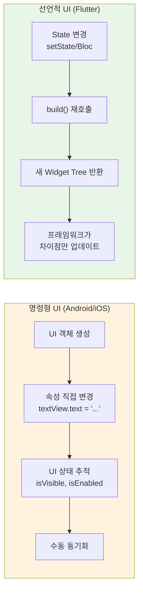

# Flutter Widget 기본기 가이드

> **마지막 업데이트**: 2026-02-08 | **Flutter 3.38** | **Dart 3.10**
> **난이도**: 초급 | **카테고리**: fundamentals
> **선행 학습**: [DartAdvanced](./DartAdvanced.md)
> **예상 학습 시간**: 2h

> Flutter Clean Architecture + Bloc 패턴 기반 교육 자료
> Package versions: flutter_bloc ^9.1.1, freezed ^3.2.4, fpdart ^1.2.0, go_router ^17.0.1, get_it ^9.2.0, injectable ^2.5.0

> **학습 목표**:
> - Widget, Element, RenderObject의 관계를 이해하고 실전에서 활용할 수 있다
> - BuildContext의 정체를 파악하고 InheritedWidget의 동작 원리를 설명할 수 있다
> - Key의 종류와 사용 시나리오를 이해하고 리빌드 최적화를 적용할 수 있다
>
> **관련 문서**: 렌더링 파이프라인, Dirty 체크, VSync 등 내부 동작 원리는 [FlutterInternals](./FlutterInternals.md) 참조

## 목차

1. [Widget Tree 이해](#1-widget-tree-이해)
2. [BuildContext 깊이 이해](#2-buildcontext-깊이-이해)
3. [Element Tree](#3-element-tree)
4. [State Lifecycle](#4-state-lifecycle)
5. [Key의 역할](#5-key의-역할)
6. [Widget 리빌드 최적화](#6-widget-리빌드-최적화)
7. [InheritedWidget 심화](#7-inheritedwidget-심화)
8. [StatefulWidget vs StatelessWidget](#8-statefulwidget-vs-statelesswidget)
9. [실전 안티패턴](#9-실전-안티패턴)
10. [선언적 UI 패러다임 전환 가이드](#10-선언적-ui-패러다임-전환-가이드)
11. [텍스트 입력 심화 (CJK, 리치텍스트)](#11-텍스트-입력-심화-cjk-리치텍스트)
12. [실습 과제](#실습-과제)
13. [Self-Check](#self-check)

---

## 1. Widget Tree 이해

### 1.1 Widget의 본질

Flutter에서 Widget은 **UI 구성의 설계도(blueprint)**입니다. Widget 자체는 불변(immutable)이며, UI의 현재 구성을 선언합니다.

```dart
// Widget은 단순한 구성 정보
class MyWidget extends StatelessWidget {
  final String title;

  const MyWidget({super.key, required this.title});

  @override
  Widget build(BuildContext context) {
    return Text(title);
  }
}
```

### 1.2 Widget Tree의 구조

```dart
class MyApp extends StatelessWidget {
  @override
  Widget build(BuildContext context) {
    return MaterialApp(
      home: Scaffold(
        appBar: AppBar(
          title: Text('Title'),
        ),
        body: Column(
          children: [
            Text('Item 1'),
            Text('Item 2'),
            CustomWidget(),
          ],
        ),
      ),
    );
  }
}
```

### 1.3 StatelessWidget

```dart
class Greeting extends StatelessWidget {
  final String name;
  final TextStyle? style;

  const Greeting({
    super.key,
    required this.name,
    this.style,
  });

  @override
  Widget build(BuildContext context) {
    return Text(
      'Hello, $name!',
      style: style ?? Theme.of(context).textTheme.headlineMedium,
    );
  }
}
```

### 1.4 StatefulWidget

```dart
class Counter extends StatefulWidget {
  final int initialValue;

  const Counter({super.key, this.initialValue = 0});

  @override
  State<Counter> createState() => _CounterState();
}

class _CounterState extends State<Counter> {
  late int _count;

  @override
  void initState() {
    super.initState();
    _count = widget.initialValue;
  }

  void _increment() {
    setState(() {
      _count++;
    });
  }

  @override
  Widget build(BuildContext context) {
    return Column(
      mainAxisAlignment: MainAxisAlignment.center,
      children: [
        Text('Count: $_count'),
        ElevatedButton(
          onPressed: _increment,
          child: Text('Increment'),
        ),
      ],
    );
  }
}
```

### 1.5 InheritedWidget

```dart
class AppTheme extends InheritedWidget {
  final Color primaryColor;
  final Color accentColor;

  const AppTheme({
    super.key,
    required this.primaryColor,
    required this.accentColor,
    required super.child,
  });

  static AppTheme of(BuildContext context) {
    final result = context.dependOnInheritedWidgetOfExactType<AppTheme>();
    assert(result != null, 'No AppTheme found in context');
    return result!;
  }

  static AppTheme? maybeOf(BuildContext context) {
    return context.dependOnInheritedWidgetOfExactType<AppTheme>();
  }

  @override
  bool updateShouldNotify(AppTheme oldWidget) {
    return primaryColor != oldWidget.primaryColor ||
           accentColor != oldWidget.accentColor;
  }
}
```

---

## 2. BuildContext 깊이 이해

### 2.1 BuildContext의 정체

BuildContext는 **Widget Tree에서의 위치를 나타내는 핸들**입니다. 실제로는 Element 객체를 참조합니다.

```dart
// context는 실제로 Element
class MyWidget extends StatelessWidget {
  @override
  Widget build(BuildContext context) {
    debugPrint('${context.runtimeType}'); // StatelessElement 등
    return Container();
  }
}
```

### 2.2 Context의 위치

Scaffold는 build 메서드 내에서 생성되므로, build에 전달된 context는 Scaffold보다 위에 위치합니다. Builder를 사용하면 Scaffold 아래의 context를 얻을 수 있습니다.

```dart
class ContextExample extends StatelessWidget {
  @override
  Widget build(BuildContext context) {
    return Scaffold(
      appBar: AppBar(
        title: Text('Context Demo'),
      ),
      body: Builder(
        builder: (innerContext) {
          return Center(
            child: ElevatedButton(
              onPressed: () {
                ScaffoldMessenger.of(innerContext).showSnackBar(
                  SnackBar(content: Text('Snackbar')),
                );
              },
              child: Text('Show Snackbar'),
            ),
          );
        },
      ),
    );
  }
}
```

### 2.3 of() 패턴 이해

```dart
class MyInheritedWidget extends InheritedWidget {
  final String data;

  const MyInheritedWidget({
    super.key,
    required this.data,
    required super.child,
  });

  static MyInheritedWidget? of(BuildContext context) {
    return context.dependOnInheritedWidgetOfExactType<MyInheritedWidget>();
  }

  @override
  bool updateShouldNotify(MyInheritedWidget oldWidget) {
    return data != oldWidget.data;
  }
}
```

### 2.4 Context 사용 시 주의사항

```dart
// 비동기에서 context 사용
class AsyncContextExample extends StatelessWidget {
  @override
  Widget build(BuildContext context) {
    return ElevatedButton(
      onPressed: () async {
        await Future.delayed(Duration(seconds: 2));

        if (!context.mounted) return; // Flutter 3.7+

        Navigator.of(context).pop();
      },
      child: Text('Async Action'),
    );
  }
}
```

---

## 3. Element Tree

### 3.1 Widget, Element, RenderObject의 관계

```
Widget (불변 설계도)
    ↓ createElement()
Element (변경 가능한 인스턴스)
    ↓ createRenderObject()
RenderObject (실제 레이아웃 & 페인팅)
```

> **3-tree 관계 요약**:
> - **Widget**: 불변 설계도. 매 빌드마다 새로 생성될 수 있음 (가벼움)
> - **Element**: 위젯의 인스턴스를 관리하는 중간 계층. 위젯이 변경되어도 가능하면 재사용됨
> - **RenderObject**: 실제 레이아웃(크기 계산)과 페인팅(화면 그리기)을 담당
>
> Widget은 가볍게 재생성되지만, RenderObject는 비용이 크므로 Element가 중간에서 재사용 여부를 판단합니다.

> **내부 동작 원리**: 3개 트리의 상세한 생성 과정, updateChild 알고리즘, Build/Layout/Paint/Composite 파이프라인은 [FlutterInternals](./FlutterInternals.md) 참조

### 3.2 Element의 재사용 조건

Element 재사용 조건:
1. Widget의 runtimeType이 같아야 함
2. Key가 같아야 함 (또는 둘 다 null)

> Flutter는 내부적으로 `Widget.canUpdate(oldWidget, newWidget)`를 호출하여 재사용 여부를 판단합니다:
> ```dart
> static bool canUpdate(Widget oldWidget, Widget newWidget) {
>   return oldWidget.runtimeType == newWidget.runtimeType
>       && oldWidget.key == newWidget.key;
> }
> ```

> **updateChild 알고리즘**: Element 재사용의 상세한 내부 메커니즘은 [FlutterInternals - Build Phase](./FlutterInternals.md#3-build-phase) 참조

```dart
class ElementReuseExample extends StatefulWidget {
  @override
  State<ElementReuseExample> createState() => _ElementReuseExampleState();
}

class _ElementReuseExampleState extends State<ElementReuseExample> {
  bool _showFirst = true;

  @override
  Widget build(BuildContext context) {
    return Column(
      children: [
        ElevatedButton(
          onPressed: () => setState(() => _showFirst = !_showFirst),
          child: Text('Toggle'),
        ),
        if (_showFirst)
          _ColoredBox(color: Colors.red)
        else
          _ColoredBox(color: Colors.blue),
      ],
    );
  }
}

// _ColoredBox: 탭 횟수를 내부 State로 관리하는 예제 위젯
class _ColoredBox extends StatefulWidget {
  final Color color;
  const _ColoredBox({super.key, required this.color});

  @override
  State<_ColoredBox> createState() => _ColoredBoxState();
}

class _ColoredBoxState extends State<_ColoredBox> {
  int _tapCount = 0;

  @override
  Widget build(BuildContext context) {
    return GestureDetector(
      onTap: () => setState(() => _tapCount++),
      child: Container(
        width: 100, height: 100,
        color: widget.color,
        child: Center(child: Text('Taps: $_tapCount')),
      ),
    );
  }
}
```

---

## 4. State Lifecycle

### 4.1 StatefulWidget의 전체 라이프사이클

```dart
class LifecycleDemo extends StatefulWidget {
  @override
  State<LifecycleDemo> createState() {
    debugPrint('1. createState()'); // Framework이 위젯을 처음 삽입할 때
    return _LifecycleDemoState();
  }
}

// 2. State 생성자 (Dart 런타임이 호출, 명시적으로 오버라이드하지 않음)

class _LifecycleDemoState extends State<LifecycleDemo> {
  @override
  void initState() {
    super.initState();
    debugPrint('3. initState()'); // State 초기화 (1회만 호출)
  }

  @override
  void didChangeDependencies() {
    super.didChangeDependencies();
    debugPrint('4. didChangeDependencies()'); // InheritedWidget 변경 시에도 호출
  }

  @override
  Widget build(BuildContext context) {
    debugPrint('5. build()'); // UI 구성 (setState 호출 시마다)
    return Container();
  }

  @override
  void didUpdateWidget(LifecycleDemo oldWidget) {
    super.didUpdateWidget(oldWidget);
    debugPrint('6. didUpdateWidget()'); // 부모가 같은 runtimeType으로 리빌드 시
  }

  @override
  void reassemble() {
    super.reassemble();
    debugPrint('7. reassemble()'); // hot reload 시 호출 (디버그 전용)
  }

  @override
  void deactivate() {
    debugPrint('8. deactivate()'); // 트리에서 제거될 때 (재삽입 가능)
    super.deactivate();
  }

  @override
  void dispose() {
    debugPrint('9. dispose()'); // 영구 제거 시 리소스 해제
    super.dispose();
  }
}
```

### 4.2 실전 활용

```dart
class PracticalLifecycle extends StatefulWidget {
  final String userId;

  const PracticalLifecycle({super.key, required this.userId});

  @override
  State<PracticalLifecycle> createState() => _PracticalLifecycleState();
}

class _PracticalLifecycleState extends State<PracticalLifecycle> {
  late ScrollController _scrollController;
  StreamSubscription? _subscription;

  @override
  void initState() {
    super.initState();
    _scrollController = ScrollController();
    _loadUser();
  }

  Future<void> _loadUser() async {
    // 데이터 로드
  }

  @override
  void didUpdateWidget(PracticalLifecycle oldWidget) {
    super.didUpdateWidget(oldWidget);
    if (widget.userId != oldWidget.userId) {
      _loadUser();
    }
  }

  @override
  void dispose() {
    _scrollController.dispose();
    _subscription?.cancel();
    super.dispose();
  }

  @override
  Widget build(BuildContext context) {
    return Container();
  }
}
```

---

## 5. Key의 역할

### 5.1 Key의 필요성

Key는 Flutter가 Element를 올바르게 재사용하거나 업데이트하도록 돕습니다.

```dart
// 섹션 5에서 사용하는 헬퍼 위젯 정의
class _StatefulTile extends StatefulWidget {
  final String title;
  const _StatefulTile({super.key, required this.title});

  @override
  State<_StatefulTile> createState() => _StatefulTileState();
}

class _StatefulTileState extends State<_StatefulTile> {
  bool _selected = false;

  @override
  Widget build(BuildContext context) {
    return ListTile(
      title: Text(widget.title),
      selected: _selected,
      onTap: () => setState(() => _selected = !_selected),
    );
  }
}

class _Counter extends StatefulWidget {
  const _Counter({super.key});

  @override
  State<_Counter> createState() => _CounterState();
}

class _CounterState extends State<_Counter> {
  int _count = 0;

  void increment() => setState(() => _count++);

  @override
  Widget build(BuildContext context) {
    return Text('Count: $_count');
  }
}

// ValueKey: 값 기반 비교
class ValueKeyExample extends StatelessWidget {
  final List<String> items = ['Apple', 'Banana', 'Cherry'];

  @override
  Widget build(BuildContext context) {
    return Column(
      children: items.map((item) {
        return _StatefulTile(
          key: ValueKey(item),
          title: item,
        );
      }).toList(),
    );
  }
}

// ObjectKey: 객체 기반 비교
class Person {
  final String id;
  final String name;

  Person(this.id, this.name);

  @override
  bool operator ==(Object other) =>
    identical(this, other) ||
    other is Person && id == other.id;

  @override
  int get hashCode => id.hashCode;
}

class ObjectKeyExample extends StatelessWidget {
  final List<Person> people = [
    Person('1', 'Alice'),
    Person('2', 'Bob'),
  ];

  @override
  Widget build(BuildContext context) {
    return Column(
      children: people.map((person) {
        return _StatefulTile(
          key: ObjectKey(person),
          title: person.name,
        );
      }).toList(),
    );
  }
}

// GlobalKey: 다른 Widget에서 State 접근
class GlobalKeyExample extends StatefulWidget {
  const GlobalKeyExample({super.key});

  @override
  State<GlobalKeyExample> createState() => _GlobalKeyExampleState();
}

class _GlobalKeyExampleState extends State<GlobalKeyExample> {
  final GlobalKey<_CounterState> counterKey = GlobalKey<_CounterState>();

  @override
  Widget build(BuildContext context) {
    return Column(
      children: [
        _Counter(key: counterKey),
        ElevatedButton(
          onPressed: () {
            counterKey.currentState?.increment();
          },
          child: const Text('Increment from outside'),
        ),
      ],
    );
  }
}
```

### 5.2 UniqueKey

`UniqueKey`는 항상 고유한 Key를 생성합니다. 주로 위젯의 State를 강제로 초기화하고 싶을 때 사용합니다.

```dart
// UniqueKey: State를 강제 초기화
class UniqueKeyExample extends StatefulWidget {
  const UniqueKeyExample({super.key});

  @override
  State<UniqueKeyExample> createState() => _UniqueKeyExampleState();
}

class _UniqueKeyExampleState extends State<UniqueKeyExample> {
  Key _childKey = UniqueKey();

  void _resetChild() {
    setState(() => _childKey = UniqueKey()); // 새 Key → State 재생성
  }

  @override
  Widget build(BuildContext context) {
    return Column(
      children: [
        _Counter(key: _childKey), // Key 변경 시 State 초기화됨
        ElevatedButton(
          onPressed: _resetChild,
          child: const Text('Reset Counter'),
        ),
      ],
    );
  }
}
```

> **Key 종류 정리**:
> | Key | 용도 | 비교 기준 |
> |-----|------|----------|
> | `ValueKey<T>` | 고유한 값이 있을 때 | 값(`value`) |
> | `ObjectKey` | 객체 자체가 식별자일 때 | 객체 참조 |
> | `UniqueKey` | 항상 고유해야 할 때 | 인스턴스 자체 |
> | `GlobalKey` | 다른 위젯에서 State 접근 시 | 글로벌 고유 |

---

## 6. Widget 리빌드 최적화

### 6.1 const 생성자

const 위젯은 컴파일 타임에 생성되어 캐싱됩니다. 부모가 리빌드되어도 const 위젯은 동일 인스턴스가 재사용되므로 build()가 호출되지 않습니다.

```dart
class ConstExample extends StatelessWidget {
  @override
  Widget build(BuildContext context) {
    return Column(
      children: [
        const Text('This is const'),
        const SizedBox(height: 16),
        const Icon(Icons.star),

        Text('This is non-const'),
        SizedBox(height: 16),
        Icon(Icons.star),
      ],
    );
  }
}
```

### 6.2 Widget 분리

```dart
// 좋음: Widget 분리
class GoodSeparation extends StatefulWidget {
  @override
  State<GoodSeparation> createState() => _GoodSeparationState();
}

class _GoodSeparationState extends State<GoodSeparation> {
  int _counter = 0;

  @override
  Widget build(BuildContext context) {
    return Scaffold(
      body: Column(
        children: [
          const _StaticHeader(),

          Text('Counter: $_counter'),
          ElevatedButton(
            onPressed: () => setState(() => _counter++),
            child: Text('Increment'),
          ),
        ],
      ),
    );
  }
}

class _StaticHeader extends StatelessWidget {
  const _StaticHeader();

  @override
  Widget build(BuildContext context) {
    debugPrint('_StaticHeader rebuilt');

    return Container(
      padding: EdgeInsets.all(16),
      child: Text('Static Header'),
    );
  }
}
```

### 6.3 Builder 패턴

```dart
// ValueListenableBuilder
class ValueListenableExample extends StatefulWidget {
  const ValueListenableExample({super.key});

  @override
  State<ValueListenableExample> createState() => _ValueListenableExampleState();
}

class _ValueListenableExampleState extends State<ValueListenableExample> {
  final ValueNotifier<int> _counter = ValueNotifier<int>(0);

  @override
  void dispose() {
    _counter.dispose();
    super.dispose();
  }

  @override
  Widget build(BuildContext context) {
    return Scaffold(
      body: Column(
        children: [
          const Text('Static text'),

          ValueListenableBuilder<int>(
            valueListenable: _counter,
            builder: (context, value, child) {
              return Column(
                children: [
                  Text('Counter: $value'),
                  if (child != null) child,
                ],
              );
            },
            child: const Text('This child is reused'),
          ),

          ElevatedButton(
            onPressed: () => _counter.value++,
            child: const Text('Increment'),
          ),
        ],
      ),
    );
  }
}
```

---

## 7. InheritedWidget 심화

### 7.1 InheritedWidget 작동 원리

```dart
class CounterProvider extends InheritedWidget {
  final int count;
  final VoidCallback increment;

  const CounterProvider({
    super.key,
    required this.count,
    required this.increment,
    required super.child,
  });

  static CounterProvider? of(BuildContext context) {
    return context.dependOnInheritedWidgetOfExactType<CounterProvider>();
  }

  @override
  bool updateShouldNotify(CounterProvider oldWidget) {
    return count != oldWidget.count;
  }
}
```

### 7.2 InheritedWidget 최적화

```dart
// 데이터와 액션 분리
class DataProvider extends InheritedWidget {
  final int count;

  const DataProvider({
    super.key,
    required this.count,
    required super.child,
  });

  static DataProvider? of(BuildContext context) {
    return context.dependOnInheritedWidgetOfExactType<DataProvider>();
  }

  /// 값만 읽고 구독하지 않음 (1회성 읽기용)
  static DataProvider? read(BuildContext context) {
    return context.getInheritedWidgetOfExactType<DataProvider>();
  }

  @override
  bool updateShouldNotify(DataProvider oldWidget) {
    return count != oldWidget.count;
  }
}
```

> **`dependOn` vs `get` 차이**:
> - `dependOnInheritedWidgetOfExactType` (= `of()`): 값을 읽고 **변경 구독**. InheritedWidget 업데이트 시 리빌드됨
> - `getInheritedWidgetOfExactType` (= `read()`): 값만 읽고 **구독하지 않음**. 이벤트 핸들러에서 1회성 읽기에 적합

```dart
class ActionProvider extends InheritedWidget {
  final VoidCallback increment;

  const ActionProvider({
    super.key,
    required this.increment,
    required super.child,
  });

  static ActionProvider? of(BuildContext context) {
    return context.getInheritedWidgetOfExactType<ActionProvider>();
  }

  @override
  bool updateShouldNotify(ActionProvider oldWidget) {
    return false;
  }
}
```

### 7.3 InheritedModel

```dart
enum UserAspect { name, email, avatar }

class UserModel extends InheritedModel<UserAspect> {
  final String name;
  final String email;
  final String avatar;

  const UserModel({
    super.key,
    required this.name,
    required this.email,
    required this.avatar,
    required super.child,
  });

  static UserModel? of(BuildContext context, {UserAspect? aspect}) {
    return InheritedModel.inheritFrom<UserModel>(context, aspect: aspect);
  }

  @override
  bool updateShouldNotify(UserModel oldWidget) {
    return name != oldWidget.name ||
           email != oldWidget.email ||
           avatar != oldWidget.avatar;
  }

  @override
  bool updateShouldNotifyDependent(
    UserModel oldWidget,
    Set<UserAspect> dependencies,
  ) {
    if (dependencies.contains(UserAspect.name) && name != oldWidget.name) {
      return true;
    }
    if (dependencies.contains(UserAspect.email) && email != oldWidget.email) {
      return true;
    }
    if (dependencies.contains(UserAspect.avatar) && avatar != oldWidget.avatar) {
      return true;
    }
    return false;
  }
}
```

---

## 8. StatefulWidget vs StatelessWidget

### 8.1 선택 기준

```dart
// StatelessWidget: UI가 파라미터나 InheritedWidget에만 의존
class StatelessExample extends StatelessWidget {
  final String title;
  final VoidCallback onPressed;

  const StatelessExample({
    super.key,
    required this.title,
    required this.onPressed,
  });

  @override
  Widget build(BuildContext context) {
    return ElevatedButton(
      onPressed: onPressed,
      child: Text(title),
    );
  }
}

// StatefulWidget: 변경 가능한 내부 상태가 필요
class StatefulExample extends StatefulWidget {
  @override
  State<StatefulExample> createState() => _StatefulExampleState();
}

class _StatefulExampleState extends State<StatefulExample> {
  bool _isExpanded = false;

  @override
  Widget build(BuildContext context) {
    return Column(
      children: [
        ElevatedButton(
          onPressed: () => setState(() => _isExpanded = !_isExpanded),
          child: Text(_isExpanded ? 'Collapse' : 'Expand'),
        ),
        if (_isExpanded)
          Container(
            height: 200,
            child: Text('Expanded content'),
          ),
      ],
    );
  }
}
```

### 8.2 State Hoisting vs Local State

```dart
// State Hoisting: 상태를 상위로 끌어올림
class StateHoistingExample extends StatefulWidget {
  @override
  State<StateHoistingExample> createState() => _StateHoistingExampleState();
}

class _StateHoistingExampleState extends State<StateHoistingExample> {
  int _counter = 0;

  @override
  Widget build(BuildContext context) {
    return Column(
      children: [
        Text('Counter: $_counter'),

        IncrementButton(
          onPressed: () => setState(() => _counter++),
        ),
        DecrementButton(
          onPressed: () => setState(() => _counter--),
        ),
      ],
    );
  }
}

class IncrementButton extends StatelessWidget {
  final VoidCallback onPressed;

  const IncrementButton({super.key, required this.onPressed});

  @override
  Widget build(BuildContext context) {
    return ElevatedButton(onPressed: onPressed, child: Text('+'));
  }
}

class DecrementButton extends StatelessWidget {
  final VoidCallback onPressed;

  const DecrementButton({super.key, required this.onPressed});

  @override
  Widget build(BuildContext context) {
    return ElevatedButton(onPressed: onPressed, child: Text('-'));
  }
}
```

---

## 9. 실전 안티패턴

### 9.1 안티패턴 1: build()에서 객체 생성

```dart
// 나쁨
class BadObjectCreation extends StatelessWidget {
  @override
  Widget build(BuildContext context) {
    final controller = TextEditingController();
    return TextField(controller: controller);
  }
}

// 좋음
class GoodObjectCreation extends StatefulWidget {
  @override
  State<GoodObjectCreation> createState() => _GoodObjectCreationState();
}

class _GoodObjectCreationState extends State<GoodObjectCreation> {
  late TextEditingController _controller;

  @override
  void initState() {
    super.initState();
    _controller = TextEditingController();
  }

  @override
  void dispose() {
    _controller.dispose();
    super.dispose();
  }

  @override
  Widget build(BuildContext context) {
    return TextField(controller: _controller);
  }
}
```

### 9.2 안티패턴 2: 잘못된 context 사용

```dart
// ❌ 나쁨 - Scaffold와 같은 build 메서드의 context 사용
class BadContextUsage extends StatelessWidget {
  @override
  Widget build(BuildContext context) {
    return Scaffold(
      body: ElevatedButton(
        onPressed: () {
          // context는 Scaffold보다 위에 위치 → Scaffold를 찾지 못함
          Scaffold.of(context).openDrawer(); // 에러 발생!
        },
        child: Text('Open Drawer'),
      ),
      drawer: Drawer(),
    );
  }
}

// 좋음 - Builder 사용
class GoodContextUsage extends StatelessWidget {
  @override
  Widget build(BuildContext context) {
    return Scaffold(
      body: Builder(
        builder: (scaffoldContext) {
          return ElevatedButton(
            onPressed: () {
              Scaffold.of(scaffoldContext).openDrawer();
            },
            child: Text('Open Drawer'),
          );
        },
      ),
      drawer: Drawer(),
    );
  }
}
```

### 9.3 안티패턴 3: setState 남용

```dart
// ❌ 나쁨 - 전체 위젯 트리를 리빌드
class BadSetState extends StatefulWidget {
  @override
  State<BadSetState> createState() => _BadSetStateState();
}

class _BadSetStateState extends State<BadSetState> {
  int _counter = 0;

  @override
  Widget build(BuildContext context) {
    return Column(
      children: [
        // _counter가 변경되면 이 무거운 위젯도 함께 리빌드됨
        const Text('Heavy Widget'), // 무거운 위젯 가정 - 불필요한 리빌드
        Text('Counter: $_counter'),
        ElevatedButton(
          onPressed: () => setState(() => _counter++),
          child: Text('Increment'),
        ),
      ],
    );
  }
}

// 좋음 - ValueNotifier 사용
class GoodSetState extends StatefulWidget {
  @override
  State<GoodSetState> createState() => _GoodSetStateState();
}

class _GoodSetStateState extends State<GoodSetState> {
  final ValueNotifier<int> _counter = ValueNotifier<int>(0);

  @override
  void dispose() {
    _counter.dispose();
    super.dispose();
  }

  @override
  Widget build(BuildContext context) {
    return Column(
      children: [
        ValueListenableBuilder<int>(
          valueListenable: _counter,
          builder: (context, count, _) => Text('Counter: $count'),
        ),

        ElevatedButton(
          onPressed: () => _counter.value++,
          child: Text('Increment'),
        ),
      ],
    );
  }
}
```

### 9.4 안티패턴 4: mounted 체크 누락

```dart
// 좋음
class GoodMounted extends StatefulWidget {
  @override
  State<GoodMounted> createState() => _GoodMountedState();
}

class _GoodMountedState extends State<GoodMounted> {
  @override
  void initState() {
    super.initState();
    _loadData();
  }

  Future<void> _loadData() async {
    await Future.delayed(Duration(seconds: 2));

    if (!mounted) return;

    setState(() {
      // 안전하게 실행
    });
  }

  @override
  Widget build(BuildContext context) {
    return Container();
  }
}
```

> **참고**: `StatefulWidget`의 State에서는 `mounted` 속성을, `StatelessWidget`이나 콜백에서는 `context.mounted` (Flutter 3.7+)를 사용합니다. 둘 다 위젯이 트리에 존재하는지 확인하는 용도입니다.

---

## 10. 선언적 UI 패러다임 전환 가이드

### 10.1 명령형 vs 선언적 UI

기존 네이티브 개발(Android View, iOS UIKit)에서 Flutter로 전환할 때 가장 큰 패러다임 변화는 **명령형(Imperative) → 선언적(Declarative) UI** 전환입니다.



| 관점 | 명령형 (Android/iOS) | 선언적 (Flutter) |
|------|---------------------|-----------------|
| **UI 업데이트** | `view.setText("hello")` | `Text(state.text)` — State 변경 시 자동 |
| **상태 관리** | View가 상태를 가짐 | State와 UI 분리 |
| **UI 구성** | XML + Activity/ViewController | Dart 코드 (Widget) |
| **조건부 UI** | `view.visibility = GONE` | `if (condition) Widget()` |
| **리스트** | RecyclerView + Adapter + ViewHolder | `ListView.builder()` |
| **애니메이션** | ObjectAnimator, CAAnimation | `AnimatedContainer`, `TweenAnimationBuilder` |
| **레이아웃** | ConstraintLayout, AutoLayout | `Row`, `Column`, `Flex` |
| **테마** | `styles.xml`, `Assets.xcassets` | `ThemeData`, `ColorScheme` |

### 10.2 핵심 사고 전환

**1. "UI를 변경한다" → "새로운 UI를 선언한다"**

```dart
// ❌ 명령형 사고: "버튼 텍스트를 변경한다"
// Android: button.setText("Loading...")
// iOS: button.setTitle("Loading...", for: .normal)

// ✅ 선언적 사고: "현재 상태에 맞는 UI를 선언한다"
Widget build(BuildContext context) {
  return ElevatedButton(
    onPressed: state.isLoading ? null : _onTap,
    child: Text(state.isLoading ? '로딩 중...' : '제출'),
  );
}
```

**2. "뷰를 숨긴다" → "위젯을 조건부로 포함한다"**

```dart
// ❌ 명령형: view.visibility = View.GONE / view.isHidden = true

// ✅ 선언적: 조건부 위젯 포함
Column(
  children: [
    const Text('항상 보이는 텍스트'),
    if (state.showDetails) const DetailWidget(),
    // 또는 공간 유지가 필요하면:
    Visibility(
      visible: state.showDetails,
      maintainSize: true,
      child: const DetailWidget(),
    ),
  ],
)
```

**3. "리스트에 아이템을 추가한다" → "새 리스트로 상태를 교체한다"**

```dart
// ❌ 명령형: adapter.add(newItem); adapter.notifyItemInserted(position)

// ✅ 선언적: 상태 변경 → UI 자동 반영
// Bloc에서:
emit(state.copyWith(items: [...state.items, newItem]));

// Widget에서:
ListView.builder(
  itemCount: state.items.length,
  itemBuilder: (context, index) => ItemTile(item: state.items[index]),
)
```

**4. "콜백을 등록한다" → "이벤트를 Bloc에 전달한다"**

```dart
// ❌ 명령형: button.setOnClickListener { doSomething() }

// ✅ 선언적 + Bloc:
ElevatedButton(
  onPressed: () => context.read<CartBloc>().add(const CartEvent.checkout()),
  child: const Text('결제하기'),
)
```

### 10.3 프레임워크별 전환 가이드

**Android (Kotlin/Java) 개발자:**

| Android | Flutter | 비고 |
|---------|---------|------|
| `Activity` / `Fragment` | `Widget` (페이지) | GoRouter로 관리 |
| `RecyclerView` + `Adapter` | `ListView.builder` | ViewHolder 불필요 |
| `ViewModel` + `LiveData` | `Bloc` + `BlocBuilder` | 반응형 패턴 유사 |
| `ConstraintLayout` | `Row` + `Column` + `Expanded` | Flex 기반 |
| `SharedPreferences` | `shared_preferences` | API 유사 |
| `Room` | `Drift` | SQL 기반 유사 |
| `Retrofit` | `Retrofit` (dio 기반) | 거의 동일 |
| `Hilt` / `Dagger` | `injectable` + `get_it` | 어노테이션 기반 유사 |

**iOS (Swift/UIKit) 개발자:**

| iOS (UIKit) | Flutter | 비고 |
|-------------|---------|------|
| `UIViewController` | `Widget` (페이지) | Lifecycle 단순화 |
| `UITableView` + `DataSource` | `ListView.builder` | Delegate 불필요 |
| `Combine` / `RxSwift` | `Bloc` + `Stream` | 반응형 패턴 |
| `UIStackView` | `Row` + `Column` | 더 유연한 Flex |
| `UserDefaults` | `shared_preferences` | API 유사 |
| `CoreData` | `Drift` | 둘 다 SQL 기반 |
| `URLSession` / `Alamofire` | `Dio` | Interceptor 패턴 유사 |
| `Swinject` | `injectable` + `get_it` | DI 컨테이너 |

**React/React Native 개발자:**

| React | Flutter | 비고 |
|-------|---------|------|
| JSX | Widget tree | 구조 매우 유사 |
| `useState` | `setState` / `Bloc` | Hook → Bloc |
| `useEffect` | `initState` + `dispose` | Lifecycle 명시적 |
| `Context` | `InheritedWidget` / `Provider` | 상위 데이터 전달 |
| `key` prop | `Key` | 동일 개념 |
| Virtual DOM diff | Element tree diff | 알고리즘 유사 |

### 10.4 흔한 실수와 올바른 패턴

```dart
// ❌ 실수: build() 안에서 비동기 작업
@override
Widget build(BuildContext context) {
  fetchData(); // 매 빌드마다 API 호출!
  return Container();
}

// ✅ 올바른 패턴: initState 또는 Bloc 이벤트
@override
void initState() {
  super.initState();
  context.read<DataBloc>().add(const DataEvent.load());
}
```

```dart
// ❌ 실수: 위젯을 변수에 저장하고 재사용
final myWidget = Text('hello');  // 같은 인스턴스 공유

// ✅ 올바른 패턴: const 생성자 또는 함수로 생성
const Text('hello');  // 컴파일 타임 상수, 안전한 재사용
```

> **참고**: Widget 리빌드 최적화는 [Widget 리빌드 최적화](#6-widget-리빌드-최적화) 섹션을 참조하세요.
> 상태 관리 패턴은 [Bloc](../core/Bloc.md)을 참조하세요.

---

## 11. 텍스트 입력 심화 (CJK, 리치텍스트)

### 11.1 TextEditingController 심화

```dart
// 기본 사용을 넘어서는 고급 패턴
class AdvancedTextFieldPage extends StatefulWidget {
  const AdvancedTextFieldPage({super.key});

  @override
  State<AdvancedTextFieldPage> createState() => _AdvancedTextFieldPageState();
}

class _AdvancedTextFieldPageState extends State<AdvancedTextFieldPage> {
  late final TextEditingController _controller;

  @override
  void initState() {
    super.initState();
    _controller = TextEditingController()
      ..addListener(_onTextChanged);
  }

  void _onTextChanged() {
    // 커서 위치, 선택 영역 등 모든 정보 접근 가능
    final text = _controller.text;
    final selection = _controller.selection;
    final composing = _controller.value.composing;

    debugPrint('텍스트: $text');
    debugPrint('커서 위치: ${selection.baseOffset}');
    debugPrint('조합 중: ${composing.isValid}');  // CJK 입력 조합 중 여부
  }

  /// 프로그래밍 방식으로 텍스트 조작
  void _insertAtCursor(String insertText) {
    final text = _controller.text;
    final selection = _controller.selection;
    final newText = text.replaceRange(
      selection.start,
      selection.end,
      insertText,
    );
    _controller.value = TextEditingValue(
      text: newText,
      selection: TextSelection.collapsed(
        offset: selection.start + insertText.length,
      ),
    );
  }

  @override
  void dispose() {
    _controller.dispose();
    super.dispose();
  }

  // ...
}
```

### 11.2 CJK (한중일) 입력 처리

한국어, 중국어, 일본어는 **조합형 입력(composing)**을 사용합니다. "한"을 입력할 때 "ㅎ" → "하" → "한" 순으로 조합이 진행되며, 이 과정에서 주의할 점이 있습니다.

```dart
// ⚠️ CJK 입력 시 주의: composing 상태 확인
class SearchField extends StatefulWidget {
  final ValueChanged<String> onSearch;
  const SearchField({super.key, required this.onSearch});

  @override
  State<SearchField> createState() => _SearchFieldState();
}

class _SearchFieldState extends State<SearchField> {
  final _controller = TextEditingController();
  Timer? _debounceTimer;

  @override
  Widget build(BuildContext context) {
    return TextField(
      controller: _controller,
      decoration: const InputDecoration(
        hintText: '검색어를 입력하세요',
        prefixIcon: Icon(Icons.search),
      ),
      // ✅ onChanged는 조합 중에도 호출됨
      onChanged: (value) {
        _debounceTimer?.cancel();
        _debounceTimer = Timer(
          const Duration(milliseconds: 500),  // 한글 조합 완료 대기
          () => widget.onSearch(value),
        );
      },
      // ✅ onSubmitted는 엔터 키를 눌러야 호출됨 (조합 완료 보장)
      onSubmitted: (value) {
        _debounceTimer?.cancel();
        widget.onSearch(value);
      },
    );
  }

  @override
  void dispose() {
    _debounceTimer?.cancel();
    _controller.dispose();
    super.dispose();
  }
}
```

**CJK 입력 핵심 주의사항:**

| 상황 | 문제 | 해결 |
|------|------|------|
| 실시간 검색 | 조합 중 불완전한 문자로 검색 | debounce 300~500ms 적용 |
| 글자수 제한 | 조합 중 바이트 수 오차 | `composing.isValid` 체크 후 카운트 |
| 정규식 검증 | 조합 중 패턴 불일치 | `onEditingComplete` 또는 `onSubmitted`에서 검증 |
| 포커스 이동 | 조합 중 포커스 이동 시 글자 손실 | `FocusNode.unfocus()` 전 조합 완료 대기 |

### 11.3 InputFormatter 활용

```dart
// 전화번호 포맷터 (한국식: 010-1234-5678)
class KoreanPhoneFormatter extends TextInputFormatter {
  @override
  TextEditingValue formatEditUpdate(
    TextEditingValue oldValue,
    TextEditingValue newValue,
  ) {
    // 숫자만 추출
    final digits = newValue.text.replaceAll(RegExp(r'[^\d]'), '');

    if (digits.length > 11) {
      return oldValue;  // 11자리 초과 차단
    }

    final buffer = StringBuffer();
    for (int i = 0; i < digits.length; i++) {
      if (i == 3 || i == 7) buffer.write('-');
      buffer.write(digits[i]);
    }

    final formatted = buffer.toString();
    return TextEditingValue(
      text: formatted,
      selection: TextSelection.collapsed(offset: formatted.length),
    );
  }
}

// 금액 포맷터 (1,000,000원)
class CurrencyFormatter extends TextInputFormatter {
  @override
  TextEditingValue formatEditUpdate(
    TextEditingValue oldValue,
    TextEditingValue newValue,
  ) {
    final digits = newValue.text.replaceAll(RegExp(r'[^\d]'), '');

    if (digits.isEmpty) {
      return const TextEditingValue(
        text: '',
        selection: TextSelection.collapsed(offset: 0),
      );
    }

    final number = int.parse(digits);
    // 한국식 천 단위 콤마
    final formatted = number.toString().replaceAllMapped(
      RegExp(r'(\d)(?=(\d{3})+(?!\d))'),
      (match) => '${match[1]},',
    );

    return TextEditingValue(
      text: formatted,
      selection: TextSelection.collapsed(offset: formatted.length),
    );
  }
}

// 사용 예시
TextField(
  keyboardType: TextInputType.phone,
  inputFormatters: [
    FilteringTextInputFormatter.digitsOnly,
    KoreanPhoneFormatter(),
  ],
  decoration: const InputDecoration(labelText: '전화번호'),
)
```

### 11.4 리치텍스트 편집 (super_editor)

복잡한 리치텍스트 편집이 필요한 경우 `super_editor` 패키지를 사용합니다.

```yaml
# pubspec.yaml
dependencies:
  super_editor: ^0.3.0
```

```dart
// 기본 리치텍스트 에디터 설정
class RichTextEditorPage extends StatefulWidget {
  const RichTextEditorPage({super.key});

  @override
  State<RichTextEditorPage> createState() => _RichTextEditorPageState();
}

class _RichTextEditorPageState extends State<RichTextEditorPage> {
  late final MutableDocument _document;
  late final MutableDocumentComposer _composer;
  late final Editor _editor;

  @override
  void initState() {
    super.initState();
    _document = MutableDocument(
      nodes: [
        ParagraphNode(
          id: Editor.createNodeId(),
          text: AttributedText('리치텍스트 편집기'),
          metadata: {'blockType': header1Attribution},
        ),
        ParagraphNode(
          id: Editor.createNodeId(),
          text: AttributedText('여기에 내용을 입력하세요.'),
        ),
      ],
    );
    _composer = MutableDocumentComposer();
    _editor = createDefaultDocumentEditor(
      document: _document,
      composer: _composer,
    );
  }

  @override
  void dispose() {
    _composer.dispose();
    super.dispose();
  }

  @override
  Widget build(BuildContext context) {
    return SuperEditor(
      editor: _editor,
      document: _document,
      composer: _composer,
      stylesheet: defaultStylesheet.copyWith(
        addRulesAfter: [
          // 한국어 폰트 설정
          StyleRule(
            BlockSelector.all,
            (doc, docNode) => {
              Styles.textStyle: const TextStyle(
                fontFamily: 'Pretendard',
                fontSize: 16,
                height: 1.6,  // 한글은 행간을 넉넉하게
              ),
            },
          ),
        ],
      ),
    );
  }
}
```

### 11.5 텍스트 입력 접근성

```dart
// 접근성을 고려한 텍스트 입력
TextField(
  controller: _controller,
  decoration: InputDecoration(
    labelText: '이메일',  // ✅ 스크린 리더용 라벨
    hintText: 'example@email.com',
    helperText: '회사 이메일을 입력하세요',
    errorText: _hasError ? '유효한 이메일 주소를 입력하세요' : null,
    // ✅ 에러 시 스크린 리더가 에러 메시지를 읽어줌
    suffixIcon: _hasError
        ? const Icon(Icons.error, semanticLabel: '입력 오류')
        : null,
  ),
  // ✅ 키보드 타입으로 입력 힌트 제공
  keyboardType: TextInputType.emailAddress,
  // ✅ 자동완성 힌트
  autofillHints: const [AutofillHints.email],
  // ✅ 텍스트 입력 액션
  textInputAction: TextInputAction.next,
)
```

> **참고**: 접근성 전반은 [Accessibility](../system/Accessibility.md)를 참조하세요.
> 폼 검증 패턴은 [FormValidation](../features/FormValidation.md)을 참조하세요.

---

## 실습 과제

### 과제 1: Custom InheritedWidget 구현

Theme 시스템을 InheritedWidget으로 구현하세요.

**요구사항:**
1. `AppTheme` InheritedWidget 정의
2. `ThemeController` StatefulWidget
3. InheritedModel로 최적화
4. 테스트 UI

**평가 기준:**
- InheritedWidget의 올바른 사용
- 불필요한 리빌드 최소화
- InheritedModel 활용

### 과제 2: Key를 활용한 애니메이션 리스트

드래그로 재정렬 가능한 애니메이션 리스트를 구현하세요.

**요구사항:**
1. `AnimatedListItem` StatefulWidget
2. `ReorderableAnimatedList` 구현
3. 성능 최적화
4. 디버그 모드

**평가 기준:**
- Key의 올바른 사용
- 애니메이션 상태 유지
- 성능 최적화

### 과제 3: 복잡한 Form 관리

다단계 Form을 효율적으로 관리하는 시스템을 구현하세요.

**요구사항:**
1. `FormController` 구현
2. 각 Form Step을 별도 Widget으로 분리
3. BuildContext 활용
4. 라이프사이클 관리

**평가 기준:**
- State 관리의 효율성
- 리소스 누수 방지
- 사용자 경험

---

## Self-Check

다음 항목을 체크하며 학습 내용을 점검하세요:

- [ ] Widget, Element, RenderObject의 관계를 설명하고, Flutter의 3-tree 구조를 이해한다
- [ ] BuildContext가 실제로 Element를 가리킨다는 것을 이해하고, of() 패턴의 작동 원리를 설명할 수 있다
- [ ] StatefulWidget의 전체 라이프사이클을 나열하고, 각 메서드의 용도와 호출 시점을 설명할 수 있다
- [ ] Key의 종류(ValueKey, ObjectKey, UniqueKey, GlobalKey)와 사용 시나리오를 구분할 수 있다
- [ ] const 생성자, Widget 분리, Builder 패턴을 활용해 불필요한 리빌드를 방지할 수 있다
- [ ] InheritedWidget의 작동 원리를 이해하고, dependOnInheritedWidget과 getInheritedWidget의 차이를 설명할 수 있다
- [ ] InheritedModel로 특정 aspect만 의존하는 최적화 패턴을 적용할 수 있다
- [ ] State Hoisting과 Local State의 차이를 이해하고, 상황에 맞게 선택할 수 있다
- [ ] 흔한 안티패턴(build()에서 객체 생성, 잘못된 context 사용 등)을 식별하고 피할 수 있다
- [ ] mounted 체크, dispose 구현 등 메모리 누수를 방지하는 습관을 갖추었다
- [ ] 명령형 UI와 선언적 UI의 근본적 차이를 설명하고, Flutter가 선언적인 이유를 이해하고 있다
- [ ] Android/iOS/React 개발 경험을 Flutter 개념으로 매핑할 수 있다 (RecyclerView→ListView.builder, ViewModel→Bloc 등)
- [ ] CJK 입력 시 composing 상태를 고려한 실시간 검색 debounce 패턴을 구현할 수 있다
- [ ] TextInputFormatter를 커스텀하여 전화번호, 금액 등 포맷팅을 적용할 수 있다
- [ ] 리치텍스트 편집이 필요한 경우 super_editor 등 패키지 선택 기준을 설명할 수 있다

---

## 관련 문서

**선행 학습**:
- [DartAdvanced](./DartAdvanced.md) - Dart 언어 심화 (Generics, Extension, Sealed Class 등)

**다음 단계**:
- [LayoutSystem](./LayoutSystem.md) - Constraints 전파 원리와 Sliver 기반 레이아웃
- [FlutterInternals](./FlutterInternals.md) - 렌더링 파이프라인과 내부 동작 원리

**심화 학습**:
- [DevToolsProfiling](../system/DevToolsProfiling.md) - Widget 리빌드 디버깅과 성능 최적화
- [DesignSystem](./DesignSystem.md) - 재사용 가능한 컴포넌트 설계

---

**학습 완료 후**: [fundamentals/LayoutSystem.md](./LayoutSystem.md)로 진행하여 Constraints 전파 원리와 Sliver 기반 레이아웃을 학습하세요.
