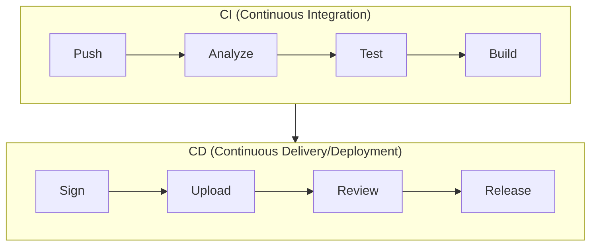
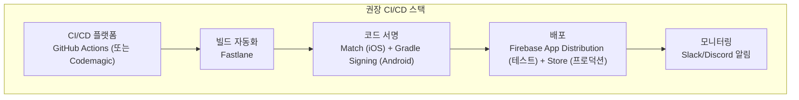
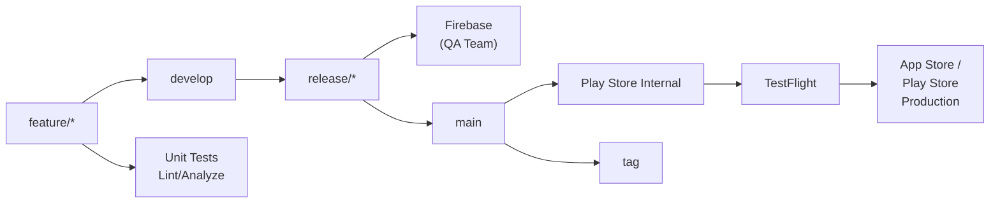
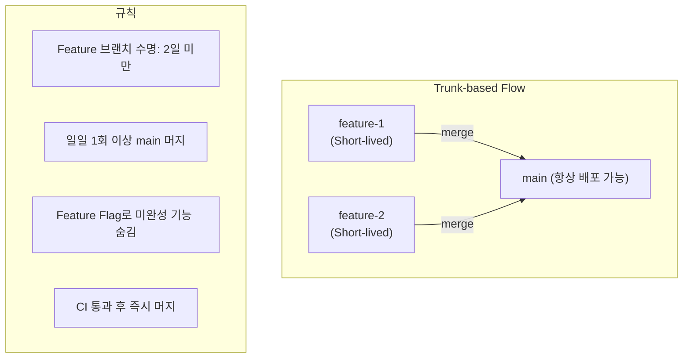
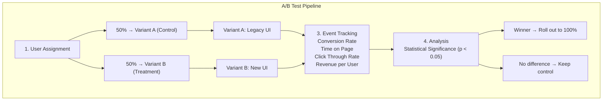

# Flutter CI/CD 통합 가이드 (기본 + 심화)

> **마지막 업데이트**: 2026-02-08 | **Flutter 3.38** | **Dart 3.10**
> **난이도**: 시니어 | **카테고리**: infrastructure
> **선행 학습**: [Testing](../system/Testing.md)
> **예상 학습 시간**: 3h

> 이 문서는 Flutter 앱의 CI/CD 파이프라인 설정(기본)부터 Trunk-based Development, Feature Flag, Canary Release, Shorebird OTA 등 프로덕션 수준 고급 전략(심화)까지 통합하여 다룹니다.

> **학습 목표**: 이 문서를 학습하면 다음을 할 수 있습니다:
> - GitHub Actions로 Flutter CI/CD 파이프라인을 구성할 수 있다
> - 자동 빌드, 테스트, 배포 워크플로우를 설정할 수 있다
> - Firebase App Distribution과 스토어 배포를 자동화할 수 있다
> - Trunk-based Development 전략으로 CI/CD를 운영할 수 있다
> - Canary Release와 Feature Flag를 활용한 점진적 배포를 구현할 수 있다
> - Shorebird OTA 업데이트를 설정하고 운영할 수 있다

## 1. 개요

### 1.1 CI/CD란?



### 1.2 CI/CD 도구 비교

| 도구 | 장점 | 단점 | 비용 |
|------|------|------|------|
| **GitHub Actions** | GitHub 통합, 무료 tier | macOS 비용 높음 | 무료 2,000분/월 |
| **Codemagic** | Flutter 특화, M1 Mac | 무료 tier 제한 | 무료 500분/월 |
| **Bitrise** | 다양한 워크플로우 | 설정 복잡 | 유료 |
| **Fastlane** | 자동화 강력 | 학습 곡선 | 무료 (오픈소스) |

### 1.3 권장 조합



## 2. GitHub Actions

### 2.1 기본 워크플로우 구조

```yaml
# .github/workflows/flutter_ci.yml
name: Flutter CI/CD

on:
  push:
    branches: [main, develop]
  pull_request:
    branches: [main]
  release:
    types: [published]

concurrency:
  group: ${{ github.workflow }}-${{ github.ref }}
  cancel-in-progress: true

env:
  FLUTTER_VERSION: '3.27.0'
  JAVA_VERSION: '17'

jobs:
  analyze:
    name: Analyze & Test
    runs-on: ubuntu-latest
    timeout-minutes: 15

    steps:
      - name: Checkout
        uses: actions/checkout@v4

      - name: Setup Flutter
        uses: subosito/flutter-action@v2
        with:
          flutter-version: ${{ env.FLUTTER_VERSION }}
          cache: true
          cache-key: flutter-${{ env.FLUTTER_VERSION }}-${{ hashFiles('**/pubspec.lock') }}

      - name: Install dependencies
        run: flutter pub get

      - name: Verify formatting
        run: dart format --output=none --set-exit-if-changed .

      - name: Analyze code
        run: flutter analyze --fatal-infos

      - name: Run tests with coverage
        run: flutter test --coverage --test-randomize-ordering-seed=random

      - name: Upload coverage to Codecov
        uses: codecov/codecov-action@v4
        with:
          files: coverage/lcov.info
          flags: unittests
          token: ${{ secrets.CODECOV_TOKEN }}
          fail_ci_if_error: false
```

### 2.2 Android 빌드 Job

```yaml
# .github/workflows/flutter_ci.yml (계속)
  build-android:
    name: Build Android (${{ matrix.flavor }})
    needs: analyze
    runs-on: ubuntu-latest
    timeout-minutes: 30

    strategy:
      fail-fast: false
      matrix:
        flavor: [dev, staging, prod]
        include:
          - flavor: dev
            build-type: apk
          - flavor: staging
            build-type: apk
          - flavor: prod
            build-type: appbundle

    steps:
      - name: Checkout
        uses: actions/checkout@v4

      - name: Setup Java
        uses: actions/setup-java@v4
        with:
          distribution: 'temurin'
          java-version: ${{ env.JAVA_VERSION }}
          cache: 'gradle'

      - name: Setup Flutter
        uses: subosito/flutter-action@v2
        with:
          flutter-version: ${{ env.FLUTTER_VERSION }}
          cache: true

      - name: Install dependencies
        run: flutter pub get

      - name: Decode keystore
        if: matrix.flavor == 'prod'
        run: |
          echo "${{ secrets.KEYSTORE_BASE64 }}" | base64 -d > android/app/keystore.jks

      - name: Create key.properties
        if: matrix.flavor == 'prod'
        run: |
          cat > android/key.properties << EOF
          storePassword=${{ secrets.KEYSTORE_PASSWORD }}
          keyPassword=${{ secrets.KEY_PASSWORD }}
          keyAlias=${{ secrets.KEY_ALIAS }}
          storeFile=keystore.jks
          EOF

      - name: Build APK
        if: matrix.build-type == 'apk'
        run: |
          flutter build apk \
            --flavor ${{ matrix.flavor }} \
            --dart-define=ENV=${{ matrix.flavor }} \
            --dart-define=BUILD_NUMBER=${{ github.run_number }} \
            --dart-define=COMMIT_SHA=${{ github.sha }}

      - name: Build App Bundle
        if: matrix.build-type == 'appbundle'
        run: |
          flutter build appbundle \
            --flavor ${{ matrix.flavor }} \
            --dart-define=ENV=${{ matrix.flavor }} \
            --dart-define=BUILD_NUMBER=${{ github.run_number }} \
            --dart-define=COMMIT_SHA=${{ github.sha }}

      - name: Upload APK
        if: matrix.build-type == 'apk'
        uses: actions/upload-artifact@v4
        with:
          name: apk-${{ matrix.flavor }}
          path: build/app/outputs/flutter-apk/app-${{ matrix.flavor }}-release.apk
          retention-days: 7

      - name: Upload App Bundle
        if: matrix.build-type == 'appbundle'
        uses: actions/upload-artifact@v4
        with:
          name: aab-${{ matrix.flavor }}
          path: build/app/outputs/bundle/${{ matrix.flavor }}Release/app-${{ matrix.flavor }}-release.aab
          retention-days: 14
```

### 2.3 iOS 빌드 Job

```yaml
# .github/workflows/flutter_ci.yml (계속)
  build-ios:
    name: Build iOS (${{ matrix.flavor }})
    needs: analyze
    runs-on: macos-14  # M1 Mac
    timeout-minutes: 45

    strategy:
      fail-fast: false
      matrix:
        flavor: [dev, staging, prod]

    steps:
      - name: Checkout
        uses: actions/checkout@v4

      - name: Setup Flutter
        uses: subosito/flutter-action@v2
        with:
          flutter-version: ${{ env.FLUTTER_VERSION }}
          cache: true

      - name: Install dependencies
        run: flutter pub get

      - name: Setup Ruby
        uses: ruby/setup-ruby@v1
        with:
          ruby-version: '3.2'
          bundler-cache: true
          working-directory: ios

      - name: Install CocoaPods
        run: |
          cd ios
          bundle exec pod install --repo-update

      - name: Import Code Signing Certificates
        uses: apple-actions/import-codesign-certs@v2
        with:
          p12-file-base64: ${{ secrets.CERTIFICATES_P12 }}
          p12-password: ${{ secrets.CERTIFICATES_PASSWORD }}

      - name: Download Provisioning Profiles
        uses: apple-actions/download-provisioning-profiles@v2
        with:
          bundle-id: com.example.app.${{ matrix.flavor }}
          profile-type: IOS_APP_STORE
          issuer-id: ${{ secrets.APPSTORE_ISSUER_ID }}
          api-key-id: ${{ secrets.APPSTORE_API_KEY_ID }}
          api-private-key: ${{ secrets.APPSTORE_API_PRIVATE_KEY }}

      - name: Build IPA
        run: |
          flutter build ipa \
            --flavor ${{ matrix.flavor }} \
            --dart-define=ENV=${{ matrix.flavor }} \
            --dart-define=BUILD_NUMBER=${{ github.run_number }} \
            --export-options-plist=ios/ExportOptions-${{ matrix.flavor }}.plist

      - name: Upload IPA
        uses: actions/upload-artifact@v4
        with:
          name: ipa-${{ matrix.flavor }}
          path: build/ios/ipa/*.ipa
          retention-days: 14
```

### 2.4 배포 Job

```yaml
# .github/workflows/flutter_ci.yml (계속)
  deploy-firebase:
    name: Deploy to Firebase (${{ matrix.flavor }})
    needs: [build-android, build-ios]
    runs-on: ubuntu-latest
    if: github.event_name == 'push' && github.ref == 'refs/heads/develop'

    strategy:
      matrix:
        flavor: [dev, staging]

    steps:
      - name: Checkout
        uses: actions/checkout@v4

      - name: Download APK
        uses: actions/download-artifact@v4
        with:
          name: apk-${{ matrix.flavor }}
          path: artifacts/android

      - name: Download IPA
        uses: actions/download-artifact@v4
        with:
          name: ipa-${{ matrix.flavor }}
          path: artifacts/ios

      - name: Deploy Android to Firebase
        uses: wzieba/Firebase-Distribution-Github-Action@v1
        with:
          appId: ${{ secrets.FIREBASE_ANDROID_APP_ID }}
          serviceCredentialsFileContent: ${{ secrets.FIREBASE_SERVICE_ACCOUNT }}
          groups: testers
          file: artifacts/android/app-${{ matrix.flavor }}-release.apk
          releaseNotes: |
            Branch: ${{ github.ref_name }}
            Commit: ${{ github.sha }}
            Build: ${{ github.run_number }}

      - name: Deploy iOS to Firebase
        uses: wzieba/Firebase-Distribution-Github-Action@v1
        with:
          appId: ${{ secrets.FIREBASE_IOS_APP_ID }}
          serviceCredentialsFileContent: ${{ secrets.FIREBASE_SERVICE_ACCOUNT }}
          groups: testers
          file: artifacts/ios/*.ipa
          releaseNotes: |
            Branch: ${{ github.ref_name }}
            Commit: ${{ github.sha }}
            Build: ${{ github.run_number }}

  deploy-stores:
    name: Deploy to Stores
    needs: [build-android, build-ios]
    runs-on: macos-14
    if: github.event_name == 'release'
    environment: production

    steps:
      - name: Checkout
        uses: actions/checkout@v4

      - name: Setup Ruby
        uses: ruby/setup-ruby@v1
        with:
          ruby-version: '3.2'
          bundler-cache: true

      - name: Download AAB
        uses: actions/download-artifact@v4
        with:
          name: aab-prod
          path: artifacts/android

      - name: Download IPA
        uses: actions/download-artifact@v4
        with:
          name: ipa-prod
          path: artifacts/ios

      - name: Deploy to Play Store
        run: |
          bundle exec fastlane android deploy_internal
        env:
          SUPPLY_JSON_KEY_DATA: ${{ secrets.PLAY_STORE_SERVICE_ACCOUNT }}
          AAB_PATH: artifacts/android/app-prod-release.aab

      - name: Deploy to TestFlight
        run: |
          bundle exec fastlane ios deploy_testflight
        env:
          APP_STORE_CONNECT_API_KEY_ID: ${{ secrets.APPSTORE_API_KEY_ID }}
          APP_STORE_CONNECT_API_KEY_ISSUER_ID: ${{ secrets.APPSTORE_ISSUER_ID }}
          APP_STORE_CONNECT_API_KEY_CONTENT: ${{ secrets.APPSTORE_API_PRIVATE_KEY }}
          IPA_PATH: artifacts/ios/*.ipa
```

### 2.5 알림 Job

```yaml
# .github/workflows/flutter_ci.yml (계속)
  notify:
    name: Notify
    needs: [deploy-firebase, deploy-stores]
    runs-on: ubuntu-latest
    if: always()

    steps:
      - name: Notify Slack on Success
        if: needs.deploy-firebase.result == 'success' || needs.deploy-stores.result == 'success'
        uses: slackapi/slack-github-action@v1.27.0
        with:
          payload: |
            {
              "blocks": [
                {
                  "type": "header",
                  "text": {
                    "type": "plain_text",
                    "text": "✅ Build Deployed Successfully"
                  }
                },
                {
                  "type": "section",
                  "fields": [
                    {"type": "mrkdwn", "text": "*Repository:*\n${{ github.repository }}"},
                    {"type": "mrkdwn", "text": "*Branch:*\n${{ github.ref_name }}"},
                    {"type": "mrkdwn", "text": "*Build:*\n#${{ github.run_number }}"},
                    {"type": "mrkdwn", "text": "*Triggered by:*\n${{ github.actor }}"}
                  ]
                },
                {
                  "type": "actions",
                  "elements": [
                    {
                      "type": "button",
                      "text": {"type": "plain_text", "text": "View Workflow"},
                      "url": "${{ github.server_url }}/${{ github.repository }}/actions/runs/${{ github.run_id }}"
                    }
                  ]
                }
              ]
            }
        env:
          SLACK_WEBHOOK_URL: ${{ secrets.SLACK_WEBHOOK }}
          SLACK_WEBHOOK_TYPE: INCOMING_WEBHOOK

      - name: Notify Slack on Failure
        if: failure()
        uses: slackapi/slack-github-action@v1.27.0
        with:
          payload: |
            {
              "blocks": [
                {
                  "type": "header",
                  "text": {
                    "type": "plain_text",
                    "text": "❌ Build Failed"
                  }
                },
                {
                  "type": "section",
                  "fields": [
                    {"type": "mrkdwn", "text": "*Repository:*\n${{ github.repository }}"},
                    {"type": "mrkdwn", "text": "*Branch:*\n${{ github.ref_name }}"},
                    {"type": "mrkdwn", "text": "*Commit:*\n${{ github.sha }}"}
                  ]
                },
                {
                  "type": "actions",
                  "elements": [
                    {
                      "type": "button",
                      "text": {"type": "plain_text", "text": "View Logs"},
                      "url": "${{ github.server_url }}/${{ github.repository }}/actions/runs/${{ github.run_id }}"
                    }
                  ]
                }
              ]
            }
        env:
          SLACK_WEBHOOK_URL: ${{ secrets.SLACK_WEBHOOK }}
          SLACK_WEBHOOK_TYPE: INCOMING_WEBHOOK
```

### 2.6 PR 검증 워크플로우

```yaml
# .github/workflows/pr_check.yml
name: PR Check

on:
  pull_request:
    types: [opened, synchronize, reopened]

jobs:
  check:
    name: PR Validation
    runs-on: ubuntu-latest
    timeout-minutes: 15

    steps:
      - name: Checkout
        uses: actions/checkout@v4
        with:
          fetch-depth: 0

      - name: Setup Flutter
        uses: subosito/flutter-action@v2
        with:
          flutter-version: '3.27.0'
          cache: true

      - name: Install dependencies
        run: flutter pub get

      - name: Check formatting
        run: dart format --output=none --set-exit-if-changed .

      - name: Analyze
        run: flutter analyze --fatal-infos

      - name: Run tests
        run: flutter test --coverage

      - name: Check coverage threshold
        uses: VeryGoodOpenSource/very_good_coverage@v3
        with:
          path: coverage/lcov.info
          min_coverage: 80
          exclude: '**/*.g.dart **/*.freezed.dart'

      - name: Comment PR with coverage
        uses: romeovs/lcov-reporter-action@v0.4.0
        with:
          github-token: ${{ secrets.GITHUB_TOKEN }}
          lcov-file: coverage/lcov.info
          filter-changed-files: true
```

## 3. Codemagic

### 3.1 codemagic.yaml 전체 설정

```yaml
# codemagic.yaml
definitions:
  environment: &environment
    flutter: stable
    xcode: latest
    cocoapods: default
    java: 17

  scripts:
    - &install_deps
      name: Install dependencies
      script: |
        flutter pub get

    - &run_tests
      name: Run tests
      script: |
        flutter analyze --fatal-infos
        flutter test --coverage

  artifacts: &artifacts
    - build/**/outputs/apk/**/*.apk
    - build/**/outputs/bundle/**/*.aab
    - build/ios/ipa/*.ipa
    - flutter_drive.log

  publishing: &publishing
    email:
      recipients:
        - team@example.com
      notify:
        success: true
        failure: true
    slack:
      channel: '#builds'
      notify_on_build_start: false
      notify:
        success: true
        failure: true

workflows:
  # Development 빌드
  dev-workflow:
    name: Development Build
    instance_type: mac_mini_m1
    max_build_duration: 60
    environment:
      <<: *environment
      groups:
        - development
      vars:
        FLAVOR: dev

    triggering:
      events:
        - push
      branch_patterns:
        - pattern: develop
          include: true
        - pattern: 'feature/*'
          include: true

    scripts:
      - *install_deps
      - *run_tests
      - name: Build Android APK
        script: |
          flutter build apk \
            --flavor $FLAVOR \
            --dart-define=ENV=$FLAVOR \
            --dart-define=BUILD_NUMBER=$PROJECT_BUILD_NUMBER
      - name: Build iOS
        script: |
          flutter build ios \
            --flavor $FLAVOR \
            --dart-define=ENV=$FLAVOR \
            --no-codesign

    artifacts: *artifacts

    publishing:
      <<: *publishing
      firebase:
        firebase_service_account: $FIREBASE_SERVICE_ACCOUNT
        android:
          app_id: $FIREBASE_ANDROID_APP_ID
          groups:
            - developers

  # Staging 빌드
  staging-workflow:
    name: Staging Build
    instance_type: mac_mini_m1
    max_build_duration: 90
    environment:
      <<: *environment
      groups:
        - staging
      vars:
        FLAVOR: staging
      ios_signing:
        distribution_type: ad_hoc
        bundle_identifier: com.example.app.staging

    triggering:
      events:
        - push
      branch_patterns:
        - pattern: 'release/*'
          include: true

    scripts:
      - *install_deps
      - *run_tests
      - name: Build Android APK
        script: |
          flutter build apk \
            --flavor $FLAVOR \
            --dart-define=ENV=$FLAVOR \
            --dart-define=BUILD_NUMBER=$PROJECT_BUILD_NUMBER
      - name: Build iOS IPA
        script: |
          flutter build ipa \
            --flavor $FLAVOR \
            --dart-define=ENV=$FLAVOR \
            --export-options-plist=ios/ExportOptions-staging.plist

    artifacts: *artifacts

    publishing:
      <<: *publishing
      firebase:
        firebase_service_account: $FIREBASE_SERVICE_ACCOUNT
        android:
          app_id: $FIREBASE_ANDROID_APP_ID_STAGING
          groups:
            - qa-team
        ios:
          app_id: $FIREBASE_IOS_APP_ID_STAGING
          groups:
            - qa-team

  # Production 빌드
  production-workflow:
    name: Production Build
    instance_type: mac_mini_m1
    max_build_duration: 120
    environment:
      <<: *environment
      groups:
        - production
      vars:
        FLAVOR: prod
      android_signing:
        - release_keystore
      ios_signing:
        distribution_type: app_store
        bundle_identifier: com.example.app

    triggering:
      events:
        - tag
      tag_patterns:
        - pattern: 'v*'
          include: true

    scripts:
      - *install_deps
      - *run_tests
      - name: Build Android AAB
        script: |
          flutter build appbundle \
            --flavor $FLAVOR \
            --dart-define=ENV=$FLAVOR \
            --dart-define=BUILD_NUMBER=$PROJECT_BUILD_NUMBER
      - name: Build iOS IPA
        script: |
          flutter build ipa \
            --flavor $FLAVOR \
            --dart-define=ENV=$FLAVOR \
            --export-options-plist=ios/ExportOptions-prod.plist

    artifacts: *artifacts

    publishing:
      <<: *publishing
      google_play:
        credentials: $GCLOUD_SERVICE_ACCOUNT_CREDENTIALS
        track: internal
        submit_as_draft: true
      app_store_connect:
        api_key: $APP_STORE_CONNECT_API_KEY
        key_id: $APP_STORE_CONNECT_KEY_ID
        issuer_id: $APP_STORE_CONNECT_ISSUER_ID
        submit_to_testflight: true
        beta_groups:
          - Internal Testers
```

### 3.2 Codemagic 환경 변수 그룹

```yaml
# Codemagic UI에서 설정할 환경 변수 그룹

# development 그룹
FIREBASE_SERVICE_ACCOUNT: <JSON 파일 내용>
FIREBASE_ANDROID_APP_ID: 1:xxxxx:android:xxxxx
FIREBASE_IOS_APP_ID: 1:xxxxx:ios:xxxxx

# staging 그룹
FIREBASE_SERVICE_ACCOUNT: <JSON 파일 내용>
FIREBASE_ANDROID_APP_ID_STAGING: 1:xxxxx:android:xxxxx
FIREBASE_IOS_APP_ID_STAGING: 1:xxxxx:ios:xxxxx

# production 그룹
GCLOUD_SERVICE_ACCOUNT_CREDENTIALS: <JSON 파일 내용>
APP_STORE_CONNECT_API_KEY: <API Key 내용>
APP_STORE_CONNECT_KEY_ID: XXXXXXXXXX
APP_STORE_CONNECT_ISSUER_ID: xxxxxxxx-xxxx-xxxx-xxxx-xxxxxxxxxxxx
```

## 4. Fastlane

### 4.1 프로젝트 구조

```
project/
├── android/
│   └── fastlane/
│       ├── Fastfile
│       ├── Appfile
│       └── Pluginfile
├── ios/
│   └── fastlane/
│       ├── Fastfile
│       ├── Appfile
│       ├── Matchfile
│       └── Pluginfile
├── Gemfile
└── Gemfile.lock
```

### 4.2 Gemfile

```ruby
# Gemfile
source "https://rubygems.org"

gem "fastlane", "~> 2.225"
gem "cocoapods", "~> 1.15"

plugins_path = File.join(File.dirname(__FILE__), 'ios', 'fastlane', 'Pluginfile')
eval_gemfile(plugins_path) if File.exist?(plugins_path)

plugins_path = File.join(File.dirname(__FILE__), 'android', 'fastlane', 'Pluginfile')
eval_gemfile(plugins_path) if File.exist?(plugins_path)
```

### 4.3 iOS Fastfile

```ruby
# ios/fastlane/Fastfile
default_platform(:ios)

platform :ios do
  before_all do
    setup_ci if ENV['CI']
  end

  # ========================================
  # 인증서 관리 (Match)
  # ========================================

  desc "Sync all certificates and profiles"
  lane :sync_certificates do
    match(type: "development", readonly: true)
    match(type: "adhoc", readonly: true)
    match(type: "appstore", readonly: true)
  end

  desc "Register new device"
  lane :register_device do |options|
    device_name = options[:name] || prompt(text: "Device name: ")
    device_udid = options[:udid] || prompt(text: "Device UDID: ")

    register_devices(
      devices: {
        device_name => device_udid
      }
    )

    match(type: "development", force_for_new_devices: true)
    match(type: "adhoc", force_for_new_devices: true)
  end

  # ========================================
  # 빌드
  # ========================================

  desc "Build development IPA"
  lane :build_dev do
    build_ios_app(
      scheme: "Runner-dev",
      configuration: "Release-dev",
      export_method: "development",
      output_directory: "./build/ios",
      output_name: "app-dev.ipa"
    )
  end

  desc "Build staging IPA"
  lane :build_staging do
    match(type: "adhoc", readonly: true)

    build_ios_app(
      scheme: "Runner-staging",
      configuration: "Release-staging",
      export_method: "ad-hoc",
      output_directory: "./build/ios",
      output_name: "app-staging.ipa"
    )
  end

  desc "Build production IPA"
  lane :build_prod do
    match(type: "appstore", readonly: true)

    build_ios_app(
      scheme: "Runner-prod",
      configuration: "Release-prod",
      export_method: "app-store",
      output_directory: "./build/ios",
      output_name: "app-prod.ipa"
    )
  end

  # ========================================
  # 배포
  # ========================================

  desc "Deploy to Firebase App Distribution"
  lane :deploy_firebase do |options|
    firebase_app_distribution(
      app: ENV["FIREBASE_IOS_APP_ID"],
      ipa_path: options[:ipa_path] || "./build/ios/ipa/*.ipa",
      groups: options[:groups] || "testers",
      release_notes: options[:notes] || changelog_from_git_commits(commits_count: 10)
    )
  end

  desc "Deploy to TestFlight"
  lane :deploy_testflight do |options|
    api_key = app_store_connect_api_key(
      key_id: ENV["APP_STORE_CONNECT_API_KEY_ID"],
      issuer_id: ENV["APP_STORE_CONNECT_API_KEY_ISSUER_ID"],
      key_content: ENV["APP_STORE_CONNECT_API_KEY_CONTENT"],
      in_house: false
    )

    upload_to_testflight(
      api_key: api_key,
      ipa: options[:ipa_path] || "./build/ios/ipa/*.ipa",
      skip_waiting_for_build_processing: true,
      distribute_external: false,
      notify_external_testers: false,
      changelog: options[:notes] || changelog_from_git_commits(commits_count: 10)
    )
  end

  desc "Deploy to App Store"
  lane :deploy_appstore do |options|
    api_key = app_store_connect_api_key(
      key_id: ENV["APP_STORE_CONNECT_API_KEY_ID"],
      issuer_id: ENV["APP_STORE_CONNECT_API_KEY_ISSUER_ID"],
      key_content: ENV["APP_STORE_CONNECT_API_KEY_CONTENT"],
      in_house: false
    )

    upload_to_app_store(
      api_key: api_key,
      ipa: options[:ipa_path] || "./build/ios/ipa/*.ipa",
      submit_for_review: false,
      automatic_release: false,
      skip_screenshots: true,
      skip_metadata: false,
      precheck_include_in_app_purchases: false
    )
  end

  # ========================================
  # 버전 관리
  # ========================================

  desc "Increment build number"
  lane :increment_build do
    build_number = latest_testflight_build_number + 1
    increment_build_number(build_number: build_number)
    build_number
  end

  desc "Increment version number"
  lane :increment_version do |options|
    increment_version_number(
      bump_type: options[:bump_type] || "patch"  # major, minor, patch
    )
  end

  # ========================================
  # 유틸리티
  # ========================================

  desc "Clean build artifacts"
  lane :clean do
    clear_derived_data
    sh("cd .. && rm -rf build/ios")
  end

  error do |lane, exception|
    # 에러 발생 시 Slack 알림
    slack(
      message: "iOS Build Failed",
      success: false,
      payload: {
        "Lane" => lane,
        "Error" => exception.message
      },
      default_payloads: [:git_branch, :git_author]
    ) if ENV["SLACK_URL"]
  end
end
```

### 4.4 iOS Appfile

```ruby
# ios/fastlane/Appfile
app_identifier(ENV["APP_IDENTIFIER"] || "com.example.app")
apple_id(ENV["APPLE_ID"] || "developer@example.com")
itc_team_id(ENV["ITC_TEAM_ID"])
team_id(ENV["TEAM_ID"])
```

### 4.5 iOS Matchfile

```ruby
# ios/fastlane/Matchfile
git_url(ENV["MATCH_GIT_URL"] || "git@github.com:example/certificates.git")
storage_mode("git")

type("development")  # 기본값, lane에서 오버라이드

app_identifier([
  "com.example.app",
  "com.example.app.dev",
  "com.example.app.staging"
])

username(ENV["APPLE_ID"])
team_id(ENV["TEAM_ID"])

readonly(true)  # CI에서는 항상 readonly
```

### 4.6 Android Fastfile

```ruby
# android/fastlane/Fastfile
default_platform(:android)

platform :android do
  # ========================================
  # 빌드
  # ========================================

  desc "Build development APK"
  lane :build_dev do
    gradle(
      task: "assemble",
      flavor: "dev",
      build_type: "Release",
      project_dir: "./"
    )
  end

  desc "Build staging APK"
  lane :build_staging do
    gradle(
      task: "assemble",
      flavor: "staging",
      build_type: "Release",
      project_dir: "./"
    )
  end

  desc "Build production AAB"
  lane :build_prod do
    gradle(
      task: "bundle",
      flavor: "prod",
      build_type: "Release",
      project_dir: "./"
    )
  end

  # ========================================
  # 배포
  # ========================================

  desc "Deploy to Firebase App Distribution"
  lane :deploy_firebase do |options|
    firebase_app_distribution(
      app: ENV["FIREBASE_ANDROID_APP_ID"],
      apk_path: options[:apk_path] || "../build/app/outputs/flutter-apk/app-release.apk",
      groups: options[:groups] || "testers",
      release_notes: options[:notes] || changelog_from_git_commits(commits_count: 10)
    )
  end

  desc "Deploy to Play Store Internal"
  lane :deploy_internal do |options|
    upload_to_play_store(
      track: "internal",
      aab: options[:aab_path] || ENV["AAB_PATH"] || "../build/app/outputs/bundle/prodRelease/app-prod-release.aab",
      json_key_data: ENV["SUPPLY_JSON_KEY_DATA"],
      skip_upload_metadata: true,
      skip_upload_images: true,
      skip_upload_screenshots: true
    )
  end

  desc "Deploy to Play Store Alpha"
  lane :deploy_alpha do |options|
    upload_to_play_store(
      track: "alpha",
      aab: options[:aab_path] || "../build/app/outputs/bundle/prodRelease/app-prod-release.aab",
      json_key_data: ENV["SUPPLY_JSON_KEY_DATA"],
      skip_upload_metadata: true,
      skip_upload_images: true,
      skip_upload_screenshots: true
    )
  end

  desc "Deploy to Play Store Beta"
  lane :deploy_beta do |options|
    upload_to_play_store(
      track: "beta",
      aab: options[:aab_path] || "../build/app/outputs/bundle/prodRelease/app-prod-release.aab",
      json_key_data: ENV["SUPPLY_JSON_KEY_DATA"],
      skip_upload_metadata: true,
      skip_upload_images: true,
      skip_upload_screenshots: true
    )
  end

  desc "Promote Internal to Production"
  lane :promote_to_production do
    upload_to_play_store(
      track: "internal",
      track_promote_to: "production",
      json_key_data: ENV["SUPPLY_JSON_KEY_DATA"],
      skip_upload_aab: true,
      skip_upload_metadata: true,
      skip_upload_images: true,
      skip_upload_screenshots: true
    )
  end

  # ========================================
  # 버전 관리
  # ========================================

  desc "Get current version code"
  lane :get_version_code do
    version_code = google_play_track_version_codes(
      track: "internal",
      json_key_data: ENV["SUPPLY_JSON_KEY_DATA"]
    ).max || 0

    UI.message("Current version code: #{version_code}")
    version_code
  end

  desc "Increment version code"
  lane :increment_version_code do
    current = get_version_code
    new_version_code = current + 1

    # Flutter pubspec.yaml의 build number 업데이트
    sh("cd ../.. && sed -i '' 's/version: \\(.*\\)+.*/version: \\1+#{new_version_code}/' pubspec.yaml")

    UI.success("Version code incremented to: #{new_version_code}")
    new_version_code
  end

  # ========================================
  # 유틸리티
  # ========================================

  desc "Clean build"
  lane :clean do
    gradle(task: "clean", project_dir: "./")
    sh("cd ../.. && rm -rf build/app")
  end

  error do |lane, exception|
    slack(
      message: "Android Build Failed",
      success: false,
      payload: {
        "Lane" => lane,
        "Error" => exception.message
      },
      default_payloads: [:git_branch, :git_author]
    ) if ENV["SLACK_URL"]
  end
end
```

### 4.7 Android Appfile

```ruby
# android/fastlane/Appfile
json_key_file(ENV["GOOGLE_PLAY_JSON_KEY_PATH"])
package_name(ENV["PACKAGE_NAME"] || "com.example.app")
```

## 5. 환경별 빌드

### 5.1 Flavor 설정 (Android)

```kotlin
// android/app/build.gradle.kts
android {
    namespace = "com.example.app"
    compileSdk = 35

    defaultConfig {
        applicationId = "com.example.app"
        minSdk = 24
        targetSdk = 35
        versionCode = flutter.versionCode
        versionName = flutter.versionName
    }

    flavorDimensions += "environment"

    productFlavors {
        create("dev") {
            dimension = "environment"
            applicationIdSuffix = ".dev"
            versionNameSuffix = "-dev"
            resValue("string", "app_name", "MyApp Dev")

            buildConfigField("String", "API_BASE_URL", "\"https://api-dev.example.com\"")
            buildConfigField("Boolean", "ENABLE_LOGGING", "true")
        }

        create("staging") {
            dimension = "environment"
            applicationIdSuffix = ".staging"
            versionNameSuffix = "-staging"
            resValue("string", "app_name", "MyApp Staging")

            buildConfigField("String", "API_BASE_URL", "\"https://api-staging.example.com\"")
            buildConfigField("Boolean", "ENABLE_LOGGING", "true")
        }

        create("prod") {
            dimension = "environment"
            resValue("string", "app_name", "MyApp")

            buildConfigField("String", "API_BASE_URL", "\"https://api.example.com\"")
            buildConfigField("Boolean", "ENABLE_LOGGING", "false")
        }
    }

    signingConfigs {
        create("release") {
            val keystorePropertiesFile = rootProject.file("key.properties")
            if (keystorePropertiesFile.exists()) {
                val keystoreProperties = java.util.Properties()
                keystoreProperties.load(java.io.FileInputStream(keystorePropertiesFile))

                keyAlias = keystoreProperties["keyAlias"] as String
                keyPassword = keystoreProperties["keyPassword"] as String
                storeFile = file(keystoreProperties["storeFile"] as String)
                storePassword = keystoreProperties["storePassword"] as String
            }
        }
    }

    buildTypes {
        release {
            isMinifyEnabled = true
            isShrinkResources = true
            proguardFiles(
                getDefaultProguardFile("proguard-android-optimize.txt"),
                "proguard-rules.pro"
            )
            signingConfig = signingConfigs.getByName("release")
        }
        debug {
            isMinifyEnabled = false
            applicationIdSuffix = ".debug"
        }
    }
}
```

### 5.2 Scheme 설정 (iOS)

```ruby
# ios/Podfile
platform :ios, '14.0'

# Flavor별 Bundle ID 매핑
def flutter_root
  generated_xcode_build_settings_path = File.expand_path(File.join('..', 'Flutter', 'Generated.xcconfig'), __FILE__)
  unless File.exist?(generated_xcode_build_settings_path)
    raise "#{generated_xcode_build_settings_path} must exist."
  end
  File.foreach(generated_xcode_build_settings_path) do |line|
    matches = line.match(/FLUTTER_ROOT=(.*)/)
    return matches[1].strip if matches
  end
  raise "FLUTTER_ROOT not found"
end

target 'Runner' do
  use_frameworks!
  use_modular_headers!

  flutter_install_all_ios_pods File.dirname(File.realpath(__FILE__))

  # 환경별 설정
  target 'Runner-dev' do
    inherit! :complete
  end

  target 'Runner-staging' do
    inherit! :complete
  end
end

post_install do |installer|
  installer.pods_project.targets.each do |target|
    flutter_additional_ios_build_settings(target)
  end
end
```

### 5.3 ExportOptions.plist

```xml
<!-- ios/ExportOptions-dev.plist -->
<?xml version="1.0" encoding="UTF-8"?>
<!DOCTYPE plist PUBLIC "-//Apple//DTD PLIST 1.0//EN" "http://www.apple.com/DTDs/PropertyList-1.0.dtd">
<plist version="1.0">
<dict>
    <key>method</key>
    <string>development</string>
    <key>teamID</key>
    <string>YOUR_TEAM_ID</string>
    <key>signingStyle</key>
    <string>automatic</string>
    <key>stripSwiftSymbols</key>
    <true/>
</dict>
</plist>

<!-- ios/ExportOptions-staging.plist -->
<?xml version="1.0" encoding="UTF-8"?>
<!DOCTYPE plist PUBLIC "-//Apple//DTD PLIST 1.0//EN" "http://www.apple.com/DTDs/PropertyList-1.0.dtd">
<plist version="1.0">
<dict>
    <key>method</key>
    <string>ad-hoc</string>
    <key>teamID</key>
    <string>YOUR_TEAM_ID</string>
    <key>signingStyle</key>
    <string>manual</string>
    <key>provisioningProfiles</key>
    <dict>
        <key>com.example.app.staging</key>
        <string>match AdHoc com.example.app.staging</string>
    </dict>
    <key>stripSwiftSymbols</key>
    <true/>
</dict>
</plist>

<!-- ios/ExportOptions-prod.plist -->
<?xml version="1.0" encoding="UTF-8"?>
<!DOCTYPE plist PUBLIC "-//Apple//DTD PLIST 1.0//EN" "http://www.apple.com/DTDs/PropertyList-1.0.dtd">
<plist version="1.0">
<dict>
    <key>method</key>
    <string>app-store</string>
    <key>teamID</key>
    <string>YOUR_TEAM_ID</string>
    <key>signingStyle</key>
    <string>manual</string>
    <key>provisioningProfiles</key>
    <dict>
        <key>com.example.app</key>
        <string>match AppStore com.example.app</string>
    </dict>
    <key>stripSwiftSymbols</key>
    <true/>
    <key>uploadSymbols</key>
    <true/>
</dict>
</plist>
```

### 5.4 빌드 명령어

```bash
#!/bin/bash
# scripts/build.sh

set -e

FLAVOR=${1:-dev}
PLATFORM=${2:-all}
BUILD_NUMBER=${3:-$(date +%s)}

echo "Building $FLAVOR for $PLATFORM (build: $BUILD_NUMBER)"

# Android APK
if [[ "$PLATFORM" == "android" || "$PLATFORM" == "all" ]]; then
  echo "Building Android APK..."
  flutter build apk \
    --flavor $FLAVOR \
    --dart-define=ENV=$FLAVOR \
    --dart-define=BUILD_NUMBER=$BUILD_NUMBER \
    --release
fi

# Android App Bundle
if [[ "$PLATFORM" == "android-aab" ]]; then
  echo "Building Android AAB..."
  flutter build appbundle \
    --flavor $FLAVOR \
    --dart-define=ENV=$FLAVOR \
    --dart-define=BUILD_NUMBER=$BUILD_NUMBER \
    --release
fi

# iOS
if [[ "$PLATFORM" == "ios" || "$PLATFORM" == "all" ]]; then
  echo "Building iOS IPA..."
  flutter build ipa \
    --flavor $FLAVOR \
    --dart-define=ENV=$FLAVOR \
    --dart-define=BUILD_NUMBER=$BUILD_NUMBER \
    --export-options-plist=ios/ExportOptions-$FLAVOR.plist
fi

echo "Build completed!"
```

## 6. 코드 서명

### 6.1 Android Keystore 생성

```bash
#!/bin/bash
# scripts/generate_keystore.sh

# Keystore 생성
keytool -genkey -v \
  -keystore android/app/keystore.jks \
  -keyalg RSA \
  -keysize 2048 \
  -validity 10000 \
  -alias release

# key.properties 생성
cat > android/key.properties << EOF
storePassword=your_store_password
keyPassword=your_key_password
keyAlias=release
storeFile=keystore.jks
EOF

echo "Keystore generated! Add key.properties to .gitignore"
```

### 6.2 Keystore Base64 인코딩 (CI용)

```bash
# Keystore를 Base64로 인코딩 (GitHub Secrets에 저장)
base64 -i android/app/keystore.jks | pbcopy
echo "Keystore copied to clipboard. Add to KEYSTORE_BASE64 secret."

# CI에서 복원
echo "$KEYSTORE_BASE64" | base64 -d > android/app/keystore.jks
```

### 6.3 iOS Match 설정

```bash
# Match 초기화 (처음 한 번)
cd ios
fastlane match init

# 인증서 생성 (개발/배포 모두)
fastlane match development
fastlane match adhoc
fastlane match appstore

# 기존 인증서 취소 후 재생성 (주의!)
fastlane match nuke development
fastlane match nuke adhoc
fastlane match nuke appstore
```

### 6.4 App Store Connect API Key 생성

```bash
# 1. App Store Connect → Users and Access → Keys → Generate API Key
# 2. Key 정보 저장:
#    - Issuer ID: xxxxxxxx-xxxx-xxxx-xxxx-xxxxxxxxxxxx
#    - Key ID: XXXXXXXXXX
#    - .p8 파일 다운로드

# 3. GitHub Secrets에 저장:
#    - APPSTORE_API_KEY_ID: Key ID
#    - APPSTORE_ISSUER_ID: Issuer ID
#    - APPSTORE_API_PRIVATE_KEY: .p8 파일 내용 (그대로)
```

### 6.5 Google Play Service Account 설정

```bash
# 1. Google Cloud Console → IAM & Admin → Service Accounts
# 2. Create Service Account
# 3. Grant "Service Account User" role
# 4. Create Key (JSON)

# 5. Google Play Console → Settings → API access
# 6. Link service account
# 7. Grant "Release Manager" or "Admin" permission

# 8. GitHub Secrets에 JSON 파일 내용 저장:
#    - PLAY_STORE_SERVICE_ACCOUNT: JSON 파일 전체 내용
```

## 7. 자동 배포

### 7.1 배포 파이프라인 전략



### 7.2 Firebase App Distribution

```yaml
# .github/workflows/firebase_distribution.yml
name: Firebase Distribution

on:
  push:
    branches: [develop]
  workflow_dispatch:
    inputs:
      platform:
        description: 'Platform'
        required: true
        default: 'both'
        type: choice
        options:
          - android
          - ios
          - both
      groups:
        description: 'Tester groups'
        required: true
        default: 'internal-testers'

jobs:
  distribute:
    runs-on: macos-14
    steps:
      - uses: actions/checkout@v4

      - name: Setup Flutter
        uses: subosito/flutter-action@v2
        with:
          flutter-version: '3.27.0'
          cache: true

      - name: Build & Distribute Android
        if: inputs.platform == 'android' || inputs.platform == 'both'
        run: |
          flutter build apk --flavor dev --dart-define=ENV=dev

          # Firebase CLI로 배포
          curl -sL https://firebase.tools | bash
          firebase appdistribution:distribute \
            build/app/outputs/flutter-apk/app-dev-release.apk \
            --app ${{ secrets.FIREBASE_ANDROID_APP_ID }} \
            --groups "${{ inputs.groups || 'internal-testers' }}" \
            --release-notes "Build ${{ github.run_number }} from ${{ github.ref_name }}"
        env:
          GOOGLE_APPLICATION_CREDENTIALS: ${{ secrets.FIREBASE_SERVICE_ACCOUNT_PATH }}

      - name: Build & Distribute iOS
        if: inputs.platform == 'ios' || inputs.platform == 'both'
        run: |
          flutter build ipa --flavor dev --export-options-plist=ios/ExportOptions-dev.plist

          firebase appdistribution:distribute \
            "build/ios/ipa/*.ipa" \
            --app ${{ secrets.FIREBASE_IOS_APP_ID }} \
            --groups "${{ inputs.groups || 'internal-testers' }}" \
            --release-notes "Build ${{ github.run_number }} from ${{ github.ref_name }}"
```

### 7.3 Play Store 배포 자동화

```yaml
# .github/workflows/play_store.yml
name: Play Store Release

on:
  release:
    types: [published]
  workflow_dispatch:
    inputs:
      track:
        description: 'Release track'
        required: true
        default: 'internal'
        type: choice
        options:
          - internal
          - alpha
          - beta
          - production

jobs:
  deploy:
    runs-on: ubuntu-latest
    environment: production

    steps:
      - uses: actions/checkout@v4

      - name: Setup Java
        uses: actions/setup-java@v4
        with:
          distribution: 'temurin'
          java-version: '17'

      - name: Setup Flutter
        uses: subosito/flutter-action@v2
        with:
          flutter-version: '3.27.0'

      - name: Decode keystore
        run: echo "${{ secrets.KEYSTORE_BASE64 }}" | base64 -d > android/app/keystore.jks

      - name: Create key.properties
        run: |
          cat > android/key.properties << EOF
          storePassword=${{ secrets.KEYSTORE_PASSWORD }}
          keyPassword=${{ secrets.KEY_PASSWORD }}
          keyAlias=${{ secrets.KEY_ALIAS }}
          storeFile=keystore.jks
          EOF

      - name: Build AAB
        run: |
          flutter build appbundle \
            --flavor prod \
            --dart-define=ENV=prod \
            --dart-define=BUILD_NUMBER=${{ github.run_number }}

      - name: Setup Ruby
        uses: ruby/setup-ruby@v1
        with:
          ruby-version: '3.2'
          bundler-cache: true

      - name: Deploy to Play Store
        run: |
          cd android
          bundle exec fastlane deploy_${{ inputs.track || 'internal' }}
        env:
          SUPPLY_JSON_KEY_DATA: ${{ secrets.PLAY_STORE_SERVICE_ACCOUNT }}
```

### 7.4 App Store 배포 자동화

```yaml
# .github/workflows/app_store.yml
name: App Store Release

on:
  release:
    types: [published]
  workflow_dispatch:
    inputs:
      submit_for_review:
        description: 'Submit for review'
        required: true
        default: false
        type: boolean

jobs:
  deploy:
    runs-on: macos-14
    environment: production

    steps:
      - uses: actions/checkout@v4

      - name: Setup Flutter
        uses: subosito/flutter-action@v2
        with:
          flutter-version: '3.27.0'

      - name: Setup Ruby
        uses: ruby/setup-ruby@v1
        with:
          ruby-version: '3.2'
          bundler-cache: true
          working-directory: ios

      - name: Install CocoaPods
        run: cd ios && bundle exec pod install

      - name: Import certificates
        uses: apple-actions/import-codesign-certs@v2
        with:
          p12-file-base64: ${{ secrets.CERTIFICATES_P12 }}
          p12-password: ${{ secrets.CERTIFICATES_PASSWORD }}

      - name: Download provisioning profiles
        uses: apple-actions/download-provisioning-profiles@v2
        with:
          bundle-id: com.example.app
          profile-type: IOS_APP_STORE
          issuer-id: ${{ secrets.APPSTORE_ISSUER_ID }}
          api-key-id: ${{ secrets.APPSTORE_API_KEY_ID }}
          api-private-key: ${{ secrets.APPSTORE_API_PRIVATE_KEY }}

      - name: Build IPA
        run: |
          flutter build ipa \
            --flavor prod \
            --dart-define=ENV=prod \
            --export-options-plist=ios/ExportOptions-prod.plist

      - name: Deploy to TestFlight
        run: |
          cd ios
          bundle exec fastlane deploy_testflight
        env:
          APP_STORE_CONNECT_API_KEY_ID: ${{ secrets.APPSTORE_API_KEY_ID }}
          APP_STORE_CONNECT_API_KEY_ISSUER_ID: ${{ secrets.APPSTORE_ISSUER_ID }}
          APP_STORE_CONNECT_API_KEY_CONTENT: ${{ secrets.APPSTORE_API_PRIVATE_KEY }}

      - name: Submit for Review
        if: inputs.submit_for_review
        run: |
          cd ios
          bundle exec fastlane deploy_appstore
        env:
          APP_STORE_CONNECT_API_KEY_ID: ${{ secrets.APPSTORE_API_KEY_ID }}
          APP_STORE_CONNECT_API_KEY_ISSUER_ID: ${{ secrets.APPSTORE_ISSUER_ID }}
          APP_STORE_CONNECT_API_KEY_CONTENT: ${{ secrets.APPSTORE_API_PRIVATE_KEY }}
```

## 8. 버전 관리

### 8.1 Semantic Versioning

```
버전 형식: MAJOR.MINOR.PATCH+BUILD

예: 1.2.3+45

- MAJOR: 호환되지 않는 API 변경
- MINOR: 하위 호환되는 기능 추가
- PATCH: 하위 호환되는 버그 수정
- BUILD: CI 빌드 번호 (자동 증가)
```

### 8.2 pubspec.yaml 버전 관리

```yaml
# pubspec.yaml
name: my_app
description: My Flutter App
version: 1.2.3+45  # MAJOR.MINOR.PATCH+BUILD

environment:
  sdk: '>=3.10.0 <4.0.0'
```

### 8.3 버전 자동 증가 스크립트

```bash
#!/bin/bash
# scripts/bump_version.sh

set -e

BUMP_TYPE=${1:-patch}  # major, minor, patch
PUBSPEC_FILE="pubspec.yaml"

# 현재 버전 추출
CURRENT_VERSION=$(grep "^version:" $PUBSPEC_FILE | sed 's/version: //')
VERSION_NUMBER=$(echo $CURRENT_VERSION | cut -d'+' -f1)
BUILD_NUMBER=$(echo $CURRENT_VERSION | cut -d'+' -f2)

# 버전 분리
MAJOR=$(echo $VERSION_NUMBER | cut -d'.' -f1)
MINOR=$(echo $VERSION_NUMBER | cut -d'.' -f2)
PATCH=$(echo $VERSION_NUMBER | cut -d'.' -f3)

# 버전 증가
case $BUMP_TYPE in
  major)
    MAJOR=$((MAJOR + 1))
    MINOR=0
    PATCH=0
    ;;
  minor)
    MINOR=$((MINOR + 1))
    PATCH=0
    ;;
  patch)
    PATCH=$((PATCH + 1))
    ;;
esac

# 빌드 번호 증가
NEW_BUILD=$((BUILD_NUMBER + 1))
NEW_VERSION="$MAJOR.$MINOR.$PATCH+$NEW_BUILD"

# pubspec.yaml 업데이트
if [[ "$OSTYPE" == "darwin"* ]]; then
  sed -i '' "s/^version: .*/version: $NEW_VERSION/" $PUBSPEC_FILE
else
  sed -i "s/^version: .*/version: $NEW_VERSION/" $PUBSPEC_FILE
fi

echo "Version bumped: $CURRENT_VERSION → $NEW_VERSION"

# Git 태그 생성 (선택)
if [[ "$2" == "--tag" ]]; then
  git add $PUBSPEC_FILE
  git commit -m "chore: bump version to $NEW_VERSION"
  git tag -a "v$MAJOR.$MINOR.$PATCH" -m "Release v$MAJOR.$MINOR.$PATCH"
  echo "Created tag: v$MAJOR.$MINOR.$PATCH"
fi
```

### 8.4 Git Tag 기반 릴리즈

```yaml
# .github/workflows/release.yml
name: Create Release

on:
  push:
    tags:
      - 'v*'

jobs:
  release:
    runs-on: ubuntu-latest

    steps:
      - uses: actions/checkout@v4
        with:
          fetch-depth: 0

      - name: Get version from tag
        id: version
        run: echo "VERSION=${GITHUB_REF#refs/tags/v}" >> $GITHUB_OUTPUT

      - name: Generate changelog
        id: changelog
        uses: metcalfc/changelog-generator@v4.1.0
        with:
          myToken: ${{ secrets.GITHUB_TOKEN }}

      - name: Create GitHub Release
        uses: softprops/action-gh-release@v2
        with:
          name: Release v${{ steps.version.outputs.VERSION }}
          body: ${{ steps.changelog.outputs.changelog }}
          draft: false
          prerelease: ${{ contains(github.ref, '-') }}
        env:
          GITHUB_TOKEN: ${{ secrets.GITHUB_TOKEN }}
```

### 8.5 자동 버전 업데이트 워크플로우

```yaml
# .github/workflows/auto_version.yml
name: Auto Version Bump

on:
  pull_request:
    types: [closed]
    branches: [main]

jobs:
  bump:
    if: github.event.pull_request.merged == true
    runs-on: ubuntu-latest

    steps:
      - uses: actions/checkout@v4
        with:
          fetch-depth: 0
          token: ${{ secrets.PAT_TOKEN }}

      - name: Determine bump type
        id: bump
        run: |
          PR_TITLE="${{ github.event.pull_request.title }}"
          if [[ "$PR_TITLE" == *"BREAKING"* ]] || [[ "$PR_TITLE" == *"!"* ]]; then
            echo "TYPE=major" >> $GITHUB_OUTPUT
          elif [[ "$PR_TITLE" == feat* ]]; then
            echo "TYPE=minor" >> $GITHUB_OUTPUT
          else
            echo "TYPE=patch" >> $GITHUB_OUTPUT
          fi

      - name: Bump version
        run: |
          chmod +x scripts/bump_version.sh
          ./scripts/bump_version.sh ${{ steps.bump.outputs.TYPE }}

      - name: Commit and push
        run: |
          git config user.name "GitHub Actions"
          git config user.email "actions@github.com"
          git add pubspec.yaml
          git commit -m "chore: bump version [skip ci]"
          git push
```

## 9. 모니터링 및 알림

### 9.1 Slack 통합

```yaml
# .github/workflows/notify.yml
name: Build Notifications

on:
  workflow_run:
    workflows: ["Flutter CI/CD"]
    types: [completed]

jobs:
  notify:
    runs-on: ubuntu-latest

    steps:
      - name: Build Success
        if: ${{ github.event.workflow_run.conclusion == 'success' }}
        uses: slackapi/slack-github-action@v1.27.0
        with:
          payload: |
            {
              "blocks": [
                {
                  "type": "section",
                  "text": {
                    "type": "mrkdwn",
                    "text": "✅ *Build Successful*\n*Repository:* ${{ github.repository }}\n*Branch:* ${{ github.event.workflow_run.head_branch }}\n*Commit:* `${{ github.event.workflow_run.head_sha }}`"
                  }
                },
                {
                  "type": "actions",
                  "elements": [
                    {
                      "type": "button",
                      "text": {"type": "plain_text", "text": "View Build"},
                      "url": "${{ github.event.workflow_run.html_url }}"
                    }
                  ]
                }
              ]
            }
        env:
          SLACK_WEBHOOK_URL: ${{ secrets.SLACK_WEBHOOK }}
          SLACK_WEBHOOK_TYPE: INCOMING_WEBHOOK

      - name: Build Failure
        if: ${{ github.event.workflow_run.conclusion == 'failure' }}
        uses: slackapi/slack-github-action@v1.27.0
        with:
          payload: |
            {
              "blocks": [
                {
                  "type": "section",
                  "text": {
                    "type": "mrkdwn",
                    "text": "❌ *Build Failed*\n*Repository:* ${{ github.repository }}\n*Branch:* ${{ github.event.workflow_run.head_branch }}\n*Triggered by:* ${{ github.event.workflow_run.actor.login }}"
                  }
                },
                {
                  "type": "actions",
                  "elements": [
                    {
                      "type": "button",
                      "text": {"type": "plain_text", "text": "View Logs"},
                      "style": "danger",
                      "url": "${{ github.event.workflow_run.html_url }}"
                    }
                  ]
                }
              ]
            }
        env:
          SLACK_WEBHOOK_URL: ${{ secrets.SLACK_WEBHOOK }}
          SLACK_WEBHOOK_TYPE: INCOMING_WEBHOOK
```

### 9.2 Discord 통합

```yaml
# Discord 웹훅 알림
- name: Notify Discord
  uses: sarisia/actions-status-discord@v1
  if: always()
  with:
    webhook: ${{ secrets.DISCORD_WEBHOOK }}
    status: ${{ job.status }}
    title: "Flutter Build"
    description: "Build #${{ github.run_number }} on ${{ github.ref_name }}"
    color: ${{ job.status == 'success' && '0x00ff00' || '0xff0000' }}
    url: "${{ github.server_url }}/${{ github.repository }}/actions/runs/${{ github.run_id }}"
```

### 9.3 빌드 상태 배지

```markdown
<!-- README.md -->
# My Flutter App

[](https://github.com/username/repo/actions/workflows/flutter_ci.yml)
[](https://codecov.io/gh/username/repo)
[](LICENSE)
```

### 9.4 빌드 메트릭 수집

```yaml
# .github/workflows/metrics.yml
name: Build Metrics

on:
  workflow_run:
    workflows: ["Flutter CI/CD"]
    types: [completed]

jobs:
  metrics:
    runs-on: ubuntu-latest

    steps:
      - name: Collect build metrics
        run: |
          BUILD_DURATION=${{ github.event.workflow_run.run_started_at }}
          BUILD_STATUS=${{ github.event.workflow_run.conclusion }}

          # DataDog, New Relic 등으로 메트릭 전송
          curl -X POST "https://api.datadoghq.com/api/v1/series" \
            -H "Content-Type: application/json" \
            -H "DD-API-KEY: ${{ secrets.DATADOG_API_KEY }}" \
            -d '{
              "series": [{
                "metric": "flutter.build.duration",
                "points": [['"$(date +%s)"', '"$BUILD_DURATION"']],
                "tags": ["status:'"$BUILD_STATUS"'", "repo:${{ github.repository }}"]
              }]
            }'
```

## 10. Best Practices

### 10.1 CI/CD 체크리스트

| 항목 | Dev | Staging | Prod |
|------|:---:|:-------:|:----:|
| 코드 분석 (lint) | ✅ | ✅ | ✅ |
| 단위 테스트 | ✅ | ✅ | ✅ |
| 통합 테스트 | ❌ | ✅ | ✅ |
| 코드 커버리지 | ✅ | ✅ | ✅ |
| 앱 빌드 | ✅ | ✅ | ✅ |
| 코드 서명 | ❌ | ✅ | ✅ |
| Firebase 배포 | ✅ | ✅ | ❌ |
| 스토어 배포 | ❌ | ❌ | ✅ |
| Slack 알림 | ❌ | ✅ | ✅ |

### 10.2 시크릿 관리

```yaml
# 환경별 시크릿 분리 (GitHub Environments)
Development:
  - FIREBASE_ANDROID_APP_ID_DEV
  - FIREBASE_IOS_APP_ID_DEV

Staging:
  - FIREBASE_ANDROID_APP_ID_STAGING
  - FIREBASE_IOS_APP_ID_STAGING

Production:
  - KEYSTORE_BASE64
  - KEYSTORE_PASSWORD
  - KEY_ALIAS
  - KEY_PASSWORD
  - CERTIFICATES_P12
  - CERTIFICATES_PASSWORD
  - APPSTORE_API_KEY_ID
  - APPSTORE_ISSUER_ID
  - APPSTORE_API_PRIVATE_KEY
  - PLAY_STORE_SERVICE_ACCOUNT
```

### 10.3 캐싱 전략

```yaml
# 효율적인 캐싱으로 빌드 시간 단축
- name: Cache Flutter SDK
  uses: actions/cache@v4
  with:
    path: |
      ~/.pub-cache
      ${{ env.FLUTTER_HOME }}
    key: flutter-${{ env.FLUTTER_VERSION }}-${{ hashFiles('**/pubspec.lock') }}
    restore-keys: |
      flutter-${{ env.FLUTTER_VERSION }}-
      flutter-

- name: Cache Gradle
  uses: actions/cache@v4
  with:
    path: |
      ~/.gradle/caches
      ~/.gradle/wrapper
    key: gradle-${{ hashFiles('**/*.gradle*', '**/gradle-wrapper.properties') }}
    restore-keys: gradle-

- name: Cache CocoaPods
  uses: actions/cache@v4
  with:
    path: ios/Pods
    key: pods-${{ hashFiles('ios/Podfile.lock') }}
    restore-keys: pods-
```

### 10.4 DO (권장 사항)

```yaml
# ✅ 병렬 실행으로 시간 단축
jobs:
  analyze:
    runs-on: ubuntu-latest
  build-android:
    needs: analyze  # analyze 완료 후
  build-ios:
    needs: analyze  # 병렬로 실행

# ✅ Matrix 빌드로 중복 제거
strategy:
  matrix:
    flavor: [dev, staging, prod]

# ✅ 조건부 실행
if: github.event_name == 'release'

# ✅ 타임아웃 설정
timeout-minutes: 30

# ✅ 실패 시 계속 진행 (선택적)
continue-on-error: true

# ✅ Concurrency로 중복 빌드 취소
concurrency:
  group: ${{ github.workflow }}-${{ github.ref }}
  cancel-in-progress: true
```

### 10.5 DON'T (금지 사항)

```yaml
# ❌ 시크릿 직접 노출
run: echo ${{ secrets.API_KEY }}  # 로그에 노출됨!

# ❌ 무한 타임아웃
# timeout-minutes 없으면 기본 6시간

# ❌ 불필요한 단계 반복
# 각 job에서 flutter pub get 여러 번 실행

# ❌ 큰 아티팩트 장기 보관
retention-days: 90  # 너무 김, 7-14일 권장

# ❌ main 브랜치 직접 푸시 허용
# Branch protection rules 설정 필요
```

### 10.6 보안 권장사항

```yaml
# 1. 최소 권한 원칙
permissions:
  contents: read
  packages: write

# 2. 환경 보호 (수동 승인)
environment:
  name: production
  url: https://example.com

# 3. 시크릿 스캔
- uses: trufflesecurity/trufflehog@main
  with:
    path: ./
    base: main
    head: HEAD

# 4. 의존성 취약점 검사
- name: Run Snyk
  uses: snyk/actions/node@master
  env:
    SNYK_TOKEN: ${{ secrets.SNYK_TOKEN }}
```

### 10.7 빌드 시간 최적화

| 최적화 기법 | 예상 절감 | 적용 난이도 |
|------------|----------|------------|
| Flutter/Gradle 캐싱 | 30-50% | 쉬움 |
| 병렬 job 실행 | 20-40% | 쉬움 |
| M1 Mac 사용 (iOS) | 30-50% | 쉬움 |
| 조건부 빌드 | 50-70% | 보통 |
| 증분 빌드 | 20-30% | 어려움 |

## 11. 롤백 및 장애 대응

### 11.1 롤백 절차

#### Play Store 롤백
```bash
# 1. 단계적 출시 중지
# Play Console → Release → Halt staged rollout

# 2. 이전 버전으로 롤백
# Play Console → Release management → App releases
# → Production → Release history → Select previous version → Rollback
```

#### App Store 롤백
```bash
# App Store에는 자동 롤백이 없음
# 옵션:
# 1. 이전 빌드를 새 버전으로 다시 제출 (Expedited Review 요청)
# 2. 현재 버전 판매 중지 (Remove from Sale)
# 3. Phased Release 일시 중지
```

#### Firebase App Distribution 롤백
```bash
# 이전 빌드 재배포
firebase appdistribution:distribute \
  --app <app-id> \
  --groups "beta-testers" \
  build/previous-version.apk
```

### 11.2 Hotfix 워크플로우

```yaml
# .github/workflows/hotfix.yml
name: Hotfix Deploy
on:
  workflow_dispatch:
    inputs:
      version:
        description: 'Hotfix version (e.g., 1.2.1)'
        required: true

jobs:
  hotfix:
    runs-on: ubuntu-latest
    steps:
      - uses: actions/checkout@v4
        with:
          ref: main
      - name: Create hotfix branch
        run: |
          git checkout -b hotfix/${{ inputs.version }}
      - name: Apply fix and build
        run: flutter build apk --release
      - name: Deploy to internal track
        run: fastlane android internal
```

### 11.3 장애 등급 및 대응

| 등급 | 정의 | 대응 시간 | 조치 |
|-----|------|---------|------|
| P1 | 앱 전체 크래시, 결제 불가 | 15분 내 | 즉시 롤백, 전체 팀 소집 |
| P2 | 주요 기능 장애 | 1시간 내 | 핫픽스 배포, 담당자 대응 |
| P3 | 일부 사용자 영향 | 24시간 내 | 다음 릴리즈에 수정 |
| P4 | 사소한 버그 | 1주일 내 | 백로그 등록 |

## 12. 문제 해결

### 12.1 일반적인 오류

```bash
# 오류: Gradle 빌드 실패
Error: Execution failed for task ':app:compileReleaseKotlin'

# 해결: Java 버전 확인
java -version  # Java 17 필요
```

```bash
# 오류: iOS 서명 실패
error: No signing certificate "iOS Distribution" found

# 해결: 인증서 확인
security find-identity -v -p codesigning
fastlane match appstore --readonly
```

```bash
# 오류: Pod 설치 실패
[!] CocoaPods could not find compatible versions for pod

# 해결: Pod 캐시 정리
cd ios
rm -rf Pods Podfile.lock
pod cache clean --all
pod install --repo-update
```

### 12.2 GitHub Actions 디버깅

```yaml
# 디버그 로깅 활성화
env:
  ACTIONS_STEP_DEBUG: true
  ACTIONS_RUNNER_DEBUG: true

# SSH 디버깅 (tmate)
- name: Setup tmate session
  uses: mxschmitt/action-tmate@v3
  if: failure()
  timeout-minutes: 15
```

### 12.3 Fastlane 디버깅

```bash
# 상세 로그
fastlane ios build_prod --verbose

# 환경 정보
fastlane env

# 인증서 상태
fastlane match nuke development --readonly
```

## 13. 참고

### 13.1 공식 문서

- [Flutter CI/CD](https://docs.flutter.dev/deployment/cd)
- [GitHub Actions](https://docs.github.com/en/actions)
- [Codemagic](https://docs.codemagic.io/)
- [Fastlane](https://docs.fastlane.tools/)

### 13.2 관련 도구

- [Firebase App Distribution](https://firebase.google.com/docs/app-distribution)
- [App Store Connect API](https://developer.apple.com/documentation/appstoreconnectapi)
- [Google Play Developer API](https://developers.google.com/android-publisher)

### 13.3 GitHub Actions Marketplace

- [flutter-action](https://github.com/subosito/flutter-action)
- [codecov-action](https://github.com/codecov/codecov-action)
- [slack-github-action](https://github.com/slackapi/slack-github-action)
- [firebase-distribution](https://github.com/wzieba/Firebase-Distribution-Github-Action)

### 13.4 심화 참고 자료

- [Trunk Based Development](https://trunkbaseddevelopment.com/)
- [LaunchDarkly Flutter SDK](https://docs.launchdarkly.com/sdk/client-side/flutter)
- [Firebase Remote Config](https://firebase.google.com/docs/remote-config)
- [Shorebird Code Push](https://shorebird.dev/)
- [Terraform Google Provider](https://registry.terraform.io/providers/hashicorp/google/latest/docs)
- [GitHub Actions Self-hosted Runners](https://docs.github.com/en/actions/hosting-your-own-runners)

---

## 14. Trunk-based Development (심화)

Trunk-based Development는 모든 개발자가 단일 브랜치(trunk/main)에 자주 머지하는 개발 방식으로, CI/CD 파이프라인과 궁합이 좋습니다.

### 14.1 브랜치 전략



### 14.2 Branch Protection Rules

```yaml
# .github/branch-protection.yml
main:
  required_status_checks:
    strict: true
    contexts:
      - analyze
      - test
      - build-android
      - build-ios

  required_pull_request_reviews:
    required_approving_review_count: 1
    dismiss_stale_reviews: true
    require_code_owner_reviews: true

  enforce_admins: true
  required_linear_history: true
  allow_force_pushes: false
  allow_deletions: false

  required_signatures: true  # Signed commits
```

### 14.3 Pre-merge CI Pipeline

```yaml
# .github/workflows/pre-merge.yml
name: Pre-merge Checks

on:
  pull_request:
    branches: [main]

concurrency:
  group: ${{ github.workflow }}-${{ github.ref }}
  cancel-in-progress: true

jobs:
  # 1. 빠른 피드백을 위한 병렬 실행
  quick-checks:
    runs-on: ubuntu-latest
    timeout-minutes: 10
    steps:
      - uses: actions/checkout@v4
        with:
          fetch-depth: 0  # 전체 히스토리 (변경 파일 감지)

      - name: Setup Flutter
        uses: subosito/flutter-action@v2
        with:
          flutter-version: '3.27.0'
          cache: true

      # 변경된 파일만 분석
      - name: Get changed files
        id: changed-files
        uses: tj-actions/changed-files@v44
        with:
          files: |
            lib/**/*.dart
            test/**/*.dart

      - name: Analyze changed files only
        if: steps.changed-files.outputs.any_changed == 'true'
        run: |
          flutter analyze ${{ steps.changed-files.outputs.all_changed_files }}

      - name: Check formatting
        run: dart format --output=none --set-exit-if-changed .

      - name: Run unit tests
        run: flutter test --coverage --reporter=expanded

      - name: Coverage check
        uses: VeryGoodOpenSource/very_good_coverage@v3
        with:
          path: coverage/lcov.info
          min_coverage: 80
          exclude: '**/*.g.dart **/*.freezed.dart'

  # 2. 영향도 분석
  impact-analysis:
    runs-on: ubuntu-latest
    steps:
      - uses: actions/checkout@v4

      - name: Analyze dependency graph
        run: |
          # Melos를 사용한 영향받는 패키지 파악
          melos exec --depends-on=changed -- flutter test

      - name: Comment impact on PR
        uses: actions/github-script@v7
        with:
          script: |
            const impactedPackages = process.env.IMPACTED_PACKAGES.split(',');
            const comment = `## 📦 영향받는 패키지\n\n${impactedPackages.map(p => `- ${p}`).join('\n')}`;
            github.rest.issues.createComment({
              issue_number: context.issue.number,
              owner: context.repo.owner,
              repo: context.repo.repo,
              body: comment
            });

  # 3. 통합 테스트 (병렬)
  integration-tests:
    runs-on: macos-14
    strategy:
      matrix:
        device: [iPhone-15, Pixel-7]
    steps:
      - uses: actions/checkout@v4

      - name: Run integration tests
        run: |
          flutter drive \
            --driver=test_driver/integration_test.dart \
            --target=integration_test/app_test.dart \
            -d ${{ matrix.device }}
```

### 14.4 Post-merge CD Pipeline

```yaml
# .github/workflows/post-merge.yml
name: Post-merge Deploy

on:
  push:
    branches: [main]

jobs:
  # 자동 버전 태깅
  tag-version:
    runs-on: ubuntu-latest
    outputs:
      new_version: ${{ steps.version.outputs.new_version }}
    steps:
      - uses: actions/checkout@v4
        with:
          fetch-depth: 0

      - name: Semantic versioning
        id: version
        uses: paulhatch/semantic-version@v5.4.0
        with:
          tag_prefix: "v"
          major_pattern: "(BREAKING CHANGE:)"
          minor_pattern: "(feat:)"
          version_format: "${major}.${minor}.${patch}"

      - name: Create tag
        run: |
          git tag v${{ steps.version.outputs.new_version }}
          git push origin v${{ steps.version.outputs.new_version }}

  # Feature Flag 기반 배포
  deploy-with-flags:
    needs: tag-version
    runs-on: macos-14
    steps:
      - uses: actions/checkout@v4

      - name: Build with feature flags
        env:
          FF_NEW_CHECKOUT: ${{ secrets.FF_NEW_CHECKOUT }}
          FF_AI_RECOMMENDATIONS: ${{ secrets.FF_AI_RECOMMENDATIONS }}
        run: |
          flutter build apk \
            --dart-define=FF_NEW_CHECKOUT=$FF_NEW_CHECKOUT \
            --dart-define=FF_AI_RECOMMENDATIONS=$FF_AI_RECOMMENDATIONS

      - name: Deploy to internal track
        run: fastlane android internal
```

---

## 15. Feature Flag 기반 배포 (심화)

Feature Flag를 활용하면 코드 배포와 기능 출시를 분리할 수 있습니다.

### 15.1 LaunchDarkly 통합

```yaml
# pubspec.yaml
dependencies:
  launchdarkly_flutter_client_sdk: ^4.14.0
```

```dart
// lib/core/feature_flags/launchdarkly_service.dart
import 'dart:io';

import 'package:launchdarkly_flutter_client_sdk/launchdarkly_flutter_client_sdk.dart';

class LaunchDarklyService {
  static final LaunchDarklyService _instance = LaunchDarklyService._();
  factory LaunchDarklyService() => _instance;
  LaunchDarklyService._();

  late LDClient _client;
  bool _initialized = false;

  Future<void> initialize({
    required String mobileKey,
    required String userId,
    Map<String, dynamic>? userAttributes,
  }) async {
    if (_initialized) return;

    final context = LDContextBuilder()
        .kind('user', userId)
        .name(userAttributes?['name'])
        .email(userAttributes?['email'])
        .set('subscription', LDValue.ofString(userAttributes?['subscription']))
        .set('platform', LDValue.ofString(Platform.operatingSystem))
        .build();

    final config = LDConfig(
      CredentialSource.fromEnvironment(),
      AutoEnvAttributes.enabled,
      applicationInfo: ApplicationInfo(applicationId: 'your-app-id'),
      events: LDEventsConfig(
        capacity: 100,
        flushIntervalMs: 30000,
      ),
      serviceEndpoints: LDServiceEndpoints.defaults(),
    );

    _client = LDClient(config, context);
    await _client.start();
    _initialized = true;
  }

  /// Boolean flag
  bool getBoolFlag(String key, {bool defaultValue = false}) {
    if (!_initialized) return defaultValue;
    return _client.boolVariation(key, defaultValue);
  }

  /// String flag
  String getStringFlag(String key, {String defaultValue = ''}) {
    if (!_initialized) return defaultValue;
    return _client.stringVariation(key, defaultValue);
  }

  /// JSON flag
  Map<String, dynamic> getJsonFlag(String key, {Map<String, dynamic>? defaultValue}) {
    if (!_initialized) return defaultValue ?? {};
    final value = _client.jsonVariation(key, LDValue.ofNull());
    return value.getType() == LDValueType.object
        ? value.toMap()
        : defaultValue ?? {};
  }

  /// Number flag (for gradual rollout percentage)
  int getIntFlag(String key, {int defaultValue = 0}) {
    if (!_initialized) return defaultValue;
    return _client.intVariation(key, defaultValue);
  }

  /// 실시간 변경 감지
  Stream<LDFlagValueChangeEvent> listenToFlag(String flagKey) {
    return _client.flagChanges(flagKey);
  }

  /// 모든 flag 변경 감지
  Stream<void> get onAnyFlagChanged => _client.allFlagsChanges();

  /// Flag 평가 이유 (디버깅용)
  LDEvaluationDetail<bool> getBoolFlagDetail(String key) {
    return _client.boolVariationDetail(key, false);
  }

  /// Track custom event
  void track(String eventName, {Map<String, dynamic>? data}) {
    if (!_initialized) return;

    final builder = LDValue.buildObject()
      ..addString('timestamp', DateTime.now().toIso8601String());

    // Add custom data fields individually
    if (data != null) {
      data.forEach((key, value) {
        if (value is bool) {
          builder.addBool(key, value);
        } else if (value is int) {
          builder.addNum(key, value);
        } else if (value is double) {
          builder.addNum(key, value);
        } else if (value is String) {
          builder.addString(key, value);
        } else {
          builder.addString(key, value.toString());
        }
      });
    }

    _client.track(eventName, data: builder);
  }

  /// Flush events immediately
  Future<void> flush() async {
    await _client.flush();
  }

  void dispose() {
    _client.close();
  }
}
```

### 15.2 Firebase Remote Config 심화

```dart
// lib/core/feature_flags/remote_config_service.dart
import 'dart:convert';

import 'package:flutter/foundation.dart';
import 'package:firebase_remote_config/firebase_remote_config.dart';

class RemoteConfigService {
  static final RemoteConfigService _instance = RemoteConfigService._();
  factory RemoteConfigService() => _instance;
  RemoteConfigService._();

  late FirebaseRemoteConfig _remoteConfig;
  bool _initialized = false;

  Future<void> initialize() async {
    if (_initialized) return;

    _remoteConfig = FirebaseRemoteConfig.instance;

    // 개발 환경 설정
    await _remoteConfig.setConfigSettings(RemoteConfigSettings(
      fetchTimeout: const Duration(seconds: 10),
      minimumFetchInterval: kDebugMode
          ? const Duration(minutes: 1)  // 개발: 1분
          : const Duration(hours: 1),   // 프로덕션: 1시간
    ));

    // 기본값 설정
    await _remoteConfig.setDefaults({
      // Feature Flags
      'ff_new_checkout': false,
      'ff_ai_recommendations': false,
      'ff_dark_mode_v2': false,

      // Gradual Rollout
      'rollout_new_checkout_percentage': 0,

      // Configuration
      'api_timeout_seconds': 30,
      'max_retry_count': 3,
      'cache_ttl_minutes': 60,

      // Kill Switch
      'feature_payment_enabled': true,
      'feature_chat_enabled': true,

      // A/B Test Variants
      'ab_test_checkout_variant': 'control',

      // JSON Configuration
      'api_endpoints': jsonEncode({
        'prod': 'https://api.example.com',
        'staging': 'https://api-staging.example.com',
      }),
    });

    // 초기 fetch
    await _remoteConfig.fetchAndActivate();

    // 실시간 업데이트 리스닝
    _remoteConfig.onConfigUpdated.listen((event) async {
      await _remoteConfig.activate();
      debugPrint('[RemoteConfig] Config updated: ${event.updatedKeys}');
    });

    _initialized = true;
  }

  // Feature Flags
  bool isFeatureEnabled(String key) => _remoteConfig.getBool('ff_$key');

  // Gradual Rollout
  bool shouldEnableForUser(String featureName, String userId) {
    final rolloutPercentage = _remoteConfig.getInt('rollout_${featureName}_percentage');
    final userBucket = _getUserBucket(userId);
    return userBucket < rolloutPercentage;
  }

  int _getUserBucket(String userId) {
    return userId.hashCode.abs() % 100;
  }

  // Kill Switch
  bool isServiceEnabled(String serviceName) {
    return _remoteConfig.getBool('feature_${serviceName}_enabled');
  }

  // Configuration Values
  int getInt(String key) => _remoteConfig.getInt(key);
  String getString(String key) => _remoteConfig.getString(key);
  double getDouble(String key) => _remoteConfig.getDouble(key);

  Map<String, dynamic> getJson(String key) {
    try {
      return jsonDecode(_remoteConfig.getString(key));
    } catch (e) {
      return {};
    }
  }

  // A/B Test Variant
  String getExperimentVariant(String experimentName) {
    return _remoteConfig.getString('ab_test_${experimentName}_variant');
  }

  // Force refresh (for testing)
  Future<void> forceRefresh() async {
    await _remoteConfig.fetchAndActivate();
  }

  // Get all values (debugging)
  Map<String, RemoteConfigValue> getAllValues() {
    return _remoteConfig.getAll();
  }
}
```

### 15.3 Feature Flag 기반 UI 컴포넌트

```dart
// lib/core/feature_flags/feature_gate.dart
class FeatureGate extends StatelessWidget {
  final String flagKey;
  final Widget enabledChild;
  final Widget? disabledChild;
  final bool Function()? customEvaluator;

  const FeatureGate({
    super.key,
    required this.flagKey,
    required this.enabledChild,
    this.disabledChild,
    this.customEvaluator,
  });

  @override
  Widget build(BuildContext context) {
    final remoteConfig = RemoteConfigService();
    final isEnabled = customEvaluator?.call()
        ?? remoteConfig.isFeatureEnabled(flagKey);

    return isEnabled ? enabledChild : (disabledChild ?? const SizedBox.shrink());
  }
}

// 사용 예시
class CheckoutPage extends StatelessWidget {
  @override
  Widget build(BuildContext context) {
    return FeatureGate(
      flagKey: 'new_checkout',
      enabledChild: const NewCheckoutFlow(),
      disabledChild: const LegacyCheckoutFlow(),
    );
  }
}
```

---

## 16. A/B 테스트 파이프라인 (심화)

### 16.1 A/B 테스트 아키텍처



### 16.2 A/B 테스트 서비스

```dart
// lib/core/ab_testing/ab_test_service.dart
class ABTestService {
  final FirebaseAnalytics _analytics;
  final RemoteConfigService _remoteConfig;
  final SharedPreferences _prefs;

  ABTestService(this._analytics, this._remoteConfig, this._prefs);

  /// 사용자를 실험군에 할당
  Future<String> assignVariant(String experimentName) async {
    final cacheKey = 'ab_test_$experimentName';

    // 이미 할당된 경우 캐시된 variant 반환 (sticky assignment)
    final cachedVariant = _prefs.getString(cacheKey);
    if (cachedVariant != null) {
      return cachedVariant;
    }

    // Remote Config에서 variant 가져오기
    final variant = _remoteConfig.getExperimentVariant(experimentName);

    // 할당 저장 (사용자가 실험 도중 variant 변경되지 않도록)
    await _prefs.setString(cacheKey, variant);

    // Firebase Analytics에 기록
    await _analytics.setUserProperty(
      name: 'ab_${experimentName}',
      value: variant,
    );

    return variant;
  }

  /// 실험 이벤트 추적
  Future<void> trackExperimentEvent({
    required String experimentName,
    required String eventName,
    Map<String, dynamic>? parameters,
  }) async {
    final variant = await assignVariant(experimentName);

    await _analytics.logEvent(
      name: eventName,
      parameters: {
        'experiment_name': experimentName,
        'variant': variant,
        ...?parameters,
      },
    );
  }

  /// 전환 이벤트 추적
  Future<void> trackConversion({
    required String experimentName,
    double? revenue,
  }) async {
    await trackExperimentEvent(
      experimentName: experimentName,
      eventName: 'ab_test_conversion',
      parameters: {
        if (revenue != null) 'revenue': revenue,
        'timestamp': DateTime.now().toIso8601String(),
      },
    );
  }
}
```

### 16.3 A/B 테스트 위젯

```dart
// lib/core/ab_testing/ab_test_widget.dart
class ABTestWidget extends StatefulWidget {
  final String experimentName;
  final Map<String, Widget> variants;
  final Widget? fallback;

  const ABTestWidget({
    super.key,
    required this.experimentName,
    required this.variants,
    this.fallback,
  });

  @override
  State<ABTestWidget> createState() => _ABTestWidgetState();
}

class _ABTestWidgetState extends State<ABTestWidget> {
  String? _assignedVariant;

  @override
  void initState() {
    super.initState();
    _assignVariant();
  }

  Future<void> _assignVariant() async {
    final abTest = GetIt.I<ABTestService>();
    final variant = await abTest.assignVariant(widget.experimentName);

    if (mounted) {
      setState(() {
        _assignedVariant = variant;
      });
    }
  }

  @override
  Widget build(BuildContext context) {
    if (_assignedVariant == null) {
      return widget.fallback ?? const CircularProgressIndicator();
    }

    return widget.variants[_assignedVariant]
        ?? widget.variants['control']
        ?? const SizedBox.shrink();
  }
}

// 사용 예시
class ProductCard extends StatelessWidget {
  @override
  Widget build(BuildContext context) {
    return ABTestWidget(
      experimentName: 'product_card_layout',
      variants: {
        'control': const ProductCardV1(),
        'variant_a': const ProductCardV2(),
        'variant_b': const ProductCardV3(),
      },
    );
  }
}
```

### 16.4 BigQuery로 분석 데이터 전송

```typescript
# Cloud Functions (Node.js)
# functions/src/exportAnalyticsToBigQuery.ts
import * as functions from 'firebase-functions';
import { BigQuery } from '@google-cloud/bigquery';

export const exportABTestResults = functions.pubsub
  .schedule('0 2 * * *')  // 매일 새벽 2시
  .onRun(async (context) => {
    const bigquery = new BigQuery();

    const query = `
      SELECT
        event_params.value.string_value AS experiment_name,
        user_properties.value.string_value AS variant,
        COUNT(*) AS event_count,
        COUNTIF(event_name = 'ab_test_conversion') AS conversions,
        AVG(IF(event_name = 'ab_test_conversion' AND event_params.key = 'revenue',
          event_params.value.double_value, NULL)) AS avg_revenue
      FROM
        \`project.analytics_123456789.events_*\`
      WHERE
        _TABLE_SUFFIX = FORMAT_DATE('%Y%m%d', DATE_SUB(CURRENT_DATE(), INTERVAL 1 DAY))
        AND event_params.key = 'experiment_name'
      GROUP BY
        experiment_name, variant
    `;

    const [rows] = await bigquery.query(query);
    console.log('A/B Test Results:', rows);

    // 통계적 유의성 검정 (Chi-squared test)
    for (const row of rows) {
      const pValue = calculatePValue(row);
      if (pValue < 0.05) {
        // Slack 알림
        await sendSlackNotification({
          text: `🎯 A/B Test "${row.experiment_name}" has significant results!`,
          attachments: [{
            fields: [
              { title: 'Variant', value: row.variant, short: true },
              { title: 'Conversions', value: row.conversions, short: true },
              { title: 'P-value', value: pValue.toFixed(4), short: true },
            ]
          }]
        });
      }
    }
  });
```

---

## 17. Canary Release & Blue-Green Deployment (심화)

### 17.1 Canary Release (단계적 출시)

```yaml
# Play Store Canary Release
# fastlane/Fastfile (Android)
lane :deploy_canary do
  # 1단계: Internal (1% 사용자)
  upload_to_play_store(
    track: 'internal',
    rollout: '0.01'  # 1%
  )

  # 24시간 모니터링 후 자동 진행
  sleep 86400

  # Crashlytics 메트릭 확인
  crash_rate = check_crash_rate()
  if crash_rate > 0.01
    rollback_release()
    send_alert("Canary release failed: High crash rate")
    next
  end

  # 2단계: Alpha (10% 사용자)
  upload_to_play_store(
    track: 'alpha',
    rollout: '0.10'
  )

  sleep 86400

  # 3단계: Beta (50% 사용자)
  upload_to_play_store(
    track: 'beta',
    rollout: '0.50'
  )

  sleep 172800  # 48시간

  # 4단계: Production (100%)
  upload_to_play_store(
    track: 'production',
    rollout: '1.0'
  )
end

def check_crash_rate
  # Firebase Crashlytics API 호출
  # crash_free_users < 99.5% 이면 롤백
end
```

### 17.2 App Store Phased Release

```ruby
# fastlane/Fastfile (iOS)
lane :deploy_phased do
  # TestFlight 배포
  upload_to_testflight(
    skip_waiting_for_build_processing: false,
    distribute_external: true,
    groups: ['beta-testers']
  )

  # App Store 배포 with phased release
  upload_to_app_store(
    submit_for_review: true,
    automatic_release: false,
    phased_release: true,  # 7일에 걸쳐 단계적 출시
    submission_information: {
      add_id_info_uses_idfa: false
    }
  )
end
```

### 17.3 Shorebird Code Push (OTA 업데이트)

```yaml
# shorebird.yaml
app_id: my-flutter-app
flavors:
  production:
    app_id: com.example.app

# Shorebird 설치
# brew tap shorebirdtech/tap
# brew install shorebird
```

```bash
#!/bin/bash
# scripts/deploy_code_push.sh

# Shorebird로 Dart 코드만 즉시 배포 (네이티브 변경 없이)
shorebird release android \
  --flutter-version=3.27.0 \
  --force

# 릴리즈 노트
shorebird releases describe \
  --release-version=1.2.3+45

# Patch 배포 (긴급 버그 수정)
shorebird patch android \
  --release-version=1.2.3+45

# 사용자에게 즉시 반영 (앱 재시작 불필요)
# 다음 앱 실행 시 자동 다운로드 및 적용
```

```dart
// lib/core/code_push/shorebird_updater.dart
import 'package:shorebird_code_push/shorebird_code_push.dart';

class ShorebirdUpdater {
  final ShorebirdUpdater _updater = ShorebirdUpdater();

  Future<void> checkForUpdates() async {
    // Check if an update is available
    final updateAvailable = await _updater.checkForUpdate();

    if (updateAvailable.isAvailable) {
      // Download and install the update
      await _updater.update();

      // Notify user
      showUpdateSnackbar();
    }
  }

  void showUpdateSnackbar() {
    // 사용자에게 "앱을 재시작하면 새 버전이 적용됩니다" 안내
  }
}
```

### 17.4 Blue-Green Deployment (서버 환경)

```yaml
# Backend API Blue-Green Deployment
# kubernetes/deployment.yaml
apiVersion: v1
kind: Service
metadata:
  name: api-service
spec:
  selector:
    app: api
    version: blue  # 트래픽은 blue로
  ports:
  - port: 80
---
# Blue 환경
apiVersion: apps/v1
kind: Deployment
metadata:
  name: api-blue
spec:
  replicas: 3
  selector:
    matchLabels:
      app: api
      version: blue
  template:
    metadata:
      labels:
        app: api
        version: blue
    spec:
      containers:
      - name: api
        image: myapi:v1.2.3
---
# Green 환경 (신규 배포)
apiVersion: apps/v1
kind: Deployment
metadata:
  name: api-green
spec:
  replicas: 3
  selector:
    matchLabels:
      app: api
      version: green
  template:
    metadata:
      labels:
        app: api
        version: green
    spec:
      containers:
      - name: api
        image: myapi:v1.2.4  # 새 버전
```

```bash
# Green으로 트래픽 전환
kubectl patch service api-service -p '{"spec":{"selector":{"version":"green"}}}'

# 문제 발생 시 즉시 Blue로 롤백
kubectl patch service api-service -p '{"spec":{"selector":{"version":"blue"}}}'
```

---

## 18. 배포 자동화 심화

### 18.1 Fastlane Match 심화 (인증서 관리)

```ruby
# fastlane/Matchfile
git_url("git@github.com:company/certificates.git")
git_branch("main")

storage_mode("git")
type("appstore")

app_identifier([
  "com.example.app",
  "com.example.app.dev",
  "com.example.app.staging"
])

username("apple-id@example.com")
team_id("TEAM_ID_123")

readonly(is_ci)  # CI에서는 readonly

# 인증서 암호화
encryption_password(ENV["MATCH_PASSWORD"])
```

```bash
# 초기 설정 (로컬에서 한 번만)
fastlane match appstore --readonly false

# CI에서 사용
export MATCH_PASSWORD="$MATCH_ENCRYPTION_PASSWORD"
fastlane match appstore --readonly
```

### 18.2 Multi-target 빌드 자동화

```ruby
# fastlane/Fastfile
platform :ios do
  desc "Build all targets in parallel"
  lane :build_all_targets do
    targets = ['App', 'NotificationService', 'ShareExtension', 'WidgetExtension']

    # 병렬 빌드
    threads = targets.map do |target|
      Thread.new do
        build_target(target)
      end
    end

    threads.each(&:join)
  end

  private_lane :build_target do |options|
    target = options[:target]

    gym(
      scheme: target,
      export_method: 'app-store',
      output_directory: "./build/#{target}",
      buildlog_path: "./logs/#{target}",
      xcargs: "-parallelizeTargets"
    )
  end
end
```

### 18.3 Firebase App Distribution with Tester Groups

```ruby
# fastlane/Fastfile
lane :distribute_to_groups do |options|
  # 빌드
  build_android_apk

  # 여러 그룹에 동시 배포
  groups = ['qa-team', 'product-managers', 'stakeholders']

  groups.each do |group|
    firebase_app_distribution(
      app: ENV["FIREBASE_ANDROID_APP_ID"],
      apk_path: "build/app/outputs/apk/release/app-release.apk",
      groups: group,
      release_notes: generate_release_notes(group),
      firebase_cli_token: ENV["FIREBASE_TOKEN"]
    )
  end

  # Slack 알림
  slack(
    message: "Build distributed to #{groups.join(', ')}",
    channel: "#releases",
    slack_url: ENV["SLACK_WEBHOOK_URL"]
  )
end

def generate_release_notes(group)
  # 그룹별로 맞춤 릴리즈 노트
  base_notes = changelog_from_git_commits(
    commits_count: 10,
    pretty: "- %s"
  )

  case group
  when 'qa-team'
    "QA Testing\n\n#{base_notes}\n\nTest Focus:\n- Payment flow\n- New checkout UI"
  when 'product-managers'
    "Product Review\n\n#{base_notes}\n\nPlease review:\n- User onboarding\n- Analytics events"
  else
    base_notes
  end
end
```

---

## 19. 빌드 캐시 최적화 (심화)

### 19.1 GitHub Actions 캐시 전략

```yaml
# .github/workflows/optimized-build.yml
name: Optimized Build

on:
  push:
    branches: [main]

jobs:
  build:
    runs-on: macos-14

    steps:
      - uses: actions/checkout@v4

      # 1. Flutter SDK 캐시
      - name: Cache Flutter SDK
        uses: actions/cache@v4
        with:
          path: |
            /Users/runner/hostedtoolcache/flutter
            ${{ env.FLUTTER_HOME }}
          key: flutter-${{ runner.os }}-${{ hashFiles('**/pubspec.lock') }}
          restore-keys: |
            flutter-${{ runner.os }}-

      # 2. Pub cache
      - name: Cache pub dependencies
        uses: actions/cache@v4
        with:
          path: |
            ~/.pub-cache
            ${{ env.PUB_CACHE }}
          key: pub-${{ runner.os }}-${{ hashFiles('**/pubspec.lock') }}
          restore-keys: |
            pub-${{ runner.os }}-

      # 3. Gradle cache
      - name: Cache Gradle
        uses: actions/cache@v4
        with:
          path: |
            ~/.gradle/caches
            ~/.gradle/wrapper
            android/.gradle
          key: gradle-${{ runner.os }}-${{ hashFiles('**/*.gradle*', '**/gradle-wrapper.properties') }}
          restore-keys: |
            gradle-${{ runner.os }}-

      # 4. CocoaPods cache
      - name: Cache CocoaPods
        uses: actions/cache@v4
        with:
          path: |
            ios/Pods
            ~/Library/Caches/CocoaPods
          key: pods-${{ runner.os }}-${{ hashFiles('ios/Podfile.lock') }}
          restore-keys: |
            pods-${{ runner.os }}-

      # 5. Build cache (Xcode DerivedData)
      - name: Cache Xcode DerivedData
        uses: actions/cache@v4
        with:
          path: ~/Library/Developer/Xcode/DerivedData
          key: xcode-derived-${{ runner.os }}-${{ hashFiles('ios/**/*.xcodeproj') }}
          restore-keys: |
            xcode-derived-${{ runner.os }}-

      # 6. Pre-compiled dependencies (custom)
      - name: Cache pre-built dependencies
        uses: actions/cache@v4
        with:
          path: |
            build/app/intermediates
            build/ios/archive
          key: prebuilt-${{ runner.os }}-${{ github.sha }}
          restore-keys: |
            prebuilt-${{ runner.os }}-

      - name: Build
        run: |
          flutter build apk --release
```

### 19.2 Codemagic 빌드 최적화

```yaml
# codemagic.yaml
workflows:
  optimized-android-build:
    name: Optimized Android Build
    instance_type: mac_mini_m2  # M2 Mac (빠름)
    max_build_duration: 60

    cache:
      cache_paths:
        - $HOME/.gradle/caches
        - $FLUTTER_ROOT/.pub-cache
        - $HOME/Library/Caches/CocoaPods
        - android/.gradle
        - ios/Pods

    environment:
      groups:
        - production
      vars:
        FLUTTER_VERSION: "3.27.0"

      # 빌드 속도 향상
      flutter: $FLUTTER_VERSION
      xcode: latest
      cocoapods: default
      java: 17

    scripts:
      - name: Install dependencies (with cache)
        script: |
          # Pub cache 활용
          flutter pub get --offline || flutter pub get

      - name: Build with Gradle cache
        script: |
          cd android
          ./gradlew assembleRelease \
            --build-cache \
            --configuration-cache \
            --parallel \
            --max-workers=4

      - name: Upload to Play Store
        script: |
          # Fastlane 사용
          bundle exec fastlane android internal
```

### 19.3 로컬 빌드 캐시 최적화

```bash
# scripts/build_with_cache.sh
#!/bin/bash

export FLUTTER_BUILD_CACHE_DIR="$HOME/.flutter_build_cache"
export GRADLE_USER_HOME="$HOME/.gradle"
export PUB_CACHE="$HOME/.pub-cache"

# Gradle daemon 활성화 (빌드 속도 2-3배)
echo "org.gradle.daemon=true" >> android/gradle.properties
echo "org.gradle.parallel=true" >> android/gradle.properties
echo "org.gradle.caching=true" >> android/gradle.properties
echo "org.gradle.configureondemand=true" >> android/gradle.properties

# Flutter 빌드
flutter build apk \
  --release \
  --target-platform android-arm64

# 빌드 시간 측정
echo "Build completed in: $SECONDS seconds"
```

---

## 20. 모노레포 CI 전략 (심화)

### 20.1 Melos 기반 영향 범위 분석

```yaml
# melos.yaml
name: flutter_monorepo
repository: https://github.com/company/flutter-monorepo

packages:
  - apps/**
  - packages/**
  - features/**

command:
  version:
    linkToCommits: true
    workspaceChangelog: true

  bootstrap:
    runPubGetInParallel: true
    runPubGetOffline: false

scripts:
  # 변경된 패키지만 분석
  analyze:changed:
    run: melos exec --diff --fail-fast -- flutter analyze
    description: Analyze only changed packages

  # 변경된 패키지만 테스트
  test:changed:
    run: melos exec --diff --fail-fast -- flutter test
    description: Test only changed packages

  # 영향받는 패키지 찾기
  list:affected:
    run: melos list --diff --depends-on
    description: List packages affected by changes

  # 전체 빌드
  build:all:
    run: melos exec --fail-fast -- flutter build apk
    description: Build all apps
```

### 20.2 선택적 CI 실행

```yaml
# .github/workflows/monorepo-ci.yml
name: Monorepo CI

on:
  pull_request:
    branches: [main]

jobs:
  detect-changes:
    runs-on: ubuntu-latest
    outputs:
      changed_packages: ${{ steps.changes.outputs.packages }}
    steps:
      - uses: actions/checkout@v4
        with:
          fetch-depth: 0

      - name: Setup Melos
        run: |
          flutter pub global activate melos
          melos bootstrap

      - name: Detect changed packages
        id: changes
        run: |
          CHANGED=$(melos list --diff --json)
          echo "packages=$CHANGED" >> $GITHUB_OUTPUT

  test-changed:
    needs: detect-changes
    if: needs.detect-changes.outputs.changed_packages != '[]'
    runs-on: ubuntu-latest
    strategy:
      matrix:
        package: ${{ fromJSON(needs.detect-changes.outputs.changed_packages) }}
    steps:
      - uses: actions/checkout@v4

      - name: Test ${{ matrix.package }}
        run: |
          cd ${{ matrix.package }}
          flutter test

  build-affected-apps:
    needs: detect-changes
    runs-on: macos-14
    steps:
      - uses: actions/checkout@v4

      - name: Build affected apps
        run: |
          # 영향받는 앱만 빌드
          melos exec --depends-on=changed --scope='*_app' -- flutter build apk
```

### 20.3 패키지 간 의존성 그래프

```bash
# scripts/generate_dependency_graph.sh
#!/bin/bash

# Melos로 의존성 그래프 생성
melos exec -- "echo '\$(pwd) depends on:' && grep 'path:' pubspec.yaml" > dependencies.txt

# Graphviz로 시각화
echo "digraph G {" > graph.dot
echo "  rankdir=LR;" >> graph.dot

# 각 패키지의 의존성 파싱
for dir in packages/* features/* apps/*; do
  if [ -f "$dir/pubspec.yaml" ]; then
    pkg=$(basename $dir)
    deps=$(grep "path:" $dir/pubspec.yaml | awk '{print $2}' | tr -d "'\"")

    for dep in $deps; do
      dep_name=$(basename $dep)
      echo "  \"$pkg\" -> \"$dep_name\";" >> graph.dot
    done
  fi
done

echo "}" >> graph.dot

# PNG 생성
dot -Tpng graph.dot -o dependency_graph.png
```

---

## 21. 릴리즈 트레인 관리 (심화)

### 21.1 릴리즈 스케줄

```mermaid
flowchart TD
    subgraph RT["Release Train Schedule"]
        subgraph W1["Week 1: Development"]
            W1A["Feature development"]
            W1B["Unit tests"]
            W1C["Code review"]
        end

        subgraph W2["Week 2: Integration"]
            W2A["Feature freeze (Monday)"]
            W2B["Integration tests"]
            W2C["QA testing"]
            W2D["Bug fixes only"]
        end

        subgraph W3["Week 3: Stabilization"]
            W3A["Code freeze (Monday)"]
            W3B["Release candidate (RC1)"]
            W3C["TestFlight / Internal track"]
            W3D["Critical fixes only"]
        end

        subgraph W4["Week 4: Production"]
            W4A["Production release (Monday)"]
            W4B["Phased rollout (7 days)"]
            W4C["Monitoring and hotfixes"]
            W4D["Post-mortem (Friday)"]
        end

        W1 --> W2 --> W3 --> W4
    end
```



### 21.2 자동 릴리즈 브랜치 생성

```bash
# scripts/create_release_branch.sh
#!/bin/bash

VERSION=$1

if [ -z "$VERSION" ]; then
  echo "Usage: ./create_release_branch.sh 1.2.3"
  exit 1
fi

# main에서 release 브랜치 생성
git checkout main
git pull origin main
git checkout -b release/$VERSION

# 버전 업데이트
sed -i '' "s/^version: .*/version: $VERSION+\$(date +%s)/" pubspec.yaml

# Changelog 생성
cat > CHANGELOG_$VERSION.md << EOF
# Release $VERSION

## Features
$(git log --pretty=format:"- %s" --grep="feat:" main..HEAD)

## Bug Fixes
$(git log --pretty=format:"- %s" --grep="fix:" main..HEAD)

## Breaking Changes
$(git log --pretty=format:"- %s" --grep="BREAKING" main..HEAD)
EOF

# 커밋 및 푸시
git add pubspec.yaml CHANGELOG_$VERSION.md
git commit -m "chore: prepare release $VERSION"
git push origin release/$VERSION

# PR 생성
gh pr create \
  --title "Release $VERSION" \
  --body "$(cat CHANGELOG_$VERSION.md)" \
  --base main \
  --head release/$VERSION \
  --label "release"
```

### 21.3 릴리즈 자동화 워크플로우

```yaml
# .github/workflows/release-train.yml
name: Release Train

on:
  schedule:
    - cron: '0 9 * * MON'  # 매주 월요일 오전 9시
  workflow_dispatch:
    inputs:
      version:
        description: 'Release version (e.g., 1.2.3)'
        required: true

jobs:
  create-release:
    runs-on: ubuntu-latest
    steps:
      - uses: actions/checkout@v4
        with:
          fetch-depth: 0

      - name: Determine version
        id: version
        run: |
          if [ -n "${{ github.event.inputs.version }}" ]; then
            VERSION="${{ github.event.inputs.version }}"
          else
            # Semantic versioning 자동 계산
            LATEST_TAG=$(git describe --tags --abbrev=0)
            VERSION=$(echo $LATEST_TAG | awk -F. '{$NF = $NF + 1;} 1' | sed 's/ /./g')
          fi
          echo "version=$VERSION" >> $GITHUB_OUTPUT

      - name: Create release branch
        run: |
          ./scripts/create_release_branch.sh ${{ steps.version.outputs.version }}

      - name: Notify team
        uses: slackapi/slack-github-action@v1.27.0
        with:
          payload: |
            {
              "text": "Release train departed for version ${{ steps.version.outputs.version }}",
              "blocks": [
                {
                  "type": "section",
                  "text": {
                    "type": "mrkdwn",
                    "text": "Release ${{ steps.version.outputs.version }} is now in stabilization phase.\n\n*Code freeze* in effect. Only critical fixes allowed."
                  }
                }
              ]
            }
        env:
          SLACK_WEBHOOK_URL: ${{ secrets.SLACK_WEBHOOK }}
```

---

## 22. 성능 회귀 감지 자동화 (심화)

### 22.1 벤치마크 자동 실행

```dart
// test/performance/benchmark_test.dart
import 'package:flutter_test/flutter_test.dart';
import 'package:integration_test/integration_test.dart';

void main() {
  final binding = IntegrationTestWidgetsFlutterBinding.ensureInitialized();

  testWidgets('Homepage render performance', (tester) async {
    await tester.pumpWidget(const MyApp());

    // 렌더링 성능 측정
    await binding.traceAction(
      () async {
        await tester.pumpAndSettle();
        await tester.tap(find.text('Products'));
        await tester.pumpAndSettle();
      },
      reportKey: 'homepage_render',
    );
  });

  testWidgets('Scroll performance', (tester) async {
    await tester.pumpWidget(const MyApp());
    await tester.pumpAndSettle();

    final listFinder = find.byType(ListView);

    await binding.traceAction(
      () async {
        await tester.fling(listFinder, const Offset(0, -500), 10000);
        await tester.pumpAndSettle();
      },
      reportKey: 'list_scroll',
    );
  });
}
```

### 22.2 성능 메트릭 수집

```yaml
# .github/workflows/performance-regression.yml
name: Performance Regression

on:
  pull_request:
    branches: [main]

jobs:
  benchmark:
    runs-on: macos-14
    steps:
      - uses: actions/checkout@v4

      - name: Setup Flutter
        uses: subosito/flutter-action@v2
        with:
          flutter-version: '3.27.0'

      - name: Run performance tests
        run: |
          flutter drive \
            --driver=test_driver/perf_driver.dart \
            --target=integration_test/perf_test.dart \
            --profile \
            --trace-startup \
            --verbose-system-logs

      - name: Parse timeline
        run: |
          dart run dev/tools/parse_timeline.dart \
            build/perf_timeline.json \
            --output=performance_metrics.json

      - name: Compare with baseline
        id: compare
        run: |
          # 이전 빌드 메트릭 다운로드
          curl -o baseline.json https://storage.googleapis.com/perf-metrics/main/baseline.json

          # 비교
          python3 scripts/compare_performance.py \
            baseline.json \
            performance_metrics.json \
            --threshold=5  # 5% 이상 느려지면 실패

      - name: Comment on PR
        if: steps.compare.outputs.regression == 'true'
        uses: actions/github-script@v7
        with:
          script: |
            github.rest.issues.createComment({
              issue_number: context.issue.number,
              owner: context.repo.owner,
              repo: context.repo.repo,
              body: `**Performance Regression Detected**\n\n${process.env.COMPARISON_REPORT}`
            });

      - name: Upload metrics
        if: github.ref == 'refs/heads/main'
        run: |
          # main 브랜치의 메트릭은 baseline으로 저장
          gsutil cp performance_metrics.json gs://perf-metrics/main/baseline.json
```

### 22.3 APK/IPA 크기 추적

```yaml
# .github/workflows/size-check.yml
name: APK Size Check

on:
  pull_request:
    branches: [main]

jobs:
  size-check:
    runs-on: ubuntu-latest
    steps:
      - uses: actions/checkout@v4

      - name: Build APK
        run: |
          flutter build apk --release --split-per-abi

      - name: Get APK size
        id: size
        run: |
          SIZE=$(du -h build/app/outputs/flutter-apk/app-arm64-v8a-release.apk | cut -f1)
          SIZE_BYTES=$(stat -f%z build/app/outputs/flutter-apk/app-arm64-v8a-release.apk)
          echo "size=$SIZE" >> $GITHUB_OUTPUT
          echo "size_bytes=$SIZE_BYTES" >> $GITHUB_OUTPUT

      - name: Compare with main
        run: |
          # main 브랜치 체크아웃
          git fetch origin main
          git checkout origin/main
          flutter build apk --release --split-per-abi

          MAIN_SIZE=$(stat -f%z build/app/outputs/flutter-apk/app-arm64-v8a-release.apk)
          DIFF=$((SIZE_BYTES - MAIN_SIZE))
          DIFF_PERCENT=$(awk "BEGIN {printf \"%.2f\", ($DIFF / $MAIN_SIZE) * 100}")

          echo "APK size changed by $DIFF_PERCENT% ($DIFF bytes)"

          # 10% 이상 증가 시 경고
          if (( $(echo "$DIFF_PERCENT > 10" | bc -l) )); then
            echo "::error::APK size increased by more than 10%!"
            exit 1
          fi

      - name: Comment size on PR
        uses: actions/github-script@v7
        with:
          script: |
            github.rest.issues.createComment({
              issue_number: context.issue.number,
              owner: context.repo.owner,
              repo: context.repo.repo,
              body: `**APK Size Report**\n\nCurrent: ${{ steps.size.outputs.size }}\nChange: ${process.env.DIFF_PERCENT}%`
            });
```

---

## 23. Infrastructure as Code (심화)

### 23.1 Terraform로 Firebase 프로젝트 관리

```hcl
# terraform/firebase.tf
terraform {
  required_providers {
    google = {
      source  = "hashicorp/google"
      version = "~> 5.0"
    }
  }

  backend "gcs" {
    bucket = "terraform-state-bucket"
    prefix = "firebase"
  }
}

provider "google" {
  project = var.project_id
  region  = var.region
}

# Firebase 프로젝트
resource "google_firebase_project" "default" {
  provider = google
  project  = var.project_id
}

# Android App
resource "google_firebase_android_app" "default" {
  provider     = google-beta
  project      = var.project_id
  display_name = "My Flutter App"
  package_name = "com.example.app"
}

# iOS App
resource "google_firebase_apple_app" "default" {
  provider     = google-beta
  project      = var.project_id
  display_name = "My Flutter App"
  bundle_id    = "com.example.app"
}

# Remote Config
resource "google_firebase_remote_config_template" "default" {
  project = var.project_id

  parameters = {
    ff_new_checkout = {
      default_value = {
        value = "false"
      }
      conditional_values = {
        beta_users = {
          value = "true"
        }
      }
    }

    api_timeout_seconds = {
      default_value = {
        value = "30"
      }
    }
  }

  conditions = [{
    name = "beta_users"
    expression = "percent <= 10"
  }]
}

# App Distribution Testers
resource "google_firebase_app_distribution_group" "qa_team" {
  project      = var.project_id
  display_name = "QA Team"
}

resource "google_firebase_app_distribution_group" "beta_testers" {
  project      = var.project_id
  display_name = "Beta Testers"
}
```

### 23.2 Play Store 메타데이터 관리

```yaml
# fastlane/metadata/android/en-US/title.txt
My Awesome Flutter App

# fastlane/metadata/android/en-US/short_description.txt
The best app for productivity

# fastlane/metadata/android/en-US/full_description.txt
## Features
- Feature 1
- Feature 2
- Feature 3

## Why Choose Us?
We provide the best experience...

# fastlane/metadata/android/en-US/changelogs/45.txt
- Added new checkout flow
- Fixed payment issues
- Improved performance
```

```ruby
# fastlane/Fastfile
lane :update_metadata do
  upload_to_play_store(
    track: 'production',
    skip_upload_apk: true,
    skip_upload_aab: true,
    skip_upload_screenshots: false,
    skip_upload_images: false,
    skip_upload_metadata: false
  )
end
```

### 23.3 GitHub Actions Self-hosted Runner

```yaml
# terraform/github_runner.tf
resource "google_compute_instance" "github_runner" {
  name         = "github-actions-runner"
  machine_type = "n2-standard-8"
  zone         = "us-central1-a"

  boot_disk {
    initialize_params {
      image = "ubuntu-os-cloud/ubuntu-2204-lts"
      size  = 100
    }
  }

  network_interface {
    network = "default"
    access_config {}
  }

  metadata_startup_script = <<-EOF
    #!/bin/bash

    # GitHub Runner 설치
    mkdir actions-runner && cd actions-runner
    curl -o actions-runner-linux-x64-2.313.0.tar.gz -L \
      https://github.com/actions/runner/releases/download/v2.313.0/actions-runner-linux-x64-2.313.0.tar.gz
    tar xzf ./actions-runner-linux-x64-2.313.0.tar.gz

    # 설정
    ./config.sh \
      --url https://github.com/${var.github_org}/${var.github_repo} \
      --token ${var.github_runner_token} \
      --labels self-hosted,linux,x64,flutter \
      --unattended

    # 서비스 등록
    sudo ./svc.sh install
    sudo ./svc.sh start

    # Flutter 설치
    git clone https://github.com/flutter/flutter.git -b stable
    echo 'export PATH="$PATH:$HOME/flutter/bin"' >> ~/.bashrc
    flutter doctor
  EOF
}
```

---

## 24. CI/CD 심화 Best Practices

### 24.1 CI/CD 성숙도 모델

| 레벨 | 특징 | 배포 주기 |
|------|------|----------|
| **Level 1: Manual** | 수동 빌드, 수동 배포 | 월 1회 |
| **Level 2: Automated Build** | 자동 빌드, 수동 배포 | 주 1회 |
| **Level 3: Continuous Integration** | 자동 빌드, 자동 테스트 | 일 1회 |
| **Level 4: Continuous Delivery** | 수동 승인 후 자동 배포 | 일 여러 번 |
| **Level 5: Continuous Deployment** | 완전 자동 배포 | 커밋마다 |

### 24.2 시니어 개발자를 위한 체크리스트

```
## Trunk-based Development
- [ ] Short-lived 브랜치 (< 2일)
- [ ] 일일 1회 이상 main 머지
- [ ] Feature Flag로 WIP 숨김
- [ ] Branch protection 설정

## Feature Flags
- [ ] LaunchDarkly 또는 Remote Config 설정
- [ ] Kill switch 구현
- [ ] Gradual rollout 전략
- [ ] A/B 테스트 인프라

## 배포 전략
- [ ] Canary release (1% → 10% → 50% → 100%)
- [ ] Phased rollout (iOS/Android)
- [ ] Blue-green deployment (Backend)
- [ ] OTA update (Shorebird)

## 성능 모니터링
- [ ] 벤치마크 자동 실행
- [ ] 성능 회귀 감지
- [ ] APK/IPA 크기 추적
- [ ] Baseline 비교

## Infrastructure as Code
- [ ] Terraform로 Firebase 관리
- [ ] Play Store 메타데이터 버전 관리
- [ ] Self-hosted runner 구성
- [ ] 환경 복제 자동화
```

---

## 실습 과제

### 과제 1: GitHub Actions CI 파이프라인
PR이 올라오면 자동으로 `flutter analyze`, `flutter test`, `flutter build`를 실행하는 CI 워크플로우를 작성하세요.

### 과제 2: Firebase App Distribution 자동 배포
main 브랜치에 머지되면 Firebase App Distribution으로 테스트 빌드를 자동 배포하는 CD 워크플로우를 작성하세요.

### 과제 3: Canary Release 파이프라인
전체 사용자의 5%에게만 새 버전을 배포하고, 크래시율이 기준 이하일 때 100%로 확대하는 Canary Release 파이프라인을 설계하세요.

### 과제 4: Shorebird OTA 설정
Shorebird를 프로젝트에 통합하고, 앱 스토어 심사 없이 Dart 코드를 업데이트하는 OTA 배포 플로우를 구성하세요.

## Self-Check

- [ ] GitHub Actions YAML 워크플로우를 작성할 수 있는가?
- [ ] Flutter 빌드에 필요한 시크릿(키스토어, API 키)을 안전하게 관리하는가?
- [ ] 테스트 실패 시 PR 머지를 차단하는 브랜치 보호 규칙을 설정할 수 있는가?
- [ ] Firebase App Distribution 또는 TestFlight 자동 배포를 구성할 수 있는가?
- [ ] Trunk-based Development와 GitFlow의 차이를 설명할 수 있는가?
- [ ] Feature Flag를 활용한 점진적 기능 릴리스를 설계할 수 있는가?
- [ ] Canary Release의 모니터링 기준(SLI)을 정의할 수 있는가?
- [ ] Shorebird OTA의 제약사항(네이티브 코드 변경 불가)을 이해하는가?
