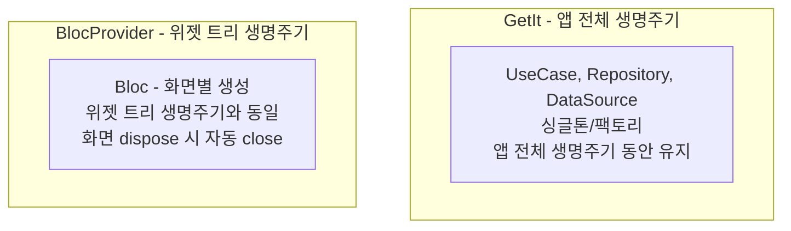
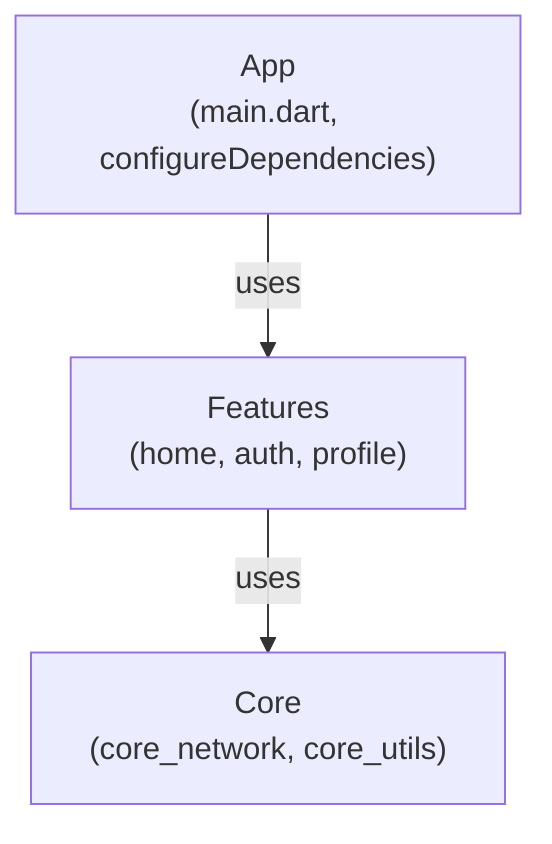

# Flutter Dependency Injection Guide

> **마지막 업데이트**: 2026-02-08 | **Flutter 3.38** | **Dart 3.10**
> **난이도**: 중급 | **카테고리**: infrastructure
> **선행 학습**: [Architecture](../core/Architecture.md)
> **예상 학습 시간**: 1.5h

> 이 문서는 GetIt과 Injectable을 사용한 의존성 주입 설정 방법을 설명합니다.

> **Flutter 3.27+ / Dart 3.6+** | get_it ^9.2.0 | injectable ^2.5.0 | injectable_generator ^2.7.0

> **학습 목표**: 이 문서를 학습하면 다음을 할 수 있습니다:
> - GetIt 컨테이너를 설정하고 서비스를 등록할 수 있다
> - Injectable 어노테이션으로 자동 DI 코드를 생성할 수 있다
> - 모듈별로 의존성을 분리하고 환경별 설정을 구성할 수 있다

## 1. 개요

### 1.1 의존성 주입이란?

```dart
// ❌ 강한 결합 - 직접 생성
class HomeBloc {
  final repository = HomeRepositoryImpl(HomeRemoteDataSource(Dio()));
}

// ✅ 느슨한 결합 - 외부에서 주입
class HomeBloc {
  final HomeRepository repository;
  HomeBloc(this.repository);  // 주입받음
}
```

### 1.2 GetIt + Injectable 조합

| 라이브러리 | 역할 |
|-----------|------|
| **GetIt** | Service Locator 패턴 구현 |
| **Injectable** | 어노테이션 기반 자동 등록 |

## 2. 프로젝트 설정

### 2.1 의존성 추가

```yaml
# pubspec.yaml (2026년 2월 기준)
dependencies:
  get_it: ^9.2.0          # 2026년 2월 기준 최신
  injectable: ^2.7.1      # 프로젝트 표준 버전

dev_dependencies:
  injectable_generator: ^2.12.0
  build_runner: ^2.11.0
```

> **get_it v9.0.0+ 주요 변경사항:**
> - Dart 3.0 이상 필수
> - `registerLazySingletonAsync` 추가
> - Scope 관리 API 개선 (`pushNewScope`, `popScope`)
> - `onDispose` 콜백에서 비동기 dispose 지원
> - 성능 최적화 및 메모리 관리 개선

### 2.2 Feature 모듈 구조

```
features/{feature_name}/lib/
├── src/
│   ├── injection.dart           # 수동 설정
│   └── injection.config.dart    # 자동 생성
├── data/
├── domain/
└── presentation/
```

## 3. Injectable 설정

### 3.1 Feature별 injection.dart

```dart
// features/home/lib/src/injection.dart
import 'package:get_it/get_it.dart';
import 'package:injectable/injectable.dart';

import 'injection.config.dart';

@InjectableInit.microPackage()
void initHomePackage(GetIt getIt) => getIt.init();
```

### 3.2 build.yaml 설정 (Feature 모듈)

```yaml
# features/home/build.yaml
targets:
  $default:
    builders:
      injectable_generator:injectable_builder:
        options:
          auto_register: true
          micro_package: true
```

### 3.3 App 모듈의 injection.dart

```dart
// app/lib/src/injection/injection.dart
import 'package:get_it/get_it.dart';
import 'package:injectable/injectable.dart';

// Feature 모듈 import
import 'package:home/src/injection.dart' as home;
import 'package:auth/src/injection.dart' as auth;
import 'package:profile/src/injection.dart' as profile;

// Core 모듈 import
import 'package:core_network/src/injection.dart' as network;

import 'injection.config.dart';

final getIt = GetIt.instance;

@InjectableInit()
Future<void> configureDependencies(String environment) async {
  // App 모듈 자체 등록
  getIt.init(environment: environment);

  // Core 모듈 초기화
  network.initNetworkPackage(getIt);

  // Feature 모듈 초기화
  home.initHomePackage(getIt);
  auth.initAuthPackage(getIt);
  profile.initProfilePackage(getIt);
}
```

## 4. 어노테이션 사용법

### 4.1 기본 어노테이션

| 어노테이션 | 설명 | 생명주기 |
|-----------|------|----------|
| `@injectable` | 기본 등록 | 매번 새 인스턴스 |
| `@singleton` | 싱글톤 등록 | 앱 전체에서 하나 |
| `@lazySingleton` | 지연 싱글톤 | 첫 사용 시 생성 |

### 4.2 DataSource 등록

```dart
// features/home/lib/data/datasources/home_remote_datasource.dart
import 'package:dio/dio.dart';
import 'package:injectable/injectable.dart';

abstract class HomeRemoteDataSource {
  Future<HomeDto> getHomeData();
}

@LazySingleton(as: HomeRemoteDataSource)
class HomeRemoteDataSourceImpl implements HomeRemoteDataSource {
  final Dio _dio;

  HomeRemoteDataSourceImpl(this._dio);

  @override
  Future<HomeDto> getHomeData() async {
    final response = await _dio.get('/api/home');
    return HomeDto.fromJson(response.data);
  }
}
```

### 4.3 Repository 등록

```dart
// features/home/lib/data/repositories/home_repository_impl.dart
import 'package:fpdart/fpdart.dart';
import 'package:injectable/injectable.dart';

@LazySingleton(as: HomeRepository)
class HomeRepositoryImpl implements HomeRepository {
  final HomeRemoteDataSource _dataSource;
  final HomeMapper _mapper;

  HomeRepositoryImpl(this._dataSource, this._mapper);

  @override
  Future<Either<HomeFailure, HomeData>> getHomeData() async {
    try {
      final dto = await _dataSource.getHomeData();
      return Right(_mapper.toEntity(dto));
    } on DioException catch (e) {
      return Left(HomeFailureMapper.fromDioException(e));
    }
  }
}
```

### 4.4 UseCase 등록

```dart
// features/home/lib/domain/usecases/get_home_data_usecase.dart
import 'package:injectable/injectable.dart';

@injectable
class GetHomeDataUseCase {
  final HomeRepository _repository;

  GetHomeDataUseCase(this._repository);

  Future<Either<HomeFailure, HomeData>> call() {
    return _repository.getHomeData();
  }
}
```

### 4.5 Mapper 등록

```dart
// features/home/lib/data/mappers/home_mapper.dart
import 'package:injectable/injectable.dart';

@lazySingleton
class HomeMapper {
  HomeData toEntity(HomeDto dto) {
    return HomeData(
      id: dto.id,
      title: dto.title,
      createdAt: dto.createdAt,
    );
  }
}

class HomeFailureMapper {
  static HomeFailure fromDioException(DioException e) {
    switch (e.type) {
      case DioExceptionType.connectionError:
        return const HomeFailure.network();
      case DioExceptionType.badResponse:
        return HomeFailure.server(e.message ?? 'Server error');
      default:
        return const HomeFailure.unknown();
    }
  }
}
```

## 5. Bloc 등록 (주의!)

### 5.1 절대 규칙: Bloc은 Injectable로 등록하지 않음

```dart
// ❌ 절대 금지 - Bloc을 GetIt에 등록하면 안됨!
// @injectable  // 이렇게 하면 안됨!
// class HomeBloc extends Bloc<HomeEvent, HomeState> { ... }

// ⚠️ Bloc은 GetIt에 등록하지 않음 - BlocProvider로 생성
// 이유:
// 1. BlocProvider가 dispose 시 Bloc.close()를 호출함
// 2. GetIt이 close된 Bloc을 다시 반환하면 에러 발생
// 3. "Bad state: Cannot add new events after calling close"

// ✅ 올바른 패턴: UseCase나 Repository만 GetIt에 등록
@injectable
class GetHomeDataUseCase {
  final HomeRepository _repository;

  GetHomeDataUseCase(this._repository);

  Future<Result> call() => _repository.getHomeData();
}
```

### 5.2 올바른 Bloc 생성 패턴

```dart
// ✅ BlocProvider에서 직접 생성
class HomeScreen extends StatelessWidget {
  const HomeScreen({super.key});

  @override
  Widget build(BuildContext context) {
    return BlocProvider(
      create: (_) => HomeBloc(
        GetIt.I<GetHomeDataUseCase>(),      // UseCase는 GetIt에서
        GetIt.I<UpdateHomeDataUseCase>(),   // 주입받음
      )..add(const HomeEvent.started()),  // ⚠️ 주의: 생성자에서 이벤트 발행 권장
      child: const _HomeView(),
    );
  }
}

// ✅ 더 나은 방법: Bloc 생성자 내부에서 이벤트 발행
class HomeBloc extends Bloc<HomeEvent, HomeState> {
  HomeBloc(this._getHomeDataUseCase) : super(const HomeState.initial()) {
    on<HomeStarted>(_onStarted);
    add(const HomeEvent.started());  // 생성자에서 발행
  }
}
```

### 5.3 생명주기 비교



## 6. 환경별 설정

### 6.1 Environment 정의

```dart
// app/lib/src/injection/environments.dart
abstract class Env {
  static const dev = 'dev';
  static const staging = 'staging';
  static const prod = 'prod';
}
```

### 6.2 환경별 구현체 등록

```dart
// core/core_network/lib/src/dio_client.dart
import 'package:injectable/injectable.dart';

abstract class DioClient {
  Dio get dio;
}

@LazySingleton(as: DioClient)
@Environment(Env.prod)
class ProdDioClient implements DioClient {
  late final Dio _dio;

  ProdDioClient() {
    _dio = Dio(BaseOptions(
      baseUrl: 'https://api.production.com',
      connectTimeout: const Duration(seconds: 10),
    ));
  }

  @override
  Dio get dio => _dio;
}

@LazySingleton(as: DioClient)
@Environment(Env.dev)
class DevDioClient implements DioClient {
  late final Dio _dio;

  DevDioClient() {
    _dio = Dio(BaseOptions(
      baseUrl: 'https://api.dev.com',
      connectTimeout: const Duration(seconds: 30),
    ));
    _dio.interceptors.add(LogInterceptor());
  }

  @override
  Dio get dio => _dio;
}

@LazySingleton(as: DioClient)
@Environment(Env.staging)
class StagingDioClient implements DioClient {
  late final Dio _dio;

  StagingDioClient() {
    _dio = Dio(BaseOptions(
      baseUrl: 'https://api.staging.com',
    ));
  }

  @override
  Dio get dio => _dio;
}
```

### 6.3 main.dart에서 환경 설정

```dart
// app/lib/main_dev.dart
import 'src/injection/injection.dart';
import 'src/injection/environments.dart';

void main() async {
  WidgetsFlutterBinding.ensureInitialized();
  await configureDependencies(Env.dev);
  runApp(const MyApp());
}

// app/lib/main_prod.dart
void main() async {
  WidgetsFlutterBinding.ensureInitialized();
  await configureDependencies(Env.prod);
  runApp(const MyApp());
}
```

## 7. 모듈 간 의존성

### 7.1 Core 모듈 (공통 인프라)

```dart
// core/core_network/lib/src/injection.dart
import 'package:get_it/get_it.dart';
import 'package:injectable/injectable.dart';

import 'injection.config.dart';

@InjectableInit.microPackage()
void initNetworkPackage(GetIt getIt) => getIt.init();
```

```dart
// core/core_network/lib/src/dio_provider.dart
import 'package:dio/dio.dart';
import 'package:injectable/injectable.dart';

@module
abstract class NetworkModule {
  @lazySingleton
  Dio dio(DioClient client) => client.dio;
}
```

### 7.2 Feature 모듈이 Core 사용

```dart
// features/home/lib/data/datasources/home_remote_datasource.dart
import 'package:dio/dio.dart';
import 'package:injectable/injectable.dart';

@LazySingleton(as: HomeRemoteDataSource)
class HomeRemoteDataSourceImpl implements HomeRemoteDataSource {
  final Dio _dio;  // Core에서 제공하는 Dio 주입받음

  HomeRemoteDataSourceImpl(this._dio);

  @override
  Future<HomeDto> getHomeData() async {
    final response = await _dio.get('/api/home');
    return HomeDto.fromJson(response.data);
  }
}
```

### 7.3 의존성 방향



## 8. Module 어노테이션

### 8.1 서드파티 라이브러리 등록

```dart
// core/core_network/lib/src/modules/network_module.dart
import 'package:dio/dio.dart';
import 'package:injectable/injectable.dart';

@module
abstract class NetworkModule {
  @lazySingleton
  Dio dio(DioClient client) => client.dio;

  @lazySingleton
  Connectivity connectivity() => Connectivity();
}
```

### 8.2 SharedPreferences 등록

```dart
// core/core_storage/lib/src/modules/storage_module.dart
import 'package:injectable/injectable.dart';
import 'package:shared_preferences/shared_preferences.dart';

@module
abstract class StorageModule {
  @preResolve
  // ⚠️ SharedPreferences.getInstance()는 deprecated입니다.
  // SharedPreferencesAsync 또는 SharedPreferencesWithCache 사용을 권장합니다.
  // 자세한 내용은 LocalStorage.md 섹션 3 참조
  Future<SharedPreferences> get prefs => SharedPreferences.getInstance();
}
```

### 8.3 preResolve 사용 시 main.dart

```dart
// preResolve가 있으면 async로 초기화
void main() async {
  WidgetsFlutterBinding.ensureInitialized();
  await configureDependencies(Env.prod);  // await 필수!
  runApp(const MyApp());
}
```

## 9. 테스트에서 DI 교체

### 9.1 테스트용 Mock 등록

```dart
// test/helpers/test_injection.dart
import 'package:get_it/get_it.dart';
import 'package:mocktail/mocktail.dart';

class MockHomeRepository extends Mock implements HomeRepository {}
class MockGetHomeDataUseCase extends Mock implements GetHomeDataUseCase {}

void setupTestDependencies() {
  final getIt = GetIt.instance;

  // 기존 등록 초기화
  getIt.reset();

  // Mock 등록
  getIt.registerSingleton<HomeRepository>(MockHomeRepository());
  getIt.registerLazySingleton<GetHomeDataUseCase>(
    () => MockGetHomeDataUseCase(),
  );
}

void tearDownTestDependencies() {
  GetIt.instance.reset();
}
```

### 9.2 테스트에서 사용

```dart
// test/presentation/bloc/home_bloc_test.dart
void main() {
  late MockGetHomeDataUseCase mockUseCase;

  setUp(() {
    setupTestDependencies();
    mockUseCase = GetIt.I<GetHomeDataUseCase>() as MockGetHomeDataUseCase;
  });

  tearDown(() {
    tearDownTestDependencies();
  });

  // 테스트...
}
```

## 10. 코드 생성

### 10.1 build_runner 실행

```bash
# 특정 Feature 모듈에서
cd features/home
dart run build_runner build --delete-conflicting-outputs

# 전체 프로젝트 (melos 사용)
melos run build_runner
```

### 10.2 melos.yaml 설정

```yaml
# melos.yaml
scripts:
  build_runner:
    run: melos exec -- dart run build_runner build --delete-conflicting-outputs
    description: Run build_runner in all packages

  build_runner:watch:
    run: melos exec -- dart run build_runner watch
    description: Watch mode for build_runner
```

### 10.3 생성되는 파일

```dart
// features/home/lib/src/injection.config.dart (자동 생성)
// GENERATED CODE - DO NOT MODIFY BY HAND

import 'package:get_it/get_it.dart' as _i1;
import 'package:injectable/injectable.dart' as _i2;

extension GetItInjectableX on _i1.GetIt {
  _i1.GetIt init({
    String? environment,
    _i2.EnvironmentFilter? environmentFilter,
  }) {
    final gh = _i2.GetItHelper(this, environment, environmentFilter);
    gh.lazySingleton<HomeRemoteDataSource>(
      () => HomeRemoteDataSourceImpl(gh<Dio>()),
    );
    gh.lazySingleton<HomeRepository>(
      () => HomeRepositoryImpl(
        gh<HomeRemoteDataSource>(),
        gh<HomeMapper>(),
      ),
    );
    gh.factory<GetHomeDataUseCase>(
      () => GetHomeDataUseCase(gh<HomeRepository>()),
    );
    return this;
  }
}
```

## 11. Best Practices

### 11.1 등록 전략

| 타입 | 어노테이션 | 이유 |
|------|-----------|------|
| DataSource | `@LazySingleton(as: Interface)` | 재사용, 인터페이스 바인딩 |
| Repository | `@LazySingleton(as: Interface)` | 상태 없음, 인터페이스 바인딩 |
| Mapper | `@lazySingleton` | 상태 없음, 구체 클래스 직접 등록 |
| UseCase | `@injectable` | 매번 새로 생성해도 무방 |
| Bloc | 등록 안함 | BlocProvider에서 관리 |

### 11.2 DO (이렇게 하세요)

```dart
// ✅ Interface에 대해 등록
@LazySingleton(as: HomeRepository)
class HomeRepositoryImpl implements HomeRepository { ... }

// ✅ 생성자 주입 사용
class GetHomeDataUseCase {
  final HomeRepository _repository;
  GetHomeDataUseCase(this._repository);
}

// ✅ Feature별 injection.dart 분리
// features/home/lib/src/injection.dart
// features/auth/lib/src/injection.dart
```

### 11.3 DON'T (하지 마세요)

```dart
// ❌ Bloc을 Injectable로 등록
@injectable
class HomeBloc extends Bloc { ... }

// ❌ GetIt 직접 호출 (비즈니스 로직에서)
class GetHomeDataUseCase {
  Future<Either<Failure, Data>> call() {
    final repo = GetIt.I<HomeRepository>();  // 직접 호출 금지
    return repo.getHomeData();
  }
}

// ❌ 구체 클래스에 대해 등록
@LazySingleton()  // as: Interface 없음
class HomeRepositoryImpl { ... }
```

## 12. 자주 하는 실수

### ❌ 순환 의존성

```dart
// A가 B를 의존, B가 A를 의존 → 에러!
@injectable
class ServiceA {
  final ServiceB b;
  ServiceA(this.b);
}

@injectable
class ServiceB {
  final ServiceA a;  // 순환!
  ServiceB(this.a);
}

// 해결: 인터페이스로 분리하거나 설계 재검토
```

### ❌ microPackage 설정 누락

```yaml
# features/home/build.yaml 없으면 생성 안됨!
targets:
  $default:
    builders:
      injectable_generator:injectable_builder:
        options:
          auto_register: true
          micro_package: true
```

### ❌ init 순서 오류

```dart
// Core를 먼저 초기화해야 Feature가 Dio 등을 주입받을 수 있음
Future<void> configureDependencies(String env) async {
  // 0. App 모듈 자체 등록
  getIt.init(environment: env);

  // 1. Core 먼저
  network.initNetworkPackage(getIt);
  storage.initStoragePackage(getIt);

  // 2. Feature 나중에
  home.initHomePackage(getIt);
  auth.initAuthPackage(getIt);
}
```

## 13. 디버깅

### 13.1 등록된 의존성 확인

```dart
void printRegisteredDependencies() {
  final getIt = GetIt.instance;
  debugPrint('=== Registered Dependencies ===');
  // GetIt은 직접 조회 기능이 제한적
  // 대신 injection.config.dart 파일 확인
}
```

### 13.2 의존성 누락 에러

```
Error: Object/factory with type HomeRepository is not registered
inside GetIt.

해결 방법:
1. @LazySingleton(as: HomeRepository) 어노테이션 확인
2. build_runner 재실행
3. injection.dart에서 initPackage 호출 확인
4. import 경로 확인
```

## 14. 참고

- [GetIt 공식 문서](https://pub.dev/packages/get_it)
- [Injectable 공식 문서](https://pub.dev/packages/injectable)
- [Injectable Generator](https://pub.dev/packages/injectable_generator)

## 관련 문서

| 문서 | 설명 |
|------|------|
| [Architecture.md](../core/Architecture.md) | DI가 적용되는 전체 아키텍처 |
| [Environment.md](./Environment.md) | 환경별 DI 설정 |
| [Bloc.md](../core/Bloc.md) | Bloc은 Injectable로 등록하지 않는 이유 |
| [Testing.md](../system/Testing.md) | DI Mock을 활용한 테스트 |

---

## 실습 과제

### 과제 1: Feature별 DI 모듈 구성
새로운 Feature(예: `profile`)를 만들고, Repository, DataSource, UseCase를 각각 Injectable로 등록하세요. `@module` 어노테이션으로 Feature 전용 모듈을 분리하세요.

### 과제 2: 환경별 DI 설정
`@Environment('dev')`와 `@Environment('prod')` 어노테이션을 활용하여 개발용 MockRepository와 프로덕션용 실제 Repository를 환경에 따라 자동 전환하세요.

### 과제 3: DI 기반 테스트 작성
GetIt에 등록된 서비스를 Mock으로 교체하여 UseCase의 Unit 테스트를 작성하세요.

## Self-Check

- [ ] GetIt 컨테이너에 서비스를 등록하고 주입받을 수 있는가?
- [ ] Injectable 어노테이션(@injectable, @singleton, @lazySingleton)의 차이를 설명할 수 있는가?
- [ ] @module을 사용하여 외부 라이브러리 의존성을 등록할 수 있는가?
- [ ] 환경별(@Environment)로 다른 구현체를 주입할 수 있는가?
- [ ] build_runner로 DI 코드를 자동 생성할 수 있는가?

---
**다음 문서:** [Environment](./Environment.md) - 환경별 설정 관리
