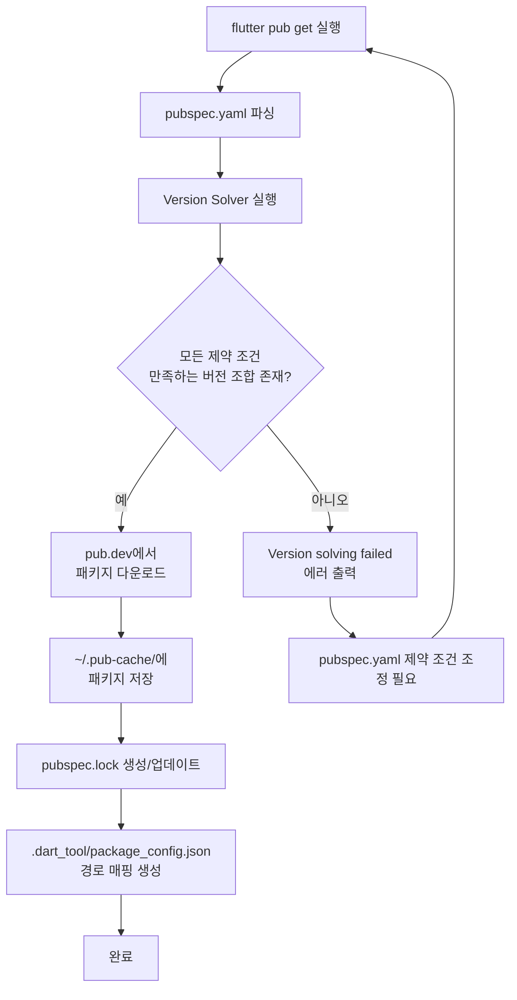
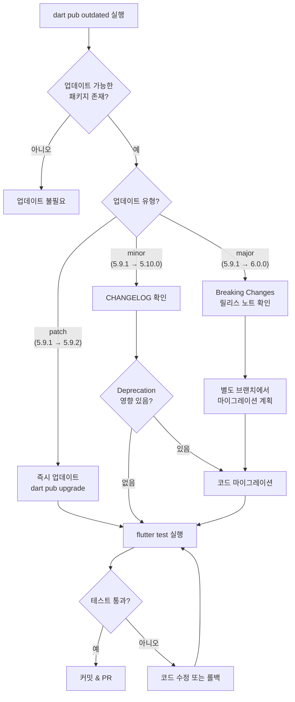
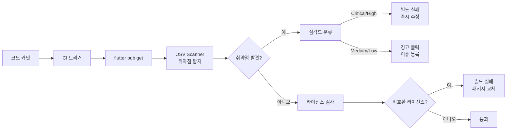
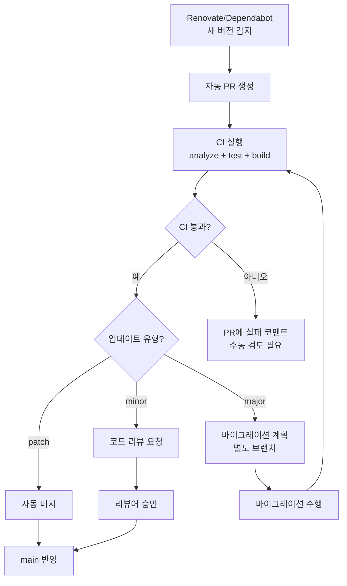

# Flutter 의존성 관리 전략 가이드 (Dependency Management)

> **마지막 업데이트**: 2026-02-08 | **Flutter 3.38** | **Dart 3.10**
> **난이도**: 중급 | **카테고리**: infrastructure
> **선행 학습**: [PackageDevelopment](./PackageDevelopment.md), [VersionMigration](./VersionMigration.md)
> **예상 학습 시간**: 1.5h

> Flutter 프로젝트의 의존성을 체계적으로 관리하기 위한 실무 가이드입니다. pubspec.yaml 구성부터 버전 제약 조건 전략, `pub outdated`/`pub upgrade` 활용, dependency_overrides 위험성, 보안 취약점 스캔, Renovate/Dependabot 자동화, Monorepo 의존성 관리, 베스트 프랙티스까지 다룹니다.

> **학습 목표**: 이 문서를 학습하면 다음을 할 수 있습니다:
> 1. pubspec.yaml의 구조를 이해하고, dependencies/dev_dependencies/dependency_overrides의 역할을 구분할 수 있다
> 2. 캐럿(`^`) 구문과 범위 지정 구문을 활용하여 프로젝트 유형에 맞는 버전 제약 조건을 설정할 수 있다
> 3. `dart pub outdated`와 `dart pub upgrade`를 활용하여 의존성을 안전하게 업데이트할 수 있다
> 4. dependency_overrides의 용도와 위험성을 이해하고, CI에서 이를 감지하여 차단할 수 있다
> 5. OSV Scanner와 라이선스 검사 도구를 활용하여 보안 취약점과 라이선스 컴플라이언스를 관리할 수 있다
> 6. Renovate 또는 Dependabot을 설정하여 의존성 업데이트 PR을 자동으로 생성하고 관리할 수 있다
> 7. Monorepo 환경에서 패키지 간 의존성을 효율적으로 관리할 수 있다

---

## 1. 의존성 관리 개요

### 1.1 pubspec.yaml의 역할과 구조

`pubspec.yaml`은 Flutter/Dart 프로젝트의 메타데이터와 의존성을 선언하는 핵심 설정 파일입니다.

```yaml
# pubspec.yaml 전체 구조
name: my_app
description: 내 Flutter 앱
version: 1.0.0+1
publish_to: 'none'  # 앱 프로젝트는 pub.dev에 배포하지 않음

# SDK 제약 조건
environment:
  sdk: '>=3.10.0 <4.0.0'
  flutter: '>=3.38.0'

# 프로덕션 의존성
dependencies:
  flutter:
    sdk: flutter
  dio: ^5.9.1
  flutter_bloc: ^9.1.1
  go_router: ^17.1.0
  freezed_annotation: ^3.2.5

# 개발 전용 의존성
dev_dependencies:
  flutter_test:
    sdk: flutter
  build_runner: ^2.4.15
  freezed: ^3.2.5
  flutter_lints: ^7.0.0
  mocktail: ^1.0.4

# 임시 버전 충돌 해결 (프로덕션 머지 전 반드시 제거)
dependency_overrides:
  # some_package: ^2.0.0
```

### 1.2 dependencies vs dev_dependencies vs dependency_overrides

| 구분 | 용도 | 빌드 포함 | 예시 |
|------|------|----------|------|
| **dependencies** | 앱 실행에 필요한 패키지 | O | dio, flutter_bloc, go_router |
| **dev_dependencies** | 개발/테스트/코드 생성 도구 | X | build_runner, freezed, mocktail |
| **dependency_overrides** | 버전 충돌 강제 해결 | 해당 패키지 따름 | 임시 충돌 해결 |

> **주의**: `dev_dependencies`에 넣어야 할 패키지를 `dependencies`에 넣으면 앱 바이너리 크기가 불필요하게 증가합니다. `build_runner`, `freezed`, `json_serializable` 등 코드 생성 도구는 반드시 `dev_dependencies`에 선언하세요.

### 1.3 Dart pub 패키지 매니저 동작 원리



### 1.4 pubspec.lock의 역할과 커밋 전략

`pubspec.lock`은 Version Solver가 결정한 정확한 버전 조합을 기록한 파일입니다.

| 프로젝트 유형 | pubspec.lock Git 커밋 | 이유 |
|-------------|---------------------|------|
| **앱 프로젝트** | O (커밋) | 모든 환경에서 동일한 버전 보장 |
| **라이브러리 패키지** | X (gitignore) | 소비자의 의존성과 충돌 방지 |

```yaml
# .gitignore (라이브러리 패키지용)
pubspec.lock
```

> 앱 프로젝트에서 `pubspec.lock`을 커밋하면 CI, 팀원, 스테이징 환경 모두에서 동일한 의존성 버전이 보장됩니다. 이는 "내 머신에서는 되는데" 문제를 방지하는 핵심입니다.

---

## 2. 버전 제약 조건 전략

### 2.1 버전 제약 구문

| 제약 구문 | 의미 | 허용 범위 |
|----------|------|----------|
| `^1.2.3` | `>=1.2.3 <2.0.0` | 1.2.3 ~ 1.x.x |
| `^0.2.3` | `>=0.2.3 <0.3.0` | 0.2.x만 (0.x는 불안정) |
| `>=1.0.0 <3.0.0` | 명시적 범위 | 1.x, 2.x |
| `1.2.3` | 정확히 1.2.3 | 1.2.3만 |
| `any` | 모든 버전 | 전체 (비권장) |

### 2.2 캐럿(^) 구문 심화

캐럿 구문은 Semantic Versioning의 "하위 호환" 원칙을 기반으로 동작합니다.

```yaml
# 캐럿 구문 해석 규칙
# 첫 번째 0이 아닌 버전 컴포넌트 기준으로 상위 범위 결정

^1.2.3    # >=1.2.3 <2.0.0  (major 기준)
^0.2.3    # >=0.2.3 <0.3.0  (minor 기준, 0.x는 불안정)
^0.0.3    # >=0.0.3 <0.0.4  (patch 기준, 매우 제한적)
^1.0.0    # >=1.0.0 <2.0.0
^2.0.0    # >=2.0.0 <3.0.0
```

실제 패키지 적용 예시:

```yaml
dependencies:
  # ^5.9.1 → 5.9.1, 5.9.2, 5.10.0 허용 / 6.0.0 차단
  dio: ^5.9.1

  # ^9.1.1 → 9.1.1 ~ 9.x.x 허용 / 10.0.0 차단
  flutter_bloc: ^9.1.1

  # ^17.1.0 → 17.1.0 ~ 17.x.x 허용 / 18.0.0 차단
  go_router: ^17.1.0
```

### 2.3 프로젝트 유형별 버전 제약 전략

**앱 프로젝트**: 캐럿 구문으로 구체적 버전 지정

```yaml
# 앱 프로젝트 pubspec.yaml
dependencies:
  dio: ^5.9.1              # 구체적 patch 버전 지정
  flutter_bloc: ^9.1.1     # 안정적인 minor 내에서 업데이트
  go_router: ^17.1.0       # 최신 호환 버전 자동 수신
```

**라이브러리 패키지**: 넓은 범위로 호환성 극대화

```yaml
# 라이브러리 패키지 pubspec.yaml
dependencies:
  # 넓은 범위로 소비자의 다른 패키지와 충돌 최소화
  http: '>=1.0.0 <3.0.0'
  meta: '>=1.12.0 <2.0.0'
```

> **핵심 차이**: 앱 프로젝트는 "예측 가능성"이, 라이브러리 패키지는 "호환성"이 우선입니다.

### 2.4 Pre-release 버전

```yaml
dependencies:
  # Pre-release 버전 사용
  some_package: ^1.0.0-beta.1

  # Pre-release 태그 종류
  # alpha: 초기 개발 (불안정)
  # beta: 기능 완성, 버그 수정 중
  # rc (Release Candidate): 릴리스 직전
  # dev: 개발 빌드
```

> **주의**: Pre-release 버전은 프로덕션 앱에서 사용을 피하세요. 테스트 또는 사전 검증 목적으로만 사용합니다.

### 2.5 SDK 제약 조건

```yaml
environment:
  # Dart SDK 제약: 프로젝트가 요구하는 최소/최대 Dart 버전
  sdk: '>=3.10.0 <4.0.0'

  # Flutter SDK 제약: 프로젝트가 요구하는 최소 Flutter 버전
  flutter: '>=3.38.0'
```

SDK 제약 설정 원칙:

| 상황 | 권장 설정 | 이유 |
|------|----------|------|
| 신규 프로젝트 | `sdk: '>=3.10.0 <4.0.0'` | 현재 stable SDK 기준 |
| 기존 프로젝트 업그레이드 | 하한만 상향 | 하위 호환 유지 |
| 라이브러리 패키지 | 가능한 낮은 하한 | 더 많은 프로젝트에서 사용 가능 |
| Flutter SDK 의존 | `flutter: '>=3.38.0'` 명시 | 네이티브 API 호환 보장 |

### 2.6 정확한 버전 vs 범위: 언제 무엇을 사용할까

```yaml
# ❌ 정확한 버전 고정 (비권장)
dependencies:
  dio: 5.9.1          # 패치 업데이트도 받지 못함

# ✅ 캐럿 구문 (권장)
dependencies:
  dio: ^5.9.1         # 하위 호환 업데이트 자동 수신

# ⚠️ any (매우 비권장)
dependencies:
  dio: any            # 어떤 버전이든 설치 → 예측 불가
```

정확한 버전 고정이 정당화되는 유일한 경우:

- 특정 버전에서만 발생하는 치명적 버그를 회피할 때
- 패키지 저자가 Semantic Versioning을 준수하지 않아 patch 업데이트에서도 breaking change가 발생할 때

---

## 3. `pub outdated` / `pub upgrade` 실전 활용

### 3.1 `dart pub outdated` 출력 읽는 법

```bash
# 의존성 업데이트 현황 확인
dart pub outdated
```

출력 예시:

```
Package Name       Current  Upgradable  Resolvable  Latest
direct dependencies:
dio                5.7.0    5.9.1       5.9.1       5.9.1
flutter_bloc       8.1.6    8.1.6       9.1.1       9.1.1
go_router          14.6.2   14.6.2      17.1.0      17.1.0
freezed_annotation 2.4.4    2.4.4       3.2.5       3.2.5

dev_dependencies:
build_runner       2.4.9    2.4.15      2.4.15      2.4.15
mocktail           1.0.3    1.0.4       1.0.4       1.0.4
```

각 컬럼의 의미:

| 컬럼 | 의미 | 조건 |
|------|------|------|
| **Current** | 현재 설치된 버전 | `pubspec.lock` 기준 |
| **Upgradable** | pubspec.yaml 제약 내 최신 버전 | `pub upgrade`로 도달 가능 |
| **Resolvable** | 다른 의존성과 호환되는 최신 버전 | 제약 변경 필요할 수 있음 |
| **Latest** | pub.dev에 게시된 최신 버전 | 호환성 무관 |

> **해석 팁**: `Current`와 `Upgradable`이 같으면 캐럿 범위 내 최신 상태입니다. `Upgradable`과 `Resolvable`이 다르면 major 업그레이드가 필요합니다.

### 3.2 업데이트 명령어 비교

```bash
# 캐럿 범위 내 업데이트 (안전, pubspec.yaml 변경 없음)
dart pub upgrade

# 미리 보기 (실제 변경 없이 결과만 확인)
dart pub upgrade --dry-run

# major 버전 포함 업그레이드 (pubspec.yaml 자동 수정)
dart pub upgrade --major-versions

# 특정 패키지만 업그레이드
dart pub upgrade dio

# 특정 패키지만 major 포함 업그레이드
dart pub upgrade --major-versions dio flutter_bloc

# 다운그레이드 (문제 발생 시 롤백)
dart pub downgrade

# 특정 패키지만 다운그레이드
dart pub downgrade dio
```

### 3.3 의존성 트리 시각화

```bash
# 전체 의존성 트리 (상세)
dart pub deps

# 컴팩트 모드 (요약)
dart pub deps -s compact

# 특정 패키지의 의존 경로 확인
dart pub deps -s compact | grep dio
```

`dart pub deps` 출력 예시:

```
my_app 1.0.0
├── dio 5.9.1
│   ├── dio_web_adapter 2.1.1
│   ├── http_parser 4.1.2
│   └── path 1.9.1
├── flutter_bloc 9.1.1
│   ├── bloc 9.0.0
│   ├── flutter 0.0.0
│   └── provider 6.1.5
└── go_router 17.1.0
    ├── flutter 0.0.0
    ├── collection 1.19.2
    └── logging 1.3.0
```

### 3.4 주간 의존성 감사 워크플로우

```bash
#!/bin/bash
# scripts/dependency-audit.sh
# 매주 실행하는 의존성 감사 스크립트

set -euo pipefail

echo "=== 의존성 감사 시작 ==="

# 1. 업데이트 가능한 패키지 확인
echo "[1/4] 업데이트 현황 확인..."
dart pub outdated

# 2. 보안 취약점 스캔
echo "[2/4] 보안 취약점 스캔..."
osv-scanner --lockfile=pubspec.lock || true

# 3. 라이선스 확인
echo "[3/4] 의존성 트리 확인..."
dart pub deps -s compact

# 4. 미사용 의존성 확인 (수동 검토)
echo "[4/4] pubspec.yaml 의존성 목록:"
grep -A 100 '^dependencies:' pubspec.yaml | grep -B 100 '^dev_dependencies:' | head -n -1

echo "=== 감사 완료 ==="
```

### 3.5 의존성 업데이트 판단 플로우



### 3.6 CI에서 `pub outdated` 활용

```yaml
# .github/workflows/dependency-check.yml
name: Dependency Check

on:
  schedule:
    - cron: '0 9 * * 1'  # 매주 월요일 오전 9시
  workflow_dispatch:

jobs:
  check:
    runs-on: ubuntu-latest
    steps:
      - uses: actions/checkout@v4

      - uses: subosito/flutter-action@v2
        with:
          flutter-version: '3.38.0'
          channel: stable

      - run: flutter pub get

      # 업데이트 가능한 패키지 보고
      - name: Check outdated dependencies
        run: dart pub outdated --color

      # major 업데이트가 있으면 경고
      - name: Check major updates
        run: |
          MAJOR_UPDATES=$(dart pub outdated --json | jq '[.packages[] | select(.current != .latest)] | length')
          if [ "$MAJOR_UPDATES" -gt 0 ]; then
            echo "::warning::$MAJOR_UPDATES 개 패키지에 업데이트가 있습니다"
          fi
```

---

## 4. dependency_overrides 활용과 위험성

### 4.1 dependency_overrides란?

`dependency_overrides`는 Version Solver의 제약 조건을 강제로 무시하고 특정 버전을 사용하도록 지정하는 기능입니다.

```yaml
# pubspec.yaml
dependency_overrides:
  # 버전 충돌 임시 해결
  collection: ^1.19.0

  # 로컬 패키지 개발 시 경로 지정
  my_shared_lib:
    path: ../my_shared_lib

  # Git 저장소의 수정된 버전 사용
  some_package:
    git:
      url: https://github.com/my-team/some_package.git
      ref: fix/flutter-3.38-compat
```

### 4.2 사용이 정당화되는 경우

| 상황 | 예시 | 주의사항 |
|------|------|---------|
| **임시 충돌 해결** | 패키지 A와 B가 공유 의존성 버전 불일치 | 패키지 업데이트 후 즉시 제거 |
| **로컬 패키지 개발** | 모노레포 내 패키지 개발 시 path 참조 | Melos 사용 시 자동 관리 |
| **패키지 포크 테스트** | 수정한 패키지를 머지 전 테스트 | PR 머지 후 공식 버전으로 교체 |
| **버그 패치 대기** | 패키지 저자가 수정을 배포하기 전 | 임시 조치임을 명확히 문서화 |

### 4.3 위험성

```yaml
# ⚠️ 경고: dependency_overrides가 숨기는 문제들

dependency_overrides:
  shared_lib: ^3.0.0
  # 1. 패키지 A는 shared_lib 2.x API를 사용
  #    → 런타임 NoSuchMethodError 발생 가능
  # 2. 패키지 B의 내부 동작이 달라질 수 있음
  #    → 예측 불가능한 동작
  # 3. 실제 호환성 문제를 가림
  #    → 근본 원인 해결 지연
```

### 4.4 CI에서 dependency_overrides 감지 및 차단

```yaml
# .github/workflows/ci.yml
- name: dependency_overrides 감지
  run: |
    if grep -q "dependency_overrides:" pubspec.yaml; then
      echo "::error::pubspec.yaml에 dependency_overrides가 포함되어 있습니다."
      echo "프로덕션 머지 전에 반드시 제거하세요."
      exit 1
    fi
```

```bash
# Git pre-commit hook으로도 설정 가능
# .git/hooks/pre-commit
#!/bin/bash
if grep -q "dependency_overrides:" pubspec.yaml; then
  echo "❌ dependency_overrides가 pubspec.yaml에 있습니다."
  echo "   프로덕션 머지 전에 제거해야 합니다."
  echo "   --no-verify 플래그로 우회할 수 있지만 권장하지 않습니다."
  exit 1
fi
```

### 4.5 머지 전 체크리스트

dependency_overrides를 main 브랜치에 머지하기 전에 반드시 확인:

- [ ] override의 이유가 PR 설명에 문서화되어 있는가?
- [ ] 임시 조치인 경우, 해결 기한이 명시되어 있는가?
- [ ] 관련 패키지에 이슈가 등록되어 있는가?
- [ ] override를 제거해도 빌드/테스트가 통과하는지 확인했는가?
- [ ] override가 가리는 실제 호환성 문제를 이해하고 있는가?

> **원칙**: dependency_overrides는 `pubspec.yaml`의 "기술 부채" 표시입니다. 가능한 빨리 제거하세요.

---

## 5. 보안 취약점 스캔

### 5.1 OSV Scanner (Google Open Source Vulnerability Scanner)

OSV Scanner는 Google이 개발한 오픈소스 취약점 스캐너로, `pubspec.lock` 파일을 분석하여 알려진 보안 취약점을 탐지합니다.

```bash
# 설치
dart pub global activate osv_scanner

# 또는 Go로 설치 (더 빠름)
go install github.com/google/osv-scanner/cmd/osv-scanner@latest

# 기본 스캔
osv-scanner --lockfile=pubspec.lock

# JSON 출력 (CI 파이프라인용)
osv-scanner --lockfile=pubspec.lock --format json

# 재귀 스캔 (모노레포)
osv-scanner -r .
```

출력 예시:

```
Scanned pubspec.lock and found 42 packages
╔═══════════════════╤════════════════╤══════════════════════════════╗
║ Package           │ Version        │ Vulnerability                ║
╠═══════════════════╪════════════════╪══════════════════════════════╣
║ http              │ 0.13.6         │ GHSA-xxxx: HTTP 헤더 인젝션  ║
║ url_launcher      │ 6.1.2          │ CVE-2024-xxxx: URL 스푸핑     ║
╚═══════════════════╧════════════════╧══════════════════════════════╝
```

### 5.2 GitHub Actions CI 통합

```yaml
# .github/workflows/security-scan.yml
name: Security Scan

on:
  push:
    branches: [main]
  pull_request:
    branches: [main]
  schedule:
    - cron: '0 0 * * 0'  # 매주 일요일 자정

jobs:
  vulnerability-scan:
    runs-on: ubuntu-latest
    steps:
      - uses: actions/checkout@v4

      - uses: subosito/flutter-action@v2
        with:
          flutter-version: '3.38.0'
          channel: stable

      - run: flutter pub get

      # OSV Scanner로 취약점 탐지
      - name: OSV Scanner
        uses: google/osv-scanner-action/osv-scanner-action@v1
        with:
          scan-args: |
            --lockfile=pubspec.lock
            --format=sarif
            --output=osv-results.sarif

      # 결과를 GitHub Security 탭에 업로드
      - name: Upload SARIF
        if: always()
        uses: github/codeql-action/upload-sarif@v3
        with:
          sarif_file: osv-results.sarif
```

### 5.3 라이선스 컴플라이언스 검사

```bash
# 의존성 트리에서 패키지 목록 추출
dart pub deps -s compact

# pana로 라이선스 분석 (패키지 개발 시)
dart pub global activate pana
dart pub global run pana --no-warning
```

라이선스 호환성 가이드:

| 라이선스 | 상용 앱 사용 | 주의사항 |
|---------|------------|---------|
| **MIT** | O | 저작권 고지 포함 |
| **BSD-2/3** | O | 저작권 고지 포함 |
| **Apache-2.0** | O | 저작권 고지 + 변경사항 명시 |
| **LGPL** | 조건부 | 동적 링크 시 가능, 정적 링크 주의 |
| **GPL** | X (주의) | 파생물 전체 GPL 적용 |
| **MPL-2.0** | O | 수정한 파일만 공개 |

```bash
# 라이선스 자동 검사 스크립트
#!/bin/bash
# scripts/check-licenses.sh

echo "=== 라이선스 검사 ==="
# pub.dev API로 각 패키지 라이선스 확인
dart pub deps -s compact | tail -n +2 | while read -r line; do
  PACKAGE=$(echo "$line" | awk '{print $1}')
  if [ -n "$PACKAGE" ]; then
    echo "  $PACKAGE: $(grep -r 'license' ~/.pub-cache/hosted/pub.dev/$PACKAGE*/pubspec.yaml 2>/dev/null | head -1 || echo '확인 필요')"
  fi
done
```

### 5.4 공급망 공격 인식

Dart/Flutter 생태계에서 주의해야 할 공급망 공격 벡터:

- **타이포스쿼팅**: 유명 패키지와 유사한 이름의 악성 패키지 (`futter_bloc`, `deo` 등)
- **의존성 혼동**: 내부 패키지와 같은 이름의 공개 패키지
- **메인테이너 계정 탈취**: 신뢰할 수 있던 패키지에 악성 코드 주입

방어 전략:

- pub.dev에서 패키지의 **Verified Publisher** 배지 확인
- 새 패키지 추가 시 소스 코드 리뷰
- `pubspec.lock`을 항상 커밋하여 의도하지 않은 버전 변경 방지
- CI에서 OSV Scanner 필수 실행

### 5.5 보안 스캔 파이프라인



---

## 6. Renovate / Dependabot 자동화

### 6.1 Renovate vs Dependabot 비교

| 기능 | Renovate | Dependabot |
|------|----------|------------|
| **Flutter/Dart 지원** | 우수 (pub 매니저 네이티브) | 기본 (pub 지원) |
| **그룹 업데이트** | 유연한 그룹 전략 | 제한적 |
| **자동 머지** | 조건부 자동 머지 지원 | GitHub 설정으로 가능 |
| **스케줄 설정** | 매우 유연 (cron 포함) | 주간/월간/일간 |
| **PR 레이블** | 자동 레이블 + 커스텀 | 제한적 |
| **모노레포 지원** | 우수 | 기본 |
| **설치** | GitHub App 또는 Self-hosted | GitHub 내장 |
| **비용** | 무료 (오픈소스) | 무료 |

> **권장**: Flutter 프로젝트에는 Renovate를 권장합니다. 그룹 전략과 자동 머지 설정이 더 유연합니다.

### 6.2 Renovate 설정 (Flutter)

```json5
// renovate.json
{
  "$schema": "https://docs.renovatebot.com/renovate-schema.json",
  "extends": [
    "config:recommended"
  ],
  // Flutter/Dart pub 매니저 활성화
  "flutter": {
    "enabled": true
  },
  "packageRules": [
    {
      // patch 업데이트: 자동 머지
      "matchManagers": ["pub"],
      "matchUpdateTypes": ["patch"],
      "automerge": true,
      "labels": ["dependencies", "auto-merge"],
      "commitMessagePrefix": "fix(deps):"
    },
    {
      // minor 업데이트: 함께 그룹화
      "matchManagers": ["pub"],
      "matchUpdateTypes": ["minor"],
      "groupName": "minor dependency updates",
      "labels": ["dependencies", "minor"],
      "commitMessagePrefix": "chore(deps):",
      "schedule": ["every 2 weeks on Monday"]
    },
    {
      // major 업데이트: 개별 PR
      "matchManagers": ["pub"],
      "matchUpdateTypes": ["major"],
      "labels": ["dependencies", "major", "breaking-change"],
      "commitMessagePrefix": "feat(deps)!:",
      "schedule": ["every month on the first day of the month"],
      "automerge": false
    },
    {
      // dev_dependencies는 더 적극적으로 업데이트
      "matchManagers": ["pub"],
      "matchDepTypes": ["dev_dependencies"],
      "groupName": "dev dependencies",
      "automerge": true,
      "labels": ["dependencies", "dev"]
    },
    {
      // flutter SDK는 별도 관리
      "matchManagers": ["pub"],
      "matchPackageNames": ["flutter"],
      "enabled": false
    }
  ],
  // PR 설정
  "prConcurrentLimit": 5,
  "prHourlyLimit": 2,
  "timezone": "Asia/Seoul",
  "schedule": ["after 9am and before 6pm every weekday"],
  // 리뷰어 지정
  "reviewers": ["team:flutter-team"],
  "assignees": ["lead-developer"]
}
```

### 6.3 Dependabot 설정

```yaml
# .github/dependabot.yml
version: 2
updates:
  # Flutter/Dart 의존성
  - package-ecosystem: "pub"
    directory: "/"
    schedule:
      interval: "weekly"
      day: "monday"
      time: "09:00"
      timezone: "Asia/Seoul"
    # 최대 동시 PR 수
    open-pull-requests-limit: 10
    # 라벨 지정
    labels:
      - "dependencies"
      - "flutter"
    # 커밋 메시지 형식
    commit-message:
      prefix: "chore(deps)"
      include: "scope"
    # major 업데이트 무시 (수동 관리)
    ignore:
      - dependency-name: "*"
        update-types: ["version-update:semver-major"]

  # GitHub Actions 워크플로우
  - package-ecosystem: "github-actions"
    directory: "/"
    schedule:
      interval: "weekly"
    labels:
      - "ci"
      - "dependencies"
```

> **Dependabot의 한계**: Dependabot은 pub 생태계를 지원하지만, Renovate에 비해 그룹 전략이 제한적이고 Flutter 특화 기능이 부족합니다.

### 6.4 자동 머지 워크플로우

```yaml
# .github/workflows/auto-merge.yml
name: Auto Merge Dependabot/Renovate PRs

on:
  pull_request:
    types: [opened, synchronize, reopened]

permissions:
  contents: write
  pull-requests: write

jobs:
  auto-merge:
    runs-on: ubuntu-latest
    if: >
      (github.actor == 'dependabot[bot]' || github.actor == 'renovate[bot]') &&
      contains(github.event.pull_request.labels.*.name, 'auto-merge')

    steps:
      - uses: actions/checkout@v4

      - uses: subosito/flutter-action@v2
        with:
          flutter-version: '3.38.0'
          channel: stable

      - run: flutter pub get
      - run: dart analyze --fatal-infos
      - run: flutter test

      # 모든 CI 체크 통과 시 자동 머지
      - name: Auto-merge PR
        if: success()
        run: gh pr merge --auto --squash "$PR_URL"
        env:
          PR_URL: ${{ github.event.pull_request.html_url }}
          GH_TOKEN: ${{ secrets.GITHUB_TOKEN }}
```

### 6.5 자동 업데이트 사이클



---

## 7. Monorepo 의존성 관리

> Melos를 활용한 모노레포 전체 구조와 설정은 [멀티 모듈](../advanced/ModularArchitecture.md)을 참조하세요. 이 섹션에서는 의존성 관리에 초점을 맞춥니다.

### 7.1 Melos workspace 의존성 관리

```yaml
# melos.yaml
name: my_workspace
repository: https://github.com/team/my_workspace

packages:
  - packages/**

command:
  bootstrap:
    usePubspecOverrides: true  # pubspec_overrides.yaml 자동 생성
    runPubGetInParallel: true  # 병렬 pub get

scripts:
  outdated:
    run: dart pub outdated
    description: 모든 패키지의 의존성 업데이트 확인
    packageFilters:
      flutter: true

  upgrade:
    run: dart pub upgrade
    description: 모든 패키지 의존성 업그레이드
```

### 7.2 공유 제약 조건과 pubspec_overrides.yaml

`melos bootstrap`을 실행하면 로컬 패키지 간 의존성을 `pubspec_overrides.yaml`로 자동 관리합니다.

```yaml
# packages/features/pubspec.yaml
dependencies:
  my_core:
    # pub.dev에 배포된 버전 (CI/CD용)
    hosted: ^1.0.0

# packages/features/pubspec_overrides.yaml (melos bootstrap 자동 생성)
dependency_overrides:
  my_core:
    path: ../core
```

> **주의**: `pubspec_overrides.yaml`은 `.gitignore`에 추가하세요. 이 파일은 로컬 개발 환경에서만 사용되며, CI에서는 pub.dev의 공식 버전을 사용해야 합니다.

### 7.3 Path 의존성

```yaml
# 로컬 패키지 참조 (모노레포 내)
dependencies:
  my_core:
    path: ../core

  my_shared:
    path: ../shared

# 장점: 코드 변경 즉시 반영, 디버깅 용이
# 단점: pub.dev 배포 시 제거 필요
```

### 7.4 `melos bootstrap` 워크플로우

```bash
# 1. Melos 설치 (전역)
dart pub global activate melos

# 2. 모노레포 초기화 (모든 패키지 pub get + 로컬 의존성 연결)
melos bootstrap

# 3. 전체 패키지 의존성 상태 확인
melos run outdated

# 4. 전체 패키지 업그레이드
melos run upgrade
```

### 7.5 패키지 간 버전 정렬

모노레포 내 패키지들이 동일한 외부 의존성을 사용할 때, 버전을 일치시켜야 합니다.

```yaml
# 모든 패키지에서 동일한 버전 사용 권장
# packages/core/pubspec.yaml
dependencies:
  dio: ^5.9.1
  freezed_annotation: ^3.2.5

# packages/features/pubspec.yaml
dependencies:
  dio: ^5.9.1              # core와 동일한 버전
  freezed_annotation: ^3.2.5  # core와 동일한 버전
```

> **팁**: Melos의 `version` 명령으로 패키지 버전을 일괄 업데이트할 수 있습니다. Melos 전체 가이드는 [멀티 모듈](../advanced/ModularArchitecture.md)을 참조하세요.

---

## 8. 의존성 관리 베스트 프랙티스

### 8.1 패키지 선정 기준

pub.dev에서 패키지를 선택할 때 확인해야 할 항목:

| 기준 | 확인 방법 | 권장 수준 |
|------|----------|----------|
| **pub.dev 점수** | pub.dev 패키지 페이지 | 120점 이상 |
| **Popularity** | 사용자 수 기반 | 상위 패키지 |
| **Likes** | 커뮤니티 선호도 | 100+ |
| **Verified Publisher** | 배지 확인 | 있음 (필수) |
| **최근 업데이트** | 마지막 커밋/릴리스 | 6개월 이내 |
| **이슈 대응** | GitHub Issues 탭 | 활발한 대응 |
| **Flutter 호환** | SDK 제약 확인 | 현재 stable 지원 |
| **Null safety** | Sound null safety | 필수 |

### 8.2 의존성 예산 (Dependency Budget)

```
직접 의존성 수 ≤ 20~30개를 목표로 유지
```

- 의존성이 많을수록 버전 충돌 확률 증가
- 전이적 의존성(transitive dependencies)까지 고려하면 실제 의존성은 10배 이상
- 유사 기능 패키지 중복 사용 방지 (예: `http`와 `dio` 동시 사용)

### 8.3 전이적 의존성 인식

```bash
# 직접 의존성 vs 전이적 의존성 확인
dart pub deps

# 예: dio 하나를 추가하면 실제로는 10개 이상의 패키지가 설치됨
# dio 5.9.1
#   ├── dio_web_adapter 2.1.1
#   ├── http_parser 4.1.2
#   │   └── source_span ...
#   │       └── ...
#   └── path 1.9.1
```

> **팁**: 직접 의존성을 추가하기 전에 `dart pub deps`로 전이적 의존성의 영향을 확인하세요.

### 8.4 Lock 파일 관리

```bash
# pubspec.lock이 변경된 경우 커밋 전 확인
git diff pubspec.lock

# 불필요한 lock 변경이 포함되었는지 검토
# (의도하지 않은 의존성 변경 방지)
```

### 8.5 정기 감사 스케줄

| 주기 | 작업 | 명령어 |
|------|------|--------|
| **매주** | 패치 업데이트 적용 | `dart pub upgrade` |
| **격주** | 보안 취약점 스캔 | `osv-scanner --lockfile=pubspec.lock` |
| **월간** | minor 업데이트 검토 | `dart pub outdated` |
| **분기** | major 업데이트 계획 | `dart pub upgrade --major-versions --dry-run` |
| **반기** | 미사용 의존성 정리 | 수동 코드 리뷰 |

### 8.6 의존성 결정 문서화 (ADR)

중요한 의존성 추가/변경은 Architecture Decision Record로 문서화합니다.

```markdown
# ADR-005: HTTP 클라이언트 dio 도입

## 상태: 승인

## 맥락
HTTP 통신을 위한 클라이언트 라이브러리가 필요합니다.

## 후보
- http: 공식 Dart 패키지, 기본적
- dio: 인터셉터, 취소, 파일 업로드 지원
- chopper: 코드 생성 기반

## 결정
dio ^5.9.1을 사용합니다.

## 이유
- 인터셉터 체인으로 인증/로깅/캐싱 처리
- FormData, 파일 업로드 네이티브 지원
- Retrofit과 조합하여 타입 안전한 API 클라이언트 구성
- 커뮤니티 점유율 1위
```

---

## 9. 트러블슈팅

### 9.1 "Because X depends on Y which doesn't match..." 해결

```
에러 예시:
Because my_app depends on package_a >=2.0.0 which requires shared >=3.0.0,
and my_app depends on package_b >=1.0.0 which requires shared <3.0.0,
version solving failed.
```

해결 순서:

```bash
# 1. 충돌하는 패키지 식별
dart pub deps -s compact | grep shared

# 2. 양쪽 패키지의 최신 버전 확인
dart pub outdated

# 3. 최신 버전으로 업그레이드하여 제약 범위 갱신
dart pub upgrade --major-versions package_a package_b

# 4. 여전히 충돌하면 pubspec.yaml 제약 조건 직접 조정
# 5. 최후의 수단: dependency_overrides (임시)
```

> 버전 충돌 해결의 체계적인 전략은 [버전 충돌 해결](./VersionMigration.md#6-version-solver-충돌-해결)을 참조하세요.

### 9.2 Pub 캐시 손상

```bash
# 증상: 패키지가 다운로드되었지만 임포트 실패, 빌드 오류

# 해결 1: 특정 패키지 캐시 복구
dart pub cache repair

# 해결 2: 전체 캐시 초기화
dart pub cache clean --force
dart pub get

# 캐시 위치 확인
# macOS/Linux: ~/.pub-cache/
# Windows: %LOCALAPPDATA%/Pub/Cache
```

### 9.3 네트워크 문제: PUB_HOSTED_URL 미러

```bash
# 중국 또는 네트워크 제한 환경에서 pub.dev 접근 불가 시

# 환경 변수로 미러 설정
export PUB_HOSTED_URL=https://pub.flutter-io.cn
export FLUTTER_STORAGE_BASE_URL=https://storage.flutter-io.cn

# 또는 .bashrc / .zshrc에 영구 설정
echo 'export PUB_HOSTED_URL=https://pub.flutter-io.cn' >> ~/.zshrc
echo 'export FLUTTER_STORAGE_BASE_URL=https://storage.flutter-io.cn' >> ~/.zshrc

# 프록시 설정 (기업 환경)
export HTTP_PROXY=http://proxy.company.com:8080
export HTTPS_PROXY=http://proxy.company.com:8080
```

### 9.4 전이적 의존성 충돌

```bash
# 증상: 직접 의존성은 문제없지만 전이적 의존성이 충돌

# 1. 의존성 트리에서 문제 패키지 추적
dart pub deps | grep -A 5 "problematic_package"

# 2. 어떤 직접 의존성이 문제를 일으키는지 확인
dart pub deps -s compact

# 3. 해결 전략:
#    a) 직접 의존성을 최신으로 업그레이드
#    b) 충돌하는 직접 의존성 중 하나를 대안 패키지로 교체
#    c) dependency_overrides로 임시 해결 (최후의 수단)
```

### 9.5 플랫폼별 의존성 문제

```yaml
# 플랫폼 제한 패키지 처리
dependencies:
  # 모든 플랫폼 지원
  dio: ^5.9.1

  # 모바일 전용 패키지
  camera: ^0.11.0+2  # iOS, Android만 지원

  # Web에서 대체 구현 필요 시 조건부 임포트
```

```dart
// 조건부 임포트로 플랫폼별 구현 분기
import 'mobile_camera.dart'
    if (dart.library.html) 'web_camera.dart';
```

### 9.6 빈번한 문제 요약

| 증상 | 원인 | 해결 방법 |
|------|------|----------|
| `pub get` 무한 대기 | 네트워크/DNS 문제 | `PUB_HOSTED_URL` 확인, 프록시 설정 |
| `Version solving failed` | 패키지 간 제약 충돌 | `dart pub deps`로 충돌 추적, [버전 충돌 해결](./VersionMigration.md#6-version-solver-충돌-해결) 참조 |
| `Couldn't resolve package` | 패키지명 오타, 비공개 패키지 | 패키지명/URL 확인 |
| `SDK version mismatch` | pubspec.yaml SDK 제약 구버전 | `environment.sdk` 업데이트 |
| 빌드 성공, 런타임 크래시 | `dependency_overrides` 부작용 | overrides 제거 후 재테스트 |
| `pub cache` 관련 오류 | 캐시 손상 | `dart pub cache clean --force` |

---

## Self-Check (자가 점검)

다음 항목을 모두 이해하고 수행할 수 있는지 확인하세요:

- [ ] pubspec.yaml의 `dependencies`, `dev_dependencies`, `dependency_overrides`의 역할과 차이를 설명할 수 있다
- [ ] `pubspec.lock`의 역할을 이해하고, 앱 프로젝트와 라이브러리 패키지에서의 커밋 전략 차이를 설명할 수 있다
- [ ] 캐럿 구문(`^1.2.3`)의 해석 규칙을 이해하고, `^0.2.3`과 `^1.2.3`의 차이를 설명할 수 있다
- [ ] 앱 프로젝트와 라이브러리 패키지에서 적절한 버전 제약 전략을 선택할 수 있다
- [ ] `dart pub outdated` 출력의 Current, Upgradable, Resolvable, Latest 컬럼을 해석할 수 있다
- [ ] `dart pub upgrade`와 `dart pub upgrade --major-versions`의 차이를 이해하고 적절히 사용할 수 있다
- [ ] `dart pub deps`로 의존성 트리를 분석하고, 전이적 의존성 충돌을 추적할 수 있다
- [ ] `dependency_overrides`의 용도, 위험성, CI 차단 방법을 설명할 수 있다
- [ ] OSV Scanner를 설치하고 `pubspec.lock`의 보안 취약점을 스캔할 수 있다
- [ ] GitHub Actions에서 보안 취약점 자동 스캔 파이프라인을 구성할 수 있다
- [ ] 패키지 라이선스의 상용 앱 호환성을 판단할 수 있다 (MIT, BSD, Apache, GPL 등)
- [ ] Renovate의 `renovate.json`을 설정하여 patch/minor/major 업데이트별 전략을 구성할 수 있다
- [ ] Dependabot의 `.github/dependabot.yml`을 설정하여 자동 PR을 구성할 수 있다
- [ ] 자동 머지 워크플로우를 구성하여 patch 업데이트를 자동으로 반영할 수 있다
- [ ] Melos 기반 모노레포에서 `pubspec_overrides.yaml`의 역할과 패키지 간 버전 정렬을 관리할 수 있다
- [ ] 주간/월간 의존성 감사 프로세스를 수행할 수 있다
- [ ] `Version solving failed` 에러를 분석하고 해결할 수 있다
- [ ] pub 캐시 손상, 네트워크 문제, 플랫폼별 의존성 문제를 트러블슈팅할 수 있다

---

## 참고 자료

- [Dart Package Dependencies](https://dart.dev/tools/pub/dependencies)
- [Version Constraints](https://dart.dev/tools/pub/versioning)
- [dart pub CLI](https://dart.dev/tools/pub/cmd)
- [OSV Scanner](https://github.com/google/osv-scanner)
- [Renovate Documentation](https://docs.renovatebot.com/)
- [Dependabot Documentation](https://docs.github.com/en/code-security/dependabot)

---

## 관련 문서

- [패키지 개발](./PackageDevelopment.md) - 패키지 개발, 배포, Semantic Versioning
- [버전 마이그레이션](./VersionMigration.md) - FVM, Flutter 업그레이드, Version Solver 충돌 해결
- [CI 파이프라인](./CICD.md) - CI/CD 파이프라인에서의 의존성 관리
- [의존성 주입](./DI.md) - GetIt/Injectable을 활용한 DI 패턴
- [멀티 모듈](../advanced/ModularArchitecture.md) - Melos 모노레포 전체 가이드

---

**Package Versions (2026년 2월 기준)**
- dio: ^5.9.1
- flutter_bloc: ^9.1.1
- go_router: ^17.1.0
- freezed_annotation: ^3.2.5
- build_runner: ^2.4.15
- melos: ^7.0.0
- pana: ^0.22.18
