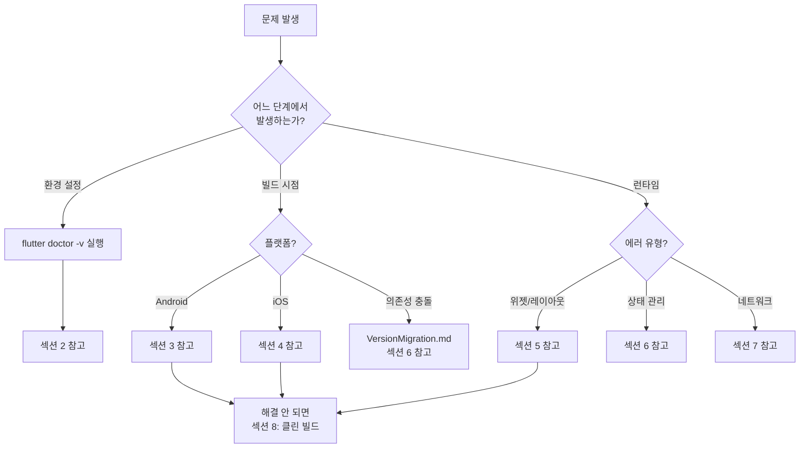
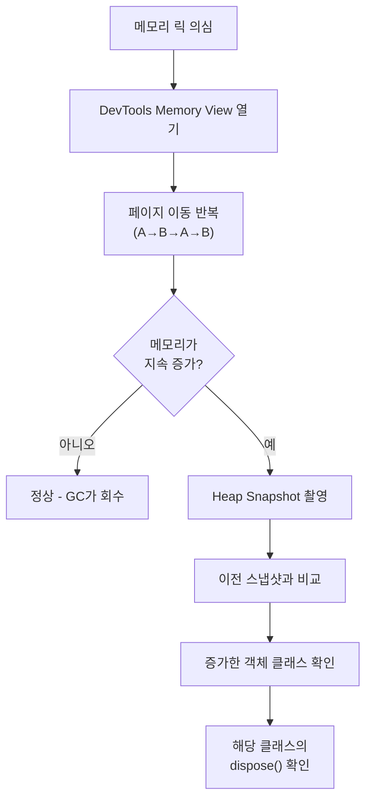
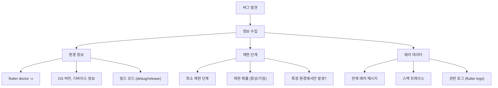

# Flutter 트러블슈팅 가이드 (Troubleshooting)

> **마지막 업데이트**: 2026-02-08 | **Flutter 3.38** | **Dart 3.10**
> **난이도**: 중급 | **카테고리**: infrastructure
> **선행 학습**: [CICD](./CICD.md), [VersionMigration](./VersionMigration.md)
> **예상 학습 시간**: 1.5h (필요시 참조)

> Flutter 앱 개발 중 발생하는 빌드 에러, 런타임 에러, 상태 관리 문제, 네트워킹 이슈를 체계적으로 진단하고 해결하는 실무 가이드입니다. 정확한 에러 메시지와 복사-붙여넣기 가능한 해결 명령어를 제공합니다.

> **학습 목표**: 이 문서를 학습하면 다음을 할 수 있습니다:
> 1. `flutter doctor` 출력을 완전히 해석하고, 각 항목의 문제를 해결할 수 있다
> 2. Android 빌드 에러(Gradle, AGP, Kotlin, Multidex)의 원인을 파악하고 수정할 수 있다
> 3. iOS 빌드 에러(CocoaPods, Xcode 서명, Swift 버전)의 원인을 파악하고 수정할 수 있다
> 4. Flutter 런타임 에러(setState after dispose, RenderFlex overflow 등)를 코드 수준에서 해결할 수 있다
> 5. Bloc 상태 관리 디버깅 기법을 활용하여 상태 업데이트 문제를 추적할 수 있다
> 6. 네트워크 디버깅 도구(Charles, Proxyman, Dio Interceptor)를 설정하고 활용할 수 있다
> 7. 체계적 트러블슈팅 프로세스(재현 → 격리 → 수정 → 검증)를 적용할 수 있다

---

## 목차

1. [트러블슈팅 개요](#1-트러블슈팅-개요)
2. [flutter doctor 완전 해석](#2-flutter-doctor-완전-해석)
3. [빌드 에러 (Android)](#3-빌드-에러-android)
4. [빌드 에러 (iOS)](#4-빌드-에러-ios)
5. [런타임 에러](#5-런타임-에러)
6. [상태 관리 디버깅](#6-상태-관리-디버깅)
7. [네트워킹 디버깅](#7-네트워킹-디버깅)
8. [핵심 명령어 모음](#8-핵심-명령어-모음)
9. [자주 묻는 질문 (FAQ)](#9-자주-묻는-질문-faq)
10. [에러 보고 템플릿](#10-에러-보고-템플릿)
11. [Self-Check (자가 점검)](#11-self-check-자가-점검)

---

## 1. 트러블슈팅 개요

### 1.1 체계적 디버깅 접근법

트러블슈팅은 **재현 → 격리 → 수정 → 검증** 4단계를 반드시 따라야 합니다. 직감에 의존하면 시간을 낭비하고, 근본 원인이 아닌 증상만 해결하게 됩니다.

| 단계 | 목적 | 핵심 질문 |
|------|------|----------|
| **재현 (Reproduce)** | 문제를 안정적으로 발생시킴 | 어떤 조건에서 항상 발생하는가? |
| **격리 (Isolate)** | 원인 범위를 좁힘 | 어디에서 발생하는가? (빌드? 런타임? 특정 플랫폼?) |
| **수정 (Fix)** | 근본 원인을 제거 | 증상이 아닌 원인을 수정했는가? |
| **검증 (Verify)** | 수정이 올바른지 확인 | 원래 문제가 해결되었고, 새로운 문제가 없는가? |

### 1.2 도구별 사용 시점

| 도구 | 사용 시점 | 명령어 |
|------|----------|--------|
| `flutter doctor` | 개발 환경 문제 | `flutter doctor -v` |
| `dart analyze` | 정적 분석 경고/에러 | `dart analyze --fatal-infos` |
| `flutter build` | 빌드 에러 | `flutter build apk --verbose` |
| **DevTools** | 런타임 성능/메모리 | `dart devtools` |
| `flutter logs` | 디바이스 로그 확인 | `flutter logs` |
| `adb logcat` | Android 네이티브 로그 | `adb logcat -s flutter` |

> **참고**: DevTools 심화 사용법은 [DevToolsProfiling](../system/DevToolsProfiling.md)을 참고하세요.

### 1.3 트러블슈팅 판단 흐름도



---

## 2. flutter doctor 완전 해석

### 2.1 flutter doctor 출력 구조

`flutter doctor`는 Flutter 개발 환경의 상태를 점검하는 핵심 도구입니다. `-v` 플래그를 사용하면 상세 정보를 확인할 수 있습니다.

```bash
# 기본 점검
flutter doctor

# 상세 점검 (권장)
flutter doctor -v
```

출력 아이콘의 의미:

| 아이콘 | 의미 | 조치 |
|--------|------|------|
| `[✓]` | 정상 | 조치 불필요 |
| `[!]` | 경고 (부분 설정) | 확인 필요, 대부분 동작함 |
| `[✗]` | 에러 (미설치/미설정) | 반드시 해결 필요 |

### 2.2 각 점검 항목 설명

```
[✓] Flutter (Channel stable, 3.38.0, on macOS 15.3, locale ko-KR)
[✓] Android toolchain - develop for Android devices (Android SDK version 35.0.0)
[✓] Xcode - develop for iOS and macOS (Xcode 16.2)
[✓] Chrome - develop for the web
[✓] Android Studio (version 2024.3)
[✓] VS Code (version 1.96.0)
[✓] Connected device (3 available)
[✓] Network resources
```

| 항목 | 점검 내용 |
|------|----------|
| **Flutter** | SDK 설치 경로, 채널, 버전, Dart 버전, 프레임워크/엔진 리비전 |
| **Android toolchain** | Android SDK 설치, `sdkmanager`, JDK, 라이선스 수락 |
| **Xcode** | Xcode 설치, Command Line Tools, CocoaPods |
| **Chrome** | Chrome 브라우저 (Web 개발용) |
| **Android Studio** | IDE 설치, Flutter/Dart 플러그인 |
| **VS Code** | IDE 설치, Flutter Extension |
| **Connected device** | 연결된 디바이스/에뮬레이터 |
| **Network resources** | pub.dev, storage.googleapis.com 접근 가능 여부 |

### 2.3 주요 실패 항목과 해결법

#### Android 라이선스 미수락

```
[!] Android toolchain
    ✗ Android license status unknown.
      Run `flutter doctor --android-licenses` to accept the SDK package licenses.
```

```bash
# 해결: 라이선스 전부 수락
flutter doctor --android-licenses
# 모든 프롬프트에 'y' 입력

# cmdline-tools가 없는 경우
sdkmanager --install "cmdline-tools;latest"
```

#### Xcode 미설정

```
[!] Xcode - develop for iOS and macOS
    ✗ Xcode installation is incomplete; a full installation is necessary for iOS and macOS development.
    ✗ CocoaPods not installed.
```

```bash
# Xcode Command Line Tools 설치
sudo xcode-select --install

# Xcode 라이선스 수락
sudo xcodebuild -license accept

# CocoaPods 설치
sudo gem install cocoapods
# 또는 Homebrew로 설치
brew install cocoapods
```

#### Android Studio 플러그인 누락

```
[!] Android Studio (version 2024.3)
    ✗ Flutter plugin not installed; this adds Flutter specific functionality.
    ✗ Dart plugin not installed; this adds Dart specific functionality.
```

```
해결:
1. Android Studio 실행
2. Settings (Preferences) → Plugins
3. "Flutter" 검색 → Install (Dart 플러그인 자동 포함)
4. IDE 재시작
```

#### CocoaPods 버전 문제

```
[!] Xcode
    ! CocoaPods 1.12.0 out of date (1.16.2 is recommended).
```

```bash
# CocoaPods 업데이트
sudo gem install cocoapods

# Apple Silicon Mac에서 권한 문제 발생 시
brew install cocoapods

# pod 캐시 정리
pod cache clean --all
```

#### Network resources 실패

```
[✗] Network resources
    ✗ A network error occurred while checking "https://pub.dev/"
```

```bash
# 중국/사내 방화벽 환경에서 미러 설정
export PUB_HOSTED_URL=https://pub.flutter-io.cn
export FLUTTER_STORAGE_BASE_URL=https://storage.flutter-io.cn

# 프록시 환경에서
export HTTP_PROXY=http://proxy.company.com:8080
export HTTPS_PROXY=http://proxy.company.com:8080
export NO_PROXY=localhost,127.0.0.1
```

---

## 3. 빌드 에러 (Android)

> **참고**: 버전 솔버 충돌(`Version solving failed`)은 [VersionMigration](./VersionMigration.md) 섹션 6에서, 플랫폼 설정 마이그레이션(`compileSdk`, `settings.gradle.kts`)은 [VersionMigration](./VersionMigration.md) 섹션 7에서 자세히 다룹니다.

### 3.1 Gradle 빌드 실패

#### compileSdk 버전 불일치

```
에러 메시지:
> The compileSdk (33) should not be lower than the targetSdk (34).

또는:
> Dependency requires compileSdk version 35, but this build uses version 34.
```

**원인**: 프로젝트의 `compileSdk`가 플러그인이 요구하는 버전보다 낮음

```groovy
// android/app/build.gradle.kts
// 수정 전
android {
    compileSdk = 34
}

// 수정 후 - 플러그인이 요구하는 최소 버전 이상으로 설정
android {
    compileSdk = 35
}
```

#### AGP (Android Gradle Plugin) 버전 호환성

```
에러 메시지:
> Minimum supported Gradle version is 8.7. Current version is 8.3.
> Could not resolve com.android.tools.build:gradle:8.7.3.
```

**원인**: AGP 버전과 Gradle 버전 간 호환성 불일치

| AGP 버전 | 최소 Gradle 버전 | 권장 Gradle 버전 |
|----------|----------------|----------------|
| 8.7.x | 8.9 | 8.11.1 |
| 8.5.x | 8.7 | 8.9 |
| 8.3.x | 8.4 | 8.6 |
| 8.1.x | 8.0 | 8.2 |

```groovy
// android/settings.gradle.kts
plugins {
    id("com.android.application") version "8.7.3" apply false
    id("org.jetbrains.kotlin.android") version "2.1.0" apply false
}
```

```properties
# android/gradle/wrapper/gradle-wrapper.properties
# Gradle 버전 업그레이드
distributionUrl=https\://services.gradle.org/distributions/gradle-8.11.1-all.zip
```

#### Kotlin 버전 충돌

```
에러 메시지:
> Module was compiled with an incompatible version of Kotlin. The binary version
  of its metadata is 2.1.0, expected version is 1.9.0.
```

**원인**: 프로젝트의 Kotlin 버전이 플러그인이 사용하는 버전보다 낮음

```groovy
// android/settings.gradle.kts
plugins {
    // Kotlin 버전을 플러그인이 요구하는 버전 이상으로 설정
    id("org.jetbrains.kotlin.android") version "2.1.0" apply false
}
```

```bash
# 현재 프로젝트에서 사용 중인 Kotlin 버전 확인
cd android && ./gradlew dependencies | grep kotlin
```

#### minSdk 충돌

```
에러 메시지:
> uses-sdk:minSdkVersion 19 cannot be smaller than version 21 declared in library
  [:some_plugin]
```

**원인**: 플러그인이 요구하는 `minSdk`가 프로젝트 설정보다 높음

```groovy
// android/app/build.gradle.kts
android {
    defaultConfig {
        // 플러그인이 요구하는 최소 버전으로 올림
        minSdk = 21  // 또는 flutter.minSdkVersion 사용
    }
}
```

```bash
# 어떤 플러그인이 높은 minSdk를 요구하는지 확인
cd android && ./gradlew app:dependencies --configuration releaseRuntimeClasspath
```

#### Multidex 이슈

```
에러 메시지:
> Cannot fit requested classes in a single dex file (# methods: 72456 > 65536)
```

**원인**: 앱의 메서드 수가 65,536개 (64K) 제한을 초과

```groovy
// android/app/build.gradle.kts
android {
    defaultConfig {
        // minSdk 21 이상이면 자동 지원 (별도 설정 불필요)
        // minSdk 20 이하인 경우에만 필요:
        multiDexEnabled = true
    }
}
```

```groovy
// minSdk 20 이하인 경우 의존성 추가
dependencies {
    implementation("androidx.multidex:multidex:2.0.1")
}
```

> **참고**: Flutter 3.38에서 기본 `minSdk`는 21이므로, 대부분의 프로젝트에서 Multidex는 자동 지원됩니다.

#### Jetifier 이슈 (AndroidX 마이그레이션)

```
에러 메시지:
> This project uses AndroidX dependencies, but the 'android.useAndroidX'
  property is not enabled.
```

**원인**: AndroidX로 마이그레이션되지 않은 구형 프로젝트

```properties
# android/gradle.properties
android.useAndroidX=true
android.enableJetifier=true
```

```bash
# Jetifier가 더 이상 필요 없는지 확인 (모든 의존성이 AndroidX인 경우)
cd android && ./gradlew checkJetifier

# 불필요 시 비활성화 (빌드 속도 향상)
# android/gradle.properties에서 android.enableJetifier=false
```

### 3.2 ProGuard / R8 코드 축소 문제

```
에러 메시지:
> Warning: Missing class: com.google.android.gms.common.internal.safeparcel.SafeParcelable
> Error: R8: Type com.example.SomeClass is defined multiple times.
```

**원인**: R8 코드 축소 과정에서 특정 클래스가 제거되거나 충돌

```
# android/app/proguard-rules.pro

# Flutter 기본 규칙
-keep class io.flutter.app.** { *; }
-keep class io.flutter.plugin.** { *; }
-keep class io.flutter.util.** { *; }
-keep class io.flutter.view.** { *; }
-keep class io.flutter.** { *; }
-keep class io.flutter.plugins.** { *; }

# JSON 직렬화 (freezed/json_serializable 사용 시)
-keepattributes *Annotation*
-keep class * extends com.google.gson.TypeAdapter
-keep class * implements com.google.gson.TypeAdapterFactory
```

```groovy
// android/app/build.gradle.kts
android {
    buildTypes {
        release {
            isMinifyEnabled = true
            isShrinkResources = true
            proguardFiles(
                getDefaultProguardFile("proguard-android-optimize.txt"),
                "proguard-rules.pro"
            )
        }
    }
}
```

### 3.3 NDK 버전 충돌

```
에러 메시지:
> NDK is not installed. Install it via the SDK Manager.
> No version of NDK matched the requested version 25.1.8937393.
```

```bash
# 필요한 NDK 버전 설치
sdkmanager --install "ndk;25.1.8937393"

# 또는 프로젝트에서 사용할 NDK 버전 지정
```

```groovy
// android/app/build.gradle.kts
android {
    ndkVersion = "25.1.8937393"
}
```

### 3.4 settings.gradle.kts 마이그레이션 문제

```
에러 메시지:
> Could not find method id() for arguments [dev.flutter.flutter-plugin-loader]
> A problem occurred configuring root project.
```

**원인**: Flutter 3.27+ 에서 `settings.gradle` → `settings.gradle.kts` 마이그레이션 필요

```kotlin
// android/settings.gradle.kts (올바른 형식)
pluginManagement {
    val flutterSdkPath = run {
        val properties = java.util.Properties()
        file("local.properties").inputStream().use { properties.load(it) }
        val flutterSdkPath = properties.getProperty("flutter.sdk")
        require(flutterSdkPath != null) { "flutter.sdk not set in local.properties" }
        flutterSdkPath
    }

    includeBuild("$flutterSdkPath/packages/flutter_tools/gradle")

    repositories {
        google()
        mavenCentral()
        gradlePluginPortal()
    }
}

plugins {
    id("dev.flutter.flutter-plugin-loader") version "1.0.0"
    id("com.android.application") version "8.7.3" apply false
    id("org.jetbrains.kotlin.android") version "2.1.0" apply false
}

include(":app")
```

> **참고**: `settings.gradle.kts` 마이그레이션의 전체 절차는 [VersionMigration](./VersionMigration.md) 섹션 7.1을 참고하세요.

---

## 4. 빌드 에러 (iOS)

> **참고**: FVM 관련 iOS 이슈는 [VersionMigration](./VersionMigration.md) 섹션 10을, Podfile 설정 마이그레이션은 [VersionMigration](./VersionMigration.md) 섹션 7.2를 참고하세요.

### 4.1 CocoaPods 문제

#### pod install 실패

```
에러 메시지:
> [!] CocoaPods could not find compatible versions for pod "Firebase/CoreOnly":
>   In Podfile:
>     firebase_core (from `.symlinks/plugins/firebase_core/ios`) was resolved to 3.12.1,
>     which depends on Firebase/CoreOnly (~> 11.8.0)
```

```bash
# 1단계: Pod 캐시 정리 후 재설치
cd ios
rm -rf Pods Podfile.lock .symlinks
pod install --repo-update

# 2단계: 그래도 실패하면 CocoaPods 캐시 전체 정리
pod cache clean --all
pod repo update
pod install
```

#### CDN 타임아웃

```
에러 메시지:
> CDN: trunk URL couldn't be downloaded: https://cdn.cocoapods.org/...
> URL: https://cdn.cocoapods.org/all_pods_versions_2_2_2.txt Response: Timeout
```

```ruby
# ios/Podfile - CDN 대신 Git 소스 사용
# 맨 위에 추가
source 'https://github.com/CocoaPods/Specs.git'
# 기존 CDN 소스 제거 (있는 경우)
# source 'https://cdn.cocoapods.org/'
```

```bash
# 또는 CDN 타임아웃 재시도
pod install --repo-update --verbose
```

#### Spec 저장소 오래됨

```
에러 메시지:
> [!] Unable to find a specification for `some_pod` depended upon by `some_plugin`
```

```bash
# Spec 저장소 업데이트
pod repo update

# trunk 저장소 제거 후 재추가
pod repo remove trunk
pod setup
pod install --repo-update
```

#### 모듈 컴파일 에러

```
에러 메시지:
> Module 'some_module' not found
> Could not build module 'Flutter'
```

```bash
# 해결 단계
cd ios

# 1. Pods 및 빌드 캐시 삭제
rm -rf Pods Podfile.lock
rm -rf ~/Library/Developer/Xcode/DerivedData/*

# 2. Flutter 빌드 정리
cd ..
flutter clean

# 3. 재설치
flutter pub get
cd ios && pod install --repo-update
```

### 4.2 Xcode 빌드 실패

#### Minimum Deployment Target 충돌

```
에러 메시지:
> The iOS deployment target 'IPHONEOS_DEPLOYMENT_TARGET' is set to 12.0,
  but the range of supported deployment target versions is 13.0 to 18.2.99.
```

**원인**: 프로젝트 또는 플러그인의 iOS 최소 배포 타겟이 낮음

```ruby
# ios/Podfile
platform :ios, '13.0'  # 최소 버전을 13.0 이상으로 설정

# 모든 Pod에 일괄 적용
post_install do |installer|
  installer.pods_project.targets.each do |target|
    flutter_additional_ios_build_settings(target)
    target.build_configurations.each do |config|
      config.build_settings['IPHONEOS_DEPLOYMENT_TARGET'] = '13.0'
    end
  end
end
```

#### Swift 버전 충돌

```
에러 메시지:
> Module compiled with Swift 5.9 cannot be imported by the Swift 6.0 compiler
```

```ruby
# ios/Podfile - post_install 블록에 추가
post_install do |installer|
  installer.pods_project.targets.each do |target|
    flutter_additional_ios_build_settings(target)
    target.build_configurations.each do |config|
      config.build_settings['SWIFT_VERSION'] = '5.0'
    end
  end
end
```

#### 서명 및 Capabilities 에러

```
에러 메시지:
> Signing for "Runner" requires a development team.
> No profiles for 'com.example.app' were found.
> Provisioning profile "xxx" has expired.
```

```
해결 단계:
1. Xcode에서 Runner.xcworkspace 열기
2. Runner 타겟 선택 → Signing & Capabilities 탭
3. "Automatically manage signing" 체크
4. Team 선택 (Apple Developer 계정)
5. Bundle Identifier가 올바른지 확인
```

```bash
# 커맨드라인에서 인증서 확인
security find-identity -v -p codesigning

# 프로비저닝 프로파일 목록
ls ~/Library/MobileDevice/Provisioning\ Profiles/
```

#### Bitcode 관련 (deprecated)

```
에러 메시지:
> Building with bitcode is deprecated. Please update your project and/or target
  settings to disable bitcode.
```

```ruby
# ios/Podfile - post_install에 추가
post_install do |installer|
  installer.pods_project.targets.each do |target|
    flutter_additional_ios_build_settings(target)
    target.build_configurations.each do |config|
      config.build_settings['ENABLE_BITCODE'] = 'NO'
    end
  end
end
```

> **참고**: Xcode 14+에서 Bitcode는 완전히 deprecated되었습니다. 모든 프로젝트에서 비활성화하는 것이 권장됩니다.

#### "No such module" 에러

```
에러 메시지:
> No such module 'Flutter'
> No such module 'firebase_core'
```

```bash
# 해결 단계
# 1. 프로젝트 정리
flutter clean
flutter pub get

# 2. iOS 빌드 캐시 완전 삭제
cd ios
rm -rf Pods Podfile.lock .symlinks
rm -rf ~/Library/Developer/Xcode/DerivedData/*
pod install --repo-update

# 3. Xcode에서 빌드 (Runner.xcworkspace 사용, .xcodeproj가 아님)
open Runner.xcworkspace
# Product → Clean Build Folder (Cmd+Shift+K)
# 빌드 실행 (Cmd+R)
```

### 4.3 Archive / IPA 생성 문제

#### Archive 빌드 실패

```
에러 메시지:
> error: exportArchive: No signing certificate "iOS Distribution" found
```

```bash
# 인증서 확인
security find-identity -v -p codesigning

# Flutter로 IPA 빌드
flutter build ipa --release

# ExportOptions.plist 지정
flutter build ipa --export-options-plist=ios/ExportOptions.plist
```

```xml
<!-- ios/ExportOptions.plist 예시 -->
<?xml version="1.0" encoding="UTF-8"?>
<!DOCTYPE plist PUBLIC "-//Apple//DTD PLIST 1.0//EN"
  "http://www.apple.com/DTDs/PropertyList-1.0.dtd">
<plist version="1.0">
<dict>
    <key>method</key>
    <string>app-store</string>
    <key>teamID</key>
    <string>TEAM_ID_HERE</string>
    <key>uploadSymbols</key>
    <true/>
    <key>compileBitcode</key>
    <false/>
</dict>
</plist>
```

#### "Command PhaseScriptExecution failed" (빌드 스크립트)

```
에러 메시지:
> Command PhaseScriptExecution failed with a nonzero exit code
> Script 'Pods/Target Support Files/Pods-Runner/Pods-Runner-frameworks.sh'
```

```bash
# 1. Xcode DerivedData 삭제
rm -rf ~/Library/Developer/Xcode/DerivedData/*

# 2. Pods 재설치
cd ios
rm -rf Pods Podfile.lock
pod install --repo-update

# 3. 빌드 캐시 초기화 후 재빌드
flutter clean && flutter pub get
flutter build ios --release
```

---

## 5. 런타임 에러

### 5.1 setState() called after dispose()

```
에러 메시지:
> setState() called after dispose(): _MyWidgetState#12345(lifecycle state: defunct, not mounted)
> This error happens if you call setState() on a State object for a widget that
  no longer appears in the widget tree.
```

**원인**: 비동기 작업(API 호출, Timer 등)이 완료된 후 이미 dispose된 위젯의 `setState()`를 호출

```dart
// 잘못된 코드
class _MyWidgetState extends State<MyWidget> {
  void _loadData() async {
    final data = await apiService.fetchData();
    setState(() {  // 위젯이 이미 dispose된 후 호출될 수 있음
      _data = data;
    });
  }
}

// 올바른 코드: mounted 체크 추가
class _MyWidgetState extends State<MyWidget> {
  void _loadData() async {
    final data = await apiService.fetchData();
    if (!mounted) return;  // 위젯이 여전히 트리에 있는지 확인
    setState(() {
      _data = data;
    });
  }
}
```

```dart
// 더 나은 해결: Timer/StreamSubscription 정리
class _MyWidgetState extends State<MyWidget> {
  Timer? _timer;
  StreamSubscription? _subscription;

  @override
  void initState() {
    super.initState();
    _timer = Timer.periodic(
      const Duration(seconds: 5),
      (_) => _loadData(),
    );
    _subscription = someStream.listen(_onData);
  }

  @override
  void dispose() {
    _timer?.cancel();         // Timer 해제
    _subscription?.cancel();  // Stream 구독 해제
    super.dispose();
  }
}
```

### 5.2 RenderBox was not laid out

```
에러 메시지:
> RenderBox was not laid out: RenderRepaintBoundary#12345 NEEDS-LAYOUT NEEDS-PAINT
> 'package:flutter/src/rendering/box.dart':
>  Failed assertion: line 1702 pos 12: 'hasSize'
```

**원인**: 위젯에 크기 정보가 전달되지 않음 (주로 `ListView`를 `Column` 안에 넣을 때)

```dart
// 잘못된 코드
Column(
  children: [
    ListView.builder(  // Column 안에서 무한 높이를 차지하려 함
      itemCount: items.length,
      itemBuilder: (context, index) => ListTile(title: Text(items[index])),
    ),
  ],
)

// 올바른 코드 1: Expanded로 감싸기
Column(
  children: [
    Expanded(
      child: ListView.builder(
        itemCount: items.length,
        itemBuilder: (context, index) => ListTile(title: Text(items[index])),
      ),
    ),
  ],
)

// 올바른 코드 2: SizedBox로 고정 높이 지정
Column(
  children: [
    SizedBox(
      height: 300,
      child: ListView.builder(
        itemCount: items.length,
        itemBuilder: (context, index) => ListTile(title: Text(items[index])),
      ),
    ),
  ],
)

// 올바른 코드 3: shrinkWrap 사용 (항목 수가 적을 때만)
Column(
  children: [
    ListView.builder(
      shrinkWrap: true,  // 내용물 크기만큼만 차지
      physics: const NeverScrollableScrollPhysics(),  // 스크롤 비활성화
      itemCount: items.length,
      itemBuilder: (context, index) => ListTile(title: Text(items[index])),
    ),
  ],
)
```

### 5.3 A RenderFlex overflowed

```
에러 메시지:
> A RenderFlex overflowed by 42 pixels on the bottom.
> The overflowing RenderFlex has an orientation of Axis.vertical.
```

**원인**: `Row` 또는 `Column`의 자식 위젯이 사용 가능한 공간을 초과

```dart
// 잘못된 코드
Row(
  children: [
    Text('매우 긴 텍스트가 화면 너비를 초과하면 오버플로우 발생합니다'),
    Icon(Icons.arrow_forward),
  ],
)

// 올바른 코드: Flexible/Expanded 사용
Row(
  children: [
    Expanded(
      child: Text(
        '매우 긴 텍스트가 화면 너비를 초과하면 오버플로우 발생합니다',
        overflow: TextOverflow.ellipsis,  // 말줄임 표시
      ),
    ),
    const Icon(Icons.arrow_forward),
  ],
)
```

```dart
// 키보드로 인한 오버플로우 (Scaffold)
// 잘못된 코드: 키보드가 올라오면 바텀 오버플로우 발생
Scaffold(
  body: Column(
    children: [
      // ... 위젯들
      TextField(),
    ],
  ),
)

// 올바른 코드: resizeToAvoidBottomInset 또는 SingleChildScrollView
Scaffold(
  resizeToAvoidBottomInset: true,  // 기본값 true
  body: SingleChildScrollView(
    child: Column(
      children: [
        // ... 위젯들
        TextField(),
      ],
    ),
  ),
)
```

### 5.4 Looking up a deactivated widget's ancestor

```
에러 메시지:
> Looking up a deactivated widget's ancestor is unsafe.
> At this point the state of the widget's element tree is no longer stable.
```

**원인**: 위젯이 트리에서 제거된 후에 `context`를 사용하여 상위 위젯에 접근

```dart
// 잘못된 코드
void _onTap() async {
  await someAsyncOperation();
  // 이 시점에서 위젯이 이미 트리에서 제거되었을 수 있음
  Navigator.of(context).pop();  // 에러 발생
}

// 올바른 코드: mounted 체크
void _onTap() async {
  await someAsyncOperation();
  if (!mounted) return;
  Navigator.of(context).pop();
}
```

```dart
// BuildContext를 비동기 gap 이전에 캡처
void _showResult() async {
  // 비동기 작업 전에 필요한 참조를 저장
  final navigator = Navigator.of(context);
  final scaffoldMessenger = ScaffoldMessenger.of(context);

  final result = await someAsyncOperation();

  // 저장된 참조 사용 (context 대신)
  navigator.pop(result);
  scaffoldMessenger.showSnackBar(
    SnackBar(content: Text('완료: $result')),
  );
}
```

### 5.5 Null check operator used on a null value

```
에러 메시지:
> Null check operator used on a null value
> #0  Object.noSuchMethod (dart:core-patch/object_patch.dart)
```

**원인**: `!` 연산자를 null 값에 사용

```dart
// 잘못된 코드
final String name = user.name!;  // user.name이 null이면 에러

// 올바른 코드 1: null 체크
final String name = user.name ?? '기본값';

// 올바른 코드 2: 조건부 접근
final int? length = user.name?.length;

// 올바른 코드 3: if-null 패턴
if (user.name case final name?) {
  // name은 여기서 non-null
  print(name);
}
```

### 5.6 Bad state: Stream has already been listened to

```
에러 메시지:
> Bad state: Stream has already been listened to.
```

**원인**: 단일 구독 Stream에 여러 리스너를 등록하려 함

```dart
// 잘못된 코드
final controller = StreamController<int>();  // 단일 구독 스트림
controller.stream.listen((data) => print('리스너 1: $data'));
controller.stream.listen((data) => print('리스너 2: $data'));  // 에러!

// 올바른 코드 1: broadcast 스트림 사용
final controller = StreamController<int>.broadcast();
controller.stream.listen((data) => print('리스너 1: $data'));
controller.stream.listen((data) => print('리스너 2: $data'));  // 정상

// 올바른 코드 2: asBroadcastStream() 변환
final broadcastStream = controller.stream.asBroadcastStream();
broadcastStream.listen((data) => print('리스너 1: $data'));
broadcastStream.listen((data) => print('리스너 2: $data'));  // 정상
```

### 5.7 Navigator 관련 에러

```
에러 메시지:
> Navigator operation requested with a context that does not include a Navigator.
> The context used was: MyApp(dirty)
```

**원인**: `MaterialApp`/`CupertinoApp` 위의 `context`로 `Navigator`를 사용하려 함

```dart
// 잘못된 코드: MaterialApp과 같은 레벨의 context 사용
class MyApp extends StatelessWidget {
  @override
  Widget build(BuildContext context) {
    return MaterialApp(
      home: ElevatedButton(
        onPressed: () {
          // 이 context는 MaterialApp 위이므로 Navigator가 없음
          Navigator.of(context).push(...);  // 에러!
        },
        child: Text('이동'),
      ),
    );
  }
}

// 올바른 코드: MaterialApp 하위의 context 사용
class MyApp extends StatelessWidget {
  @override
  Widget build(BuildContext context) {
    return MaterialApp(
      home: const HomePage(),  // 별도 위젯으로 분리
    );
  }
}

class HomePage extends StatelessWidget {
  const HomePage({super.key});

  @override
  Widget build(BuildContext context) {
    return ElevatedButton(
      onPressed: () {
        // 이 context는 MaterialApp 하위이므로 Navigator 사용 가능
        Navigator.of(context).push(
          MaterialPageRoute(builder: (_) => const DetailPage()),
        );
      },
      child: const Text('이동'),
    );
  }
}
```

### 5.8 Platform Channel 에러

```
에러 메시지:
> MissingPluginException(No implementation found for method X on channel Y)
```

**원인**: 플러그인의 네이티브 코드가 올바르게 등록되지 않음

```bash
# 해결 단계
# 1. Flutter 프로젝트 정리 후 재빌드
flutter clean
flutter pub get

# 2. iOS: Pod 재설치
cd ios && pod install --repo-update && cd ..

# 3. Android: Gradle 캐시 정리
cd android && ./gradlew clean && cd ..

# 4. 앱 완전 삭제 후 재설치 (핫 리스타트로 해결 안 되는 경우)
flutter run --release
```

```dart
// 핫 리스타트에서 발생하는 경우 - 앱 시작 시 채널 등록 확인
void main() {
  WidgetsFlutterBinding.ensureInitialized();  // 반드시 첫 줄에서 호출
  runApp(const MyApp());
}
```

### 5.9 메모리 릭 패턴과 감지

메모리 릭은 즉시 에러를 발생시키지 않지만, 앱 성능을 점진적으로 저하시킵니다.



```dart
// 흔한 메모리 릭 패턴들

// 1. StreamController를 close하지 않음
class MyBloc {
  final _controller = StreamController<int>();  // 릭!

  void dispose() {
    _controller.close();  // 반드시 close 필요
  }
}

// 2. AnimationController를 dispose하지 않음
class _MyWidgetState extends State<MyWidget>
    with SingleTickerProviderStateMixin {
  late final AnimationController _animController;

  @override
  void initState() {
    super.initState();
    _animController = AnimationController(
      vsync: this,
      duration: const Duration(milliseconds: 300),
    );
  }

  @override
  void dispose() {
    _animController.dispose();  // 반드시 dispose 필요
    super.dispose();
  }
}

// 3. ScrollController/TextEditingController 미해제
class _FormState extends State<FormWidget> {
  final _nameController = TextEditingController();
  final _scrollController = ScrollController();

  @override
  void dispose() {
    _nameController.dispose();
    _scrollController.dispose();
    super.dispose();
  }
}

// 4. GlobalKey 남용으로 위젯 참조 유지
// 잘못된 코드: 전역 스코프에 GlobalKey 선언
final globalKey = GlobalKey<FormState>();  // 위젯 트리와 무관하게 참조 유지

// 올바른 코드: State 내에서 관리
class _MyFormState extends State<MyForm> {
  final _formKey = GlobalKey<FormState>();
  // State가 dispose되면 _formKey도 함께 해제
}
```

> **참고**: 메모리 프로파일링 심화 기법은 [DevToolsProfiling](../system/DevToolsProfiling.md) 섹션 5를 참고하세요.

---

## 6. 상태 관리 디버깅

### 6.1 BlocObserver를 활용한 디버깅

`BlocObserver`를 등록하면 모든 Bloc/Cubit의 상태 변화와 이벤트를 추적할 수 있습니다.

```dart
// 디버그용 BlocObserver
class DebugBlocObserver extends BlocObserver {
  @override
  void onCreate(BlocBase bloc) {
    super.onCreate(bloc);
    // Bloc 생성 추적
    debugPrint('[Bloc 생성] ${bloc.runtimeType}');
  }

  @override
  void onEvent(Bloc bloc, Object? event) {
    super.onEvent(bloc, event);
    // 이벤트 발생 추적
    debugPrint('[이벤트] ${bloc.runtimeType} ← $event');
  }

  @override
  void onChange(BlocBase bloc, Change change) {
    super.onChange(bloc, change);
    // 상태 변화 추적
    debugPrint('[상태 변화] ${bloc.runtimeType}');
    debugPrint('  이전: ${change.currentState}');
    debugPrint('  이후: ${change.nextState}');
  }

  @override
  void onTransition(Bloc bloc, Transition transition) {
    super.onTransition(bloc, transition);
    // 전체 전환 과정 추적 (이벤트 → 이전 상태 → 새 상태)
    debugPrint('[전환] ${bloc.runtimeType}');
    debugPrint('  이벤트: ${transition.event}');
    debugPrint('  ${transition.currentState} → ${transition.nextState}');
  }

  @override
  void onError(BlocBase bloc, Object error, StackTrace stackTrace) {
    super.onError(bloc, error, stackTrace);
    // 에러 추적
    debugPrint('[에러] ${bloc.runtimeType}: $error');
    debugPrint('$stackTrace');
  }

  @override
  void onClose(BlocBase bloc) {
    super.onClose(bloc);
    debugPrint('[Bloc 종료] ${bloc.runtimeType}');
  }
}
```

```dart
// main.dart에서 등록 (디버그 모드에서만)
void main() {
  if (kDebugMode) {
    Bloc.observer = DebugBlocObserver();
  }
  runApp(const MyApp());
}
```

### 6.2 상태가 업데이트되지 않는 주요 원인

#### Equatable 구현 누락/불완전

```dart
// 잘못된 코드: Equatable 없이 상태 비교 실패
class UserState {
  final String name;
  final int age;
  UserState({required this.name, required this.age});
  // == 연산자 미구현 → 매번 다른 객체로 판단 → 불필요한 리빌드
  // 또는 반대로: 같은 값이어도 다른 객체이므로 BlocBuilder가 항상 리빌드
}

// 올바른 코드: Equatable 사용
class UserState extends Equatable {
  final String name;
  final int age;
  const UserState({required this.name, required this.age});

  @override
  List<Object?> get props => [name, age];  // 비교 대상 필드 명시
}
```

```dart
// 흔한 실수: props에 필드 누락
class UserState extends Equatable {
  final String name;
  final int age;
  final List<String> tags;
  const UserState({
    required this.name,
    required this.age,
    required this.tags,
  });

  @override
  List<Object?> get props => [name, age];  // tags 누락! 태그 변경 시 리빌드 안 됨

  // 올바른 props
  // List<Object?> get props => [name, age, tags];
}
```

#### 같은 상태를 다시 emit

```dart
// Bloc은 동일한 상태를 연속으로 emit하면 무시함
// (Equatable 기반 비교)
class CounterCubit extends Cubit<int> {
  CounterCubit() : super(0);

  void reset() {
    emit(0);  // 이미 0이면 UI 업데이트 안 됨
    // 강제 업데이트가 필요하면 중간 상태를 거쳐야 함
    // emit(-1); emit(0);  // 이 방법은 권장하지 않음
  }
}
```

#### 뮤터블 객체 사용

```dart
// 잘못된 코드: List를 직접 수정
class TodoCubit extends Cubit<List<Todo>> {
  TodoCubit() : super([]);

  void addTodo(Todo todo) {
    state.add(todo);  // 같은 List 참조이므로 Equatable이 동일하다고 판단
    emit(state);       // UI 업데이트 안 됨!
  }
}

// 올바른 코드: 새 List 생성
class TodoCubit extends Cubit<List<Todo>> {
  TodoCubit() : super([]);

  void addTodo(Todo todo) {
    emit([...state, todo]);  // 새 List 생성 → 상태 변화 감지
  }
}
```

### 6.3 StreamController 미닫힘 감지

```dart
// 디버그 모드에서 StreamController 릭 감지
// Dart VM은 StreamController가 GC될 때 경고를 출력
// flutter run --debug 모드에서 확인 가능

// 올바른 패턴: Bloc의 close()에서 정리
class SearchBloc extends Bloc<SearchEvent, SearchState> {
  final StreamController<String> _queryController =
      StreamController<String>();
  StreamSubscription? _searchSubscription;

  SearchBloc() : super(SearchInitial()) {
    on<SearchQueryChanged>(_onQueryChanged);
  }

  @override
  Future<void> close() async {
    await _queryController.close();
    await _searchSubscription?.cancel();
    return super.close();
  }
}
```

> **참고**: DevTools를 활용한 심화 상태 디버깅은 [DevToolsProfiling](../system/DevToolsProfiling.md)을 참고하세요.

---

## 7. 네트워킹 디버깅

> **참고**: Dio 설정 및 인터셉터 구현의 전체 내용은 [Networking_Dio](../networking/Networking_Dio.md)를 참고하세요.

### 7.1 SSL/TLS 인증서 문제

```
에러 메시지:
> HandshakeException: Handshake error in client (OS Error:
>   CERTIFICATE_VERIFY_FAILED: unable to get local issuer certificate)
```

**원인**: 자체 서명 인증서 또는 인증서 체인 불완전

```dart
// 개발 환경에서만 사용: 인증서 검증 비활성화
// 주의: 프로덕션에서는 절대 사용하지 마세요!
import 'dart:io';

class DevelopmentHttpOverrides extends HttpOverrides {
  @override
  HttpClient createHttpClient(SecurityContext? context) {
    return super.createHttpClient(context)
      ..badCertificateCallback =
          (X509Certificate cert, String host, int port) => true;
  }
}

// main.dart (디버그 모드에서만)
void main() {
  if (kDebugMode) {
    HttpOverrides.global = DevelopmentHttpOverrides();
  }
  runApp(const MyApp());
}
```

```dart
// Dio에서 자체 서명 인증서 허용 (개발용)
final dio = Dio();
(dio.httpClientAdapter as IOHttpClientAdapter).createHttpClient = () {
  final client = HttpClient();
  client.badCertificateCallback =
      (X509Certificate cert, String host, int port) => true;
  return client;
};
```

### 7.2 CORS 이슈 (Web)

```
에러 메시지 (브라우저 콘솔):
> Access to XMLHttpRequest at 'https://api.example.com/data' from origin
  'http://localhost:8080' has been blocked by CORS policy: No
  'Access-Control-Allow-Origin' header is present on the requested resource.
```

**원인**: 서버에서 CORS 헤더를 설정하지 않음 (Flutter Web에서만 발생)

```
해결 방법:

1. 서버 측 CORS 설정 (근본 해결)
   - Access-Control-Allow-Origin: * (또는 특정 도메인)
   - Access-Control-Allow-Methods: GET, POST, PUT, DELETE
   - Access-Control-Allow-Headers: Content-Type, Authorization

2. 개발 중 프록시 사용 (임시)
   flutter run -d chrome --web-browser-flag "--disable-web-security"

3. 프록시 서버 설정 (개발용)
   # shelf_proxy 또는 nginx 리버스 프록시 사용
```

### 7.3 Charles / Proxyman 설정 (모바일 디버깅)

HTTP/HTTPS 트래픽을 가로채서 요청/응답을 확인할 수 있습니다.

```dart
// Dio에 프록시 설정 (Charles/Proxyman 사용 시)
Dio createDioWithProxy() {
  final dio = Dio();

  if (kDebugMode) {
    // 프록시 설정 (Charles 기본 포트: 8888, Proxyman: 9090)
    (dio.httpClientAdapter as IOHttpClientAdapter).createHttpClient = () {
      final client = HttpClient();
      client.findProxy = (uri) => 'PROXY localhost:8888';
      // HTTPS 트래픽 확인을 위해 인증서 검증 비활성화
      client.badCertificateCallback =
          (X509Certificate cert, String host, int port) => true;
      return client;
    };
  }

  return dio;
}
```

```
실제 디바이스에서 프록시 설정:

[iOS]
1. 설정 → Wi-Fi → 연결된 네트워크 → 프록시 구성 → 수동
2. 서버: 개발 PC의 IP 주소 (예: 192.168.0.10)
3. 포트: 8888 (Charles) 또는 9090 (Proxyman)
4. Charles/Proxyman의 SSL 인증서를 디바이스에 설치

[Android]
1. 설정 → Wi-Fi → 연결된 네트워크 → 프록시 → 수동
2. 호스트명: 개발 PC의 IP 주소
3. 포트: 8888
4. Charles/Proxyman의 SSL 인증서를 디바이스에 설치
5. Android 7+ 에서는 network_security_config.xml 추가 필요:
```

```xml
<!-- android/app/src/debug/res/xml/network_security_config.xml -->
<?xml version="1.0" encoding="utf-8"?>
<network-security-config>
    <debug-overrides>
        <trust-anchors>
            <certificates src="user" />
            <certificates src="system" />
        </trust-anchors>
    </debug-overrides>
</network-security-config>
```

```xml
<!-- android/app/src/debug/AndroidManifest.xml -->
<application
    android:networkSecurityConfig="@xml/network_security_config">
</application>
```

### 7.4 Dio 로깅 인터셉터

```dart
// 디버그 모드에서 HTTP 요청/응답 로깅
import 'package:pretty_dio_logger/pretty_dio_logger.dart';

final dio = Dio();

if (kDebugMode) {
  dio.interceptors.add(
    PrettyDioLogger(
      requestHeader: true,   // 요청 헤더 출력
      requestBody: true,     // 요청 바디 출력
      responseBody: true,    // 응답 바디 출력
      responseHeader: false, // 응답 헤더 생략
      error: true,           // 에러 상세 출력
      compact: true,         // 간결한 출력
    ),
  );
}
```

```dart
// 커스텀 로깅 인터셉터 (민감 정보 마스킹)
class SanitizedLogInterceptor extends Interceptor {
  @override
  void onRequest(RequestOptions options, RequestInterceptorHandler handler) {
    final sanitizedHeaders = Map<String, dynamic>.from(options.headers);
    // Authorization 헤더 마스킹
    if (sanitizedHeaders.containsKey('Authorization')) {
      sanitizedHeaders['Authorization'] = '***REDACTED***';
    }
    debugPrint('[요청] ${options.method} ${options.uri}');
    debugPrint('[헤더] $sanitizedHeaders');
    handler.next(options);
  }

  @override
  void onResponse(Response response, ResponseInterceptorHandler handler) {
    debugPrint('[응답] ${response.statusCode} ${response.requestOptions.uri}');
    handler.next(response);
  }

  @override
  void onError(DioException err, ErrorInterceptorHandler handler) {
    debugPrint('[에러] ${err.type} ${err.requestOptions.uri}');
    debugPrint('[메시지] ${err.message}');
    handler.next(err);
  }
}
```

### 7.5 타임아웃 설정

```dart
// 적절한 타임아웃 설정
final dio = Dio(BaseOptions(
  connectTimeout: const Duration(seconds: 10),  // 연결 타임아웃
  receiveTimeout: const Duration(seconds: 30),  // 응답 수신 타임아웃
  sendTimeout: const Duration(seconds: 30),     // 요청 전송 타임아웃
));

// 대용량 파일 업로드 시 별도 타임아웃
Future<Response> uploadFile(File file) {
  return dio.post(
    '/upload',
    data: FormData.fromMap({
      'file': await MultipartFile.fromFile(file.path),
    }),
    options: Options(
      sendTimeout: const Duration(minutes: 5),    // 업로드용 타임아웃 연장
      receiveTimeout: const Duration(minutes: 5),
    ),
  );
}
```

---

## 8. 핵심 명령어 모음

### 8.1 클린 빌드 시퀀스 (최후의 수단)

모든 캐시를 완전히 삭제하고 처음부터 다시 빌드하는 명령 시퀀스입니다. 원인을 알 수 없는 빌드 에러가 발생할 때 사용합니다.

```bash
# 전체 클린 빌드 시퀀스 (Nuclear Option)
# 1. Flutter 빌드 캐시 삭제
flutter clean
rm -rf build/ .dart_tool/ pubspec.lock

# 2. iOS 관련 캐시 삭제
rm -rf ios/Pods ios/Podfile.lock ios/.symlinks
rm -rf ios/Flutter/Flutter.framework ios/Flutter/Flutter.podspec

# 3. Android 관련 캐시 삭제
rm -rf android/.gradle android/app/build
rm -rf android/.idea

# 4. Xcode DerivedData 삭제 (iOS 빌드 문제 시)
rm -rf ~/Library/Developer/Xcode/DerivedData/*

# 5. 의존성 재설치
flutter pub get

# 6. iOS Pod 재설치
cd ios && pod install --repo-update && cd ..

# 7. 빌드 확인
flutter build apk --debug      # Android 확인
flutter build ios --debug --no-codesign  # iOS 확인
```

```bash
# 위 시퀀스를 한 줄로 실행 (복사-붙여넣기용)
flutter clean && rm -rf build/ .dart_tool/ pubspec.lock ios/Pods ios/Podfile.lock ios/.symlinks android/.gradle android/app/build && flutter pub get && cd ios && pod install --repo-update && cd ..
```

### 8.2 진단 명령어 모음

| 명령어 | 용도 | 사용 시점 |
|--------|------|----------|
| `flutter doctor -v` | 전체 환경 상세 점검 | 환경 설정 문제 |
| `flutter analyze` | 정적 분석 | 코드 품질 확인 |
| `dart analyze --fatal-infos` | 엄격한 정적 분석 | CI/CD에서 사용 |
| `flutter pub outdated` | 의존성 업데이트 확인 | 패키지 버전 관리 |
| `flutter pub deps` | 의존성 트리 확인 | 의존성 충돌 추적 |
| `flutter devices` | 연결된 디바이스 목록 | 디바이스 연결 확인 |
| `flutter logs` | 실시간 디바이스 로그 | 런타임 에러 추적 |
| `flutter run --verbose` | 상세 실행 로그 | 실행 문제 진단 |
| `flutter build apk --verbose` | 상세 빌드 로그 | 빌드 에러 진단 |

### 8.3 flutter analyze 활용

```bash
# 기본 분석
flutter analyze

# 특정 디렉토리만 분석
dart analyze lib/

# CI에서 사용: info 레벨도 실패로 처리
dart analyze --fatal-infos --fatal-warnings

# 분석 결과 출력 예시:
# Analyzing my_app...
#
#   info - Avoid print calls in production code - lib/main.dart:10:3 -
#          avoid_print
#   warning - Unused import - lib/utils.dart:1:8 - unused_import
#   error - The method 'doSomething' isn't defined - lib/home.dart:15:5 -
#           undefined_method
#
# 3 issues found. (1 error, 1 warning, and 1 info)
```

### 8.4 flutter test 플래그

```bash
# 전체 테스트 실행
flutter test

# 특정 파일만 테스트
flutter test test/unit/user_bloc_test.dart

# 커버리지 리포트 생성
flutter test --coverage

# 실패한 테스트만 재실행
flutter test --reporter=expanded

# 태그로 필터링
flutter test --tags=unit

# 동시성 조절 (CI 환경에서 메모리 부족 방지)
flutter test --concurrency=2
```

### 8.5 flutter build 플래그

```bash
# Android APK (디버그)
flutter build apk --debug

# Android APK (릴리스)
flutter build apk --release

# Android App Bundle (스토어 배포용)
flutter build appbundle --release

# iOS (디버그, 서명 없이)
flutter build ios --debug --no-codesign

# iOS (릴리스)
flutter build ipa --release

# Web
flutter build web --release --web-renderer canvaskit

# 빌드 모드별 특징
# --debug   : 디버깅 지원, hot reload, assert 활성화
# --profile : 성능 프로파일링용, DevTools 사용 가능
# --release : 최적화, 축소, 디버깅 비활성화

# Dart defines 전달
flutter build apk --release --dart-define=API_URL=https://api.prod.com

# .env 파일로 여러 변수 전달
flutter build apk --release --dart-define-from-file=.env
```

---

## 9. 자주 묻는 질문 (FAQ)

### 9.1 Hot Reload가 작동하지 않음

```
증상:
- 코드 변경 후 저장해도 앱에 반영되지 않음
- "Performing hot reload..." 메시지 후 변화 없음
```

```
원인과 해결:

1. Hot Reload가 지원하지 않는 변경:
   - main() 함수 수정 → Hot Restart (Shift+R) 필요
   - 전역 변수 초기값 변경 → Hot Restart 필요
   - enum 값 추가/변경 → Hot Restart 필요
   - Generic 타입 인자 변경 → Hot Restart 필요
   - 네이티브 코드 변경 → 앱 재빌드 필요

2. 상태 초기화가 필요한 변경:
   - initState() 내용 변경 → Hot Restart (Shift+R)
   - StatefulWidget → StatelessWidget 변환 → Hot Restart

3. 빌드 에러로 인한 실패:
   - 콘솔의 에러 메시지 확인
   - 구문 에러 수정 후 다시 저장
```

### 9.2 iOS 시뮬레이터가 실행되지 않음

```bash
# 사용 가능한 시뮬레이터 목록 확인
xcrun simctl list devices

# 시뮬레이터 부팅
open -a Simulator

# 특정 시뮬레이터 부팅
xcrun simctl boot "iPhone 16 Pro"

# 시뮬레이터가 목록에 없는 경우
# Xcode → Settings → Platforms → iOS Simulator 다운로드

# 시뮬레이터가 멈춘 경우
xcrun simctl shutdown all
xcrun simctl erase all  # 주의: 모든 시뮬레이터 데이터 삭제
```

### 9.3 Android 에뮬레이터 GPU 문제

```
증상:
- 에뮬레이터가 검은 화면으로 표시됨
- "GPU driver issue" 경고
- 에뮬레이터가 매우 느림
```

```bash
# 에뮬레이터 GPU 모드 변경
# ~/.android/advancedFeatures.ini
# 또는 에뮬레이터 시작 시 옵션 지정
emulator -avd Pixel_7_API_35 -gpu swiftshader_indirect

# GPU 모드 옵션:
# auto (기본) - 자동 선택
# host - 호스트 GPU 사용 (가장 빠름, 일부 시스템에서 불안정)
# swiftshader_indirect - 소프트웨어 렌더링 (안정적, 느림)
# angle_indirect - ANGLE 사용 (Windows에서 권장)

# AMD CPU에서 HAXM 대신 WHPX 사용 (Windows)
# Android Studio → SDK Manager → SDK Tools → Android Emulator Hypervisor Driver 설치
```

### 9.4 "Waiting for another flutter command to release the startup lock"

```
증상:
> Waiting for another flutter command to release the startup lock...
```

```bash
# 해결: 잠금 파일 삭제
# macOS/Linux
rm -f ~/development/flutter/bin/cache/lockfile
# 또는 Flutter SDK 경로 확인 후
rm -f $(which flutter | xargs dirname)/../bin/cache/lockfile

# Windows
del %USERPROFILE%\development\flutter\bin\cache\lockfile

# Flutter 프로세스 강제 종료
# macOS/Linux
killall -9 dart
killall -9 flutter

# 그래도 해결 안 되면
flutter doctor  # 잠금 상태 리셋
```

### 9.5 Gradle Daemon 문제

```
증상:
> Could not connect to the Gradle daemon.
> Gradle build daemon disappeared unexpectedly (it may have been killed or may have crashed)
```

```bash
# Gradle 데몬 중지
cd android && ./gradlew --stop

# 모든 Gradle 데몬 프로세스 종료
pkill -f gradle

# Gradle 캐시 정리
rm -rf ~/.gradle/caches/
rm -rf ~/.gradle/daemon/

# Gradle 데몬 메모리 설정 (메모리 부족 시)
# android/gradle.properties에 추가
# org.gradle.jvmargs=-Xmx4g -XX:+HeapDumpOnOutOfMemoryError
# org.gradle.daemon=true
# org.gradle.parallel=true
```

### 9.6 Xcode "Command PhaseScriptExecution failed"

```
증상:
> Command PhaseScriptExecution failed with a nonzero exit code
```

```
이 에러는 다양한 원인으로 발생합니다. 일반적인 해결 순서:

1. DerivedData 삭제
   rm -rf ~/Library/Developer/Xcode/DerivedData/*

2. Pods 재설치
   cd ios
   rm -rf Pods Podfile.lock
   pod install --repo-update

3. Flutter 클린 빌드
   flutter clean
   flutter pub get

4. Xcode에서 Build Phases 확인
   - Runner 타겟 → Build Phases → "Run Script" 단계 확인
   - 스크립트 경로가 올바른지 확인

5. M1/M2 Mac에서 Rosetta 관련 문제
   - Terminal을 Rosetta로 열어서 pod install 실행
   arch -x86_64 pod install

6. 권한 문제
   chmod +x ios/Pods/Target\ Support\ Files/Pods-Runner/Pods-Runner-frameworks.sh
```

### 9.7 "flutter pub get" 실패

```
증상:
> pub get failed
> Git error. Command: git clone ...
> Connection closed before full header was received
```

```bash
# 네트워크 문제 확인
flutter doctor --verbose

# Git 버퍼 크기 증가 (대용량 패키지 clone 실패 시)
git config --global http.postBuffer 524288000

# pub 캐시 정리
flutter pub cache clean

# 특정 패키지 캐시만 삭제
flutter pub cache repair

# 타임아웃 설정
export PUB_TIMEOUT=120
```

---

## 10. 에러 보고 템플릿

### 10.1 팀 내 버그 리포트 템플릿

체계적인 에러 보고는 디버깅 시간을 크게 단축합니다. 아래 템플릿을 활용하세요.

```markdown
## 버그 리포트

### 환경 정보
- **Flutter 버전**: (flutter --version 출력)
- **Dart 버전**: (dart --version 출력)
- **OS**: (macOS 15.3 / Windows 11 / Ubuntu 24.04)
- **디바이스**: (iPhone 16 시뮬레이터 / Pixel 7 실기기 / Chrome)
- **빌드 모드**: (debug / profile / release)

### flutter doctor -v 출력
```
(여기에 flutter doctor -v 전체 출력 붙여넣기)
```

### 문제 설명
(무엇이 잘못되었는지 간결하게 설명)

### 재현 단계
1. (첫 번째 단계)
2. (두 번째 단계)
3. (에러 발생 시점)

### 기대 동작
(정상적으로 동작해야 하는 방식)

### 실제 동작
(실제로 발생하는 현상)

### 에러 메시지 / 스택 트레이스
```
(전체 에러 메시지와 스택 트레이스 붙여넣기)
```

### 스크린샷 / 영상
(해당되는 경우 첨부)

### 관련 코드
```dart
// 문제가 발생하는 코드 영역
```

### 시도한 해결 방법
- (이미 시도한 방법 1)
- (이미 시도한 방법 2)
```

### 10.2 수집해야 할 정보 체크리스트



| 수집 항목 | 명령어 | 필수 여부 |
|----------|--------|----------|
| Flutter/Dart 버전 | `flutter --version` | 필수 |
| 전체 환경 점검 | `flutter doctor -v` | 필수 |
| 디바이스 로그 | `flutter logs` | 런타임 에러 시 |
| 의존성 목록 | `flutter pub deps` | 의존성 충돌 시 |
| 빌드 상세 로그 | `flutter build apk --verbose` | 빌드 에러 시 |
| Android 로그 | `adb logcat -s flutter` | Android 에러 시 |
| iOS 로그 | Xcode → Window → Devices and Simulators | iOS 에러 시 |

### 10.3 GitHub Issue 템플릿 (오픈소스 프로젝트용)

```yaml
# .github/ISSUE_TEMPLATE/bug_report.yml
name: 버그 리포트
description: 버그를 보고합니다
labels: ["bug"]
body:
  - type: textarea
    id: description
    attributes:
      label: 버그 설명
      description: 어떤 문제가 발생했는지 설명해 주세요
    validations:
      required: true

  - type: textarea
    id: steps
    attributes:
      label: 재현 단계
      description: 버그를 재현하는 단계를 알려주세요
      value: |
        1.
        2.
        3.
    validations:
      required: true

  - type: textarea
    id: expected
    attributes:
      label: 기대 동작
    validations:
      required: true

  - type: textarea
    id: actual
    attributes:
      label: 실제 동작
    validations:
      required: true

  - type: textarea
    id: flutter-doctor
    attributes:
      label: flutter doctor -v 출력
      render: shell
    validations:
      required: true

  - type: textarea
    id: logs
    attributes:
      label: 에러 로그 / 스택 트레이스
      render: shell

  - type: textarea
    id: code
    attributes:
      label: 관련 코드
      render: dart
```

---

## 11. Self-Check (자가 점검)

다음 항목을 모두 이해하고 수행할 수 있는지 확인하세요:

- [ ] 트러블슈팅 4단계 프로세스(재현 → 격리 → 수정 → 검증)를 설명하고 실전에 적용할 수 있다
- [ ] `flutter doctor -v` 출력의 각 항목을 해석하고, `[✗]`/`[!]` 항목을 해결할 수 있다
- [ ] Android 라이선스 미수락, CocoaPods 미설치 등 환경 설정 문제를 독립적으로 해결할 수 있다
- [ ] `compileSdk` 버전 불일치, AGP/Gradle 호환성 문제를 진단하고 올바른 버전 조합을 설정할 수 있다
- [ ] Kotlin 버전 충돌과 `minSdk` 충돌의 원인을 파악하고 해결할 수 있다
- [ ] CocoaPods `pod install` 실패, CDN 타임아웃, Spec 저장소 문제를 해결할 수 있다
- [ ] iOS Minimum Deployment Target 충돌을 Podfile의 `post_install` 훅으로 해결할 수 있다
- [ ] Xcode 서명/Capabilities 에러를 진단하고 올바르게 설정할 수 있다
- [ ] `setState() called after dispose()` 에러를 `mounted` 체크 또는 리소스 정리로 해결할 수 있다
- [ ] `RenderBox was not laid out`, `RenderFlex overflowed` 에러의 원인을 파악하고 `Expanded`/`Flexible` 등으로 해결할 수 있다
- [ ] `Null check operator used on a null value` 에러를 null-safe 패턴으로 수정할 수 있다
- [ ] `Bad state: Stream has already been listened to` 에러를 `broadcast` 스트림으로 해결할 수 있다
- [ ] BlocObserver를 등록하여 Bloc의 이벤트, 상태 변화, 에러를 추적할 수 있다
- [ ] Equatable `props` 누락, 뮤터블 객체 사용 등 상태 업데이트 실패 원인을 진단할 수 있다
- [ ] Dio에 프록시를 설정하여 Charles/Proxyman으로 HTTPS 트래픽을 디버깅할 수 있다
- [ ] 클린 빌드 시퀀스(Nuclear Option)를 실행하여 원인 불명의 빌드 에러를 해결할 수 있다
- [ ] 체계적인 버그 리포트 템플릿을 사용하여 필요한 정보를 수집하고 보고할 수 있다
- [ ] Hot Reload 미작동, 시뮬레이터 미실행, Gradle Daemon 문제 등 FAQ 항목을 해결할 수 있다

---

## 참고 자료

- [Flutter Troubleshooting Guide](https://docs.flutter.dev/get-started/install)
- [Dart Diagnostics](https://dart.dev/tools/diagnostic-messages)
- [Flutter DevTools](https://docs.flutter.dev/tools/devtools/overview)
- [Android Gradle Plugin Compatibility](https://developer.android.com/build/releases/gradle-plugin)
- [CocoaPods Troubleshooting](https://guides.cocoapods.org/using/troubleshooting.html)

### 관련 문서

- [VersionMigration](./VersionMigration.md) - 버전 솔버 충돌, FVM, 플랫폼 마이그레이션
- [CICD](./CICD.md) - CI/CD 파이프라인 설정 및 자동화
- [DependencyManagement](./DependencyManagement.md) - 의존성 관리 전략
- [DevToolsProfiling](../system/DevToolsProfiling.md) - DevTools 심화 프로파일링
- [Networking_Dio](../networking/Networking_Dio.md) - Dio 설정 및 인터셉터
- [ErrorHandling](../core/ErrorHandling.md) - 에러 처리 아키텍처
