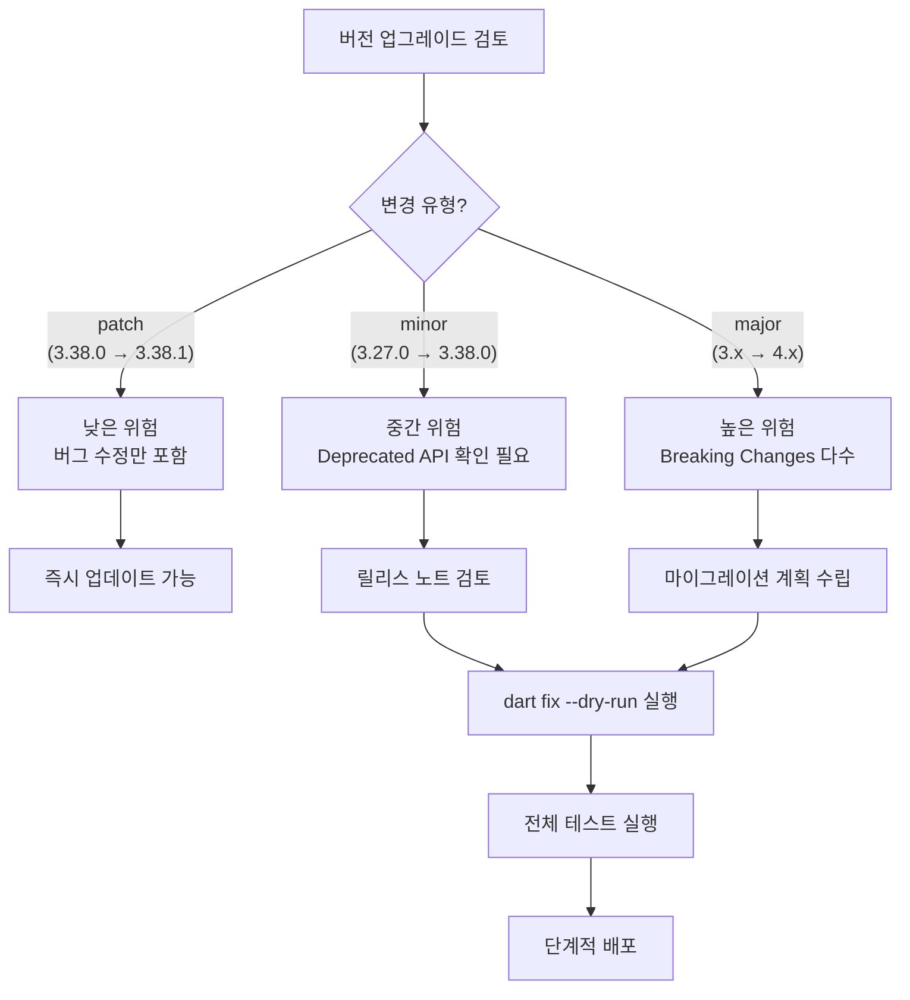
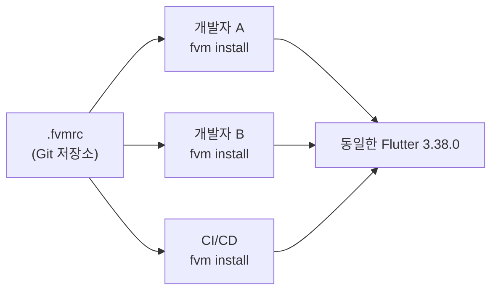
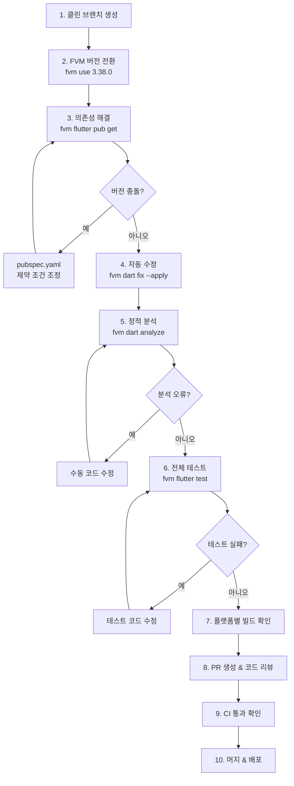
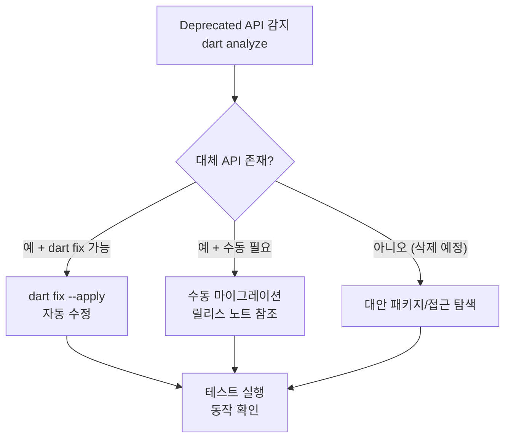
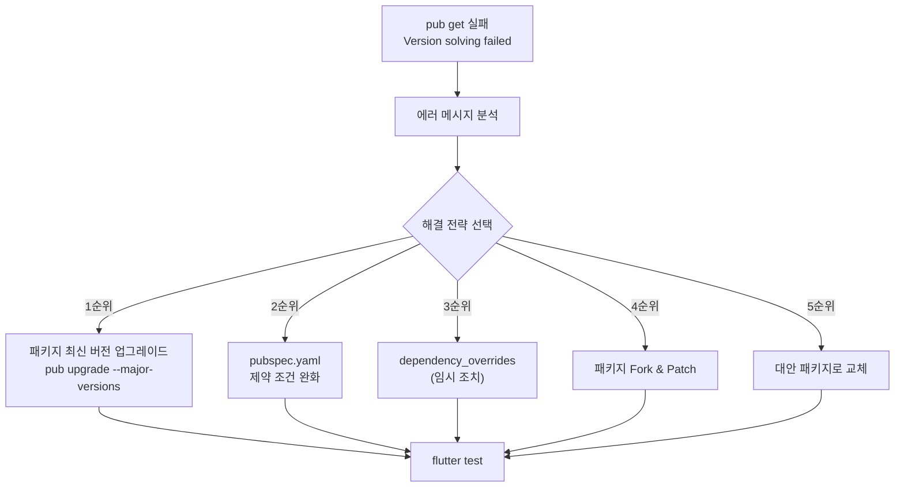

# Flutter 버전 마이그레이션 전략 가이드

> **마지막 업데이트**: 2026-02-08 | **Flutter 3.38** | **Dart 3.10**
> **난이도**: 중급~고급 | **카테고리**: infrastructure
> **선행 학습**: [CICD](./CICD.md), [PackageDevelopment](./PackageDevelopment.md)
> **예상 학습 시간**: 2h

> Flutter SDK와 Dart SDK의 버전 업그레이드 전략, FVM을 통한 팀 단위 버전 관리, `dart fix`를 활용한 자동 마이그레이션, Deprecated API 추적, Version Solver 충돌 해결, 플랫폼별 마이그레이션 체크리스트를 다루는 실무 가이드입니다.

> **학습 목표**: 이 문서를 학습하면 다음을 할 수 있습니다:
> 1. Flutter/Dart의 버전 릴리스 주기를 이해하고, 업그레이드 시점을 판단할 수 있다
> 2. FVM을 활용하여 프로젝트별 Flutter 버전을 관리하고, 팀 전체에 일관된 개발 환경을 제공할 수 있다
> 3. `dart fix --apply`와 `dart analyze`를 활용하여 Deprecated API를 자동으로 마이그레이션할 수 있다
> 4. `pub get` 버전 충돌을 분석하고, 의존성 제약 조건을 조정하여 해결할 수 있다
> 5. Android(Gradle/AGP/Kotlin)와 iOS(CocoaPods/Xcode) 플랫폼별 마이그레이션을 수행할 수 있다
> 6. CI/CD 파이프라인에 FVM 기반 버전 관리를 통합할 수 있다
> 7. 마이그레이션 자동화 스크립트를 작성하여 반복 작업을 줄일 수 있다

---

## 1. 버전 마이그레이션 개요

### 1.1 왜 버전 마이그레이션이 중요한가

Flutter 프로젝트에서 SDK 버전을 최신으로 유지하는 것은 선택이 아니라 필수입니다.

| 관점 | 최신 버전 유지 시 | 버전 고정 시 |
|------|------------------|-------------|
| **보안** | 최신 보안 패치 적용 | 알려진 취약점 노출 |
| **성능** | Impeller, 렌더링 최적화 | 구버전 렌더러 사용 |
| **생태계** | 최신 패키지 호환 | 패키지 버전 제약 누적 |
| **스토어** | targetSdk 요구사항 충족 | 스토어 제출 거부 가능 |
| **개발 경험** | 최신 IDE/도구 지원 | 구버전 도구 강제 |
| **인재 채용** | 최신 기술 스택으로 매력 | 레거시 스택 기피 |

### 1.2 Flutter/Dart 릴리스 주기

Flutter는 분기별 안정 릴리스 주기를 따릅니다.

```
채널 구조:
├── master   : 최신 커밋 (불안정, 개발자용)
├── beta     : 월 1회 릴리스 (테스트용)
└── stable   : 분기 1회 릴리스 (프로덕션용)
```

| 채널 | 릴리스 주기 | 용도 | 권장 대상 |
|------|-----------|------|----------|
| `stable` | 약 3개월 | 프로덕션 앱 | 모든 프로젝트 |
| `beta` | 약 1개월 | 사전 테스트 | 얼리 어답터 |
| `master` | 매일 | 최신 기능 | SDK 기여자 |

### 1.3 Semantic Versioning in Flutter

Flutter SDK는 `major.minor.patch` 형식을 따릅니다.

```
Flutter 3.38.0
  │      │   └── patch: 버그 수정 (안전한 업데이트)
  │      └── minor: 새 기능 추가, 일부 deprecation (주의 필요)
  └── major: 대규모 변경, breaking changes (신중한 계획 필요)
```

### 1.4 마이그레이션 난이도 판단



### 1.5 업그레이드 시점 결정 기준

- **즉시 업그레이드**: 보안 패치, 크리티컬 버그 수정 (patch 릴리스)
- **1~2주 내 업그레이드**: stable 릴리스 후 .1 패치가 나온 시점
- **다음 스프린트 계획**: major/minor 버전 업그레이드
- **보류**: 프로덕션 배포 직전, 중요 마감 기한 내

---

## 2. FVM (Flutter Version Management) 완전 가이드

### 2.1 FVM이란?

FVM은 프로젝트별로 서로 다른 Flutter SDK 버전을 관리할 수 있는 CLI 도구입니다. 팀원 전체가 동일한 Flutter 버전을 사용하도록 강제하여 "내 머신에서는 되는데" 문제를 방지합니다.

### 2.2 설치

```bash
# macOS (Homebrew)
brew tap leoafarias/fvm
brew install fvm

# 또는 Dart pub global
dart pub global activate fvm

# 설치 확인
fvm --version
# 3.3.2
```

### 2.3 프로젝트 설정

```bash
# 프로젝트 디렉토리에서 Flutter 버전 지정
cd my_flutter_app
fvm use 3.38.0

# 자동 생성되는 파일들:
# .fvmrc          → 프로젝트 Flutter 버전 정보 (Git 추적 대상)
# .fvm/           → 심볼릭 링크 디렉토리 (Git 무시 대상)
```

`.fvmrc` 파일 내용:

```json
{
  "flutter": "3.38.0"
}
```

`.gitignore`에 추가:

```gitignore
# FVM
.fvm/flutter_sdk
.fvm/versions
```

### 2.4 FVM 기본 명령어

```bash
# 설치 가능한 Flutter 릴리스 목록 조회
fvm releases

# 특정 버전 설치
fvm install 3.38.0

# 로컬에 설치된 버전 목록
fvm list

# 글로벌 기본 버전 설정
fvm global 3.38.0

# 프로젝트에 버전 지정 (stable 채널 최신)
fvm use stable

# 프로젝트에 특정 버전 지정
fvm use 3.38.0

# 현재 프로젝트에서 사용 중인 버전 확인
fvm current

# FVM을 통한 Flutter 명령 실행
fvm flutter doctor
fvm flutter pub get
fvm dart analyze
```

### 2.5 팀 전체 버전 통일



팀 온보딩 절차:

```bash
# 1. 저장소 클론
git clone https://github.com/team/app.git
cd app

# 2. FVM 설치 (최초 1회)
brew install fvm

# 3. 프로젝트 Flutter 버전 자동 설치
fvm install
# .fvmrc에 명시된 버전이 자동으로 설치됨

# 4. 의존성 설치
fvm flutter pub get

# 5. 정상 동작 확인
fvm flutter doctor
```

### 2.6 IDE 통합

**VS Code** (`settings.json`):

```json
{
  "dart.flutterSdkPath": ".fvm/flutter_sdk",
  "search.exclude": {
    "**/.fvm": true
  },
  "files.watcherExclude": {
    "**/.fvm": true
  }
}
```

> `.vscode/settings.json`을 Git에 커밋하면 팀원 전체에 자동 적용됩니다.

**Android Studio / IntelliJ**:

1. `Languages & Frameworks > Flutter` 설정 진입
2. Flutter SDK path를 `<project>/.fvm/flutter_sdk`로 지정
3. `Restart IDE`

### 2.7 버전 전환을 통한 호환성 테스트

```bash
# 현재 버전에서 테스트
fvm use 3.38.0
fvm flutter test

# 이전 버전에서 호환성 확인
fvm use 3.27.0
fvm flutter test

# 원래 버전으로 복원
fvm use 3.38.0
```

### 2.8 Monorepo(Melos)와 FVM

Melos 기반 모노레포에서는 루트에 `.fvmrc`를 하나만 둡니다.

```
my_monorepo/
├── .fvmrc                    # Flutter 3.38.0 (전체 프로젝트 공통)
├── melos.yaml
├── packages/
│   ├── core/
│   ├── features/
│   └── app/
```

```yaml
# melos.yaml
name: my_workspace
packages:
  - packages/**

command:
  bootstrap:
    runPubGetInParallel: true

scripts:
  analyze:
    run: fvm dart analyze .
    description: 전체 패키지 정적 분석

  test:
    run: melos exec -- fvm flutter test
    description: 전체 패키지 테스트

  fix:
    run: fvm dart fix --apply
    description: 자동 수정 적용
```

### 2.9 FVM 트러블슈팅

| 증상 | 원인 | 해결 방법 |
|------|------|----------|
| `fvm: command not found` | PATH 미설정 | `export PATH="$PATH:$HOME/.pub-cache/bin"` 추가 |
| `.fvmrc` 버전과 실제 버전 불일치 | `fvm install` 미실행 | `fvm install` 실행 |
| IDE가 시스템 Flutter 사용 | SDK path 미설정 | IDE 설정에서 `.fvm/flutter_sdk` 지정 |
| `flutter` 명령이 FVM 버전 무시 | 글로벌 Flutter 우선 | `fvm flutter` 명령 사용 또는 FVM shim 설정 |
| 디스크 공간 부족 | 다수 버전 설치 | `fvm remove <version>`으로 미사용 버전 삭제 |

---

## 3. Flutter Upgrade 전략

### 3.1 사전 점검 체크리스트

업그레이드를 시작하기 전에 반드시 다음을 확인합니다.

```bash
# 1. 클린 브랜치 생성
git checkout -b chore/flutter-upgrade-3.38
git stash  # 작업 중인 변경사항 보존

# 2. 현재 의존성 상태 확인
fvm flutter pub outdated

# 3. 현재 정적 분석 상태 확인 (기준선)
fvm dart analyze

# 4. 현재 테스트 상태 확인 (기준선)
fvm flutter test

# 5. Flutter 릴리스 노트에서 Breaking Changes 확인
# https://docs.flutter.dev/release/breaking-changes
```

### 3.2 단계별 업그레이드 프로세스



#### 단계 1: 클린 브랜치

```bash
git checkout main
git pull origin main
git checkout -b chore/flutter-upgrade-3.38
```

#### 단계 2: FVM 버전 전환

```bash
# 새 버전 설치 및 전환
fvm install 3.38.0
fvm use 3.38.0

# .fvmrc 변경 확인
cat .fvmrc
# {"flutter": "3.38.0"}
```

#### 단계 3: 의존성 해결

```bash
fvm flutter pub get
```

버전 충돌이 발생하면 [6. Version Solver 충돌 해결](#6-version-solver-충돌-해결) 참조.

#### 단계 4: 자동 수정 적용

```bash
# 변경 사항 미리 보기
fvm dart fix --dry-run

# 자동 수정 적용
fvm dart fix --apply
```

#### 단계 5: 정적 분석

```bash
fvm dart analyze

# info 레벨까지 모두 표시
fvm dart analyze --fatal-infos
```

#### 단계 6: 전체 테스트

```bash
fvm flutter test

# 커버리지 포함
fvm flutter test --coverage
```

#### 단계 7: 플랫폼별 빌드 확인

```bash
# Android 빌드
fvm flutter build apk --debug

# iOS 빌드 (macOS에서만)
fvm flutter build ios --debug --no-codesign

# Web 빌드
fvm flutter build web
```

### 3.3 롤백 전략

FVM을 사용하면 롤백이 매우 간단합니다.

```bash
# 이전 버전으로 즉시 롤백
fvm use 3.27.0
fvm flutter pub get

# Git 변경사항 되돌리기
git checkout -- pubspec.lock
git checkout -- .fvmrc

# 또는 브랜치 자체를 폐기
git checkout main
git branch -D chore/flutter-upgrade-3.38
```

### 3.4 점진적 업그레이드 전략

여러 마이너 버전을 건너뛰어야 할 때는 단계별 접근이 안전합니다.

```
3.16.0 → 3.19.0 → 3.22.0 → 3.27.0 → 3.38.0
         │          │          │          │
         │          │          │          └── withOpacity 제거
         │          │          └── dart:html deprecated
         │          └── Color(int) deprecated
         └── textScaleFactor deprecated
```

```bash
# 각 단계마다 dart fix + analyze + test 반복
for version in 3.19.0 3.22.0 3.27.0 3.38.0; do
  fvm install $version
  fvm use $version
  fvm flutter pub get
  fvm dart fix --apply
  fvm dart analyze
  fvm flutter test
  git add -A && git commit -m "chore: migrate to Flutter $version"
done
```

---

## 4. `dart fix` 활용

### 4.1 `dart fix`란?

`dart fix`는 Dart SDK에 내장된 자동 코드 수정 도구입니다. Deprecated API 사용, 구버전 문법 등을 자동으로 최신 권장 패턴으로 변환합니다.

### 4.2 기본 사용법

```bash
# 변경될 내용 미리 보기 (코드 변경 없음)
fvm dart fix --dry-run
# 예시 출력:
# lib/src/widgets/home.dart
#   textScaleFactor → textScaler (1 fix)
#   withOpacity → withValues (3 fixes)
# 4 fixes in 1 file

# 자동 수정 적용
fvm dart fix --apply
# 4 fixes applied in 1 file
```

### 4.3 특정 디렉토리만 수정

```bash
# lib 디렉토리만
fvm dart fix --apply lib/

# 특정 패키지만 (모노레포)
fvm dart fix --apply packages/core/
```

### 4.4 analysis_options.yaml 연동

`analysis_options.yaml`에서 특정 lint 규칙을 설정하면 `dart fix`의 동작에 영향을 줍니다.

```yaml
# analysis_options.yaml
include: package:flutter_lints/flutter.yaml

analyzer:
  errors:
    # deprecated_member_use를 error로 승격
    deprecated_member_use: error
    deprecated_member_use_from_same_package: warning

linter:
  rules:
    # dart fix가 자동 수정하는 규칙들
    use_super_parameters: true
    unnecessary_late: true
    use_enums: true
    prefer_const_constructors: true
```

### 4.5 Flutter 3.38에서 주요 자동 수정 항목

| 수정 전 (Deprecated) | 수정 후 (권장) | 자동 수정 |
|----------------------|---------------|----------|
| `textScaleFactor: 1.5` | `textScaler: TextScaler.linear(1.5)` | O |
| `color.withOpacity(0.5)` | `color.withValues(alpha: 0.5)` | O |
| `Color(0xFF42A5F5)` | `Color.fromARGB(0xFF, 0x42, 0xA5, 0xF5)` | O |
| `import 'dart:html'` | `import 'dart:js_interop'` | 부분적 |
| `MediaQuery.of(ctx).textScaleFactor` | `MediaQuery.textScalerOf(ctx)` | O |
| `ThemeData(errorColor: ...)` | `ThemeData(colorScheme: ...)` | O |
| `Widget(key: key)` super 전달 | `Widget({super.key})` | O |

```dart
// 수정 전
class MyWidget extends StatelessWidget {
  const MyWidget({Key? key}) : super(key: key);

  @override
  Widget build(BuildContext context) {
    final scaleFactor = MediaQuery.of(context).textScaleFactor;
    return Container(
      color: Colors.blue.withOpacity(0.5),
      child: Text(
        '안녕하세요',
        style: TextStyle(color: Color(0xFF42A5F5)),
      ),
    );
  }
}

// dart fix --apply 후
class MyWidget extends StatelessWidget {
  const MyWidget({super.key});

  @override
  Widget build(BuildContext context) {
    final scaleFactor = MediaQuery.textScalerOf(context);
    return Container(
      color: Colors.blue.withValues(alpha: 0.5),
      child: Text(
        '안녕하세요',
        style: TextStyle(color: Color.fromARGB(0xFF, 0x42, 0xA5, 0xF5)),
      ),
    );
  }
}
```

---

## 5. Deprecated API 추적 및 대응

### 5.1 Deprecated API 탐지 방법

```bash
# 방법 1: dart analyze (기본 - warning 레벨)
fvm dart analyze

# 방법 2: info 레벨까지 포함 (더 엄격)
fvm dart analyze --fatal-infos

# 방법 3: deprecated 경고만 필터링
fvm dart analyze 2>&1 | grep -i "deprecated"
```

### 5.2 analysis_options.yaml 설정

```yaml
# analysis_options.yaml
analyzer:
  errors:
    # deprecated 사용을 error로 승격하여 CI에서 차단
    deprecated_member_use: error
    deprecated_member_use_from_same_package: warning

  exclude:
    # 생성 코드는 분석에서 제외
    - "**/*.g.dart"
    - "**/*.freezed.dart"
    - "**/*.gen.dart"
```

### 5.3 Flutter 3.x Deprecation 타임라인

Flutter는 "deprecated 경고 → N 버전 유지 → 제거"의 패턴을 따릅니다.

| API | Deprecated 시점 | 제거 시점 | 대체 API |
|-----|-----------------|----------|----------|
| `textScaleFactor` | Flutter 3.16 | Flutter 3.38 | `TextScaler` / `textScaler` |
| `Color(int value)` | Flutter 3.19 | Flutter 3.38 | `Color.fromARGB()` |
| `dart:html` | Flutter 3.22 | Flutter 3.38 | `dart:js_interop` / `package:web` |
| `withOpacity()` | Flutter 3.27 | Flutter 3.38 | `withValues(alpha:)` |
| `ThemeData.errorColor` | Flutter 3.3 | Flutter 3.27 | `ColorScheme.error` |
| `RaisedButton` | Flutter 2.0 | Flutter 3.16 | `ElevatedButton` |
| `FlatButton` | Flutter 2.0 | Flutter 3.16 | `TextButton` |
| `Navigator.pushNamed` (직접 사용) | 권장 변경 | 미제거 | `GoRouter` 등 선언적 라우팅 |

### 5.4 Deprecation 대응 전략



### 5.5 마이그레이션 참조 테이블 형식

프로젝트 내 deprecated API를 추적할 때 다음 형식의 테이블을 유지하면 효과적입니다.

```markdown
| Old API | New API | Since | Removed | 파일 수 | 상태 |
|---------|---------|-------|---------|--------|------|
| textScaleFactor | TextScaler | 3.16 | 3.38 | 12 | 완료 |
| withOpacity | withValues | 3.27 | 3.38 | 34 | 진행 중 |
| Color(int) | Color.fromARGB | 3.19 | 3.38 | 8 | 미시작 |
```

### 5.6 자체 패키지에서 Deprecation 관리

자체 패키지를 개발하는 경우, deprecated 어노테이션을 올바르게 사용합니다. 자세한 패키지 개발은 [패키지 개발 가이드](./PackageDevelopment.md) 참조.

```dart
/// 기존 API에 @Deprecated 어노테이션 추가
@Deprecated('v2.0.0에서 제거 예정. fetchUserProfile()을 사용하세요.')
Future<User> getUser(String id) => fetchUserProfile(id);

/// 새로운 대체 API
Future<User> fetchUserProfile(String id) async {
  // 구현
}
```

---

## 6. Version Solver 충돌 해결

### 6.1 버전 제약 조건 이해

`pubspec.yaml`에서 사용하는 버전 제약 구문:

```yaml
dependencies:
  # 캐럿 구문: >=1.2.0 <2.0.0 과 동일
  http: ^1.2.0

  # 범위 지정
  path: '>=1.9.0 <2.0.0'

  # 정확한 버전 (권장하지 않음)
  uuid: 4.5.1

  # any (매우 권장하지 않음)
  # logger: any
```

| 제약 구문 | 의미 | 예시 |
|----------|------|------|
| `^1.2.0` | `>=1.2.0 <2.0.0` | 1.2.0, 1.3.0, 1.9.9 (O), 2.0.0 (X) |
| `^0.2.0` | `>=0.2.0 <0.3.0` | 0.2.x만 허용 (0.x는 불안정) |
| `>=1.0.0 <3.0.0` | 명시적 범위 | 1.x, 2.x 허용 |
| `any` | 모든 버전 | 최후의 수단 |

### 6.2 흔한 충돌 시나리오

#### 시나리오 1: 공유 의존성 버전 불일치

```
패키지 A는 shared_lib: ^1.0.0 (1.x만 허용)
패키지 B는 shared_lib: ^2.0.0 (2.x만 허용)
→ 충돌: 두 제약을 동시에 만족하는 버전 없음
```

#### 시나리오 2: Flutter SDK 제약 불일치

```
Because my_app depends on old_package >=1.0.0 which requires
Flutter SDK version >=2.0.0 <3.10.0,
and my_app requires Flutter SDK version >=3.38.0,
version solving failed.
```

#### 시나리오 3: Dart SDK 제약 불일치

```
The current Dart SDK version is 3.10.0.
Because my_app depends on legacy_pkg ^1.0.0 which requires
SDK version >=2.12.0 <3.0.0, version solving failed.
```

### 6.3 충돌 해결 전략



#### 전략 1: 패키지 업그레이드

```bash
# 모든 패키지를 최신 호환 버전으로 업그레이드
fvm flutter pub upgrade

# major 버전 포함 업그레이드 (pubspec.yaml 자동 수정)
fvm flutter pub upgrade --major-versions

# 특정 패키지만 업그레이드
fvm flutter pub upgrade dio
```

#### 전략 2: 제약 조건 조정

```yaml
# pubspec.yaml
dependencies:
  # 범위를 넓혀서 충돌 해소
  shared_lib: '>=1.5.0 <3.0.0'
```

#### 전략 3: dependency_overrides (임시 조치)

```yaml
# pubspec.yaml
# 주의: 프로덕션 코드에서는 반드시 제거해야 합니다
dependency_overrides:
  shared_lib: ^2.0.0
```

> **경고**: `dependency_overrides`는 버전 제약을 강제로 무시합니다. 런타임 오류가 발생할 수 있으므로 반드시 임시 조치로만 사용하고, 근본 원인을 해결한 후 제거해야 합니다.

#### 전략 4: Fork & Patch

```yaml
# pubspec.yaml
dependencies:
  old_package:
    git:
      url: https://github.com/my-team/old_package.git
      ref: flutter-3.38-compat
```

### 6.4 의존성 트리 분석

```bash
# 전체 의존성 트리 확인
fvm dart pub deps

# 특정 패키지의 의존 경로 확인
fvm dart pub deps --style=compact | grep shared_lib

# 업데이트 가능한 패키지 확인
fvm flutter pub outdated
```

`pub outdated` 출력 예시:

```
Package Name    Current  Upgradable  Resolvable  Latest
dio             5.7.0    5.9.1       5.9.1       5.9.1
go_router       14.6.2   17.1.0      17.1.0      17.1.0
flutter_bloc    8.1.6    9.1.1       9.1.1       9.1.1
```

> CI에서 `pub outdated`를 자동 실행하는 방법은 [패키지 CI](./PackageDevelopment.md) 참조.

### 6.5 pubspec.yaml 버전 제약 모범 사례

```yaml
# 좋은 예: 캐럿 구문으로 호환 범위 지정
dependencies:
  dio: ^5.9.1
  flutter_bloc: ^9.1.1
  go_router: ^17.1.0

# 나쁜 예: 정확한 버전 고정 (업데이트 차단)
dependencies:
  dio: 5.9.1        # major 내 패치도 받지 못함

# 나쁜 예: any (예측 불가능)
dependencies:
  dio: any           # 어떤 버전이든 설치 가능
```

---

## 7. 플랫폼별 마이그레이션 체크리스트

### 7.1 Android 마이그레이션

#### compileSdk / minSdk / targetSdk 업데이트

```kotlin
// android/app/build.gradle.kts
android {
    compileSdk = 35  // Flutter 3.38 권장

    defaultConfig {
        minSdk = 24        // Android 7.0 (Flutter 3.38 최소 요구사항)
        targetSdk = 35     // Google Play 2026 요구사항
    }
}
```

#### Gradle / AGP / Kotlin 버전

```kotlin
// android/settings.gradle.kts
pluginManagement {
    plugins {
        id("com.android.application") version "8.9.0"   // AGP
        id("org.jetbrains.kotlin.android") version "2.1.10"
    }
}
```

```properties
# android/gradle/wrapper/gradle-wrapper.properties
distributionUrl=https\://services.gradle.org/distributions/gradle-8.12-bin.zip
```

| 구성 요소 | Flutter 3.38 권장 버전 | 비고 |
|----------|----------------------|------|
| Gradle | 8.12+ | gradle-wrapper.properties |
| AGP (Android Gradle Plugin) | 8.9.0+ | settings.gradle.kts |
| Kotlin | 2.1.10+ | settings.gradle.kts |
| compileSdk | 35 | build.gradle.kts |
| minSdk | 24+ | build.gradle.kts |
| targetSdk | 35 | Google Play 2026 요구사항 |

#### build.gradle → build.gradle.kts 마이그레이션

Flutter 3.38은 Kotlin DSL(`.kts`)을 기본으로 생성합니다. 기존 Groovy DSL 프로젝트 마이그레이션:

```groovy
// 기존: android/app/build.gradle (Groovy)
android {
    compileSdkVersion 34
    defaultConfig {
        minSdkVersion 21
        targetSdkVersion 34
    }
}
```

```kotlin
// 변환: android/app/build.gradle.kts (Kotlin DSL)
android {
    compileSdk = 35
    defaultConfig {
        minSdk = 24
        targetSdk = 35
    }
}
```

> `flutter create`로 새 프로젝트를 만들어 최신 Kotlin DSL 템플릿을 참고하면 편리합니다.

### 7.2 iOS 마이그레이션

#### 최소 iOS 버전 업데이트

```ruby
# ios/Podfile
platform :ios, '16.0'  # Flutter 3.38 최소 요구사항
```

```
// ios/Runner.xcodeproj 또는 Xcode에서:
IPHONEOS_DEPLOYMENT_TARGET = 16.0
```

#### CocoaPods 업데이트

```bash
# CocoaPods 자체 업데이트
sudo gem install cocoapods

# Pod 저장소 업데이트
cd ios && pod repo update

# Pod 재설치
pod deintegrate
pod install --repo-update
cd ..
```

#### Xcode / Swift 버전

| 구성 요소 | Flutter 3.38 권장 | 비고 |
|----------|------------------|------|
| Xcode | 16.2+ | App Store Connect 요구사항 |
| Swift | 6.0+ | Xcode 번들 |
| iOS 최소 버전 | 16.0+ | Podfile, Xcode 설정 |
| CocoaPods | 1.16.2+ | `gem install cocoapods` |

### 7.3 공통 클린업 명령

플랫폼 관련 빌드 캐시 문제가 발생하면 다음 순서로 정리합니다.

```bash
# 1단계: Flutter 클린
fvm flutter clean

# 2단계: pub 캐시 재설치
fvm flutter pub get

# 3단계: iOS Pod 재설치
cd ios && pod deintegrate && pod install --repo-update && cd ..

# 4단계: Android Gradle 캐시 정리
cd android && ./gradlew clean && cd ..

# 5단계: 빌드 캐시 완전 초기화 (최후의 수단)
rm -rf build/
rm -rf ios/Pods/
rm -rf ios/.symlinks/
rm -rf android/.gradle/
rm -rf android/app/build/
fvm flutter pub get
cd ios && pod install && cd ..
```

---

## 8. CI/CD 버전 관리 전략

### 8.1 .fvmrc 기반 CI 통합

`.fvmrc` 파일에서 Flutter 버전을 읽어 CI 파이프라인에 자동 적용하는 패턴입니다. 전체 CI/CD 파이프라인 구성은 [CI 버전 핀닝](./CICD.md) 참조.

```yaml
# .github/workflows/flutter_ci.yml
name: Flutter CI

on:
  push:
    branches: [main, develop]
  pull_request:
    branches: [main]

jobs:
  build:
    runs-on: ubuntu-latest
    steps:
      - uses: actions/checkout@v4

      # .fvmrc에서 Flutter 버전 읽기
      - name: Read Flutter version from .fvmrc
        id: flutter-version
        run: echo "version=$(cat .fvmrc | jq -r '.flutter')" >> $GITHUB_OUTPUT

      # 읽은 버전으로 Flutter 설정
      - uses: subosito/flutter-action@v2
        with:
          flutter-version: ${{ steps.flutter-version.outputs.version }}
          channel: stable
          cache: true

      - run: flutter pub get
      - run: dart analyze --fatal-infos
      - run: flutter test
```

### 8.2 Matrix 테스트 (다중 버전)

여러 Flutter 버전에서 호환성을 검증합니다 (특히 패키지 개발 시).

```yaml
# .github/workflows/compatibility.yml
name: Flutter Version Compatibility

on:
  schedule:
    - cron: '0 6 * * 1'  # 매주 월요일 오전 6시
  workflow_dispatch:

jobs:
  test:
    runs-on: ubuntu-latest
    strategy:
      matrix:
        flutter-version: ['3.27.0', '3.38.0']
      fail-fast: false

    steps:
      - uses: actions/checkout@v4
      - uses: subosito/flutter-action@v2
        with:
          flutter-version: ${{ matrix.flutter-version }}
          channel: stable

      - run: flutter pub get
      - run: flutter test
```

### 8.3 자동 업그레이드 PR (Renovate)

Renovate를 사용하면 Flutter SDK 및 패키지 업데이트 PR을 자동으로 생성할 수 있습니다.

```json5
// renovate.json
{
  "$schema": "https://docs.renovatebot.com/renovate-schema.json",
  "extends": ["config:recommended"],
  "flutter": {
    "enabled": true
  },
  "packageRules": [
    {
      "matchManagers": ["pub"],
      "groupName": "Flutter dependencies",
      "schedule": ["every 2 weeks on Monday"],
      "automerge": false,
      "labels": ["dependencies", "flutter"]
    },
    {
      "matchManagers": ["pub"],
      "matchUpdateTypes": ["patch"],
      "automerge": true,
      "labels": ["dependencies", "auto-merge"]
    }
  ]
}
```

### 8.4 버전 잠금 전략

| 전략 | 설명 | 적합한 경우 |
|------|------|-----------|
| `pubspec.lock` Git 커밋 | 모든 환경에서 동일 버전 보장 | 앱 프로젝트 (권장) |
| `pubspec.lock` Git 무시 | CI에서 최신 호환 버전 사용 | 패키지 개발 |
| `.fvmrc` Git 커밋 | Flutter SDK 버전 팀 공유 | 모든 프로젝트 (권장) |

> FVM과 CI 통합에 대한 추가 내용은 [환경별 빌드](./Environment.md) 참조.

---

## 9. 마이그레이션 자동화 스크립트

### 9.1 업그레이드 스크립트

```bash
#!/bin/bash
# scripts/upgrade-flutter.sh
# 사용법: ./scripts/upgrade-flutter.sh 3.38.0

set -euo pipefail

NEW_VERSION="${1:?Flutter 버전을 인수로 전달하세요 (예: 3.38.0)}"
BRANCH_NAME="chore/flutter-upgrade-${NEW_VERSION}"

echo "========================================="
echo " Flutter 업그레이드: ${NEW_VERSION}"
echo "========================================="

# 1. 현재 상태 스냅샷
echo "[1/7] 현재 상태 저장..."
CURRENT_VERSION=$(cat .fvmrc | jq -r '.flutter')
echo "  현재 버전: ${CURRENT_VERSION}"
echo "  대상 버전: ${NEW_VERSION}"

# 2. 클린 브랜치 생성
echo "[2/7] 업그레이드 브랜치 생성..."
git checkout -b "${BRANCH_NAME}"

# 3. FVM 버전 전환
echo "[3/7] Flutter ${NEW_VERSION} 설치 및 전환..."
fvm install "${NEW_VERSION}"
fvm use "${NEW_VERSION}"

# 4. 의존성 해결
echo "[4/7] 의존성 해결..."
fvm flutter pub get

# 5. 자동 수정
echo "[5/7] dart fix 적용..."
fvm dart fix --apply

# 6. 정적 분석
echo "[6/7] 정적 분석..."
fvm dart analyze || {
  echo "정적 분석 오류 발견. 수동 수정이 필요합니다."
  exit 1
}

# 7. 테스트
echo "[7/7] 테스트 실행..."
fvm flutter test || {
  echo "테스트 실패. 수동 수정이 필요합니다."
  exit 1
}

echo "========================================="
echo " 업그레이드 완료!"
echo " 브랜치: ${BRANCH_NAME}"
echo " ${CURRENT_VERSION} → ${NEW_VERSION}"
echo ""
echo " 다음 단계:"
echo "   1. 플랫폼별 빌드 확인"
echo "   2. git add -A && git commit"
echo "   3. PR 생성"
echo "========================================="
```

### 9.2 Makefile 타겟

```makefile
# Makefile

# Flutter 업그레이드 (예: make upgrade VERSION=3.38.0)
upgrade:
	@./scripts/upgrade-flutter.sh $(VERSION)

# dart fix 미리보기
fix-preview:
	fvm dart fix --dry-run

# dart fix 적용
fix-apply:
	fvm dart fix --apply

# 정적 분석
analyze:
	fvm dart analyze --fatal-infos

# 전체 검증 (analyze + test)
verify:
	fvm dart analyze --fatal-infos
	fvm flutter test

# 플랫폼 캐시 전체 정리
clean-all:
	fvm flutter clean
	rm -rf build/ ios/Pods/ ios/.symlinks/
	rm -rf android/.gradle/ android/app/build/
	fvm flutter pub get
	cd ios && pod install && cd ..

# 의존성 상태 확인
outdated:
	fvm flutter pub outdated

# 의존성 트리 확인
deps:
	fvm dart pub deps
```

---

## 10. 트러블슈팅

### 10.1 "Version solving failed" 해결

```
Because every version of package_a requires shared >= 2.0.0
and every version of package_b requires shared < 2.0.0,
package_a is incompatible with package_b.
```

**해결 순서**:

```bash
# 1. 어떤 패키지가 충돌하는지 확인
fvm dart pub deps --style=compact

# 2. 패키지 최신 버전 확인
fvm flutter pub outdated

# 3. pubspec.yaml에서 제약 조건 조정
# 4. 필요 시 dependency_overrides 임시 적용
# 5. 패키지 메인테이너에게 이슈 등록
```

### 10.2 Gradle / AGP 버전 불일치

```
A problem occurred configuring project ':app'.
> Could not resolve all files for configuration ':app:androidApis'.
```

**해결**:

```bash
# android/gradle/wrapper/gradle-wrapper.properties 확인
# distributionUrl의 Gradle 버전이 AGP와 호환되는지 확인

# AGP ↔ Gradle 호환성:
# AGP 8.9.x → Gradle 8.12+
# AGP 8.7.x → Gradle 8.10+
# AGP 8.5.x → Gradle 8.8+

# Gradle 래퍼 업데이트
cd android && ./gradlew wrapper --gradle-version=8.12 && cd ..
```

### 10.3 CocoaPods 관련 문제

```
[!] CocoaPods could not find compatible versions for pod "Firebase/CoreOnly"
```

**해결**:

```bash
# CDN 캐시 초기화
pod cache clean --all

# Pod 저장소 업데이트
pod repo update

# 재설치
cd ios
pod deintegrate
rm Podfile.lock
pod install --repo-update
cd ..
```

### 10.4 Dart SDK 버전 불일치

```
The current Dart SDK version is 3.10.0.
Because my_app requires SDK version >=2.17.0 <3.0.0, version solving failed.
```

**해결**: `pubspec.yaml`에서 SDK 제약을 업데이트합니다.

```yaml
# pubspec.yaml
environment:
  sdk: '>=3.10.0 <4.0.0'
  flutter: '>=3.38.0'
```

### 10.5 `flutter clean` 최후의 수단 시퀀스

모든 방법이 실패했을 때의 전체 초기화 순서:

```bash
# 1. 모든 빌드 아티팩트 삭제
fvm flutter clean

# 2. pub 캐시 초기화
fvm flutter pub cache clean --force

# 3. iOS 관련 정리
cd ios
rm -rf Pods/ Podfile.lock .symlinks/
pod cache clean --all
cd ..

# 4. Android 관련 정리
cd android
rm -rf .gradle/ app/build/ build/
cd ..

# 5. 기타 빌드 캐시
rm -rf build/
rm -rf .dart_tool/

# 6. 재설치
fvm flutter pub get
cd ios && pod install --repo-update && cd ..

# 7. 검증
fvm flutter doctor
fvm flutter build apk --debug
fvm flutter build ios --debug --no-codesign
```

### 10.6 빈번한 문제 요약

| 증상 | 가능한 원인 | 해결 방법 |
|------|-----------|----------|
| `pub get` 무한 대기 | 네트워크/DNS 문제 | `PUB_HOSTED_URL` 확인 |
| `Gradle sync failed` | AGP/Gradle 버전 불일치 | 호환 버전 테이블 확인 |
| `pod install` 실패 | CocoaPods 캐시 오염 | `pod cache clean --all` |
| 빌드 성공, 런타임 크래시 | `dependency_overrides` 부작용 | overrides 제거 후 재테스트 |
| IDE 자동완성 오작동 | 구버전 SDK 참조 | IDE에서 `.fvm/flutter_sdk` 재설정 |
| `dart fix` 일부 미수정 | 수동 마이그레이션 필요 케이스 | 릴리스 노트에서 마이그레이션 가이드 확인 |

> DB 스키마 마이그레이션은 [DB 마이그레이션](./LocalStorage.md) 참조.
> flutter_secure_storage v9에서 v10 마이그레이션은 [SecureStorage 마이그레이션](../system/Security.md) 참조.
> permission_handler v12에서 v13 마이그레이션은 [권한 마이그레이션](../features/Permission.md) 참조.

---

## Self-Check

다음 항목을 모두 이해하고 수행할 수 있는지 확인하세요:

- [ ] Flutter의 릴리스 채널(stable, beta, master)과 분기별 릴리스 주기를 설명할 수 있다
- [ ] Semantic Versioning(major.minor.patch)에 따라 업그레이드 위험도를 판단할 수 있다
- [ ] FVM을 설치하고, `fvm use`로 프로젝트별 Flutter 버전을 지정할 수 있다
- [ ] `.fvmrc` 파일을 Git에 커밋하여 팀 전체가 동일한 Flutter 버전을 사용하도록 설정할 수 있다
- [ ] VS Code / Android Studio에서 FVM SDK 경로를 설정할 수 있다
- [ ] `dart fix --dry-run`으로 변경 사항을 미리 확인하고, `dart fix --apply`로 자동 수정을 적용할 수 있다
- [ ] `textScaleFactor`, `withOpacity`, `Color(int)` 등 주요 deprecated API의 대체 API를 알고 있다
- [ ] `pub get` 버전 충돌 에러 메시지를 읽고, 원인 패키지를 식별할 수 있다
- [ ] `dependency_overrides`의 용도와 위험성을 설명하고, 임시 조치로만 사용할 수 있다
- [ ] `dart pub deps`로 의존성 트리를 분석할 수 있다
- [ ] Android의 compileSdk, minSdk, targetSdk, AGP, Gradle, Kotlin 버전을 올바르게 업데이트할 수 있다
- [ ] iOS의 Podfile 최소 버전, CocoaPods 업데이트, Xcode 요구사항을 관리할 수 있다
- [ ] `flutter clean` + Pod/Gradle 캐시 정리로 빌드 문제를 해결할 수 있다
- [ ] CI 파이프라인에서 `.fvmrc`를 읽어 Flutter 버전을 자동으로 설정할 수 있다
- [ ] 여러 Flutter 버전을 건너뛸 때 단계적 업그레이드 전략을 수립할 수 있다
- [ ] 마이그레이션 자동화 스크립트를 작성하고 Makefile로 관리할 수 있다
- [ ] 업그레이드 실패 시 FVM으로 이전 버전으로 롤백할 수 있다
