# System Design Interview Cheatsheet (Mobile Engineer L5~L6)

> **대상**: 모바일 엔지니어 시스템 설계 면접 준비
> **레벨**: L5 (Senior) ~ L6 (Staff)
> **레벨 표시**: :yellow_circle: L5 필수 | :red_circle: L6 필수

---

## 목차

1. [아키텍처 패턴 비교](#1-아키텍처-패턴-비교)
2. [모바일 시스템 설계 프레임워크](#2-모바일-시스템-설계-프레임워크)
3. [대표 시스템 설계 문제 5개](#3-대표-시스템-설계-문제-5개)
4. [모바일 특화 설계 고려사항](#4-모바일-특화-설계-고려사항)

---

## 1. 아키텍처 패턴 비교

### 1.1 Clean Architecture 3계층 요약 :yellow_circle:

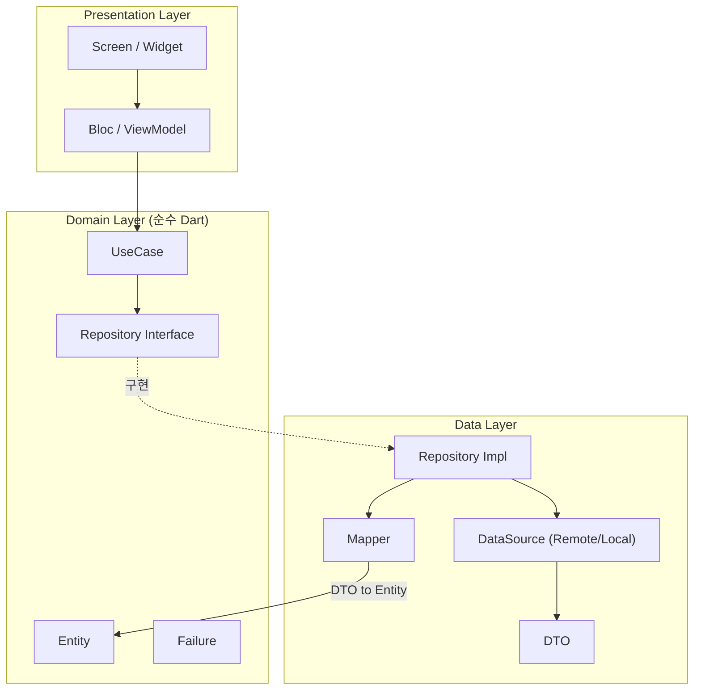

**핵심 규칙:**
- 의존성 방향: Presentation -> Domain <- Data
- Domain 레이어는 **외부 의존성 없음** (순수 Dart)
- Data -> Domain: Repository Interface 구현 (의존성 역전)
- UseCase는 하나의 비즈니스 액션만 수행

| 레이어 | 구성 요소 | 역할 |
|--------|-----------|------|
| **Presentation** | Screen, Bloc, Widget | UI 렌더링, 사용자 입력 처리 |
| **Domain** | Entity, UseCase, Repository(I), Failure | 비즈니스 로직, 규칙 정의 |
| **Data** | DTO, DataSource, Mapper, Repository Impl | 외부 데이터 통신, 변환 |

---

### 1.2 Clean Architecture vs Hexagonal vs Onion 비교표 :red_circle:

| 항목 | Clean Architecture | Hexagonal (Ports & Adapters) | Onion Architecture |
|------|-------------------|-----------------------------|--------------------|
| **핵심 아이디어** | 계층 분리 + 의존성 규칙 | 도메인을 외부 기술로부터 격리 | 동심원 레이어, 안쪽이 순수 |
| **레이어** | Presentation / Domain / Data | Domain Core / Primary Adapters / Secondary Adapters | Core / Domain Services / Application / Infrastructure |
| **의존성 방향** | 바깥 -> 안쪽 | Adapter -> Port -> Domain | 바깥 -> 안쪽 |
| **인터페이스 위치** | Domain 레이어 | Port (Domain 경계) | Domain Services |
| **테스트 용이성** | 높음 | 매우 높음 (Port Mock) | 높음 |
| **복잡도** | 중간 | 중간~높음 | 중간 |
| **Flutter 적합도** | 가장 널리 사용 | Port/Adapter 매핑 자연스러움 | 덜 사용됨 |
| **추천 상황** | 대부분의 모바일 앱 | 외부 의존성 많은 앱 | 엔터프라이즈 백엔드 |

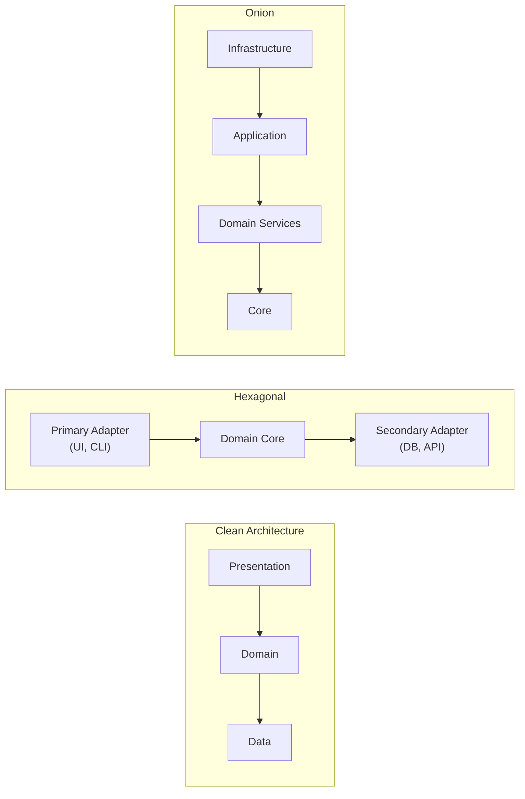

---

### 1.3 DDD 핵심 개념 요약 :red_circle:

| 개념 | 설명 | 모바일 예시 |
|------|------|-------------|
| **Entity** | 고유 ID를 가진 도메인 객체, 생명주기 존재 | `Order(id, status, lines)` |
| **Value Object** | ID 없음, 불변, 동등성 비교 | `Money(amount, currency)`, `Address` |
| **Aggregate** | 일관성 경계를 공유하는 Entity/VO 묶음 | `Order` (root) + `OrderLine` (child) |
| **Aggregate Root** | Aggregate의 진입점, 외부에서 유일한 접근점 | `Order`만 직접 접근, `OrderLine`은 Order를 통해 |
| **Repository** | Aggregate의 영속화 인터페이스 | `OrderRepository.save(order)` |
| **Domain Service** | 특정 Entity에 속하지 않는 비즈니스 로직 | `PricingService.calculateDiscount()` |
| **Domain Event** | 도메인에서 발생한 사건 | `OrderConfirmed`, `PaymentCompleted` |
| **Bounded Context** | 모델이 유효한 경계 | Auth Context, Order Context, Payment Context |

**DDD 안티패턴:**

| 안티패턴 | 문제 | 해결책 |
|---------|------|--------|
| Anemic Domain Model | Entity에 로직 없이 getter/setter만 | 비즈니스 로직을 Entity로 이동 |
| God Aggregate | 하나의 Aggregate가 너무 많은 Entity 포함 | 작게 분리, Eventual Consistency |
| Repository 남용 | 모든 쿼리를 Repository에 | Specification Pattern 활용 |

---

### 1.4 CQRS + Event Sourcing 패턴 :red_circle:

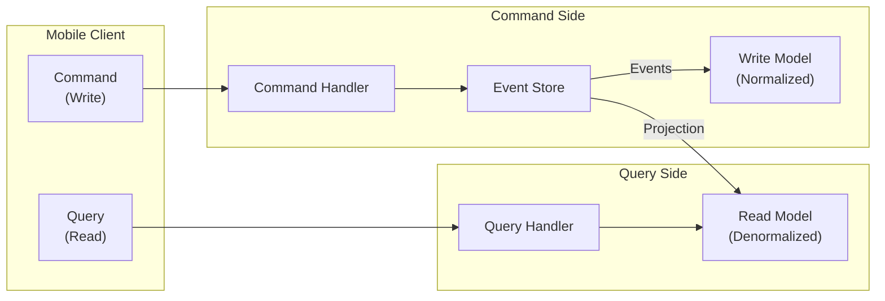

| 항목 | CQRS | Event Sourcing | CQRS + ES |
|------|------|---------------|-----------|
| **핵심** | 읽기/쓰기 모델 분리 | 상태 대신 이벤트 저장 | 두 패턴 결합 |
| **읽기 성능** | 매우 높음 (비정규화) | 낮음 (Replay 필요) | 매우 높음 (Projection) |
| **쓰기 성능** | 보통 | 높음 (Append Only) | 높음 |
| **감사 로그** | 별도 구현 필요 | 내장 | 내장 |
| **복잡도** | 중간 | 매우 높음 | 매우 높음 |
| **적합한 앱** | 소셜 미디어, 대시보드 | 금융, 의료 | 금융 거래, IoT |

---

### 1.5 Feature-based vs Layer-based 폴더 구조 비교 :yellow_circle:

| 항목 | Layer-based | Feature-based |
|------|------------|---------------|
| **구조** | `data/`, `domain/`, `presentation/` 최상위 분리 | `features/auth/`, `features/home/` 기능별 분리 |
| **장점** | 단순, 소규모 프로젝트에 적합 | 모듈 독립성, 팀별 소유권, 빌드 최적화 |
| **단점** | 기능 추가 시 여러 폴더 이동 필요 | 초기 설정 복잡, 공통 코드 관리 필요 |
| **확장성** | 낮음 (파일 수 증가 시 혼란) | 높음 (기능 단위 추가/삭제 용이) |
| **팀 작업** | 충돌 빈번 | 기능별 분리로 충돌 최소화 |
| **추천** | PoC, 1~3명 소규모 | 5명 이상 팀, 중대형 프로젝트 |

```
# Layer-based                    # Feature-based
lib/                              lib/
├── data/                         ├── features/
│   ├── models/                   │   ├── auth/
│   ├── repositories/             │   │   ├── data/
│   └── datasources/              │   │   ├── domain/
├── domain/                       │   │   └── presentation/
│   ├── entities/                 │   ├── home/
│   ├── usecases/                 │   │   ├── data/
│   └── repositories/             │   │   ├── domain/
└── presentation/                 │   │   └── presentation/
    ├── screens/                  │   └── profile/
    ├── blocs/                    ├── core/
    └── widgets/                  └── common/
```

---

## 2. 모바일 시스템 설계 프레임워크

### 2.1 시스템 설계 면접 답변 프레임워크 (4단계) :yellow_circle:

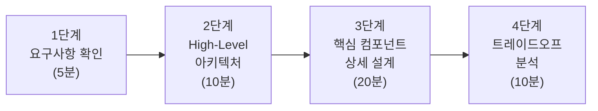

#### 1단계: 요구사항 확인 (5분)

| 구분 | 질문 예시 | 목적 |
|------|----------|------|
| **기능 요구사항 (FR)** | "핵심 기능 3가지는?" | 범위 한정 |
| **비기능 요구사항 (NFR)** | "오프라인 지원 필요?" | 설계 방향 결정 |
| **규모** | "DAU는? 동시 접속자?" | 확장성 판단 |
| **플랫폼** | "iOS/Android 모두? 태블릿?" | UI/UX 전략 |
| **제약** | "배터리, 네트워크 환경?" | 최적화 초점 |

**반드시 확인할 것:**
- 사용자 유형 (일반/관리자/비즈니스)
- 데이터 일관성 수준 (Strong/Eventual)
- 실시간 요구사항 여부

#### 2단계: High-Level 아키텍처 (10분)

모바일 시스템 설계의 기본 구조를 그림으로 제시합니다.

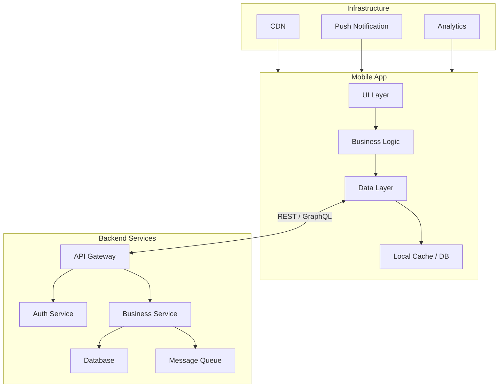

#### 3단계: 핵심 컴포넌트 상세 설계 (20분)

면접관이 관심을 보이는 영역을 깊이 있게 설계합니다.

| 설계 영역 | 다루어야 할 내용 |
|-----------|-----------------|
| **데이터 모델** | Entity 설계, 관계, 정규화 수준 |
| **API 설계** | Endpoint, Request/Response, 에러 처리 |
| **상태 관리** | 로컬 상태 vs 서버 상태, 캐시 전략 |
| **동기화** | 오프라인 큐, 충돌 해결, 낙관적 업데이트 |
| **성능** | 페이지네이션, 이미지 최적화, 프리로딩 |

#### 4단계: 트레이드오프 분석 (10분) :red_circle:

| 결정 항목 | 선택지 A | 선택지 B | 판단 기준 |
|-----------|---------|---------|-----------|
| 통신 방식 | REST API | GraphQL | 데이터 복잡도, 오버페칭 |
| 캐시 전략 | Cache-First | Network-First | 데이터 신선도 요구사항 |
| 상태 관리 | Bloc | Riverpod | 팀 규모, 러닝 커브 |
| 로컬 DB | SQLite (Drift) | NoSQL (Hive) | 쿼리 복잡도, 관계형 데이터 |
| 동기화 | Last-Write-Wins | CRDT | 충돌 빈도, 데이터 중요도 |
| 이미지 로딩 | 즉시 로드 | Lazy Load | 초기 로드 시간 vs UX |

---

### 2.2 비기능 요구사항 체크리스트 :yellow_circle:

| NFR 카테고리 | 세부 항목 | 질문 예시 |
|-------------|----------|-----------|
| **성능** | 앱 시작 시간, 화면 전환 속도, FPS | "콜드 스타트 2초 이내?" |
| **확장성** | DAU 증가 대응, 데이터 증가 | "100만 DAU까지 확장?" |
| **가용성** | 오프라인 지원, 서버 장애 대응 | "네트워크 없이도 기본 동작?" |
| **보안** | 인증, 데이터 암호화, 코드 보호 | "민감 데이터 저장 방식?" |
| **접근성** | 스크린 리더, 폰트 크기, 색상 대비 | "WCAG AA 준수?" |
| **국제화** | 다국어, RTL, 날짜/통화 포맷 | "한국/일본/미국 지원?" |
| **테스트** | 테스트 커버리지, E2E 테스트 | "CI/CD 파이프라인?" |
| **배터리** | 백그라운드 작업, GPS 사용 빈도 | "위치 추적 시 배터리 소모?" |
| **네트워크** | 저대역폭, 고지연 환경 대응 | "3G 환경에서도 사용 가능?" |

---

### 2.3 API 설계 원칙 요약 :yellow_circle:

| 원칙 | 설명 | 모바일 관점 |
|------|------|-------------|
| **최소 데이터 전송** | 필요한 필드만 반환 | 대역폭 절약, 파싱 비용 절감 |
| **페이지네이션** | Cursor-based > Offset-based | 실시간 데이터 변경에 강건 |
| **Idempotency** | 동일 요청 여러 번 보내도 동일 결과 | 네트워크 불안정 시 재시도 안전 |
| **버전 관리** | URL prefix (`/v1/`) 또는 Header | 구 버전 앱 하위 호환 |
| **에러 응답 표준화** | `{ code, message, details }` | 클라이언트 에러 핸들링 통일 |
| **Rate Limiting** | 429 Too Many Requests | 클라이언트 측 지수 백오프 구현 |
| **압축** | gzip/br 응답 압축 | 대용량 JSON 전송 최적화 |

**모바일 API 설계 팁:**

```
# Cursor-based Pagination (권장)
GET /api/v1/posts?cursor=abc123&limit=20

# Response
{
  "data": [...],
  "next_cursor": "def456",
  "has_more": true
}
```

| Pagination 방식 | 장점 | 단점 |
|----------------|------|------|
| **Offset-based** | 구현 단순, 페이지 번호 표시 가능 | 실시간 데이터 추가/삭제 시 중복/누락 |
| **Cursor-based** | 실시간 안전, 성능 우수 | 임의 페이지 접근 불가 |
| **Keyset-based** | 대용량 데이터 최적 | 정렬 키 필수, 구현 복잡 |

---

## 3. 대표 시스템 설계 문제 5개

---

### 문제 1: 실시간 채팅 앱 :yellow_circle:

#### 핵심 요구사항
- 1:1 및 그룹 채팅
- 텍스트, 이미지, 파일 전송
- 읽음 확인, 타이핑 인디케이터
- 오프라인 메시지 큐

#### 아키텍처 다이어그램

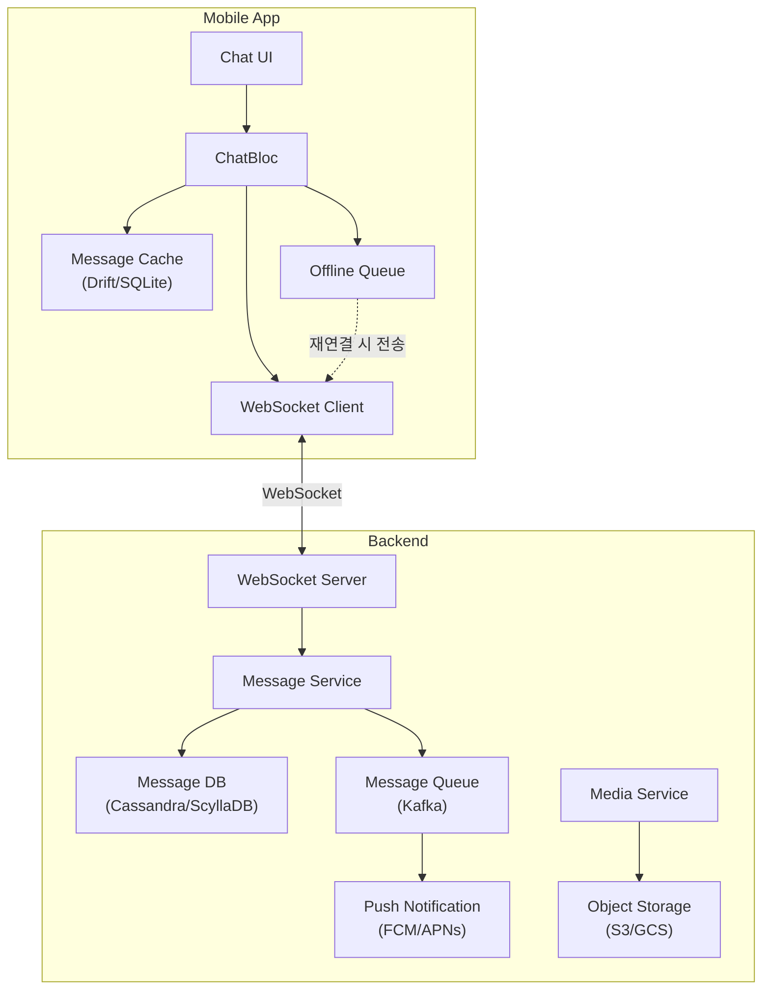

#### 핵심 컴포넌트

| 컴포넌트 | 기술 선택 | 이유 |
|---------|----------|------|
| **실시간 통신** | WebSocket | 양방향, 저지연, 지속 연결 |
| **메시지 저장** | Cassandra / ScyllaDB | 시간 기반 쿼리 최적화, 높은 쓰기 처리량 |
| **메시지 큐** | Kafka | 순서 보장, 높은 처리량, 재처리 가능 |
| **로컬 캐시** | Drift (SQLite) | 관계형 쿼리, 검색, 오프라인 지원 |
| **미디어 저장** | S3 + CDN | 대용량 파일, 글로벌 배포 |
| **푸시 알림** | FCM / APNs | 백그라운드 알림, 배터리 효율 |

#### 주요 트레이드오프

| 결정 | 선택 A | 선택 B | 권장 |
|------|-------|-------|------|
| 프로토콜 | WebSocket | MQTT | **WebSocket** (범용, 브라우저 호환) |
| 메시지 순서 | 서버 타임스탬프 | 클라이언트 타임스탬프 | **서버** (일관성) + 클라이언트 (UX) |
| 읽음 확인 | 즉시 전송 | 배치 전송 | **배치** (네트워크 효율) |
| 미디어 업로드 | 인라인 (Base64) | 사전 서명 URL | **사전 서명 URL** (서버 부하 감소) |

#### 오프라인 동기화 전략

```
1. 메시지 전송 -> 로컬 DB 저장 (status: pending)
2. WebSocket으로 전송 시도
3. 실패 시 -> Offline Queue에 추가
4. 재연결 시 -> Queue 순차 처리 (FIFO)
5. 서버 확인 -> 로컬 DB 업데이트 (status: sent)
6. 상대방 수신 확인 -> status: delivered -> read
```

---

### 문제 2: 대규모 이미지 피드 (Instagram 스타일) :yellow_circle:

#### 핵심 요구사항
- 무한 스크롤 피드
- 이미지/동영상 표시
- 좋아요, 댓글, 공유
- 빠른 스크롤 시에도 부드러운 UX

#### 아키텍처 다이어그램

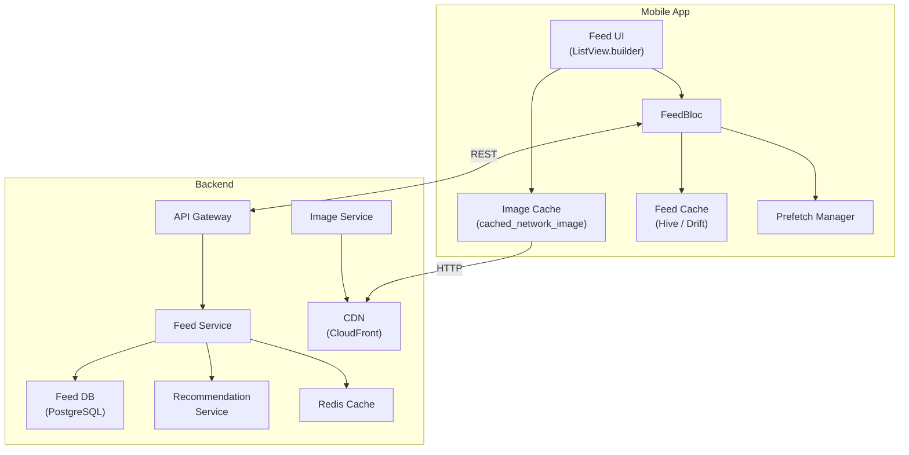

#### 이미지 캐싱 전략 3단계

| 단계 | 위치 | 전략 | TTL |
|------|------|------|-----|
| **L1** | 메모리 캐시 | LRU Cache (최근 50장) | 앱 생명주기 |
| **L2** | 디스크 캐시 | `cached_network_image` | 7일 |
| **L3** | CDN | CloudFront/Fastly | 30일 |

#### 성능 최적화 기법

| 기법 | 설명 | 효과 |
|------|------|------|
| **프리페칭** | 현재 화면 +2~3 페이지 미리 로드 | 스크롤 끊김 방지 |
| **이미지 리사이징** | 썸네일/중간/원본 3단계 | 대역폭 70% 절감 |
| **BlurHash** | 로딩 중 블러 플레이스홀더 | 지각 성능 향상 |
| **Lazy Loading** | 뷰포트 진입 시 로드 | 메모리 절약 |
| **ListView.builder** | 뷰포트 외 위젯 자동 해제 | 메모리 효율 |
| **Cursor Pagination** | 무한 스크롤, 중복 방지 | 데이터 일관성 |

#### 주요 트레이드오프

| 결정 | 선택 A | 선택 B | 권장 |
|------|-------|-------|------|
| 피드 알고리즘 | Fan-out on Write | Fan-out on Read | **Write** (팔로워 < 10K), **Read** (셀럽) |
| 이미지 포맷 | JPEG | WebP/AVIF | **WebP** (30~50% 크기 절감) |
| 피드 캐시 | 전체 캐시 | 델타 업데이트 | **델타** (네트워크 효율) |
| 동영상 | 자동 재생 | 탭 재생 | **자동(WiFi)** + **탭(셀룰러)** |

---

### 문제 3: O2O 배달 앱 (실시간 위치 추적) :yellow_circle:

#### 핵심 요구사항
- 주문 상태 실시간 추적
- 배달원 위치 실시간 표시
- 예상 도착 시간 (ETA) 계산
- 배터리 최적화

#### 아키텍처 다이어그램

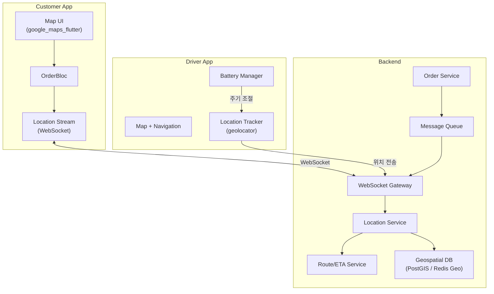

#### 위치 스트리밍 + 배터리 최적화 전략

| 상태 | GPS 주기 | 정확도 | 배터리 영향 |
|------|---------|--------|------------|
| **픽업 대기** | 30초 | 100m | 최소 |
| **픽업 이동 중** | 10초 | 50m | 중간 |
| **배달 중** | 3~5초 | 10m | 높음 |
| **배달 완료** | 추적 중단 | - | 없음 |
| **앱 백그라운드** | 30초 | 100m | 최소 |

```dart
// 상태별 GPS 설정 예시
LocationSettings getSettings(DeliveryStatus status) {
  return switch (status) {
    DeliveryStatus.idle => LocationSettings(
      accuracy: LocationAccuracy.low,
      distanceFilter: 100,
    ),
    DeliveryStatus.pickingUp => LocationSettings(
      accuracy: LocationAccuracy.medium,
      distanceFilter: 50,
    ),
    DeliveryStatus.delivering => LocationSettings(
      accuracy: LocationAccuracy.high,
      distanceFilter: 10,
    ),
    _ => LocationSettings(accuracy: LocationAccuracy.lowest),
  };
}
```

#### 지도 렌더링 최적화

| 기법 | 설명 |
|------|------|
| **마커 클러스터링** | 줌 레벨에 따라 근접 마커 그룹화 |
| **뷰포트 필터링** | 화면에 보이는 영역의 마커만 렌더링 |
| **위치 보간** | GPS 업데이트 사이 애니메이션으로 부드러운 이동 |
| **타일 캐싱** | 지도 타일 로컬 캐시 (오프라인 지원) |

---

### 문제 4: 오프라인 우선 메모 앱 :red_circle:

#### 핵심 요구사항
- 네트워크 없이도 완전한 CRUD 동작
- 다중 기기 동기화
- 충돌 해결 (같은 메모 동시 편집)
- 실시간 동기화 상태 표시

#### 아키텍처 다이어그램

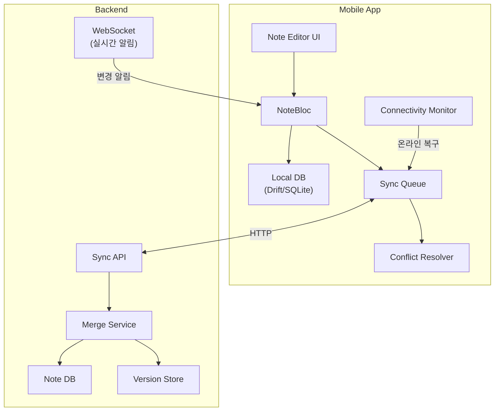

#### 충돌 해결 전략 비교 :red_circle:

| 전략 | 설명 | 장점 | 단점 | 적합한 상황 |
|------|------|------|------|-------------|
| **Last-Write-Wins (LWW)** | 마지막 수정 타임스탬프 기준 | 구현 단순 | 데이터 유실 가능 | 설정, 프로필 등 단순 데이터 |
| **CRDT** | 충돌 없는 복제 데이터 타입 | 자동 병합, 데이터 유실 없음 | 구현 복잡, 메모리 증가 | 공동 편집, 협업 도구 |
| **OT (Operational Transform)** | 연산 단위 변환 | 실시간 공동 편집에 최적 | 매우 복잡, 서버 의존 | Google Docs 스타일 |
| **3-Way Merge** | Base + Local + Remote 비교 | 필드별 세밀한 병합 | 자동 병합 불가 시 사용자 개입 | 폼 데이터, 구조화된 문서 |
| **Server Wins** | 서버 데이터 우선 | 일관성 보장 | 로컬 변경 유실 | 서버가 권위인 데이터 |

#### Sync Queue 동작 흐름

```
[오프라인 상태]
1. 사용자 편집 -> LocalDB 저장 (syncStatus: pending)
2. SyncQueue에 {entityId, operation, payload, timestamp} 추가

[온라인 복구]
3. ConnectivityMonitor가 온라인 감지
4. SyncQueue에서 pending 작업 순차 처리
5. 서버 API 호출
   - 성공: syncStatus -> synced, Queue에서 제거
   - 409 Conflict: ConflictResolver 실행
   - 5xx: retryCount++, 지수 백오프 후 재시도 (최대 5회)
6. 실패 큐 아이템은 사용자에게 알림
```

#### 주요 트레이드오프

| 결정 | 권장 | 이유 |
|------|------|------|
| 로컬 DB | Drift (SQLite) | 관계형 쿼리, Stream 지원, 마이그레이션 |
| 충돌 해결 | LWW + 수동 해결 병행 | 대부분 LWW로 처리, 중요 충돌만 사용자 확인 |
| 동기화 트리거 | 연결 복구 + 주기적 (15분) | 즉시성 + 안정성 균형 |
| 삭제 처리 | Soft Delete + TTL | 동기화 완료 후 30일 뒤 물리 삭제 |

---

### 문제 5: White-Label SaaS 모바일 앱 :red_circle:

#### 핵심 요구사항
- 하나의 코드베이스로 N개 브랜드 앱 빌드
- 브랜드별 테마, 로고, 기능 분기
- 독립적 배포 및 OTA 업데이트
- 멀티 테넌트 데이터 격리

#### 아키텍처 다이어그램

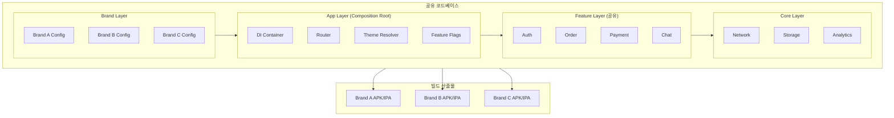

#### 핵심 구성 요소

| 구성 요소 | 구현 방법 | 설명 |
|-----------|----------|------|
| **Flavor** | `--flavor brandA --dart-define-from-file` | 빌드 타임 브랜드 분리 |
| **동적 테마** | `BrandConfig.lightTheme` / `darkTheme` | 브랜드별 ColorScheme, Typography |
| **Feature Toggle** | `Set<Feature> enabledFeatures` | 브랜드별 기능 ON/OFF |
| **에셋 분리** | `assets/brand_a/`, `assets/brand_b/` | 로고, 아이콘, 폰트 |
| **API 분리** | `BrandConfig.apiBaseUrl` | 브랜드별 백엔드 엔드포인트 |
| **패키지명** | `applicationId` per flavor | 스토어 별도 등록 |

#### White-Label vs Multi-Tenant 선택 기준

| 기준 | White-Label | Multi-Tenant |
|------|-------------|--------------|
| **바이너리** | 브랜드별 N개 | 단일 1개 |
| **스토어 등록** | 브랜드별 별도 | 하나만 등록 |
| **테마 결정 시점** | 빌드 타임 | 런타임 (서버에서 로드) |
| **기능 분기** | 빌드 타임 Feature Flag | 런타임 Feature Flag |
| **데이터 격리** | 앱 자체가 물리적 분리 | Tenant ID로 논리적 격리 |
| **적합 규모** | 5~50개 브랜드 | 50개 이상 테넌트 |

#### 배포 파이프라인

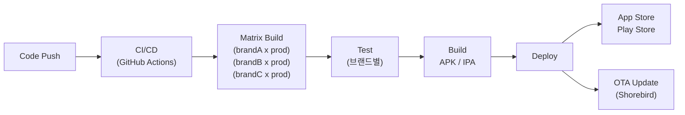

#### 주요 트레이드오프

| 결정 | 권장 | 이유 |
|------|------|------|
| 테마 시스템 | `ThemeExtension` | Material3 호환, 타입 안전 |
| Feature Flag | 빌드타임 (`dart-define`) + 런타임 (Remote Config) | 빌드 크기 최적화 + 실시간 제어 |
| OTA | Shorebird | Dart 코드 핫 패치, 스토어 심사 우회 |
| 모듈화 | Melos Monorepo | 코드 공유 + 독립 빌드 + 증분 테스트 |

---

## 4. 모바일 특화 설계 고려사항

### 4.1 네트워크 불안정 처리 전략 :yellow_circle:

| 전략 | 설명 | 구현 방법 | 사용 시나리오 |
|------|------|----------|-------------|
| **지수 백오프 재시도** | 실패 시 1s -> 2s -> 4s -> 8s 대기 후 재시도 | Dio Interceptor + retry 로직 | API 호출 실패 |
| **Optimistic Update** | 서버 응답 전 UI 먼저 업데이트, 실패 시 롤백 | Bloc에서 즉시 emit -> API 호출 -> 롤백 | 좋아요, 댓글 |
| **Offline Queue** | 오프라인 작업을 큐에 저장, 온라인 시 순차 처리 | SyncQueueManager + Drift | CRUD 작업 |
| **Stale-While-Revalidate** | 캐시 데이터 먼저 반환, 백그라운드 갱신 | Repository에서 Local -> 즉시 반환 -> Remote 갱신 | 피드, 목록 |
| **Circuit Breaker** | 연속 실패 시 일정 시간 요청 차단 | 실패 카운터 + 타임아웃 | 서버 장애 시 |
| **Request Deduplication** | 동일 요청 중복 방지 | Completer 패턴 | 토큰 갱신, 초기 로드 |

```dart
// 지수 백오프 예시
Duration getRetryDelay(int retryCount) {
  final seconds = (1 << retryCount).clamp(1, 32); // 1, 2, 4, 8, 16, 32
  return Duration(seconds: seconds);
}
```

---

### 4.2 오프라인 우선 아키텍처 패턴 비교 :red_circle:

| 패턴 | 동작 방식 | 장점 | 단점 | 적합한 앱 |
|------|----------|------|------|-----------|
| **Sync Queue** | 변경사항 큐잉 -> 순차 전송 | 구현 단순, 순서 보장 | 충돌 해결 별도 필요 | CRUD 앱, 메모, 할일 |
| **CRDT** | 충돌 없는 자동 병합 | 데이터 유실 없음 | 메모리 오버헤드, 구현 복잡 | 공동 편집, 협업 |
| **Event Sourcing** | 이벤트 스트림 저장 -> Replay | 감사 로그, Undo/Redo | 이벤트 수 증가, 복잡도 | 금융, 의료 |
| **Eventual Consistency** | 최종적 일관성 보장 | 높은 가용성 | 일시적 불일치 허용 필요 | SNS, 피드 |

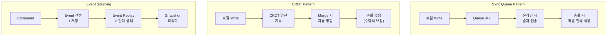

---

### 4.3 인증 시스템 설계 요약 :yellow_circle:

#### JWT 토큰 회전 (Rotation) 전략

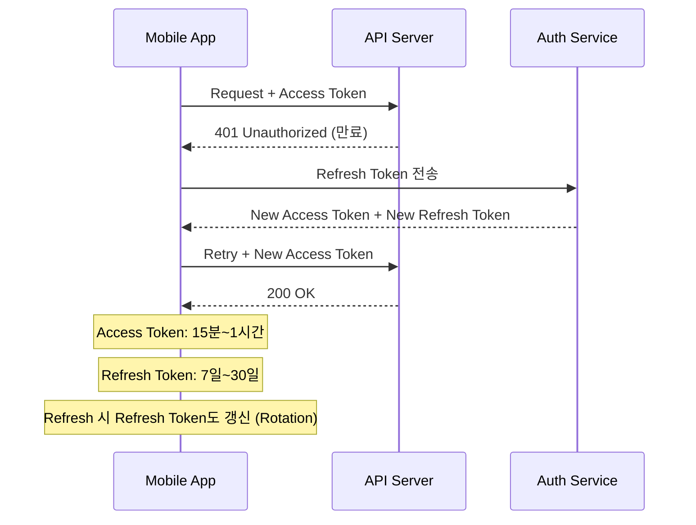

| 항목 | 설명 |
|------|------|
| **Access Token** | 짧은 수명 (15분~1시간), 요청마다 헤더에 포함 |
| **Refresh Token** | 긴 수명 (7~30일), Secure Storage에 암호화 저장 |
| **Token Rotation** | Refresh 시 Refresh Token도 갱신 -> 탈취 감지 |
| **동시 401 처리** | Completer 패턴으로 갱신 중 요청 큐잉 |

#### OAuth2 PKCE 흐름 (모바일 권장)

| 단계 | 설명 |
|------|------|
| 1 | `code_verifier` (랜덤 문자열) 생성 |
| 2 | `code_challenge` = SHA256(code_verifier) 생성 |
| 3 | 인증 서버로 `code_challenge` 전송 -> 인증 코드 수령 |
| 4 | 인증 코드 + `code_verifier`로 토큰 교환 |
| 5 | 서버가 `code_verifier` 검증 -> Access/Refresh Token 발급 |

> PKCE는 모바일 앱에서 Client Secret 없이 안전한 OAuth2 흐름을 구현하는 표준입니다.

#### 소셜 로그인 통합 패턴

| 소셜 로그인 | SDK | 토큰 유형 | 백엔드 연동 |
|------------|-----|----------|-----------|
| **Google** | `google_sign_in` | ID Token | 서버에서 ID Token 검증 -> JWT 발급 |
| **Apple** | `sign_in_with_apple` | Authorization Code | 서버에서 Apple API로 검증 -> JWT 발급 |
| **카카오** | `kakao_flutter_sdk` | Access Token | 서버에서 카카오 API 호출 -> 사용자 정보 확인 -> JWT 발급 |

---

### 4.4 모바일 보안 계층 요약 :yellow_circle:

| 보안 계층 | 위협 | 방어 수단 |
|----------|------|----------|
| **저장소 보안** | 로컬 데이터 탈취 | `flutter_secure_storage` (Keychain/Keystore), DB 암호화 |
| **통신 보안** | 중간자 공격 (MITM) | TLS 1.3, Certificate Pinning, HSTS |
| **코드 보안** | 리버스 엔지니어링 | ProGuard/R8, 코드 난독화, 루팅/탈옥 감지 |
| **인증 보안** | 세션 하이재킹, 토큰 탈취 | JWT Rotation, PKCE, 생체인증 연동 |
| **입력 보안** | SQL Injection, XSS | 파라미터 바인딩, 입력 검증, HTML 이스케이프 |
| **API 보안** | 무차별 대입, Rate Limit 우회 | Rate Limiting, API Key, 요청 서명 |

```
보안 레이어 스택:

┌─────────────────────────────┐
│  앱 레벨 보안                 │  루팅/탈옥 감지, 코드 난독화
├─────────────────────────────┤
│  인증/인가 레이어             │  JWT, RBAC, 생체인증
├─────────────────────────────┤
│  통신 레이어                 │  TLS, Certificate Pinning
├─────────────────────────────┤
│  저장소 레이어               │  Keychain/Keystore, 암호화 DB
├─────────────────────────────┤
│  OS 레이어                   │  App Sandbox, 권한 관리
└─────────────────────────────┘
```

---

### 4.5 앱 배포 전략 비교표 :red_circle:

| 전략 | 설명 | 장점 | 단점 | 롤백 |
|------|------|------|------|------|
| **일반 배포** | 스토어에 새 버전 제출 | 스토어 검증, 안정적 | 심사 시간 (1~7일), 느린 배포 | 이전 버전 재제출 |
| **Canary Release** | 소수 사용자에게 먼저 배포 (1% -> 10% -> 100%) | 위험 최소화, 조기 문제 발견 | 구현 복잡, 여러 버전 동시 관리 | 롤아웃 중단 |
| **Blue-Green** | 두 환경 준비, 트래픽 전환 | 즉시 롤백 가능 | 인프라 비용 2배 | 트래픽 전환 |
| **OTA (Shorebird)** | 스토어 심사 없이 Dart 코드 업데이트 | 즉시 배포 (분 단위) | 네이티브 코드 변경 불가, Dart만 | 이전 패치 롤백 |
| **Feature Flag** | 기능 단위 ON/OFF | 배포 없이 기능 제어 | 코드 복잡도 증가, 기술 부채 | Flag OFF |
| **Staged Rollout** | Play Store/App Store의 단계적 배포 | 스토어 내장 기능 | 제어 제한적 | 롤아웃 중단 |

#### OTA (Shorebird) vs 스토어 배포 :red_circle:

| 항목 | 스토어 배포 | Shorebird OTA |
|------|-----------|---------------|
| **배포 시간** | 1~7일 (심사) | 분 단위 |
| **업데이트 범위** | 전체 (네이티브 + Dart) | Dart 코드만 |
| **사용자 액션** | 스토어에서 업데이트 | 자동 (앱 재시작 시 적용) |
| **핫픽스** | 긴급 심사 요청 (1~2일) | 즉시 패치 |
| **비용** | 무료 | Shorebird 유료 |
| **정책 리스크** | 없음 | Apple 정책 주의 (코드 실행 변경 제한) |

---

### 빠른 참조: 면접 키워드 정리

#### 아키텍처 키워드 :yellow_circle:

| 키워드 | 한 줄 설명 |
|--------|-----------|
| **Clean Architecture** | Presentation/Domain/Data 3계층, 의존성 안쪽 방향 |
| **Repository Pattern** | 데이터 소스 추상화, Domain이 Interface 소유 |
| **UseCase** | 단일 비즈니스 액션 캡슐화 |
| **DI (Dependency Injection)** | 의존성을 외부에서 주입, 테스트 용이 |
| **Bloc Pattern** | Event -> State 단방향 상태 관리 |
| **Either<Failure, T>** | 함수형 에러 처리, try-catch 대체 |

#### 시스템 설계 키워드 :red_circle:

| 키워드 | 한 줄 설명 |
|--------|-----------|
| **CQRS** | 읽기/쓰기 모델 분리, 읽기 최적화 |
| **Event Sourcing** | 상태 대신 이벤트 저장, 감사 로그 내장 |
| **CRDT** | 충돌 없는 분산 데이터 타입, 자동 병합 |
| **Saga Pattern** | 분산 트랜잭션 관리, 보상 트랜잭션 |
| **Circuit Breaker** | 연속 실패 시 요청 차단, 서비스 보호 |
| **Backpressure** | 데이터 생산 속도 > 소비 속도 시 제어 |
| **Fan-out** | 쓰기 시 미리 배포 (Write) vs 읽기 시 조합 (Read) |
| **Sharding** | 데이터 수평 분할, 확장성 확보 |
| **CAP Theorem** | Consistency/Availability/Partition Tolerance 중 2개만 선택 |
| **Eventual Consistency** | 최종적 일관성, 분산 시스템에서 가용성 우선 |

---

### 면접 답변 체크리스트

#### 답변 시 반드시 포함할 것 :yellow_circle:

- [ ] 요구사항 확인 질문을 먼저 했는가?
- [ ] High-Level 아키텍처 다이어그램을 그렸는가?
- [ ] 데이터 모델을 정의했는가?
- [ ] API 엔드포인트를 설계했는가?
- [ ] 오프라인 시나리오를 고려했는가?
- [ ] 에러 핸들링 전략을 설명했는가?

#### L6 추가 평가 항목 :red_circle:

- [ ] 트레이드오프를 명확히 분석하고 근거를 제시했는가?
- [ ] 확장성 (수평/수직) 전략을 설명했는가?
- [ ] 보안 고려사항을 언급했는가?
- [ ] 성능 병목점을 식별하고 해결책을 제시했는가?
- [ ] 모니터링/관측성(Observability) 전략을 포함했는가?
- [ ] 팀/조직 관점에서의 모듈 소유권을 고려했는가?
- [ ] 점진적 마이그레이션 전략을 제시할 수 있는가?

---

## 관련 문서

| 문서 | 설명 |
|------|------|
| [Architecture.md](../core/Architecture.md) | Clean Architecture 상세 |
| [AdvancedPatterns.md](../advanced/AdvancedPatterns.md) | DDD, Hexagonal, CQRS, Event Sourcing |
| [ModularArchitecture.md](../advanced/ModularArchitecture.md) | 모듈러 아키텍처, Melos Monorepo |
| [WhiteLabelArchitecture.md](../advanced/WhiteLabelArchitecture.md) | White-Label / Multi-Tenant |
| [OfflineSupport.md](../advanced/OfflineSupport.md) | 오프라인 우선 아키텍처 |
| [Authentication.md](../features/Authentication.md) | 인증 시스템 설계 |
| [WebSocket.md](../networking/WebSocket.md) | WebSocket 실시간 통신 |
