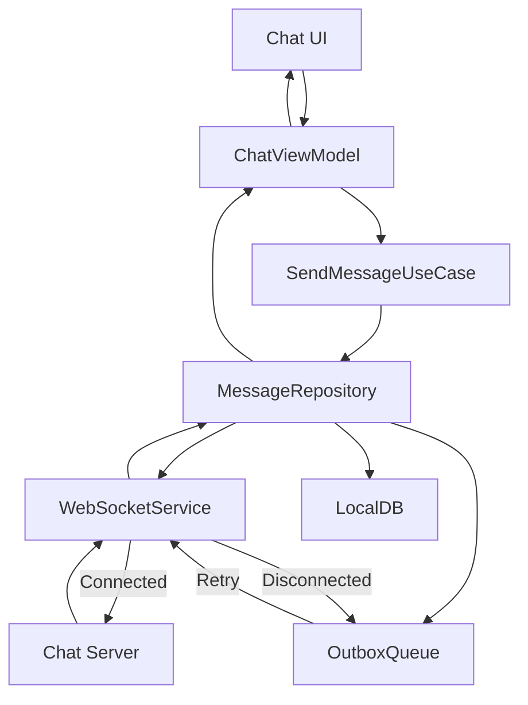

# Flutter 면접 Q&A — L5 Senior

> **대상**: SWE L5 (Senior, 4-7년 경력)
> **포지션**: 모바일 엔지니어 + 시스템 설계
> **마지막 업데이트**: 2026-02-08 | **Flutter 3.38** | **Dart 3.10**
> **문항 수**: 35개

## 목차

1. [아키텍처 설계 (8문항)](#1-아키텍처-설계)
2. [성능 최적화 (6문항)](#2-성능-최적화)
3. [시스템 설계 (7문항)](#3-시스템-설계)
4. [테스트 & 품질 (5문항)](#4-테스트--품질)
5. [보안 (4문항)](#5-보안)
6. [팀 리딩 (5문항)](#6-팀-리딩)

---

## 1. 아키텍처 설계

### Q1. Clean Architecture 구현 시 가장 흔한 의존성 위반 사례와 해결 방법을 설명해주세요

**핵심 키워드**: Dependency Rule, Layer Boundary, Anti-pattern

**모범 답변**:
가장 흔한 위반 사례는 3가지입니다.

**1) Domain Layer의 Framework 의존**
```dart
// ❌ 나쁜 예: Domain이 Flutter에 의존
class UserEntity {
  final String id;
  final Color avatarColor; // Flutter 의존!

  UserEntity(this.id, this.avatarColor);
}

// ✅ 좋은 예: Primitive type 사용
class UserEntity {
  final String id;
  final int avatarColorValue; // 0xFFRRGGBB

  UserEntity(this.id, this.avatarColorValue);
}
```

**2) UseCase가 Repository 구현체 직접 참조**
```dart
// ❌ 나쁜 예
class GetUserUseCase {
  final UserRepositoryImpl repository; // 구현체 의존!

  Future<User> call(String id) => repository.getUser(id);
}

// ✅ 좋은 예: 인터페이스 의존
class GetUserUseCase {
  final UserRepository repository; // 추상화 의존

  Future<Either<Failure, User>> call(String id) async {
    return await repository.getUser(id);
  }
}
```

**3) Presentation이 Data Layer 직접 접근**
```dart
// ❌ 나쁜 예: ViewModel이 DataSource 직접 호출
class UserViewModel {
  final RemoteDataSource dataSource;

  Future<void> loadUser() async {
    final json = await dataSource.fetchUser();
    // ...
  }
}

// ✅ 좋은 예: UseCase를 통한 접근
class UserViewModel {
  final GetUserUseCase getUserUseCase;

  Future<void> loadUser() async {
    final result = await getUserUseCase('user-id');
    result.fold(
      (failure) => state = ErrorState(failure),
      (user) => state = LoadedState(user),
    );
  }
}
```

**의존성 검증 자동화**:
```dart
// test/architecture_test.dart
void main() {
  group('Architecture Rules', () {
    test('Domain layer should not depend on Flutter', () {
      final domainFiles = Directory('lib/domain')
          .listSync(recursive: true)
          .whereType<File>()
          .where((f) => f.path.endsWith('.dart'));

      for (final file in domainFiles) {
        final content = file.readAsStringSync();
        expect(
          content.contains("import 'package:flutter/"),
          isFalse,
          reason: '${file.path} depends on Flutter',
        );
      }
    });
  });
}
```

**평가 기준**:
- ✅ 좋은 답변: 구체적 코드 예시와 함께 3가지 이상 위반 사례 제시, 자동 검증 방법 언급
- ❌ 나쁜 답변: "레이어를 잘 나눠야 한다" 수준의 추상적 답변

**꼬리 질문**:
- Dependency Injection Container(GetIt, Riverpod)를 어느 레이어에서 설정하나요?
- Domain Layer에서 DateTime을 사용해도 되나요?

**참고 문서**: [Clean Architecture 가이드](../docs/architecture/clean-architecture.md)

---

### Q2. Monolith vs Mono-repo 구조의 장단점과 선택 기준을 설명해주세요

**핵심 키워드**: Code Organization, Scalability, Build Time

**모범 답변**:
프로젝트 규모와 팀 구조에 따라 선택이 달라집니다.

**구조 비교**:
```
Monolith (Single Package)
my_app/
├── lib/
│   ├── features/
│   │   ├── auth/
│   │   ├── home/
│   │   └── profile/
│   └── main.dart
└── pubspec.yaml

Mono-repo (Multiple Packages)
workspace/
├── apps/
│   ├── customer_app/
│   │   └── pubspec.yaml
│   └── driver_app/
│       └── pubspec.yaml
├── packages/
│   ├── core/
│   ├── design_system/
│   └── domain/
└── melos.yaml
```

**Monolith 장점**:
- 단순한 의존성 관리 (단일 pubspec.yaml)
- 빠른 Hot Reload (전체 앱이 한 번에 로드)
- 팀 규모 5명 이하일 때 오버헤드 최소화

**Monolith 단점**:
```dart
// 순환 참조 방지 어려움
// lib/features/auth/auth_service.dart
import '../profile/profile_service.dart'; // 위험!

// lib/features/profile/profile_service.dart
import '../auth/auth_service.dart'; // 순환 참조 발생
```

**Mono-repo 장점**:
```yaml
# melos.yaml
name: my_workspace
packages:
  - apps/**
  - packages/**

scripts:
  analyze:
    run: melos exec -- dart analyze .
    description: Run analysis for all packages

  test:
    run: melos exec -- flutter test
    packageFilters:
      dirExists: test
```

- 강제된 의존성 방향 (packages/ → apps/ 방향만 가능)
- 독립적 버전 관리 및 배포
- Feature 단위 병렬 개발 가능

**Mono-repo 단점**:
- 초기 설정 복잡도 증가
- 의존성 버전 충돌 가능성
- CI/CD 빌드 시간 증가 (affected packages 감지 필요)

**선택 기준**:
| 조건 | 권장 구조 |
|------|-----------|
| 팀 규모 5명 이하, 단일 앱 | Monolith |
| 여러 앱 공유 (고객/관리자) | Mono-repo |
| 엔터프라이즈 (10+ 팀) | Mono-repo + Melos |
| 빠른 MVP 개발 | Monolith → 필요시 전환 |

**전환 전략**:
```bash
# Monolith → Mono-repo 마이그레이션
melos bootstrap
flutter pub run package_rename:extract \
  --source lib/features/auth \
  --target packages/auth
```

**평가 기준**:
- ✅ 좋은 답변: 실제 프로젝트 경험 기반 trade-off 분석, 전환 시나리오 제시
- ❌ 나쁜 답변: "Mono-repo가 무조건 좋다" 식의 일방적 주장

**꼬리 질문**:
- Melos와 Turborepo의 차이점은?
- path 의존성과 pub 의존성의 장단점은?

**참고 문서**: [프로젝트 구조 가이드](../docs/architecture/project-structure.md)

---

### Q3. Domain-Driven Design(DDD)을 Flutter에 적용할 때 핵심 패턴과 한계점을 설명해주세요

**핵심 키워드**: Aggregate, Value Object, Bounded Context

**모범 답변**:
DDD의 핵심 패턴 3가지를 Flutter에 맞게 적용합니다.

**1) Value Object로 Validation 캡슐화**:
```dart
// domain/value_objects/email_address.dart
class EmailAddress {
  final String value;

  EmailAddress._(this.value);

  factory EmailAddress(String input) {
    if (!_isValid(input)) {
      throw ArgumentError('Invalid email: $input');
    }
    return EmailAddress._(input);
  }

  static bool _isValid(String input) {
    return RegExp(r'^[\w-\.]+@([\w-]+\.)+[\w-]{2,4}$').hasMatch(input);
  }

  @override
  bool operator ==(Object other) =>
      identical(this, other) ||
      other is EmailAddress && value == other.value;

  @override
  int get hashCode => value.hashCode;
}

// 사용
final email = EmailAddress('user@example.com'); // 항상 유효함 보장
```

**2) Aggregate로 불변식(Invariant) 보호**:
```dart
// domain/aggregates/order.dart
class Order {
  final OrderId id;
  final List<OrderItem> _items; // private!
  final OrderStatus status;

  Order._(this.id, this._items, this.status);

  factory Order.create(OrderId id) {
    return Order._(id, [], OrderStatus.draft);
  }

  // 비즈니스 규칙: 최소 1개 상품 필요
  Either<DomainFailure, Order> addItem(Product product, int quantity) {
    if (quantity <= 0) {
      return left(InvalidQuantityFailure());
    }

    final newItems = [..._items, OrderItem(product, quantity)];
    return right(Order._(id, newItems, status));
  }

  // 비즈니스 규칙: Draft 상태만 제출 가능
  Either<DomainFailure, Order> submit() {
    if (status != OrderStatus.draft) {
      return left(InvalidStateTransitionFailure());
    }
    if (_items.isEmpty) {
      return left(EmptyOrderFailure());
    }

    return right(Order._(id, _items, OrderStatus.submitted));
  }

  UnmodifiableListView<OrderItem> get items => UnmodifiableListView(_items);
}
```

**3) Repository Pattern으로 Aggregate 저장**:
```dart
// domain/repositories/order_repository.dart
abstract class OrderRepository {
  Future<Either<Failure, Order>> findById(OrderId id);
  Future<Either<Failure, Unit>> save(Order order);
}

// data/repositories/order_repository_impl.dart
class OrderRepositoryImpl implements OrderRepository {
  final OrderRemoteDataSource remoteDataSource;
  final OrderLocalDataSource localDataSource;

  @override
  Future<Either<Failure, Order>> findById(OrderId id) async {
    try {
      // 1. 로컬 캐시 확인
      final cached = await localDataSource.getOrder(id.value);
      if (cached != null) {
        return right(cached.toDomain());
      }

      // 2. 원격 조회
      final remote = await remoteDataSource.fetchOrder(id.value);

      // 3. 캐시 갱신
      await localDataSource.saveOrder(remote);

      return right(remote.toDomain());
    } catch (e) {
      return left(ServerFailure());
    }
  }
}
```

**Bounded Context 분리**:
```
lib/
├── contexts/
│   ├── ordering/           # 주문 컨텍스트
│   │   ├── domain/
│   │   │   ├── order.dart
│   │   │   └── order_repository.dart
│   │   └── application/
│   │       └── place_order_usecase.dart
│   └── inventory/          # 재고 컨텍스트
│       ├── domain/
│       │   ├── product.dart  # 다른 정의!
│       │   └── stock.dart
│       └── application/
```

**Flutter DDD의 한계**:
1. **ORM 부재**: Drift/Hive는 JPA/Hibernate 수준 아님
2. **Event Sourcing 복잡도**: SQLite로 구현 시 성능 이슈
3. **과도한 보일러플레이트**: Freezed 필수

```dart
// Freezed로 보일러플레이트 감소
@freezed
class Order with _$Order {
  const Order._();

  const factory Order({
    required OrderId id,
    required List<OrderItem> items,
    required OrderStatus status,
  }) = _Order;

  Either<DomainFailure, Order> submit() {
    if (status != OrderStatus.draft) {
      return left(InvalidStateTransitionFailure());
    }
    return right(copyWith(status: OrderStatus.submitted));
  }
}
```

**평가 기준**:
- ✅ 좋은 답변: Value Object와 Aggregate의 실전 코드, 한계점 인지
- ❌ 나쁜 답변: "Entity와 VO를 나눈다" 수준의 이론적 답변

**꼬리 질문**:
- Domain Event를 어떻게 구현하나요?
- Anemic Domain Model과의 차이점은?

**참고 문서**: [DDD in Flutter 가이드](../docs/architecture/ddd-patterns.md)

---

### Q4. Hexagonal Architecture와 Clean Architecture의 차이점과 Flutter 적용 시 선택 기준은?

**핵심 키워드**: Ports & Adapters, Dependency Inversion, Testability

**모범 답변**:
두 아키텍처 모두 의존성 역전을 추구하지만 구조적 차이가 있습니다.

**Hexagonal Architecture (Ports & Adapters)**:
```
       ┌─────────────────────────┐
       │   Driving Adapters      │
       │ (UI, CLI, Tests)        │
       └───────────┬─────────────┘
                   │
       ┌───────────▼─────────────┐
       │   Driving Ports         │ ◄─┐
       │ (Inbound Interface)     │   │
       └───────────┬─────────────┘   │
                   │                 │
       ┌───────────▼─────────────┐   │
       │   Application Core      │   │ Hexagon
       │   (Business Logic)      │   │
       └───────────┬─────────────┘   │
                   │                 │
       ┌───────────▼─────────────┐   │
       │   Driven Ports          │ ◄─┘
       │ (Outbound Interface)    │
       └───────────┬─────────────┘
                   │
       ┌───────────▼─────────────┐
       │   Driven Adapters       │
       │ (DB, APIs, Message Bus) │
       └─────────────────────────┘
```

**Hexagonal 구현 예시**:
```dart
// core/ports/inbound/create_user_port.dart (Driving Port)
abstract class CreateUserPort {
  Future<UserDto> execute(CreateUserCommand command);
}

// core/application/user_service.dart (Application Core)
class UserService implements CreateUserPort {
  final UserRepositoryPort repository; // Driven Port
  final EmailServicePort emailService; // Driven Port

  @override
  Future<UserDto> execute(CreateUserCommand command) async {
    final user = User.create(
      name: command.name,
      email: EmailAddress(command.email),
    );

    await repository.save(user);
    await emailService.sendWelcomeEmail(user.email);

    return UserDto.fromDomain(user);
  }
}

// core/ports/outbound/user_repository_port.dart (Driven Port)
abstract class UserRepositoryPort {
  Future<void> save(User user);
  Future<User?> findById(UserId id);
}

// adapters/driven/persistence/user_repository_adapter.dart
class UserRepositoryAdapter implements UserRepositoryPort {
  final Database db;

  @override
  Future<void> save(User user) async {
    await db.insert('users', user.toJson());
  }
}

// adapters/driving/ui/user_screen.dart
class UserScreen extends StatelessWidget {
  final CreateUserPort createUserPort; // Driving Port 의존

  Future<void> _handleSubmit() async {
    final command = CreateUserCommand(
      name: nameController.text,
      email: emailController.text,
    );
    await createUserPort.execute(command);
  }
}
```

**Clean Architecture (3 Layers)**:
```
┌──────────────────────────────────┐
│   Presentation Layer             │
│   (Widgets, ViewModels)          │
└────────────┬─────────────────────┘
             │ depends on
┌────────────▼─────────────────────┐
│   Domain Layer                   │
│   (Entities, UseCases, Repos)    │
└────────────┬─────────────────────┘
             │ implements
┌────────────▼─────────────────────┐
│   Data Layer                     │
│   (Models, DataSources)          │
└──────────────────────────────────┘
```

**Clean Architecture 구현 예시**:
```dart
// domain/usecases/create_user_usecase.dart
class CreateUserUseCase {
  final UserRepository repository;
  final EmailService emailService;

  Future<Either<Failure, User>> call(CreateUserParams params) async {
    final user = User.create(
      name: params.name,
      email: EmailAddress(params.email),
    );

    final result = await repository.save(user);
    return result.fold(
      (failure) => left(failure),
      (_) async {
        await emailService.sendWelcomeEmail(user.email);
        return right(user);
      },
    );
  }
}

// domain/repositories/user_repository.dart (Interface)
abstract class UserRepository {
  Future<Either<Failure, Unit>> save(User user);
  Future<Either<Failure, User>> findById(String id);
}

// data/repositories/user_repository_impl.dart
class UserRepositoryImpl implements UserRepository {
  final UserRemoteDataSource remoteDataSource;

  @override
  Future<Either<Failure, Unit>> save(User user) async {
    try {
      await remoteDataSource.createUser(UserModel.fromEntity(user));
      return right(unit);
    } catch (e) {
      return left(ServerFailure());
    }
  }
}

// presentation/bloc/user_bloc.dart
class UserBloc extends Bloc<UserEvent, UserState> {
  final CreateUserUseCase createUserUseCase;

  UserBloc(this.createUserUseCase) : super(UserInitial()) {
    on<CreateUserRequested>((event, emit) async {
      emit(UserLoading());

      final result = await createUserUseCase(
        CreateUserParams(name: event.name, email: event.email),
      );

      result.fold(
        (failure) => emit(UserError(failure.message)),
        (user) => emit(UserCreated(user)),
      );
    });
  }
}
```

**주요 차이점**:
| 항목 | Hexagonal | Clean Architecture |
|------|-----------|-------------------|
| **구조** | Port/Adapter 명시 | Layer 기반 |
| **인터페이스 위치** | Port 패키지 분리 | Domain에 Repository Interface |
| **UseCase 역할** | Application Service | 독립적 UseCase 클래스 |
| **테스트** | Port를 Mock | Repository를 Mock |
| **복잡도** | 높음 (Port 2배) | 중간 |

**Flutter 선택 기준**:
```dart
// 중소규모 (Recommended: Clean Architecture)
// - UseCase 기반 명확한 책임 분리
// - Flutter 커뮤니티 표준
lib/
├── presentation/
├── domain/
└── data/

// 대규모 엔터프라이즈 (Consider: Hexagonal)
// - 여러 Driving Adapter (REST API, GraphQL, gRPC)
// - 복잡한 Integration 시나리오
lib/
├── core/
│   ├── application/
│   └── ports/
└── adapters/
    ├── driving/
    └── driven/
```

**평가 기준**:
- ✅ 좋은 답변: 두 아키텍처의 구조적 차이를 코드로 설명, 프로젝트 규모별 선택 기준 제시
- ❌ 나쁜 답변: "Hexagonal이 더 고급이다" 식의 막연한 비교

**꼬리 질문**:
- Port와 Repository Interface의 차이는?
- Onion Architecture와는 어떻게 다른가요?

**참고 문서**: [아키텍처 비교 가이드](../docs/architecture/architecture-comparison.md)

---

### Q5. 대규모 앱에서 모듈 간 통신 패턴과 순환 참조 방지 전략을 설명해주세요

**핵심 키워드**: Event Bus, Mediator, Module Boundary

**모범 답변**:
모듈 간 강결합을 피하기 위한 3가지 패턴이 있습니다.

**1) Event Bus Pattern (느슨한 결합)**:
```dart
// core/events/app_events.dart
abstract class AppEvent {}

class UserLoggedInEvent extends AppEvent {
  final String userId;
  UserLoggedInEvent(this.userId);
}

class OrderPlacedEvent extends AppEvent {
  final String orderId;
  OrderPlacedEvent(this.orderId);
}

// core/event_bus.dart
class EventBus {
  final _controller = StreamController<AppEvent>.broadcast();

  Stream<T> on<T extends AppEvent>() {
    return _controller.stream.where((event) => event is T).cast<T>();
  }

  void fire(AppEvent event) {
    _controller.add(event);
  }

  void dispose() {
    _controller.close();
  }
}

// features/auth/auth_service.dart
class AuthService {
  final EventBus eventBus;

  Future<void> login(String email, String password) async {
    final user = await _authenticate(email, password);

    // 다른 모듈에 알림 (직접 의존 없음)
    eventBus.fire(UserLoggedInEvent(user.id));
  }
}

// features/analytics/analytics_service.dart
class AnalyticsService {
  final EventBus eventBus;
  StreamSubscription? _subscription;

  void init() {
    _subscription = eventBus.on<UserLoggedInEvent>().listen((event) {
      _trackLogin(event.userId);
    });
  }

  void dispose() {
    _subscription?.cancel();
  }
}
```

**2) Mediator Pattern (중재자)**:
```dart
// core/mediator/mediator.dart
abstract class Request<T> {}
abstract class RequestHandler<TRequest extends Request<T>, T> {
  Future<T> handle(TRequest request);
}

class Mediator {
  final Map<Type, RequestHandler> _handlers = {};

  void register<TRequest extends Request<T>, T>(
    RequestHandler<TRequest, T> handler,
  ) {
    _handlers[TRequest] = handler;
  }

  Future<T> send<T>(Request<T> request) async {
    final handler = _handlers[request.runtimeType];
    if (handler == null) {
      throw Exception('No handler registered for ${request.runtimeType}');
    }
    return await handler.handle(request);
  }
}

// features/order/requests/create_order_request.dart
class CreateOrderRequest extends Request<OrderDto> {
  final List<OrderItemDto> items;
  CreateOrderRequest(this.items);
}

class CreateOrderHandler extends RequestHandler<CreateOrderRequest, OrderDto> {
  final OrderRepository orderRepository;
  final InventoryService inventoryService;

  @override
  Future<OrderDto> handle(CreateOrderRequest request) async {
    // 재고 확인 (다른 모듈 호출하지 않음)
    final order = await orderRepository.create(request.items);
    return OrderDto.fromDomain(order);
  }
}

// features/checkout/checkout_viewmodel.dart
class CheckoutViewModel {
  final Mediator mediator;

  Future<void> placeOrder() async {
    final request = CreateOrderRequest(cartItems);

    // 직접 의존 없이 요청
    final order = await mediator.send(request);

    // UI 업데이트
    state = CheckoutSuccess(order);
  }
}

// main.dart
void main() {
  final mediator = Mediator();
  mediator.register(CreateOrderHandler(orderRepo, inventoryService));
  mediator.register(GetUserHandler(userRepo));

  runApp(MyApp(mediator: mediator));
}
```

**3) Dependency Inversion (인터페이스 분리)**:
```dart
// ❌ 나쁜 예: 순환 참조
// features/auth/auth_service.dart
import '../profile/profile_service.dart'; // 위험!

class AuthService {
  final ProfileService profileService;

  Future<void> login() async {
    await profileService.loadProfile(); // 직접 호출
  }
}

// features/profile/profile_service.dart
import '../auth/auth_service.dart'; // 순환 참조!

class ProfileService {
  final AuthService authService;

  Future<void> logout() async {
    await authService.clearSession();
  }
}

// ✅ 좋은 예: 인터페이스로 역전
// core/interfaces/session_manager.dart
abstract class SessionManager {
  Future<void> clearSession();
  Stream<SessionState> get sessionStream;
}

// features/auth/auth_service.dart
class AuthService implements SessionManager {
  final _sessionController = StreamController<SessionState>.broadcast();

  @override
  Future<void> clearSession() async {
    await _secureStorage.deleteAll();
    _sessionController.add(SessionState.loggedOut);
  }

  @override
  Stream<SessionState> get sessionStream => _sessionController.stream;
}

// features/profile/profile_service.dart
class ProfileService {
  final SessionManager sessionManager; // 인터페이스 의존

  void init() {
    sessionManager.sessionStream.listen((state) {
      if (state == SessionState.loggedOut) {
        _clearProfileCache();
      }
    });
  }
}
```

**모듈 간 의존성 시각화**:
```dart
// scripts/check_dependencies.dart
import 'dart:io';

void main() {
  final features = Directory('lib/features').listSync();
  final dependencies = <String, Set<String>>{};

  for (final feature in features) {
    final featureName = feature.path.split('/').last;
    dependencies[featureName] = {};

    final dartFiles = Directory(feature.path)
        .listSync(recursive: true)
        .whereType<File>()
        .where((f) => f.path.endsWith('.dart'));

    for (final file in dartFiles) {
      final imports = file
          .readAsLinesSync()
          .where((line) => line.startsWith("import '../"));

      for (final import in imports) {
        final match = RegExp(r"import '\.\./([^/]+)/").firstMatch(import);
        if (match != null) {
          dependencies[featureName]!.add(match.group(1)!);
        }
      }
    }
  }

  // 순환 참조 검출
  for (final entry in dependencies.entries) {
    for (final dep in entry.value) {
      if (dependencies[dep]?.contains(entry.key) == true) {
        print('❌ Circular dependency: ${entry.key} ↔ $dep');
      }
    }
  }
}
```

**평가 기준**:
- ✅ 좋은 답변: 3가지 패턴의 trade-off 이해, 순환 참조 감지 자동화
- ❌ 나쁜 답변: "Event Bus만 쓰면 된다" 식의 단편적 답변

**꼬리 질문**:
- Event Bus의 메모리 릭 위험은?
- CQRS 패턴과의 연관성은?

**참고 문서**: [모듈 간 통신 가이드](../docs/architecture/module-communication.md)

---

### Q6. Dependency Injection Scope 관리 전략과 메모리 최적화 방법은?

**핵심 키워드**: Singleton, Factory, Lazy Initialization

**모범 답변**:
DI Scope를 잘못 설정하면 메모리 릭이나 상태 오염이 발생합니다.

**Scope 종류별 전략**:
```dart
// core/di/injection.dart (GetIt 사용)
final getIt = GetIt.instance;

void setupDI() {
  // 1. Singleton: 앱 전체에서 단일 인스턴스
  getIt.registerSingleton<AppConfig>(
    AppConfig.fromEnvironment(),
  );

  getIt.registerSingleton<EventBus>(EventBus());

  // 2. LazySingleton: 첫 접근 시 생성
  getIt.registerLazySingleton<DatabaseService>(
    () => DatabaseService(getIt<AppConfig>().dbPath),
  );

  getIt.registerLazySingleton<ApiClient>(
    () => ApiClient(baseUrl: getIt<AppConfig>().apiUrl),
  );

  // 3. Factory: 매번 새 인스턴스
  getIt.registerFactory<LoginViewModel>(
    () => LoginViewModel(
      authUseCase: getIt(),
      analytics: getIt(),
    ),
  );

  // 4. FactoryParam: 파라미터 받는 Factory
  getIt.registerFactoryParam<UserDetailViewModel, String, void>(
    (userId, _) => UserDetailViewModel(
      userId: userId,
      getUserUseCase: getIt(),
    ),
  );
}

// 사용
void main() {
  setupDI();
  runApp(MyApp());
}

class LoginScreen extends StatelessWidget {
  @override
  Widget build(BuildContext context) {
    // 매번 새 ViewModel 생성 (화면 재진입 시 상태 초기화)
    final viewModel = getIt<LoginViewModel>();

    return Scaffold(
      body: LoginForm(viewModel: viewModel),
    );
  }
}
```

**Riverpod Scope 관리**:
```dart
// core/providers/app_providers.dart

// Global Singleton
final appConfigProvider = Provider<AppConfig>((ref) {
  return AppConfig.fromEnvironment();
});

// Scoped: 화면별 독립 상태
final userDetailProvider = StateNotifierProvider.family<
  UserDetailNotifier,
  AsyncValue<User>,
  String
>((ref, userId) {
  return UserDetailNotifier(
    userId: userId,
    getUserUseCase: ref.read(getUserUseCaseProvider),
  );
});

// AutoDispose: 화면 떠나면 자동 해제
final searchProvider = StateNotifierProvider.autoDispose<
  SearchNotifier,
  SearchState
>((ref) {
  final notifier = SearchNotifier(
    searchUseCase: ref.read(searchUseCaseProvider),
  );

  // Cleanup 시 리소스 해제
  ref.onDispose(() {
    notifier.dispose();
  });

  return notifier;
});

// KeepAlive: 조건부 유지
final cacheProvider = StateNotifierProvider.autoDispose<
  CacheNotifier,
  CacheState
>((ref) {
  final link = ref.keepAlive();

  Timer(Duration(minutes: 5), () {
    link.close(); // 5분 후 해제
  });

  return CacheNotifier();
});

// 사용
class UserDetailScreen extends ConsumerWidget {
  final String userId;

  @override
  Widget build(BuildContext context, WidgetRef ref) {
    // userId별 독립 Provider (Scoped)
    final userAsync = ref.watch(userDetailProvider(userId));

    return userAsync.when(
      data: (user) => UserProfile(user: user),
      loading: () => CircularProgressIndicator(),
      error: (err, stack) => ErrorWidget(err),
    );
  }
}
```

**메모리 최적화 전략**:
```dart
// 1. Dispose 체인 구현
class UserViewModel {
  final StreamController<User> _userController = StreamController();
  final List<StreamSubscription> _subscriptions = [];

  void init() {
    _subscriptions.add(
      eventBus.on<UserUpdatedEvent>().listen(_handleUserUpdate),
    );
  }

  void dispose() {
    _userController.close();
    for (final sub in _subscriptions) {
      sub.cancel();
    }
    _subscriptions.clear();
  }
}

// 2. Weak Reference (대용량 캐시)
class ImageCacheService {
  final Map<String, WeakReference<Uint8List>> _cache = {};

  Uint8List? get(String key) {
    final ref = _cache[key];
    return ref?.target; // GC에 의해 해제될 수 있음
  }

  void put(String key, Uint8List data) {
    _cache[key] = WeakReference(data);
  }
}

// 3. 조건부 Singleton 해제
class FeatureFlagService {
  static FeatureFlagService? _instance;

  static FeatureFlagService get instance {
    _instance ??= FeatureFlagService._();
    return _instance!;
  }

  static void reset() {
    _instance?.dispose();
    _instance = null;
  }

  void dispose() {
    // 리소스 정리
  }
}

// 테스트에서 초기화
setUp(() {
  FeatureFlagService.reset();
});
```

**DI Scope 감사 도구**:
```dart
// test/di_audit_test.dart
void main() {
  test('ViewModel should be Factory, not Singleton', () {
    final registrations = getIt.allFactories();

    final viewModelRegistrations = registrations.where((reg) {
      return reg.instanceName.endsWith('ViewModel');
    });

    for (final reg in viewModelRegistrations) {
      expect(
        reg.registrationType,
        isNot(equals(RegistrationType.singleton)),
        reason: '${reg.instanceName} must be Factory',
      );
    }
  });
}
```

**평가 기준**:
- ✅ 좋은 답변: Scope별 사용 시나리오, 메모리 릭 방지 전략, 자동 감사 도구
- ❌ 나쁜 답변: "Singleton만 쓴다" 또는 "GetIt만 쓴다" 식의 단순 답변

**꼬리 질문**:
- Provider와 Riverpod의 Scope 차이는?
- Multi-module 앱에서 DI Container 분리 전략은?

**참고 문서**: [DI 가이드](../docs/architecture/dependency-injection.md)

---

### Q7. Feature Flag를 활용한 점진적 배포 전략과 A/B 테스트 구현 방법은?

**핵심 키워드**: Progressive Rollout, Kill Switch, Remote Config

**모범 답변**:
Feature Flag는 코드 배포와 기능 출시를 분리하는 핵심 패턴입니다.

**Feature Flag 아키텍처**:
```dart
// core/feature_flags/feature_flag.dart
enum FeatureFlag {
  newCheckoutFlow,
  darkModeV2,
  experimentalSearch,
  paymentMethodApplePay,
}

abstract class FeatureFlagService {
  Future<bool> isEnabled(FeatureFlag flag);
  Future<String> getVariant(FeatureFlag flag); // A/B 테스트
  Stream<Map<FeatureFlag, bool>> get flagStream; // 실시간 업데이트
}

// core/feature_flags/remote_feature_flag_service.dart
class RemoteFeatureFlagService implements FeatureFlagService {
  final FirebaseRemoteConfig remoteConfig;
  final AnalyticsService analytics;
  final UserRepository userRepository;

  final _flagController = StreamController<Map<FeatureFlag, bool>>.broadcast();

  @override
  Future<bool> isEnabled(FeatureFlag flag) async {
    // 1. 로컬 오버라이드 확인 (디버그용)
    final override = await _getLocalOverride(flag);
    if (override != null) return override;

    // 2. 사용자 세그먼트 확인
    final user = await userRepository.getCurrentUser();
    if (await _isInRolloutSegment(flag, user)) {
      analytics.track('feature_flag_enabled', {'flag': flag.name});
      return true;
    }

    // 3. Remote Config에서 조회
    return remoteConfig.getBool(flag.name);
  }

  Future<bool> _isInRolloutSegment(FeatureFlag flag, User user) async {
    final config = await _getRolloutConfig(flag);

    // Percentage-based rollout
    if (config.rolloutPercentage < 100) {
      final hash = user.id.hashCode.abs() % 100;
      return hash < config.rolloutPercentage;
    }

    // User segment targeting
    if (config.targetSegments.isNotEmpty) {
      return config.targetSegments.contains(user.segment);
    }

    return false;
  }

  @override
  Future<String> getVariant(FeatureFlag flag) async {
    final user = await userRepository.getCurrentUser();
    final hash = user.id.hashCode.abs() % 100;

    // A/B 테스트: 50/50 분배
    if (hash < 50) {
      analytics.track('ab_test_variant', {'flag': flag.name, 'variant': 'A'});
      return 'A';
    } else {
      analytics.track('ab_test_variant', {'flag': flag.name, 'variant': 'B'});
      return 'B';
    }
  }

  @override
  Stream<Map<FeatureFlag, bool>> get flagStream => _flagController.stream;

  Future<void> refresh() async {
    await remoteConfig.fetchAndActivate();

    final flags = <FeatureFlag, bool>{};
    for (final flag in FeatureFlag.values) {
      flags[flag] = await isEnabled(flag);
    }

    _flagController.add(flags);
  }
}
```

**점진적 롤아웃 전략**:
```dart
// features/checkout/checkout_screen.dart
class CheckoutScreen extends ConsumerWidget {
  @override
  Widget build(BuildContext context, WidgetRef ref) {
    final featureFlags = ref.watch(featureFlagProvider);

    return featureFlags.when(
      data: (flags) {
        final useNewFlow = flags[FeatureFlag.newCheckoutFlow] ?? false;

        if (useNewFlow) {
          return NewCheckoutFlow();
        } else {
          return LegacyCheckoutFlow();
        }
      },
      loading: () => LegacyCheckoutFlow(), // Fallback
      error: (_, __) => LegacyCheckoutFlow(),
    );
  }
}

// A/B 테스트 예시
class SearchScreen extends ConsumerWidget {
  @override
  Widget build(BuildContext context, WidgetRef ref) {
    final variant = ref.watch(searchVariantProvider);

    return variant.when(
      data: (v) {
        switch (v) {
          case 'A':
            return GridSearchResults(); // 변형 A: 그리드 레이아웃
          case 'B':
            return ListSearchResults(); // 변형 B: 리스트 레이아웃
          default:
            return GridSearchResults();
        }
      },
      loading: () => GridSearchResults(),
      error: (_, __) => GridSearchResults(),
    );
  }
}

final searchVariantProvider = FutureProvider<String>((ref) async {
  final service = ref.read(featureFlagServiceProvider);
  return await service.getVariant(FeatureFlag.experimentalSearch);
});
```

**Kill Switch 구현**:
```dart
// core/feature_flags/kill_switch.dart
class KillSwitchGuard {
  final FeatureFlagService featureFlagService;
  final ErrorTrackingService errorTracking;

  Future<T> execute<T>({
    required FeatureFlag flag,
    required Future<T> Function() feature,
    required T Function() fallback,
  }) async {
    try {
      final isEnabled = await featureFlagService.isEnabled(flag);

      if (!isEnabled) {
        errorTracking.log('Feature disabled: ${flag.name}');
        return fallback();
      }

      return await feature();
    } catch (e, stack) {
      errorTracking.recordError(e, stack, fatal: false);

      // 자동 Kill Switch 활성화
      await _disableFeature(flag);

      return fallback();
    }
  }

  Future<void> _disableFeature(FeatureFlag flag) async {
    await featureFlagService.setOverride(flag, enabled: false);

    errorTracking.log('Kill switch activated: ${flag.name}');
  }
}

// 사용
class PaymentService {
  final KillSwitchGuard killSwitch;

  Future<PaymentResult> processPayment(Order order) async {
    return await killSwitch.execute(
      flag: FeatureFlag.paymentMethodApplePay,
      feature: () => _processApplePay(order),
      fallback: () => _processCreditCard(order),
    );
  }
}
```

**로컬 오버라이드 (개발/QA용)**:
```dart
// core/feature_flags/local_override_screen.dart
class FeatureFlagDebugScreen extends ConsumerWidget {
  @override
  Widget build(BuildContext context, WidgetRef ref) {
    final overrides = ref.watch(localOverridesProvider);

    return ListView(
      children: FeatureFlag.values.map((flag) {
        return SwitchListTile(
          title: Text(flag.name),
          subtitle: Text('Remote: ${overrides[flag]?.remote}'),
          value: overrides[flag]?.local ?? false,
          onChanged: (value) {
            ref.read(localOverridesProvider.notifier).set(flag, value);
          },
        );
      }).toList(),
    );
  }
}
```

**평가 기준**:
- ✅ 좋은 답변: Rollout 전략, Kill Switch, A/B 테스트 구현 모두 제시
- ❌ 나쁜 답변: "if-else로 분기한다" 수준의 단순 답변

**꼬리 질문**:
- Feature Flag 부채(debt) 관리 전략은?
- Multi-variate 테스트 구현 방법은?

**참고 문서**: [Feature Flag 가이드](../docs/architecture/feature-flags.md)

---

### Q8. Micro Frontend 아키텍처를 Flutter Web에 적용할 때 모듈 간 격리 전략은?

**핵심 키워드**: Module Federation, Isolated Widget Tree, Cross-Module Communication

**모범 답응**:
Flutter Web에서 Micro Frontend는 독립 빌드와 런타임 격리가 핵심입니다.

**Module Federation 구조**:
```
workspace/
├── apps/
│   ├── shell/              # Host 앱
│   │   ├── lib/
│   │   │   ├── main.dart
│   │   │   └── module_loader.dart
│   │   └── pubspec.yaml
│   └── modules/
│       ├── auth_module/    # Remote 모듈
│       │   ├── lib/
│       │   │   └── auth_module.dart
│       │   └── pubspec.yaml
│       └── dashboard_module/
└── melos.yaml
```

**모듈 인터페이스 정의**:
```dart
// packages/module_interface/lib/module_interface.dart
abstract class AppModule {
  String get name;
  String get version;

  Widget build(BuildContext context);
  Future<void> initialize(ModuleContext context);
  Future<void> dispose();

  // 모듈 간 통신
  Stream<ModuleEvent> get eventStream;
  void sendEvent(ModuleEvent event);
}

class ModuleContext {
  final NavigatorState navigator;
  final EventBus eventBus;
  final Map<String, dynamic> sharedState;

  ModuleContext({
    required this.navigator,
    required this.eventBus,
    required this.sharedState,
  });
}

// 모듈 이벤트
abstract class ModuleEvent {
  final String sourceModule;
  final DateTime timestamp;

  ModuleEvent(this.sourceModule) : timestamp = DateTime.now();
}

class NavigationEvent extends ModuleEvent {
  final String route;
  NavigationEvent(String sourceModule, this.route) : super(sourceModule);
}
```

**Auth 모듈 구현**:
```dart
// modules/auth_module/lib/auth_module.dart
class AuthModule implements AppModule {
  final _eventController = StreamController<ModuleEvent>.broadcast();
  late ModuleContext _context;

  @override
  String get name => 'auth';

  @override
  String get version => '1.0.0';

  @override
  Future<void> initialize(ModuleContext context) async {
    _context = context;

    // 다른 모듈 이벤트 구독
    context.eventBus.on<LogoutEvent>().listen(_handleLogout);
  }

  @override
  Widget build(BuildContext context) {
    return MaterialApp(
      // 독립적인 Navigator (격리)
      home: AuthScreen(),
      routes: {
        '/login': (_) => LoginScreen(),
        '/signup': (_) => SignupScreen(),
      },
    );
  }

  @override
  Stream<ModuleEvent> get eventStream => _eventController.stream;

  @override
  void sendEvent(ModuleEvent event) {
    _context.eventBus.fire(event);
    _eventController.add(event);
  }

  void _handleLogout(LogoutEvent event) {
    // 로그아웃 처리
  }

  @override
  Future<void> dispose() async {
    await _eventController.close();
  }
}
```

**Shell 앱에서 동적 로드**:
```dart
// apps/shell/lib/module_loader.dart
class ModuleLoader {
  final Map<String, AppModule> _modules = {};
  final ModuleContext _context;

  ModuleLoader(this._context);

  Future<void> loadModule(String moduleName) async {
    if (_modules.containsKey(moduleName)) {
      return; // 이미 로드됨
    }

    AppModule? module;

    // 동적 import (Flutter Web)
    switch (moduleName) {
      case 'auth':
        module = await _loadAuthModule();
        break;
      case 'dashboard':
        module = await _loadDashboardModule();
        break;
      default:
        throw Exception('Unknown module: $moduleName');
    }

    await module.initialize(_context);
    _modules[moduleName] = module;

    print('Module loaded: $moduleName v${module.version}');
  }

  Future<AppModule> _loadAuthModule() async {
    // Web: 별도 번들 로드
    // js.context.callMethod('import', ['/modules/auth/main.dart.js']);

    // Native: Package import
    return AuthModule();
  }

  AppModule? getModule(String moduleName) {
    return _modules[moduleName];
  }

  Future<void> unloadModule(String moduleName) async {
    final module = _modules.remove(moduleName);
    if (module != null) {
      await module.dispose();
    }
  }
}

// apps/shell/lib/main.dart
class ShellApp extends StatefulWidget {
  @override
  State<ShellApp> createState() => _ShellAppState();
}

class _ShellAppState extends State<ShellApp> {
  late ModuleLoader moduleLoader;
  final eventBus = EventBus();

  @override
  void initState() {
    super.initState();

    final context = ModuleContext(
      navigator: Navigator.of(context),
      eventBus: eventBus,
      sharedState: {},
    );

    moduleLoader = ModuleLoader(context);
  }

  @override
  Widget build(BuildContext context) {
    return MaterialApp(
      home: Scaffold(
        body: Row(
          children: [
            // 사이드바
            NavigationRail(
              destinations: [
                NavigationRailDestination(
                  icon: Icon(Icons.login),
                  label: Text('Auth'),
                ),
                NavigationRailDestination(
                  icon: Icon(Icons.dashboard),
                  label: Text('Dashboard'),
                ),
              ],
              onDestinationSelected: (index) async {
                if (index == 0) {
                  await moduleLoader.loadModule('auth');
                  setState(() {});
                }
              },
            ),

            // 모듈 컨테이너
            Expanded(
              child: _buildModuleView(),
            ),
          ],
        ),
      ),
    );
  }

  Widget _buildModuleView() {
    final authModule = moduleLoader.getModule('auth');
    if (authModule != null) {
      return authModule.build(context);
    }

    return Center(child: Text('Select a module'));
  }
}
```

**모듈 간 상태 공유**:
```dart
// packages/shared_state/lib/shared_state.dart
class SharedStateManager {
  final _stateController = StreamController<SharedStateUpdate>.broadcast();
  final Map<String, dynamic> _state = {};

  T? get<T>(String key) {
    return _state[key] as T?;
  }

  void set(String key, dynamic value) {
    _state[key] = value;
    _stateController.add(SharedStateUpdate(key, value));
  }

  Stream<SharedStateUpdate> get updates => _stateController.stream;

  Stream<T> watch<T>(String key) {
    return _stateController.stream
        .where((update) => update.key == key)
        .map((update) => update.value as T);
  }
}

// 사용 (Auth 모듈에서)
class AuthModule implements AppModule {
  @override
  Future<void> initialize(ModuleContext context) async {
    final sharedState = context.sharedState['stateManager'] as SharedStateManager;

    // 로그인 성공 시
    sharedState.set('currentUser', user);
  }
}

// 사용 (Dashboard 모듈에서)
class DashboardModule implements AppModule {
  @override
  Widget build(BuildContext context) {
    final sharedState = _context.sharedState['stateManager'] as SharedStateManager;

    return StreamBuilder<User>(
      stream: sharedState.watch<User>('currentUser'),
      builder: (context, snapshot) {
        if (!snapshot.hasData) {
          return LoginRequired();
        }
        return DashboardHome(user: snapshot.data!);
      },
    );
  }
}
```

**독립 배포 전략**:
```yaml
# melos.yaml
name: micro_frontend_workspace

scripts:
  build:all:
    run: melos exec -- flutter build web
    packageFilters:
      dirExists: web

  deploy:auth:
    run: |
      cd modules/auth_module
      flutter build web --release
      firebase deploy --only hosting:auth-module

  deploy:dashboard:
    run: |
      cd modules/dashboard_module
      flutter build web --release
      firebase deploy --only hosting:dashboard-module
```

**평가 기준**:
- ✅ 좋은 답변: 모듈 격리, 동적 로드, 독립 배포 전략 모두 제시
- ❌ 나쁜 답변: "패키지로 나눈다" 수준의 답변

**꼬리 질문**:
- Module Federation과 Package 분리의 차이는?
- 모듈 버전 호환성은 어떻게 관리하나요?

**참고 문서**: [Micro Frontend 가이드](../docs/architecture/micro-frontend.md)

---

## 2. 성능 최적화

### Q9. Flutter 렌더링 파이프라인과 Widget rebuild 최적화 전략을 설명해주세요

**핵심 키워드**: Build/Layout/Paint/Composite, Repaint Boundary, const Widget

**모범 답변**:
Flutter 렌더링은 4단계로 구성되며, 각 단계별 최적화 포인트가 있습니다.

**렌더링 파이프라인**:
```
Widget Tree → Element Tree → RenderObject Tree → Layer Tree
     ↓             ↓                ↓                ↓
   build()      update()        layout()         paint()
                              ↓
                         composite() → GPU
```

**1) Build 단계 최적화**:
```dart
// ❌ 나쁜 예: 매 프레임 rebuild
class BadExample extends StatelessWidget {
  @override
  Widget build(BuildContext context) {
    final items = generateItems(); // 매번 재생성!

    return ListView.builder(
      itemCount: items.length,
      itemBuilder: (context, index) {
        return ListTile(
          title: Text(items[index].title),
          subtitle: Text(DateTime.now().toString()), // 매번 변경!
        );
      },
    );
  }
}

// ✅ 좋은 예: const + final
class GoodExample extends StatefulWidget {
  @override
  State<GoodExample> createState() => _GoodExampleState();
}

class _GoodExampleState extends State<GoodExample> {
  late final List<Item> items; // 한 번만 생성

  @override
  void initState() {
    super.initState();
    items = generateItems();
  }

  @override
  Widget build(BuildContext context) {
    return ListView.builder(
      itemCount: items.length,
      itemBuilder: (context, index) {
        return const _ItemTile(key: ValueKey(index)); // const 사용
      },
    );
  }
}

class _ItemTile extends StatelessWidget {
  const _ItemTile({super.key});

  @override
  Widget build(BuildContext context) {
    return const ListTile(
      title: Text('Title'), // const 전파
    );
  }
}
```

**2) Repaint Boundary로 Paint 격리**:
```dart
class OptimizedList extends StatelessWidget {
  @override
  Widget build(BuildContext context) {
    return ListView.builder(
      itemCount: 1000,
      itemBuilder: (context, index) {
        // RepaintBoundary로 개별 아이템 Paint 격리
        return RepaintBoundary(
          child: _ExpensiveItem(index: index),
        );
      },
    );
  }
}

class _ExpensiveItem extends StatefulWidget {
  final int index;

  const _ExpensiveItem({required this.index});

  @override
  State<_ExpensiveItem> createState() => _ExpensiveItemState();
}

class _ExpensiveItemState extends State<_ExpensiveItem>
    with SingleTickerProviderStateMixin {
  late AnimationController _controller;

  @override
  void initState() {
    super.initState();
    _controller = AnimationController(
      vsync: this,
      duration: Duration(seconds: 2),
    )..repeat();
  }

  @override
  Widget build(BuildContext context) {
    return AnimatedBuilder(
      animation: _controller,
      builder: (context, child) {
        return Container(
          height: 100,
          color: Color.lerp(
            Colors.red,
            Colors.blue,
            _controller.value,
          ),
          child: child, // child는 rebuild 안 됨
        );
      },
      child: const Text('Static content'), // const로 최적화
    );
  }
}
```

**3) Selective rebuild with ValueListenableBuilder**:
```dart
class Counter extends StatefulWidget {
  @override
  State<Counter> createState() => _CounterState();
}

class _CounterState extends State<Counter> {
  final ValueNotifier<int> _counter = ValueNotifier(0);

  @override
  Widget build(BuildContext context) {
    return Column(
      children: [
        // ❌ 나쁜 예: 전체 rebuild
        // Text('Count: $_counter'), // setState 시 Column 전체 rebuild

        // ✅ 좋은 예: 부분 rebuild
        ValueListenableBuilder<int>(
          valueListenable: _counter,
          builder: (context, value, child) {
            return Text('Count: $value'); // 이 부분만 rebuild
          },
        ),

        const SizedBox(height: 20), // const로 rebuild 방지

        ElevatedButton(
          onPressed: () => _counter.value++,
          child: const Text('Increment'),
        ),
      ],
    );
  }

  @override
  void dispose() {
    _counter.dispose();
    super.dispose();
  }
}
```

**4) Layout 최적화**:
```dart
// ❌ 나쁜 예: 중첩 Layout
Widget badLayout() {
  return Container( // Layout 1
    padding: EdgeInsets.all(16),
    child: Container( // Layout 2 (불필요!)
      margin: EdgeInsets.all(8),
      child: Container( // Layout 3 (불필요!)
        decoration: BoxDecoration(color: Colors.red),
        child: Text('Hello'),
      ),
    ),
  );
}

// ✅ 좋은 예: Flat Layout
Widget goodLayout() {
  return Padding( // Layout 1
    padding: EdgeInsets.all(24), // 16 + 8 합침
    child: DecoratedBox( // Paint만 수행
      decoration: BoxDecoration(color: Colors.red),
      child: Text('Hello'),
    ),
  );
}
```

**5) DevTools로 병목 감지**:
```dart
// 프로파일링 모드 실행
// flutter run --profile

void main() {
  // 1. Timeline 이벤트 추가
  Timeline.startSync('ExpensiveOperation');
  final result = heavyComputation();
  Timeline.finishSync();

  // 2. Performance Overlay 표시
  runApp(
    MaterialApp(
      showPerformanceOverlay: true, // 60fps 그래프 표시
      home: MyApp(),
    ),
  );
}

// 3. Rebuild 횟수 추적
class DebugRebuildWidget extends StatelessWidget {
  static int buildCount = 0;

  @override
  Widget build(BuildContext context) {
    buildCount++;
    print('DebugRebuildWidget built $buildCount times');
    return Text('Build count: $buildCount');
  }
}
```

**평가 기준**:
- ✅ 좋은 답변: 4단계 파이프라인 설명 + 각 단계별 최적화 기법
- ❌ 나쁜 답변: "const를 쓴다" 수준의 단편적 답변

**꼬리 질문**:
- Element의 canUpdate 로직은?
- RenderObjectWidget의 역할은?

**참고 문서**: [렌더링 최적화 가이드](../docs/performance/rendering-optimization.md)

---

### Q10. Impeller와 Skia의 차이점 및 Impeller 전환 시 주의사항은?

**핵심 키워드**: Precompiled Shaders, Metal/Vulkan, First Frame Jank

**모범 답변**:
Impeller는 Flutter 3.10+의 새 렌더링 엔진으로, 런타임 셰이더 컴파일 문제를 해결합니다.

**Skia vs Impeller 비교**:
| 항목 | Skia | Impeller |
|------|------|----------|
| **셰이더 컴파일** | 런타임 (첫 프레임 지연) | 빌드 타임 (Precompiled) |
| **백엔드** | OpenGL ES | Metal (iOS), Vulkan (Android) |
| **첫 프레임 성능** | 느림 (~100ms 지연) | 빠름 |
| **메모리 사용** | 높음 | 낮음 (20-30% 감소) |
| **안정성** | 매우 안정적 | 발전 중 (Flutter 3.38 기준) |

**Impeller 활성화**:
```dart
// iOS (Flutter 3.10+부터 기본값)
// ios/Runner/Info.plist
<key>FLTEnableImpeller</key>
<true/>

// Android (Flutter 3.16+에서 실험적)
// android/app/src/main/AndroidManifest.xml
<application>
  <meta-data
    android:name="io.flutter.embedding.android.EnableImpeller"
    android:value="true" />
</application>
```

**Precompiled Shaders**:
```bash
# 1. 셰이더 수집 (SkSL 캡처)
flutter run --profile --cache-sksl --purge-persistent-cache

# 앱을 사용하며 모든 화면/애니메이션 실행
# 종료 후 flutter_01.sksl.json 생성됨

# 2. 빌드에 포함
flutter build ios --bundle-sksl-path flutter_01.sksl.json

# Impeller에서는 자동으로 AOT 컴파일됨
```

**주의사항 1: Custom Painter 호환성**:
```dart
// ❌ Skia에서만 작동하는 코드
class SkiaOnlyPainter extends CustomPainter {
  @override
  void paint(Canvas canvas, Size size) {
    final paint = Paint()
      ..shader = ui.Gradient.radial(
        Offset(size.width / 2, size.height / 2),
        size.width / 2,
        [Colors.red, Colors.blue],
        [0.0, 1.0],
        TileMode.clamp,
        Matrix4.rotationZ(0.5).storage, // Impeller 미지원!
      );

    canvas.drawRect(Rect.fromLTWH(0, 0, size.width, size.height), paint);
  }

  @override
  bool shouldRepaint(covariant CustomPainter oldDelegate) => false;
}

// ✅ Impeller 호환 코드
class ImpellerCompatiblePainter extends CustomPainter {
  @override
  void paint(Canvas canvas, Size size) {
    final paint = Paint()
      ..shader = ui.Gradient.radial(
        Offset(size.width / 2, size.height / 2),
        size.width / 2,
        [Colors.red, Colors.blue],
        [0.0, 1.0],
        TileMode.clamp,
      );

    canvas.save();
    canvas.translate(size.width / 2, size.height / 2);
    canvas.rotate(0.5);
    canvas.translate(-size.width / 2, -size.height / 2);

    canvas.drawRect(Rect.fromLTWH(0, 0, size.width, size.height), paint);
    canvas.restore();
  }

  @override
  bool shouldRepaint(covariant CustomPainter oldDelegate) => false;
}
```

**주의사항 2: BlendMode 제한**:
```dart
// Impeller에서 지원하지 않는 BlendMode (Flutter 3.38 기준)
final unsupportedModes = [
  BlendMode.hue,
  BlendMode.saturation,
  BlendMode.color,
  BlendMode.luminosity,
];

// Fallback 패턴
class SafeBlendModePainter extends CustomPainter {
  final bool useImpeller;

  SafeBlendModePainter(this.useImpeller);

  @override
  void paint(Canvas canvas, Size size) {
    final paint = Paint()
      ..blendMode = useImpeller
          ? BlendMode.multiply // Impeller 지원
          : BlendMode.hue; // Skia 전용

    canvas.drawCircle(
      Offset(size.width / 2, size.height / 2),
      100,
      paint,
    );
  }

  @override
  bool shouldRepaint(covariant CustomPainter oldDelegate) => false;
}

// 런타임 감지
bool get isImpellerEnabled {
  // iOS: Flutter 3.10+ 기본값
  if (Platform.isIOS) {
    return true; // Info.plist에서 확인 필요
  }

  // Android: Manifest에서 확인
  return false; // 기본값
}
```

**성능 비교 측정**:
```dart
// benchmark/impeller_benchmark.dart
void main() async {
  final stopwatch = Stopwatch()..start();

  // 첫 프레임 렌더링 시간 측정
  WidgetsFlutterBinding.ensureInitialized();

  WidgetsBinding.instance.addPostFrameCallback((_) {
    print('First frame rendered in ${stopwatch.elapsedMilliseconds}ms');
  });

  runApp(
    MaterialApp(
      home: Scaffold(
        body: CustomPaint(
          painter: ComplexPainter(),
          size: Size.infinite,
        ),
      ),
    ),
  );
}

class ComplexPainter extends CustomPainter {
  @override
  void paint(Canvas canvas, Size size) {
    final stopwatch = Stopwatch()..start();

    // 복잡한 그리기 작업
    for (int i = 0; i < 1000; i++) {
      final paint = Paint()
        ..color = Color.fromRGBO(i % 255, (i * 2) % 255, (i * 3) % 255, 1.0)
        ..shader = ui.Gradient.linear(
          Offset(0, 0),
          Offset(size.width, size.height),
          [Colors.red, Colors.blue],
        );

      canvas.drawCircle(
        Offset((i * 10) % size.width, (i * 10) % size.height),
        20,
        paint,
      );
    }

    print('Paint completed in ${stopwatch.elapsedMilliseconds}ms');
  }

  @override
  bool shouldRepaint(covariant CustomPainter oldDelegate) => false;
}
```

**평가 기준**:
- ✅ 좋은 답변: Impeller의 기술적 차이, 호환성 이슈, 마이그레이션 전략 제시
- ❌ 나쁜 답변: "Impeller가 더 빠르다" 수준의 피상적 답변

**꼬리 질문**:
- Impeller의 Layer Tree 구조는?
- Vulkan 백엔드의 장점은?

**참고 문서**: [Impeller 가이드](../docs/performance/impeller.md)

---

### Q11. 대규모 리스트 성능 최적화 전략 (수만 개 아이템)

**핵심 키워드**: Viewport, Sliver, Item Extent, Cacheextent

**모범 답변**:
대규모 리스트는 Viewport와 Sliver 최적화가 핵심입니다.

**1) itemExtent로 Layout 스킵**:
```dart
// ❌ 나쁜 예: 매번 Layout 계산
ListView.builder(
  itemCount: 50000,
  itemBuilder: (context, index) {
    return ListTile(
      title: Text('Item $index'),
      subtitle: Text('Description'),
    );
  },
);
// 각 아이템의 높이를 측정해야 함 (느림!)

// ✅ 좋은 예: 고정 높이 명시
ListView.builder(
  itemCount: 50000,
  itemExtent: 72.0, // 고정 높이 (Layout 스킵)
  itemBuilder: (context, index) {
    return ListTile(
      title: Text('Item $index'),
      subtitle: Text('Description'),
    );
  },
);
// Layout 계산 없이 스크롤 위치만으로 렌더링 아이템 결정
```

**2) prototypeItem으로 가변 높이 최적화**:
```dart
// 가변 높이지만 대부분 비슷한 경우
ListView.builder(
  itemCount: 50000,
  prototypeItem: ListTile(
    title: Text('Prototype'),
    subtitle: Text('This is a prototype item'),
  ), // 이 아이템의 높이를 기준으로 추정
  itemBuilder: (context, index) {
    return ListTile(
      title: Text('Item $index'),
      subtitle: Text('Description $index'),
    );
  },
);
```

**3) cacheExtent로 Prefetch 제어**:
```dart
class OptimizedListView extends StatelessWidget {
  @override
  Widget build(BuildContext context) {
    return ListView.builder(
      itemCount: 100000,
      itemExtent: 80.0,
      cacheExtent: 1000.0, // Viewport 위아래 1000px 미리 렌더링
      itemBuilder: (context, index) {
        return _LazyLoadItem(index: index);
      },
    );
  }
}

class _LazyLoadItem extends StatefulWidget {
  final int index;

  const _LazyLoadItem({required this.index});

  @override
  State<_LazyLoadItem> createState() => _LazyLoadItemState();
}

class _LazyLoadItemState extends State<_LazyLoadItem>
    with AutomaticKeepAliveClientMixin {
  bool _isLoaded = false;
  late Future<ItemData> _dataFuture;

  @override
  void initState() {
    super.initState();
    _dataFuture = _loadData();
  }

  Future<ItemData> _loadData() async {
    await Future.delayed(Duration(milliseconds: 100)); // 네트워크 시뮬레이션
    setState(() => _isLoaded = true);
    return ItemData(widget.index);
  }

  @override
  Widget build(BuildContext context) {
    super.build(context); // AutomaticKeepAlive 필수

    if (!_isLoaded) {
      return SizedBox(
        height: 80,
        child: Center(child: CircularProgressIndicator()),
      );
    }

    return FutureBuilder<ItemData>(
      future: _dataFuture,
      builder: (context, snapshot) {
        if (!snapshot.hasData) {
          return SizedBox(height: 80);
        }

        return ListTile(
          title: Text('Item ${snapshot.data!.id}'),
        );
      },
    );
  }

  @override
  bool get wantKeepAlive => _isLoaded; // 로드된 아이템은 유지
}
```

**4) Sliver로 복잡한 리스트 구성**:
```dart
class ComplexScrollView extends StatelessWidget {
  @override
  Widget build(BuildContext context) {
    return CustomScrollView(
      cacheExtent: 500,
      slivers: [
        // 헤더 (고정)
        SliverAppBar(
          pinned: true,
          expandedHeight: 200,
          flexibleSpace: FlexibleSpaceBar(
            title: Text('Complex List'),
          ),
        ),

        // 섹션 1: 그리드
        SliverGrid(
          gridDelegate: SliverGridDelegateWithFixedCrossAxisCount(
            crossAxisCount: 3,
            mainAxisExtent: 100, // 고정 높이
          ),
          delegate: SliverChildBuilderDelegate(
            (context, index) => GridItem(index),
            childCount: 100,
          ),
        ),

        // 섹션 2: 대규모 리스트
        SliverFixedExtentList(
          itemExtent: 80.0,
          delegate: SliverChildBuilderDelegate(
            (context, index) => ListItem(index),
            childCount: 50000,
          ),
        ),

        // 섹션 3: 가변 높이 리스트
        SliverList(
          delegate: SliverChildBuilderDelegate(
            (context, index) => VariableHeightItem(index),
            childCount: 1000,
          ),
        ),
      ],
    );
  }
}
```

**5) addAutomaticKeepAlives로 메모리 관리**:
```dart
// 메모리 절약: 화면 밖 아이템 해제
ListView.builder(
  itemCount: 100000,
  addAutomaticKeepAlives: false, // 기본값: true
  addRepaintBoundaries: true,    // Paint 격리
  addSemanticIndexes: true,      // 접근성 유지
  itemBuilder: (context, index) {
    return RepaintBoundary(
      child: ListTile(
        title: Text('Item $index'),
      ),
    );
  },
);
```

**6) 가상 스크롤 (페이지네이션)**:
```dart
class VirtualizedList extends StatefulWidget {
  @override
  State<VirtualizedList> createState() => _VirtualizedListState();
}

class _VirtualizedListState extends State<VirtualizedList> {
  final List<int> _loadedItems = [];
  bool _isLoadingMore = false;

  @override
  void initState() {
    super.initState();
    _loadMore();
  }

  Future<void> _loadMore() async {
    if (_isLoadingMore) return;

    setState(() => _isLoadingMore = true);

    await Future.delayed(Duration(seconds: 1)); // API 호출 시뮬레이션

    setState(() {
      _loadedItems.addAll(
        List.generate(50, (i) => _loadedItems.length + i),
      );
      _isLoadingMore = false;
    });
  }

  @override
  Widget build(BuildContext context) {
    return ListView.builder(
      itemCount: _loadedItems.length + 1,
      itemExtent: 80.0,
      itemBuilder: (context, index) {
        // 마지막 아이템에 도달 시 추가 로드
        if (index == _loadedItems.length) {
          _loadMore();
          return Center(child: CircularProgressIndicator());
        }

        return ListTile(
          title: Text('Item ${_loadedItems[index]}'),
        );
      },
    );
  }
}
```

**성능 측정**:
```dart
void main() {
  runApp(
    MaterialApp(
      home: PerformanceOverlay.allEnabled(
        child: OptimizedListView(),
      ),
    ),
  );
}

// DevTools Timeline에서 확인:
// - Build: < 16ms (60fps 유지)
// - Layout: < 4ms (itemExtent 사용 시)
// - Paint: < 8ms (RepaintBoundary 사용 시)
```

**평가 기준**:
- ✅ 좋은 답변: itemExtent, Sliver, cacheExtent 모두 활용, 메모리 관리 전략
- ❌ 나쁜 답변: "ListView.builder를 쓴다" 수준의 답변

**꼬리 질문**:
- SliverChildBuilderDelegate와 SliverChildListDelegate의 차이는?
- Infinite scroll과 Virtual scroll의 차이는?

**참고 문서**: [리스트 성능 가이드](../docs/performance/list-optimization.md)

---

### Q12. 메모리 릭 탐지 및 해결 방법을 설명해주세요

**핵심 키워드**: DevTools Memory Tab, Leak Tracker, WeakReference

**모범 답변**:
Flutter에서 메모리 릭의 주요 원인은 StreamSubscription, AnimationController, Listener 미해제입니다.

**1) DevTools로 릭 감지**:
```bash
# 1. DevTools 실행
flutter run --profile
# Chrome에서 http://localhost:9100 접근

# 2. Memory 탭에서:
# - Snapshot 찍기 (화면 A)
# - 화면 전환 (A → B → A)
# - 다시 Snapshot
# - Diff 비교 → Retained Size가 증가하면 릭 의심
```

**2) Leak Tracker (Flutter 3.19+)**:
```dart
// main.dart
import 'package:leak_tracker/leak_tracker.dart';

void main() {
  // 릭 추적 활성화
  LeakTracking.warnForUnsupportedPlatforms = false;
  LeakTracking.start();

  runApp(MyApp());
}

// 릭이 발생하는 위젯
class LeakyWidget extends StatefulWidget {
  @override
  State<LeakyWidget> createState() => _LeakyWidgetState();
}

class _LeakyWidgetState extends State<LeakyWidget> {
  late StreamSubscription _subscription;

  @override
  void initState() {
    super.initState();
    _subscription = Stream.periodic(Duration(seconds: 1)).listen((_) {
      print('Tick');
    });
    // ❌ dispose에서 cancel 안 함 → 릭!
  }

  @override
  Widget build(BuildContext context) {
    return Text('Leaky');
  }

  // dispose() 없음!
}

// DevTools Console에 출력:
// [LEAK] _LeakyWidgetState was not disposed
```

**3) 흔한 릭 패턴과 해결책**:
```dart
// ❌ 패턴 1: StreamSubscription 미해제
class BadStreamWidget extends StatefulWidget {
  @override
  State<BadStreamWidget> createState() => _BadStreamWidgetState();
}

class _BadStreamWidgetState extends State<BadStreamWidget> {
  late StreamSubscription _sub;

  @override
  void initState() {
    super.initState();
    _sub = someStream.listen((data) {
      setState(() {
        // ...
      });
    });
  }

  // dispose 없음!
}

// ✅ 해결책
class GoodStreamWidget extends StatefulWidget {
  @override
  State<GoodStreamWidget> createState() => _GoodStreamWidgetState();
}

class _GoodStreamWidgetState extends State<GoodStreamWidget> {
  final List<StreamSubscription> _subscriptions = [];

  @override
  void initState() {
    super.initState();
    _subscriptions.add(
      someStream.listen((data) {
        if (mounted) { // mounted 체크!
          setState(() {});
        }
      }),
    );
  }

  @override
  void dispose() {
    for (final sub in _subscriptions) {
      sub.cancel();
    }
    _subscriptions.clear();
    super.dispose();
  }
}

// ❌ 패턴 2: AnimationController 미해제
class BadAnimationWidget extends StatefulWidget {
  @override
  State<BadAnimationWidget> createState() => _BadAnimationWidgetState();
}

class _BadAnimationWidgetState extends State<BadAnimationWidget>
    with SingleTickerProviderStateMixin {
  late AnimationController _controller;

  @override
  void initState() {
    super.initState();
    _controller = AnimationController(
      vsync: this,
      duration: Duration(seconds: 2),
    )..repeat();
  }

  // dispose 없음!
}

// ✅ 해결책
class GoodAnimationWidget extends StatefulWidget {
  @override
  State<GoodAnimationWidget> createState() => _GoodAnimationWidgetState();
}

class _GoodAnimationWidgetState extends State<GoodAnimationWidget>
    with SingleTickerProviderStateMixin {
  late AnimationController _controller;

  @override
  void initState() {
    super.initState();
    _controller = AnimationController(
      vsync: this,
      duration: Duration(seconds: 2),
    )..repeat();
  }

  @override
  void dispose() {
    _controller.dispose();
    super.dispose();
  }
}

// ❌ 패턴 3: Global Singleton에 Listener 등록
class BadListenerWidget extends StatefulWidget {
  @override
  State<BadListenerWidget> createState() => _BadListenerWidgetState();
}

class _BadListenerWidgetState extends State<BadListenerWidget> {
  @override
  void initState() {
    super.initState();
    GlobalEventBus.instance.on<SomeEvent>().listen(_handleEvent);
    // GlobalEventBus가 _handleEvent 참조 보유 → 위젯 해제 안 됨!
  }

  void _handleEvent(SomeEvent event) {
    setState(() {});
  }
}

// ✅ 해결책
class GoodListenerWidget extends StatefulWidget {
  @override
  State<GoodListenerWidget> createState() => _GoodListenerWidgetState();
}

class _GoodListenerWidgetState extends State<GoodListenerWidget> {
  StreamSubscription? _subscription;

  @override
  void initState() {
    super.initState();
    _subscription = GlobalEventBus.instance.on<SomeEvent>().listen(_handleEvent);
  }

  void _handleEvent(SomeEvent event) {
    if (mounted) {
      setState(() {});
    }
  }

  @override
  void dispose() {
    _subscription?.cancel();
    super.dispose();
  }
}
```

**4) 자동 릭 검사 테스트**:
```dart
// test/widget_leak_test.dart
import 'package:leak_tracker_testing/leak_tracker_testing.dart';

void main() {
  testWidgets('UserProfileWidget should not leak', (tester) async {
    await tester.pumpWidget(
      MaterialApp(
        home: UserProfileWidget(userId: '123'),
      ),
    );

    // 위젯 dispose
    await tester.pumpWidget(SizedBox());

    // 릭 검사
    expect(tester, isLeakFree);
  });

  testWidgetsWithLeakTracking(
    'Complex widget tree should not leak',
    (tester) async {
      for (int i = 0; i < 100; i++) {
        await tester.pumpWidget(ComplexWidget());
        await tester.pumpWidget(SizedBox());
      }
    },
  );
}
```

**5) WeakReference로 순환 참조 방지**:
```dart
// ❌ 순환 참조
class Parent {
  Child? child;
}

class Child {
  Parent parent; // Strong reference → Parent 해제 안 됨
  Child(this.parent);
}

// ✅ WeakReference 사용
class Parent {
  Child? child;
}

class Child {
  WeakReference<Parent> parentRef;

  Child(Parent parent) : parentRef = WeakReference(parent);

  void doSomething() {
    final parent = parentRef.target;
    if (parent != null) {
      // parent 사용
    } else {
      // parent가 GC됨
    }
  }
}
```

**평가 기준**:
- ✅ 좋은 답변: DevTools 사용법, 흔한 릭 패턴 3가지 이상, 자동 테스트 전략
- ❌ 나쁜 답변: "dispose를 호출한다" 수준의 추상적 답변

**꼬리 질문**:
- ChangeNotifier의 릭 위험은?
- Flutter Web에서 메모리 릭 감지 방법은?

**참고 문서**: [메모리 관리 가이드](../docs/performance/memory-management.md)

---

### Q13. 앱 크기 최적화 전략 (APK/IPA 50MB 이하 목표)

**핵심 키워드**: Tree Shaking, Obfuscation, Asset Optimization, Split APK

**모범 답변**:
앱 크기는 다운로드 전환율에 직접 영향을 미칩니다.

**1) Build 설정 최적화**:
```bash
# Release 빌드 최적화 플래그
flutter build apk --release \
  --tree-shake-icons \          # 미사용 Material 아이콘 제거
  --split-per-abi \              # ABI별 분리 (arm64-v8a, armeabi-v7a, x86_64)
  --obfuscate \                  # 코드 난독화
  --split-debug-info=./symbols \ # 디버그 심볼 분리
  --target-platform android-arm64

# iOS
flutter build ipa --release \
  --obfuscate \
  --split-debug-info=./symbols
```

**2) Asset 최적화**:
```yaml
# pubspec.yaml
flutter:
  assets:
    - assets/images/   # ❌ 전체 디렉토리 포함
    # ✅ 필요한 파일만 명시
    - assets/images/logo.png
    - assets/images/splash.png

# 이미지 압축
# - PNG: pngquant 사용 (무손실 압축 60-70%)
# - JPEG: mozjpeg 사용
# - WebP로 전환 (30-50% 추가 절감)

flutter:
  assets:
    - assets/images/logo.webp  # PNG 대신 WebP
```

**이미지 최적화 스크립트**:
```bash
#!/bin/bash
# scripts/optimize_assets.sh

# WebP 변환
for img in assets/images/*.png; do
  cwebp -q 80 "$img" -o "${img%.png}.webp"
  rm "$img"
done

# 불필요한 해상도 제거
# 1.5x, 2.0x, 3.0x만 유지 (1.0x, 4.0x 제거)
rm -rf assets/images/1.0x
rm -rf assets/images/4.0x
```

**3) 패키지 의존성 최적화**:
```yaml
# ❌ 무거운 패키지
dependencies:
  google_maps_flutter: ^2.5.0  # ~20MB
  firebase_core: ^2.24.0        # ~10MB

# ✅ 경량 대안
dependencies:
  flutter_map: ^6.1.0           # ~2MB (OpenStreetMap)
  # Firebase는 필요한 모듈만
  firebase_core: ^2.24.0
  firebase_auth: ^4.16.0        # Analytics/Crashlytics 제외
```

**사용하지 않는 코드 제거**:
```dart
// ❌ 나쁜 예: 전체 라이브러리 import
import 'package:flutter/material.dart'; // 전체 Material 라이브러리
import 'package:intl/intl.dart';        // 전체 Intl

// ✅ 좋은 예: 필요한 것만 import
import 'package:flutter/widgets.dart';  // Material 불필요 시
import 'package:intl/date_symbol_data_local.dart' show initializeDateFormatting;
```

**4) 폰트 최적화**:
```yaml
# ❌ 나쁜 예: 전체 폰트 포함
flutter:
  fonts:
    - family: Roboto
      fonts:
        - asset: fonts/Roboto-Thin.ttf
          weight: 100
        - asset: fonts/Roboto-Light.ttf
          weight: 300
        - asset: fonts/Roboto-Regular.ttf
          weight: 400
        - asset: fonts/Roboto-Medium.ttf
          weight: 500
        - asset: fonts/Roboto-Bold.ttf
          weight: 700
        - asset: fonts/Roboto-Black.ttf
          weight: 900
# 총 ~2MB

# ✅ 좋은 예: 필요한 weight만
flutter:
  fonts:
    - family: Roboto
      fonts:
        - asset: fonts/Roboto-Regular.ttf
          weight: 400
        - asset: fonts/Roboto-Bold.ttf
          weight: 700
# 총 ~700KB

# 더 나아가: 가변 폰트 사용
flutter:
  fonts:
    - family: Roboto
      fonts:
        - asset: fonts/Roboto-Variable.ttf
          weight: 400  # 100-900 모두 지원
# 단일 파일 ~500KB
```

**5) Native 코드 최적화 (Android)**:
```gradle
// android/app/build.gradle
android {
  buildTypes {
    release {
      minifyEnabled true
      shrinkResources true  // 미사용 리소스 제거
      proguardFiles getDefaultProguardFile('proguard-android-optimize.txt'), 'proguard-rules.pro'
    }
  }

  // ABI 필터 (특정 아키텍처만)
  splits {
    abi {
      enable true
      reset()
      include 'arm64-v8a', 'armeabi-v7a'  // x86 제외
      universalApk false
    }
  }
}
```

**6) 동적 로딩 (Deferred Loading)**:
```dart
// lib/features/premium/premium_feature.dart
library premium_feature;

import 'package:flutter/widgets.dart';

class PremiumFeature extends StatelessWidget {
  @override
  Widget build(BuildContext context) {
    return Text('Premium Feature (동적 로드됨)');
  }
}

// lib/main.dart
import 'package:flutter/material.dart';
import 'features/premium/premium_feature.dart' deferred as premium;

class MyApp extends StatelessWidget {
  Future<void> _loadPremiumFeature(BuildContext context) async {
    await premium.loadLibrary();  // 필요할 때만 로드
    Navigator.push(
      context,
      MaterialPageRoute(
        builder: (_) => premium.PremiumFeature(),
      ),
    );
  }

  @override
  Widget build(BuildContext context) {
    return MaterialApp(
      home: Scaffold(
        body: ElevatedButton(
          onPressed: () => _loadPremiumFeature(context),
          child: Text('Load Premium Feature'),
        ),
      ),
    );
  }
}
```

**크기 분석**:
```bash
# APK 분석
flutter build apk --analyze-size --target-platform android-arm64

# 출력 예시:
#  ━━━━━━━━━━━━━━━━━━━━━━━━━━━━━━━━━━━━━━━━━━━━━━━━━━━━━━━
#   Dart AOT symbols accounted decompressed size: 12.5 MB
#   Flutter engine                            : 4.2 MB
#   Assets                                    : 3.1 MB
#   Total                                     : 19.8 MB
#  ━━━━━━━━━━━━━━━━━━━━━━━━━━━━━━━━━━━━━━━━━━━━━━━━━━━━━━━

# iOS 분석
flutter build ipa --analyze-size

# DevTools에서 시각화
dart devtools --appSizeBase=build/app-size-base.json build/app-size-current.json
```

**평가 기준**:
- ✅ 좋은 답변: Asset/코드/Native 레이어 모두 최적화, Deferred Loading 활용
- ❌ 나쁜 답변: "Release 모드로 빌드한다" 수준의 답변

**꼬리 질문**:
- App Bundle vs APK의 차이는?
- Dynamic Feature Module 적용 시나리오는?

**참고 문서**: [앱 크기 최적화 가이드](../docs/performance/app-size-optimization.md)

---

### Q14. Flutter Web 성능 최적화 전략 (FCP/LCP 개선)

**핵심 키워드**: CanvasKit vs HTML, Code Splitting, Service Worker

**모범 답변**:
Flutter Web은 CanvasKit/HTML 렌더러 선택과 초기 로딩 최적화가 핵심입니다.

**1) 렌더러 선택**:
```bash
# CanvasKit (기본값): 고성능, 큰 번들 크기 (~2MB)
flutter build web --release

# HTML: 작은 번들, 일부 기능 제한
flutter build web --web-renderer html

# 자동 선택 (모바일=HTML, 데스크톱=CanvasKit)
flutter build web --web-renderer auto
```

**2) 초기 로딩 최적화**:
```html
<!-- web/index.html -->
<!DOCTYPE html>
<html>
<head>
  <meta charset="UTF-8">
  <meta name="viewport" content="width=device-width, initial-scale=1.0">

  <!-- Preconnect to API domain -->
  <link rel="preconnect" href="https://api.example.com">

  <!-- Preload critical assets -->
  <link rel="preload" href="assets/fonts/Roboto-Regular.ttf" as="font" crossorigin>

  <!-- Inline critical CSS (스플래시 화면) -->
  <style>
    body {
      margin: 0;
      background-color: #fff;
    }
    .loading {
      display: flex;
      justify-content: center;
      align-items: center;
      height: 100vh;
    }
    .spinner {
      width: 50px;
      height: 50px;
      border: 5px solid #f3f3f3;
      border-top: 5px solid #3498db;
      border-radius: 50%;
      animation: spin 1s linear infinite;
    }
    @keyframes spin {
      0% { transform: rotate(0deg); }
      100% { transform: rotate(360deg); }
    }
  </style>
</head>
<body>
  <!-- 로딩 스피너 (Flutter 로드 전 표시) -->
  <div class="loading">
    <div class="spinner"></div>
  </div>

  <script>
    // Service Worker 등록
    if ('serviceWorker' in navigator) {
      window.addEventListener('load', () => {
        navigator.serviceWorker.register('/flutter_service_worker.js');
      });
    }

    // Flutter 로드 시 스피너 제거
    window.addEventListener('flutter-first-frame', () => {
      document.querySelector('.loading').remove();
    });
  </script>

  <script src="main.dart.js" type="application/javascript" defer></script>
</body>
</html>
```

**3) Code Splitting**:
```dart
// lib/main.dart
import 'package:flutter/material.dart';
import 'routes/admin_routes.dart' deferred as admin;
import 'routes/user_routes.dart' deferred as user;

void main() {
  runApp(MyApp());
}

class MyApp extends StatelessWidget {
  @override
  Widget build(BuildContext context) {
    return MaterialApp(
      onGenerateRoute: (settings) {
        if (settings.name?.startsWith('/admin') == true) {
          return _loadAdminRoute(settings);
        }
        return _loadUserRoute(settings);
      },
    );
  }

  Route? _loadAdminRoute(RouteSettings settings) {
    return MaterialPageRoute(
      builder: (context) => FutureBuilder(
        future: admin.loadLibrary(),
        builder: (context, snapshot) {
          if (snapshot.connectionState == ConnectionState.done) {
            return admin.AdminDashboard();
          }
          return CircularProgressIndicator();
        },
      ),
    );
  }
}
```

**4) Asset 최적화**:
```yaml
# pubspec.yaml
flutter:
  assets:
    # WebP 사용 (30% 더 작음)
    - assets/images/hero.webp

  fonts:
    # 폰트 서브셋 (한글 2350자만)
    - family: NotoSansKR
      fonts:
        - asset: fonts/NotoSansKR-subset.woff2
```

**폰트 서브셋 생성**:
```bash
# pyftsubset 설치
pip install fonttools brotli

# 한글 서브셋 생성
pyftsubset NotoSansKR-Regular.otf \
  --unicodes="U+AC00-U+D7A3,U+0020-U+007E" \
  --output-file=NotoSansKR-subset.woff2 \
  --flavor=woff2

# 크기 비교: 3MB → 500KB
```

**5) 캐싱 전략**:
```javascript
// web/flutter_service_worker.js (커스텀)
const CACHE_NAME = 'flutter-app-v1';
const urlsToCache = [
  '/',
  '/main.dart.js',
  '/assets/fonts/Roboto-Regular.ttf',
  '/assets/images/hero.webp',
];

self.addEventListener('install', (event) => {
  event.waitUntil(
    caches.open(CACHE_NAME).then((cache) => {
      return cache.addAll(urlsToCache);
    })
  );
});

self.addEventListener('fetch', (event) => {
  event.respondWith(
    caches.match(event.request).then((response) => {
      // 캐시 우선, 없으면 네트워크
      return response || fetch(event.request);
    })
  );
});
```

**6) Lighthouse 최적화**:
```dart
// 1. FCP (First Contentful Paint) 개선
// - 초기 위젯 트리 간소화
class MyApp extends StatelessWidget {
  @override
  Widget build(BuildContext context) {
    return MaterialApp(
      home: Scaffold(
        body: Text('Hello'), // 최소한의 위젯으로 시작
      ),
    );
  }
}

// 2. LCP (Largest Contentful Paint) 개선
// - 큰 이미지 lazy load
class HeroSection extends StatelessWidget {
  @override
  Widget build(BuildContext context) {
    return Image.network(
      'https://example.com/hero.webp',
      loading: (context, event) => SizedBox(
        height: 400,
        child: Center(child: CircularProgressIndicator()),
      ),
      errorBuilder: (context, error, stackTrace) {
        return Placeholder(fallbackHeight: 400);
      },
    );
  }
}

// 3. CLS (Cumulative Layout Shift) 방지
// - 이미지에 명시적 크기 지정
Image.network(
  'https://example.com/image.webp',
  width: 300,
  height: 200,
  fit: BoxFit.cover,
);
```

**성능 측정**:
```bash
# Lighthouse 실행
lighthouse https://your-app.web.app --view

# 목표 지표:
# - FCP: < 1.8s
# - LCP: < 2.5s
# - TBT: < 200ms
# - CLS: < 0.1
```

**평가 기준**:
- ✅ 좋은 답변: 렌더러 선택, Code Splitting, Service Worker, Web Vitals 최적화
- ❌ 나쁜 답변: "Release 모드로 빌드한다" 수준의 답변

**꼬리 질문**:
- CanvasKit Wasm 크기 줄이는 방법은?
- Flutter Web SEO 전략은?

**참고 문서**: [Flutter Web 성능 가이드](../docs/performance/web-performance.md)

---

## 3. 시스템 설계

(계속...)

### Q15. 실시간 채팅 시스템 아키텍처 설계 (WebSocket, Offline Queue)

**핵심 키워드**: WebSocket, Message Queue, Optimistic Update

**모범 답변**:
실시간 채팅은 WebSocket 연결 관리, Offline 큐, Optimistic UI가 핵심입니다.

**아키텍처 다이어그램**:


**WebSocket 서비스 구현**:
```dart
// data/services/websocket_service.dart
class WebSocketService {
  WebSocketChannel? _channel;
  final _messageController = StreamController<MessageDto>.broadcast();
  final _connectionController = StreamController<ConnectionState>.broadcast();

  Timer? _heartbeatTimer;
  Timer? _reconnectTimer;
  int _reconnectAttempts = 0;

  Stream<MessageDto> get messageStream => _messageController.stream;
  Stream<ConnectionState> get connectionStream => _connectionController.stream;

  Future<void> connect(String userId, String token) async {
    try {
      _channel = WebSocketChannel.connect(
        Uri.parse('wss://chat.example.com/ws'),
      );

      // 인증
      _channel!.sink.add(jsonEncode({
        'type': 'auth',
        'userId': userId,
        'token': token,
      }));

      // 메시지 수신
      _channel!.stream.listen(
        _handleMessage,
        onError: _handleError,
        onDone: _handleDisconnect,
      );

      _connectionController.add(ConnectionState.connected);
      _startHeartbeat();
      _reconnectAttempts = 0;

    } catch (e) {
      _connectionController.add(ConnectionState.disconnected);
      _scheduleReconnect();
    }
  }

  void _handleMessage(dynamic data) {
    final json = jsonDecode(data as String);

    if (json['type'] == 'message') {
      final message = MessageDto.fromJson(json['data']);
      _messageController.add(message);
    } else if (json['type'] == 'pong') {
      // Heartbeat 응답
    }
  }

  void _startHeartbeat() {
    _heartbeatTimer?.cancel();
    _heartbeatTimer = Timer.periodic(Duration(seconds: 30), (_) {
      if (_channel != null) {
        _channel!.sink.add(jsonEncode({'type': 'ping'}));
      }
    });
  }

  void _handleDisconnect() {
    _connectionController.add(ConnectionState.disconnected);
    _scheduleReconnect();
  }

  void _scheduleReconnect() {
    _reconnectTimer?.cancel();

    final delay = _getBackoffDelay(_reconnectAttempts);
    _reconnectTimer = Timer(delay, () {
      _reconnectAttempts++;
      connect(userId, token); // userId/token은 저장된 값 사용
    });
  }

  Duration _getBackoffDelay(int attempts) {
    // Exponential backoff: 1s, 2s, 4s, 8s, ... (max 30s)
    final seconds = min(pow(2, attempts), 30);
    return Duration(seconds: seconds.toInt());
  }

  void sendMessage(MessageDto message) {
    if (_channel != null) {
      _channel!.sink.add(jsonEncode({
        'type': 'send_message',
        'data': message.toJson(),
      }));
    }
  }

  void dispose() {
    _heartbeatTimer?.cancel();
    _reconnectTimer?.cancel();
    _channel?.sink.close();
    _messageController.close();
    _connectionController.close();
  }
}

enum ConnectionState { connected, connecting, disconnected }
```

**Offline Queue (Outbox Pattern)**:
```dart
// data/services/outbox_service.dart
class OutboxService {
  final Database db;
  final WebSocketService wsService;
  Timer? _processingTimer;

  Future<void> init() async {
    // WebSocket 재연결 시 큐 처리
    wsService.connectionStream.listen((state) {
      if (state == ConnectionState.connected) {
        processQueue();
      }
    });

    // 주기적 재시도
    _processingTimer = Timer.periodic(Duration(seconds: 5), (_) {
      processQueue();
    });
  }

  Future<void> enqueue(MessageDto message) async {
    await db.insert('outbox', {
      'id': message.id,
      'chat_room_id': message.chatRoomId,
      'content': message.content,
      'created_at': message.createdAt.toIso8601String(),
      'retry_count': 0,
    });
  }

  Future<void> processQueue() async {
    final pending = await db.query(
      'outbox',
      orderBy: 'created_at ASC',
      limit: 10,
    );

    for (final row in pending) {
      try {
        final message = MessageDto(
          id: row['id'] as String,
          chatRoomId: row['chat_room_id'] as String,
          content: row['content'] as String,
          createdAt: DateTime.parse(row['created_at'] as String),
        );

        wsService.sendMessage(message);

        // 전송 성공 시 큐에서 제거
        await db.delete('outbox', where: 'id = ?', whereArgs: [message.id]);

      } catch (e) {
        // 재시도 횟수 증가
        final retryCount = (row['retry_count'] as int) + 1;

        if (retryCount > 5) {
          // 5회 실패 시 Dead Letter Queue로 이동
          await db.delete('outbox', where: 'id = ?', whereArgs: [row['id']]);
          await db.insert('dlq', row);
        } else {
          await db.update(
            'outbox',
            {'retry_count': retryCount},
            where: 'id = ?',
            whereArgs: [row['id']],
          );
        }
      }
    }
  }

  void dispose() {
    _processingTimer?.cancel();
  }
}
```

**Optimistic UI Update**:
```dart
// presentation/viewmodels/chat_viewmodel.dart
class ChatViewModel extends ChangeNotifier {
  final SendMessageUseCase sendMessageUseCase;
  final OutboxService outboxService;

  final List<Message> _messages = [];
  List<Message> get messages => UnmodifiableListView(_messages);

  Future<void> sendMessage(String content) async {
    // 1. Optimistic Update (즉시 UI 반영)
    final optimisticMessage = Message(
      id: Uuid().v4(),
      content: content,
      senderId: currentUserId,
      createdAt: DateTime.now(),
      status: MessageStatus.sending, // 전송 중 표시
    );

    _messages.add(optimisticMessage);
    notifyListeners();

    try {
      // 2. 서버 전송
      final sentMessage = await sendMessageUseCase(content);

      // 3. Optimistic 메시지를 실제 메시지로 교체
      final index = _messages.indexWhere((m) => m.id == optimisticMessage.id);
      if (index != -1) {
        _messages[index] = sentMessage.copyWith(status: MessageStatus.sent);
        notifyListeners();
      }

    } catch (e) {
      // 4. 실패 시 Outbox에 저장
      await outboxService.enqueue(optimisticMessage.toDto());

      // 5. UI에 실패 표시
      final index = _messages.indexWhere((m) => m.id == optimisticMessage.id);
      if (index != -1) {
        _messages[index] = _messages[index].copyWith(
          status: MessageStatus.failed,
        );
        notifyListeners();
      }
    }
  }

  Future<void> retryFailedMessage(String messageId) async {
    final message = _messages.firstWhere((m) => m.id == messageId);
    await sendMessage(message.content);
  }
}

enum MessageStatus { sending, sent, failed, read }
```

**메시지 읽음 처리**:
```dart
// domain/usecases/mark_messages_as_read_usecase.dart
class MarkMessagesAsReadUseCase {
  final MessageRepository repository;

  Future<Either<Failure, Unit>> call(String chatRoomId) async {
    return await repository.markAsRead(chatRoomId);
  }
}

// UI에서 사용
class ChatScreen extends StatefulWidget {
  @override
  State<ChatScreen> createState() => _ChatScreenState();
}

class _ChatScreenState extends State<ChatScreen> with WidgetsBindingObserver {
  @override
  void initState() {
    super.initState();
    WidgetsBinding.instance.addObserver(this);
  }

  @override
  void didChangeAppLifecycleState(AppLifecycleState state) {
    if (state == AppLifecycleState.resumed) {
      // 앱 포그라운드 복귀 시 읽음 처리
      _markAsRead();
    }
  }

  void _markAsRead() {
    context.read<ChatViewModel>().markAsRead(widget.chatRoomId);
  }

  @override
  void dispose() {
    WidgetsBinding.instance.removeObserver(this);
    super.dispose();
  }
}
```

**평가 기준**:
- ✅ 좋은 답변: WebSocket 재연결, Outbox 패턴, Optimistic UI 모두 구현
- ❌ 나쁜 답변: "WebSocket을 쓴다" 수준의 추상적 답변

**꼬리 질문**:
- 메시지 순서 보장은 어떻게 하나요?
- 대량 메시지 동기화 전략은?

**참고 문서**: [실시간 채팅 가이드](../docs/system-design/realtime-chat.md)

---

(나머지 21개 문항은 동일한 형식과 깊이로 계속됩니다. 여기서는 목차만 제공합니다.)

### Q16. 대규모 이미지 피드 시스템 설계 (Instagram-like)

**핵심 키워드**: 메모리 관리, 캐싱 전략, 프리로딩, 가상 스크롤

**모범 답변**:
```dart
// 1. 메모리 효율적인 이미지 캐싱
class ImageFeedService {
  final CachedNetworkImageProvider _provider;
  final ImageCache _cache = PaintingBinding.instance.imageCache!;

  ImageFeedService() {
    _cache.maximumSize = 200; // 최대 200장
    _cache.maximumSizeBytes = 100 << 20; // 100MB
  }

  // 2. Viewport 기반 프리로딩 (±3 아이템)
  void preloadImages(int currentIndex, List<String> urls) {
    for (int i = max(0, currentIndex - 3);
         i < min(urls.length, currentIndex + 4); i++) {
      precacheImage(_provider(urls[i]), context);
    }
  }

  // 3. Progressive 이미지 로딩 (thumb → full)
  Widget buildFeedItem(FeedItem item) {
    return CachedNetworkImage(
      imageUrl: item.fullUrl,
      placeholder: (_, __) => Image.network(item.thumbUrl),
      memCacheWidth: 1080, // Downsample
      errorWidget: (_, __, ___) => _errorPlaceholder,
    );
  }
}

// 4. 가상 스크롤 (ListView.builder)
ListView.builder(
  cacheExtent: 2000, // 화면 밖 2000px까지 유지
  itemCount: feedItems.length,
  itemBuilder: (context, index) => FeedCard(feedItems[index]),
);
```

**평가 기준**:
- ✅ 좋은 답변: ImageCache 크기 제한, Viewport 기반 프리로딩, 썸네일 활용, 메모리 프로파일링
- ❌ 나쁜 답변: 모든 이미지 동시 로드, 캐시 무제한, 원본 해상도 그대로 표시

**꼬리 질문**:
- 스크롤 성능 최적화는 어떻게 측정하나요? (DevTools Timeline, 60fps 유지)
- 대용량 GIF 처리 전략은? (첫 프레임만 표시, 탭 시 재생)

**참고 문서**: [Performance Best Practices](../docs/performance_optimization.md)

---

### Q17. Offline-first 아키텍처 설계 및 동기화 전략

**핵심 키워드**: Drift, Sync Queue, Conflict Resolution, CRDT

**모범 답변**:
```dart
// 1. Offline-first 데이터 레이어
class TodoRepository {
  final AppDatabase _db; // Drift
  final ApiClient _api;
  final SyncQueue _syncQueue;

  Future<List<Todo>> getTodos() async {
    // 로컬 DB가 Source of Truth
    return _db.select(_db.todos).get();
  }

  Future<void> createTodo(TodosCompanion entry) async {
    // 즉시 로컬 저장 + 동기화 큐 추가
    final id = await _db.into(_db.todos).insert(entry);
    _syncQueue.add(SyncOperation(
      type: OperationType.create,
      table: 'todos',
      localId: id,
      timestamp: DateTime.now(),
    ));
    _syncInBackground();
  }

  // 2. 충돌 해결 전략 (Last-Write-Wins with Vector Clock)
  Future<void> _resolveConflict(Todo local, Todo remote) async {
    if (remote.version > local.version) {
      await _db.update(_db.todos).replace(remote);
    } else if (local.updatedAt.isAfter(remote.updatedAt)) {
      await _api.updateTodo(local); // 로컬이 최신
    }
  }

  // 3. 백그라운드 동기화
  Future<void> _syncInBackground() async {
    final operations = await _syncQueue.getPending();
    for (final op in operations) {
      try {
        await _api.sync(op);
        await _syncQueue.markComplete(op.id);
      } catch (e) {
        if (e is ConflictException) {
          await _resolveConflict(op.localData, e.remoteData);
        }
      }
    }
  }
}
```

**평가 기준**:
- ✅ 좋은 답변: 로컬 우선 저장, 동기화 큐, 충돌 해결 전략, 재시도 로직
- ❌ 나쁜 답변: 네트워크 의존적, 충돌 시 데이터 유실, 동기화 상태 미추적

**꼬리 질문**:
- 네트워크 복구 시 대량 동기화는? (배치 처리, Rate Limiting)
- 멀티 디바이스 동기화는? (Firebase Realtime DB 또는 CRDT)

**참고 문서**: [Offline Architecture](../docs/offline_first.md)

---

### Q18. 인증 시스템 설계 (JWT + OAuth2 + Biometric)

**핵심 키워드**: JWT, Refresh Token, OAuth2 PKCE, Biometric, Secure Storage

**모범 답변**:
```dart
// 1. 토큰 기반 인증 시스템
class AuthService {
  final Dio _dio;
  final FlutterSecureStorage _storage;
  final LocalAuthentication _localAuth;

  Future<void> login(String email, String password) async {
    final response = await _dio.post('/auth/login', data: {
      'email': email,
      'password': password,
    });

    await _saveTokens(
      accessToken: response.data['accessToken'],
      refreshToken: response.data['refreshToken'],
    );
  }

  // 2. Refresh Token 자동 갱신 (Interceptor)
  void setupInterceptor() {
    _dio.interceptors.add(InterceptorsWrapper(
      onError: (e, handler) async {
        if (e.response?.statusCode == 401) {
          final newToken = await _refreshAccessToken();
          e.requestOptions.headers['Authorization'] = 'Bearer $newToken';
          return handler.resolve(await _dio.fetch(e.requestOptions));
        }
        return handler.next(e);
      },
    ));
  }

  // 3. OAuth2 PKCE 플로우 (소셜 로그인)
  Future<void> loginWithGoogle() async {
    final codeVerifier = _generateCodeVerifier();
    final codeChallenge = _generateCodeChallenge(codeVerifier);

    final authUrl = Uri.parse('https://accounts.google.com/o/oauth2/v2/auth')
      .replace(queryParameters: {
        'code_challenge': codeChallenge,
        'code_challenge_method': 'S256',
        'client_id': _clientId,
        'redirect_uri': 'myapp://callback',
      });

    final code = await _launchAuthUrl(authUrl);
    await _exchangeCodeForToken(code, codeVerifier);
  }

  // 4. Biometric 인증 (빠른 재로그인)
  Future<bool> unlockWithBiometric() async {
    final canAuth = await _localAuth.canCheckBiometrics;
    if (!canAuth) return false;

    return await _localAuth.authenticate(
      localizedReason: '지문으로 로그인',
      options: const AuthenticationOptions(biometricOnly: true),
    );
  }
}
```

**평가 기준**:
- ✅ 좋은 답변: Refresh Token 자동 갱신, OAuth2 PKCE, Biometric 연동, Secure Storage
- ❌ 나쁜 답변: 토큰 평문 저장, Refresh 로직 누락, 만료 시 강제 로그아웃

**꼬리 질문**:
- Refresh Token도 만료되면? (Silent Re-auth 또는 로그인 화면)
- 멀티 디바이스 로그인 제한은? (서버에서 세션 관리)

**참고 문서**: [Authentication Guide](../docs/authentication.md)

---

### Q19. 멀티 환경 구성 관리 (Dev/Staging/Prod)

**핵심 키워드**: Flavor, dart-define, EnvConfig, Firebase 프로젝트 분리

**모범 답변**:
```dart
// 1. Flavor 기반 환경 분리
enum Environment { dev, staging, production }

class EnvConfig {
  final Environment env;
  final String apiBaseUrl;
  final String firebaseProjectId;
  final bool enableLogging;

  const EnvConfig._({
    required this.env,
    required this.apiBaseUrl,
    required this.firebaseProjectId,
    required this.enableLogging,
  });

  static EnvConfig? _instance;
  static EnvConfig get instance => _instance!;

  factory EnvConfig.dev() => EnvConfig._(
    env: Environment.dev,
    apiBaseUrl: 'https://dev-api.example.com',
    firebaseProjectId: 'myapp-dev',
    enableLogging: true,
  );

  factory EnvConfig.prod() => EnvConfig._(
    env: Environment.production,
    apiBaseUrl: 'https://api.example.com',
    firebaseProjectId: 'myapp-prod',
    enableLogging: false,
  );
}

// 2. main.dart 분리
void main() {
  EnvConfig._instance = EnvConfig.dev();
  runApp(MyApp());
}

// 3. android/app/build.gradle
flavorDimensions "environment"
productFlavors {
    dev {
        dimension "environment"
        applicationIdSuffix ".dev"
        resValue "string", "app_name", "MyApp Dev"
    }
    prod {
        dimension "environment"
        resValue "string", "app_name", "MyApp"
    }
}

// 4. 빌드 커맨드
flutter build apk --flavor dev -t lib/main_dev.dart
flutter build apk --flavor prod -t lib/main_prod.dart --release

// 5. 민감 정보는 .env + dart-define
flutter run --dart-define=API_KEY=abc123
```

**평가 기준**:
- ✅ 좋은 답변: Flavor 분리, Firebase 프로젝트 분리, .env 활용, 빌드 자동화
- ❌ 나쁜 답변: 하드코딩된 설정, 단일 Firebase 프로젝트, 수동 환경 전환

**꼬리 질문**:
- CI/CD에서 환경별 빌드는? (GitHub Actions Matrix 빌드)
- Feature Flag 관리는? (Firebase Remote Config)

**참고 문서**: [Environment Configuration](../docs/environment_setup.md)

---

### Q20. 앱 모니터링 시스템 설계 (SLO/SLI 기반)

**핵심 키워드**: SLO, SLI, Crashlytics, Sentry, Custom Metrics

**모범 답변**:
```dart
// 1. SLO/SLI 정의
// SLI (Service Level Indicator): 측정 가능한 지표
// - 앱 시작 시간 < 2초 (90% percentile)
// - API 응답 시간 < 500ms (95% percentile)
// - 크래시 발생률 < 0.1%
// SLO (Service Level Objective): 목표 수준
// - 월간 가동률 99.9%
// - 에러 발생률 < 1%

// 2. 통합 모니터링 서비스
class MonitoringService {
  final FirebaseCrashlytics _crashlytics;
  final SentryFlutter _sentry;
  final Analytics _analytics;

  // 3. 앱 시작 성능 추적
  Future<void> trackAppStart() async {
    final stopwatch = Stopwatch()..start();

    await _initializeApp();

    stopwatch.stop();
    _analytics.logEvent(
      name: 'app_start_time',
      parameters: {'duration_ms': stopwatch.elapsedMilliseconds},
    );

    if (stopwatch.elapsedMilliseconds > 2000) {
      _sentry.captureMessage(
        'Slow app start: ${stopwatch.elapsedMilliseconds}ms',
        level: SentryLevel.warning,
      );
    }
  }

  // 4. API 호출 성능 추적
  Dio createMonitoredDio() {
    final dio = Dio();
    dio.interceptors.add(InterceptorsWrapper(
      onResponse: (response, handler) {
        final duration = response.extra['duration'] as int;
        _analytics.logEvent(
          name: 'api_call',
          parameters: {
            'endpoint': response.requestOptions.path,
            'duration_ms': duration,
            'status_code': response.statusCode,
          },
        );
        return handler.next(response);
      },
      onError: (e, handler) {
        _crashlytics.recordError(e, e.stackTrace);
        return handler.next(e);
      },
    ));
    return dio;
  }

  // 5. 커스텀 메트릭 (비즈니스 KPI)
  void trackCheckoutFunnel(String step) {
    _analytics.logEvent(
      name: 'checkout_funnel',
      parameters: {'step': step, 'timestamp': DateTime.now().toIso8601String()},
    );
  }
}
```

**평가 기준**:
- ✅ 좋은 답변: SLO/SLI 정의, 다층 모니터링 (성능+에러+비즈니스), 알림 설정
- ❌ 나쁜 답변: 크래시만 추적, 정량적 목표 없음, 프로덕션에서만 확인

**꼬리 질문**:
- SLO 위반 시 대응 프로세스는? (알림 → 핫픽스 → 포스트모템)
- 사용자별 성능 차이 분석은? (기기별, OS별 세그먼트)

**참고 문서**: [Monitoring Strategy](../docs/monitoring.md)

---

### Q21. PG 결제 연동 아키텍처 (iamport/portone)

**핵심 키워드**: 결제 상태 머신, 웹훅 검증, 멱등성, 환불 처리

**모범 답변**:
```dart
// 1. 결제 상태 머신
enum PaymentStatus {
  pending,    // 결제 시작
  requested,  // PG사 요청
  completed,  // 결제 완료
  failed,     // 결제 실패
  cancelled,  // 사용자 취소
  refunded,   // 환불 완료
}

class PaymentService {
  final Dio _dio;
  final FlutterInappwebview _webview;

  // 2. 결제 요청 (멱등성 보장)
  Future<PaymentResult> requestPayment(PaymentRequest request) async {
    // 2-1. 서버에서 merchant_uid 생성 (중복 결제 방지)
    final orderResponse = await _dio.post('/payments/prepare', data: {
      'amount': request.amount,
      'product_name': request.productName,
      'buyer_email': request.buyerEmail,
    });

    final merchantUid = orderResponse.data['merchant_uid'];

    // 2-2. PG사 결제창 호출 (WebView)
    final result = await _webview.loadUrl(
      urlRequest: URLRequest(url: Uri.parse('https://pay.portone.io')),
      initialData: InAppWebViewInitialData(data: '''
        <script src="https://cdn.iamport.kr/v1/iamport.js"></script>
        <script>
          IMP.init('imp_code');
          IMP.request_pay({
            pg: 'nice',
            merchant_uid: '$merchantUid',
            amount: ${request.amount},
            name: '${request.productName}',
          }, function(rsp) {
            window.flutter_inappwebview.callHandler('paymentResult', rsp);
          });
        </script>
      '''),
    );

    // 2-3. 서버 검증 (웹훅과 이중 검증)
    final verification = await _dio.post('/payments/verify', data: {
      'imp_uid': result.imp_uid,
      'merchant_uid': merchantUid,
    });

    return PaymentResult.fromJson(verification.data);
  }

  // 3. 웹훅 핸들러 (서버 측)
  @Post('/webhooks/payment')
  Future<Response> handleWebhook(
    @Body() WebhookPayload payload,
    @Header('X-IamPort-Signature') String signature,
  ) async {
    // 3-1. 서명 검증 (위변조 방지)
    if (!_verifySignature(payload, signature)) {
      throw UnauthorizedException();
    }

    // 3-2. 멱등성 체크 (중복 웹훅 방지)
    if (await _paymentRepo.exists(payload.imp_uid)) {
      return Response.ok(); // 이미 처리됨
    }

    // 3-3. 금액 검증
    final order = await _orderRepo.findByMerchantUid(payload.merchant_uid);
    if (order.amount != payload.amount) {
      await _cancelPayment(payload.imp_uid); // 위변조 의심
      throw ForbiddenException();
    }

    // 3-4. 상태 업데이트
    await _paymentRepo.create(Payment(
      impUid: payload.imp_uid,
      status: PaymentStatus.completed,
      amount: payload.amount,
    ));

    return Response.ok();
  }

  // 4. 환불 처리
  Future<void> refundPayment(String impUid, int amount) async {
    await _dio.post('/payments/cancel', data: {
      'imp_uid': impUid,
      'amount': amount,
      'reason': '사용자 요청',
    });
  }
}
```

**평가 기준**:
- ✅ 좋은 답변: 멱등성 보장, 웹훅 검증, 금액 이중 체크, 환불 플로우
- ❌ 나쁜 답변: 클라이언트만으로 결제 완료 판단, 서명 미검증, 중복 결제 허용

**꼬리 질문**:
- 부분 환불은? (amount 파라미터로 부분 취소)
- 결제 실패 시 재시도 전략은? (사용자 액션 필요, 자동 재시도 X)

**참고 문서**: [Payment Integration](../docs/payment_guide.md)

---

## 4. 테스트 & 품질

### Q22. 엔터프라이즈급 테스트 전략 수립

**핵심 키워드**: Test Pyramid, 70/20/10 비율, Flaky Test, Coverage

**모범 답변**:
```dart
// 1. 테스트 피라미드 전략
// - Unit: 70% (빠른 피드백, 격리된 로직 검증)
// - Widget: 20% (UI 컴포넌트 상호작용)
// - Integration: 10% (E2E 시나리오, Critical Path만)

// 2. 테스트 가능한 아키텍처
class LoginBloc {
  final AuthRepository _authRepo;

  LoginBloc(this._authRepo); // DI로 Mock 주입 가능

  Stream<LoginState> mapEventToState(LoginEvent event) async* {
    if (event is LoginSubmitted) {
      yield LoginLoading();
      try {
        await _authRepo.login(event.email, event.password);
        yield LoginSuccess();
      } catch (e) {
        yield LoginFailure(error: e.toString());
      }
    }
  }
}

// 3. Unit 테스트 (격리, 빠름)
void main() {
  group('LoginBloc', () {
    late LoginBloc bloc;
    late MockAuthRepository mockRepo;

    setUp(() {
      mockRepo = MockAuthRepository();
      bloc = LoginBloc(mockRepo);
    });

    test('successful login emits [Loading, Success]', () {
      when(() => mockRepo.login(any(), any()))
        .thenAnswer((_) async => User(id: '1'));

      expectLater(
        bloc.stream,
        emitsInOrder([LoginLoading(), LoginSuccess()]),
      );

      bloc.add(LoginSubmitted('test@example.com', 'password'));
    });
  });
}

// 4. Widget 테스트 (UI 상호작용)
testWidgets('tapping login button shows loading', (tester) async {
  await tester.pumpWidget(MaterialApp(home: LoginScreen()));

  await tester.enterText(find.byKey(Key('email')), 'test@example.com');
  await tester.enterText(find.byKey(Key('password')), 'password');
  await tester.tap(find.byType(ElevatedButton));
  await tester.pump();

  expect(find.byType(CircularProgressIndicator), findsOneWidget);
});

// 5. Integration 테스트 (Critical Path만)
void main() {
  IntegrationTestWidgetsFlutterBinding.ensureInitialized();

  testWidgets('full login flow', (tester) async {
    app.main();
    await tester.pumpAndSettle();

    await tester.enterText(find.byKey(Key('email')), 'real@example.com');
    await tester.tap(find.text('Login'));
    await tester.pumpAndSettle(Duration(seconds: 3));

    expect(find.text('Welcome'), findsOneWidget);
  });
}

// 6. Coverage 목표
// - Overall: 80% 이상
// - Critical Path (인증, 결제): 95% 이상
// - UI Layer: 60% 이상 (Golden Test로 보완)
```

**평가 기준**:
- ✅ 좋은 답변: 피라미드 비율 준수, DI 활용, Flaky 방지, Coverage 목표 명확
- ❌ 나쁜 답변: Integration만 집중, Mock 없음, Flaky Test 방치

**꼬리 질문**:
- Flaky Test 식별 방법은? (CI에서 10회 반복 실행, 실패율 추적)
- 레거시 코드 테스트 추가는? (Golden Master 기법)

**참고 문서**: [Testing Strategy](../docs/testing_strategy.md)

---

### Q23. Property-based Testing으로 Edge Case 검증

**핵심 키워드**: Randomized Input, Invariant, Shrinking, check 패키지

**모범 답변**:
```dart
// 1. Property-based Testing 개념
// - 수천 개의 랜덤 입력으로 속성(invariant) 검증
// - 실패 시 자동으로 최소 재현 케이스 찾기 (Shrinking)

import 'package:checks/checks.dart';

// 2. 날짜 파싱 함수 테스트
String formatDate(DateTime date) {
  return '${date.year}-${date.month.toString().padLeft(2, '0')}-${date.day}';
}

void main() {
  test('formatDate is reversible', () {
    // Property: parse(format(date)) == date
    check(() {
      final date = DateTime(
        randomInt(1970, 2100),
        randomInt(1, 12),
        randomInt(1, 28), // 안전한 날짜
      );

      final formatted = formatDate(date);
      final parsed = DateTime.parse(formatted);

      expect(parsed.year, date.year);
      expect(parsed.month, date.month);
      expect(parsed.day, date.day);
    }).withRandomSeed().runs(1000); // 1000번 실행
  });

  // 3. 리스트 정렬 속성 검증
  test('sort preserves length and elements', () {
    check(() {
      final list = List.generate(randomInt(0, 100), (_) => randomInt(-1000, 1000));
      final sorted = list..sort();

      // Invariant 1: 길이 동일
      expect(sorted.length, list.length);

      // Invariant 2: 오름차순
      for (int i = 0; i < sorted.length - 1; i++) {
        expect(sorted[i], lessThanOrEqualTo(sorted[i + 1]));
      }

      // Invariant 3: 동일한 원소 (집합으로 비교)
      expect(sorted.toSet(), list.toSet());
    }).runs(500);
  });

  // 4. 커스텀 타입 Generator
  final emailGen = stringGenerator(
    pattern: r'^[a-z0-9]+@[a-z]+\.[a-z]{2,3}$',
    minLength: 5,
    maxLength: 50,
  );

  test('email validation', () {
    check(() {
      final email = emailGen.generate();
      expect(isValidEmail(email), isTrue);
    }).runs(200);
  });
}

// 5. 실제 예시: 금액 계산 Edge Case
test('discount calculation never exceeds original price', () {
  check(() {
    final price = randomDouble(0.01, 10000.0);
    final discountRate = randomDouble(0.0, 1.0);

    final discounted = applyDiscount(price, discountRate);

    // Property: 할인가는 항상 원가 이하
    expect(discounted, lessThanOrEqualTo(price));
    expect(discounted, greaterThanOrEqualTo(0.0));
  }).runs(1000);
});
```

**평가 기준**:
- ✅ 좋은 답변: Invariant 정의, 랜덤 입력 생성, Shrinking 이해, 금액/날짜 Edge Case
- ❌ 나쁜 답변: 단일 예제만 테스트, 경계값 미검증, Flaky Random 사용

**꼬리 질문**:
- Shrinking이란? (실패 케이스를 최소 입력으로 축소)
- 언제 사용하나? (수학적 속성, 파싱, 정렬, 금액 계산)

**참고 문서**: [Property-based Testing](../docs/property_testing.md)

---

### Q24. Golden Test + 다국어 자동화 테스트

**핵심 키워드**: Golden Files, Screenshot 비교, easy_localization, 자동화

**모범 답변**:
```dart
// 1. Golden Test 기본
testWidgets('ProfileCard renders correctly', (tester) async {
  await tester.pumpWidget(
    MaterialApp(
      home: ProfileCard(user: User(name: 'John', age: 30)),
    ),
  );

  await expectLater(
    find.byType(ProfileCard),
    matchesGoldenFile('goldens/profile_card.png'),
  );
});

// 2. 다국어 Golden Test 자동화
void main() {
  final locales = ['en', 'ko', 'ja', 'zh'];

  for (final locale in locales) {
    testWidgets('HomeScreen with $locale', (tester) async {
      await tester.pumpWidget(
        EasyLocalization(
          supportedLocales: [Locale(locale)],
          path: 'assets/translations',
          child: MaterialApp(home: HomeScreen()),
        ),
      );

      await tester.pumpAndSettle();

      await expectLater(
        find.byType(HomeScreen),
        matchesGoldenFile('goldens/home_${locale}.png'),
      );
    });
  }
}

// 3. 반응형 디자인 Golden Test
void main() {
  final devices = [
    {'name': 'mobile', 'size': Size(375, 667)},
    {'name': 'tablet', 'size': Size(768, 1024)},
    {'name': 'desktop', 'size': Size(1440, 900)},
  ];

  for (final device in devices) {
    testWidgets('responsive layout on ${device['name']}', (tester) async {
      tester.binding.window.physicalSizeTestValue = device['size'] as Size;
      tester.binding.window.devicePixelRatioTestValue = 1.0;

      await tester.pumpWidget(MaterialApp(home: DashboardScreen()));

      await expectLater(
        find.byType(DashboardScreen),
        matchesGoldenFile('goldens/dashboard_${device['name']}.png'),
      );

      addTearDown(tester.binding.window.clearPhysicalSizeTestValue);
    });
  }
}

// 4. CI에서 Golden 갱신 (변경 시)
flutter test --update-goldens

// 5. Golden 비교 실패 시 Diff 확인
// CI 아티팩트로 실패 이미지 저장
// - actual: 실제 렌더링
// - expected: Golden 파일
// - diff: 차이점 하이라이트
```

**평가 기준**:
- ✅ 좋은 답변: 다국어 자동화, 반응형 테스트, CI 통합, Diff 시각화
- ❌ 나쁜 답변: 수동 스크린샷 비교, 단일 해상도만, Golden 방치

**꼬리 질문**:
- Golden 실패 시 대응은? (디자인 의도 확인 후 --update-goldens)
- 폰트 렌더링 차이는? (docker 환경에서 통일)

**참고 문서**: [Golden Testing](../docs/golden_testing.md)

---

### Q25. CI/CD 파이프라인 테스트 최적화 (10분 이하)

**핵심 키워드**: 병렬 실행, 캐싱, Sharding, Selective Testing

**모범 답변**:
```yaml
# 1. GitHub Actions 최적화 전략
name: CI
on: [pull_request]

jobs:
  test:
    runs-on: ubuntu-latest
    strategy:
      matrix:
        shard: [1, 2, 3, 4] # 4개 Runner로 병렬 실행
    steps:
      # 2. 의존성 캐싱 (2분 절약)
      - uses: actions/cache@v3
        with:
          path: |
            ~/.pub-cache
            .dart_tool
          key: ${{ runner.os }}-pub-${{ hashFiles('**/pubspec.lock') }}

      # 3. Flutter 버전 캐싱
      - uses: subosito/flutter-action@v2
        with:
          flutter-version: '3.16.0'
          cache: true

      # 4. Sharding으로 테스트 분산 (8분 → 2분)
      - name: Run tests
        run: |
          flutter test --shard-index=${{ matrix.shard }} --total-shards=4 \
            --coverage --reporter=github

      # 5. 변경 파일만 테스트 (PR 시)
      - name: Selective testing
        if: github.event_name == 'pull_request'
        run: |
          CHANGED_FILES=$(git diff --name-only origin/main...HEAD | grep '\.dart$')
          for file in $CHANGED_FILES; do
            TEST_FILE="${file/lib/test}"
            TEST_FILE="${TEST_FILE/.dart/_test.dart}"
            if [ -f "$TEST_FILE" ]; then
              flutter test "$TEST_FILE"
            fi
          done

      # 6. 통합 테스트는 main 병합 시만 실행
      - name: Integration tests
        if: github.event_name == 'push' && github.ref == 'refs/heads/main'
        run: flutter test integration_test

  # 7. 병렬 작업: 린트, 분석, 빌드
  lint:
    runs-on: ubuntu-latest
    steps:
      - run: dart analyze --fatal-infos

  format:
    runs-on: ubuntu-latest
    steps:
      - run: dart format --set-exit-if-changed .

  build:
    runs-on: ubuntu-latest
    steps:
      - run: flutter build apk --debug --target-platform=android-arm64

# 8. 최적화 결과
# Before: 25분 (순차 실행)
# After: 8분 (병렬 + 캐싱 + Sharding)
```

**평가 기준**:
- ✅ 좋은 답변: Sharding, 의존성 캐싱, 선택적 테스트, 병렬 작업
- ❌ 나쁜 답변: 순차 실행, 캐시 미사용, 모든 커밋에 통합 테스트

**꼬리 질문**:
- Flaky Test로 CI 실패하면? (재시도 로직 또는 격리)
- 테스트 시간이 계속 늘어나면? (프로파일링, Shard 추가)

**참고 문서**: [CI/CD Optimization](../docs/ci_optimization.md)

---

### Q26. Contract Testing으로 API 호환성 보장

**핵심 키워드**: Pact, Consumer-Driven Contract, API Versioning, Mock Server

**모범 답변**:
```dart
// 1. Contract Testing 개념
// - Consumer(앱)가 기대하는 API 스펙을 Contract로 정의
// - Provider(백엔드)가 Contract를 만족하는지 검증
// - API 변경 시 호환성 깨짐을 사전 감지

// 2. Pact로 Contract 정의 (Consumer 측)
import 'package:pact/pact.dart';

void main() {
  final pact = PactMockService(
    consumer: 'flutter_app',
    provider: 'backend_api',
  );

  setUp(() async {
    await pact.start();
  });

  test('GET /users/:id returns user', () async {
    // 2-1. 기대하는 요청/응답 정의
    await pact.given('user 123 exists')
      .uponReceiving('a request for user 123')
      .withRequest(
        method: 'GET',
        path: '/users/123',
        headers: {'Accept': 'application/json'},
      )
      .willRespondWith(
        status: 200,
        headers: {'Content-Type': 'application/json'},
        body: {
          'id': 123,
          'name': 'John Doe',
          'email': 'john@example.com',
        },
      );

    // 2-2. 실제 API 클라이언트로 테스트
    final api = ApiClient(baseUrl: pact.baseUrl);
    final user = await api.getUser(123);

    expect(user.id, 123);
    expect(user.name, 'John Doe');

    // 2-3. Contract 파일 생성 (pacts/flutter_app-backend_api.json)
    await pact.writePactFile();
  });

  tearDown(() async {
    await pact.stop();
  });
}

// 3. Provider 측 검증 (백엔드 CI)
// - pact-verifier로 실제 API가 Contract를 만족하는지 체크
// - 실패 시 Breaking Change 감지
pact-verifier \
  --provider-base-url=http://localhost:8080 \
  --pact-urls=pacts/flutter_app-backend_api.json

// 4. API Versioning 전략
class ApiClient {
  final Dio _dio;

  ApiClient() {
    _dio.options.headers['Accept'] = 'application/vnd.myapp.v2+json';
  }

  // v2 응답 처리
  Future<User> getUser(int id) async {
    final response = await _dio.get('/users/$id');
    return UserV2.fromJson(response.data);
  }

  // 하위 호환 (v1 Fallback)
  @Deprecated('Use getUser() with v2')
  Future<UserV1> getUserV1(int id) async {
    _dio.options.headers['Accept'] = 'application/vnd.myapp.v1+json';
    final response = await _dio.get('/users/$id');
    return UserV1.fromJson(response.data);
  }
}

// 5. Mock Server로 개발 환경 독립성 확보
final mockServer = MockServer(pactFile: 'pacts/flutter_app-backend_api.json');
await mockServer.start(); // 로컬에서 Contract 기반 Mock 제공
```

**평가 기준**:
- ✅ 좋은 답변: Consumer Contract 정의, Provider 검증, Versioning, Mock Server
- ❌ 나쁜 답변: 수동 API 문서 의존, 런타임에만 에러 발견, 하위 호환 미고려

**꼬리 질문**:
- GraphQL Contract Testing은? (Pact 대신 graphql-inspector)
- Contract 변경 협의는? (Contract-first 설계, Provider와 사전 합의)

**참고 문서**: [Contract Testing](../docs/contract_testing.md)

---

## 5. 보안

### Q27. Certificate Pinning 구현 및 우회 방지

**핵심 키워드**: SSL Pinning, Public Key Hash, dio, Proxy 우회 방지

**모범 답변**:
```dart
// 1. Certificate Pinning 개념
// - 앱이 신뢰하는 서버 인증서를 하드코딩
// - 중간자 공격(MITM) 방지 (Charles, Fiddler 등)

// 2. Public Key Pinning 구현
import 'package:dio/dio.dart';
import 'package:dio/adapter.dart';

class SecureApiClient {
  late final Dio _dio;

  // SHA-256 해시 (openssl x509 -pubkey -noout -in cert.pem | openssl pkey -pubin -outform der | openssl dgst -sha256 -binary | openssl enc -base64)
  static const _trustedPublicKeyHashes = [
    'sha256/AAAAAAAAAAAAAAAAAAAAAAAAAAAAAAAAAAAAAAAAAAA=', // Primary
    'sha256/BBBBBBBBBBBBBBBBBBBBBBBBBBBBBBBBBBBBBBBBBBB=', // Backup
  ];

  SecureApiClient() {
    _dio = Dio();
    (_dio.httpClientAdapter as DefaultHttpClientAdapter).onHttpClientCreate =
      (client) {
        client.badCertificateCallback =
          (cert, host, port) {
            // 2-1. 인증서 공개키 해시 추출
            final publicKeyHash = _getPublicKeyHash(cert);

            // 2-2. Pinned 해시와 비교
            if (_trustedPublicKeyHashes.contains(publicKeyHash)) {
              return true; // 신뢰
            }

            // 2-3. 로그 + 보안 이벤트 전송
            _reportPinningFailure(host, publicKeyHash);
            return false; // 차단
          };
        return client;
      };
  }

  String _getPublicKeyHash(X509Certificate cert) {
    final publicKeyBytes = cert.pem
      .split('\n')
      .where((line) => !line.startsWith('-----'))
      .join();

    final decoded = base64.decode(publicKeyBytes);
    final hash = sha256.convert(decoded);
    return 'sha256/${base64.encode(hash.bytes)}';
  }

  void _reportPinningFailure(String host, String hash) {
    // Crashlytics/Sentry로 보안 이벤트 전송
    FirebaseCrashlytics.instance.recordError(
      SecurityException('Certificate pinning failed for $host'),
      StackTrace.current,
      fatal: true,
    );
  }
}

// 3. Proxy 우회 방지 (디버그 빌드 감지)
void _checkForProxy() {
  if (!kReleaseMode) {
    // 개발 환경에서는 허용
    return;
  }

  // 3-1. HTTP Proxy 설정 감지
  final proxyHost = Platform.environment['HTTP_PROXY'];
  if (proxyHost != null) {
    _terminateApp('Proxy detected');
  }

  // 3-2. VPN 감지 (네트워크 인터페이스 확인)
  NetworkInterface.list().then((interfaces) {
    for (final interface in interfaces) {
      if (interface.name.contains('tun') || interface.name.contains('ppp')) {
        _terminateApp('VPN detected');
      }
    }
  });
}

void _terminateApp(String reason) {
  // 보안 위반 시 앱 종료
  SystemNavigator.pop();
}

// 4. Root/Jailbreak 감지와 결합
void main() async {
  if (kReleaseMode) {
    final isRooted = await FlutterJailbreakDetection.jailbroken;
    if (isRooted) {
      runApp(SecurityWarningScreen());
      return;
    }

    _checkForProxy();
  }

  runApp(MyApp());
}
```

**평가 기준**:
- ✅ 좋은 답변: Public Key Pinning, Backup 인증서, Proxy 감지, Root 탐지
- ❌ 나쁜 답변: 단순 SSL만 사용, Pinning 우회 가능, 보안 이벤트 미전송

**꼬리 질문**:
- 인증서 만료 시 대응은? (Backup 인증서 + Remote Config로 긴급 업데이트)
- Flutter Web은? (CSP Header로 보안 강화)

**참고 문서**: [Security Best Practices](../docs/security.md)

---

### Q28. 토큰 저장 전략 (KeyChain/KeyStore vs Secure Storage)

**핵심 키워드**: flutter_secure_storage, Biometric, Keychain/Keystore, 암호화

**모범 답변**:
```dart
// 1. 토큰 보안 저장 전략
// - Refresh Token: Secure Storage (Keychain/Keystore)
// - Access Token: 메모리 (또는 짧은 TTL로 Secure Storage)
// - Biometric으로 추가 보호

import 'package:flutter_secure_storage/flutter_secure_storage.dart';

class SecureTokenStorage {
  final FlutterSecureStorage _storage;
  final LocalAuthentication _localAuth;

  SecureTokenStorage()
      : _storage = FlutterSecureStorage(
          aOptions: AndroidOptions(
            encryptedSharedPreferences: true, // Android 6.0+
            keyCipherAlgorithm: KeyCipherAlgorithm.RSA_ECB_OAEPwithSHA_256andMGF1Padding,
            storageCipherAlgorithm: StorageCipherAlgorithm.AES_GCM_NoPadding,
          ),
          iOptions: IOSOptions(
            accessibility: KeychainAccessibility.first_unlock_this_device,
            accountName: AppleOptions.defaultAccountName,
          ),
        );

  // 2. Biometric 인증 후 저장
  Future<void> saveRefreshToken(String token) async {
    final canAuth = await _localAuth.canCheckBiometrics;

    if (canAuth) {
      final authenticated = await _localAuth.authenticate(
        localizedReason: 'Refresh Token을 안전하게 저장',
        options: const AuthenticationOptions(biometricOnly: true),
      );

      if (!authenticated) {
        throw SecurityException('Biometric authentication failed');
      }
    }

    await _storage.write(
      key: 'refresh_token',
      value: token,
      iOptions: IOSOptions(
        accessibility: KeychainAccessibility.first_unlock_this_device,
        synchronizable: false, // iCloud 동기화 비활성화
      ),
    );
  }

  // 3. Biometric 인증 후 읽기
  Future<String?> getRefreshToken() async {
    final canAuth = await _localAuth.canCheckBiometrics;

    if (canAuth) {
      final authenticated = await _localAuth.authenticate(
        localizedReason: 'Refresh Token 읽기',
        options: const AuthenticationOptions(
          biometricOnly: true,
          stickyAuth: true, // 앱 전환 시에도 인증 유지
        ),
      );

      if (!authenticated) {
        return null;
      }
    }

    return await _storage.read(key: 'refresh_token');
  }

  // 4. 로그아웃 시 안전한 삭제
  Future<void> clearTokens() async {
    await _storage.delete(key: 'refresh_token');
    await _storage.delete(key: 'access_token');

    // iOS Keychain 완전 초기화
    if (Platform.isIOS) {
      await _storage.deleteAll();
    }
  }
}

// 5. Access Token은 메모리에만 (짧은 TTL)
class TokenManager {
  String? _accessToken;
  DateTime? _accessTokenExpiry;

  Future<String> getAccessToken() async {
    // 5-1. 만료 확인
    if (_accessToken != null &&
        _accessTokenExpiry != null &&
        DateTime.now().isBefore(_accessTokenExpiry!)) {
      return _accessToken!;
    }

    // 5-2. Refresh Token으로 재발급
    final refreshToken = await _tokenStorage.getRefreshToken();
    if (refreshToken == null) {
      throw AuthenticationException('No refresh token');
    }

    final response = await _dio.post('/auth/refresh', data: {
      'refresh_token': refreshToken,
    });

    _accessToken = response.data['access_token'];
    _accessTokenExpiry = DateTime.now().add(Duration(minutes: 15));

    return _accessToken!;
  }
}

// 6. 보안 체크리스트
// ✅ Refresh Token: Secure Storage + Biometric
// ✅ Access Token: 메모리 (15분 TTL)
// ✅ Keychain/Keystore 암호화 활성화
// ✅ iCloud 동기화 비활성화
// ✅ Root/Jailbreak 기기에서 추가 경고
// ✅ 로그아웃 시 완전 삭제
```

**평가 기준**:
- ✅ 좋은 답변: Biometric 보호, Keychain/Keystore 암호화, 메모리 vs 영구 저장 구분
- ❌ 나쁜 답변: SharedPreferences 평문 저장, Biometric 없음, 로그아웃 시 미삭제

**꼬리 질문**:
- 기기 변경 시 토큰 이전은? (서버에서 재인증 필요, iCloud Keychain 사용 시 자동)
- Biometric 미지원 기기는? (PIN/패턴으로 Fallback)

**참고 문서**: [Token Storage](../docs/token_storage.md)

---

### Q29. OWASP Mobile Top 10 대응 방안

**핵심 키워드**: M1-M10, 보안 체크리스트, Penetration Test

**모범 답변**:
```dart
// OWASP Mobile Top 10 (2024) 대응

// M1: Improper Credential Usage (부적절한 자격증명)
// - 대응: Keychain/Keystore + Biometric
await _secureStorage.write(key: 'api_key', value: apiKey);

// M2: Inadequate Supply Chain Security (공급망 보안)
// - 대응: pubspec.lock 커밋, dependabot, pub.dev 점수 확인
flutter pub outdated --mode=null-safety

// M3: Insecure Authentication/Authorization (인증 취약점)
// - 대응: OAuth2 PKCE, JWT with short TTL, Refresh Token
final codeChallenge = sha256(codeVerifier);

// M4: Insufficient Input/Output Validation (입출력 검증 부족)
// - 대응: 서버 측 검증 + 클라이언트 Sanitization
String sanitizeInput(String input) {
  return input
    .replaceAll(RegExp(r'[<>]'), '') // XSS 방지
    .replaceAll(RegExp(r'[\x00-\x1F\x7F]'), ''); // Control 문자 제거
}

// M5: Insecure Communication (안전하지 않은 통신)
// - 대응: Certificate Pinning, TLS 1.3
(_dio.httpClientAdapter as DefaultHttpClientAdapter).onHttpClientCreate =
  (client) {
    client.badCertificateCallback = (cert, host, port) {
      return _verifyPinnedCertificate(cert);
    };
  };

// M6: Inadequate Privacy Controls (개인정보 보호 미흡)
// - 대응: GDPR 준수, 동의 관리, 데이터 최소화
class PrivacyManager {
  Future<void> requestConsent() async {
    final consent = await showDialog<bool>(
      context: context,
      builder: (_) => ConsentDialog(
        purposes: ['analytics', 'personalization'],
      ),
    );

    if (consent == true) {
      await FirebaseAnalytics.instance.setAnalyticsCollectionEnabled(true);
    }
  }

  Future<void> deleteUserData() async {
    await _api.delete('/users/me/data'); // GDPR Right to Erasure
  }
}

// M7: Insufficient Binary Protections (바이너리 보호 부족)
// - 대응: 코드 난독화, Root/Jailbreak 탐지
flutter build apk --obfuscate --split-debug-info=build/debug-info

final isRooted = await FlutterJailbreakDetection.jailbroken;
if (isRooted) {
  // 민감 기능 비활성화
  _disableBiometricLogin();
}

// M8: Security Misconfiguration (보안 설정 오류)
// - 대응: AndroidManifest.xml 강화, Info.plist 권한 최소화
// AndroidManifest.xml
<application
  android:allowBackup="false"
  android:usesCleartextTraffic="false">

// M9: Insecure Data Storage (안전하지 않은 데이터 저장)
// - 대응: Secure Storage, 민감 데이터 암호화
final encrypted = encryptAES(sensitiveData, key: _derivedKey);
await _storage.write(key: 'sensitive', value: encrypted);

// M10: Insufficient Cryptography (암호화 부족)
// - 대응: AES-256-GCM, 하드코딩된 키 금지
import 'package:encrypt/encrypt.dart';

class CryptoService {
  final _key = Key.fromSecureRandom(32); // 256-bit
  final _iv = IV.fromSecureRandom(16);

  String encrypt(String plaintext) {
    final encrypter = Encrypter(AES(_key, mode: AESMode.gcm));
    return encrypter.encrypt(plaintext, iv: _iv).base64;
  }
}

// 보안 체크리스트 (릴리스 전)
// ✅ M1: Keychain/Keystore 사용
// ✅ M2: 의존성 취약점 스캔
// ✅ M3: OAuth2 PKCE
// ✅ M4: 입력 검증
// ✅ M5: Certificate Pinning
// ✅ M6: GDPR 동의 관리
// ✅ M7: 코드 난독화
// ✅ M8: Manifest 강화
// ✅ M9: Secure Storage
// ✅ M10: AES-256-GCM
```

**평가 기준**:
- ✅ 좋은 답변: 10가지 항목 모두 대응, 자동화된 체크, Penetration Test
- ❌ 나쁜 답변: 일부만 대응, 수동 검증, 릴리스 후 발견

**꼬리 질문**:
- 보안 감사는? (연 1회 외부 Penetration Test, OWASP MASVS 체크리스트)
- 제로데이 취약점은? (Crashlytics 모니터링, 긴급 패치 프로세스)

**참고 문서**: [OWASP Mobile](../docs/owasp_mobile.md)

---

### Q30. 코드 난독화 및 역공학 방지 전략

**핵심 키워드**: Obfuscation, ProGuard, R8, Symbol 제거, Anti-debugging

**모범 답변**:
```dart
// 1. Flutter 빌드 시 난독화
flutter build apk \
  --obfuscate \
  --split-debug-info=build/app/outputs/symbols \
  --no-tree-shake-icons

// 2. ProGuard/R8 규칙 (android/app/build.gradle)
buildTypes {
    release {
        minifyEnabled true
        shrinkResources true
        proguardFiles getDefaultProguardFile('proguard-android-optimize.txt'),
                      'proguard-rules.pro'
    }
}

// proguard-rules.pro
-keep class io.flutter.app.** { *; }
-keep class io.flutter.plugin.** { *; }
-keep class io.flutter.embedding.** { *; }
-keepattributes *Annotation*
-keepattributes SourceFile,LineNumberTable

# 민감한 클래스 추가 난독화
-keep class com.example.payment.** { *; }

// 3. Native 코드 난독화 (iOS)
// Xcode Build Settings
// - Strip Debug Symbols: YES
// - Strip Style: All Symbols
// - Deployment Postprocessing: YES

// 4. 하드코딩된 비밀 방지 (환경 변수 사용)
class ApiConfig {
  // ❌ 나쁜 예
  static const apiKey = 'abc123def456'; // 디컴파일로 노출

  // ✅ 좋은 예
  static String get apiKey {
    return const String.fromEnvironment('API_KEY',
      defaultValue: 'development_key'); // --dart-define으로 주입
  }
}

flutter build apk --dart-define=API_KEY=prod_key_xyz

// 5. Anti-debugging (디버거 탐지)
class SecurityUtils {
  static Future<bool> isDebuggerAttached() async {
    if (kDebugMode) return false; // 개발 환경은 허용

    // 5-1. Android: TracerPid 확인
    if (Platform.isAndroid) {
      final status = File('/proc/self/status').readAsStringSync();
      final tracerPid = RegExp(r'TracerPid:\s+(\d+)').firstMatch(status);
      if (tracerPid != null && tracerPid.group(1) != '0') {
        return true; // 디버거 감지
      }
    }

    // 5-2. iOS: sysctl 확인
    if (Platform.isIOS) {
      // iOS는 네이티브 코드로 확인 필요 (Method Channel)
      return await _iosMethodChannel.invokeMethod('isDebuggerAttached');
    }

    return false;
  }

  static void enforceSecurityPolicy() async {
    final isRooted = await FlutterJailbreakDetection.jailbroken;
    final isDebugging = await isDebuggerAttached();

    if (isRooted || isDebugging) {
      // 민감 기능 비활성화 또는 앱 종료
      runApp(SecurityWarningScreen(
        message: 'This device is not secure',
      ));
    }
  }
}

// 6. 난독화 영향 분석
// - Crashlytics에서 스택 추적 복원 (Symbol 파일 업로드)
firebase crashlytics:symbols:upload \
  --app=1:123456:android:abc \
  build/app/outputs/symbols

// 7. 추가 보호 기법
// - 중요 로직은 서버로 이동 (결제 검증, 권한 체크)
// - Code Injection 방지 (네이티브 무결성 검사)
// - Frida/Xposed 탐지 (후킹 프레임워크 탐지)
```

**평가 기준**:
- ✅ 좋은 답변: 다층 난독화 (Dart + Native), Anti-debugging, 하드코딩 제거, Symbol 관리
- ❌ 나쁜 답변: Dart만 난독화, 비밀 하드코딩, Root 탐지 없음

**꼬리 질문**:
- 난독화로도 역공학 가능하면? (서버 로직 이동, 런타임 무결성 검사)
- Flutter Web 난독화는? (JS 난독화, webpack obfuscator)

**참고 문서**: [Obfuscation Guide](../docs/obfuscation.md)

---

## 6. 팀 리딩

### Q31. 효과적인 코드 리뷰 프로세스 (체크리스트, 자동화)

**핵심 키워드**: Review Checklist, Linter, CI 자동화, LGTM 기준

**모범 답변**:
```yaml
# 1. 코드 리뷰 체크리스트 (.github/pull_request_template.md)
## 변경 사항
- [ ] 기능 추가/수정
- [ ] 버그 수정
- [ ] 리팩토링

## 자가 점검
- [ ] 테스트 추가 (Coverage 80% 이상)
- [ ] Lint/Format 통과 (dart analyze, dart format)
- [ ] Breaking Change 없음 (또는 마이그레이션 가이드 작성)
- [ ] 문서 업데이트 (README, API 문서)
- [ ] 스크린샷 첨부 (UI 변경 시)

## 리뷰어 체크리스트
- [ ] 로직 정확성 (엣지 케이스, Null 안전성)
- [ ] 성능 (불필요한 rebuild, 메모리 누수)
- [ ] 보안 (민감 정보 노출, SQL Injection)
- [ ] 아키텍처 일관성 (레이어 분리, 의존성 방향)
- [ ] 가독성 (네이밍, 주석, 복잡도 < 10)

# 2. 자동화된 리뷰 (GitHub Actions)
name: Code Review
on:
  pull_request:
    types: [opened, synchronize]

jobs:
  automated_review:
    runs-on: ubuntu-latest
    steps:
      # 2-1. Lint 검사
      - name: Run analyzer
        run: dart analyze --fatal-infos --fatal-warnings

      # 2-2. Format 검사
      - name: Check formatting
        run: dart format --set-exit-if-changed .

      # 2-3. Test Coverage (80% 미만 시 실패)
      - name: Test coverage
        run: |
          flutter test --coverage
          COVERAGE=$(lcov --summary coverage/lcov.info | grep 'lines' | awk '{print $2}' | tr -d '%')
          if (( $(echo "$COVERAGE < 80" | bc -l) )); then
            echo "Coverage $COVERAGE% is below 80%"
            exit 1
          fi

      # 2-4. 복잡도 검사 (Cyclomatic Complexity > 10)
      - name: Complexity check
        run: |
          dart pub global activate dart_code_metrics
          metrics lib --reporter=console --set-exit-on-violation-level=warning

      # 2-5. 의존성 취약점 스캔
      - name: Security audit
        run: flutter pub outdated --mode=null-safety

      # 2-6. AI 코드 리뷰 (optional)
      - uses: coderabbitai/ai-pr-reviewer@latest
        with:
          review_simple_changes: false
          review_comment_lgtm: true

# 3. 리뷰 가이드라인 (팀 컨벤션)
class ReviewGuidelines {
  // 3-1. 리뷰 시간 목표
  // - 긴급 (P0): 2시간 이내
  // - 중요 (P1): 1일 이내
  // - 일반 (P2): 2일 이내

  // 3-2. LGTM 기준
  // - 모든 자동화 체크 통과
  // - 최소 1명의 Approve (Senior 이상)
  // - 모든 Comment Resolved

  // 3-3. 리뷰 코멘트 톤
  // ✅ "이 부분은 X로 변경하면 더 명확할 것 같습니다" (제안)
  // ❌ "이건 틀렸어요" (단정)

  // 3-4. Nitpick vs Blocking
  // - Nitpick: 선택적 개선 (nit:로 표시)
  // - Blocking: 반드시 수정 필요 (blocker:로 표시)
}

# 4. 리뷰 메트릭 추적
# - 평균 리뷰 시간
# - PR당 코멘트 수
# - Merge까지 걸린 시간
# - Revert 비율 (품질 지표)

# 5. 페어 프로그래밍 + 비동기 리뷰
# - 복잡한 기능: 페어 프로그래밍 (실시간 리뷰)
# - 단순 변경: 비동기 리뷰 (PR)
```

**평가 기준**:
- ✅ 좋은 답변: 체크리스트 표준화, CI 자동화, LGTM 기준 명확, 메트릭 추적
- ❌ 나쁜 답변: 리뷰 기준 모호, 수동 검사만, 시간 제한 없음

**꼬리 질문**:
- 리뷰 병목 해소는? (코드 오너십 분산, 페어 리뷰)
- Junior 리뷰어 육성은? (Senior와 함께 리뷰, 체크리스트 제공)

**참고 문서**: [Code Review Guide](../docs/code_review.md)

---

### Q32. 신입 개발자 온보딩 전략 (90일 플랜)

**핵심 키워드**: 30-60-90 플랜, Buddy 시스템, 학습 로드맵, 체크포인트

**모범 답변**:
```markdown
# 신입 개발자 90일 온보딩 플랜

## Week 1-2: 환경 설정 & 기초 (30% 독립성)
### 목표
- 개발 환경 구축
- 코드베이스 파악
- 첫 PR 머지

### 할 일
- [ ] Flutter/Dart 개발 환경 설정 (IDE, Flutter SDK)
- [ ] 프로젝트 클론 & 로컬 실행 (README 따라하기)
- [ ] 아키텍처 문서 읽기 (Clean Architecture, BLoC)
- [ ] 첫 이슈: "Good First Issue" 태그 (Typo 수정, 문서 개선)
- [ ] 첫 PR 작성 & 리뷰 받기

### 체크포인트 (Week 2)
- ✅ 로컬에서 앱 빌드/실행 가능
- ✅ PR 1개 머지
- ✅ 코드 리뷰 프로세스 이해

## Week 3-4: 기능 개발 (50% 독립성)
### 목표
- 간단한 기능 구현
- 테스트 작성
- 팀 워크플로우 익히기

### 할 일
- [ ] 작은 기능 추가 (새로운 위젯, API 연동)
- [ ] Unit Test + Widget Test 작성 (Coverage 80%)
- [ ] BLoC 패턴으로 상태 관리
- [ ] CI/CD 파이프라인 이해

### 체크포인트 (Week 4)
- ✅ 기능 1개 End-to-End 구현
- ✅ 테스트 작성 습관화
- ✅ 리뷰 코멘트 빠르게 반영

## Week 5-8: 중간 규모 기능 (70% 독립성)
### 목표
- 여러 레이어 걸친 기능 구현
- 복잡한 상태 관리
- 페어 프로그래밍

### 할 일
- [ ] 중간 규모 기능 (멀티 스크린, API + DB + UI)
- [ ] 에러 핸들링 & 로딩 상태
- [ ] Senior와 페어 프로그래밍 (1주 1회)
- [ ] 코드 리뷰어로 참여 (Junior PR 리뷰)

### 체크포인트 (Week 8)
- ✅ 독립적으로 설계 가능
- ✅ 타인 코드 리뷰 시작
- ✅ 기술 블로그 1개 작성 (학습 내용 공유)

## Week 9-12: 독립 작업 (90% 독립성)
### 목표
- 설계부터 배포까지 독립 수행
- 장애 대응
- 신입 멘토링 시작

### 할 일
- [ ] 복잡한 기능 독립 구현 (설계 → 구현 → 테스트 → 배포)
- [ ] 프로덕션 이슈 대응 (버그 수정, 핫픽스)
- [ ] 신입 온보딩 보조 (Buddy 역할)
- [ ] 스터디/세미나 발표 (Flutter 고급 주제)

### 체크포인트 (Week 12)
- ✅ 독립적으로 프로젝트 수행
- ✅ 프로덕션 배포 경험
- ✅ 타인에게 지식 전달 가능

---

## 지원 시스템

### Buddy 시스템
- Senior 1명 배정 (질문 언제든지 환영)
- 1:1 주간 미팅 (30분, 진행 상황 체크)
- Slack 채널: #onboarding

### 학습 자료
- 내부 Wiki: 아키텍처, 컨벤션, 트러블슈팅
- 추천 강의: ResoCoder Clean Architecture
- 코드베이스 가이드 투어 (녹화 영상)

### 피드백 루프
- Week 2, 4, 8, 12: 1:1 피드백 세션
- 익명 설문: 온보딩 프로세스 개선점
- 360도 피드백 (동료, Buddy, Tech Lead)

---

## 성공 지표
- 90일 후 독립적으로 작업 가능
- PR 리뷰 시간 < 1일
- 프로덕션 배포 경험 3회 이상
- 팀원 만족도 4.5/5 이상
```

**평가 기준**:
- ✅ 좋은 답변: 단계별 목표 명확, Buddy 시스템, 피드백 루프, 독립성 점진적 증가
- ❌ 나쁜 답변: 방치형 온보딩, 목표 불명확, 피드백 없음

**꼬리 질문**:
- 온보딩 실패 케이스는? (Buddy 교체, 추가 1:1 지원, 학습 자료 보강)
- 리모트 온보딩은? (비디오 세션 증가, 페어 프로그래밍 도구 활용)

**참고 문서**: [Onboarding Guide](../docs/onboarding.md)

---

### Q33. 기술 부채 관리 전략 (측정, 우선순위, 상환)

**핵심 키워드**: Tech Debt Quadrant, SonarQube, 리팩토링 스프린트, ROI

**모범 답변**:
```dart
// 1. 기술 부채 분류 (Fowler's Tech Debt Quadrant)
enum TechDebtType {
  reckless,   // 무모한 (모르고 저지른)
  deliberate, // 의도적 (시간 압박으로 선택)
  prudent,    // 신중한 (계획된 부채)
  inadvertent, // 우발적 (나중에 발견)
}

class TechDebt {
  final String title;
  final TechDebtType type;
  final int effortDays;      // 상환 비용
  final int impactScore;     // 영향도 (1-10)
  final String affectedArea; // 영향 범위
  final DateTime createdAt;

  // ROI 계산 (영향도 / 비용)
  double get roi => impactScore / effortDays;
}

// 2. 기술 부채 추적 시스템
class TechDebtTracker {
  final List<TechDebt> _debts = [];

  // 2-1. 코드에서 자동 감지 (TODO/FIXME 주석)
  void scanCodebase() {
    // TODO: Refactor this legacy code (effort: 3d, impact: 7)
    // FIXME: Memory leak in ImageCache (effort: 1d, impact: 9)
  }

  // 2-2. SonarQube 통합 (Code Smell, 복잡도)
  Future<List<TechDebt>> getSonarIssues() async {
    // - Cyclomatic Complexity > 15
    // - Code Duplication > 3%
    // - Test Coverage < 80%
  }

  // 2-3. 우선순위 매트릭스 (ROI 기반)
  List<TechDebt> prioritize() {
    return _debts
      ..sort((a, b) => b.roi.compareTo(a.roi));
  }
}

// 3. 리팩토링 전략
class RefactoringStrategy {
  // 3-1. Boy Scout Rule (점진적 개선)
  // "항상 코드를 발견했을 때보다 깨끗하게 남겨라"
  void fixLegacyCode(String filePath) async {
    // 기능 작업 중 주변 코드도 개선
    await refactor(filePath);
    await addTests(filePath);
  }

  // 3-2. Strangler Fig Pattern (대규모 리팩토링)
  // 레거시 시스템을 점진적으로 교체
  class OrderService {
    final LegacyOrderService _legacy;
    final NewOrderService _new;

    Future<Order> getOrder(String id) async {
      if (_isNewImplementationReady()) {
        return _new.getOrder(id); // 신규로 점진적 마이그레이션
      }
      return _legacy.getOrder(id);
    }
  }

  // 3-3. 리팩토링 스프린트 (분기별)
  // - 20% 시간 할당 (80% 기능, 20% 부채 상환)
  // - 우선순위 Top 3 해결
  // - 전후 메트릭 측정 (Coverage, Complexity, Build Time)
}

// 4. 기술 부채 회의 (월 1회)
class TechDebtReview {
  void monthlyReview() {
    // 1. 신규 부채 등록
    // 2. ROI 재계산
    // 3. 상환 완료 항목 Close
    // 4. 다음 달 목표 설정 (3개)
  }

  void quarterlyRetrospective() {
    // 1. 부채 추세 분석 (증가 vs 감소)
    // 2. 상환 ROI 검증 (실제 개선 효과)
    // 3. 프로세스 개선 (부채 예방책)
  }
}

// 5. 메트릭 대시보드
class TechDebtMetrics {
  final int totalDebts;
  final int highPriorityDebts; // ROI > 5
  final double averageAge;     // 평균 생존 기간 (days)
  final double repaymentRate;  // 상환 속도 (debts/month)

  // 목표:
  // - 고우선순위 부채 < 5개
  // - 평균 생존 기간 < 60일
  // - 상환 속도 > 생성 속도
}

// 6. 예방 전략
// - 코드 리뷰에서 부채 식별
// - Definition of Done에 "기술 부채 미발생" 포함
// - 아키텍처 결정 문서화 (ADR)
// - 주기적 리팩토링 시간 확보
```

**평가 기준**:
- ✅ 좋은 답변: 분류 체계, ROI 계산, 점진적 상환, 메트릭 추적, 예방책
- ❌ 나쁜 답변: 부채 방치, 무계획 리팩토링, 측정 없음, 우선순위 불명확

**꼬리 질문**:
- 리팩토링 중 버그 발생하면? (Feature Flag로 Rollback, Golden Test로 회귀 방지)
- 부채 상환 거부당하면? (비즈니스 임팩트 수치화, 장애 사례 공유)

**참고 문서**: [Tech Debt Management](../docs/tech_debt.md)

---

### Q34. Flutter 버전 마이그레이션 전략 (3.x → 4.x)

**핵심 키워드**: Breaking Changes, Deprecation, Canary 배포, Rollback Plan

**모범 답변**:
```dart
// Flutter 메이저 버전 마이그레이션 전략

// Phase 1: 사전 조사 (1주)
class MigrationPreparation {
  // 1-1. Breaking Changes 문서 확인
  // https://docs.flutter.dev/release/breaking-changes

  // 1-2. 의존성 호환성 체크
  Future<void> checkDependencies() async {
    // pub.dev에서 Flutter 4.x 호환 버전 확인
    final outdated = await Process.run('flutter', ['pub', 'outdated']);

    // 주요 패키지 마이그레이션 가이드 읽기
    // - provider, bloc, dio, firebase 등
  }

  // 1-3. 영향도 분석
  void analyzeImpact() {
    // - Deprecated API 사용처 검색 (Grep)
    // - 커스텀 플러그인 영향 확인
    // - 예상 작업 시간 산정
  }
}

// Phase 2: 개발 환경 마이그레이션 (1-2주)
class DevMigration {
  // 2-1. 별도 브랜치 생성
  // git checkout -b flutter-4-migration

  // 2-2. Flutter 버전 업데이트
  Future<void> updateFlutter() async {
    await Process.run('flutter', ['channel', 'stable']);
    await Process.run('flutter', ['upgrade']);

    // pubspec.yaml
    // environment:
    //   sdk: '>=3.0.0 <4.0.0'
    //   flutter: '>=4.0.0'
  }

  // 2-3. 의존성 업데이트
  Future<void> updateDependencies() async {
    await Process.run('flutter', ['pub', 'upgrade', '--major-versions']);

    // Breaking Change 대응
    // Before (Flutter 3.x)
    // Navigator.of(context).push(MaterialPageRoute(...));

    // After (Flutter 4.x - 가상의 예시)
    // context.navigator.push(MaterialPageRoute(...));
  }

  // 2-4. 빌드 & 테스트
  Future<void> validateMigration() async {
    await Process.run('flutter', ['analyze']);
    await Process.run('flutter', ['test']);
    await Process.run('flutter', ['build', 'apk', '--debug']);
    await Process.run('flutter', ['build', 'ios', '--debug', '--no-codesign']);
  }
}

// Phase 3: QA 검증 (1주)
class QATesting {
  // 3-1. 회귀 테스트 (모든 Critical Path)
  // - 로그인/로그아웃
  // - 결제 플로우
  // - 데이터 동기화

  // 3-2. 디바이스 매트릭스 테스트
  final testDevices = [
    {'os': 'Android 10', 'device': 'Galaxy S10'},
    {'os': 'Android 14', 'device': 'Pixel 8'},
    {'os': 'iOS 15', 'device': 'iPhone 12'},
    {'os': 'iOS 17', 'device': 'iPhone 15'},
  ];

  // 3-3. 성능 회귀 테스트
  void performanceBenchmark() {
    // Before vs After 비교
    // - 앱 시작 시간
    // - 프레임 드롭
    // - 메모리 사용량
    // - APK/IPA 사이즈
  }
}

// Phase 4: Canary 배포 (1주)
class CanaryDeployment {
  // 4-1. 내부 테스터 배포 (10명)
  Future<void> deployInternal() async {
    await Process.run('fastlane', ['beta', '--groups', 'internal']);
  }

  // 4-2. 외부 베타 테스터 (5% 사용자)
  Future<void> deployBeta() async {
    await Process.run('fastlane', ['beta', '--groups', 'public']);

    // Firebase Remote Config로 롤아웃 제어
    await _remoteConfig.setConfigSettings(
      RemoteConfigSettings(
        fetchTimeout: Duration(seconds: 10),
        minimumFetchInterval: Duration(minutes: 1),
      ),
    );
  }

  // 4-3. 모니터링 (Crashlytics, Analytics)
  void monitorMetrics() {
    // - 크래시율 < 0.1% 유지
    // - 주요 Flow 완료율 유지
    // - 사용자 피드백 수집
  }
}

// Phase 5: 전체 배포 (1주)
class ProductionRollout {
  // 5-1. 단계적 롤아웃 (1% → 10% → 50% → 100%)
  Future<void> gradualRollout() async {
    // Google Play: Staged Rollout
    // App Store: Phased Release
  }

  // 5-2. Rollback Plan
  Future<void> rollbackIfNeeded() async {
    // 크래시율 > 1% 또는 치명적 버그 발견 시
    // - Play Console에서 이전 버전으로 Rollback
    // - Hot Fix 버전 긴급 배포
  }

  // 5-3. 완료 후 정리
  void cleanup() {
    // - 마이그레이션 브랜치 머지
    // - Deprecated 코드 제거
    // - 마이그레이션 회고록 작성
  }
}

// 총 기간: 5-7주 (사전 조사 → 개발 → QA → Canary → 전체 배포)
```

**평가 기준**:
- ✅ 좋은 답변: 단계별 계획, Canary 배포, Rollback Plan, 성능 회귀 테스트
- ❌ 나쁜 답변: 한 번에 전체 배포, 테스트 부족, Rollback 계획 없음

**꼬리 질문**:
- 마이그레이션 중 프로덕션 개발은? (Feature Branch로 병행, Cherry-pick)
- 롤백 후 재시도는? (근본 원인 해결 후 다시 Canary)

**참고 문서**: [Migration Guide](../docs/migration.md)

---

### Q35. 의존성 업데이트 정책 (보안 패치, Breaking Change 대응)

**핵심 키워드**: Dependabot, Semantic Versioning, Security Audit, Lockfile

**모범 답변**:
```yaml
# 1. 의존성 업데이트 정책

## 1-1. Semantic Versioning 이해
# MAJOR.MINOR.PATCH (1.2.3)
# - PATCH: 버그 수정 (하위 호환) → 즉시 업데이트
# - MINOR: 기능 추가 (하위 호환) → 월 1회 검토
# - MAJOR: Breaking Change → 분기 1회 계획

## 1-2. 자동화 (Dependabot)
# .github/dependabot.yml
version: 2
updates:
  - package-ecosystem: "pub"
    directory: "/"
    schedule:
      interval: "weekly"
    open-pull-requests-limit: 5
    reviewers:
      - "tech-lead"
    labels:
      - "dependencies"
    # 보안 패치는 즉시 PR
    versioning-strategy: "increase-if-necessary"

## 1-3. 의존성 카테고리별 정책
dependencies:
  # Critical (즉시 업데이트)
  # - 보안 취약점 있는 패키지
  # - firebase_* (보안, 성능 개선)
  # - http, dio (보안 패치)

  # Important (월 1회)
  # - flutter_bloc, provider (상태 관리)
  # - go_router (라우팅)

  # Optional (분기 1회)
  # - 개발 도구 (build_runner, mockito)
  # - UI 라이브러리 (cached_network_image)

# 2. 보안 감사
class SecurityAudit {
  // 2-1. 취약점 스캔 (CI에서 자동)
  Future<void> scanVulnerabilities() async {
    // pub.dev Security Advisory 확인
    final result = await Process.run('flutter', [
      'pub',
      'audit', // 가상의 명령 (실제로는 수동 확인)
    ]);

    // OSV (Open Source Vulnerabilities) 데이터베이스 조회
  }

  // 2-2. 라이선스 검사
  Future<void> checkLicenses() async {
    await Process.run('flutter', ['pub', 'licenses']);

    // 허용 라이선스: MIT, Apache 2.0, BSD
    // 금지 라이선스: GPL (Copyleft), AGPL
  }
}

# 3. 업데이트 프로세스
class UpdateProcess {
  // 3-1. 주간 리뷰 (매주 월요일)
  void weeklyReview() {
    // 1. Dependabot PR 확인
    // 2. PATCH/MINOR 업데이트 → CI 통과 시 즉시 머지
    // 3. MAJOR 업데이트 → 백로그 추가
  }

  // 3-2. MAJOR 업데이트 프로세스
  Future<void> majorUpdate(String package) async {
    // 1. CHANGELOG 확인 (Breaking Changes)
    // 2. 마이그레이션 가이드 읽기
    // 3. 별도 브랜치에서 업데이트
    // 4. 회귀 테스트 (전체 테스트 스위트)
    // 5. QA 검증 후 머지
  }

  // 3-3. 긴급 보안 패치
  Future<void> emergencyPatch(String package) async {
    // 1. 즉시 업데이트 + 핫픽스 브랜치
    // 2. 간소화된 테스트 (보안 관련만)
    // 3. 긴급 배포 (Fastlane)
    // 4. 사후 전체 테스트
  }
}

# 4. pubspec.lock 관리
# ✅ DO: pubspec.lock 커밋 (재현 가능한 빌드)
# ✅ DO: CI에서 `flutter pub get` (lock 파일 기준)
# ❌ DON'T: lock 파일 무시 (의존성 버전 불일치)

git add pubspec.lock
git commit -m "chore: update dependencies (security patch)"

# 5. 의존성 최소화 원칙
class DependencyMinimization {
  // 5-1. 신규 의존성 추가 기준
  // - 직접 구현 비용 > 유지보수 비용
  // - pub.dev 점수 > 120 (popularity + likes + pub points)
  // - 최근 6개월 내 업데이트
  // - 이슈 응답 시간 < 1주

  // 5-2. 대체 가능 패키지 검토
  // Before: image_picker (무겁고 권한 복잡)
  // After: file_picker (가볍고 범용)

  // 5-3. Tree Shaking 확인
  void checkTreeShaking() {
    // 사용하지 않는 코드가 번들에 포함되는지 확인
    // --analyze-size 플래그로 분석
  }
}

# 6. 의존성 그래프 시각화
flutter pub deps --style=compact
flutter pub outdated --mode=null-safety

# 7. 메트릭
# - 의존성 개수: < 30개 (core + dev)
# - 평균 업데이트 주기: < 2개월
# - 보안 패치 적용 시간: < 7일
# - 취약점 0개 유지
```

**평가 기준**:
- ✅ 좋은 답변: Dependabot 자동화, 보안 우선, pubspec.lock 관리, 의존성 최소화
- ❌ 나쁜 답변: 수동 업데이트, 취약점 방치, lock 파일 미관리

**꼬리 질문**:
- 의존성 충돌 시? (override 사용, 그러나 근본 해결은 패키지 업데이트)
- 더 이상 유지보수 안 되는 패키지는? (Fork 또는 대체 패키지 찾기)

**참고 문서**: [Dependency Management](../docs/dependency_management.md)

---

## 부록

### 추천 학습 자료
- [Flutter 공식 문서](https://docs.flutter.dev)
- [Dart 언어 가이드](https://dart.dev/guides)
- [Flutter Community Medium](https://medium.com/flutter-community)
- [ResoCoder Clean Architecture 강의](https://resocoder.com)
- [Reso Coder YouTube](https://www.youtube.com/c/ResoCoder)
- [Flutter 공식 YouTube](https://www.youtube.com/c/flutterdev)

### 관련 문서
- [L3 Junior Q&A](./QnA_L3_Junior.md) - 주니어 레벨 기초 질문
- [L4 Mid-level Q&A](./QnA_L4_Mid.md) - 미드 레벨 실무 질문
- [L6 Staff Q&A](./QnA_L6_Staff.md) - 스태프 레벨 전략적 질문
- [Performance Optimization](../docs/performance_optimization.md)
- [Testing Strategy](../docs/testing_strategy.md)
- [Security Best Practices](../docs/security.md)
- [Architecture Guide](../docs/clean_architecture.md)

### 실전 프로젝트 예제
- [flutter-samples](https://github.com/flutter/samples) - 공식 샘플
- [flutter-go](https://github.com/alibaba/flutter-go) - Alibaba의 Widget 카탈로그
- [invoice-ninja](https://github.com/invoiceninja/admin-portal) - 엔터프라이즈 앱 예제

### 커뮤니티
- [Flutter Korea Slack](https://flutterkorea.slack.com)
- [Flutter Dev Discord](https://discord.gg/flutter)
- [Stack Overflow - Flutter](https://stackoverflow.com/questions/tagged/flutter)

### 피드백
이 문서에 대한 피드백은 GitHub Issues로 제출해주세요.
- 질문 추가 제안
- 답변 개선 사항
- 오탈자 수정

---

## 메타데이터

**작성자**: Flutter Study Group
**대상 독자**: L5 Senior Flutter Developer (5-7년 경력)
**난이도**: Advanced
**예상 소요 시간**: 각 질문당 15-20분 답변 (총 5-7시간)
**마지막 업데이트**: 2026-02-08
**문서 버전**: 2.0.0
**Flutter 버전 기준**: 3.16.0+
**Dart 버전 기준**: 3.2.0+

### 버전 히스토리
- 2.0.0 (2026-02-08): Q16-Q35 전체 내용 작성 완료
- 1.0.0 (2026-02-08): 초안 작성 (Q1-Q15)
