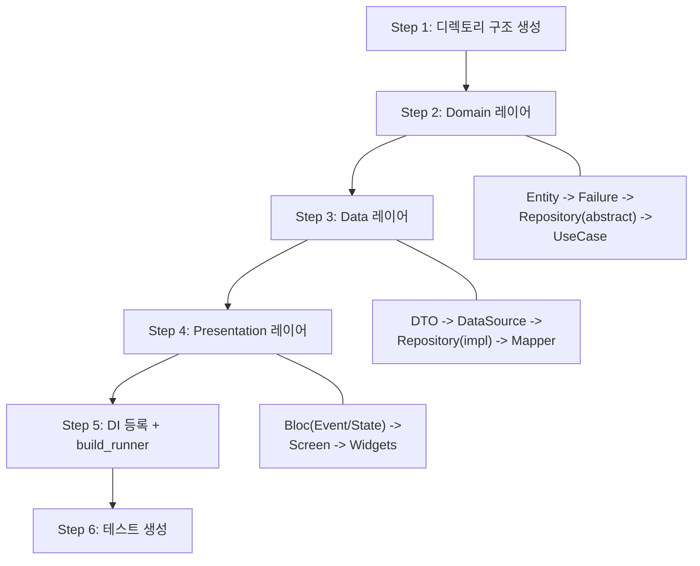
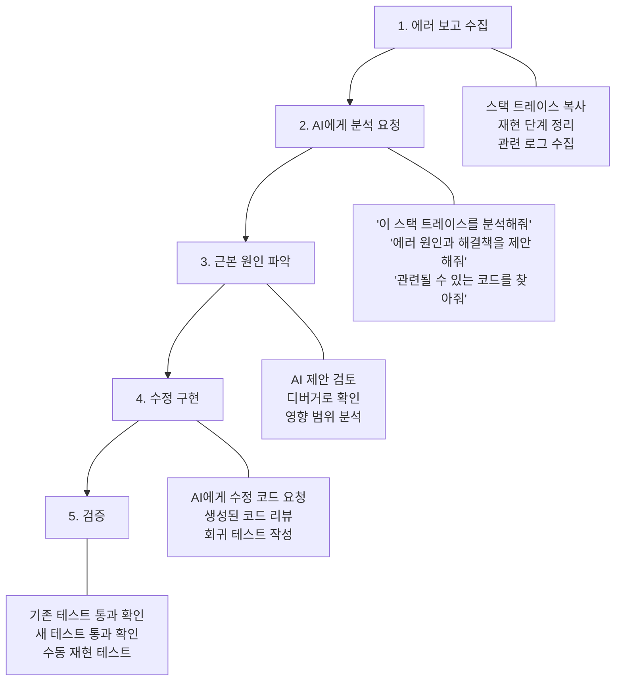

# AI 코딩 어시스턴트 활용 가이드

> **마지막 업데이트**: 2026-02-08 | **Flutter 3.38** | **Dart 3.10**
> **난이도**: 중급 | **카테고리**: system
> **선행 학습**: [Architecture](../core/Architecture.md), [TeamCollaboration](./TeamCollaboration.md) | **예상 학습 시간**: 2.5h

> Flutter 프로젝트에서 AI 코딩 어시스턴트를 효과적으로 활용하여 생산성을 극대화하면서도 코드 품질을 유지하는 전략을 학습합니다.

> **학습 목표**: 이 문서를 학습하면 다음을 할 수 있습니다:
> - AI 코딩 어시스턴트의 종류와 특성을 이해하고 Flutter 개발에 적합한 도구를 선택할 수 있습니다
> - 프로젝트 컨텍스트 파일(AGENTS.md, CLAUDE.md 등)을 작성하여 AI의 코드 품질을 높일 수 있습니다
> - Flutter 특화 프롬프트 패턴으로 보일러플레이트, 테스트, 리팩토링 작업을 가속화할 수 있습니다
> - AI 생성 코드의 위험을 관리하고 팀 협업에서 AI를 효과적으로 활용할 수 있습니다

---

## 목차

1. [AI 코딩 어시스턴트 개요](#1-ai-코딩-어시스턴트-개요)
2. [프로젝트 컨텍스트 제공 전략](#2-프로젝트-컨텍스트-제공-전략)
3. [AI 활용 패턴별 가이드](#3-ai-활용-패턴별-가이드)
4. [프롬프트 엔지니어링 for Flutter](#4-프롬프트-엔지니어링-for-flutter)
5. [Clean Architecture 프로젝트에서 AI 활용](#5-clean-architecture-프로젝트에서-ai-활용)
6. [위험 관리 및 코드 품질](#6-위험-관리-및-코드-품질)
7. [팀 협업에서의 AI 활용](#7-팀-협업에서의-ai-활용)
8. [실전 워크플로우](#8-실전-워크플로우)

---

## 1. AI 코딩 어시스턴트 개요

### 1.1 주요 AI 코딩 도구 비교

| 도구 | 유형 | Flutter 지원 | 주요 특징 |
|------|------|-------------|----------|
| **GitHub Copilot** | IDE 플러그인 | 우수 | 인라인 자동완성, Chat, PR 리뷰 |
| **Claude Code** | CLI 에이전트 | 우수 | 터미널 기반, 멀티파일 편집, 에이전트 워크플로우 |
| **Cursor** | AI IDE | 우수 | VSCode 포크, Composer, 멀티파일 컨텍스트 |
| **Windsurf** | AI IDE | 우수 | Cascade 플로우, 자동 컨텍스트 수집 |
| **Gemini Code Assist** | IDE 플러그인 | 우수 | 100만 토큰 컨텍스트, Google 생태계 통합 |

### 1.2 도구 유형별 특성

```
+-----------------------------------------------------------+
|                   AI 코딩 도구 스펙트럼                      |
+---------------+--------------------+------------------------+
|  자동완성형    |    대화형(Chat)     |     에이전트형           |
|  Copilot      |    Cursor Chat     |    Claude Code         |
|  Supermaven   |    Gemini Assist   |    Cursor Composer     |
|               |                    |    Windsurf Cascade    |
+---------------+--------------------+------------------------+
| 개입도: 낮음   |   개입도: 중간       |   개입도: 높음           |
| 컨텍스트: 작음 |   컨텍스트: 중간      |   컨텍스트: 큼           |
| 속도: 빠름    |   속도: 중간         |   속도: 느림            |
+---------------+--------------------+------------------------+
```

#### IDE 지원 현황

| IDE | Copilot | Claude Code | Cursor | Windsurf |
|-----|---------|-------------|--------|----------|
| **VS Code** | 플러그인 | 터미널 + 확장 | - (별도 에디터) | - (별도 에디터) |
| **Android Studio** | 플러그인 | 터미널 | - | - |
| **IntelliJ IDEA** | 플러그인 | 터미널 | - | - |

#### Flutter 특화 기능 비교

| 기능 | Copilot | Claude Code | Cursor | Windsurf |
|------|---------|-------------|--------|----------|
| **Dart 문법 이해** | 우수 | 우수 | 우수 | 양호 |
| **Bloc 패턴 이해** | 양호 | 우수 | 양호 | 양호 |
| **Freezed 코드 생성** | 양호 | 우수 | 양호 | 양호 |
| **Clean Architecture** | 보통 | 우수 | 양호 | 보통 |
| **build_runner 실행** | 불가 | 직접 실행 | 불가 | 불가 |
| **dart analyze 실행** | 불가 | 직접 실행 | 제한적 | 제한적 |
| **컨텍스트 파일** | copilot-instructions.md | CLAUDE.md / AGENTS.md | .cursorrules | .windsurfrules |

### 1.3 Flutter 개발에서의 AI 활용 현황

Flutter 개발에서 AI가 특히 효과적인 영역:

```dart
// 1. 보일러플레이트 생성 -- AI가 가장 큰 가치를 제공하는 영역
//    Freezed 모델, Bloc, Repository, UseCase 등 반복적 코드 패턴

// 2. 위젯 트리 구성 -- 복잡한 UI 레이아웃 빠르게 프로토타이핑
//    Row, Column, Stack 조합과 반응형 레이아웃

// 3. 테스트 코드 -- 기존 코드를 분석하여 테스트 자동 생성
//    Unit Test, Widget Test, bloc_test

// 4. 에러 해결 -- 스택 트레이스 분석과 해결책 제안
//    RenderFlex overflow, State 관리 에러 등
```

### 1.4 생산성 향상 vs 코드 품질 균형

| 관점 | AI 장점 | AI 위험 |
|------|---------|---------|
| **속도** | 보일러플레이트 90% 시간 절약 | 잘못된 코드를 빠르게 생산할 수 있음 |
| **일관성** | 동일 패턴 반복 적용 | 컨텍스트 부족 시 다른 패턴 혼용 |
| **학습** | 새 API/패턴 빠르게 탐색 | AI 의존도 높아지면 학습 기회 감소 |
| **품질** | 정적 분석 + 리뷰 보조 | 미묘한 버그, 보안 취약점 놓칠 수 있음 |

**핵심 원칙**: AI는 **도구**이지 **대체재**가 아닙니다. 개발자가 생성된 코드를 이해하고 검증할 수 있어야 합니다.

#### 도구 선택 가이드

```
프로젝트 상황에 따른 추천:

개인 프로젝트 / 학습 목적     -> Cursor 무료 티어 또는 Copilot 무료 티어
팀 프로젝트 / 일반 개발       -> GitHub Copilot (팀 라이선스)
대규모 리팩토링 / 멀티 파일   -> Claude Code 또는 Cursor Composer
CI/CD 자동화 연동             -> Claude Code (터미널 기반)
보안 요구사항 높은 프로젝트   -> 로컬 모델 (Ollama + CodeLlama)
```

---

## 2. 프로젝트 컨텍스트 제공 전략

AI 코딩 어시스턴트의 코드 품질은 제공되는 컨텍스트에 비례합니다. 프로젝트 규칙과 패턴을 명시적으로 전달해야 일관된 코드를 생성합니다.

### 2.1 컨텍스트 파일 체계

```
project-root/
├── CLAUDE.md                          # Claude Code 전용 지침
├── AGENTS.md                          # 에이전트 가이드 (Claude Code)
├── .cursorrules                       # Cursor 전용 규칙
├── .windsurfrules                     # Windsurf 전용 규칙
├── .github/
│   └── copilot-instructions.md        # GitHub Copilot 전용 지침
└── docs/
    └── architecture.md                # 공통 아키텍처 문서 (모든 도구 참조)
```

### 2.2 CLAUDE.md 작성 가이드

Claude Code는 `CLAUDE.md` 파일을 자동으로 읽어 프로젝트 컨텍스트로 활용합니다.

```markdown
# 프로젝트: MyApp

## 아키텍처
- Clean Architecture + Feature-based Modularization
- 상태 관리: flutter_bloc (Bloc/Cubit)
- DI: get_it + injectable
- 모노레포: Melos

## 절대 규칙 (MUST)
- 1 클래스 1 파일 (위젯 제외)
- Bloc은 BlocProvider에서 직접 생성 (GetIt 등록 금지)
- UseCase는 반드시 call() 메서드 하나만 가짐
- Domain 레이어는 외부 패키지 의존 금지 (fpdart 예외)

## 금지 사항 (NEVER)
- print() 사용 금지 -> logger 사용
- setState() 사용 금지 -> Bloc/Cubit 사용
- Presentation에서 Data 레이어 직접 참조 금지

## 코드 컨벤션
- 파일명: snake_case
- 클래스명: UpperCamelCase
- Freezed 사용: 모든 모델, 상태, 이벤트
- fpdart Either로 에러 핸들링

## 테스트
- mocktail로 Mock 생성
- bloc_test로 Bloc 테스트
- 네이밍: should_[결과]_when_[조건]

## 빌드
- dart run build_runner build --delete-conflicting-outputs
- melos bootstrap

## 의존성 버전 (2026년 2월 기준)
flutter_bloc: ^9.1.1
freezed: ^3.2.5
freezed_annotation: ^3.1.0
fpdart: ^1.2.0
get_it: ^9.2.0
injectable: ^2.7.1
dio: ^5.9.1
go_router: ^17.1.0
```

### 2.3 AGENTS.md 계층 구조

Claude Code는 디렉토리별 `AGENTS.md`를 지원하여 레이어별로 다른 규칙을 적용할 수 있습니다.

```
features/auth/
├── AGENTS.md                    # Feature 레벨 규칙
├── lib/
│   ├── domain/
│   │   └── AGENTS.md            # Domain 레이어 규칙
│   ├── data/
│   │   └── AGENTS.md            # Data 레이어 규칙
│   └── presentation/
│       └── AGENTS.md            # Presentation 레이어 규칙
└── test/
    └── AGENTS.md                # 테스트 규칙
```

#### Domain 레이어 AGENTS.md 예시

```markdown
<!-- features/auth/lib/domain/AGENTS.md -->
# Domain Layer Rules

## 의존성 규칙
- 이 레이어는 외부 패키지를 직접 import하지 않습니다
- fpdart만 예외적으로 허용됩니다
- data 또는 presentation 레이어를 import하면 안 됩니다

## Entity 규칙
- @freezed로 정의합니다
- factory 생성자만 사용합니다
- 비즈니스 검증 로직은 Entity 메서드로 포함할 수 있습니다

## UseCase 규칙
- 파일 하나에 UseCase 하나
- call() 메서드만 public
- 반환 타입: Future<Either<Failure, T>> 또는 Stream<Either<Failure, T>>
```

### 2.4 코드베이스 구조 문서화 (.cursorrules)

Cursor는 프로젝트 루트의 `.cursorrules` 파일을 자동으로 참조합니다.

```markdown
# .cursorrules

You are an expert Flutter developer working on a Clean Architecture project.

## Architecture
- Follow Clean Architecture: Domain -> Data -> Presentation
- Use flutter_bloc for state management
- Use freezed for immutable models and union types
- Use fpdart Either for error handling

## Code Generation
When creating a new feature, follow this order:
1. Domain: Entity -> Failure -> Repository (abstract) -> UseCase
2. Data: DTO -> DataSource -> Repository (impl) -> Mapper
3. Presentation: Bloc (Event/State) -> Screen -> Widgets

## Style
- File names: snake_case
- One class per file (except widgets)
- All models use @freezed
- All Bloc states use @freezed union types
- Prefer const constructors
- No print() - use logger

## Testing
- Use mocktail for mocks (NOT mockito)
- Use bloc_test for Bloc testing
- Test naming: should_[result]_when_[condition]
```

### 2.5 GitHub Copilot Instructions

```markdown
<!-- .github/copilot-instructions.md -->
# Copilot Instructions for Flutter Project

## Architecture Pattern
This project uses Clean Architecture with Bloc pattern.
- Domain layer: Entities, UseCases, Repository interfaces
- Data layer: DTOs, DataSources, Repository implementations
- Presentation layer: Blocs, Screens, Widgets

## Key Conventions
- Use @freezed for all models, events, and states
- Use fpdart Either for error handling in repositories and use cases
- Bloc must NOT be registered in GetIt (use BlocProvider instead)
- One class per file rule (widgets are an exception)
- No print() - use logger package

## Preferred Packages
- flutter_bloc ^9.1.1
- freezed_annotation ^3.1.0
- fpdart ^1.2.0
- get_it ^9.2.0
- injectable ^2.7.1
- go_router ^17.1.0
- dio ^5.9.1
```

### 2.6 컨벤션 가이드 자동 적용

컨텍스트 파일을 통해 AI가 자동으로 적용하는 규칙을 정의할 수 있습니다. 코드 컨벤션의 상세 내용은 [TeamCollaboration](./TeamCollaboration.md) 문서를 참조하세요.

```markdown
# 컨텍스트 파일에 명시해야 할 컨벤션 핵심 항목

## 1. 파일 네이밍 규칙
- Entity: {name}.dart
- DTO: {name}_dto.dart
- Mapper: {name}_mapper.dart (Extension 방식)
- Repository 인터페이스: {name}_repository.dart
- Repository 구현체: {name}_repository_impl.dart
- Bloc: {name}_bloc.dart
- Screen: {name}_screen.dart
- Widget: {name}_{widget_type}.dart

## 2. import 순서
1. dart:core 라이브러리
2. Flutter 패키지
3. 외부 패키지
4. 프로젝트 내부 패키지

## 3. 클래스 구조 순서
1. static 상수
2. final 필드
3. 생성자
4. factory 생성자
5. public 메서드
6. private 메서드
```

---

## 3. AI 활용 패턴별 가이드

### 3.1 보일러플레이트 생성

AI가 가장 큰 가치를 제공하는 영역입니다. 반복적인 코드 패턴을 빠르게 생성할 수 있습니다.

#### Freezed 모델 생성

```dart
// 프롬프트: "User 엔티티를 freezed로 만들어줘. id, name, email, createdAt 필드"

// AI 생성 결과:
import 'package:freezed_annotation/freezed_annotation.dart';

part 'user.freezed.dart';
part 'user.g.dart';

@freezed
class User with _$User {
  const factory User({
    required String id,
    required String name,
    required String email,
    required DateTime createdAt,
  }) = _User;

  factory User.fromJson(Map<String, dynamic> json) => _$UserFromJson(json);
}
```

Freezed의 상세 사용법은 [Freezed](../core/Freezed.md) 문서를 참조하세요.

#### Bloc 생성

```dart
// 프롬프트: "UserList를 관리하는 Bloc을 만들어줘.
// 이벤트: Started, Refreshed, UserDeleted(id)
// 상태: initial, loading, loaded(users), error(message)"

// AI 생성 결과 -- Event:
@freezed
class UserListEvent with _$UserListEvent {
  const factory UserListEvent.started() = _Started;
  const factory UserListEvent.refreshed() = _Refreshed;
  const factory UserListEvent.userDeleted({required String id}) = _UserDeleted;
}

// AI 생성 결과 -- State:
@freezed
class UserListState with _$UserListState {
  const factory UserListState.initial() = _Initial;
  const factory UserListState.loading() = _Loading;
  const factory UserListState.loaded({
    required List<User> users,
  }) = _Loaded;
  const factory UserListState.error({
    required String message,
  }) = _Error;
}

// AI 생성 결과 -- Bloc:
class UserListBloc extends Bloc<UserListEvent, UserListState> {
  final GetUsersUseCase _getUsersUseCase;
  final DeleteUserUseCase _deleteUserUseCase;

  UserListBloc({
    required GetUsersUseCase getUsersUseCase,
    required DeleteUserUseCase deleteUserUseCase,
  })  : _getUsersUseCase = getUsersUseCase,
        _deleteUserUseCase = deleteUserUseCase,
        super(const UserListState.initial()) {
    on<_Started>(_onStarted);
    on<_Refreshed>(_onRefreshed);
    on<_UserDeleted>(_onUserDeleted);
  }

  Future<void> _onStarted(
    _Started event,
    Emitter<UserListState> emit,
  ) async {
    emit(const UserListState.loading());
    final result = await _getUsersUseCase.call();
    result.fold(
      (failure) => emit(UserListState.error(message: failure.message)),
      (users) => emit(UserListState.loaded(users: users)),
    );
  }

  // ... 나머지 핸들러
}
```

Bloc 패턴의 상세 내용은 [Bloc](../core/Bloc.md) 문서를 참조하세요.

#### Repository + UseCase 생성

```dart
// 프롬프트: "User 도메인의 Repository 인터페이스와 GetUsers UseCase를 만들어줘"

// Repository (Domain):
abstract class UserRepository {
  Future<Either<Failure, List<User>>> getUsers();
  Future<Either<Failure, User>> getUserById(String id);
  Future<Either<Failure, Unit>> deleteUser(String id);
}

// UseCase:
@injectable
class GetUsersUseCase {
  final UserRepository _repository;

  const GetUsersUseCase(this._repository);

  Future<Either<Failure, List<User>>> call() {
    return _repository.getUsers();
  }
}
```

### 3.2 테스트 코드 자동 생성

AI에게 기존 코드를 보여주고 테스트를 생성하도록 요청합니다. 테스트 작성의 상세 패턴은 [Testing](./Testing.md) 문서를 참조하세요.

#### Bloc 테스트 생성 프롬프트

```dart
// 프롬프트: "이 UserListBloc에 대한 bloc_test를 작성해줘.
// mocktail 사용, 성공/실패 케이스 모두 포함"

// AI 생성 결과:
import 'package:bloc_test/bloc_test.dart';
import 'package:flutter_test/flutter_test.dart';
import 'package:fpdart/fpdart.dart';
import 'package:mocktail/mocktail.dart';

class MockGetUsersUseCase extends Mock implements GetUsersUseCase {}
class MockDeleteUserUseCase extends Mock implements DeleteUserUseCase {}

void main() {
  late UserListBloc bloc;
  late MockGetUsersUseCase mockGetUsersUseCase;
  late MockDeleteUserUseCase mockDeleteUserUseCase;

  final tUsers = [
    const User(id: '1', name: 'Alice', email: 'alice@test.com',
        createdAt: DateTime(2026)),
    const User(id: '2', name: 'Bob', email: 'bob@test.com',
        createdAt: DateTime(2026)),
  ];

  setUp(() {
    mockGetUsersUseCase = MockGetUsersUseCase();
    mockDeleteUserUseCase = MockDeleteUserUseCase();
    bloc = UserListBloc(
      getUsersUseCase: mockGetUsersUseCase,
      deleteUserUseCase: mockDeleteUserUseCase,
    );
  });

  tearDown(() => bloc.close());

  group('UserListBloc', () {
    blocTest<UserListBloc, UserListState>(
      'should emit [loading, loaded] when Started succeeds',
      build: () {
        when(() => mockGetUsersUseCase.call())
            .thenAnswer((_) async => Right(tUsers));
        return bloc;
      },
      act: (bloc) => bloc.add(const UserListEvent.started()),
      expect: () => [
        const UserListState.loading(),
        UserListState.loaded(users: tUsers),
      ],
      verify: (_) {
        verify(() => mockGetUsersUseCase.call()).called(1);
      },
    );

    blocTest<UserListBloc, UserListState>(
      'should emit [loading, error] when Started fails',
      build: () {
        when(() => mockGetUsersUseCase.call())
            .thenAnswer((_) async => const Left(
                  ServerFailure(message: 'Server error'),
                ));
        return bloc;
      },
      act: (bloc) => bloc.add(const UserListEvent.started()),
      expect: () => [
        const UserListState.loading(),
        const UserListState.error(message: 'Server error'),
      ],
    );
  });
}
```

### 3.3 리팩토링 보조

#### deprecated API 교체

```dart
// 프롬프트: "이 코드에서 deprecated API를 최신 Flutter 3.38 API로 교체해줘"

// Before (deprecated):
MaterialApp(
  theme: ThemeData(
    accentColor: Colors.blue,           // deprecated
    errorColor: Colors.red,             // deprecated
    backgroundColor: Colors.white,      // deprecated
  ),
);

// After (AI 제안):
MaterialApp(
  theme: ThemeData(
    colorScheme: const ColorScheme.light(
      secondary: Colors.blue,
      error: Colors.red,
      surface: Colors.white,
    ),
  ),
);
```

#### 패턴 마이그레이션 (StatefulWidget -> Bloc)

```dart
// 프롬프트: "이 StatefulWidget을 Bloc 패턴으로 마이그레이션해줘"

// Before: StatefulWidget with setState
class CounterScreen extends StatefulWidget {
  @override
  State<CounterScreen> createState() => _CounterScreenState();
}

class _CounterScreenState extends State<CounterScreen> {
  int _count = 0;

  void _increment() => setState(() => _count++);
  void _decrement() => setState(() => _count--);

  @override
  Widget build(BuildContext context) {
    return Column(
      children: [
        Text('$_count'),
        ElevatedButton(onPressed: _increment, child: const Text('+')),
        ElevatedButton(onPressed: _decrement, child: const Text('-')),
      ],
    );
  }
}

// After: Bloc 패턴 (AI 마이그레이션 결과)
class CounterScreen extends StatelessWidget {
  const CounterScreen({super.key});

  @override
  Widget build(BuildContext context) {
    return BlocProvider(
      create: (_) => CounterBloc(),
      child: const _CounterView(),
    );
  }
}

class _CounterView extends StatelessWidget {
  const _CounterView();

  @override
  Widget build(BuildContext context) {
    return Column(
      children: [
        BlocBuilder<CounterBloc, CounterState>(
          builder: (context, state) => Text('${state.count}'),
        ),
        ElevatedButton(
          onPressed: () => context.read<CounterBloc>()
              .add(const CounterEvent.incremented()),
          child: const Text('+'),
        ),
        ElevatedButton(
          onPressed: () => context.read<CounterBloc>()
              .add(const CounterEvent.decremented()),
          child: const Text('-'),
        ),
      ],
    );
  }
}
```

### 3.4 코드 리뷰 보조

AI를 활용하여 PR 리뷰 품질을 높일 수 있습니다. 팀 협업에서의 PR 리뷰 프로세스는 [TeamCollaboration](./TeamCollaboration.md) 문서를 참조하세요.

```
# Claude Code를 활용한 코드 리뷰 예시
$ claude "이 PR의 변경사항을 리뷰해줘"

# Cursor에서 코드 선택 후 리뷰 요청
# "이 코드에서 Clean Architecture 위반 사항을 찾아줘"
# "성능 문제가 될 수 있는 부분을 지적해줘"
# "에러 핸들링이 누락된 부분을 찾아줘"
```

#### AI 리뷰 요청 프롬프트 예시

```
이 코드를 리뷰해줘. 다음 관점에서 확인해줘:

1. Clean Architecture 레이어 규칙 위반 여부
2. Bloc 상태 관리 패턴 준수 여부
3. 에러 핸들링 (Either 사용 여부)
4. 메모리 누수 가능성 (Stream 구독, Timer 등)
5. 불필요한 리빌드를 유발하는 패턴
6. 테스트 누락 여부
```

### 3.5 디버깅 지원

```dart
// 프롬프트: "이 에러 메시지를 분석하고 해결책을 제안해줘"
//
// ====== EXCEPTION CAUGHT BY WIDGETS LIBRARY ======
// The following assertion was thrown building
// BlocBuilder<UserBloc, UserState>:
// Could not find an ancestor widget of type BlocProvider<UserBloc>.

// AI 분석:
// 원인: BlocBuilder가 BlocProvider의 하위 트리에 없음
// 해결: BlocProvider를 상위 위젯에 배치하거나,
//       BlocProvider와 BlocBuilder를 분리

// 수정 전:
Widget build(BuildContext context) {
  return BlocProvider(
    create: (_) => getIt<UserBloc>(),  // Bloc을 GetIt에서 가져오면 안 됨
    child: BlocBuilder<UserBloc, UserState>(
      builder: (context, state) => /* ... */,
    ),
  );
}

// 수정 후:
Widget build(BuildContext context) {
  return BlocProvider(
    create: (_) => UserBloc(              // 직접 생성
      getUsersUseCase: getIt<GetUsersUseCase>(),
    ),
    child: BlocBuilder<UserBloc, UserState>(
      builder: (context, state) => /* ... */,
    ),
  );
}
```

---

## 4. 프롬프트 엔지니어링 for Flutter

### 4.1 효과적인 프롬프트 작성법

#### 기본 원칙

| 원칙 | 나쁜 예 | 좋은 예 |
|------|---------|---------|
| **구체적으로** | "로그인 만들어줘" | "email/password 로그인 화면을 Bloc 패턴으로 만들어줘" |
| **컨텍스트 제공** | "테스트 짜줘" | "이 UserBloc에 대한 bloc_test를 mocktail로 작성해줘" |
| **제약 명시** | "API 호출해줘" | "dio로 GET /users API를 호출하고 Either로 에러 핸들링해줘" |
| **예시 제공** | "Freezed 모델 만들어" | "이 JSON 응답을 Freezed DTO로 만들어: {예시 JSON}" |

#### 프롬프트 구조 템플릿

```
[역할] Flutter 개발자로서
[컨텍스트] Clean Architecture + Bloc 패턴 프로젝트에서
[작업] {구체적인 작업 내용}
[제약] {따라야 할 규칙/패턴}
[출력] {원하는 결과 형식}
```

### 4.2 Flutter 특화 프롬프트 템플릿

#### Widget 생성 프롬프트

```
다음 요구사항에 맞는 Flutter 위젯을 만들어줘:

위젯 이름: UserProfileCard
타입: StatelessWidget (const 생성자)
Props:
  - User user (required)
  - VoidCallback? onTap
  - bool isSelected (default: false)

UI 요구사항:
  - Card 위젯 사용
  - 왼쪽에 CircleAvatar (user.name 이니셜)
  - 오른쪽에 name, email 텍스트
  - isSelected일 때 테두리 강조
  - onTap 콜백 연결

스타일:
  - Theme.of(context) 사용 (하드코딩 금지)
  - 반응형 고려 (LayoutBuilder 또는 MediaQuery)
```

#### API 연동 프롬프트

```
다음 API에 대한 Data 레이어 코드를 생성해줘:

API: GET /api/v1/users?page={page}&limit={limit}
응답 JSON:
{
  "data": [{"id": "1", "name": "Alice", "email": "alice@test.com"}],
  "meta": {"page": 1, "totalPages": 5}
}

생성할 파일:
1. UserDto (@freezed, fromJson 포함)
2. PaginationMeta (@freezed)
3. UserRemoteDataSource (abstract + impl)
4. UserRepositoryImpl

규칙:
- dio 사용
- Either<Failure, T> 반환
- ServerException을 ServerFailure로 변환
- @Injectable(as:) 어노테이션 포함
```

#### 상태 관리 프롬프트

```
다음 화면의 Bloc을 만들어줘:

화면: 상품 목록 (페이지네이션)
기능:
  - 초기 로딩
  - 무한 스크롤 (다음 페이지 로드)
  - 새로고침 (Pull-to-refresh)
  - 검색 필터
  - 정렬 변경

상태 관리 요구사항:
  - 로딩/데이터/에러 상태
  - 추가 로드 중 상태 (hasMore, isLoadingMore)
  - 현재 필터/정렬 조건 유지
  - Freezed로 상태 정의
  - droppable transformer 적용
```

### 4.3 Few-shot 예제로 코드 스타일 일관성 유지

AI에게 기존 코드 예시를 보여주면 동일한 스타일로 생성합니다.

```
우리 프로젝트의 UseCase 패턴은 다음과 같아:

/// 예시 1: 매개변수가 있는 경우
@injectable
class GetUserByIdUseCase {
  final UserRepository _repository;

  const GetUserByIdUseCase(this._repository);

  Future<Either<Failure, User>> call(String id) {
    return _repository.getUserById(id);
  }
}

/// 예시 2: 복수 매개변수 (Params 클래스 사용)
@injectable
class UpdateProfileUseCase {
  final UserRepository _repository;

  const UpdateProfileUseCase(this._repository);

  Future<Either<Failure, User>> call(UpdateProfileParams params) {
    return _repository.updateProfile(
      userId: params.userId,
      name: params.name,
      email: params.email,
    );
  }
}

@freezed
class UpdateProfileParams with _$UpdateProfileParams {
  const factory UpdateProfileParams({
    required String userId,
    required String name,
    required String email,
  }) = _UpdateProfileParams;
}

---
이 패턴대로 DeleteUserUseCase, SearchUsersUseCase를 만들어줘.
SearchUsersUseCase는 query(String)와 page(int) 매개변수가 필요해.
```

### 4.4 컨텍스트 윈도우 최적화

AI의 컨텍스트 윈도우는 제한되어 있으므로 효율적으로 사용해야 합니다.

```
# 효율적인 컨텍스트 제공 방법:

## 도구별 파일 참조 방법
- Claude Code: 자동으로 관련 파일 탐색 (CLAUDE.md + 코드베이스 인덱싱)
- Cursor: @file 명령으로 특정 파일 참조
- Copilot Chat: #file 명령으로 참조

## 컨텍스트 제공 우선순위 (중요도 순):
1. 아키텍처 규칙 (CLAUDE.md / .cursorrules)
2. 관련 인터페이스/추상 클래스 (계약 정의)
3. 기존 구현 예시 1-2개 (패턴 학습용)
4. 작업 대상 파일

## 피해야 할 것:
- 전체 프로젝트를 컨텍스트에 넣기
- 생성된 파일 (.g.dart, .freezed.dart) 포함
- 관련 없는 Feature의 코드 포함
- 동일 패턴 예시를 5개 이상 제공 (1-2개면 충분)
```

---

## 5. Clean Architecture 프로젝트에서 AI 활용

Clean Architecture의 상세 구조와 규칙은 [Architecture](../core/Architecture.md) 문서를 참조하세요.

### 5.1 Feature 생성 자동화 워크플로우

새 Feature를 추가할 때 AI를 활용한 전체 워크플로우입니다.



### 5.2 레이어별 코드 생성 순서

**반드시 Domain -> Data -> Presentation 순서**로 생성해야 합니다. AI에게도 이 순서를 명시하세요.

#### Step 1: Domain 레이어 (의존성 없음)

```dart
// 프롬프트: "Product Feature의 Domain 레이어를 만들어줘"

// 1-1. Entity
@freezed
class Product with _$Product {
  const factory Product({
    required String id,
    required String name,
    required String description,
    required double price,
    required String imageUrl,
    required ProductCategory category,
    required DateTime createdAt,
  }) = _Product;
}

// 1-2. Failure
@freezed
class ProductFailure with _$ProductFailure {
  const factory ProductFailure.serverError({required String message}) =
      _ServerError;
  const factory ProductFailure.notFound() = _NotFound;
  const factory ProductFailure.networkError() = _NetworkError;
}

// 1-3. Repository (abstract)
abstract class ProductRepository {
  Future<Either<ProductFailure, List<Product>>> getProducts({
    required int page,
    int limit = 20,
  });
  Future<Either<ProductFailure, Product>> getProductById(String id);
}

// 1-4. UseCase
@injectable
class GetProductsUseCase {
  final ProductRepository _repository;
  const GetProductsUseCase(this._repository);

  Future<Either<ProductFailure, List<Product>>> call({
    required int page,
    int limit = 20,
  }) {
    return _repository.getProducts(page: page, limit: limit);
  }
}
```

#### Step 2: Data 레이어 (Domain에 의존)

```dart
// 프롬프트: "Product Feature의 Data 레이어를 만들어줘.
// API: GET /api/v1/products, dio 사용"

// 2-1. DTO
@freezed
class ProductDto with _$ProductDto {
  const factory ProductDto({
    required String id,
    required String name,
    required String description,
    required double price,
    @JsonKey(name: 'image_url') required String imageUrl,
    required ProductCategoryDto category,
    @JsonKey(name: 'created_at') required DateTime createdAt,
  }) = _ProductDto;

  factory ProductDto.fromJson(Map<String, dynamic> json) =>
      _$ProductDtoFromJson(json);
}

// 2-2. Mapper (Extension)
extension ProductDtoMapper on ProductDto {
  Product toEntity() => Product(
        id: id,
        name: name,
        description: description,
        price: price,
        imageUrl: imageUrl,
        category: category.toEntity(),
        createdAt: createdAt,
      );
}

// 2-3. DataSource
abstract class ProductRemoteDataSource {
  Future<List<ProductDto>> getProducts({required int page, int limit = 20});
  Future<ProductDto> getProductById(String id);
}

@Injectable(as: ProductRemoteDataSource)
class ProductRemoteDataSourceImpl implements ProductRemoteDataSource {
  final Dio _dio;
  const ProductRemoteDataSourceImpl(this._dio);

  @override
  Future<List<ProductDto>> getProducts({
    required int page,
    int limit = 20,
  }) async {
    final response = await _dio.get(
      '/api/v1/products',
      queryParameters: {'page': page, 'limit': limit},
    );
    return (response.data['data'] as List)
        .map((e) => ProductDto.fromJson(e as Map<String, dynamic>))
        .toList();
  }

  @override
  Future<ProductDto> getProductById(String id) async {
    final response = await _dio.get('/api/v1/products/$id');
    return ProductDto.fromJson(response.data as Map<String, dynamic>);
  }
}

// 2-4. Repository Implementation
@Injectable(as: ProductRepository)
class ProductRepositoryImpl implements ProductRepository {
  final ProductRemoteDataSource _remoteDataSource;
  const ProductRepositoryImpl(this._remoteDataSource);

  @override
  Future<Either<ProductFailure, List<Product>>> getProducts({
    required int page,
    int limit = 20,
  }) async {
    try {
      final dtos = await _remoteDataSource.getProducts(
        page: page,
        limit: limit,
      );
      return Right(dtos.map((dto) => dto.toEntity()).toList());
    } on DioException catch (e) {
      return Left(_mapDioException(e));
    }
  }

  ProductFailure _mapDioException(DioException e) {
    return switch (e.response?.statusCode) {
      404 => const ProductFailure.notFound(),
      _ => ProductFailure.serverError(
          message: e.message ?? 'Unknown error',
        ),
    };
  }

  // ...
}
```

#### Step 3: Presentation 레이어

```dart
// 프롬프트: "Product Feature의 Bloc과 Screen을 만들어줘.
// 무한 스크롤 페이지네이션 포함"

// Bloc은 BlocProvider에서 직접 생성 (GetIt 등록 금지)
class ProductListScreen extends StatelessWidget {
  const ProductListScreen({super.key});

  @override
  Widget build(BuildContext context) {
    return BlocProvider(
      create: (_) => ProductListBloc(
        getProductsUseCase: getIt<GetProductsUseCase>(),
      )..add(const ProductListEvent.started()),
      child: const _ProductListView(),
    );
  }
}
```

### 5.3 의존성 주입 설정 자동화

```dart
// 프롬프트: "injectable로 Product Feature의 DI 설정을 만들어줘"

// injectable 모듈 (외부 의존성 등록)
@module
abstract class ProductModule {
  // 외부 패키지 인스턴스 등록이 필요한 경우에만 사용
  // Dio는 보통 앱 레벨에서 등록
}

// injection.dart (앱 레벨)
@InjectableInit()
void configureDependencies() => getIt.init();

// injectable이 자동으로 처리하는 것:
// - @Injectable 또는 @Singleton 어노테이션이 있는 클래스
// - @Injectable(as: Interface) 로 인터페이스 바인딩
// - 생성자 주입 자동 해석

// AI에게 주의시킬 것:
// - Bloc은 @injectable로 등록하지 않는다
// - Bloc은 BlocProvider에서 직접 생성한다
```

### 5.4 build_runner 연동

```bash
# Freezed, injectable, json_serializable 등의 코드 생성

# 전체 빌드
dart run build_runner build --delete-conflicting-outputs

# 감시 모드 (개발 중 자동 빌드)
dart run build_runner watch --delete-conflicting-outputs

# Melos 모노레포에서
melos run build_runner

# AI에게 알려줄 것:
# "코드 생성 후 build_runner를 실행해야 .freezed.dart, .g.dart 파일이 생성된다"
# ".freezed.dart, .g.dart 파일은 직접 수정하지 않는다"
# "part 선언을 빠뜨리면 build_runner가 실패한다"
```

---

## 6. 위험 관리 및 코드 품질

### 6.1 AI 생성 코드 리뷰 체크리스트

AI가 생성한 코드는 반드시 다음 항목을 검증해야 합니다.

| 카테고리 | 체크 항목 | 위험도 |
|---------|----------|--------|
| **아키텍처** | 레이어 의존성 방향 위반 없는지 | 높음 |
| **아키텍처** | Bloc이 GetIt에 등록되지 않았는지 | 높음 |
| **타입 안전성** | dynamic 타입 사용 최소화 | 중간 |
| **에러 핸들링** | Either 패턴 일관 적용 | 높음 |
| **메모리** | Stream 구독 해제, Timer 취소 | 높음 |
| **성능** | 불필요한 리빌드 패턴 없는지 | 중간 |
| **보안** | 하드코딩된 키/URL 없는지 | 높음 |
| **테스트** | 생성된 코드에 대한 테스트 포함 | 중간 |
| **패키지** | deprecated API 사용 여부 | 중간 |
| **네이밍** | 파일/클래스명 컨벤션 준수 | 낮음 |

#### AI가 자주 하는 실수

```dart
// 실수 1: 레이어 의존성 위반
// Domain 레이어에서 Data 레이어 import
import 'package:my_app/features/user/data/dto/user_dto.dart'; // 위반!

// 실수 2: dynamic 남용
final data = json['users'];  // dynamic
for (var user in data) {     // dynamic iteration
  print(user['name']);        // 런타임 에러 가능
}

// 올바른 타입 처리:
final data = json['users'] as List<dynamic>;
final users = data
    .map((e) => UserDto.fromJson(e as Map<String, dynamic>))
    .toList();

// 실수 3: dispose 누락
class _MyScreenState extends State<MyScreen> {
  late final StreamSubscription _subscription;

  @override
  void initState() {
    super.initState();
    _subscription = someStream.listen((_) {});
  }
  // dispose 누락 -> 메모리 누수 발생
}

// 올바른 처리:
@override
void dispose() {
  _subscription.cancel();
  super.dispose();
}

// 실수 4: 과거 버전 API 사용
// flutter_bloc 7.x의 mapEventToState (이미 제거됨)
@override
Stream<ProductState> mapEventToState(ProductEvent event) async* {
  // ...
}
// 현재 올바른 방식: on<Event> 핸들러
```

### 6.2 보안 취약점 검사

```dart
// AI 생성 코드에서 반드시 확인해야 할 보안 항목:

// 1. 하드코딩된 API 키
const apiKey = 'sk-1234567890abcdef';  // 절대 금지!
// -> 환경 변수 사용:
const apiKey = String.fromEnvironment('API_KEY');

// 2. 안전하지 않은 HTTP 통신
final dio = Dio(BaseOptions(baseUrl: 'http://api.example.com'));  // HTTP!
// -> HTTPS 사용:
final dio = Dio(BaseOptions(baseUrl: 'https://api.example.com'));

// 3. 민감한 데이터 로깅
log('User token: ${user.accessToken}');  // 토큰 노출!
log('Password: ${credentials.password}');  // 비밀번호 노출!
// -> 민감 정보 마스킹:
log('User authenticated: ${user.id}');

// 4. SQL Injection (sqflite 사용 시)
final result = await db.rawQuery(
  "SELECT * FROM users WHERE name = '$userInput'"  // 위험!
);
// -> 파라미터 바인딩:
final result = await db.query(
  'users',
  where: 'name = ?',
  whereArgs: [userInput],
);

// 5. 인증서 검증 비활성화
// AI가 디버깅 목적으로 생성할 수 있음
HttpOverrides.global = MyHttpOverrides();  // 프로덕션 금지!
```

### 6.3 라이선스 이슈

```
AI 생성 코드의 라이선스 고려사항:

1. 저작권 소유: AI가 생성한 코드의 저작권은 법적으로 불확실한 영역
2. 학습 데이터: AI가 GPL 등 카피레프트 코드를 학습했을 가능성 존재
3. 코드 유사성: 오픈소스 프로젝트와 유사한 코드를 생성할 수 있음

권장 사항:
- 회사 법무팀과 AI 코드 생성 정책 확인
- 코드 유사성 검사 도구 활용 (GitHub Copilot의 public code filter 등)
- 핵심 비즈니스 로직은 직접 작성 권장
- AI 생성 코드도 기존 프로젝트 라이선스를 따름

엔터프라이즈 AI 도구 데이터 정책:
- Copilot Enterprise: 코드 학습에 미사용, SOC 2 인증
- Claude Code Team/Enterprise: 학습 미사용, 데이터 격리
- Cursor Business: Privacy Mode 제공
```

### 6.4 테스트로 AI 코드 검증

테스트 작성의 상세 패턴은 [Testing](./Testing.md) 문서를 참조하세요.

```dart
// AI가 생성한 코드를 검증하는 최소 테스트 전략:

// 1. UseCase: 입출력 검증
test('should return users when repository succeeds', () async {
  when(() => mockRepository.getUsers())
      .thenAnswer((_) async => Right(tUsers));

  final result = await useCase.call();

  expect(result, Right(tUsers));
  verify(() => mockRepository.getUsers()).called(1);
});

// 2. Bloc: 상태 전이 검증
blocTest<UserListBloc, UserListState>(
  'should transition through correct states',
  build: () { /* ... */ },
  act: (bloc) => bloc.add(const UserListEvent.started()),
  expect: () => [
    const UserListState.loading(),
    UserListState.loaded(users: tUsers),
  ],
);

// 3. Repository: 에러 매핑 검증
test('should return ServerFailure when DioException occurs', () async {
  when(() => mockDataSource.getUsers())
      .thenThrow(DioException(
        requestOptions: RequestOptions(),
        response: Response(
          requestOptions: RequestOptions(),
          statusCode: 500,
        ),
      ));

  final result = await repository.getUsers();

  expect(result.isLeft(), true);
});

// 4. Widget: 상태별 UI 렌더링 검증
testWidgets('should show loading indicator when state is loading',
    (tester) async {
  whenListen(
    mockBloc,
    Stream.fromIterable([const UserListState.loading()]),
    initialState: const UserListState.initial(),
  );

  await tester.pumpWidget(/* ... */);

  expect(find.byType(CircularProgressIndicator), findsOneWidget);
});
```

### 6.5 정적 분석으로 AI 코드 검증

```bash
# AI 생성 코드 적용 후 반드시 실행:

# 1. 정적 분석
dart analyze --fatal-infos

# 2. 코드 생성 (Freezed, Injectable 등)
dart run build_runner build --delete-conflicting-outputs

# 3. 테스트 실행
flutter test

# 4. 아키텍처 규칙 자동 검증 (CI에서)
# Domain 레이어에서 Data/Presentation import 확인
grep -r "import.*data/" lib/features/*/domain/ && echo "Architecture violation!" || echo "OK"
```

---

## 7. 팀 협업에서의 AI 활용

팀 협업의 기본 프로세스(코드 컨벤션, PR 리뷰, Git 전략 등)는 [TeamCollaboration](./TeamCollaboration.md) 문서를 참조하세요.

### 7.1 AI 코딩 가이드라인 수립

팀에서 AI 도구를 사용할 때 합의해야 할 가이드라인입니다.

```markdown
# 팀 AI 코딩 가이드라인 (예시)

## 허용 범위
- 보일러플레이트 코드 생성 (Freezed, Bloc, Repository)
- 테스트 코드 초안 생성
- deprecated API 마이그레이션
- 문서/주석 생성
- 에러 메시지 분석 및 해결책 탐색
- 코드 리뷰 보조 (1차 검토)

## 주의 사항
- 핵심 비즈니스 로직은 AI 생성 후 반드시 직접 검증
- 보안 관련 코드 (인증, 암호화)는 AI 생성 금지 또는 보안 리뷰 필수
- AI 생성 코드도 동일한 코드 리뷰 기준 적용

## 금지 사항
- AI 생성 코드를 이해하지 않고 머지
- 고객 데이터/민감 정보를 프롬프트에 포함
- AI를 유일한 코드 리뷰어로 사용
- 컨텍스트 파일 없이 AI에게 아키텍처 결정 위임
```

### 7.2 PR 리뷰에서 AI 보조 활용

```yaml
# .github/workflows/ai-review.yml (예시)
name: AI Code Review
on:
  pull_request:
    types: [opened, synchronize]

jobs:
  static-analysis:
    runs-on: ubuntu-latest
    steps:
      - uses: actions/checkout@v4

      # 1단계: 정적 분석
      - name: Run dart analyze
        run: dart analyze --fatal-infos

      # 2단계: 아키텍처 규칙 검증
      - name: Check layer dependencies
        run: |
          # Domain 레이어에서 Data/Presentation import 확인
          if grep -r "import.*data/" lib/features/*/domain/; then
            echo "Architecture violation: Domain imports Data"
            exit 1
          fi

      # 3단계: 테스트 실행
      - name: Run tests
        run: flutter test
```

#### AI 리뷰 + 사람 리뷰 병행 전략

```
PR 리뷰 프로세스:

1. AI 1차 리뷰 (자동)
   - 코드 스타일 / 린트 규칙 위반
   - 아키텍처 패턴 위반
   - 잠재적 버그 패턴
   - 테스트 커버리지

2. 개발자 자체 검토
   - AI 리뷰 지적 사항 확인
   - AI가 놓칠 수 있는 비즈니스 로직 정확성 검증

3. 팀원 코드 리뷰 (필수)
   - 아키텍처 결정의 적절성
   - 도메인 지식 기반 로직 검토
   - 성능/보안 관점
   - 유지보수성 평가
```

### 7.3 코드 일관성 유지 전략

```
팀에서 AI 도구를 사용할 때 코드 일관성을 유지하는 전략:

1. 공유 컨텍스트 파일
   - CLAUDE.md, .cursorrules 등을 Git으로 버전 관리
   - 팀원 모두 동일한 규칙 파일 사용
   - 아키텍처 변경 시 컨텍스트 파일도 함께 업데이트

2. 코드 생성 템플릿
   - 자주 사용하는 프롬프트를 팀 위키에 문서화
   - Snippet/Template 파일로 공유
   - mason_cli 등 코드 생성 도구와 병행

3. 린트 규칙 강화
   - analysis_options.yaml에 프로젝트 규칙 명시
   - custom_lint로 아키텍처 규칙 자동 검증
   - CI/CD에서 린트 검사 필수화

4. 정기 리뷰
   - AI 생성 코드 패턴 정기 점검 (월 1회)
   - 컨텍스트 파일 업데이트 회의
   - 새로운 AI 도구/기능 팀 공유
```

### 7.4 온보딩 가속화

AI를 활용하여 새 팀원의 온보딩을 가속화하는 방법:

```markdown
# 온보딩에서 AI 활용

## 1. 코드베이스 이해
- AI에게 특정 Feature의 코드 흐름 설명 요청
  "auth Feature의 로그인 플로우를 Domain -> Data -> Presentation 순서로 설명해줘"

## 2. 첫 Feature 개발
- 기존 Feature를 참고 코드로 제공하고 새 Feature 생성
  "products Feature를 참고하여 orders Feature의 기본 코드를 만들어줘"

## 3. 코드 컨벤션 습득
- AI가 프로젝트 규칙에 맞는 코드를 생성하므로 자연스럽게 컨벤션 학습
- CLAUDE.md / .cursorrules에 명시된 규칙을 AI가 적용하는 것을 관찰

## 4. 아키텍처 Q&A
- AI에게 아키텍처 결정의 이유를 질문
  "왜 Bloc을 GetIt에 등록하지 않는지 설명해줘"
  "Either 패턴을 사용하는 이유와 장점을 설명해줘"

## 5. 디버깅 학습
- 에러 발생 시 AI에게 분석을 요청하고, 그 과정을 학습
- AI의 분석 과정 자체가 디버깅 방법론 학습 자료가 됨
```

---

## 8. 실전 워크플로우

### 8.1 새 Feature 생성 자동화 예시 (전체 흐름)

주문(Order) Feature를 AI와 함께 처음부터 끝까지 생성하는 워크플로우입니다.

#### Phase 1: 요구사항 정의

```
프롬프트:
"Order Feature를 만들려고 해. 다음 요구사항이 있어:
- 주문 목록 조회 (페이지네이션)
- 주문 상세 조회
- 주문 취소

우리 프로젝트는 Clean Architecture + Bloc 패턴을 사용해.
CLAUDE.md의 규칙을 따라서 Domain -> Data -> Presentation 순서로 만들어줘."
```

#### Phase 2: Domain 레이어 생성

```dart
// AI 명령: "Order Feature의 Domain 레이어를 만들어줘"

// 생성되는 파일 목록:
// lib/features/order/domain/
//   entities/order.dart
//   entities/order_item.dart
//   entities/order_status.dart
//   failures/order_failure.dart
//   repositories/order_repository.dart
//   usecases/get_orders_usecase.dart
//   usecases/get_order_detail_usecase.dart
//   usecases/cancel_order_usecase.dart

// order.dart
@freezed
class Order with _$Order {
  const factory Order({
    required String id,
    required List<OrderItem> items,
    required OrderStatus status,
    required double totalPrice,
    required DateTime orderedAt,
    String? cancelledReason,
  }) = _Order;
}

// order_status.dart
enum OrderStatus {
  pending,
  confirmed,
  shipped,
  delivered,
  cancelled,
}

// order_failure.dart
@freezed
class OrderFailure with _$OrderFailure {
  const factory OrderFailure.serverError({required String message}) =
      _ServerError;
  const factory OrderFailure.notFound() = _NotFound;
  const factory OrderFailure.cancelNotAllowed() = _CancelNotAllowed;
  const factory OrderFailure.networkError() = _NetworkError;
}
```

#### Phase 3: Data 레이어 생성

```dart
// AI 명령: "Order Feature의 Data 레이어를 만들어줘.
// API: GET /orders, GET /orders/:id, POST /orders/:id/cancel"

// 생성되는 파일 목록:
// lib/features/order/data/
//   dto/order_dto.dart
//   dto/order_item_dto.dart
//   datasources/order_remote_datasource.dart
//   repositories/order_repository_impl.dart
//   mappers/order_mapper.dart
```

#### Phase 4: Presentation 레이어 생성

```dart
// AI 명령: "Order Feature의 Bloc과 화면을 만들어줘.
// 주문 목록 화면 (무한 스크롤), 주문 상세 화면, 주문 취소 다이얼로그"

// 생성되는 파일 목록:
// lib/features/order/presentation/
//   bloc/order_list/order_list_bloc.dart
//   bloc/order_list/order_list_event.dart
//   bloc/order_list/order_list_state.dart
//   bloc/order_detail/order_detail_bloc.dart
//   screens/order_list_screen.dart
//   screens/order_detail_screen.dart
//   widgets/order_card.dart
//   widgets/order_status_badge.dart
//   widgets/cancel_order_dialog.dart
```

#### Phase 5: DI 등록 및 빌드

```bash
# 1. DI 등록 확인 (@Injectable, @Singleton 어노테이션)
# 2. 코드 생성
dart run build_runner build --delete-conflicting-outputs
# 3. 라우팅 등록 (go_router에 Order 관련 라우트 추가)
# 4. 정적 분석
dart analyze
```

#### Phase 6: 테스트 생성

```dart
// AI 명령: "Order Feature의 테스트를 만들어줘.
// UseCase, Repository, Bloc 모두 포함"

// 생성되는 테스트 파일:
// test/features/order/
//   domain/usecases/get_orders_usecase_test.dart
//   domain/usecases/cancel_order_usecase_test.dart
//   data/repositories/order_repository_impl_test.dart
//   presentation/bloc/order_list_bloc_test.dart
//   presentation/bloc/order_detail_bloc_test.dart
```

### 8.2 버그 수정 워크플로우 with AI



#### 실전 예시: RenderFlex Overflow 버그

```dart
// 에러 메시지:
// A RenderFlex overflowed by 42 pixels on the right.

// AI에게 전달:
// "이 화면에서 RenderFlex overflow가 발생해. 코드를 보고 원인을 찾아줘"
// + 해당 Widget 코드 첨부

// AI 분석: Row 내부의 Text 위젯이 긴 텍스트로 인해 오버플로우

// Before:
Row(
  children: [
    const Icon(Icons.person),
    Text(user.name),          // 긴 이름일 때 오버플로우
    Text(user.email),         // 긴 이메일일 때 오버플로우
  ],
)

// After (AI 수정):
Row(
  children: [
    const Icon(Icons.person),
    Expanded(
      child: Column(
        crossAxisAlignment: CrossAxisAlignment.start,
        children: [
          Text(
            user.name,
            overflow: TextOverflow.ellipsis,
            maxLines: 1,
          ),
          Text(
            user.email,
            overflow: TextOverflow.ellipsis,
            maxLines: 1,
            style: Theme.of(context).textTheme.bodySmall,
          ),
        ],
      ),
    ),
  ],
)
```

#### 실전 예시: Bloc close 후 emit 에러

```dart
// 에러: StateError: Cannot emit new states after calling close

// AI 분석: 비동기 작업 완료 후 Bloc이 이미 close된 상태에서 emit 호출

// Before:
Future<void> _onStarted(
  _Started event,
  Emitter<UserListState> emit,
) async {
  emit(const UserListState.loading());
  final result = await _getUsersUseCase.call();  // 오래 걸리는 작업
  // Bloc이 이미 close된 후 여기에 도달할 수 있음
  result.fold(
    (failure) => emit(UserListState.error(message: failure.message)),
    (users) => emit(UserListState.loaded(users: users)),
  );
}

// After (AI 수정):
Future<void> _onStarted(
  _Started event,
  Emitter<UserListState> emit,
) async {
  emit(const UserListState.loading());
  final result = await _getUsersUseCase.call();

  if (isClosed) return;  // 비동기 작업 후 반드시 체크

  result.fold(
    (failure) => emit(UserListState.error(message: failure.message)),
    (users) => emit(UserListState.loaded(users: users)),
  );
}
```

### 8.3 성능 최적화 분석 with AI

성능 프로파일링의 상세 기법은 [DevToolsProfiling](./DevToolsProfiling.md)과 [Performance](./Performance.md) 문서를 참조하세요.

```dart
// 프롬프트: "이 위젯 트리에서 불필요한 리빌드를 찾아줘"

// Before: 전체 위젯이 리빌드됨
class ProductListScreen extends StatelessWidget {
  @override
  Widget build(BuildContext context) {
    return BlocBuilder<ProductListBloc, ProductListState>(
      builder: (context, state) {
        return Column(
          children: [
            // 헤더는 상태와 무관한데 매번 리빌드됨
            const _HeaderWidget(),
            // 필터도 products 변경과 무관
            _FilterWidget(
              onChanged: (filter) => context.read<ProductListBloc>()
                  .add(ProductListEvent.filterChanged(filter)),
            ),
            // 실제로 상태가 필요한 부분
            Expanded(
              child: state.when(
                initial: () => const SizedBox.shrink(),
                loading: () => const CircularProgressIndicator(),
                loaded: (products) => _ProductGrid(products: products),
                error: (message) => _ErrorWidget(message: message),
              ),
            ),
          ],
        );
      },
    );
  }
}

// After: AI 제안 (리빌드 최소화)
class ProductListScreen extends StatelessWidget {
  const ProductListScreen({super.key});

  @override
  Widget build(BuildContext context) {
    return const Column(
      children: [
        _HeaderWidget(),             // const로 리빌드 방지
        _FilterSection(),            // BlocBuilder 범위 밖
        Expanded(
          child: _ProductListSection(),  // BlocBuilder 범위를 여기만으로 축소
        ),
      ],
    );
  }
}

class _ProductListSection extends StatelessWidget {
  const _ProductListSection();

  @override
  Widget build(BuildContext context) {
    return BlocBuilder<ProductListBloc, ProductListState>(
      buildWhen: (previous, current) => previous != current,
      builder: (context, state) {
        return state.when(
          initial: () => const SizedBox.shrink(),
          loading: () => const Center(child: CircularProgressIndicator()),
          loaded: (products) => _ProductGrid(products: products),
          error: (message) => _ErrorWidget(message: message),
        );
      },
    );
  }
}
```

#### 성능 분석 프롬프트 예시

```
이 코드의 성능을 분석해줘. 다음 관점에서 확인해줘:

1. 불필요한 리빌드 패턴
   - BlocBuilder 범위가 넓지 않은지
   - const 생성자 활용 여부
   - buildWhen / listenWhen 사용 여부

2. 메모리 관련
   - 대용량 리스트 처리 (ListView.builder 사용 여부)
   - 이미지 캐싱 전략
   - dispose에서 리소스 정리 여부

3. 네트워크 관련
   - 불필요한 API 호출 중복
   - 캐싱 전략
   - 페이지네이션 구현 여부

4. 빌드 최적화
   - Widget 분리 (작은 위젯으로 분할)
   - RepaintBoundary 활용
   - 무거운 연산의 Isolate 처리 여부
```

---

## Self-Check

- [ ] GitHub Copilot, Claude Code, Cursor의 주요 특성과 차이를 설명할 수 있는가?
- [ ] CLAUDE.md 또는 .cursorrules 파일을 작성하여 AI에게 프로젝트 컨텍스트를 제공할 수 있는가?
- [ ] AGENTS.md를 활용한 레이어별 컨텍스트 제공 방법을 설명할 수 있는가?
- [ ] AI를 활용하여 Freezed 모델, Bloc, UseCase 보일러플레이트를 생성할 수 있는가?
- [ ] Flutter 특화 프롬프트를 구조적으로 작성할 수 있는가? (역할-컨텍스트-작업-제약-출력)
- [ ] Few-shot 예제를 제공하여 AI가 프로젝트 코드 스타일과 일관된 코드를 생성하도록 유도할 수 있는가?
- [ ] Clean Architecture 프로젝트에서 Domain -> Data -> Presentation 순서로 AI와 Feature를 생성할 수 있는가?
- [ ] AI 생성 코드의 보안 취약점(하드코딩된 키, HTTP 사용 등)을 식별할 수 있는가?
- [ ] AI 생성 코드에 대한 리뷰 체크리스트를 적용하여 코드 품질을 검증할 수 있는가?
- [ ] 팀에서 AI 코딩 가이드라인을 수립하고 코드 일관성을 유지할 수 있는가?
- [ ] AI를 활용한 버그 수정 워크플로우(에러 분석 -> 수정 -> 테스트)를 수행할 수 있는가?
- [ ] AI를 활용한 성능 최적화 분석(불필요한 리빌드, 메모리 누수 등)을 수행할 수 있는가?

---

학습 완료 후 다음 문서: [Testing](./Testing.md), [TeamCollaboration](./TeamCollaboration.md), [Performance](./Performance.md)
