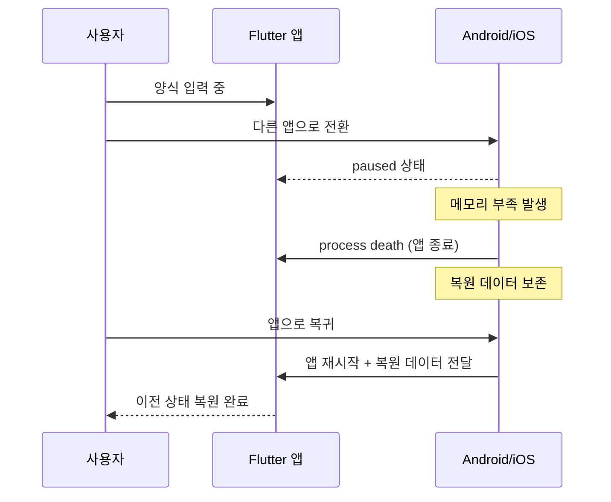

# Flutter 앱 생명주기 가이드

> **마지막 업데이트**: 2026-02-08 | **Flutter 3.38** | **Dart 3.10**
> **난이도**: 중급 | **카테고리**: system
> **선행 학습**: [WidgetFundamentals](../fundamentals/WidgetFundamentals.md) | **예상 학습 시간**: 1.5h

## 학습 목표

이 문서를 학습하면 다음을 할 수 있습니다:

1. **AppLifecycleState**의 5가지 상태(resumed, inactive, hidden, paused, detached)와 전환 흐름을 이해할 수 있다
2. **WidgetsBindingObserver**와 **AppLifecycleListener**(Flutter 3.13+)를 사용하여 생명주기 변화를 감지할 수 있다
3. **AppLifecycleService**를 싱글톤으로 구현하여 전역적으로 생명주기 이벤트를 관리할 수 있다
4. 포그라운드 복귀 시 **데이터 새로고침**, 백그라운드 진입 시 **상태 저장** 패턴을 구현할 수 있다
5. **Background Tasks**(WorkManager, Foreground Service)를 활용하여 백그라운드 작업을 처리할 수 있다

---

## 개요

앱 생명주기(Lifecycle) 관리는 백그라운드/포그라운드 전환, 메모리 관리, 상태 복원 등에 중요합니다. WidgetsBindingObserver, AppLifecycleListener, 그리고 Bloc과의 통합을 다룹니다.

## App Lifecycle 상태

### AppLifecycleState

```dart
enum AppLifecycleState {
  /// 앱이 호스트 뷰 내에서 보이고 응답 (Foreground)
  resumed,

  /// 앱이 비활성 상태이고 사용자 입력을 받지 않음
  /// iOS: 포그라운드에서 전화가 오거나 제어센터 열 때
  /// Android: 멀티윈도우 비활성 상태
  inactive,

  /// 앱이 숨겨져 있지만 실행 중 (Background)
  hidden,

  /// 앱이 일시 중지됨 (Background)
  paused,

  /// 앱이 Flutter 엔진에서 분리됨
  detached,
}
```

### 일반적인 상태 전환

```
앱 시작: detached → resumed
백그라운드로 이동: resumed → inactive → hidden → paused
포그라운드로 복귀: paused → hidden → inactive → resumed
앱 종료: paused → detached
```

## 기본 Lifecycle 감지

### WidgetsBindingObserver 사용

```dart
// lib/core/lifecycle/app_lifecycle_observer.dart
import 'package:flutter/material.dart';

class AppLifecycleObserver extends WidgetsBindingObserver {
  final void Function(AppLifecycleState state)? onStateChange;
  final VoidCallback? onResumed;
  final VoidCallback? onPaused;
  final VoidCallback? onInactive;
  final VoidCallback? onDetached;

  AppLifecycleObserver({
    this.onStateChange,
    this.onResumed,
    this.onPaused,
    this.onInactive,
    this.onDetached,
  });

  @override
  void didChangeAppLifecycleState(AppLifecycleState state) {
    onStateChange?.call(state);

    switch (state) {
      case AppLifecycleState.resumed:
        onResumed?.call();
        break;
      case AppLifecycleState.paused:
        onPaused?.call();
        break;
      case AppLifecycleState.inactive:
        onInactive?.call();
        break;
      case AppLifecycleState.detached:
        onDetached?.call();
        break;
      default:
        break;
    }
  }
}
```

### StatefulWidget에서 사용

```dart
class HomePage extends StatefulWidget {
  const HomePage({super.key});

  @override
  State<HomePage> createState() => _HomePageState();
}

class _HomePageState extends State<HomePage> with WidgetsBindingObserver {
  @override
  void initState() {
    super.initState();
    WidgetsBinding.instance.addObserver(this);
  }

  @override
  void dispose() {
    WidgetsBinding.instance.removeObserver(this);
    super.dispose();
  }

  @override
  void didChangeAppLifecycleState(AppLifecycleState state) {
    switch (state) {
      case AppLifecycleState.resumed:
        _onResumed();
        break;
      case AppLifecycleState.paused:
        _onPaused();
        break;
      default:
        break;
    }
  }

  void _onResumed() {
    // 포그라운드로 복귀
    // 데이터 새로고침, 연결 재개 등
    debugPrint('App resumed');
  }

  void _onPaused() {
    // 백그라운드로 이동
    // 데이터 저장, 연결 중단 등
    debugPrint('App paused');
  }

  @override
  Widget build(BuildContext context) {
    return Scaffold(...);
  }
}
```

## AppLifecycleListener (Flutter 3.13+)

### 새로운 API 사용

```dart
// lib/core/lifecycle/lifecycle_listener_widget.dart
import 'package:flutter/material.dart';

class LifecycleListenerWidget extends StatefulWidget {
  final Widget child;
  final VoidCallback? onResume;
  final VoidCallback? onPause;
  final VoidCallback? onInactive;
  final VoidCallback? onHide;
  final VoidCallback? onShow;
  final Future<AppExitResponse> Function()? onExitRequested;

  const LifecycleListenerWidget({
    super.key,
    required this.child,
    this.onResume,
    this.onPause,
    this.onInactive,
    this.onHide,
    this.onShow,
    this.onExitRequested,
  });

  @override
  State<LifecycleListenerWidget> createState() => _LifecycleListenerWidgetState();
}

class _LifecycleListenerWidgetState extends State<LifecycleListenerWidget> {
  late final AppLifecycleListener _listener;

  @override
  void initState() {
    super.initState();
    _listener = AppLifecycleListener(
      onResume: widget.onResume,
      onPause: widget.onPause,
      onInactive: widget.onInactive,
      onHide: widget.onHide,
      onShow: widget.onShow,
      onExitRequested: widget.onExitRequested,
    );
  }

  @override
  void dispose() {
    _listener.dispose();
    super.dispose();
  }

  @override
  Widget build(BuildContext context) {
    return widget.child;
  }
}
```

### 사용 예시

```dart
class MyApp extends StatelessWidget {
  @override
  Widget build(BuildContext context) {
    return LifecycleListenerWidget(
      onResume: () {
        debugPrint('App resumed');
        // 데이터 새로고침
      },
      onPause: () {
        debugPrint('App paused');
        // 상태 저장
      },
      onExitRequested: () async {
        // 앱 종료 요청 처리 (저장되지 않은 데이터 등)
        // 정리 작업 수행
        await _cleanup();
        return AppExitResponse.exit;  // 또는 AppExitResponse.cancel
      },
      child: MaterialApp(...),
    );
  }
}
```

## Lifecycle Service

### 전역 Lifecycle 관리

```dart
// lib/core/lifecycle/app_lifecycle_service.dart
import 'dart:async';

import 'package:flutter/material.dart';
import 'package:injectable/injectable.dart';

@lazySingleton
class AppLifecycleService with WidgetsBindingObserver {
  final _stateController = StreamController<AppLifecycleState>.broadcast();
  AppLifecycleState _currentState = AppLifecycleState.resumed;
  DateTime? _lastPausedAt;

  Stream<AppLifecycleState> get stateStream => _stateController.stream;
  AppLifecycleState get currentState => _currentState;
  DateTime? get lastPausedAt => _lastPausedAt;

  bool get isInForeground =>
      _currentState == AppLifecycleState.resumed ||
      _currentState == AppLifecycleState.inactive;

  bool get isInBackground =>
      _currentState == AppLifecycleState.paused ||
      _currentState == AppLifecycleState.hidden;

  void initialize() {
    WidgetsBinding.instance.addObserver(this);
  }

  void dispose() {
    WidgetsBinding.instance.removeObserver(this);
    _stateController.close();
  }

  @override
  void didChangeAppLifecycleState(AppLifecycleState state) {
    _currentState = state;
    if (state == AppLifecycleState.paused) {
      _lastPausedAt = DateTime.now();
    }
    _stateController.add(state);
  }

  /// 포그라운드 복귀 시 1회 콜백
  StreamSubscription<void> onNextResume(VoidCallback callback) {
    return stateStream
        .where((state) => state == AppLifecycleState.resumed)
        .take(1)
        .listen((_) => callback());
  }

  /// 포그라운드 복귀할 때마다 콜백
  StreamSubscription<void> onResume(VoidCallback callback) {
    return stateStream
        .where((state) => state == AppLifecycleState.resumed)
        .listen((_) => callback());
  }

  /// 백그라운드로 갈 때마다 콜백
  StreamSubscription<void> onPause(VoidCallback callback) {
    return stateStream
        .where((state) => state == AppLifecycleState.paused)
        .listen((_) => callback());
  }
}
```

### main.dart에서 초기화

```dart
void main() async {
  WidgetsFlutterBinding.ensureInitialized();

  // DI 설정
  configureDependencies();

  // Lifecycle 서비스 초기화
  getIt<AppLifecycleService>().initialize();

  runApp(const MyApp());
}
```

## Bloc과 통합

### Lifecycle Bloc

```dart
// lib/core/lifecycle/bloc/app_lifecycle_event.dart
import 'package:flutter/material.dart';
import 'package:freezed_annotation/freezed_annotation.dart';

part 'app_lifecycle_event.freezed.dart';

@freezed
class AppLifecycleEvent with _$AppLifecycleEvent {
  const factory AppLifecycleEvent.stateChanged(AppLifecycleState state) = _StateChanged;
  const factory AppLifecycleEvent.resumed() = _Resumed;
  const factory AppLifecycleEvent.paused() = _Paused;
}
```

```dart
// lib/core/lifecycle/bloc/app_lifecycle_state.dart
import 'package:flutter/material.dart';
import 'package:freezed_annotation/freezed_annotation.dart';

part 'app_lifecycle_state.freezed.dart';

@freezed
class AppLifecycleStateModel with _$AppLifecycleStateModel {
  const factory AppLifecycleStateModel({
    required AppLifecycleState lifecycleState,
    required DateTime? lastPausedAt,
    required DateTime? lastResumedAt,
  }) = _AppLifecycleStateModel;

  factory AppLifecycleStateModel.initial() => AppLifecycleStateModel(
        lifecycleState: AppLifecycleState.resumed,
        lastPausedAt: null,
        lastResumedAt: DateTime.now(),
      );
}

extension AppLifecycleStateX on AppLifecycleStateModel {
  bool get isInForeground =>
      lifecycleState == AppLifecycleState.resumed ||
      lifecycleState == AppLifecycleState.inactive;

  bool get isInBackground =>
      lifecycleState == AppLifecycleState.paused ||
      lifecycleState == AppLifecycleState.hidden;

  /// 백그라운드에 있던 시간 (초)
  int? get backgroundDuration {
    if (lastPausedAt == null || lastResumedAt == null) return null;
    if (lastResumedAt!.isBefore(lastPausedAt!)) return null;
    return lastResumedAt!.difference(lastPausedAt!).inSeconds;
  }
}
```

```dart
// lib/core/lifecycle/bloc/app_lifecycle_bloc.dart
import 'dart:async';

import 'package:flutter/material.dart';
import 'package:flutter_bloc/flutter_bloc.dart';

import '../app_lifecycle_service.dart';
import 'app_lifecycle_event.dart';
import 'app_lifecycle_state.dart';

class AppLifecycleBloc extends Bloc<AppLifecycleEvent, AppLifecycleStateModel> {
  final AppLifecycleService _lifecycleService;
  StreamSubscription<AppLifecycleState>? _subscription;

  AppLifecycleBloc({required AppLifecycleService lifecycleService})
      : _lifecycleService = lifecycleService,
        super(AppLifecycleStateModel.initial()) {
    on<AppLifecycleEvent>((event, emit) {
      event.when(
        stateChanged: (lifecycleState) =>
            _onStateChanged(lifecycleState, emit),
        resumed: () => _onResumed(emit),
        paused: () => _onPaused(emit),
      );
    });

    // Lifecycle 서비스 구독
    _subscription = _lifecycleService.stateStream.listen((state) {
      add(AppLifecycleEvent.stateChanged(state));
    });
  }

  void _onStateChanged(
    AppLifecycleState lifecycleState,
    Emitter<AppLifecycleStateModel> emit,
  ) {
    if (lifecycleState == AppLifecycleState.resumed) {
      add(const AppLifecycleEvent.resumed());
    } else if (lifecycleState == AppLifecycleState.paused) {
      add(const AppLifecycleEvent.paused());
    }

    emit(state.copyWith(lifecycleState: lifecycleState));
  }

  void _onResumed(Emitter<AppLifecycleStateModel> emit) {
    emit(state.copyWith(lastResumedAt: DateTime.now()));
  }

  void _onPaused(Emitter<AppLifecycleStateModel> emit) {
    emit(state.copyWith(lastPausedAt: DateTime.now()));
  }

  @override
  Future<void> close() {
    _subscription?.cancel();
    return super.close();
  }
}
```

### Feature Bloc에서 Lifecycle 활용

```dart
// lib/features/home/presentation/bloc/home_bloc.dart
class HomeBloc extends Bloc<HomeEvent, HomeState> {
  final GetDataUseCase _getDataUseCase;
  final AppLifecycleService _lifecycleService;
  StreamSubscription<void>? _resumeSubscription;

  HomeBloc({
    required GetDataUseCase getDataUseCase,
    required AppLifecycleService lifecycleService,
  })  : _getDataUseCase = getDataUseCase,
        _lifecycleService = lifecycleService,
        super(HomeState.initial()) {
    on<HomeEvent>((event, emit) async {
      await event.when(
        loaded: () => _onLoaded(emit),
        refreshed: () => _onRefreshed(emit),
      );
    });

    // 앱이 포그라운드로 돌아올 때 자동 새로고침
    _resumeSubscription = _lifecycleService.onResume(() {
      if (state.shouldRefreshOnResume) {
        add(const HomeEvent.refreshed());
      }
    });
  }

  @override
  Future<void> close() {
    _resumeSubscription?.cancel();
    return super.close();
  }

  // ...
}
```

## 일반적인 사용 사례

### 1. 데이터 새로고침

```dart
class DataSyncManager {
  final AppLifecycleService _lifecycleService;
  final DataRepository _repository;

  late StreamSubscription _subscription;

  DataSyncManager(this._lifecycleService, this._repository) {
    _subscription = _lifecycleService.stateStream.listen((state) {
      if (state == AppLifecycleState.resumed) {
        _syncData();
      }
    });
  }

  Future<void> _syncData() async {
    // 서버에서 최신 데이터 가져오기
    await _repository.syncFromServer();
  }

  void dispose() {
    _subscription.cancel();
  }
}
```

### 2. WebSocket 연결 관리

```dart
// import 'package:web_socket_channel/web_socket_channel.dart';

class WebSocketManager {
  final AppLifecycleService _lifecycleService;
  WebSocketChannel? _channel;
  late StreamSubscription _subscription;

  WebSocketManager(this._lifecycleService) {
    _subscription = _lifecycleService.stateStream.listen(_handleLifecycle);
  }

  void _handleLifecycle(AppLifecycleState state) {
    switch (state) {
      case AppLifecycleState.resumed:
        _reconnect();
        break;
      case AppLifecycleState.paused:
        _disconnect();
        break;
      default:
        break;
    }
  }

  void _connect() {
    _channel = WebSocketChannel.connect(Uri.parse('wss://...'));
  }

  void _disconnect() {
    _channel?.sink.close();
    _channel = null;
  }

  void _reconnect() {
    if (_channel == null) {
      _connect();
    }
  }

  void dispose() {
    _subscription.cancel();
    _disconnect();
  }
}
```

### 3. 세션 타임아웃

```dart
class SessionManager {
  final AppLifecycleService _lifecycleService;
  final AuthBloc _authBloc;

  static const _sessionTimeout = Duration(minutes: 30);

  SessionManager(this._lifecycleService, this._authBloc) {
    _lifecycleService.stateStream.listen(_handleLifecycle);
  }

  void _handleLifecycle(AppLifecycleState state) {
    if (state == AppLifecycleState.resumed) {
      _checkSessionTimeout();
    }
  }

  void _checkSessionTimeout() {
    final lastPaused = _lifecycleService.currentState;
    final pausedAt = _lifecycleService.lastPausedAt; // 저장된 마지막 paused 시간

    if (pausedAt != null) {
      final duration = DateTime.now().difference(pausedAt);
      if (duration > _sessionTimeout) {
        // 세션 타임아웃 - 로그아웃
        _authBloc.add(const AuthEvent.sessionExpired());
      }
    }
  }
}
```

### 4. 위치 추적 관리

```dart
// import 'package:geolocator/geolocator.dart';

class LocationTracker {
  final AppLifecycleService _lifecycleService;
  StreamSubscription<Position>? _positionSubscription;

  LocationTracker(this._lifecycleService) {
    _lifecycleService.stateStream.listen(_handleLifecycle);
  }

  void _handleLifecycle(AppLifecycleState state) {
    switch (state) {
      case AppLifecycleState.resumed:
        _startTracking();
        break;
      case AppLifecycleState.paused:
        _stopTracking();
        break;
      default:
        break;
    }
  }

  void _startTracking() {
    _positionSubscription = Geolocator.getPositionStream().listen((position) {
      // 위치 업데이트 처리
    });
  }

  void _stopTracking() {
    _positionSubscription?.cancel();
    _positionSubscription = null;
  }
}
```

### 5. 미디어 재생 관리

```dart
// import 'package:just_audio/just_audio.dart';

class MediaPlayerManager {
  final AppLifecycleService _lifecycleService;
  final AudioPlayer _audioPlayer;

  bool _wasPlaying = false;

  MediaPlayerManager(this._lifecycleService, this._audioPlayer) {
    _lifecycleService.stateStream.listen(_handleLifecycle);
  }

  void _handleLifecycle(AppLifecycleState state) {
    switch (state) {
      case AppLifecycleState.paused:
        // 백그라운드로 이동 시 재생 상태 저장
        _wasPlaying = _audioPlayer.playing;
        if (_wasPlaying) {
          _audioPlayer.pause();
        }
        break;

      case AppLifecycleState.resumed:
        // 포그라운드 복귀 시 재생 재개 (옵션)
        // if (_wasPlaying) {
        //   _audioPlayer.play();
        // }
        break;

      default:
        break;
    }
  }
}
```

## 시스템 이벤트 처리

### 메모리 부족 경고

```dart
class MemoryWarningObserver extends WidgetsBindingObserver {
  @override
  void didHaveMemoryPressure() {
    // 메모리 부족 경고
    // 캐시 정리, 불필요한 리소스 해제
    debugPrint('Memory pressure warning');

    // 이미지 캐시 정리
    PaintingBinding.instance.imageCache.clear();
    PaintingBinding.instance.imageCache.clearLiveImages();
  }
}
```

### 시스템 설정 변경

```dart
class SystemSettingsObserver extends WidgetsBindingObserver {
  @override
  void didChangePlatformBrightness() {
    // 시스템 밝기 모드 변경 (다크모드 등)
    final brightness = WidgetsBinding.instance.platformDispatcher.platformBrightness;
    debugPrint('Brightness changed: $brightness');
  }

  @override
  void didChangeLocales(List<Locale>? locales) {
    // 시스템 언어 변경
    debugPrint('Locales changed: $locales');
  }

  @override
  void didChangeMetrics() {
    // 텍스트 크기, 화면 크기 등 메트릭 변경
    // Flutter 3.16+: didChangeTextScaleFactor는 deprecated
    // platformDispatcher.textScaleFactor는 Flutter 3.16에서 deprecated, Flutter 3.38에서 removed
    // TextScaler 사용 권장
    debugPrint('Metrics changed');

    // 텍스트 스케일 정보가 필요한 경우:
    // 1. Widget context가 있다면: MediaQuery.textScalerOf(context) 사용
    // 2. PlatformDispatcher에서: View.of(context).devicePixelRatio 등 활용
  }

  @override
  void didChangeAccessibilityFeatures() {
    // 접근성 설정 변경
    debugPrint('Accessibility features changed');
  }
}
```

### 텍스트 스케일 변경 감지 (Flutter 3.27+)

```dart
// Widget에서 텍스트 스케일 팩터 사용 (권장)
class ResponsiveTextWidget extends StatelessWidget {
  @override
  Widget build(BuildContext context) {
    // Flutter 3.27+: MediaQuery.textScalerOf(context) 사용
    final textScaler = MediaQuery.textScalerOf(context);
    final scaleFactor = textScaler.scale(1.0);

    return Text(
      'Scaled Text',
      style: TextStyle(
        fontSize: 16 * scaleFactor,  // 텍스트 스케일 적용
      ),
    );
  }
}

// 또는 TextScaler를 직접 활용
class AdaptiveWidget extends StatelessWidget {
  @override
  Widget build(BuildContext context) {
    final textScaler = MediaQuery.textScalerOf(context);

    // TextScaler는 자동으로 접근성 설정을 반영
    return Container(
      padding: EdgeInsets.all(textScaler.scale(16.0)),
      child: Text(
        'Adaptive Text',
        style: Theme.of(context).textTheme.bodyLarge,
      ),
    );
  }
}
```

## 상태 저장/복원

### 백그라운드 진입 시 상태 저장

```dart
class StatePersistenceManager {
  final AppLifecycleService _lifecycleService;
  final SharedPreferences _prefs;
  final HomeBloc _homeBloc;

  StatePersistenceManager(
    this._lifecycleService,
    this._prefs,
    this._homeBloc,
  ) {
    _lifecycleService.stateStream.listen(_handleLifecycle);
  }

  void _handleLifecycle(AppLifecycleState state) {
    switch (state) {
      case AppLifecycleState.paused:
        _saveState();
        break;
      case AppLifecycleState.resumed:
        _restoreState();
        break;
      default:
        break;
    }
  }

  Future<void> _saveState() async {
    // 현재 상태 저장
    final state = _homeBloc.state;
    await _prefs.setInt('lastPage', state.currentPage);
    await _prefs.setString('lastFilter', state.filter);
    await _prefs.setString('savedAt', DateTime.now().toIso8601String());
  }

  Future<void> _restoreState() async {
    // 저장된 상태 복원
    final savedAt = _prefs.getString('savedAt');
    if (savedAt == null) return;

    // 1시간 이내에 저장된 상태만 복원
    final savedTime = DateTime.parse(savedAt);
    if (DateTime.now().difference(savedTime).inHours > 1) {
      await _clearSavedState();
      return;
    }

    final lastPage = _prefs.getInt('lastPage');
    final lastFilter = _prefs.getString('lastFilter');

    if (lastPage != null || lastFilter != null) {
      _homeBloc.add(HomeEvent.restored(
        page: lastPage,
        filter: lastFilter,
      ));
    }
  }

  Future<void> _clearSavedState() async {
    await _prefs.remove('lastPage');
    await _prefs.remove('lastFilter');
    await _prefs.remove('savedAt');
  }
}
```

## 테스트

### Lifecycle 테스트

```dart
void main() {
  late AppLifecycleService lifecycleService;

  setUp(() {
    lifecycleService = AppLifecycleService();
    lifecycleService.initialize();
  });

  tearDown(() {
    lifecycleService.dispose();
  });

  test('should emit state changes', () async {
    final states = <AppLifecycleState>[];
    lifecycleService.stateStream.listen(states.add);

    // 상태 변경 시뮬레이션 (실제로는 시스템에서 발생)
    lifecycleService.didChangeAppLifecycleState(AppLifecycleState.paused);
    lifecycleService.didChangeAppLifecycleState(AppLifecycleState.resumed);

    await Future.delayed(Duration.zero);

    expect(states, [AppLifecycleState.paused, AppLifecycleState.resumed]);
  });

  test('isInForeground should be true when resumed', () {
    lifecycleService.didChangeAppLifecycleState(AppLifecycleState.resumed);
    expect(lifecycleService.isInForeground, true);
  });

  test('isInBackground should be true when paused', () {
    lifecycleService.didChangeAppLifecycleState(AppLifecycleState.paused);
    expect(lifecycleService.isInBackground, true);
  });
}
```

### Bloc 테스트

```dart
void main() {
  late AppLifecycleBloc bloc;
  late MockAppLifecycleService mockService;

  setUp(() {
    mockService = MockAppLifecycleService();
    when(() => mockService.stateStream)
        .thenAnswer((_) => const Stream.empty());
    bloc = AppLifecycleBloc(lifecycleService: mockService);
  });

  blocTest<AppLifecycleBloc, AppLifecycleStateModel>(
    'should update lastResumedAt when resumed',
    build: () => bloc,
    act: (bloc) => bloc.add(const AppLifecycleEvent.resumed()),
    expect: () => [
      isA<AppLifecycleStateModel>()
          .having((s) => s.lastResumedAt, 'lastResumedAt', isNotNull),
    ],
  );

  blocTest<AppLifecycleBloc, AppLifecycleStateModel>(
    'should update lastPausedAt when paused',
    build: () => bloc,
    act: (bloc) => bloc.add(const AppLifecycleEvent.paused()),
    expect: () => [
      isA<AppLifecycleStateModel>()
          .having((s) => s.lastPausedAt, 'lastPausedAt', isNotNull),
    ],
  );
}
```

## 체크리스트

- [ ] AppLifecycleService 구현 (전역 Lifecycle 관리)
- [ ] main.dart에서 초기화
- [ ] 포그라운드 복귀 시 데이터 새로고침
- [ ] 백그라운드 진입 시 상태 저장
- [ ] WebSocket/실시간 연결 관리
- [ ] 세션 타임아웃 처리
- [ ] 메모리 부족 경고 처리
- [ ] 시스템 설정 변경 감지 (다크모드, 언어 등)
- [ ] Feature Bloc에서 Lifecycle 구독
- [ ] 상태 저장/복원 로직
- [ ] Lifecycle 테스트

## 10. Background Tasks

### 10.1 Android WorkManager

```yaml
# pubspec.yaml
dependencies:
  workmanager: ^0.9.0+3
```

```dart
// lib/core/background/background_service.dart
import 'package:flutter/foundation.dart';
import 'package:workmanager/workmanager.dart';

class BackgroundService {
  static const syncTaskName = 'sync_data';
  static const uploadTaskName = 'upload_pending';

  static Future<void> initialize() async {
    await Workmanager().initialize(
      callbackDispatcher,
      isInDebugMode: kDebugMode,
    );
  }

  /// 주기적 동기화 등록 (최소 15분)
  static Future<void> registerPeriodicSync() async {
    await Workmanager().registerPeriodicTask(
      'sync-task',
      syncTaskName,
      frequency: const Duration(hours: 1),
      constraints: Constraints(
        networkType: NetworkType.connected,
        requiresBatteryNotLow: true,
      ),
      backoffPolicy: BackoffPolicy.exponential,
      existingWorkPolicy: ExistingWorkPolicy.keep,
    );
  }

  /// 일회성 작업 등록
  static Future<void> scheduleUpload(String filePath) async {
    await Workmanager().registerOneOffTask(
      'upload-${DateTime.now().millisecondsSinceEpoch}',
      uploadTaskName,
      inputData: {'filePath': filePath},
      constraints: Constraints(
        networkType: NetworkType.unmetered, // WiFi만
      ),
    );
  }
}

// Top-level 콜백 함수 (반드시 top-level)
@pragma('vm:entry-point')
void callbackDispatcher() {
  Workmanager().executeTask((taskName, inputData) async {
    try {
      switch (taskName) {
        case BackgroundService.syncTaskName:
          await _performSync();
          break;
        case BackgroundService.uploadTaskName:
          await _performUpload(inputData!['filePath']!);
          break;
      }
      return true;
    } catch (e) {
      return false; // 재시도 트리거
    }
  });
}
```

### 10.2 iOS Background Fetch

```dart
// iOS에서는 workmanager가 BGTaskScheduler 사용
// Info.plist 설정 필요

// ios/Runner/Info.plist
/*
<key>BGTaskSchedulerPermittedIdentifiers</key>
<array>
  <string>com.example.app.sync</string>
  <string>com.example.app.upload</string>
</array>
<key>UIBackgroundModes</key>
<array>
  <string>fetch</string>
  <string>processing</string>
</array>
*/
```

### 10.3 Foreground Service (장시간 작업)

```dart
// 음악 재생, GPS 추적 등 사용자에게 보이는 장시간 작업
import 'package:flutter_foreground_task/flutter_foreground_task.dart';

class ForegroundService {
  static Future<void> startLocationTracking() async {
    await FlutterForegroundTask.init(
      androidNotificationOptions: AndroidNotificationOptions(
        channelId: 'location_tracking',
        channelName: '위치 추적',
        channelDescription: '백그라운드 위치 추적 중',
        channelImportance: NotificationChannelImportance.LOW,
        priority: NotificationPriority.LOW,
        iconData: const NotificationIconData(
          resType: ResourceType.mipmap,
          resPrefix: ResourcePrefix.ic,
          name: 'launcher',
        ),
      ),
      iosNotificationOptions: const IOSNotificationOptions(
        showNotification: true,
        playSound: false,
      ),
      foregroundTaskOptions: const ForegroundTaskOptions(
        interval: 5000,
        isOnceEvent: false,
        autoRunOnBoot: true,
      ),
    );

    await FlutterForegroundTask.startService(
      notificationTitle: '위치 추적 중',
      notificationText: '앱이 백그라운드에서 위치를 추적하고 있습니다',
      callback: _locationCallback,
    );
  }
}

@pragma('vm:entry-point')
void _locationCallback() {
  FlutterForegroundTask.setTaskHandler(LocationTaskHandler());
}

class LocationTaskHandler extends TaskHandler {
  @override
  Future<void> onRepeatEvent(DateTime timestamp) async {
    // 주기적으로 위치 업데이트
    final position = await Geolocator.getCurrentPosition();
    await LocationService.savePosition(position);
  }
}
```

### 10.4 배터리 최적화 대응

```dart
// Android 배터리 최적화 해제 요청
import 'package:disable_battery_optimization/disable_battery_optimization.dart';

Future<void> requestBatteryOptimizationExemption() async {
  final isDisabled = await DisableBatteryOptimization
      .isBatteryOptimizationDisabled;

  if (isDisabled != true) {
    await DisableBatteryOptimization
        .showDisableBatteryOptimizationSettings();
  }
}
```

### 10.5 주의사항

| 항목 | Android | iOS |
|-----|---------|-----|
| 최소 주기 | 15분 | 제한 없음 (시스템 결정) |
| 실행 보장 | 대략적 보장 | 보장 안됨 |
| 네트워크 제약 | 설정 가능 | 제한적 |
| 배터리 최적화 | Doze 모드 영향 | Low Power Mode 영향 |

---

## 11. 상태 복원 (State Restoration) — RestorationMixin

### 11.1 개요

Android/iOS에서 앱이 백그라운드에서 시스템에 의해 종료(process death)되면, 사용자가 앱으로 돌아올 때 이전 상태를 복원해야 합니다. Flutter는 **RestorationMixin**과 **RestorableProperty**를 통해 프레임워크 레벨의 상태 복원을 지원합니다.

> **위 섹션 "상태 저장/복원"과의 차이**: 위 섹션은 SharedPreferences로 직접 저장하는 수동 방식이고,
> 이 섹션은 Flutter의 Restoration API를 활용하여 **프레임워크가 자동으로 저장/복원을 관리**하는 방식입니다.



### 11.2 RestorableProperty 기본 사용

Flutter가 제공하는 Restorable 타입:

| 타입 | 설명 | 용도 |
|------|------|------|
| `RestorableInt` | int 값 복원 | 페이지 번호, 카운터 |
| `RestorableDouble` | double 값 복원 | 스크롤 위치, 슬라이더 값 |
| `RestorableBool` | bool 값 복원 | 토글 상태, 체크박스 |
| `RestorableString` | String 값 복원 | 텍스트 입력, 검색어 |
| `RestorableDateTime` | DateTime 값 복원 | 날짜 선택 |
| `RestorableTextEditingController` | 텍스트 컨트롤러 복원 | 폼 입력 |
| `RestorableEnum` | enum 값 복원 | 탭 선택, 정렬 옵션 |
| `RestorableEnumN` | nullable enum 복원 | 선택적 필터 |

```dart
// 기본 사용 예시: 카운터 앱
class CounterPage extends StatefulWidget {
  const CounterPage({super.key});

  @override
  State<CounterPage> createState() => _CounterPageState();
}

class _CounterPageState extends State<CounterPage> with RestorationMixin {
  // Restorable 프로퍼티 선언
  final RestorableInt _counter = RestorableInt(0);

  @override
  // 복원 ID — 위젯 트리에서 이 위젯을 고유하게 식별
  String? get restorationId => 'counter_page';

  @override
  void restoreState(RestorationBucket? oldBucket, bool initialRestore) {
    // 프레임워크에 복원할 프로퍼티 등록
    registerForRestoration(_counter, 'counter');
  }

  @override
  void dispose() {
    _counter.dispose();
    super.dispose();
  }

  @override
  Widget build(BuildContext context) {
    return Scaffold(
      body: Center(child: Text('Count: ${_counter.value}')),
      floatingActionButton: FloatingActionButton(
        onPressed: () => setState(() => _counter.value++),
        child: const Icon(Icons.add),
      ),
    );
  }
}
```

### 11.3 폼 상태 복원 (실무 패턴)

```dart
// 회원가입 폼에서 상태 복원
class SignUpFormPage extends StatefulWidget {
  const SignUpFormPage({super.key});

  @override
  State<SignUpFormPage> createState() => _SignUpFormPageState();
}

class _SignUpFormPageState extends State<SignUpFormPage> with RestorationMixin {
  // 텍스트 입력 복원
  final RestorableTextEditingController _nameController =
      RestorableTextEditingController();
  final RestorableTextEditingController _emailController =
      RestorableTextEditingController();

  // 체크박스 상태 복원
  final RestorableBool _agreeToTerms = RestorableBool(false);

  // 현재 스텝 복원
  final RestorableInt _currentStep = RestorableInt(0);

  @override
  String? get restorationId => 'sign_up_form';

  @override
  void restoreState(RestorationBucket? oldBucket, bool initialRestore) {
    registerForRestoration(_nameController, 'name');
    registerForRestoration(_emailController, 'email');
    registerForRestoration(_agreeToTerms, 'agree_terms');
    registerForRestoration(_currentStep, 'current_step');
  }

  @override
  void dispose() {
    _nameController.dispose();
    _emailController.dispose();
    _agreeToTerms.dispose();
    _currentStep.dispose();
    super.dispose();
  }

  @override
  Widget build(BuildContext context) {
    return Scaffold(
      appBar: AppBar(title: const Text('회원가입')),
      body: Stepper(
        currentStep: _currentStep.value,
        onStepContinue: () {
          if (_currentStep.value < 2) {
            setState(() => _currentStep.value++);
          }
        },
        onStepCancel: () {
          if (_currentStep.value > 0) {
            setState(() => _currentStep.value--);
          }
        },
        steps: [
          Step(
            title: const Text('기본 정보'),
            content: Column(
              children: [
                TextField(
                  controller: _nameController.value,
                  decoration: const InputDecoration(labelText: '이름'),
                ),
                TextField(
                  controller: _emailController.value,
                  decoration: const InputDecoration(labelText: '이메일'),
                ),
              ],
            ),
          ),
          Step(
            title: const Text('약관 동의'),
            content: CheckboxListTile(
              title: const Text('이용약관에 동의합니다'),
              value: _agreeToTerms.value,
              onChanged: (v) => setState(() => _agreeToTerms.value = v ?? false),
            ),
          ),
          Step(
            title: const Text('확인'),
            content: Text('${_nameController.value.text}님, 가입을 완료하세요'),
          ),
        ],
      ),
    );
  }
}
```

### 11.4 커스텀 RestorableProperty

Freezed sealed class나 복잡한 객체를 복원해야 할 때 커스텀 RestorableProperty를 정의합니다.

```dart
/// 커스텀 Restorable — JSON 직렬화 가능한 객체용
class RestorableFilter extends RestorableValue<FilterOption> {
  @override
  FilterOption createDefaultValue() => FilterOption.all;

  @override
  void didUpdateValue(FilterOption? oldValue) {
    // 값 변경 시 호출 — notifyListeners()가 자동으로 호출됨
  }

  @override
  FilterOption fromPrimitives(Object? data) {
    // 복원 시 호출 — 저장된 데이터를 객체로 변환
    if (data is int) {
      return FilterOption.values[data];
    }
    return FilterOption.all;
  }

  @override
  Object? toPrimitives() {
    // 저장 시 호출 — 객체를 직렬화 가능한 형태로 변환
    return value.index;
  }
}

enum FilterOption { all, active, completed }

/// 사용 예시
class _TodoListState extends State<TodoListPage> with RestorationMixin {
  final RestorableFilter _filter = RestorableFilter();

  @override
  String? get restorationId => 'todo_list';

  @override
  void restoreState(RestorationBucket? oldBucket, bool initialRestore) {
    registerForRestoration(_filter, 'filter');
  }

  @override
  void dispose() {
    _filter.dispose();
    super.dispose();
  }
  // ...
}
```

### 11.5 GoRouter와 상태 복원 통합

GoRouter의 네비게이션 상태를 복원하려면 `restorationScopeId`를 설정합니다.

```dart
// MaterialApp에서 복원 스코프 활성화
MaterialApp.router(
  // ✅ 복원 스코프 ID 설정 — 이것이 없으면 상태 복원이 동작하지 않음
  restorationScopeId: 'app',
  routerConfig: _router,
);

// GoRouter 설정
final _router = GoRouter(
  // ✅ GoRouter 복원 스코프
  restorationScopeId: 'router',
  routes: [
    GoRoute(
      path: '/',
      builder: (context, state) => const HomePage(),
    ),
    GoRoute(
      path: '/detail/:id',
      builder: (context, state) {
        final id = state.pathParameters['id']!;
        return DetailPage(id: id);
      },
    ),
  ],
);
```

> **참고**: GoRouter의 redirect와 인증 상태 통합은 [GoRouter redirect](../core/BlocUiEffect.md)와
> [인증 라우팅](../features/Authentication.md)을 참조하세요.

### 11.6 Bloc과 상태 복원 통합

Bloc의 `HydratedBloc`(`hydrated_bloc` 패키지)을 사용하면 Bloc 상태를 자동으로 디스크에 저장/복원할 수 있습니다. 이는 process death 복원에도 효과적입니다.

```yaml
# pubspec.yaml
dependencies:
  hydrated_bloc: ^10.0.0
  path_provider: ^2.1.5
```

```dart
// HydratedBloc 초기화 (main.dart)
void main() async {
  WidgetsFlutterBinding.ensureInitialized();

  // HydratedBloc 스토리지 초기화
  HydratedBloc.storage = await HydratedStorage.build(
    storageDirectory: await getApplicationDocumentsDirectory(),
  );

  runApp(const MyApp());
}
```

```dart
// HydratedBloc 사용 예시 — 설정 상태 자동 저장/복원
class SettingsBloc extends HydratedBloc<SettingsEvent, SettingsState> {
  SettingsBloc() : super(const SettingsState()) {
    on<ThemeChanged>(_onThemeChanged);
    on<LocaleChanged>(_onLocaleChanged);
  }

  void _onThemeChanged(ThemeChanged event, Emitter<SettingsState> emit) {
    emit(state.copyWith(themeMode: event.themeMode));
  }

  void _onLocaleChanged(LocaleChanged event, Emitter<SettingsState> emit) {
    emit(state.copyWith(locale: event.locale));
  }

  @override
  SettingsState? fromJson(Map<String, dynamic> json) {
    // 디스크에서 복원 시 호출
    return SettingsState.fromJson(json);
  }

  @override
  Map<String, dynamic>? toJson(SettingsState state) {
    // 상태 변경 시 디스크에 저장
    return state.toJson();
  }
}
```

### 11.7 Process Death 테스트

상태 복원이 올바르게 동작하는지 검증하는 방법:

**Android에서 테스트:**

```bash
# 1. 앱을 백그라운드로 보냄 (홈 버튼)
# 2. ADB로 프로세스 강제 종료
adb shell am kill com.example.myapp

# 3. 최근 앱 목록에서 앱 탭하여 복귀
# 4. 상태가 복원되는지 확인
```

**iOS에서 테스트:**

```bash
# Xcode에서 디버그 중:
# 1. 앱을 백그라운드로 보냄
# 2. Xcode 하단 디버그 바에서 "Stop" 버튼 클릭
# 3. 기기에서 앱 아이콘 탭하여 복귀 (Xcode에서 재실행 아님)
```

**위젯 테스트:**

```dart
testWidgets('상태 복원이 올바르게 동작해야 한다', (tester) async {
  // RootRestorationScope로 복원 테스트 환경 설정
  await tester.pumpWidget(
    const RootRestorationScope(
      restorationId: 'root',
      child: MaterialApp(
        restorationScopeId: 'app',
        home: CounterPage(),
      ),
    ),
  );

  // 카운터 증가
  await tester.tap(find.byIcon(Icons.add));
  await tester.pump();
  expect(find.text('Count: 1'), findsOneWidget);

  // 상태 복원 시뮬레이션
  final data = await tester.getRestorationData();

  // 앱 재시작 시뮬레이션
  await tester.restartAndRestore();

  // 복원된 상태 확인
  expect(find.text('Count: 1'), findsOneWidget);

  // 또는 수동으로 복원 데이터 적용
  await tester.restoreFrom(data);
  expect(find.text('Count: 1'), findsOneWidget);
});
```

### 11.8 상태 복원 결정 기준

모든 상태를 복원할 필요는 없습니다. 아래 기준으로 판단하세요:

| 복원 대상 | 복원 방식 | 예시 |
|-----------|----------|------|
| **폼 입력 (진행 중)** | RestorationMixin | 회원가입, 주문서, 검색어 |
| **네비게이션 스택** | GoRouter restorationScopeId | 현재 화면 위치 |
| **스크롤 위치** | PageStorageKey (자동) | 리스트 스크롤 |
| **탭 선택** | RestorableInt | BottomNavigationBar index |
| **설정/테마** | HydratedBloc | 다크모드, 언어 설정 |
| **서버 데이터** | 복원 불필요 — API 재호출 | 목록 데이터, 프로필 |
| **일회성 UI** | 복원 불필요 | 스낵바, 다이얼로그 |

> **원칙**: 사용자가 직접 입력한 데이터는 반드시 복원하고, 서버에서 가져올 수 있는 데이터는 재요청합니다.

---

## 실습 과제

### 과제 1: AppLifecycleService 구현 및 테스트
`AppLifecycleService`를 싱글톤으로 구현하고, 포그라운드/백그라운드 전환 시 콘솔에 로그를 출력하세요.
- `stateStream`으로 상태 변화를 브로드캐스트
- `isInForeground`, `isInBackground` getter 구현
- `lastPausedAt` 시간 기록
- 유닛 테스트에서 `didChangeAppLifecycleState`를 호출하여 상태 전환을 검증하세요.

### 과제 2: 세션 타임아웃 구현
`SessionManager`를 구현하여 백그라운드에 30분 이상 머물면 자동 로그아웃되도록 하세요.
- 포그라운드 복귀 시 `lastPausedAt`과 현재 시간의 차이를 계산
- 타임아웃 시 `AuthBloc`에 `sessionExpired` 이벤트 발행
- 타임아웃 시간을 설정에서 변경 가능하도록 구현하세요.

### 과제 3: 자동 새로고침 Bloc
`HomeBloc`에서 `AppLifecycleService`를 구독하여 포그라운드 복귀 시 자동으로 데이터를 새로고침하세요.
- 마지막 로드 이후 5분 이상 경과한 경우에만 새로고침
- `StreamSubscription`을 `close()`에서 정리
- `blocTest`로 새로고침 동작을 검증하세요.

---

## Self-Check 퀴즈

학습한 내용을 점검해 보세요:

- [ ] `AppLifecycleState`의 5가지 상태와 백그라운드 이동 시 전환 순서(resumed → inactive → hidden → paused)를 설명할 수 있는가?
- [ ] `WidgetsBindingObserver`와 `AppLifecycleListener`(Flutter 3.13+)의 차이점을 설명할 수 있는가?
- [ ] `WidgetsBinding.instance.removeObserver(this)`를 `dispose()`에서 호출하지 않으면 어떤 문제가 발생하는지 설명할 수 있는가?
- [ ] WorkManager의 최소 실행 주기가 Android에서 15분인 이유를 설명할 수 있는가?
- [ ] Foreground Service와 Background Task의 사용 시나리오 차이를 설명할 수 있는가?
- [ ] `RestorationMixin`과 `RestorableProperty`를 사용하여 process death 후 상태를 복원하는 전체 흐름을 구현할 수 있는가?
- [ ] `restorationId`의 역할과 위젯 트리에서 고유해야 하는 이유를 설명할 수 있는가?
- [ ] GoRouter의 `restorationScopeId`로 네비게이션 상태를 복원하는 방법을 구현할 수 있는가?
- [ ] `HydratedBloc`을 사용하여 Bloc 상태를 자동으로 디스크에 저장/복원하는 방법을 구현할 수 있는가?
- [ ] ADB를 사용한 Android process death 테스트 방법을 실행할 수 있는가?
- [ ] 복원이 필요한 상태(폼 입력, 네비게이션)와 불필요한 상태(서버 데이터, 일회성 UI)를 구분할 수 있는가?
