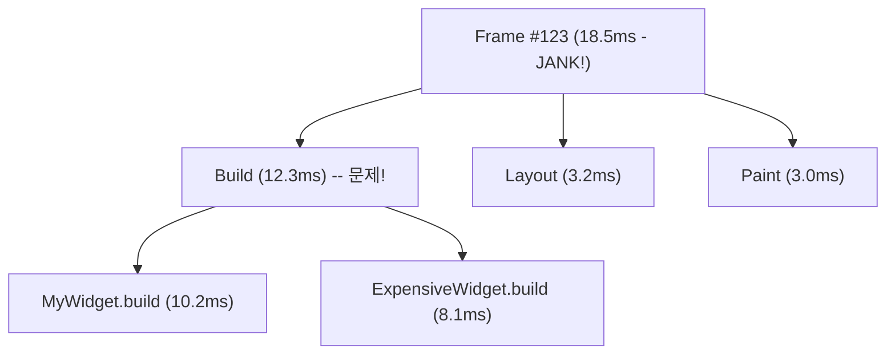

# Flutter DevTools & 성능 프로파일링 가이드

> **난이도**: 중급 | **카테고리**: system
> **선행 학습**: [FlutterInternals](../fundamentals/FlutterInternals.md)
> **예상 학습 시간**: 2h

> Flutter Clean Architecture + Bloc 패턴 기반 교육 자료
> Package versions: flutter_bloc ^9.1.1, freezed ^3.2.4, fpdart ^1.2.0, go_router ^17.0.1, get_it ^9.2.0, injectable ^2.5.0

DevTools 실전 활용과 성능 문제 진단/해결 방법을 다루는 가이드입니다.

> **학습 목표**: 이 문서를 학습하면 다음을 할 수 있습니다:
> - DevTools의 주요 기능(Inspector, Performance, Memory, Network)을 실전에 활용할 수 있습니다
> - 60fps 미달 원인을 체계적으로 진단하고 해결할 수 있습니다
> - 메모리 릭을 감지하고 Heap Snapshot으로 원인을 분석할 수 있습니다

---

## 목차

1. [DevTools 개요](#1-devtools-개요)
2. [Widget Inspector](#2-widget-inspector)
3. [Performance View](#3-performance-view)
4. [CPU Profiler](#4-cpu-profiler)
5. [Memory View](#5-memory-view)
6. [Network View](#6-network-view)
7. [Logging View](#7-logging-view)
8. [실전 성능 문제 진단](#8-실전-성능-문제-진단)
9. [프로파일링 체크리스트](#9-프로파일링-체크리스트)
10. [자동화된 성능 테스트](#10-자동화된-성능-테스트)

---

> **Quick Start (5분 요약)**
>
> DevTools 접속 방법:
> ```bash
> # 1. Flutter 앱 실행 (Debug 모드)
> flutter run
>
> # 2. DevTools 자동 실행 (또는 터미널 URL 클릭)
> # 브라우저에서 http://localhost:9100 열림
> ```
>
> 성능 문제 진단 4단계:
> ```
> 1. Performance View → Frame 차트 확인 (60fps 유지되는가?)
> 2. Jank 발견 → Timeline 확인 (Build/Layout/Paint 중 어디가 느린가?)
> 3. CPU Profiler → Flame Chart (어떤 함수가 시간을 많이 쓰는가?)
> 4. 최적화 적용 → 재측정
> ```
>
> 메모리 릭 진단:
> ```
> 1. Memory View → 페이지 이동 전후 메모리 비교
> 2. Heap Snapshot → 증가한 객체 확인
> 3. 원인 코드 수정 (StreamController.close() 누락 등)
> ```

---

## 1. DevTools 개요

### DevTools란?

Flutter DevTools는 Flutter/Dart 앱의 성능, 메모리, 네트워크를 분석하는 **브라우저 기반 도구 모음**입니다.

### 설치 및 실행

```bash
# Flutter 3.16+ 이후 별도 설치 불필요
# Dart SDK에 내장되어 있음
dart devtools

# 앱 실행 (Debug 모드)
flutter run

# DevTools는 flutter run 시 자동으로 사용 가능
# 또는 별도로 실행:
# dart devtools

# 브라우저에서 접속
# http://localhost:9100
```

### 주요 탭 소개

| 탭 | 용도 | 주요 기능 |
|----|------|----------|
| **Inspector** | Widget 트리 탐색 | Layout Explorer, 리빌드 추적 |
| **Performance** | 프레임 성능 분석 | Frame 차트, Timeline, Jank 감지 |
| **CPU Profiler** | CPU 사용량 분석 | Flame Chart, Bottom Up, Top Down |
| **Memory** | 메모리 사용량 분석 | Heap Snapshot, 메모리 릭 디버깅 |
| **Network** | 네트워크 요청 모니터링 | HTTP 요청/응답, 타이밍 |
| **Logging** | 로그 확인 | print(), debugPrint(), flutter 로그 |
| **App Size** | 앱 크기 분석 | 패키지별 크기, 트리맵 |
| **Debugger** | 소스 디버깅 | 브레이크포인트, 변수 검사 |

### DevTools 연결

```dart
// 1. 앱 실행 후 터미널에 표시되는 URL 확인
// Flutter run key commands.
// ...
// The Dart VM service is listening on http://127.0.0.1:12345/xxxxx

// 2. DevTools에서 "Connect" 버튼 클릭
// 3. VM Service URL 입력

// 또는 자동 연결:
flutter run -d chrome --devtools-server-address=http://127.0.0.1:9100
```

---

## 2. Widget Inspector

### Widget 트리 탐색

```dart
// Inspector에서 Widget 선택 → 속성 확인
class InspectorExample extends StatelessWidget {
  @override
  Widget build(BuildContext context) {
    return Scaffold(
      appBar: AppBar(title: Text('Inspector Demo')),
      body: Center(
        child: Container(
          // Inspector에서 Container 선택 시:
          // - width: 200
          // - height: 200
          // - color: Colors.blue
          // - constraints: BoxConstraints(...)
          width: 200,
          height: 200,
          color: Colors.blue,
          child: Text(
            'Hello',
            // - TextStyle 정보
            // - textAlign
            // - overflow
            style: TextStyle(fontSize: 24, color: Colors.white),
          ),
        ),
      ),
    );
  }
}
```

### Layout Explorer

Widget 선택 시 오른쪽 패널에서 레이아웃 정보 확인:

- **Flex Layout**: Row/Column의 MainAxis/CrossAxis 시각화
- **Box Constraints**: 제약 조건 표시
- **Size**: 실제 렌더링된 크기
- **Offset**: 부모 기준 위치

```dart
// Layout Explorer 활용 예시
Row(
  mainAxisAlignment: MainAxisAlignment.spaceBetween,
  crossAxisAlignment: CrossAxisAlignment.center,
  children: [
    Container(width: 100, height: 100, color: Colors.red),
    Expanded(child: Container(height: 50, color: Colors.green)),
    Container(width: 100, height: 100, color: Colors.blue),
  ],
)
// Inspector에서 Row 선택 → Layout Explorer:
// - MainAxis: horizontal, spaceBetween
// - CrossAxis: vertical, center
// - Expanded가 어떻게 공간을 차지하는지 시각화
```

### Select Widget Mode

DevTools에서 "Select Widget Mode" 활성화:
1. 앱 화면에서 위젯 클릭
2. Inspector에서 해당 위젯 자동 선택
3. Widget 트리에서 위치 확인

### Show Guidelines

위젯의 **경계선, 패딩, 마진** 표시:
- `Show Guidelines` 활성화
- 앱 화면에 겹쳐서 표시됨

```dart
// Guidelines로 확인 가능한 정보
Padding(
  padding: EdgeInsets.all(16), // 녹색 영역으로 표시
  child: Container(
    margin: EdgeInsets.all(8), // 주황색 영역으로 표시
    padding: EdgeInsets.all(12), // 파란색 영역으로 표시
    child: Text('Content'),
  ),
)
```

### Repaint Rainbow

**리페인트 영역 시각화**:
- `Enable Repaint Rainbow` 활성화
- 리페인트되는 영역이 무지개 색으로 표시됨
- 색이 자주 바뀌면 = 리페인트 많이 발생

```dart
// 성능 테스트를 위한 무거운 정적 위젯 (예시)
class ExpensiveStaticWidget extends StatelessWidget {
  const ExpensiveStaticWidget({super.key});

  @override
  Widget build(BuildContext context) {
    return Container(
      width: 200,
      height: 100,
      color: Colors.grey[300],
      child: const Center(child: Text('Heavy Static Widget')),
    );
  }
}

// Repaint Rainbow로 최적화 확인
class RepaintRainbowExample extends StatefulWidget {
  @override
  _RepaintRainbowExampleState createState() => _RepaintRainbowExampleState();
}

class _RepaintRainbowExampleState extends State<RepaintRainbowExample> 
    with SingleTickerProviderStateMixin {
  late AnimationController _controller;

  @override
  void initState() {
    super.initState();
    _controller = AnimationController(
      duration: Duration(seconds: 2),
      vsync: this,
    )..repeat();
  }

  @override
  void dispose() {
    _controller.dispose();
    super.dispose();
  }

  @override
  Widget build(BuildContext context) {
    return Column(
      children: [
        // ❌ RepaintBoundary 없음: 전체 리페인트 (무지개색 깜빡임)
        ExpensiveStaticWidget(),

        // ⚠️ 최적화 필요: child 파라미터를 사용하면 불필요한 리빌드를 방지할 수 있습니다
        AnimatedBuilder(
          animation: _controller,
          builder: (context, child) {
            return Transform.rotate(
              angle: _controller.value * 2 * 3.14159,
              child: Container(width: 100, height: 100, color: Colors.blue),
            );
          },
        ),
        
        // ✅ RepaintBoundary 사용: 격리된 리페인트 (무지개색 안 깜빡임)
        RepaintBoundary(
          child: ExpensiveStaticWidget(),
        ),
      ],
    );
  }
}
```

### Slow Animations

애니메이션을 **0.1배속으로 느리게** 재생:
- `Slow Animations` 활성화
- 애니메이션 디버깅에 유용

### Track Widget Rebuilds

**위젯 리빌드 횟수 표시**:
- `Track Widget Rebuilds` 활성화
- Widget 옆에 리빌드 횟수 표시
- 불필요한 리빌드 감지

---

## 3. Performance View

### Frame Chart

**프레임별 렌더링 시간** 시각화:
- 초록색 바: 16ms 이하 (60fps 유지)
- 빨간색 바: 16ms 초과 (Jank 발생)

```dart
// Frame Chart에서 Jank 확인
class JankExample extends StatefulWidget {
  @override
  _JankExampleState createState() => _JankExampleState();
}

class _JankExampleState extends State<JankExample> {
  List<int> items = List.generate(1000, (i) => i);

  @override
  Widget build(BuildContext context) {
    return Scaffold(
      appBar: AppBar(title: Text('Jank Example')),
      body: ListView.builder(
        itemCount: items.length,
        itemBuilder: (context, index) {
          // ❌ Jank 원인: 매번 복잡한 계산
          final expensiveResult = _expensiveCalculation(index);
          
          return ListTile(
            title: Text('Item $index'),
            subtitle: Text('Result: $expensiveResult'),
          );
        },
      ),
    );
  }

  int _expensiveCalculation(int n) {
    // 의도적으로 느린 계산
    int result = 0;
    for (int i = 0; i < 100000; i++) {
      result += i * n;
    }
    return result;
  }
}
// Performance View → Frame Chart: 스크롤 시 빨간색 바 발생
```

### Timeline Events

프레임 선택 시 **Build/Layout/Paint 이벤트** 표시:



**Timeline 분석 방법:**
1. 빨간색 바 (Jank) 클릭
2. Timeline Events에서 가장 긴 이벤트 찾기
3. Build/Layout/Paint 중 어디가 문제인지 확인
4. 해당 Widget/RenderObject 최적화

### Frame Analysis Recommendations

DevTools가 **자동으로 최적화 제안**:
- "Expensive build detected"
- "Consider using RepaintBoundary"
- "Large list without lazy loading"

### Enhance Tracing

더 상세한 트레이스 정보:
- `Track Widget Builds`: Widget.build() 트레이스
- `Track Layouts`: RenderObject.performLayout() 트레이스
- `Track Paints`: RenderObject.paint() 트레이스

---

## 4. CPU Profiler

### Flame Chart

**함수 호출 스택을 시각화**한 차트:
- X축: 시간
- Y축: 호출 스택 깊이
- 폭: 함수 실행 시간

```dart
// CPU Profiler로 핫스팟 찾기
class CPUProfilerExample extends StatelessWidget {
  @override
  Widget build(BuildContext context) {
    return Scaffold(
      appBar: AppBar(title: Text('CPU Profiler')),
      body: ListView.builder(
        itemCount: 100,
        itemBuilder: (context, index) {
          // Performance View → CPU Profiler → Record 시작
          // 스크롤 → Record 중지
          
          // ❌ 핫스팟: fibonacci 함수가 너무 오래 걸림
          final fib = _fibonacci(30); // Flame Chart에서 넓은 바로 표시됨
          
          return ListTile(
            title: Text('Item $index'),
            subtitle: Text('Fib: $fib'),
          );
        },
      ),
    );
  }

  int _fibonacci(int n) {
    if (n <= 1) return n;
    return _fibonacci(n - 1) + _fibonacci(n - 2); // 지수 시간 복잡도!
  }
}
```

### Bottom Up / Top Down

**함수별 시간 집계**:

**Bottom Up** (호출된 함수 중심):
```
fibonacci (85.2%)
  ├─ fibonacci (42.1%)
  └─ fibonacci (43.1%)

itemBuilder (12.3%)
  └─ build (10.1%)
```
→ `fibonacci`가 전체 시간의 85%를 차지함을 파악

**Top Down** (호출한 함수 중심):
```
main (100%)
  └─ runApp (95%)
      └─ build (90%)
          └─ itemBuilder (85%)
              └─ fibonacci (85%)
```
→ 호출 경로를 추적하여 문제 위치 파악

### Call Tree

함수 호출 트리:
- 각 함수의 **Self Time** (자신의 실행 시간)
- 각 함수의 **Total Time** (자신 + 자식의 실행 시간)

### CPU Profiler 사용법

```dart
// 1. Performance View → CPU Profiler 탭
// 2. "Record" 버튼 클릭
// 3. 앱에서 느린 동작 수행 (스크롤, 애니메이션 등)
// 4. "Stop" 버튼 클릭
// 5. Flame Chart / Bottom Up / Top Down 분석

// 코드 내에서 프로파일링 마커 추가:
import 'dart:developer';

void expensiveFunction() {
  Timeline.startSync('ExpensiveFunction'); // 프로파일러에 표시됨
  
  // 복잡한 작업
  for (int i = 0; i < 1000000; i++) {
    // ...
  }
  
  Timeline.finishSync();
}
```

---

## 5. Memory View

### Memory Chart

**메모리 사용량 그래프**:
- RSS (Resident Set Size): 전체 메모리
- Heap: Dart 객체 메모리
- External: 네이티브 메모리

```dart
// Memory View에서 메모리 릭 감지
class MemoryLeakExample extends StatefulWidget {
  @override
  _MemoryLeakExampleState createState() => _MemoryLeakExampleState();
}

class _MemoryLeakExampleState extends State<MemoryLeakExample> {
  late StreamController<int> _controller;
  late Timer _timer;

  @override
  void initState() {
    super.initState();
    _controller = StreamController<int>();
    
    // ❌ 메모리 릭: Timer가 dispose되지 않음
    _timer = Timer.periodic(Duration(seconds: 1), (timer) {
      _controller.add(DateTime.now().second);
    });
  }

  @override
  void dispose() {
    // ❌ StreamController는 닫지만 Timer는 안 닫음!
    _controller.close();
    // ✅ 수정: _timer.cancel();
    super.dispose();
  }

  @override
  Widget build(BuildContext context) {
    return StreamBuilder<int>(
      stream: _controller.stream,
      builder: (context, snapshot) {
        return Text('Second: ${snapshot.data ?? 0}');
      },
    );
  }
}

// Memory View 확인:
// 1. 페이지 진입 → 메모리 증가 (정상)
// 2. 페이지 나가기 → 메모리 유지됨 (릭!)
// 3. GC 버튼 클릭 → 여전히 메모리 유지됨
```

### Heap Snapshot

**Heap 메모리 스냅샷**:
- 현재 살아있는 객체들 확인
- 객체별 메모리 사용량
- 객체 간 참조 관계

```dart
// Heap Snapshot 활용법:
// 1. Memory View → "Snapshot" 버튼 클릭 (기준점)
// 2. 앱에서 작업 수행 (예: 페이지 이동)
// 3. 다시 "Snapshot" 버튼 클릭
// 4. "Diff" 탭에서 증가한 객체 확인

// 메모리 릭 패턴:
// - StreamController가 안 닫힘
// - Timer/AnimationController가 안 dispose됨
// - Listener가 안 제거됨
// - 전역 변수에 객체 누적

// 커스텀 ChangeNotifier 예시
class MyNotifier extends ChangeNotifier {
  int _value = 0;
  int get value => _value;
  void increment() {
    _value++;
    notifyListeners();
  }
}

class MemoryLeakPatterns {
  // ❌ 패턴 1: 전역 리스트에 누적
  static final List<Image> _cache = [];

  void loadImage() {
    _cache.add(Image.network('https://example.com/image.png'));
    // 리스트에서 제거 안함 → 메모리 릭
  }

  // ❌ 패턴 2: Listener 제거 안함
  void addListener() {
    ChangeNotifier notifier = MyNotifier();
    notifier.addListener(() {
      debugPrint('Changed');
    });
    // removeListener() 호출 안함 → 메모리 릭
  }

  // ❌ 패턴 3: StreamSubscription 취소 안함
  void subscribeStream() {
    Stream<int> stream = Stream.periodic(Duration(seconds: 1), (i) => i);
    stream.listen((data) {
      debugPrint(data.toString());
    });
    // subscription.cancel() 호출 안함 → 메모리 릭
  }
}
```

### Allocation Profiling

**객체 할당 추적**:
- `Record Allocations` 활성화
- 작업 수행
- `Stop` → 어떤 객체가 얼마나 할당되었는지 확인

### GC (Garbage Collection)

- `GC` 버튼: 수동으로 GC 실행
- GC 후에도 메모리가 안 줄어들면 = 메모리 릭 의심

---

## 6. Network View

### HTTP 요청 모니터링

**모든 HTTP 요청/응답 표시**:
- URL
- Method (GET/POST/PUT/DELETE)
- Status Code
- Duration
- Size

```dart
// Network View에서 HTTP 요청 확인
import 'package:http/http.dart' as http;

class NetworkExample extends StatelessWidget {
  Future<void> fetchData() async {
    // Network View에 자동으로 표시됨
    final response = await http.get(
      Uri.parse('https://jsonplaceholder.typicode.com/posts/1'),
    );
    
    // Network View에서 확인:
    // - Request headers
    // - Response headers
    // - Response body
    // - Duration (예: 245ms)
    // - Size (예: 1.2 KB)

    debugPrint(response.body);
  }

  @override
  Widget build(BuildContext context) {
    return ElevatedButton(
      onPressed: fetchData,
      child: Text('Fetch Data'),
    );
  }
}
```

### 요청 상세 정보

Network View에서 요청 클릭 → 상세 정보:
- **General**: URL, Method, Status
- **Request Headers**: User-Agent, Content-Type 등
- **Response Headers**: Content-Type, Content-Length 등
- **Request Body**: POST 데이터
- **Response Body**: JSON, HTML 등
- **Timing**: DNS lookup, Connection, Waiting, Download

### 네트워크 최적화 팁

```dart
// 1. 불필요한 요청 제거
// ❌ 매번 요청
class BadExample extends StatelessWidget {
  @override
  Widget build(BuildContext context) {
    http.get(Uri.parse('https://api.example.com/data')); // 매 빌드마다!
    return Container();
  }
}

// ✅ 한 번만 요청
class GoodExample extends StatefulWidget {
  @override
  _GoodExampleState createState() => _GoodExampleState();
}

class _GoodExampleState extends State<GoodExample> {
  @override
  void initState() {
    super.initState();
    _fetchData(); // initState에서 한 번만
  }

  Future<void> _fetchData() async {
    await http.get(Uri.parse('https://api.example.com/data'));
  }

  @override
  Widget build(BuildContext context) {
    return Container();
  }
}

// 2. 캐싱
import 'package:dio/dio.dart';
import 'package:dio_cache_interceptor/dio_cache_interceptor.dart';

final dio = Dio()
  ..interceptors.add(
    DioCacheInterceptor(
      options: CacheOptions(
        store: MemCacheStore(),
        maxStale: const Duration(days: 7), // dio_cache_interceptor v3+ 기준
      ),
    ),
  );

// 3. 병렬 요청
// ❌ 순차 요청 (느림)
final user = await fetchUser();
final posts = await fetchPosts();
final comments = await fetchComments();

// ✅ 병렬 요청 (빠름)
final results = await Future.wait([
  fetchUser(),
  fetchPosts(),
  fetchComments(),
]);
```

---

## 7. Logging View

### 로그 확인

**모든 로그 메시지 표시**:
- `print()` / `debugPrint()`
- Flutter framework 로그
- 플러그인 로그

```dart
// Logging View에서 로그 확인
import 'dart:developer' as developer;

void loggingExample() {
  // 1. print (간단한 로그)
  debugPrint('Simple log message');
  
  // 2. debugPrint (긴 메시지 자동 분할)
  debugPrint('Long message: ' + 'A' * 1000);
  
  // 3. developer.log (구조화된 로그)
  developer.log(
    'User logged in',
    name: 'Auth',
    error: 'Optional error object',
    level: 1000, // Level.INFO
  );
  
  // 4. Flutter framework 로그
  // debugPrintGestureArenaDiagnostics = true;
  // debugPrintHitTestResults = true;
}
```

### 로그 필터링

- **Level 필터**: Info, Warning, Error
- **Text 필터**: 키워드 검색
- **Source 필터**: 특정 클래스/파일

### 구조화된 로깅

```dart
// logger 패키지 사용
import 'package:logger/logger.dart';

final logger = Logger(
  printer: PrettyPrinter(
    methodCount: 2, // 스택 트레이스 깊이
    errorMethodCount: 8,
    lineLength: 120,
    colors: true,
    printEmojis: true,
    printTime: true,
  ),
);

void structuredLogging() {
  logger.d('Debug message'); // 🐛 DEBUG
  logger.i('Info message');  // 💡 INFO
  logger.w('Warning message'); // ⚠️ WARNING
  logger.e('Error message', error: Exception('Test')); // ⛔ ERROR
  logger.f('Fatal message'); // 👾 FATAL
}
```

---

## 8. 실전 성능 문제 진단

### 문제 1: 스크롤 Jank

**증상**: ListView 스크롤 시 끊김

**진단 과정:**

```dart
// 1. Performance View → Frame Chart 확인
// → 스크롤 시 빨간색 바 발생

// 2. Timeline Events 확인
// → Build phase가 18ms (너무 김)

// 3. CPU Profiler → Flame Chart
// → itemBuilder 내부의 복잡한 계산 발견

// ❌ 문제 코드
ListView.builder(
  itemCount: 1000,
  itemBuilder: (context, index) {
    // 매 빌드마다 복잡한 계산
    final complexData = _expensiveCalculation(index);
    
    return ListTile(
      title: Text('Item $index'),
      subtitle: Text('Data: $complexData'),
    );
  },
)

// ✅ 해결 1: 계산 결과 캐싱
class OptimizedList extends StatefulWidget {
  @override
  _OptimizedListState createState() => _OptimizedListState();
}

class _OptimizedListState extends State<OptimizedList> {
  final Map<int, int> _cache = {};

  int _getData(int index) {
    if (!_cache.containsKey(index)) {
      _cache[index] = _expensiveCalculation(index);
    }
    return _cache[index]!;
  }

  @override
  Widget build(BuildContext context) {
    return ListView.builder(
      itemCount: 1000,
      itemBuilder: (context, index) {
        return ListTile(
          title: Text('Item $index'),
          subtitle: Text('Data: ${_getData(index)}'),
        );
      },
    );
  }
}

// ✅ 해결 2: Isolate로 계산 오프로드 (Dart 2.19+)
import 'dart:isolate';

// ⚠️ 주의: Isolate.run()에 전달하는 함수는 반드시 top-level 함수 또는 static 메서드여야 합니다.
// 인스턴스 메서드를 전달하면 this가 캡처되어 런타임 에러가 발생합니다.
Future<int> _expensiveCalculationAsync(int index) async {
  return await Isolate.run(() => _expensiveCalculation(index));
}
```

### 문제 2: 애니메이션 Jank

**증상**: 애니메이션 재생 시 끊김

**진단 과정:**

```dart
// 1. Repaint Rainbow 활성화
// → 전체 화면이 깜빡임 (불필요한 리페인트)

// 2. Performance View → Timeline
// → Paint phase가 20ms (너무 김)

// ❌ 문제 코드
class AnimationJank extends StatefulWidget {
  @override
  _AnimationJankState createState() => _AnimationJankState();
}

class _AnimationJankState extends State<AnimationJank>
    with SingleTickerProviderStateMixin {
  late AnimationController _controller;

  @override
  void initState() {
    super.initState();
    _controller = AnimationController(
      duration: Duration(seconds: 2),
      vsync: this,
    )..repeat();
  }

  @override
  void dispose() {
    _controller.dispose();
    super.dispose();
  }

  @override
  Widget build(BuildContext context) {
    return AnimatedBuilder(
      animation: _controller,
      builder: (context, child) {
        return Column(
          children: [
            // 정적 위젯도 매 프레임 리페인트됨
            ExpensiveStaticWidget(),
            
            Transform.rotate(
              angle: _controller.value * 2 * 3.14159,
              child: Container(width: 100, height: 100, color: Colors.blue),
            ),
            
            ExpensiveStaticWidget(),
          ],
        );
      },
    );
  }
}

// ✅ 해결: RepaintBoundary + child 패턴
class AnimationOptimized extends StatefulWidget {
  @override
  _AnimationOptimizedState createState() => _AnimationOptimizedState();
}

class _AnimationOptimizedState extends State<AnimationOptimized>
    with SingleTickerProviderStateMixin {
  late AnimationController _controller;

  @override
  void initState() {
    super.initState();
    _controller = AnimationController(
      duration: Duration(seconds: 2),
      vsync: this,
    )..repeat();
  }

  @override
  void dispose() {
    _controller.dispose();
    super.dispose();
  }

  @override
  Widget build(BuildContext context) {
    return Column(
      children: [
        // RepaintBoundary로 격리
        RepaintBoundary(
          child: ExpensiveStaticWidget(),
        ),
        
        AnimatedBuilder(
          animation: _controller,
          builder: (context, child) {
            return Transform.rotate(
              angle: _controller.value * 2 * 3.14159,
              child: child, // child 패턴: 리빌드 안됨
            );
          },
          child: RepaintBoundary(
            child: Container(width: 100, height: 100, color: Colors.blue),
          ),
        ),
        
        RepaintBoundary(
          child: ExpensiveStaticWidget(),
        ),
      ],
    );
  }
}
```

### 문제 3: 메모리 릭

**증상**: 앱 사용 시간에 따라 메모리 계속 증가

**진단 과정:**

```dart
// 1. Memory View → Memory Chart 확인
// → Heap이 계속 증가

// 2. Heap Snapshot (Before/After 비교)
// → StreamController 인스턴스가 계속 증가

// 3. 코드 리뷰 → dispose() 누락 발견

// ❌ 문제 코드
class MemoryLeakPage extends StatefulWidget {
  @override
  _MemoryLeakPageState createState() => _MemoryLeakPageState();
}

class _MemoryLeakPageState extends State<MemoryLeakPage> {
  late StreamController<int> _controller;
  late StreamSubscription<int> _subscription;

  @override
  void initState() {
    super.initState();
    _controller = StreamController<int>();
    
    // StreamSubscription 저장 안함 → cancel 불가
    Stream.periodic(Duration(seconds: 1), (i) => i).listen((data) {
      _controller.add(data);
    });
  }

  @override
  void dispose() {
    _controller.close(); // StreamController는 닫지만
    // _subscription.cancel() 호출 안함!
    super.dispose();
  }

  @override
  Widget build(BuildContext context) {
    return StreamBuilder<int>(
      stream: _controller.stream,
      builder: (context, snapshot) {
        return Text('Count: ${snapshot.data ?? 0}');
      },
    );
  }
}

// ✅ 해결: 모든 리소스 정리
class MemoryLeakFixed extends StatefulWidget {
  @override
  _MemoryLeakFixedState createState() => _MemoryLeakFixedState();
}

class _MemoryLeakFixedState extends State<MemoryLeakFixed> {
  late StreamController<int> _controller;
  late StreamSubscription<int> _subscription;

  @override
  void initState() {
    super.initState();
    _controller = StreamController<int>();
    
    // StreamSubscription 저장
    _subscription = Stream.periodic(Duration(seconds: 1), (i) => i)
        .listen((data) {
      _controller.add(data);
    });
  }

  @override
  void dispose() {
    _subscription.cancel(); // ✅ Subscription 취소
    _controller.close();    // ✅ Controller 닫기
    super.dispose();
  }

  @override
  Widget build(BuildContext context) {
    return StreamBuilder<int>(
      stream: _controller.stream,
      builder: (context, snapshot) {
        return Text('Count: ${snapshot.data ?? 0}');
      },
    );
  }
}
```

### 문제 4: 과도한 네트워크 요청

**증상**: 앱이 느리고 데이터 사용량이 많음

**진단 과정:**

```dart
// 1. Network View 확인
// → 동일한 URL로 반복 요청 발견

// ❌ 문제 코드
import 'dart:convert';

class OverFetching extends StatelessWidget {
  Future<String> fetchUserName() async {
    final response = await http.get(
      Uri.parse('https://api.example.com/user'),
    );
    final data = json.decode(response.body);
    return data['name'];
  }

  @override
  Widget build(BuildContext context) {
    return FutureBuilder<String>(
      future: fetchUserName(), // 매 빌드마다 새 Future 생성!
      builder: (context, snapshot) {
        return Text(snapshot.data ?? 'Loading...');
      },
    );
  }
}

// ✅ 해결 1: Future를 변수로 저장
class FetchingFixed extends StatefulWidget {
  @override
  _FetchingFixedState createState() => _FetchingFixedState();
}

class _FetchingFixedState extends State<FetchingFixed> {
  late Future<String> _userNameFuture;

  @override
  void initState() {
    super.initState();
    _userNameFuture = fetchUserName(); // initState에서 한 번만
  }

  Future<String> fetchUserName() async {
    final response = await http.get(
      Uri.parse('https://api.example.com/user'),
    );
    final data = json.decode(response.body);
    return data['name'];
  }

  @override
  Widget build(BuildContext context) {
    return FutureBuilder<String>(
      future: _userNameFuture, // 동일한 Future 재사용
      builder: (context, snapshot) {
        return Text(snapshot.data ?? 'Loading...');
      },
    );
  }
}

// ✅ 해결 2: 캐싱 레이어 추가
class CachedApiClient {
  final Map<String, dynamic> _cache = {};
  final Map<String, DateTime> _cacheTime = {};
  final Duration cacheDuration = Duration(minutes: 5);

  Future<dynamic> get(String url) async {
    // 캐시 유효성 체크
    if (_cache.containsKey(url)) {
      final cacheAge = DateTime.now().difference(_cacheTime[url]!);
      if (cacheAge < cacheDuration) {
        debugPrint('Cache hit: $url');
        return _cache[url];
      }
    }

    // 실제 요청
    debugPrint('Cache miss: $url');
    final response = await http.get(Uri.parse(url));
    final data = json.decode(response.body);

    // 캐시 저장
    _cache[url] = data;
    _cacheTime[url] = DateTime.now();

    return data;
  }
}
```

---

## 9. 프로파일링 체크리스트

### 릴리즈 전 성능 점검

```dart
// ✅ 1. Profile 모드에서 테스트
flutter run --profile

// ✅ 2. Performance View → Frame Chart 확인
// - 모든 프레임이 초록색인가? (60fps)
// - 빨간색 바가 있다면 Timeline으로 원인 분석

// ✅ 3. CPU Profiler → Bottom Up 확인
// - 어떤 함수가 CPU를 많이 쓰는가?
// - 최적화 가능한 핫스팟이 있는가?

// ✅ 4. Memory View → Heap Snapshot 확인
// - 페이지 이동 전후 메모리 비교
// - 메모리 릭이 있는가?

// ✅ 5. Network View → 요청 횟수/크기 확인
// - 불필요한 요청이 있는가?
// - 캐싱 가능한 요청이 있는가?

// ✅ 6. Widget Inspector → Repaint Rainbow
// - 불필요한 리페인트가 있는가?
// - RepaintBoundary 추가 필요한가?

// ✅ 7. App Size Tooling → 패키지 크기 확인
flutter build apk --analyze-size
// - 큰 패키지가 있는가?
// - 사용하지 않는 의존성이 있는가?
```

### 성능 기준

| 메트릭 | 목표 | 허용 |
|--------|------|------|
| **Frame Time** | < 16ms (60fps) | < 33ms (30fps) |
| **Build Time** | < 5ms | < 10ms |
| **Layout Time** | < 3ms | < 5ms |
| **Paint Time** | < 3ms | < 5ms |
| **Memory** | < 100MB | < 200MB |
| **APK Size** | < 20MB | < 50MB |

### 최적화 우선순위

1. **60fps 미달 해결** (가장 중요)
   - Timeline으로 병목 찾기
   - Build/Layout/Paint 최적화

2. **메모리 릭 제거**
   - Heap Snapshot으로 감지
   - dispose() 누락 수정

3. **앱 크기 감소**
   - 불필요한 패키지 제거
   - 이미지 최적화

4. **네트워크 최적화**
   - 캐싱 추가
   - 병렬 요청

---

## 10. 자동화된 성능 테스트

### integration_test로 성능 벤치마크

```dart
// test_driver/perf_driver.dart
import 'package:flutter_driver/flutter_driver.dart' as driver;
import 'package:integration_test/integration_test_driver.dart';

Future<void> main() {
  return integrationDriver(
    responseDataCallback: (data) async {
      if (data != null) {
        final timeline = driver.Timeline.fromJson(
          data['timeline'] as Map<String, dynamic>,
        );

        final summary = driver.TimelineSummary.summarize(timeline);

        // 프레임 시간 출력
        await summary.writeTimelineToFile(
          'timeline',
          pretty: true,
          includeSummary: true,
        );
      }
    },
  );
}

// integration_test/performance_test.dart
import 'package:flutter/material.dart';
import 'package:flutter_test/flutter_test.dart';
import 'package:integration_test/integration_test.dart';
import 'package:my_app/main.dart';

void main() {
  final binding = IntegrationTestWidgetsFlutterBinding.ensureInitialized();

  testWidgets('Scroll performance test', (tester) async {
    await tester.pumpWidget(MyApp());

    // 성능 측정
    await binding.traceAction(() async {
      final listFinder = find.byType(Scrollable);

      for (int i = 0; i < 10; i++) {
        await tester.fling(listFinder, const Offset(0, -300), 1000);
        await tester.pumpAndSettle();
        await tester.fling(listFinder, const Offset(0, 300), 1000);
        await tester.pumpAndSettle();
      }
    }, reportKey: 'scrolling_timeline');
  });
}
// 참고: 타임라인 분석은 test_driver/perf_driver.dart의
// responseDataCallback에서 driver.TimelineSummary로 수행합니다.
// integration_test 내에서는 flutter_driver API를 직접 사용할 수 없습니다.
```

### 실행 및 분석

```bash
# 1. 성능 테스트 실행
flutter drive \
  --driver=test_driver/perf_driver.dart \
  --target=integration_test/performance_test.dart \
  --profile

# 2. 타임라인 JSON 생성됨
# build/timeline.json

# 3. Chrome Tracing으로 시각화
# chrome://tracing 열기
# Load 버튼으로 timeline.json 로드

# 4. 프레임별 시간 확인
# - 60fps = 16.67ms 이하
# - Jank = 16.67ms 초과
```

### CI/CD 통합

```yaml
# .github/workflows/performance.yml
name: Performance Tests

on:
  pull_request:
    branches: [ main ]

jobs:
  performance:
    runs-on: ubuntu-latest
    
    steps:
      - uses: actions/checkout@v4

      - uses: subosito/flutter-action@v2
        with:
          flutter-version: '3.27.0'
      
      - name: Install dependencies
        run: flutter pub get
      
      - name: Run performance tests
        run: |
          flutter drive \
            --driver=test_driver/perf_driver.dart \
            --target=integration_test/performance_test.dart \
            --profile
      
      - name: Analyze timeline
        run: |
          # timeline.json 분석 스크립트
          python scripts/analyze_timeline.py
      
      - name: Upload results
        uses: actions/upload-artifact@v4
        with:
          name: performance-results
          path: build/timeline*
```

### 성능 회귀 감지

```python
# scripts/analyze_timeline.py
import json
import sys

with open('build/timeline.json') as f:
    timeline = json.load(f)

# 평균 프레임 시간 계산
frame_times = []
for event in timeline['traceEvents']:
    if event['name'] == 'Frame':
        frame_times.append(event['dur'] / 1000)  # μs → ms

avg_frame_time = sum(frame_times) / len(frame_times)
max_frame_time = max(frame_times)

print(f'Average frame time: {avg_frame_time:.2f}ms')
print(f'Max frame time: {max_frame_time:.2f}ms')

# 60fps 기준 (16.67ms)
if avg_frame_time > 16.67:
    print('❌ FAIL: Average frame time exceeds 16.67ms')
    sys.exit(1)

if max_frame_time > 33:
    print('⚠️ WARNING: Max frame time exceeds 33ms')

print('✅ PASS: Performance within acceptable range')
```

---

## 실습 과제

### 과제 1: 성능 문제 진단 및 해결

다음 앱의 성능 문제를 DevTools로 진단하고 최적화하세요:

```dart
// 성능 문제가 있는 앱
class PerformanceIssueApp extends StatelessWidget {
  @override
  Widget build(BuildContext context) {
    return MaterialApp(
      home: Scaffold(
        appBar: AppBar(title: Text('Performance Issues')),
        body: ProblematicList(),
      ),
    );
  }
}

class ProblematicList extends StatefulWidget {
  @override
  _ProblematicListState createState() => _ProblematicListState();
}

class _ProblematicListState extends State<ProblematicList>
    with SingleTickerProviderStateMixin {
  late AnimationController _controller;

  @override
  void initState() {
    super.initState();
    _controller = AnimationController(
      duration: Duration(seconds: 2),
      vsync: this,
    )..repeat();
  }

  // 문제 4: AnimationController dispose 누락

  @override
  Widget build(BuildContext context) {
    return Column(
      children: [
        AnimatedBuilder(
          animation: _controller,
          builder: (context, child) {
            return Container(
              height: 100,
              color: Colors.blue,
              child: Center(
                child: Text(
                  'Animated Header ${_controller.value}',
                  style: TextStyle(fontSize: 24, color: Colors.white),
                ),
              ),
            );
          },
        ),
        Expanded(
          child: ListView.builder(
            itemCount: 100,
            itemBuilder: (context, index) {
              // 문제 1: 복잡한 계산
              final fib = _fibonacci(30);
              
              // 문제 2: 복잡한 위젯 트리
              return Container(
                margin: EdgeInsets.all(8),
                padding: EdgeInsets.all(16),
                decoration: BoxDecoration(
                  gradient: LinearGradient(
                    colors: [Colors.red, Colors.blue],
                  ),
                  borderRadius: BorderRadius.circular(12),
                  boxShadow: [
                    BoxShadow(color: Colors.black26, blurRadius: 8),
                  ],
                ),
                child: Column(
                  children: [
                    Text('Item $index', style: TextStyle(fontSize: 18)),
                    Text('Fibonacci: $fib'),
                    // 문제 3: 불필요한 CustomPaint
                    CustomPaint(
                      size: Size(100, 100),
                      painter: ExpensivePainter(),
                    ),
                  ],
                ),
              );
            },
          ),
        ),
      ],
    );
  }

  int _fibonacci(int n) {
    if (n <= 1) return n;
    return _fibonacci(n - 1) + _fibonacci(n - 2);
  }
}

class ExpensivePainter extends CustomPainter {
  @override
  void paint(Canvas canvas, Size size) {
    for (int i = 0; i < 1000; i++) {
      canvas.drawCircle(
        Offset(size.width / 2, size.height / 2),
        i.toDouble() / 10,
        Paint()..color = Colors.blue.withValues(alpha: 0.01),
      );
    }
  }

  @override
  bool shouldRepaint(covariant CustomPainter oldDelegate) => false;
}
```

**요구사항:**
1. Performance View에서 Jank 확인
2. CPU Profiler로 병목 함수 찾기
3. Repaint Rainbow로 불필요한 리페인트 확인
4. 최적화 적용 (const, RepaintBoundary, 캐싱, Isolate 등)
5. 최적화 전후 Frame Chart 비교

### 과제 2: 메모리 릭 디버깅

다음 코드의 메모리 릭을 찾아서 수정하세요:

```dart
class MemoryLeakApp extends StatefulWidget {
  @override
  _MemoryLeakAppState createState() => _MemoryLeakAppState();
}

class _MemoryLeakAppState extends State<MemoryLeakApp> {
  @override
  Widget build(BuildContext context) {
    return MaterialApp(
      home: Navigator(
        onGenerateRoute: (settings) {
          return MaterialPageRoute(
            builder: (context) => PageWithLeaks(),
          );
        },
      ),
    );
  }
}

class PageWithLeaks extends StatefulWidget {
  @override
  _PageWithLeaksState createState() => _PageWithLeaksState();
}

class _PageWithLeaksState extends State<PageWithLeaks> {
  late Timer _timer;
  late StreamController<int> _controller;
  static final List<Image> _imageCache = [];

  @override
  void initState() {
    super.initState();
    
    // 릭 1: Timer
    _timer = Timer.periodic(Duration(seconds: 1), (timer) {
      debugPrint('Tick ${timer.tick}');
    });
    
    // 릭 2: StreamController
    _controller = StreamController<int>();
    Stream.periodic(Duration(seconds: 1), (i) => i).listen((data) {
      _controller.add(data);
    });
    
    // 릭 3: 전역 캐시에 계속 추가
    _imageCache.add(Image.network('https://picsum.photos/200'));
  }

  @override
  void dispose() {
    // dispose 구현 누락!
    super.dispose();
  }

  @override
  Widget build(BuildContext context) {
    return Scaffold(
      appBar: AppBar(title: Text('Memory Leak Page')),
      body: StreamBuilder<int>(
        stream: _controller.stream,
        builder: (context, snapshot) {
          return Center(
            child: Column(
              mainAxisAlignment: MainAxisAlignment.center,
              children: [
                Text('Count: ${snapshot.data ?? 0}'),
                ElevatedButton(
                  onPressed: () {
                    Navigator.push(
                      context,
                      MaterialPageRoute(builder: (_) => PageWithLeaks()),
                    );
                  },
                  child: Text('Push Page'),
                ),
              ],
            ),
          );
        },
      ),
    );
  }
}
```

**요구사항:**
1. Memory View에서 메모리 릭 확인
2. Heap Snapshot으로 증가한 객체 찾기
3. dispose() 메서드 수정
4. 메모리 그래프로 수정 전후 비교

### 과제 3: integration_test 성능 벤치마크

ListView 스크롤 성능을 측정하는 integration_test를 작성하세요:

**요구사항:**
1. 100개 항목의 ListView 생성
2. 10회 스크롤 (위/아래)
3. 평균 프레임 시간 측정
4. 60fps (16.67ms) 이하 확인
5. Timeline JSON 생성

---

## Self-Check

학습 내용을 제대로 이해했는지 확인하세요:

- [ ] DevTools를 실행하고 Flutter 앱에 연결할 수 있다
- [ ] Widget Inspector로 레이아웃 구조를 분석할 수 있다
- [ ] Performance View에서 Jank를 감지하고 원인을 찾을 수 있다
- [ ] CPU Profiler의 Flame Chart/Bottom Up/Top Down을 활용할 수 있다
- [ ] Memory View에서 메모리 릭을 감지할 수 있다
- [ ] Heap Snapshot으로 메모리 릭 원인을 분석할 수 있다
- [ ] Network View에서 HTTP 요청을 모니터링할 수 있다
- [ ] Repaint Rainbow로 불필요한 리페인트를 시각화할 수 있다
- [ ] 성능 문제를 체계적으로 진단하고 해결할 수 있다
- [ ] integration_test로 자동화된 성능 테스트를 작성할 수 있다

---

## 관련 문서

**선행 학습**:
- [FlutterInternals](../fundamentals/FlutterInternals.md) - 렌더링 파이프라인 이해
- [WidgetFundamentals](../fundamentals/WidgetFundamentals.md) - Widget 리빌드 최적화 기법

**병행 학습**:
- [LayoutSystem](../fundamentals/LayoutSystem.md) - Layout 에러 진단과 해결

**다음 단계**:
- [system/Observability](./Observability.md) - 로깅과 모니터링

**실전 적용**:
- [DesignSystem](../fundamentals/DesignSystem.md) - 성능 최적화된 컴포넌트 설계

---

**학습 완료 후**: [fundamentals/FlutterInternals.md](../fundamentals/FlutterInternals.md)로 진행하여 렌더링 파이프라인의 내부 동작을 학습하세요.
