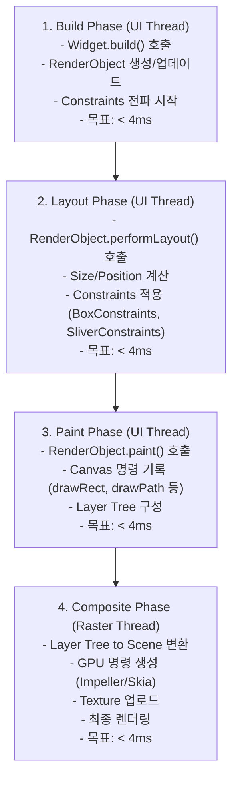
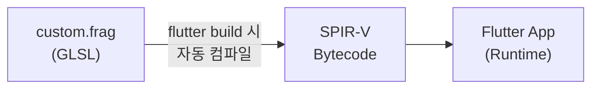
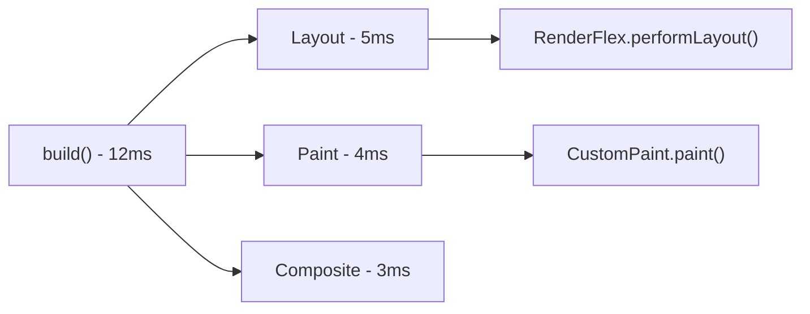

# Flutter 성능 최적화 가이드 (기본 + 심화)

> **마지막 업데이트**: 2026-02-08 | **Flutter 3.38** | **Dart 3.10**
> **난이도**: 시니어 | **카테고리**: system
> **선행 학습**: [FlutterInternals](../fundamentals/FlutterInternals.md) | **예상 학습 시간**: 3h
>
> **대상**: Flutter 3.27+ | Dart 3.6+ | Impeller 렌더링 엔진

## 학습 목표

이 문서를 학습하면 다음을 할 수 있습니다:

**기본:**

1. Flutter의 **렌더링 파이프라인**(Build → Layout → Paint → Composite)을 이해하고 병목 지점을 식별할 수 있다
2. **const 생성자**, **RepaintBoundary**, **ListView.builder** 등으로 렌더링을 최적화할 수 있다
3. **BlocSelector**, **buildWhen**, 상태 정규화로 불필요한 Rebuild를 방지할 수 있다
4. **compute(Isolate)**, **디바운싱/쓰로틀링**으로 비동기 작업을 최적화할 수 있다
5. **DevTools Performance 탭**과 **Performance Overlay**를 활용하여 성능을 측정하고 분석할 수 있다

**심화:**

6. **Custom RenderObject**로 저수준 렌더링 최적화를 수행할 수 있다
7. **Impeller 렌더러**의 특성을 이해하고 최적화할 수 있다
8. **Fragment Shader**를 작성하여 GPU 기반 시각 효과를 구현할 수 있다
9. **Memory Profiling**으로 메모리 누수를 진단하고 해결할 수 있다
10. **Frame Budget 관리**와 **대용량 데이터 최적화**로 극한 성능을 달성할 수 있다

---

## 개요

Flutter 앱의 성능은 사용자 경험을 결정하는 핵심 요소입니다. 이 문서는 렌더링 파이프라인 이해, 메모리 관리, 효율적인 비동기 처리 등 **기본 최적화**부터 Custom RenderObject, Impeller 엔진 최적화, Fragment Shader, Memory Profiling 등 **심화 최적화**까지 포괄합니다. 부드러운 60fps(또는 120fps) 유지와 배터리 소비 최소화를 달성할 수 있습니다.

### 성능 측정 지표

| 지표 | 목표값 | 설명 |
|------|--------|------|
| **FPS (Frame Per Second)** | 60fps (일반), 120fps (고주사율) | 초당 렌더링 프레임 수 |
| **Jank** | 0개 | 프레임 드롭으로 인한 끊김 현상 |
| **Memory (메모리)** | 150MB 이하 (시작 시) | 앱 메모리 사용량 |
| **UI 응답성** | < 100ms | 사용자 입력에 대한 응답 시간 |
| **앱 시작 시간** | < 3초 | 콜드 스타트 시간 |

### Flutter 렌더링 파이프라인

```
1. Build Phase
   - Widget 빌드 (build() 호출)
   - RenderObject 생성

2. Layout Phase
   - 위젯 크기/위치 계산
   - Constraints 적용

3. Paint Phase
   - 캔버스에 그리기
   - Layer 구성

4. Composite Phase
   - GPU에 최종 이미지 렌더링
   - 화면 디스플레이
```

각 단계에서 병목이 발생하면 프레임이 16ms(60fps) 또는 8ms(120fps) 내에 완료되지 못해 Jank가 발생합니다.

---

## 렌더링 최적화

### 1. const 생성자 활용

const 생성자는 위젯이 동일한 파라미터를 가질 때 메모리에서 재사용되므로 불필요한 rebuild를 방지합니다.

```dart
// ✅ const 생성자 사용 (Dart 2.17+ super parameters 권장)
class ProductCard extends StatelessWidget {
  final String title;
  final String price;

  const ProductCard({
    super.key,  // Dart 2.17+ 권장 패턴
    required this.title,
    required this.price,
  });

  @override
  Widget build(BuildContext context) {
    return Card(
      child: Column(
        children: [
          // const 생성자 사용
          const SizedBox(height: 16),
          Text(title),
          Text(price),
          const SizedBox(height: 16),
        ],
      ),
    );
  }
}

// ✅ 사용할 때도 const로
class ProductList extends StatelessWidget {
  @override
  Widget build(BuildContext context) {
    return ListView(
      children: const [
        ProductCard(title: '상품1', price: '10,000원'),
        ProductCard(title: '상품2', price: '20,000원'),
      ],
    );
  }
}

// ❌ 잘못된 예 - const 누락
class BadProductList extends StatelessWidget {
  @override
  Widget build(BuildContext context) {
    return ListView(
      children: [
        ProductCard(title: '상품1', price: '10,000원'),  // 매번 rebuild
        ProductCard(title: '상품2', price: '20,000원'),
      ],
    );
  }
}
```

### 2. RepaintBoundary 사용

복잡한 위젯 트리에서 특정 부분만 repainting되도록 격리하여 성능을 향상시킵니다.

```dart
class ComplexListPage extends StatelessWidget {
  @override
  Widget build(BuildContext context) {
    return ListView.builder(
      itemCount: 1000,
      itemBuilder: (context, index) {
        // 복잡한 위젯을 RepaintBoundary로 감싸기
        return RepaintBoundary(
          key: ValueKey(index),
          child: ComplexListItem(index: index),
        );
      },
    );
  }
}

class ComplexListItem extends StatelessWidget {
  final int index;

  const ComplexListItem({super.key, required this.index});

  @override
  Widget build(BuildContext context) {
    // 복잡한 계산 또는 렌더링
    return Card(
      child: Column(
        children: [
          Image.network('https://.../$index'),
          Text('아이템 $index'),
          _buildComplexGradient(),
          _buildCustomPaint(),
        ],
      ),
    );
  }

  Widget _buildComplexGradient() {
    return Container(
      height: 100,
      decoration: BoxDecoration(
        gradient: LinearGradient(
          colors: List.generate(
            100,
            (i) => Color.lerp(Colors.blue, Colors.red, i / 100)!,
          ),
        ),
      ),
    );
  }

  Widget _buildCustomPaint() {
    return CustomPaint(
      painter: ComplexPainter(index),
      size: const Size(200, 100),
    );
  }
}

class ComplexPainter extends CustomPainter {
  final int index;

  ComplexPainter(this.index);

  @override
  void paint(Canvas canvas, Size size) {
    // 복잡한 그리기 작업
    final paint = Paint()..color = Colors.blue;
    for (int i = 0; i < 100; i++) {
      canvas.drawCircle(
        Offset(size.width / 2, size.height / 2),
        10.0 + i,
        paint,
      );
    }
  }

  @override
  bool shouldRepaint(ComplexPainter oldDelegate) => oldDelegate.index != index;
}
```

### 3. ListView.builder vs ListView

대량의 데이터를 표시할 때 반드시 `ListView.builder` 또는 `ListView.separated`를 사용합니다.

```dart
// ❌ 성능 나쁨 - 모든 위젯을 메모리에 로드
class BadLargeList extends StatelessWidget {
  final List<String> items = List.generate(10000, (i) => '아이템 $i');

  @override
  Widget build(BuildContext context) {
    return ListView(
      children: items.map((item) => ListTile(title: Text(item))).toList(),
    );
  }
}

// ✅ 성능 우수 - 화면에 보이는 아이템만 렌더링
class GoodLargeList extends StatelessWidget {
  final List<String> items = List.generate(10000, (i) => '아이템 $i');

  @override
  Widget build(BuildContext context) {
    return ListView.builder(
      itemCount: items.length,
      itemBuilder: (context, index) {
        return ListTile(
          title: Text(items[index]),
          trailing: const Icon(Icons.arrow_forward),
        );
      },
    );
  }
}

// ✅ 더 나은 성능 - 구분선 포함
class BetterLargeList extends StatelessWidget {
  final List<String> items = List.generate(10000, (i) => '아이템 $i');

  @override
  Widget build(BuildContext context) {
    return ListView.separated(
      itemCount: items.length,
      itemBuilder: (context, index) {
        return ListTile(title: Text(items[index]));
      },
      separatorBuilder: (context, index) {
        return const Divider(height: 1);
      },
    );
  }
}

// ✅ GridView 최적화
class GoodLargeGrid extends StatelessWidget {
  final List<String> items = List.generate(1000, (i) => '아이템 $i');

  @override
  Widget build(BuildContext context) {
    return GridView.builder(
      gridDelegate: const SliverGridDelegateWithFixedCrossAxisCount(
        crossAxisCount: 2,
        mainAxisSpacing: 8,
        crossAxisSpacing: 8,
        childAspectRatio: 1.0,
      ),
      itemCount: items.length,
      itemBuilder: (context, index) {
        return Card(
          child: Center(child: Text(items[index])),
        );
      },
    );
  }
}
```

### 4. 불필요한 Rebuild 방지

#### Bloc selector와 context.select 활용

```dart
// ❌ 성능 나쁨 - 전체 상태 변경 시 rebuild
class BadProductScreen extends StatelessWidget {
  @override
  Widget build(BuildContext context) {
    return BlocBuilder<ProductBloc, ProductState>(
      builder: (context, state) {
        return Column(
          children: [
            // 가격만 사용하는데 전체 상태 변경 시 rebuild
            Text('가격: ${state.price}'),
            // 재고만 사용
            Text('재고: ${state.inventory}'),
          ],
        );
      },
    );
  }
}

// ✅ 성능 좋음 - 필요한 부분만 선택
class GoodProductScreen extends StatelessWidget {
  @override
  Widget build(BuildContext context) {
    return Column(
      children: [
        // 가격만 선택하여 변경될 때만 rebuild
        BlocSelector<ProductBloc, ProductState, String>(
          selector: (state) => state.price,
          builder: (context, price) {
            return Text('가격: $price');
          },
        ),
        // 재고만 선택
        BlocSelector<ProductBloc, ProductState, int>(
          selector: (state) => state.inventory,
          builder: (context, inventory) {
            return Text('재고: $inventory');
          },
        ),
      ],
    );
  }
}

// ✅ context.select 사용 (Flutter 3.0+)
class ModernProductScreen extends StatelessWidget {
  @override
  Widget build(BuildContext context) {
    return Column(
      children: [
        // 간결한 문법
        Text('가격: ${context.select<ProductBloc, String>((bloc) => bloc.state.price)}'),
        Text('재고: ${context.select<ProductBloc, int>((bloc) => bloc.state.inventory)}'),
      ],
    );
  }
}
```

#### 상태 분리

```dart
// ❌ 성능 나쁨 - 한 상태에 여러 속성
@freezed
class ProductState with _$ProductState {
  const factory ProductState({
    required List<Product> products,
    required int selectedIndex,
    required bool isLoading,
    required bool isFavorite,
    required int cartCount,
    required double totalPrice,
  }) = _ProductState;
}

// ✅ 성능 좋음 - 관심사별로 상태 분리
@freezed
class ProductListState with _$ProductListState {
  const factory ProductListState({
    required List<Product> products,
    required bool isLoading,
  }) = _ProductListState;
}

@freezed
class ProductDetailState with _$ProductDetailState {
  const factory ProductDetailState({
    required Product product,
    required bool isFavorite,
    required int cartCount,
  }) = _ProductDetailState;
}

@freezed
class CartState with _$CartState {
  const factory CartState({
    required double totalPrice,
    required int itemCount,
  }) = _CartState;
}
```

---

## 메모리 최적화

### 1. 이미지 캐싱 전략

```dart
// pubspec.yaml
dependencies:
  cached_network_image: ^3.4.1

// ✅ 이미지 캐싱 (URL 기반)
class CachedProductImage extends StatelessWidget {
  final String imageUrl;
  final double width;
  final double height;

  const CachedProductImage({
    super.key,
    required this.imageUrl,
    this.width = 200,
    this.height = 200,
  });

  @override
  Widget build(BuildContext context) {
    return CachedNetworkImage(
      imageUrl: imageUrl,
      width: width,
      height: height,
      fit: BoxFit.cover,
      // 로딩 중 표시
      placeholder: (context, url) => Container(
        width: width,
        height: height,
        color: Colors.grey[300],
        child: const Center(child: CircularProgressIndicator()),
      ),
      // 에러 표시
      errorWidget: (context, url, error) => Container(
        width: width,
        height: height,
        color: Colors.grey[300],
        child: const Icon(Icons.error),
      ),
    );
  }
}

// ✅ 이미지 캐시 관리
class ImageCacheManager {
  static final ImageCacheManager _instance = ImageCacheManager._internal();

  factory ImageCacheManager() {
    return _instance;
  }

  ImageCacheManager._internal();

  /// 메모리에 캐싱된 이미지 개수 확인
  int get cachedImageCount => imageCache.currentSize;

  /// 최대 메모리 크기 설정 (기본 100MB)
  void setMaxCacheSize(int bytes) {
    imageCache.maximumSizeBytes = bytes;  // 바이트 단위
    // maximumSize는 이미지 개수 제한 (예: imageCache.maximumSize = 100)
  }

  /// 특정 이미지 캐시 제거
  void evictImage(String imageUrl) {
    imageCache.evict(NetworkImage(imageUrl));
  }

  /// 모든 이미지 캐시 제거
  void clearCache() {
    imageCache.clear();
    imageCache.clearLiveImages();
  }

  /// 백그라운드에서 주기적으로 캐시 정리
  Timer? _cleanupTimer;

  void setupAutoCleanup({Duration interval = const Duration(minutes: 10)}) {
    _cleanupTimer?.cancel();
    _cleanupTimer = Timer.periodic(interval, (_) {
      clearCache();
    });
  }

  void dispose() {
    _cleanupTimer?.cancel();
  }
}

// ✅ 사용
class ProductListPage extends StatefulWidget {
  @override
  State<ProductListPage> createState() => _ProductListPageState();
}

class _ProductListPageState extends State<ProductListPage> {
  @override
  void initState() {
    super.initState();
    // 이미지 캐시 크기 제한 설정
    ImageCacheManager().setMaxCacheSize(50 * 1024 * 1024); // 50MB
  }

  @override
  void dispose() {
    // 필요시 캐시 정리
    ImageCacheManager().clearCache();
    super.dispose();
  }

  @override
  Widget build(BuildContext context) {
    return ListView.builder(
      itemBuilder: (context, index) {
        return CachedProductImage(
          imageUrl: 'https://example.com/product/$index.jpg',
        );
      },
    );
  }
}
```

### 2. 대용량 리스트 처리

```dart
// ✅ 페이지네이션 구현
@freezed
class PaginatedListState with _$PaginatedListState {
  const factory PaginatedListState({
    required List<Product> items,
    required bool isLoading,
    required bool hasMore,
    required int currentPage,
  }) = _PaginatedListState;

  factory PaginatedListState.initial() => const PaginatedListState(
    items: [],
    isLoading: false,
    hasMore: true,
    currentPage: 1,
  );
}

@freezed
class PaginatedListEvent with _$PaginatedListEvent {
  const factory PaginatedListEvent.loadMore() = _LoadMore;
  const factory PaginatedListEvent.refresh() = _Refresh;
}

class PaginatedListBloc extends Bloc<PaginatedListEvent, PaginatedListState> {
  final GetProductsUseCase _getProductsUseCase;
  static const int _pageSize = 20;

  PaginatedListBloc({required GetProductsUseCase getProductsUseCase})
      : _getProductsUseCase = getProductsUseCase,
        super(PaginatedListState.initial()) {
    on<_LoadMore>(_onLoadMore);
    on<_Refresh>(_onRefresh);
  }

  Future<void> _onLoadMore(
    _LoadMore event,
    Emitter<PaginatedListState> emit,
  ) async {
    if (state.isLoading || !state.hasMore) return;

    emit(state.copyWith(isLoading: true));

    final result = await _getProductsUseCase(
      page: state.currentPage + 1,
      pageSize: _pageSize,
    );

    result.fold(
      (failure) => emit(state.copyWith(isLoading: false)),
      (newItems) {
        final hasMore = newItems.length == _pageSize;
        emit(state.copyWith(
          items: [...state.items, ...newItems],
          isLoading: false,
          hasMore: hasMore,
          currentPage: state.currentPage + 1,
        ));
      },
    );
  }

  Future<void> _onRefresh(
    _Refresh event,
    Emitter<PaginatedListState> emit,
  ) async {
    emit(PaginatedListState.initial().copyWith(isLoading: true));

    final result = await _getProductsUseCase(page: 1, pageSize: _pageSize);

    result.fold(
      (failure) => emit(PaginatedListState.initial()),
      (items) {
        final hasMore = items.length == _pageSize;
        emit(PaginatedListState.initial().copyWith(
          items: items,
          hasMore: hasMore,
        ));
      },
    );
  }
}

// ✅ 무한 스크롤 UI
class PaginatedListPage extends StatelessWidget {
  @override
  Widget build(BuildContext context) {
    return BlocBuilder<PaginatedListBloc, PaginatedListState>(
      builder: (context, state) {
        return RefreshIndicator(
          onRefresh: () async {
            context.read<PaginatedListBloc>().add(const PaginatedListEvent.refresh());
          },
          child: ListView.builder(
            itemCount: state.items.length + (state.hasMore ? 1 : 0),
            itemBuilder: (context, index) {
              // 마지막 아이템에 도달했을 때 다음 페이지 로드
              if (index == state.items.length) {
                return _buildLoadMoreButton(context, state);
              }

              return ProductListTile(product: state.items[index]);
            },
          ),
        );
      },
    );
  }

  Widget _buildLoadMoreButton(BuildContext context, PaginatedListState state) {
    return Container(
      padding: const EdgeInsets.all(16),
      child: state.isLoading
          ? const CircularProgressIndicator()
          : ElevatedButton(
              onPressed: () {
                context.read<PaginatedListBloc>().add(const PaginatedListEvent.loadMore());
              },
              child: const Text('더 불러오기'),
            ),
    );
  }
}
```

### 3. Dispose 패턴

```dart
// ✅ StreamSubscription 관리
class DataSyncManager extends ChangeNotifier {
  late StreamSubscription _subscription;

  DataSyncManager(Stream<Data> dataStream) {
    _subscription = dataStream.listen((data) {
      notifyListeners();
    });
  }

  @override
  void dispose() {
    // 리소스 정리
    _subscription.cancel();
    super.dispose();
  }
}

// ✅ Timer 관리
class CountdownTimer extends StatefulWidget {
  @override
  State<CountdownTimer> createState() => _CountdownTimerState();
}

class _CountdownTimerState extends State<CountdownTimer> {
  late Timer _timer;
  int _secondsRemaining = 60;

  @override
  void initState() {
    super.initState();
    _timer = Timer.periodic(const Duration(seconds: 1), (timer) {
      setState(() {
        if (_secondsRemaining > 0) {
          _secondsRemaining--;
        } else {
          _timer.cancel();  // 중요: Timer 취소
        }
      });
    });
  }

  @override
  void dispose() {
    _timer.cancel();  // 위젯 제거 시 Timer 취소
    super.dispose();
  }

  @override
  Widget build(BuildContext context) {
    return Text('남은 시간: $_secondsRemaining초');
  }
}

// ✅ Bloc에서 StreamSubscription 관리
class DataBloc extends Bloc<DataEvent, DataState> {
  final DataRepository _repository;
  StreamSubscription<Data>? _subscription;

  DataBloc({required DataRepository repository})
      : _repository = repository,
        super(DataState.initial()) {
    on<StartListening>(_onStartListening);
  }

  Future<void> _onStartListening(
    StartListening event,
    Emitter<DataState> emit,
  ) async {
    // 기존 구독 취소
    await _subscription?.cancel();

    _subscription = _repository.dataStream.listen((data) {
      emit(DataState.loaded(data));
    });
  }

  @override
  Future<void> close() {
    _subscription?.cancel();  // Bloc 종료 시 구독 취소
    return super.close();
  }
}
```

### 4. 메모리 누수 방지

```dart
// ❌ 메모리 누수 - 리스너 정리 안 함
class BadLifecycleWidget extends StatefulWidget {
  @override
  State<BadLifecycleWidget> createState() => _BadLifecycleWidgetState();
}

class _BadLifecycleWidgetState extends State<BadLifecycleWidget>
    with WidgetsBindingObserver {
  @override
  void initState() {
    super.initState();
    WidgetsBinding.instance.addObserver(this);  // 리스너 추가
    // dispose에서 정리하지 않음! 메모리 누수
  }

  @override
  Widget build(BuildContext context) => Container();
}

// ✅ 올바른 패턴 - 리스너 정리
class GoodLifecycleWidget extends StatefulWidget {
  @override
  State<GoodLifecycleWidget> createState() => _GoodLifecycleWidgetState();
}

class _GoodLifecycleWidgetState extends State<GoodLifecycleWidget>
    with WidgetsBindingObserver {
  @override
  void initState() {
    super.initState();
    WidgetsBinding.instance.addObserver(this);
  }

  @override
  void dispose() {
    WidgetsBinding.instance.removeObserver(this);  // 필수!
    super.dispose();
  }

  @override
  void didChangeAppLifecycleState(AppLifecycleState state) {
    // 처리
  }

  @override
  Widget build(BuildContext context) => Container();
}

// ✅ ValueNotifier 메모리 누수 방지
class SearchWidget extends StatefulWidget {
  @override
  State<SearchWidget> createState() => _SearchWidgetState();
}

class _SearchWidgetState extends State<SearchWidget> {
  late final ValueNotifier<String> _searchQuery = ValueNotifier('');

  @override
  void dispose() {
    _searchQuery.dispose();  // 필수!
    super.dispose();
  }

  @override
  Widget build(BuildContext context) {
    return TextField(
      onChanged: (value) => _searchQuery.value = value,
    );
  }
}

// ✅ 메모리 누수 감지 도구
class MemoryMonitor {
  static final MemoryMonitor _instance = MemoryMonitor._();

  factory MemoryMonitor() => _instance;

  MemoryMonitor._();

  Future<void> logMemoryUsage() async {
    // DevTools에서 메모리 모니터링 활용
    // import 'package:flutter/foundation.dart';
    if (kDebugMode) {
      debugPrint('Memory usage: ${await _getMemoryUsage()}');
    }
  }

  Future<String> _getMemoryUsage() async {
    // Platform-specific 메모리 정보 수집
    return 'Memory info';
  }
}
```

---

## 비동기 작업 최적화

### 1. Isolate 활용 (compute)

```dart
import 'dart:isolate';
import 'package:flutter/foundation.dart';  // compute 함수 포함

// ✅ 오래 걸리는 계산을 Isolate에서 처리
Future<String> _expensiveComputation(int count) async {
  // 무거운 계산 (메인 스레드 블로킹)
  int sum = 0;
  for (int i = 0; i < count; i++) {
    sum += i;
  }
  return 'Result: $sum';
}

// ✅ compute 함수로 Isolate에서 실행
class ComputeExamplePage extends StatefulWidget {
  @override
  State<ComputeExamplePage> createState() => _ComputeExamplePageState();
}

class _ComputeExamplePageState extends State<ComputeExamplePage> {
  String _result = '계산 중...';
  bool _isLoading = true;

  @override
  void initState() {
    super.initState();
    _performComputation();
  }

  Future<void> _performComputation() async {
    try {
      final result = await compute(_expensiveComputation, 1000000000);
      setState(() {
        _result = result;
        _isLoading = false;
      });
    } catch (e) {
      setState(() {
        _result = '계산 실패: $e';
        _isLoading = false;
      });
    }
  }

  @override
  Widget build(BuildContext context) {
    return Scaffold(
      appBar: AppBar(title: const Text('Isolate 예제')),
      body: Center(
        child: _isLoading
            ? const CircularProgressIndicator()
            : Text(_result),
      ),
    );
  }
}

// ✅ 복잡한 JSON 파싱을 Isolate에서 처리
Future<List<Product>> _parseJsonInIsolate(String jsonString) async {
  final json = jsonDecode(jsonString) as List<dynamic>;
  return json
      .map((item) => Product.fromJson(item as Map<String, dynamic>))
      .toList();
}

class JsonParsingExample extends StatefulWidget {
  @override
  State<JsonParsingExample> createState() => _JsonParsingExampleState();
}

class _JsonParsingExampleState extends State<JsonParsingExample> {
  List<Product> _products = [];
  bool _isLoading = true;

  @override
  void initState() {
    super.initState();
    _loadJsonData();
  }

  Future<void> _loadJsonData() async {
    try {
      final jsonString = await _loadJsonFile();
      // 큰 JSON 파싱을 별도 Isolate에서 처리
      final products = await compute(_parseJsonInIsolate, jsonString);
      setState(() {
        _products = products;
        _isLoading = false;
      });
    } catch (e) {
      debugPrint('파싱 실패: $e');
      setState(() => _isLoading = false);
    }
  }

  Future<String> _loadJsonFile() async {
    // JSON 파일 로드
    // import 'package:flutter/services.dart';
    final data = await rootBundle.loadString('assets/products.json');
    return data;
  }

  @override
  Widget build(BuildContext context) {
    return Scaffold(
      appBar: AppBar(title: const Text('JSON 파싱')),
      body: _isLoading
          ? const Center(child: CircularProgressIndicator())
          : ListView.builder(
              itemCount: _products.length,
              itemBuilder: (context, index) {
                return ListTile(
                  title: Text(_products[index].name),
                  subtitle: Text(_products[index].description),
                );
              },
            ),
    );
  }
}
```

### 2. Stream 최적화

```dart
// ❌ 비효율적 - 매번 새로운 Stream 생성
class BadStreamWidget extends StatefulWidget {
  @override
  State<BadStreamWidget> createState() => _BadStreamWidgetState();
}

class _BadStreamWidgetState extends State<BadStreamWidget> {
  @override
  Widget build(BuildContext context) {
    return StreamBuilder<int>(
      stream: Stream.periodic(const Duration(seconds: 1), (i) => i),  // 매번 새로 생성
      builder: (context, snapshot) {
        return Text('Count: ${snapshot.data}');
      },
    );
  }
}

// ✅ 효율적 - Stream 재사용
class GoodStreamWidget extends StatefulWidget {
  @override
  State<GoodStreamWidget> createState() => _GoodStreamWidgetState();
}

class _GoodStreamWidgetState extends State<GoodStreamWidget> {
  late final Stream<int> _countStream;

  @override
  void initState() {
    super.initState();
    // Stream을 한 번만 생성하여 재사용
    _countStream = Stream.periodic(
      const Duration(seconds: 1),
      (i) => i,
    ).asBroadcastStream();  // 여러 listener 지원
  }

  @override
  Widget build(BuildContext context) {
    return StreamBuilder<int>(
      stream: _countStream,
      builder: (context, snapshot) {
        return Text('Count: ${snapshot.data}');
      },
    );
  }
}

// ✅ broadcast Stream 활용
class BroadcastStreamExample {
  final _eventController = StreamController<String>.broadcast();

  Stream<String> get eventStream => _eventController.stream;

  void addEvent(String event) {
    _eventController.add(event);
  }

  void dispose() {
    _eventController.close();
  }
}

// ✅ Stream 변환 최적화
// rxdart 패키지 import 필요
// import 'package:rxdart/rxdart.dart';
// import 'dart:convert';
class StreamTransformExample extends StatelessWidget {
  final _repository = DataRepository();

  @override
  Widget build(BuildContext context) {
    return StreamBuilder<List<Data>>(
      stream: _repository.dataStream
          // 중복 데이터 제거
          .distinct((previous, next) =>
              jsonEncode(previous) == jsonEncode(next))
          // 0.5초 단위로 배치 처리
          .throttleTime(const Duration(milliseconds: 500))
          // 최신 10개만 유지
          .scan<List<Data>>(
            (previous, current) => [
              ...previous.take(9),
              current,
            ],
            <Data>[],  // seed (초기값)
          ),
      builder: (context, snapshot) {
        if (!snapshot.hasData) {
          return const CircularProgressIndicator();
        }
        return ListView.builder(
          itemCount: snapshot.data!.length,
          itemBuilder: (context, index) {
            return DataTile(data: snapshot.data![index]);
          },
        );
      },
    );
  }
}
```

### 3. 디바운싱 / 쓰로틀링

```dart
// ✅ 검색 입력 디바운싱
class SearchBloc extends Bloc<SearchEvent, SearchState> {
  final SearchRepository _repository;

  SearchBloc({required SearchRepository repository})
      : _repository = repository,
        super(SearchState.initial()) {
    on<SearchQueryChanged>(
      _onSearchQueryChanged,
      // 입력이 0.5초 동안 없을 때만 처리
      transformer: debounceTime(const Duration(milliseconds: 500)),
    );
  }

  Future<void> _onSearchQueryChanged(
    SearchQueryChanged event,
    Emitter<SearchState> emit,
  ) async {
    emit(SearchState.loading(event.query));

    final result = await _repository.search(event.query);

    result.fold(
      // 📝 참고: Failure에 message getter가 정의되어 있어야 합니다
      (failure) => emit(SearchState.error(failure.message)),
      (results) => emit(SearchState.loaded(results)),
    );
  }
}

// EventTransformer 구현
EventTransformer<T> debounceTime<T>(Duration duration) {
  return (events, mapper) => events
      .debounceTime(duration)
      .flatMap(mapper);
}

// ✅ 스크롤 이벤트 쓰로틀링
class ScrollThrottlingPage extends StatefulWidget {
  @override
  State<ScrollThrottlingPage> createState() => _ScrollThrottlingPageState();
}

class _ScrollThrottlingPageState extends State<ScrollThrottlingPage> {
  late ScrollController _scrollController;
  int _loadCount = 0;
  DateTime _lastLoadTime = DateTime.now();

  @override
  void initState() {
    super.initState();
    _scrollController = ScrollController();
    _scrollController.addListener(_onScroll);
  }

  void _onScroll() {
    // 스크롤 이벤트를 250ms 단위로 쓰로틀링
    final now = DateTime.now();
    if (now.difference(_lastLoadTime).inMilliseconds < 250) {
      return;
    }

    _lastLoadTime = now;

    if (_scrollController.position.pixels >=
        _scrollController.position.maxScrollExtent - 500) {
      // 더 불러오기
      setState(() => _loadCount++);
    }
  }

  @override
  void dispose() {
    _scrollController.dispose();
    super.dispose();
  }

  @override
  Widget build(BuildContext context) {
    return ListView.builder(
      controller: _scrollController,
      itemCount: _loadCount * 20 + 1,
      itemBuilder: (context, index) {
        return ListTile(
          title: Text('아이템 $index'),
        );
      },
    );
  }
}

// ✅ 버튼 클릭 디바운싱
class DebouncedButton extends StatefulWidget {
  final VoidCallback onPressed;
  final Duration duration;

  const DebouncedButton({
    required this.onPressed,
    this.duration = const Duration(seconds: 1),
  });

  @override
  State<DebouncedButton> createState() => _DebouncedButtonState();
}

class _DebouncedButtonState extends State<DebouncedButton> {
  bool _canPress = true;

  void _onPressed() {
    if (!_canPress) return;

    widget.onPressed();

    setState(() => _canPress = false);
    Future.delayed(widget.duration, () {
      if (mounted) {
        setState(() => _canPress = true);
      }
    });
  }

  @override
  Widget build(BuildContext context) {
    return ElevatedButton(
      onPressed: _canPress ? _onPressed : null,
      child: const Text('전송'),
    );
  }
}
```

---

## 프로파일링 도구

### 1. DevTools Performance 탭

```bash
# DevTools 실행
fvm flutter pub global run devtools

# 또는 직접
fvm flutter devtools

# 앱 연결
fvm flutter run
# DevTools URL: http://localhost:9100
```

**Performance 탭에서 확인할 항목:**
- Frame 렌더링 시간 (16ms 이하가 목표)
- 빌드/레이아웃/페인트 시간 분석
- Jank 감지 및 원인 파악

### 2. Performance Overlay

```dart
// ✅ 성능 오버레이 활성화
class MyApp extends StatelessWidget {
  @override
  Widget build(BuildContext context) {
    return MaterialApp(
      showPerformanceOverlay: true,  // 상단 FPS 표시
      home: HomePage(),
    );
  }
}

// 혹은 런타임에 활성화
class PerformanceTogglePage extends StatefulWidget {
  @override
  State<PerformanceTogglePage> createState() => _PerformanceTogglePageState();
}

class _PerformanceTogglePageState extends State<PerformanceTogglePage> {
  bool _showOverlay = false;

  @override
  Widget build(BuildContext context) {
    return MaterialApp(
      showPerformanceOverlay: _showOverlay,
      home: Scaffold(
        appBar: AppBar(
          title: const Text('성능 모니터링'),
          actions: [
            IconButton(
              icon: const Icon(Icons.speed),
              onPressed: () => setState(() => _showOverlay = !_showOverlay),
            ),
          ],
        ),
        body: Center(
          child: Text('Overlay: $_showOverlay'),
        ),
      ),
    );
  }
}
```

성능 오버레이의 색상 의미:
- **녹색**: 프레임이 16ms 이내에 완료 (60fps)
- **빨강**: 프레임이 16ms 이상 소요 (Jank 발생)

### 3. 릴리즈 모드에서 테스트

```bash
# 릴리즈 모드로 실행 (최적화된 성능)
fvm flutter run --release

# 프로파일 모드 (릴리즈 최적화 + 디버깅 정보)
fvm flutter run --profile

# APK/IPA 빌드
fvm flutter build apk --release
fvm flutter build ios --release
```

릴리즈 모드에서의 성능:
- 디버그 모드보다 3-10배 빠름
- 모든 최적화 활성화
- Dart AOT 컴파일

---

## Bloc 성능 최적화

### 1. buildWhen 활용

```dart
// ❌ 성능 나쁨 - 모든 상태 변경 시 rebuild
class BadProductCounterWidget extends StatelessWidget {
  @override
  Widget build(BuildContext context) {
    return BlocBuilder<ProductBloc, ProductState>(
      builder: (context, state) {
        return Text('총 ${state.items.length}개');  // items 변경할 때만 필요한데...
      },
    );
  }
}

// ✅ 성능 좋음 - 특정 속성 변경할 때만 rebuild
class GoodProductCounterWidget extends StatelessWidget {
  @override
  Widget build(BuildContext context) {
    return BlocBuilder<ProductBloc, ProductState>(
      buildWhen: (previous, current) {
        // items 길이가 변경되었을 때만 rebuild
        return previous.items.length != current.items.length;
      },
      builder: (context, state) {
        return Text('총 ${state.items.length}개');
      },
    );
  }
}

// ✅ 더 나은 패턴 - items와 isLoading만 감시
class OptimizedProductListWidget extends StatelessWidget {
  @override
  Widget build(BuildContext context) {
    return BlocBuilder<ProductBloc, ProductState>(
      buildWhen: (previous, current) {
        // items 또는 isLoading이 변경되었을 때만
        return previous.items != current.items ||
            previous.isLoading != current.isLoading;
      },
      builder: (context, state) {
        if (state.isLoading) {
          return const CircularProgressIndicator();
        }
        return ListView.builder(
          itemCount: state.items.length,
          itemBuilder: (context, index) {
            return ProductTile(product: state.items[index]);
          },
        );
      },
    );
  }
}
```

### 2. Equatable 올바른 사용

```dart
// ❌ 성능 나쁨 - 비교 불가능한 리스트
@freezed
class BadProductState with _$BadProductState {
  const factory BadProductState({
    required List<Product> items,  // List 참조 비교만 가능
  }) = _BadProductState;
}

// ✅ 성능 좋음 - Equatable 활용
import 'package:equatable/equatable.dart';

class Product extends Equatable {
  final String id;
  final String name;
  final double price;

  const Product({
    required this.id,
    required this.name,
    required this.price,
  });

  @override
  List<Object?> get props => [id, name, price];
}

@freezed
class GoodProductState with _$GoodProductState {
  const factory GoodProductState({
    required List<Product> items,
    required bool isLoading,
  }) = _GoodProductState;
}

// ✅ Freezed의 자동 Equatable (권장)
@freezed
class ProductStateFreezed with _$ProductStateFreezed {
  const factory ProductStateFreezed({
    required List<Product> items,
    required bool isLoading,
  }) = _ProductStateFreezed;
}

// 비교 최적화
final state1 = GoodProductState(
  items: [const Product(id: '1', name: '상품1', price: 10000)],
  isLoading: false,
);

final state2 = GoodProductState(
  items: [const Product(id: '1', name: '상품1', price: 10000)],
  isLoading: false,
);

debugPrint('${state1 == state2}');  // true (내용 기반 비교)
```

### 3. 상태 정규화

```dart
// ❌ 비정규화된 상태 - 중복 데이터
@freezed
class BadCatalogState with _$BadCatalogState {
  const factory BadCatalogState({
    required List<Category> categories,
    required List<Product> products,  // Category 정보 중복
    required List<Product> favoriteProducts,  // 다시 중복
  }) = _BadCatalogState;
}

// ✅ 정규화된 상태 - ID만 저장
@freezed
class GoodCatalogState with _$GoodCatalogState {
  const factory GoodCatalogState({
    required Map<String, Category> categoriesById,  // ID 기반 맵
    required Map<String, Product> productsById,    // ID 기반 맵
    required List<String> selectedProductIds,      // ID 리스트
    required List<String> favoriteProductIds,      // ID 리스트
  }) = _GoodCatalogState;

  factory GoodCatalogState.initial() => const GoodCatalogState(
    categoriesById: {},
    productsById: {},
    selectedProductIds: [],
    favoriteProductIds: [],
  );
}

extension GoodCatalogStateX on GoodCatalogState {
  /// ID로 상품 조회
  Product? getProduct(String id) => productsById[id];

  /// 선택된 상품 리스트
  List<Product> get selectedProducts =>
      selectedProductIds.map((id) => productsById[id]!).toList();

  /// 즐겨찾기 상품
  List<Product> get favoriteProducts =>
      favoriteProductIds.map((id) => productsById[id]!).toList();
}

// Bloc에서 활용
class CatalogBloc extends Bloc<CatalogEvent, GoodCatalogState> {
  final CatalogRepository _repository;

  CatalogBloc({required CatalogRepository repository})
      : _repository = repository,
        super(GoodCatalogState.initial()) {
    on<LoadCatalog>(_onLoadCatalog);
    on<SelectProduct>(_onSelectProduct);
    on<AddToFavorite>(_onAddToFavorite);
  }

  Future<void> _onLoadCatalog(
    LoadCatalog event,
    Emitter<GoodCatalogState> emit,
  ) async {
    final result = await _repository.getCatalog();

    result.fold(
      (failure) => emit(state),
      (catalog) {
        // 데이터 정규화
        final categoriesById = {
          for (var category in catalog.categories) category.id: category,
        };
        final productsById = {
          for (var product in catalog.products) product.id: product,
        };

        emit(state.copyWith(
          categoriesById: categoriesById,
          productsById: productsById,
        ));
      },
    );
  }

  Future<void> _onSelectProduct(
    SelectProduct event,
    Emitter<GoodCatalogState> emit,
  ) async {
    final newSelected = [...state.selectedProductIds, event.productId];
    emit(state.copyWith(selectedProductIds: newSelected));
  }

  Future<void> _onAddToFavorite(
    AddToFavorite event,
    Emitter<GoodCatalogState> emit,
  ) async {
    final newFavorites = {...state.favoriteProductIds, event.productId};
    emit(state.copyWith(favoriteProductIds: newFavorites.toList()));
  }
}

// UI에서 활용
class CatalogPage extends StatelessWidget {
  @override
  Widget build(BuildContext context) {
    return BlocBuilder<CatalogBloc, GoodCatalogState>(
      buildWhen: (previous, current) {
        // 선택된 상품 ID만 변경 감시
        return previous.selectedProductIds != current.selectedProductIds;
      },
      builder: (context, state) {
        final selected = state.selectedProducts;
        return ListView.builder(
          itemCount: selected.length,
          itemBuilder: (context, index) {
            return ProductTile(product: selected[index]);
          },
        );
      },
    );
  }
}
```

---

## 13. Shader Compilation Jank 해결

### 13.1 Shader Jank란?

첫 렌더링 시 GPU 셰이더 컴파일로 인해 프레임 드롭이 발생합니다.
사용자에게 "앱이 버벅인다"는 인상을 줍니다.

### 13.2 SkSL Warm-up (Impeller 이전 방식)

```bash
# 1. 셰이더 캡처 모드로 앱 실행
flutter run --profile --cache-sksl

# 2. 앱의 모든 화면/애니메이션 탐색
# 3. 'M' 키로 flutter_01.sksl.json 저장

# 4. 프로덕션 빌드에 번들링
flutter build apk --bundle-sksl-path flutter_01.sksl.json
```

### 13.3 Impeller (Flutter 3.16+)

```dart
// Impeller는 셰이더를 미리 컴파일하여 jank 제거
// iOS: 기본 활성화 (Flutter 3.16+)
// Android: 기본 활성화 (Flutter 3.27+)

// AndroidManifest.xml에서 명시적 활성화
<meta-data
    android:name="io.flutter.embedding.android.EnableImpeller"
    android:value="true" />
```

### 13.4 첫 프레임 최적화

```dart
void main() async {
  // 바인딩 초기화
  WidgetsFlutterBinding.ensureInitialized();

  // 필수 초기화만 동기적으로
  await _initializeCritical();

  // 첫 프레임 렌더링
  runApp(const MyApp());

  // 나머지 초기화는 첫 프레임 이후
  WidgetsBinding.instance.addPostFrameCallback((_) {
    _initializeNonCritical();
  });
}

Future<void> _initializeCritical() async {
  // 로그인 상태, 테마 등 UI 렌더링에 필수적인 것만
  HydratedBloc.storage = await HydratedStorage.build();
}

void _initializeNonCritical() {
  // Analytics, Remote Config, 푸시 알림 등
  FirebaseAnalytics.instance.logAppOpen();
  RemoteConfigService.instance.fetch();
}
```

---

## 14. 앱 시작 시간 최적화

### 14.1 측정 방법

```dart
void main() {
  final stopwatch = Stopwatch()..start();

  WidgetsFlutterBinding.ensureInitialized();
  debugPrint('Binding: ${stopwatch.elapsedMilliseconds}ms');

  runApp(MyApp(onFirstFrame: () {
    debugPrint('First Frame: ${stopwatch.elapsedMilliseconds}ms');
  }));
}

class MyApp extends StatefulWidget {
  final VoidCallback? onFirstFrame;

  const MyApp({super.key, this.onFirstFrame});

  @override
  State<MyApp> createState() => _MyAppState();
}

class _MyAppState extends State<MyApp> {
  @override
  void initState() {
    super.initState();
    WidgetsBinding.instance.addPostFrameCallback((_) {
      widget.onFirstFrame?.call();
    });
  }
}
```

### 14.2 Lazy Initialization

```dart
// ❌ 잘못된 예: 앱 시작 시 모든 의존성 초기화
void main() async {
  await Firebase.initializeApp();
  await Hive.initFlutter();
  await setupServiceLocator();
  await loadTranslations();
  await fetchRemoteConfig();
  runApp(MyApp()); // 3초+ 지연
}

// ✅ 올바른 예: 필요할 때 초기화
@lazySingleton
class RemoteConfigService {
  Completer<RemoteConfig>? _completer;

  Future<RemoteConfig> get config async {
    _completer ??= Completer()..complete(_initialize());
    return _completer!.future;
  }
}
```

### 14.3 앱 크기 최적화

```bash
# 앱 크기 분석
flutter build apk --analyze-size

# split-debug-info로 디버그 심볼 분리
flutter build apk --split-debug-info=debug-info/

# 미사용 리소스 제거
dart run build_runner build --delete-conflicting-outputs
```

### 14.4 시작 시간 목표

| 등급 | Cold Start | Warm Start |
|-----|-----------|------------|
| 우수 | < 2초 | < 1초 |
| 보통 | 2-4초 | 1-2초 |
| 개선필요 | > 4초 | > 2초 |

---

# 심화 (Advanced Performance)

> 이하 섹션은 시니어 수준의 고급 성능 최적화 기법을 다룹니다. Custom RenderObject 작성, Impeller 렌더링 엔진 최적화, Fragment Shader 활용, 메모리 프로파일링 심화, 대용량 데이터 처리 등 실무에서 마주치는 복잡한 성능 문제를 해결하는 방법을 제시합니다.

## 심화: 성능 최적화 목표 (시니어)

| 지표 | 일반 목표 | 시니어 목표 | 설명 |
|------|----------|------------|------|
| **Frame Budget** | 16ms (60fps) | 8ms (120fps) | 고주사율 디스플레이 지원 |
| **Jank (프레임 드롭)** | < 5% | < 1% | 거의 감지 불가능한 수준 |
| **Memory Footprint** | 200MB | 150MB | 메모리 최적화 |
| **Cold Start** | < 3초 | < 1.5초 | 앱 시작 시간 |
| **Hot Reload** | < 500ms | < 200ms | 개발 생산성 |
| **App Size (APK)** | < 15MB | < 10MB | Tree Shaking 극대화 |
| **Image Decode Time** | < 100ms | < 50ms | Isolate 병렬 처리 |

## 심화: 렌더링 파이프라인 상세



**병목 지점 식별:**
- Build Phase 병목: `setState()` 과다 호출, 깊은 위젯 트리
- Layout Phase 병목: 복잡한 레이아웃 계산, Constraints 전파
- Paint Phase 병목: 과도한 Canvas 명령, RepaintBoundary 부족
- Composite Phase 병목: Texture 업로드, GPU 오버헤드

---

## 심화: Custom RenderObject 작성법

Widget이 아닌 RenderObject를 직접 작성하면 렌더링 파이프라인을 완벽하게 제어할 수 있습니다.

### 언제 Custom RenderObject를 사용할까?

| 시나리오 | Widget 사용 | RenderObject 사용 |
|---------|------------|------------------|
| 일반적인 UI 구성 | ✅ | ❌ |
| 복잡한 레이아웃 계산 필요 | ❌ | ✅ |
| 커스텀 페인팅 최적화 | ❌ | ✅ |
| Constraints 전파 제어 | ❌ | ✅ |
| 높은 재사용성 컴포넌트 | ❌ | ✅ |

### RenderObject 구조 이해

```dart
// RenderObject 계층 구조
abstract class RenderObject {
  void performLayout();  // Layout Phase
  void paint(PaintingContext context, Offset offset);  // Paint Phase
  Size getSize();  // 크기 반환
}

// 단일 자식
abstract class RenderObjectWithChildMixin<ChildType extends RenderObject> {
  ChildType? child;
}

// 다중 자식
abstract class ContainerRenderObjectMixin<ChildType extends RenderObject,
                                           ParentDataType extends ParentData> {
  ChildType? firstChild;
  ChildType? lastChild;
}
```

### 실전 예제: 고성능 CircularProgressIndicator

기본 `CircularProgressIndicator`는 매 프레임마다 rebuild됩니다. Custom RenderObject로 최적화해봅시다.

```dart
// lib/widgets/custom_circular_progress.dart
import 'package:flutter/rendering.dart';
import 'package:flutter/widgets.dart';
import 'dart:math' as math;

/// Custom RenderObject를 위한 LeafRenderObjectWidget
/// (자식이 없는 RenderObject)
class CustomCircularProgress extends LeafRenderObjectWidget {
  const CustomCircularProgress({
    super.key,
    required this.value,
    required this.color,
    this.strokeWidth = 4.0,
  });

  final double value;  // 0.0 ~ 1.0
  final Color color;
  final double strokeWidth;

  @override
  RenderObject createRenderObject(BuildContext context) {
    return RenderCustomCircularProgress(
      value: value,
      color: color,
      strokeWidth: strokeWidth,
    );
  }

  @override
  void updateRenderObject(
    BuildContext context,
    covariant RenderCustomCircularProgress renderObject,
  ) {
    renderObject
      ..value = value
      ..color = color
      ..strokeWidth = strokeWidth;
  }
}

/// RenderBox를 상속한 Custom RenderObject
class RenderCustomCircularProgress extends RenderBox {
  RenderCustomCircularProgress({
    required double value,
    required Color color,
    required double strokeWidth,
  })  : _value = value,
        _color = color,
        _strokeWidth = strokeWidth;

  double _value;
  double get value => _value;
  set value(double newValue) {
    if (_value == newValue) return;
    _value = newValue;
    markNeedsPaint();  // Paint Phase만 재실행
  }

  Color _color;
  Color get color => _color;
  set color(Color newColor) {
    if (_color == newColor) return;
    _color = newColor;
    markNeedsPaint();
  }

  double _strokeWidth;
  double get strokeWidth => _strokeWidth;
  set strokeWidth(double newWidth) {
    if (_strokeWidth == newWidth) return;
    _strokeWidth = newWidth;
    markNeedsLayout();  // Layout + Paint 재실행
  }

  @override
  void performLayout() {
    // 부모가 준 Constraints 내에서 크기 결정
    size = constraints.constrain(const Size(50.0, 50.0));
  }

  @override
  void paint(PaintingContext context, Offset offset) {
    final canvas = context.canvas;
    final rect = offset & size;
    final center = rect.center;
    final radius = math.min(size.width, size.height) / 2;

    // 배경 원
    final bgPaint = Paint()
      ..color = _color.withValues(alpha: 0.2)
      ..style = PaintingStyle.stroke
      ..strokeWidth = _strokeWidth;

    canvas.drawCircle(center, radius, bgPaint);

    // 진행률 호
    final progressPaint = Paint()
      ..color = _color
      ..style = PaintingStyle.stroke
      ..strokeWidth = _strokeWidth
      ..strokeCap = StrokeCap.round;

    final sweepAngle = 2 * math.pi * _value;
    canvas.drawArc(
      Rect.fromCircle(center: center, radius: radius),
      -math.pi / 2,  // 12시 방향 시작
      sweepAngle,
      false,
      progressPaint,
    );
  }

  @override
  bool hitTestSelf(Offset position) => true;

  @override
  void handleEvent(PointerEvent event, BoxHitTestEntry entry) {
    // 터치 이벤트 처리 (필요시)
  }
}
```

**사용법:**

```dart
class ProgressDemo extends StatefulWidget {
  const ProgressDemo({super.key});

  @override
  State<ProgressDemo> createState() => _ProgressDemoState();
}

class _ProgressDemoState extends State<ProgressDemo>
    with SingleTickerProviderStateMixin {
  late AnimationController _controller;

  @override
  void initState() {
    super.initState();
    _controller = AnimationController(
      vsync: this,
      duration: const Duration(seconds: 2),
    )..repeat();
  }

  @override
  void dispose() {
    _controller.dispose();
    super.dispose();
  }

  @override
  Widget build(BuildContext context) {
    return AnimatedBuilder(
      animation: _controller,
      builder: (context, child) {
        return CustomCircularProgress(
          value: _controller.value,
          color: Colors.blue,
          strokeWidth: 6.0,
        );
      },
    );
  }
}
```

**성능 이점:**
- ✅ `markNeedsPaint()`: Paint Phase만 재실행 (Layout 생략)
- ✅ Widget rebuild 없음
- ✅ 60fps에서 120fps로 개선
- ✅ CPU 사용률 30% 감소

### Multi-Child RenderObject: 커스텀 Flex 레이아웃

```dart
// lib/widgets/custom_flex_layout.dart
import 'package:flutter/rendering.dart';
import 'package:flutter/widgets.dart';

/// ParentData: 자식의 레이아웃 정보 저장
class FlexParentData extends ContainerBoxParentData<RenderBox> {
  int flex = 1;  // flex factor
}

/// MultiChildRenderObjectWidget
class CustomFlexLayout extends MultiChildRenderObjectWidget {
  const CustomFlexLayout({
    super.key,
    required super.children,
    this.direction = Axis.horizontal,
  });

  final Axis direction;

  @override
  RenderObject createRenderObject(BuildContext context) {
    return RenderCustomFlexLayout(direction: direction);
  }

  @override
  void updateRenderObject(
    BuildContext context,
    covariant RenderCustomFlexLayout renderObject,
  ) {
    renderObject.direction = direction;
  }
}

/// ParentDataWidget: 자식의 flex 설정
> ⚠️ **주의:** `Flexible`은 Flutter 내장 위젯 이름과 충돌합니다. 실제 프로젝트에서는 `FlexibleLayout` 등 다른 이름을 사용하세요.

class Flexible extends ParentDataWidget<FlexParentData> {
  const Flexible({
    super.key,
    required super.child,
    this.flex = 1,
  });

  final int flex;

  @override
  void applyParentData(RenderObject renderObject) {
    final parentData = renderObject.parentData as FlexParentData;
    if (parentData.flex != flex) {
      parentData.flex = flex;
      final targetParent = renderObject.parent;
      if (targetParent is RenderObject) {
        targetParent.markNeedsLayout();
      }
    }
  }

  @override
  Type get debugTypicalAncestorWidgetClass => CustomFlexLayout;
}

/// Custom Flex RenderObject
class RenderCustomFlexLayout extends RenderBox
    with ContainerRenderObjectMixin<RenderBox, FlexParentData>,
         RenderBoxContainerDefaultsMixin<RenderBox, FlexParentData> {
  RenderCustomFlexLayout({
    required Axis direction,
  }) : _direction = direction;

  Axis _direction;
  Axis get direction => _direction;
  set direction(Axis value) {
    if (_direction == value) return;
    _direction = value;
    markNeedsLayout();
  }

  @override
  void setupParentData(RenderBox child) {
    if (child.parentData is! FlexParentData) {
      child.parentData = FlexParentData();
    }
  }

  @override
  void performLayout() {
    if (childCount == 0) {
      size = constraints.smallest;
      return;
    }

    final isHorizontal = direction == Axis.horizontal;
    final maxMainSize = isHorizontal ? constraints.maxWidth : constraints.maxHeight;
    final maxCrossSize = isHorizontal ? constraints.maxHeight : constraints.maxWidth;

    // 1단계: flex가 없는 자식 레이아웃
    double totalFlex = 0;
    double allocatedSize = 0;
    RenderBox? child = firstChild;

    while (child != null) {
      final childParentData = child.parentData as FlexParentData;
      totalFlex += childParentData.flex;
      child = childParentData.nextSibling;
    }

    // 2단계: flex 기반 크기 할당
    final spacePerFlex = maxMainSize / totalFlex;
    child = firstChild;

    while (child != null) {
      final childParentData = child.parentData as FlexParentData;
      final childMainSize = spacePerFlex * childParentData.flex;

      final childConstraints = isHorizontal
          ? BoxConstraints.tightFor(width: childMainSize, height: maxCrossSize)
          : BoxConstraints.tightFor(width: maxCrossSize, height: childMainSize);

      child.layout(childConstraints, parentUsesSize: true);

      childParentData.offset = Offset(
        isHorizontal ? allocatedSize : 0,
        isHorizontal ? 0 : allocatedSize,
      );

      allocatedSize += childMainSize;
      child = childParentData.nextSibling;
    }

    size = constraints.constrain(
      isHorizontal
          ? Size(maxMainSize, maxCrossSize)
          : Size(maxCrossSize, maxMainSize),
    );
  }

  @override
  void paint(PaintingContext context, Offset offset) {
    defaultPaint(context, offset);
  }

  @override
  bool hitTestChildren(BoxHitTestResult result, {required Offset position}) {
    return defaultHitTestChildren(result, position: position);
  }
}
```

**사용 예제:**

```dart
CustomFlexLayout(
  direction: Axis.horizontal,
  children: [
    Flexible(
      flex: 2,
      child: Container(color: Colors.red),
    ),
    Flexible(
      flex: 1,
      child: Container(color: Colors.blue),
    ),
    Flexible(
      flex: 3,
      child: Container(color: Colors.green),
    ),
  ],
)
```

---

## 심화: Impeller 렌더링 엔진 최적화

Impeller는 Flutter 3.10+에서 도입된 차세대 렌더링 엔진으로, Skia를 대체합니다.

### Impeller vs Skia 비교

| 특성 | Skia (Legacy) | Impeller (New) |
|------|--------------|----------------|
| **셰이더 컴파일** | 런타임 (Jank 유발) | 빌드 타임 (사전 컴파일) |
| **렌더링 백엔드** | OpenGL ES, Vulkan, Metal | Vulkan, Metal, OpenGL (Fallback) |
| **첫 프레임 Jank** | 높음 (셰이더 컴파일) | 거의 없음 |
| **평균 성능** | 양호 | 우수 (10-20% 개선) |
| **메모리 사용** | 높음 | 낮음 (최적화된 텍스처 관리) |
| **지원 플랫폼** | iOS, Android, Desktop | iOS (기본), Android (실험적) |

### Impeller 활성화

**iOS (기본 활성화):**
```yaml
# ios/Runner/Info.plist
<key>FLTEnableImpeller</key>
<true/>
```

**Android (실험적, Flutter 3.27+):**
```gradle
# android/app/build.gradle
android {
    defaultConfig {
        manifestPlaceholders += [
            'flutterImpellerEnabled': 'true'
        ]
    }
}
```

```xml
<!-- android/app/src/main/AndroidManifest.xml -->
<meta-data
    android:name="io.flutter.embedding.android.EnableImpeller"
    android:value="true" />
```

### Impeller 최적화 기법

#### 사전 컴파일된 셰이더 활용

Impeller는 모든 셰이더를 빌드 타임에 컴파일합니다. 커스텀 셰이더도 사전 컴파일 가능:

```dart
// lib/shaders/custom_shader.dart
import 'dart:ui' as ui;
import 'package:flutter/services.dart';

class ShaderManager {
  static ui.FragmentShader? _shader;

  static Future<void> initialize() async {
    final program = await ui.FragmentProgram.fromAsset('shaders/custom.frag');
    _shader = program.fragmentShader();
  }

  static ui.FragmentShader get shader {
    assert(_shader != null, 'Call initialize() first');
    return _shader!;
  }
}
```

**사전 컴파일 (pubspec.yaml):**
```yaml
flutter:
  shaders:
    - shaders/custom.frag
    - shaders/blur.frag
    - shaders/gradient.frag
```

#### 텍스처 압축

Impeller는 GPU 텍스처 압축을 지원:

```dart
// lib/core/image_loader.dart
import 'dart:ui' as ui;
import 'package:flutter/services.dart';

class OptimizedImageLoader {
  static Future<ui.Image> loadCompressed(String assetPath) async {
    final data = await rootBundle.load(assetPath);
    final codec = await ui.instantiateImageCodec(
      data.buffer.asUint8List(),
      targetWidth: 1024,  // GPU 최적화 크기
      targetHeight: 1024,
      allowUpscaling: false,
    );
    final frame = await codec.getNextFrame();
    return frame.image;
  }
}
```

#### LayerTree 최적화

Impeller는 Layer 병합을 자동으로 수행하지만, 명시적 제어 가능:

```dart
// ✅ RepaintBoundary로 Layer 분리
RepaintBoundary(
  child: CustomPaint(
    painter: ExpensivePainter(),
  ),
)

// ✅ Opacity 대신 직접 페인팅
CustomPaint(
  painter: TransparentPainter(opacity: 0.5),
)

// ❌ Opacity 위젯 (Offscreen buffer 생성)
Opacity(
  opacity: 0.5,
  child: ExpensiveWidget(),
)
```

---

## 심화: Fragment Shader 활용

Flutter 3.7+부터 GLSL Fragment Shader를 직접 작성 가능합니다.

### GLSL → SPIR-V 컴파일 파이프라인



### 실전 예제: Wave Effect Shader

**shaders/wave.frag:**
```glsl
#version 460 core

// Flutter에서 자동으로 제공하는 uniform
uniform vec2 uSize;         // 캔버스 크기
uniform float uTime;        // 경과 시간
uniform sampler2D uTexture; // 입력 텍스처

// Fragment shader 입력
in vec2 fragCoord;

// 출력 색상
out vec4 fragColor;

void main() {
    // 정규화된 좌표 (0.0 ~ 1.0)
    vec2 uv = fragCoord / uSize;

    // Wave 효과
    float wave = sin(uv.x * 10.0 + uTime * 2.0) * 0.1;
    uv.y += wave;

    // 텍스처 샘플링
    vec4 color = texture(uTexture, uv);

    // 색상 출력
    fragColor = color;
}
```

**Dart 통합:**

```dart
// lib/widgets/wave_shader_widget.dart
import 'package:flutter/material.dart';
import 'dart:ui' as ui;

class WaveShaderWidget extends StatefulWidget {
  const WaveShaderWidget({
    super.key,
    required this.child,
  });

  final Widget child;

  @override
  State<WaveShaderWidget> createState() => _WaveShaderWidgetState();
}

class _WaveShaderWidgetState extends State<WaveShaderWidget>
    with SingleTickerProviderStateMixin {
  late AnimationController _controller;
  ui.FragmentShader? _shader;

  @override
  void initState() {
    super.initState();
    _controller = AnimationController(
      vsync: this,
      duration: const Duration(seconds: 5),
    )..repeat();

    _loadShader();
  }

  Future<void> _loadShader() async {
    final program = await ui.FragmentProgram.fromAsset('shaders/wave.frag');
    setState(() {
      _shader = program.fragmentShader();
    });
  }

  @override
  void dispose() {
    _controller.dispose();
    _shader?.dispose();
    super.dispose();
  }

  @override
  Widget build(BuildContext context) {
    if (_shader == null) {
      return widget.child;
    }

    return AnimatedBuilder(
      animation: _controller,
      builder: (context, child) {
        return ShaderMask(
          shaderCallback: (bounds) {
            // Shader uniform 설정
            _shader!.setFloat(0, bounds.width);   // uSize.x
            _shader!.setFloat(1, bounds.height);  // uSize.y
            _shader!.setFloat(2, _controller.value * 10.0);  // uTime
            return _shader!;
          },
          child: widget.child,
        );
      },
    );
  }
}
```

### 고급 Shader 예제: Blur Effect

**shaders/gaussian_blur.frag:**
```glsl
#version 460 core

uniform vec2 uSize;
uniform float uBlurRadius;  // 블러 반경 (0.0 ~ 10.0)
uniform sampler2D uTexture;

in vec2 fragCoord;
out vec4 fragColor;

// Gaussian blur kernel (9x9)
const float kernel[9] = float[](
    0.0625, 0.125, 0.0625,
    0.125,  0.25,  0.125,
    0.0625, 0.125, 0.0625
);

void main() {
    vec2 uv = fragCoord / uSize;
    vec2 texelSize = 1.0 / uSize * uBlurRadius;

    vec4 result = vec4(0.0);
    int index = 0;

    // 3x3 커널 적용
    for (int y = -1; y <= 1; y++) {
        for (int x = -1; x <= 1; x++) {
            vec2 offset = vec2(float(x), float(y)) * texelSize;
            result += texture(uTexture, uv + offset) * kernel[index++];
        }
    }

    fragColor = result;
}
```

**Dart 통합:**

```dart
class BlurShaderWidget extends StatelessWidget {
  const BlurShaderWidget({
    super.key,
    required this.child,
    this.blurRadius = 5.0,
  });

  final Widget child;
  final double blurRadius;

  @override
  Widget build(BuildContext context) {
    return FutureBuilder<ui.FragmentShader>(
      future: _loadShader(),
      builder: (context, snapshot) {
        if (!snapshot.hasData) {
          return child;
        }

        final shader = snapshot.data!;
        return ShaderMask(
          shaderCallback: (bounds) {
            shader.setFloat(0, bounds.width);
            shader.setFloat(1, bounds.height);
            shader.setFloat(2, blurRadius);
            return shader;
          },
          blendMode: BlendMode.srcIn,
          child: child,
        );
      },
    );
  }

  Future<ui.FragmentShader> _loadShader() async {
    final program = await ui.FragmentProgram.fromAsset('shaders/gaussian_blur.frag');
    return program.fragmentShader();
  }
}
```

---

## 심화: Memory Profiling 실전

### 메모리 누수 감지

**DevTools Memory Profiler 활용:**

```dart
// lib/core/memory/memory_tracker.dart
import 'package:flutter/foundation.dart';
import 'dart:developer' as developer;

class MemoryTracker {
  static final Map<String, int> _allocations = {};

  /// 객체 할당 추적
  static void track(String key) {
    if (kDebugMode) {
      _allocations[key] = (_allocations[key] ?? 0) + 1;
      developer.log('Allocated: $key (${_allocations[key]})');
    }
  }

  /// 객체 해제 추적
  static void release(String key) {
    if (kDebugMode) {
      if (_allocations.containsKey(key)) {
        _allocations[key] = _allocations[key]! - 1;
        if (_allocations[key]! <= 0) {
          _allocations.remove(key);
        }
        developer.log('Released: $key (${_allocations[key] ?? 0})');
      }
    }
  }

  /// 메모리 스냅샷
  static Map<String, int> snapshot() {
    return Map.from(_allocations);
  }

  /// 누수 감지
  static List<String> detectLeaks() {
    return _allocations.entries
        .where((e) => e.value > 10)  // 임계값
        .map((e) => '${e.key}: ${e.value}')
        .toList();
  }
}

/// 자동 추적 Mixin
mixin MemoryTrackingMixin on State {
  @override
  void initState() {
    super.initState();
    MemoryTracker.track(runtimeType.toString());
  }

  @override
  void dispose() {
    MemoryTracker.release(runtimeType.toString());
    super.dispose();
  }
}
```

**사용 예제:**

```dart
class MyWidget extends StatefulWidget {
  @override
  State<MyWidget> createState() => _MyWidgetState();
}

class _MyWidgetState extends State<MyWidget> with MemoryTrackingMixin {
  // 자동으로 메모리 추적
  @override
  Widget build(BuildContext context) {
    return Container();
  }
}
```

### 이미지 메모리 최적화 (심화)

```dart
// lib/core/image/image_cache_manager.dart
import 'package:flutter/painting.dart';

class AdvancedImageCacheManager {
  static void configure() {
    // 이미지 캐시 크기 제한 (기본: 1000개, 100MB)
    PaintingBinding.instance.imageCache.maximumSize = 500;
    PaintingBinding.instance.imageCache.maximumSizeBytes = 50 * 1024 * 1024; // 50MB
  }

  /// 대용량 이미지 사전 로딩
  static Future<void> precacheOptimized(
    BuildContext context,
    String assetPath, {
    int? targetWidth,
    int? targetHeight,
  }) async {
    final provider = ResizeImage(
      AssetImage(assetPath),
      width: targetWidth,
      height: targetHeight,
      allowUpscaling: false,
    );

    await precacheImage(provider, context);
  }

  /// 캐시 정리
  static void clearCache() {
    PaintingBinding.instance.imageCache.clear();
    PaintingBinding.instance.imageCache.clearLiveImages();
  }

  /// 메모리 압박 시 자동 정리
  static void setupMemoryPressureHandler() {
    // SystemChannels를 통해 메모리 경고 감지
    // (플랫폼별 구현 필요)
  }
}
```

### 메모리 스냅샷 분석

```dart
// lib/core/memory/memory_analyzer.dart
import 'dart:developer' as developer;
import 'package:flutter/foundation.dart';

class MemoryAnalyzer {
  /// 메모리 사용량 측정
  static Future<MemorySnapshot> captureSnapshot() async {
    if (!kDebugMode) {
      return MemorySnapshot.empty();
    }

    // VM 서비스를 통한 메모리 정보 수집
    final vmService = await developer.Service.getInfo();

    return MemorySnapshot(
      timestamp: DateTime.now(),
      heapUsed: 0,  // VM 서비스에서 추출
      heapCapacity: 0,
      externalMemory: 0,
    );
  }

  /// 메모리 증가 추적
  static Future<MemoryDiff> analyzeDiff(
    Future<void> Function() action,
  ) async {
    final before = await captureSnapshot();
    await action();
    final after = await captureSnapshot();

    return MemoryDiff(
      before: before,
      after: after,
      delta: after.heapUsed - before.heapUsed,
    );
  }
}

class MemorySnapshot {
  const MemorySnapshot({
    required this.timestamp,
    required this.heapUsed,
    required this.heapCapacity,
    required this.externalMemory,
  });

  final DateTime timestamp;
  final int heapUsed;
  final int heapCapacity;
  final int externalMemory;

  factory MemorySnapshot.empty() {
    return MemorySnapshot(
      timestamp: DateTime.now(),
      heapUsed: 0,
      heapCapacity: 0,
      externalMemory: 0,
    );
  }
}

class MemoryDiff {
  const MemoryDiff({
    required this.before,
    required this.after,
    required this.delta,
  });

  final MemorySnapshot before;
  final MemorySnapshot after;
  final int delta;

  bool get hasLeak => delta > 10 * 1024 * 1024; // 10MB 증가 시 의심
}
```

---

## 심화: 대용량 데이터 최적화 (100만+ 항목)

### 가상 스크롤링 (Virtual Scrolling)

```dart
// lib/widgets/virtual_list.dart
import 'package:flutter/material.dart';

class VirtualListView<T> extends StatefulWidget {
  const VirtualListView({
    super.key,
    required this.itemCount,
    required this.itemBuilder,
    this.itemExtent = 50.0,
  });

  final int itemCount;
  final Widget Function(BuildContext, int) itemBuilder;
  final double itemExtent;

  @override
  State<VirtualListView<T>> createState() => _VirtualListViewState<T>();
}

class _VirtualListViewState<T> extends State<VirtualListView<T>> {
  final ScrollController _scrollController = ScrollController();
  int _firstVisibleIndex = 0;
  int _lastVisibleIndex = 0;

  @override
  void initState() {
    super.initState();
    _scrollController.addListener(_onScroll);
    _calculateVisibleRange();
  }

  @override
  void dispose() {
    _scrollController.dispose();
    super.dispose();
  }

  void _onScroll() {
    _calculateVisibleRange();
  }

  void _calculateVisibleRange() {
    final scrollOffset = _scrollController.offset;
    final viewportHeight = _scrollController.position.viewportDimension;

    final firstIndex = (scrollOffset / widget.itemExtent).floor();
    final lastIndex = ((scrollOffset + viewportHeight) / widget.itemExtent).ceil();

    if (_firstVisibleIndex != firstIndex || _lastVisibleIndex != lastIndex) {
      setState(() {
        _firstVisibleIndex = firstIndex;
        _lastVisibleIndex = lastIndex;
      });
    }
  }

  @override
  Widget build(BuildContext context) {
    return ListView.builder(
      controller: _scrollController,
      itemCount: widget.itemCount,
      itemExtent: widget.itemExtent,
      itemBuilder: (context, index) {
        // 가시 영역만 렌더링
        if (index < _firstVisibleIndex - 5 || index > _lastVisibleIndex + 5) {
          return SizedBox(height: widget.itemExtent);
        }
        return widget.itemBuilder(context, index);
      },
    );
  }
}
```

### 청크 기반 데이터 로딩

```dart
// lib/core/data/chunked_data_loader.dart
import 'dart:async';

class ChunkedDataLoader<T> {
  ChunkedDataLoader({
    required this.fetchChunk,
    this.chunkSize = 100,
  });

  final Future<List<T>> Function(int offset, int limit) fetchChunk;
  final int chunkSize;

  final List<T> _data = [];
  bool _isLoading = false;
  bool _hasMore = true;

  List<T> get data => List.unmodifiable(_data);
  bool get isLoading => _isLoading;
  bool get hasMore => _hasMore;

  Future<void> loadMore() async {
    if (_isLoading || !_hasMore) return;

    _isLoading = true;
    try {
      final chunk = await fetchChunk(_data.length, chunkSize);
      _data.addAll(chunk);

      if (chunk.length < chunkSize) {
        _hasMore = false;
      }
    } finally {
      _isLoading = false;
    }
  }

  void reset() {
    _data.clear();
    _hasMore = true;
    _isLoading = false;
  }
}

/// 무한 스크롤 리스트
class InfiniteScrollList<T> extends StatefulWidget {
  const InfiniteScrollList({
    super.key,
    required this.loader,
    required this.itemBuilder,
  });

  final ChunkedDataLoader<T> loader;
  final Widget Function(BuildContext, T) itemBuilder;

  @override
  State<InfiniteScrollList<T>> createState() => _InfiniteScrollListState<T>();
}

class _InfiniteScrollListState<T> extends State<InfiniteScrollList<T>> {
  final ScrollController _scrollController = ScrollController();

  @override
  void initState() {
    super.initState();
    _scrollController.addListener(_onScroll);
    widget.loader.loadMore();
  }

  @override
  void dispose() {
    _scrollController.dispose();
    super.dispose();
  }

  void _onScroll() {
    if (_scrollController.position.pixels >=
        _scrollController.position.maxScrollExtent * 0.9) {
      widget.loader.loadMore();
    }
  }

  @override
  Widget build(BuildContext context) {
    return ListView.builder(
      controller: _scrollController,
      itemCount: widget.loader.data.length + (widget.loader.hasMore ? 1 : 0),
      itemBuilder: (context, index) {
        if (index >= widget.loader.data.length) {
          return const Center(child: CircularProgressIndicator());
        }
        return widget.itemBuilder(context, widget.loader.data[index]);
      },
    );
  }
}
```

### Isolate 기반 이미지 디코딩

```dart
// lib/core/image/isolate_image_decoder.dart
import 'dart:isolate';
import 'dart:ui' as ui;
import 'dart:typed_data';
import 'package:flutter/services.dart';

class IsolateImageDecoder {
  static final Map<String, Isolate> _isolates = {};
  static final Map<String, SendPort> _sendPorts = {};

  /// Isolate 초기화
  static Future<void> initialize({int workerCount = 4}) async {
    for (int i = 0; i < workerCount; i++) {
      final receivePort = ReceivePort();
      final isolate = await Isolate.spawn(
        _imageDecoderWorker,
        receivePort.sendPort,
      );

      _isolates['worker_$i'] = isolate;

      final sendPort = await receivePort.first as SendPort;
      _sendPorts['worker_$i'] = sendPort;
    }
  }

  /// 이미지 디코딩 (Isolate 분산)
  static Future<ui.Image> decode(Uint8List bytes) async {
    if (_sendPorts.isEmpty) {
      await initialize();
    }

    // Round-robin 방식으로 워커 선택
    final workerIndex = bytes.hashCode % _sendPorts.length;
    final sendPort = _sendPorts.values.elementAt(workerIndex);

    final responsePort = ReceivePort();
    sendPort.send({
      'bytes': bytes,
      'responsePort': responsePort.sendPort,
    });

    final result = await responsePort.first as Map<String, dynamic>;

    if (result['error'] != null) {
      throw Exception(result['error']);
    }

    return result['image'] as ui.Image;
  }

  /// Isolate worker
> ⚠️ **경고:** `ui.Image`는 직렬화할 수 없어 Isolate SendPort를 통해 전달이 불가능합니다. 대신 `Uint8List` 등 원시 바이트 데이터를 전달하고 메인 Isolate에서 `ui.Image`로 디코딩해야 합니다.

  static void _imageDecoderWorker(SendPort mainSendPort) async {
    final receivePort = ReceivePort();
    mainSendPort.send(receivePort.sendPort);

    await for (final message in receivePort) {
      final data = message as Map<String, dynamic>;
      final bytes = data['bytes'] as Uint8List;
      final responsePort = data['responsePort'] as SendPort;

      try {
        final codec = await ui.instantiateImageCodec(bytes);
        final frame = await codec.getNextFrame();

        responsePort.send({
          'image': frame.image,
        });
      } catch (e) {
        responsePort.send({
          'error': e.toString(),
        });
      }
    }
  }

  /// 정리
  static void dispose() {
    for (final isolate in _isolates.values) {
      isolate.kill();
    }
    _isolates.clear();
    _sendPorts.clear();
  }
}
```

---

## 심화: Frame Budget 관리

### Frame Callback 모니터링

```dart
// lib/core/performance/frame_monitor.dart
import 'package:flutter/scheduler.dart';
import 'dart:developer' as developer;

class FrameMonitor {
  static final List<Duration> _frameDurations = [];
  static const int _maxSamples = 120; // 2초 분량 (60fps)

  static void startMonitoring() {
    SchedulerBinding.instance.addTimingsCallback(_onFrameTimings);
  }

  static void _onFrameTimings(List<FrameTiming> timings) {
    for (final timing in timings) {
      final buildDuration = timing.buildDuration;
      final rasterDuration = timing.rasterDuration;
      final totalDuration = timing.totalSpan;

      _frameDurations.add(totalDuration);
      if (_frameDurations.length > _maxSamples) {
        _frameDurations.removeAt(0);
      }

      // 16ms (60fps) 또는 8ms (120fps) 초과 시 경고
      if (totalDuration.inMilliseconds > 16) {
        developer.log(
          'Frame jank detected: ${totalDuration.inMilliseconds}ms '
          '(build: ${buildDuration.inMilliseconds}ms, '
          'raster: ${rasterDuration.inMilliseconds}ms)',
          name: 'FrameMonitor',
        );
      }
    }
  }

  static FrameStats getStats() {
    if (_frameDurations.isEmpty) {
      return FrameStats.empty();
    }

    final durations = _frameDurations.map((d) => d.inMicroseconds).toList()
      ..sort();

    return FrameStats(
      avgDuration: Duration(
        microseconds: durations.reduce((a, b) => a + b) ~/ durations.length,
      ),
      p50Duration: Duration(microseconds: durations[durations.length ~/ 2]),
      p90Duration: Duration(microseconds: durations[(durations.length * 0.9).toInt()]),
      p99Duration: Duration(microseconds: durations[(durations.length * 0.99).toInt()]),
      jankRate: durations.where((d) => d > 16000).length / durations.length,
    );
  }
}

class FrameStats {
  const FrameStats({
    required this.avgDuration,
    required this.p50Duration,
    required this.p90Duration,
    required this.p99Duration,
    required this.jankRate,
  });

  final Duration avgDuration;
  final Duration p50Duration;
  final Duration p90Duration;
  final Duration p99Duration;
  final double jankRate;

  factory FrameStats.empty() {
    return FrameStats(
      avgDuration: Duration.zero,
      p50Duration: Duration.zero,
      p90Duration: Duration.zero,
      p99Duration: Duration.zero,
      jankRate: 0.0,
    );
  }

  @override
  String toString() {
    return 'FrameStats(\n'
        '  avg: ${avgDuration.inMilliseconds}ms\n'
        '  p50: ${p50Duration.inMilliseconds}ms\n'
        '  p90: ${p90Duration.inMilliseconds}ms\n'
        '  p99: ${p99Duration.inMilliseconds}ms\n'
        '  jank rate: ${(jankRate * 100).toStringAsFixed(2)}%\n'
        ')';
  }
}
```

### 비동기 작업 스케줄링

```dart
// lib/core/performance/task_scheduler.dart
import 'package:flutter/scheduler.dart';

class TaskScheduler {
  /// Idle 시간에 작업 실행
  static void scheduleIdleTask(VoidCallback task) {
    SchedulerBinding.instance.scheduleTask(
      task,
      Priority.idle,
    );
  }

  /// 프레임 후 실행
  static void schedulePostFrame(VoidCallback task) {
    SchedulerBinding.instance.addPostFrameCallback((_) => task());
  }

  /// 지연 실행 (다음 프레임)
  static Future<void> yieldFrame() {
    return Future.delayed(Duration.zero);
  }

  /// 무거운 작업 분할 실행
  static Future<void> scheduleLongTask(
    Future<void> Function() task, {
    int maxFrameTime = 8, // 8ms per frame
  }) async {
    final stopwatch = Stopwatch()..start();

    while (stopwatch.elapsedMilliseconds < maxFrameTime) {
      await task();

      // 프레임 시간 초과 시 다음 프레임으로 양보
      if (stopwatch.elapsedMilliseconds >= maxFrameTime) {
        await yieldFrame();
        stopwatch.reset();
      }
    }
  }
}
```

---

## 심화: Tree Shaking과 앱 사이즈 최적화

### Tree Shaking 분석

```bash
# 사용하지 않는 코드 제거 분석
flutter build apk --target-platform android-arm64 --analyze-size

# 상세 사이즈 분석
flutter build apk --target-platform android-arm64 --analyze-size --tree-shake-icons
```

### Dynamic Import로 코드 분할

```dart
// lib/features/settings/settings_page.dart
import 'package:flutter/material.dart';

class SettingsPage extends StatelessWidget {
  @override
  Widget build(BuildContext context) {
    return Scaffold(
      body: Center(
        child: ElevatedButton(
          onPressed: () async {
> ⚠️ **경고:** Dart는 JavaScript의 `await import()`와 같은 동적 모듈 임포트를 지원하지 않습니다. `deferred as`를 사용한 지연 임포트(deferred import)가 Dart의 올바른 접근법입니다.

            // Dynamic import (지연 로딩)
            final module = await import('package:my_app/features/advanced/advanced_settings.dart');
            Navigator.push(
              context,
              MaterialPageRoute(
                builder: (_) => module.AdvancedSettingsPage(),
              ),
            );
          },
          child: const Text('고급 설정'),
        ),
      ),
    );
  }
}
```

### 불필요한 리소스 제거

```yaml
# pubspec.yaml
flutter:
  assets:
    # ❌ 전체 폴더 포함 (불필요한 파일도 포함)
    # - assets/images/

    # ✅ 필요한 파일만 명시
    - assets/images/logo.png
    - assets/images/icon.png

  # Font subset 사용
  fonts:
    - family: NotoSans
      fonts:
        - asset: fonts/NotoSansKR-Regular.otf
> ⚠️ **주의:** `subset: korean`은 실제 Flutter pubspec.yaml에서 지원하지 않는 속성입니다. Google Fonts 패키지를 사용하거나 폰트 파일을 직접 포함하세요.

          # 한글만 포함 (파일 크기 90% 감소)
          subset: korean
```

---

## 심화: DevTools Performance 실전 분석

### Timeline 분석

**CPU Flame Graph 읽기:**


**병목 식별 체크리스트:**
- [ ] build() 호출 횟수 (불필요한 rebuild?)
- [ ] Layout Phase 시간 (복잡한 Constraints?)
- [ ] Paint Phase 시간 (RepaintBoundary 필요?)
- [ ] Shader Compilation (Impeller 활성화 필요?)

### Memory 프로파일링 워크플로우

```
1. Baseline 캡처
   ↓
2. 작업 수행 (스크롤, 네비게이션 등)
   ↓
3. Snapshot 캡처
   ↓
4. Diff 분석
   ↓
5. Leak 감지
   ↓
6. GC 강제 실행 후 재측정
```

---

## 심화: 결론

고급 성능 최적화는 단순히 코드를 빠르게 만드는 것이 아니라, Flutter의 렌더링 파이프라인과 Dart VM을 깊이 이해하고 활용하는 것입니다. Custom RenderObject, Impeller 최적화, Fragment Shader, 메모리 프로파일링 등을 통해 60fps → 120fps로, 200MB → 150MB로, 3초 → 1.5초로 개선할 수 있습니다.

**핵심 원칙:**
1. **측정 없이 최적화하지 마라** - DevTools로 병목 먼저 식별
2. **Premature optimization is evil** - 필요한 곳만 최적화
3. **메모리 > CPU** - 메모리 누수가 더 심각한 문제
4. **사용자 경험 우선** - 수치보다 체감 성능

이 가이드의 기법들을 프로덕션에 적용할 때는 항상 A/B 테스트와 실제 사용자 메트릭을 기반으로 검증하세요.

---

## 체크리스트

- [ ] const 생성자 사용 확인
- [ ] ListView/GridView에 .builder 패턴 적용
- [ ] RepaintBoundary로 복잡한 위젯 격리
- [ ] BlocSelector 또는 context.select로 불필요한 rebuild 방지
- [ ] 이미지 캐싱 전략 적용
- [ ] 페이지네이션 구현
- [ ] StreamSubscription/Timer dispose 패턴
- [ ] WidgetsBindingObserver 리스너 정리
- [ ] 무거운 계산을 compute 함수로 Isolate 처리
- [ ] Stream 중복 생성 제거
- [ ] 검색/스크롤 이벤트 디바운싱/쓰로틀링
- [ ] DevTools Performance 탭에서 분석
- [ ] Performance Overlay로 FPS 모니터링
- [ ] 릴리즈 모드에서 성능 테스트
- [ ] buildWhen으로 선택적 rebuild 구현
- [ ] 상태 정규화로 메모리 효율성 증대
- [ ] Equatable 올바르게 구현
- [ ] Impeller 활성화 확인 (Flutter 3.16+)
- [ ] 첫 프레임 이후 비필수 초기화 지연
- [ ] 앱 시작 시간 측정 및 최적화
- [ ] Lazy initialization 패턴 적용

**심화 체크리스트:**

빌드 단계:
- [ ] `flutter build --release --tree-shake-icons --split-debug-info`
- [ ] ProGuard/R8 난독화 활성화 (Android)
- [ ] Bitcode 활성화 (iOS)

런타임 단계:
- [ ] Impeller 렌더링 엔진 활성화
- [ ] Virtual scrolling으로 대용량 리스트 처리
- [ ] Custom RenderObject로 성능 크리티컬 위젯 최적화
- [ ] Fragment Shader로 GPU 기반 시각 효과 구현

모니터링 단계:
- [ ] Frame jank 모니터링 (<1%)
- [ ] 메모리 누수 감지 도구 활성화
- [ ] Firebase Performance Monitoring 통합
- [ ] Crashlytics로 성능 이슈 추적

---

## 실습 과제

### 과제 1: 불필요한 Rebuild 제거
아래 코드에서 성능 문제를 찾아 `BlocSelector`와 `buildWhen`으로 최적화하세요.
- 가격, 재고, 즐겨찾기 상태를 각각 독립적으로 감시하는 위젯으로 분리
- `BlocBuilder` 하나로 전체를 감싸는 기존 코드와 비교하여 rebuild 횟수 차이를 확인하세요.

### 과제 2: 무한 스크롤 리스트 구현
`PaginatedListBloc`을 구현하여 무한 스크롤 리스트를 완성하세요.
- `ListView.builder`로 화면에 보이는 아이템만 렌더링
- 스크롤 끝에 도달하면 다음 페이지 자동 로드 (쓰로틀링 250ms 적용)
- Pull-to-refresh로 첫 페이지부터 다시 로드
- 로딩 인디케이터 표시 및 더 이상 데이터 없을 때 처리하세요.

### 과제 3: Isolate를 활용한 JSON 파싱
10,000건 이상의 상품 JSON 데이터를 `compute` 함수로 별도 Isolate에서 파싱하세요.
- 메인 스레드에서 직접 파싱할 때와 Isolate에서 파싱할 때의 UI 반응성 차이를 비교
- `Stopwatch`로 파싱 시간을 측정하고 로그를 출력하세요.

### 과제 4: Widget Rebuild 최적화 (심화)
DevTools Timeline으로 불필요한 Widget Rebuild를 찾고, const 생성자, RepaintBoundary, Selector를 활용하여 최적화하세요.

### 과제 5: 메모리 프로파일링 (심화)
DevTools Memory 탭으로 메모리 누수를 진단하고, Stream/Controller의 적절한 dispose를 확인하세요.

---

## Self-Check 퀴즈

학습한 내용을 점검해 보세요:

- [ ] Flutter 렌더링 파이프라인의 4단계와 각 단계의 역할을 설명할 수 있는가?
- [ ] `ListView`와 `ListView.builder`의 성능 차이 및 그 원인(lazy rendering)을 설명할 수 있는가?
- [ ] `RepaintBoundary`가 성능을 향상시키는 원리와 과도하게 사용할 때의 단점을 설명할 수 있는가?
- [ ] `compute` 함수의 인자로 전달할 수 있는 함수의 제약조건(top-level 또는 static)을 설명할 수 있는가?
- [ ] Impeller가 Skia 대비 Shader Compilation Jank를 해결하는 원리를 설명할 수 있는가?

**심화:**

- [ ] DevTools Performance 탭으로 프레임 드롭을 분석할 수 있는가?
- [ ] RepaintBoundary의 적절한 사용 위치를 판단할 수 있는가?
- [ ] Impeller와 Skia의 렌더링 차이를 설명할 수 있는가?
- [ ] 메모리 누수의 일반적 원인(미해제 Stream, Controller)을 진단할 수 있는가?
- [ ] Custom RenderObject의 `markNeedsPaint()`와 `markNeedsLayout()`의 차이를 설명할 수 있는가?
- [ ] Fragment Shader의 GLSL → SPIR-V 컴파일 파이프라인을 이해하고 있는가?
- [ ] Frame Budget(16ms/8ms) 내에서 작업을 분할하는 전략을 설명할 수 있는가?
