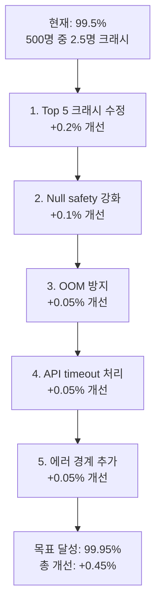
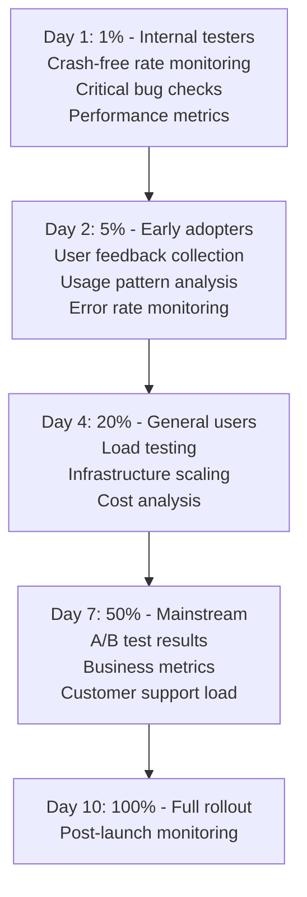

# Flutter 프로덕션 운영 가이드 (시니어)

> **난이도**: 시니어 | **카테고리**: system
> **선행 학습**: [Testing](./Testing.md), [CICD](../infrastructure/CICD.md) | **예상 학습 시간**: 3h

> 10년차+ 시니어 개발자를 위한 대규모 프로덕션 환경의 모니터링, 인시던트 관리, 운영 자동화를 다룹니다.

> **학습 목표**: 이 문서를 학습하면 다음을 할 수 있습니다:
> - SLO/SLI를 정의하고 서비스 품질을 측정할 수 있다
> - Incident Management 프로세스를 수립할 수 있다
> - Crash-free Rate를 모니터링하고 개선할 수 있다

## 목차

1. [Crashlytics 분석 자동화](#1-crashlytics-분석-자동화)
2. [SLO/SLI/SLA 설정과 모니터링](#2-slosli-sla-설정과-모니터링)
3. [릴리즈 모니터링 대시보드](#3-릴리즈-모니터링-대시보드)
4. [Crash-free Rate 관리](#4-crash-free-rate-관리)
5. [ANR 분석과 해결](#5-anr-분석과-해결)
6. [사용자 세션 리플레이](#6-사용자-세션-리플레이)
7. [Remote Config 기반 운영](#7-remote-config-기반-운영)
8. [대규모 사용자 롤아웃 전략](#8-대규모-사용자-롤아웃-전략)
9. [핫픽스 프로세스](#9-핫픽스-프로세스)
10. [On-call 프로세스와 인시던트 관리](#10-on-call-프로세스와-인시던트-관리)
11. [앱 Health Score 정의](#11-앱-health-score-정의)

---

## 1. Crashlytics 분석 자동화

### 1.1 자동 이슈 트리아지

```python
# scripts/crashlytics_triage.py
#!/usr/bin/env python3
"""
Firebase Crashlytics 데이터를 자동으로 분석하고 Jira 이슈를 생성합니다.
"""

import os
import requests
import json
from datetime import datetime, timedelta

class CrashlyticsTriage:
    def __init__(self, project_id, api_key):
        self.project_id = project_id
        self.api_key = api_key
        self.base_url = f"https://firebasecrashlytics.googleapis.com/v1beta1/projects/{project_id}"

    def get_crashes(self, days=7):
        """최근 N일간의 크래시 데이터 조회"""
        end_date = datetime.now()
        start_date = end_date - timedelta(days=days)

        response = requests.get(
            f"{self.base_url}/crashes",
            headers={"Authorization": f"Bearer {self.api_key}"},
            params={
                "startTime": start_date.isoformat(),
                "endTime": end_date.isoformat(),
                "pageSize": 100
            }
        )

        return response.json().get("crashes", [])

    def calculate_priority(self, crash):
        """크래시 우선순위 계산"""
        affected_users = crash.get("impactedUserCount", 0)
        crash_count = crash.get("crashCount", 0)
        crash_free_rate = crash.get("crashFreeRate", 100)

        # P1: 1000명 이상 영향 또는 crash-free rate < 99%
        if affected_users > 1000 or crash_free_rate < 99:
            return "P1-Critical"

        # P2: 100-1000명 영향
        elif affected_users > 100:
            return "P2-High"

        # P3: 10-100명 영향
        elif affected_users > 10:
            return "P3-Medium"

        # P4: 10명 미만
        else:
            return "P4-Low"

    def create_jira_ticket(self, crash, priority):
        """Jira 이슈 자동 생성"""
        jira_url = "https://your-company.atlassian.net/rest/api/3/issue"
        jira_token = os.getenv("JIRA_API_TOKEN")

        # 스택 트레이스 추출
        stack_trace = "\n".join(crash.get("stackTrace", [])[:10])

        # OS 버전 및 기기 정보
        os_version = crash.get("osVersion", "Unknown")
        device = crash.get("device", "Unknown")

        payload = {
            "fields": {
                "project": {"key": "MOB"},
                "summary": f"[Crash] {crash.get('issueTitle', 'Unknown crash')}",
                "description": {
                    "type": "doc",
                    "version": 1,
                    "content": [{
                        "type": "paragraph",
                        "content": [{
                            "type": "text",
                            "text": f"""
Crash Details:
- Priority: {priority}
- Affected Users: {crash.get('impactedUserCount', 0)}
- Crash Count: {crash.get('crashCount', 0)}
- OS Version: {os_version}
- Device: {device}

Stack Trace:
{stack_trace}

Crashlytics Link: {crash.get('issueUrl', 'N/A')}
                            """
                        }]
                    }]
                },
                "issuetype": {"name": "Bug"},
                "priority": {"name": priority.split("-")[1]},
                "labels": ["crash", "automated", f"os_{os_version}"]
            }
        }

        response = requests.post(
            jira_url,
            headers={
                "Authorization": f"Bearer {jira_token}",
                "Content-Type": "application/json"
            },
            json=payload
        )

        return response.json()

    def send_slack_alert(self, crash, priority):
        """Slack 알림 전송"""
        webhook_url = os.getenv("SLACK_WEBHOOK_URL")

        color = {
            "P1-Critical": "#ff0000",
            "P2-High": "#ff6600",
            "P3-Medium": "#ffcc00",
            "P4-Low": "#36a64f"
        }.get(priority, "#808080")

        payload = {
            "attachments": [{
                "color": color,
                "title": f"🚨 {priority}: {crash.get('issueTitle', 'Unknown')}",
                "fields": [
                    {"title": "Affected Users", "value": str(crash.get('impactedUserCount', 0)), "short": True},
                    {"title": "Crash Count", "value": str(crash.get('crashCount', 0)), "short": True},
                    {"title": "OS Version", "value": crash.get('osVersion', 'Unknown'), "short": True},
                    {"title": "Device", "value": crash.get('device', 'Unknown'), "short": True}
                ],
                "actions": [{
                    "type": "button",
                    "text": "View in Crashlytics",
                    "url": crash.get('issueUrl', '#')
                }]
            }]
        }

        requests.post(webhook_url, json=payload)

    def run_triage(self):
        """트리아지 실행"""
        crashes = self.get_crashes(days=1)  # 최근 24시간

        for crash in crashes:
            # 이미 처리된 크래시는 스킵
            if crash.get("status") != "NEW":
                continue

            priority = self.calculate_priority(crash)

            # P1/P2만 자동 티켓 생성
            if priority in ["P1-Critical", "P2-High"]:
                self.create_jira_ticket(crash, priority)
                self.send_slack_alert(crash, priority)

            print(f"Processed crash: {crash.get('issueTitle')} - {priority}")

if __name__ == "__main__":
    triage = CrashlyticsTriage(
        project_id="my-firebase-project",
        api_key=os.getenv("FIREBASE_API_KEY")
    )
    triage.run_triage()
```

### 1.2 크래시 패턴 분석

```dart
// lib/core/monitoring/crash_pattern_detector.dart
class CrashPatternDetector {
  final CrashlyticsService _crashlytics;
  final AnalyticsService _analytics;

  CrashPatternDetector(this._crashlytics, this._analytics);

  /// 크래시 발생 전 사용자 행동 패턴 수집
  void trackUserJourney(String action, {Map<String, dynamic>? metadata}) {
    // Breadcrumb 기록
    _crashlytics.log('User action: $action');

    // 타임스탬프와 함께 저장
    _crashlytics.setCustomKey('last_action', action);
    _crashlytics.setCustomKey('last_action_time', DateTime.now().toIso8601String());

    // 메타데이터 추가
    if (metadata != null) {
      metadata.forEach((key, value) {
        _crashlytics.setCustomKey('action_$key', value.toString());
      });
    }
  }

  /// 앱 상태 스냅샷 저장
  void captureAppState() {
    _crashlytics.setCustomKeys({
      'free_memory_mb': _getFreeMemory(),
      'battery_level': _getBatteryLevel(),
      'network_type': _getNetworkType(),
      'active_screen': _getCurrentScreen(),
      'api_queue_size': _getApiQueueSize(),
    });
  }

  /// 크래시 직전 API 호출 기록
  void trackApiCall(String endpoint, {required int statusCode, required int latencyMs}) {
    _crashlytics.log('API: $endpoint [$statusCode] ${latencyMs}ms');

    // 실패한 API 호출 카운트
    if (statusCode >= 400) {
      final failedCount = _getFailedApiCount() + 1;
      _crashlytics.setCustomKey('failed_api_count', failedCount);

      // 연속 실패 시 경고
      if (failedCount >= 3) {
        _crashlytics.log('⚠️ Multiple API failures detected');
      }
    }
  }

  /// 메모리 압박 감지
  void monitorMemoryPressure() {
    Timer.periodic(const Duration(seconds: 30), (_) {
      final freeMemory = _getFreeMemory();

      if (freeMemory < 50) {  // 50MB 미만
        _crashlytics.log('⚠️ Low memory: ${freeMemory}MB');
        _crashlytics.setCustomKey('memory_warning', true);
      }
    });
  }

  int _getFreeMemory() {
    // Platform channel로 네이티브에서 메모리 정보 가져오기
    return 100;  // 예시
  }

  double _getBatteryLevel() {
    return 80.0;  // 예시
  }

  String _getNetworkType() {
    return 'wifi';  // 예시
  }

  String _getCurrentScreen() {
    return 'HomeScreen';  // 예시
  }

  int _getApiQueueSize() {
    return 0;  // 예시
  }

  int _getFailedApiCount() {
    return 0;  // 예시
  }
}
```

### 1.3 BigQuery로 크래시 데이터 집계

```sql
-- bigquery/crash_analysis.sql
-- Crashlytics 데이터를 BigQuery로 Export 후 분석

-- 일별 크래시 트렌드
SELECT
  DATE(event_timestamp) AS date,
  COUNT(DISTINCT user_pseudo_id) AS affected_users,
  COUNT(*) AS crash_count,
  SAFE_DIVIDE(
    COUNT(DISTINCT CASE WHEN event_name = 'app_exception' THEN user_pseudo_id END),
    COUNT(DISTINCT user_pseudo_id)
  ) * 100 AS crash_percentage
FROM
  `project.analytics_123456789.events_*`
WHERE
  _TABLE_SUFFIX BETWEEN FORMAT_DATE('%Y%m%d', DATE_SUB(CURRENT_DATE(), INTERVAL 30 DAY))
    AND FORMAT_DATE('%Y%m%d', CURRENT_DATE())
GROUP BY date
ORDER BY date DESC;

-- 크래시 상위 10개 (영향 사용자 기준)
SELECT
  (SELECT value.string_value FROM UNNEST(event_params) WHERE key = 'fatal') AS is_fatal,
  (SELECT value.string_value FROM UNNEST(event_params) WHERE key = 'exception_message') AS error_message,
  (SELECT value.string_value FROM UNNEST(event_params) WHERE key = 'os_version') AS os_version,
  COUNT(DISTINCT user_pseudo_id) AS affected_users,
  COUNT(*) AS crash_count
FROM
  `project.analytics_123456789.events_*`
WHERE
  _TABLE_SUFFIX = FORMAT_DATE('%Y%m%d', CURRENT_DATE())
  AND event_name = 'app_exception'
GROUP BY is_fatal, error_message, os_version
ORDER BY affected_users DESC
LIMIT 10;

-- OS 버전별 크래시율
SELECT
  platform,
  os_version,
  COUNT(DISTINCT user_pseudo_id) AS total_users,
  COUNT(DISTINCT CASE WHEN event_name = 'app_exception' THEN user_pseudo_id END) AS crashed_users,
  SAFE_DIVIDE(
    COUNT(DISTINCT CASE WHEN event_name = 'app_exception' THEN user_pseudo_id END),
    COUNT(DISTINCT user_pseudo_id)
  ) * 100 AS crash_rate
FROM
  `project.analytics_123456789.events_*`
WHERE
  _TABLE_SUFFIX = FORMAT_DATE('%Y%m%d', CURRENT_DATE())
GROUP BY platform, os_version
HAVING total_users > 100
ORDER BY crash_rate DESC;
```

---

## 2. SLO/SLI/SLA 설정과 모니터링

### 2.1 SLI (Service Level Indicators) 정의

```yaml
# config/sli.yaml
slis:
  # 가용성
  - name: availability
    description: 앱이 정상적으로 실행되는 비율
    metric: crash_free_users
    target: 99.5%
    measurement: |
      (Total users - Users who experienced crash) / Total users * 100

  # 성능
  - name: api_latency_p95
    description: API 응답 시간 95 백분위수
    metric: api_response_time_p95
    target: < 500ms
    measurement: |
      95th percentile of all API response times

  - name: app_start_time_p90
    description: 앱 시작 시간 90 백분위수
    metric: cold_start_time_p90
    target: < 2s
    measurement: |
      90th percentile of cold start times

  # 품질
  - name: anr_rate
    description: ANR (Application Not Responding) 발생률
    metric: anr_per_session
    target: < 0.1%
    measurement: |
      (Sessions with ANR) / (Total sessions) * 100

  - name: error_rate
    description: 에러 발생률
    metric: error_per_request
    target: < 1%
    measurement: |
      (Failed requests) / (Total requests) * 100
```

### 2.2 SLO (Service Level Objectives) 설정

```yaml
# config/slo.yaml
slos:
  # 월별 가용성 목표
  - name: monthly_availability
    sli: availability
    target: 99.5%
    window: 30d
    error_budget: 0.5%  # 약 216분/월
    alert_threshold: 50%  # Error budget 50% 소진 시 알림

  # 주간 성능 목표
  - name: weekly_api_performance
    sli: api_latency_p95
    target: 95%  # 95%의 요청이 500ms 이하
    window: 7d
    error_budget: 5%
    alert_threshold: 75%

  # 일일 ANR 목표
  - name: daily_anr_rate
    sli: anr_rate
    target: 99.9%  # 99.9%의 세션에서 ANR 없음
    window: 1d
    error_budget: 0.1%
    alert_threshold: 80%
```

### 2.3 SLO 모니터링 대시보드

```dart
// lib/core/monitoring/slo_monitor.dart
class SLOMonitor {
  final FirebaseAnalytics _analytics;
  final MetricsCollector _metrics;

  SLOMonitor(this._analytics, this._metrics);

  /// SLI 측정 및 기록
  Future<void> recordSLI(String sliName, double value) async {
    await _analytics.logEvent(
      name: 'sli_measurement',
      parameters: {
        'sli_name': sliName,
        'value': value,
        'timestamp': DateTime.now().millisecondsSinceEpoch,
      },
    );

    _metrics.recordValue('sli_$sliName', value);
  }

  /// Error Budget 계산
  double calculateErrorBudget({
    required double targetSLO,
    required double currentSLI,
    required Duration window,
  }) {
    final allowedFailureRate = 1 - (targetSLO / 100);
    final actualFailureRate = 1 - (currentSLI / 100);

    return (allowedFailureRate - actualFailureRate) / allowedFailureRate * 100;
  }

  /// Error Budget 소진 속도
  double calculateBurnRate({
    required double errorBudget,
    required Duration elapsed,
    required Duration window,
  }) {
    final consumedBudget = 100 - errorBudget;
    final expectedConsumption = (elapsed.inMinutes / window.inMinutes) * 100;

    return consumedBudget / expectedConsumption;
  }

  /// SLO 위반 감지
  Future<void> checkSLOViolation({
    required String sloName,
    required double targetSLO,
    required double currentSLI,
  }) async {
    if (currentSLI < targetSLO) {
      // 알림 전송
      await _sendSLOAlert(
        sloName: sloName,
        target: targetSLO,
        actual: currentSLI,
        severity: currentSLI < (targetSLO - 1) ? 'critical' : 'warning',
      );
    }
  }

  Future<void> _sendSLOAlert({
    required String sloName,
    required double target,
    required double actual,
    required String severity,
  }) async {
    // PagerDuty, Slack 등으로 알림
  }
}
```

### 2.4 Grafana 대시보드 (Prometheus 메트릭)

```yaml
# prometheus/slo_rules.yml
groups:
  - name: slo_alerts
    interval: 1m
    rules:
      # Availability SLO
      - alert: AvailabilitySLOViolation
        expr: |
          (
            1 - (
              sum(rate(app_crashes_total[30d]))
              /
              sum(rate(app_sessions_total[30d]))
            )
          ) * 100 < 99.5
        for: 5m
        labels:
          severity: critical
        annotations:
          summary: "Availability SLO violated ({{ $value }}%)"
          description: "Crash-free rate is below 99.5% target"

      # Error Budget Burn Rate
      - alert: ErrorBudgetBurnRateHigh
        expr: |
          (
            (1 - (slo_target / 100))
            /
            (1 - (current_sli / 100))
          ) > 10
        for: 1h
        labels:
          severity: warning
        annotations:
          summary: "Error budget burning 10x faster than expected"
          description: "Current burn rate: {{ $value }}x"

      # API Latency SLO
      - alert: APILatencySLOViolation
        expr: |
          histogram_quantile(0.95,
            rate(api_request_duration_seconds_bucket[5m])
          ) > 0.5
        for: 10m
        labels:
          severity: warning
        annotations:
          summary: "API p95 latency above 500ms ({{ $value }}s)"
```

---

## 3. 릴리즈 모니터링 대시보드

### 3.1 릴리즈 Health 대시보드

```dart
// lib/core/monitoring/release_health_tracker.dart
class ReleaseHealthTracker {
  final FirebaseAnalytics _analytics;
  final String appVersion;

  ReleaseHealthTracker(this._analytics, this.appVersion);

  /// 릴리즈 Health 메트릭 수집
  Future<void> trackReleaseHealth() async {
    final metrics = await _collectHealthMetrics();

    await _analytics.logEvent(
      name: 'release_health',
      parameters: {
        'app_version': appVersion,
        'crash_free_users': metrics['crashFreeUsers'],
        'crash_free_sessions': metrics['crashFreeSessions'],
        'anr_rate': metrics['anrRate'],
        'avg_session_duration': metrics['avgSessionDuration'],
        'api_error_rate': metrics['apiErrorRate'],
        'p95_cold_start': metrics['p95ColdStart'],
      },
    );
  }

  Future<Map<String, double>> _collectHealthMetrics() async {
    // 실제 메트릭 수집 로직
    return {
      'crashFreeUsers': 99.7,
      'crashFreeSessions': 99.9,
      'anrRate': 0.05,
      'avgSessionDuration': 180.0,  // seconds
      'apiErrorRate': 0.3,  // %
      'p95ColdStart': 1.8,  // seconds
    };
  }

  /// 이전 버전과 비교
  Future<Map<String, dynamic>> compareWithPreviousVersion(String previousVersion) async {
    final current = await _collectHealthMetrics();
    final previous = await _getMetricsForVersion(previousVersion);

    return {
      'crash_free_users_delta': current['crashFreeUsers']! - previous['crashFreeUsers']!,
      'anr_rate_delta': current['anrRate']! - previous['anrRate']!,
      'performance_delta': current['p95ColdStart']! - previous['p95ColdStart']!,
    };
  }

  Future<Map<String, double>> _getMetricsForVersion(String version) async {
    // BigQuery에서 이전 버전 메트릭 조회
    return {};
  }
}
```

### 3.2 Looker Studio 대시보드

```sql
-- bigquery/release_health_dashboard.sql
-- Looker Studio 데이터 소스

CREATE OR REPLACE VIEW `project.analytics.release_health_view` AS
SELECT
  app_version,
  DATE(event_timestamp) AS date,

  -- Crash-free metrics
  COUNT(DISTINCT user_pseudo_id) AS total_users,
  COUNT(DISTINCT CASE WHEN event_name != 'app_exception' THEN user_pseudo_id END) AS crash_free_users,
  SAFE_DIVIDE(
    COUNT(DISTINCT CASE WHEN event_name != 'app_exception' THEN user_pseudo_id END),
    COUNT(DISTINCT user_pseudo_id)
  ) * 100 AS crash_free_users_percentage,

  -- Session metrics
  COUNT(DISTINCT CONCAT(user_pseudo_id, CAST(event_timestamp AS STRING))) AS total_sessions,
  AVG(TIMESTAMP_DIFF(session_end, session_start, SECOND)) AS avg_session_duration,

  -- Performance metrics
  APPROX_QUANTILES(cold_start_time, 100)[OFFSET(95)] AS p95_cold_start,
  APPROX_QUANTILES(api_latency, 100)[OFFSET(95)] AS p95_api_latency,

  -- Error rate
  SAFE_DIVIDE(
    SUM(CASE WHEN event_name = 'api_error' THEN 1 ELSE 0 END),
    SUM(CASE WHEN event_name IN ('api_call', 'api_error') THEN 1 ELSE 0 END)
  ) * 100 AS api_error_rate

FROM
  `project.analytics_123456789.events_*`
WHERE
  _TABLE_SUFFIX BETWEEN FORMAT_DATE('%Y%m%d', DATE_SUB(CURRENT_DATE(), INTERVAL 30 DAY))
    AND FORMAT_DATE('%Y%m%d', CURRENT_DATE())
GROUP BY app_version, date;
```

### 3.3 Slack 릴리즈 리포트 자동화

```python
# scripts/send_release_report.py
#!/usr/bin/env python3
import requests
from google.cloud import bigquery

def generate_release_report(version):
    """릴리즈 헬스 리포트 생성"""
    client = bigquery.Client()

    query = f"""
    SELECT
      app_version,
      crash_free_users_percentage,
      p95_cold_start,
      api_error_rate,
      avg_session_duration
    FROM
      `project.analytics.release_health_view`
    WHERE
      app_version = '{version}'
      AND date = CURRENT_DATE()
    """

    results = client.query(query).result()
    row = next(results)

    return {
        'version': row.app_version,
        'crash_free_rate': row.crash_free_users_percentage,
        'cold_start': row.p95_cold_start,
        'error_rate': row.api_error_rate,
        'session_duration': row.avg_session_duration
    }

def send_to_slack(report):
    """Slack으로 리포트 전송"""
    webhook_url = os.getenv("SLACK_WEBHOOK_URL")

    # 상태 판단
    status = "✅ Healthy"
    color = "#36a64f"

    if report['crash_free_rate'] < 99.5 or report['error_rate'] > 1.0:
        status = "🚨 Critical"
        color = "#ff0000"
    elif report['crash_free_rate'] < 99.7 or report['error_rate'] > 0.5:
        status = "⚠️ Warning"
        color = "#ffcc00"

    payload = {
        "attachments": [{
            "color": color,
            "title": f"Release {report['version']} Health Report",
            "text": status,
            "fields": [
                {"title": "Crash-free Rate", "value": f"{report['crash_free_rate']:.2f}%", "short": True},
                {"title": "Error Rate", "value": f"{report['error_rate']:.2f}%", "short": True},
                {"title": "Cold Start (p95)", "value": f"{report['cold_start']:.2f}s", "short": True},
                {"title": "Avg Session", "value": f"{report['session_duration']:.0f}s", "short": True}
            ],
            "footer": "Release Monitoring",
            "ts": int(time.time())
        }]
    }

    requests.post(webhook_url, json=payload)

if __name__ == "__main__":
    import sys
    version = sys.argv[1] if len(sys.argv) > 1 else "1.0.0"
    report = generate_release_report(version)
    send_to_slack(report)
```

---

## 4. Crash-free Rate 관리

### 4.1 99.9% 달성 전략



### 4.2 크래시 방지 패턴

```dart
// lib/core/crash_prevention/safe_executor.dart
class SafeExecutor {
  final CrashlyticsService _crashlytics;

  SafeExecutor(this._crashlytics);

  /// Safe async execution with retry
  Future<T?> executeAsync<T>({
    required Future<T> Function() operation,
    int maxRetries = 3,
    Duration retryDelay = const Duration(seconds: 1),
    T? fallback,
  }) async {
    int attempt = 0;

    while (attempt < maxRetries) {
      try {
        return await operation();
      } catch (e, stackTrace) {
        attempt++;

        _crashlytics.log('Attempt $attempt/$maxRetries failed: $e');

        if (attempt >= maxRetries) {
          // 최대 재시도 후에도 실패하면 기록
          await _crashlytics.recordError(
            e,
            stackTrace,
            reason: 'Max retries exceeded',
            information: {
              'operation': operation.toString(),
              'attempts': maxRetries,
            },
          );

          return fallback;
        }

        await Future.delayed(retryDelay * attempt);  // Exponential backoff
      }
    }

    return fallback;
  }

  /// Safe synchronous execution
  T? executeSync<T>({
    required T Function() operation,
    T? fallback,
    bool fatal = false,
  }) {
    try {
      return operation();
    } catch (e, stackTrace) {
      _crashlytics.recordError(
        e,
        stackTrace,
        fatal: fatal,
        reason: 'Synchronous operation failed',
      );

      return fallback;
    }
  }

  /// Safe widget build
  Widget safeBuild({
    required Widget Function() builder,
    Widget? fallback,
  }) {
    try {
      return builder();
    } catch (e, stackTrace) {
      _crashlytics.recordError(e, stackTrace, reason: 'Widget build failed');

      return fallback ?? ErrorWidget(FlutterErrorDetails(exception: e));
    }
  }
}

// 사용 예시
class ProductRepository {
  final SafeExecutor _executor;

  Future<List<Product>?> getProducts() {
    return _executor.executeAsync(
      operation: () => _api.fetchProducts(),
      maxRetries: 3,
      fallback: [],  // 빈 리스트 반환
    );
  }
}
```

### 4.3 OOM (Out of Memory) 방지

```dart
// lib/core/crash_prevention/memory_manager.dart
class MemoryManager {
  static const int _maxCacheSize = 100 * 1024 * 1024;  // 100MB

  final Map<String, WeakReference<dynamic>> _cache = {};
  int _currentCacheSize = 0;

  /// 메모리 안전한 캐싱
  void cacheData(String key, dynamic data) {
    final dataSize = _estimateSize(data);

    // 캐시 크기 초과 시 LRU 제거
    if (_currentCacheSize + dataSize > _maxCacheSize) {
      _evictOldest();
    }

    _cache[key] = WeakReference(data);
    _currentCacheSize += dataSize;
  }

  dynamic? getData(String key) {
    final ref = _cache[key];
    final data = ref?.target;

    if (data == null && ref != null) {
      // GC로 인해 제거된 경우
      _cache.remove(key);
    }

    return data;
  }

  void _evictOldest() {
    // LRU 제거 로직
    final keys = _cache.keys.toList();
    if (keys.isNotEmpty) {
      _cache.remove(keys.first);
    }
  }

  int _estimateSize(dynamic data) {
    // 데이터 크기 추정
    if (data is String) {
      return data.length * 2;  // UTF-16
    } else if (data is List) {
      return data.length * 8;  // 포인터 크기
    }
    return 1024;  // 기본값
  }

  /// 메모리 압박 감지
  void monitorMemoryPressure() {
    // Platform channel로 시스템 메모리 경고 수신
    const platform = MethodChannel('com.example.app/memory');

    platform.setMethodCallHandler((call) async {
      if (call.method == 'memoryWarning') {
        _handleMemoryWarning();
      }
    });
  }

  void _handleMemoryWarning() {
    // 캐시 정리
    _cache.clear();
    _currentCacheSize = 0;

    // 이미지 캐시 정리
    PaintingBinding.instance.imageCache.clear();
    PaintingBinding.instance.imageCache.clearLiveImages();
  }
}
```

---

## 5. ANR 분석과 해결

### 5.1 ANR (Application Not Responding) 감지

```dart
// lib/core/monitoring/anr_detector.dart
class ANRDetector {
  final Duration _threshold;
  Timer? _watchdog;
  DateTime? _lastResponseTime;

  ANRDetector({Duration threshold = const Duration(seconds: 5)})
      : _threshold = threshold;

  void start() {
    _lastResponseTime = DateTime.now();

    // Watchdog 타이머
    _watchdog = Timer.periodic(const Duration(seconds: 1), (_) {
      final now = DateTime.now();
      final elapsed = now.difference(_lastResponseTime!);

      if (elapsed > _threshold) {
        _reportANR(elapsed);
      }
    });

    // Main isolate의 응답 확인
    _pingMainIsolate();
  }

  void _pingMainIsolate() {
    Timer.periodic(const Duration(milliseconds: 100), (_) {
      _lastResponseTime = DateTime.now();
    });
  }

  void _reportANR(Duration duration) {
    final crashlytics = CrashlyticsService();

    crashlytics.recordError(
      StateError('ANR detected'),
      StackTrace.current,
      reason: 'Main thread blocked for ${duration.inSeconds}s',
      information: {
        'blocked_duration_ms': duration.inMilliseconds,
        'last_response': _lastResponseTime?.toIso8601String(),
      },
    );

    // Slack 알림
    _sendANRAlert(duration);
  }

  void _sendANRAlert(Duration duration) {
    // PagerDuty, Slack 등으로 즉시 알림
  }

  void stop() {
    _watchdog?.cancel();
  }
}
```

### 5.2 메인 스레드 블로킹 방지

```dart
// lib/core/concurrency/compute_helper.dart
class ComputeHelper {
  /// CPU 집약적 작업을 Isolate로 이동
  static Future<T> runInIsolate<T, P>({
    required T Function(P) function,
    required P parameter,
  }) async {
    return compute(function, parameter);
  }

  /// 대용량 JSON 파싱
  static Future<Map<String, dynamic>> parseJsonInIsolate(String jsonString) {
    return compute(_parseJson, jsonString);
  }

  static Map<String, dynamic> _parseJson(String jsonString) {
    return jsonDecode(jsonString);
  }

  /// 이미지 압축
  static Future<Uint8List> compressImageInIsolate(Uint8List imageBytes) {
    return compute(_compressImage, imageBytes);
  }

  static Uint8List _compressImage(Uint8List bytes) {
    // 실제 압축 로직
    return bytes;
  }

  /// 대량 데이터 처리
  static Future<List<T>> processLargeListInIsolate<T>({
    required List<T> items,
    required T Function(T) processor,
  }) async {
    // ⚠️ **경고:** `compute()`에는 최상위(top-level) 함수 또는 static 메서드만 전달할 수 있습니다. closure나 인스턴스 메서드는 사용할 수 없습니다. closure를 최상위 함수로 분리하세요.
    // 청크로 나누어 병렬 처리
    const chunkSize = 1000;
    final chunks = <List<T>>[];

    for (var i = 0; i < items.length; i += chunkSize) {
      final end = (i + chunkSize < items.length) ? i + chunkSize : items.length;
      chunks.add(items.sublist(i, end));
    }

    final futures = chunks.map((chunk) =>
      compute(_processChunk, _ProcessParams(chunk, processor))
    );

    final results = await Future.wait(futures);
    return results.expand((x) => x).toList();
  }

  static List<T> _processChunk<T>(_ProcessParams<T> params) {
    return params.items.map(params.processor).toList();
  }
}

class _ProcessParams<T> {
  final List<T> items;
  final T Function(T) processor;

  _ProcessParams(this.items, this.processor);
}
```

### 5.3 ANR 분석 대시보드

```sql
-- bigquery/anr_analysis.sql
SELECT
  app_version,
  os_version,
  device_model,
  (SELECT value.string_value FROM UNNEST(event_params) WHERE key = 'blocked_duration_ms') AS blocked_duration,
  (SELECT value.string_value FROM UNNEST(event_params) WHERE key = 'screen_name') AS screen_name,
  COUNT(*) AS anr_count,
  COUNT(DISTINCT user_pseudo_id) AS affected_users
FROM
  `project.analytics_123456789.events_*`
WHERE
  _TABLE_SUFFIX = FORMAT_DATE('%Y%m%d', CURRENT_DATE())
  AND event_name = 'anr_detected'
GROUP BY app_version, os_version, device_model, blocked_duration, screen_name
ORDER BY anr_count DESC
LIMIT 20;
```

---

## 6. 사용자 세션 리플레이

### 6.1 Smartlook 통합

> ⚠️ **패키지 중단 경고**: smartlook 패키지는 DISCONTINUED 상태입니다. Smartlook 공식 SDK 또는 대안(Amplitude, Mixpanel 등)을 사용하세요.

```yaml
# pubspec.yaml
dependencies:
  smartlook: ^2.2.0
```

```dart
// lib/core/session_replay/smartlook_service.dart
import 'package:smartlook/smartlook.dart';

class SmartlookService {
  static final SmartlookService _instance = SmartlookService._();
  factory SmartlookService() => _instance;
  SmartlookService._();

  Future<void> initialize(String apiKey) async {
    await Smartlook.instance.preferences.setProjectKey(apiKey);

    // 프레임률 설정 (기본: 2fps)
    await Smartlook.instance.preferences.setFrameRate(2);

    // 렌더링 모드
    await Smartlook.instance.preferences.setRenderingMode(
      RenderingMode.native  // or wireframe
    );

    // 민감 정보 마스킹
    await Smartlook.instance.preferences.setRenderingMode(
      RenderingModeOption.noRendering  // 특정 화면은 녹화 안 함
    );

    await Smartlook.instance.start();
  }

  /// 사용자 식별
  Future<void> identifyUser(String userId, {Map<String, String>? properties}) async {
    await Smartlook.instance.user.setIdentifier(userId);

    if (properties != null) {
      for (final entry in properties.entries) {
        await Smartlook.instance.user.setProperty(entry.key, entry.value);
      }
    }
  }

  /// 커스텀 이벤트 추적
  Future<void> trackEvent(String eventName, {Map<String, String>? properties}) async {
    await Smartlook.instance.tracking.trackCustomEvent(eventName, properties: properties);
  }

  /// 민감 뷰 마스킹
  void markSensitiveView(GlobalKey key) {
    Smartlook.instance.rendering.registerWhitelistedView(key);
  }

  /// 특정 화면 녹화 중지
  Future<void> pauseRecording() async {
    await Smartlook.instance.recording.stop();
  }

  Future<void> resumeRecording() async {
    await Smartlook.instance.recording.start();
  }

  /// 세션 URL 가져오기 (크래시 리포트에 첨부)
  Future<String?> getSessionUrl() async {
    return Smartlook.instance.recording.getDashboardSessionUrl();
  }
}

// 사용 예시
class PaymentScreen extends StatelessWidget {
  const PaymentScreen({super.key});

  final _cardNumberKey = GlobalKey();

  @override
  Widget build(BuildContext context) {
    // 카드 번호 입력란은 녹화에서 제외
    SmartlookService().markSensitiveView(_cardNumberKey);

    return Scaffold(
      body: TextField(
        key: _cardNumberKey,
        decoration: InputDecoration(labelText: 'Card Number'),
      ),
    );
  }
}
```

### 6.2 Instabug 통합

```dart
// lib/core/session_replay/instabug_service.dart
import 'package:instabug_flutter/instabug_flutter.dart';

class InstabugService {
  Future<void> initialize(String token) async {
    await Instabug.init(
      token: token,
      invocationEvents: [InvocationEvent.shake, InvocationEvent.screenshot],
    );

    // Crash reporting 활성화
    await CrashReporting.setEnabled(true);

    // 세션 프로파일링
    await Instabug.setSessionProfilerEnabled(true);

    // 네트워크 로그 수집
    await NetworkLogger.setEnabled(true);

    // 사용자 단계 자동 추적
    await Instabug.setUserStepsEnabled(true);
  }

  /// 사용자 속성 설정
  Future<void> setUserAttributes({
    required String userId,
    String? email,
    String? name,
  }) async {
    await Instabug.identifyUser(userId, email, name);
  }

  /// 버그 리포트에 첨부할 데이터
  Future<void> setCustomData(String key, String value) async {
    await Instabug.setUserAttribute(key, value);
  }

  /// 특정 뷰 스크린샷에서 제외
  void markViewAsSensitive(Widget widget) {
    // Instabug.addPrivateView(widget);
  }

  /// 수동 버그 리포트 트리거
  Future<void> showBugReporter() async {
    await BugReporting.show(ReportType.bug);
  }

  /// 피드백 수집
  Future<void> showFeedbackForm() async {
    await BugReporting.show(ReportType.feedback);
  }
}
```

---

## 7. Remote Config 기반 운영

### 7.1 Kill Switch 구현

```dart
// lib/core/remote_config/kill_switch.dart
class KillSwitch {
  final RemoteConfigService _remoteConfig;

  KillSwitch(this._remoteConfig);

  /// 전체 기능 활성화 여부
  bool get isAppEnabled => _remoteConfig.getBool('app_enabled');

  /// 특정 기능 활성화 여부
  bool isFeatureEnabled(String featureName) {
    return _remoteConfig.getBool('feature_${featureName}_enabled');
  }

  /// 강제 업데이트 필요 여부
  bool get requiresForceUpdate {
    final minVersion = _remoteConfig.getString('min_app_version');
    final currentVersion = _getCurrentAppVersion();

    return _compareVersions(currentVersion, minVersion) < 0;
  }

  /// 점검 모드 여부
  bool get isMaintenanceMode => _remoteConfig.getBool('maintenance_mode');

  /// 점검 메시지
  String get maintenanceMessage {
    return _remoteConfig.getString('maintenance_message');
  }

  /// 특정 국가 차단
  bool isCountryBlocked(String countryCode) {
    final blockedCountries = _remoteConfig.getString('blocked_countries');
    return blockedCountries.split(',').contains(countryCode);
  }

  /// 특정 OS 버전 차단
  bool isOSVersionBlocked(String osVersion) {
    final blockedVersions = _remoteConfig.getString('blocked_os_versions');
    return blockedVersions.split(',').contains(osVersion);
  }

  int _compareVersions(String v1, String v2) {
    final parts1 = v1.split('.').map(int.parse).toList();
    final parts2 = v2.split('.').map(int.parse).toList();

    for (var i = 0; i < 3; i++) {
      if (parts1[i] != parts2[i]) {
        return parts1[i].compareTo(parts2[i]);
      }
    }
    return 0;
  }

  String _getCurrentAppVersion() {
    return '1.2.3';  // PackageInfo에서 가져오기
  }
}

// 사용 예시
class App extends StatelessWidget {
  const App({super.key});

  @override
  Widget build(BuildContext context) {
    final killSwitch = GetIt.I<KillSwitch>();

    // 점검 모드 체크
    if (killSwitch.isMaintenanceMode) {
      return MaintenanceScreen(
        message: killSwitch.maintenanceMessage,
      );
    }

    // 강제 업데이트 체크
    if (killSwitch.requiresForceUpdate) {
      return ForceUpdateScreen();
    }

    // 정상 앱 실행
    return MaterialApp(
      home: const HomeScreen(),
    );
  }
}
```

### 7.2 동적 구성 관리

```dart
// lib/core/remote_config/dynamic_config.dart
class DynamicConfig {
  final RemoteConfigService _remoteConfig;

  DynamicConfig(this._remoteConfig);

  /// API 엔드포인트 동적 변경
  String get apiBaseUrl {
    final endpoints = _remoteConfig.getJson('api_endpoints');
    final environment = const String.fromEnvironment('ENV', defaultValue: 'prod');
    return endpoints[environment] ?? 'https://api.example.com';
  }

  /// API 타임아웃 동적 조정
  Duration get apiTimeout {
    final seconds = _remoteConfig.getInt('api_timeout_seconds');
    return Duration(seconds: seconds);
  }

  /// 최대 재시도 횟수
  int get maxRetryCount => _remoteConfig.getInt('max_retry_count');

  /// 캐시 TTL
  Duration get cacheTTL {
    final minutes = _remoteConfig.getInt('cache_ttl_minutes');
    return Duration(minutes: minutes);
  }

  /// 페이지네이션 크기
  int get pageSize => _remoteConfig.getInt('pagination_page_size');

  /// 로깅 레벨
  String get logLevel => _remoteConfig.getString('log_level');

  /// 배너 광고 표시 간격
  Duration get adDisplayInterval {
    final seconds = _remoteConfig.getInt('ad_display_interval_seconds');
    return Duration(seconds: seconds);
  }

  /// 특정 기능의 설정 JSON
  Map<String, dynamic> getFeatureConfig(String featureName) {
    return _remoteConfig.getJson('feature_config_$featureName');
  }
}
```

---

## 8. 대규모 사용자 롤아웃 전략

### 8.1 단계적 출시 전략



### 8.2 자동 롤백 시스템

```dart
// lib/core/rollout/auto_rollback.dart
class AutoRollbackSystem {
  final RemoteConfigService _remoteConfig;
  final MetricsCollector _metrics;
  final AlertService _alert;

  AutoRollbackSystem(this._remoteConfig, this._metrics, this._alert);

  /// 롤아웃 Health 체크
  Future<void> monitorRolloutHealth({
    required String version,
    required int currentRolloutPercentage,
  }) async {
    final health = await _checkRolloutHealth(version);

    if (!health.isHealthy) {
      // 자동 롤백 트리거
      await _triggerRollback(
        version: version,
        reason: health.reason,
        severity: health.severity,
      );
    } else if (health.canProceed) {
      // 다음 단계로 진행
      await _increaseRollout(
        version: version,
        currentPercentage: currentRolloutPercentage,
      );
    }
  }

  Future<RolloutHealth> _checkRolloutHealth(String version) async {
    final metrics = await _metrics.getMetricsForVersion(version);

    // Crash-free rate 체크
    if (metrics['crashFreeRate'] < 99.0) {
      return RolloutHealth(
        isHealthy: false,
        reason: 'Crash-free rate below threshold',
        severity: 'critical',
      );
    }

    // Error rate 체크
    if (metrics['errorRate'] > 2.0) {
      return RolloutHealth(
        isHealthy: false,
        reason: 'Error rate above threshold',
        severity: 'high',
      );
    }

    // ANR rate 체크
    if (metrics['anrRate'] > 0.2) {
      return RolloutHealth(
        isHealthy: false,
        reason: 'ANR rate above threshold',
        severity: 'high',
      );
    }

    // 24시간 동안 안정적이면 다음 단계 진행
    if (DateTime.now().difference(metrics['rolloutStartTime']) > const Duration(hours: 24)) {
      return RolloutHealth(
        isHealthy: true,
        canProceed: true,
      );
    }

    return RolloutHealth(isHealthy: true);
  }

  Future<void> _triggerRollback({
    required String version,
    required String reason,
    required String severity,
  }) async {
    // Play Store에서 rollout 중지
    await _pausePlayStoreRollout(version);

    // Firebase Remote Config로 해당 버전 비활성화
    await _remoteConfig.updateValue('version_${version}_enabled', false);

    // 긴급 알림
    await _alert.sendAlert(
      title: '🚨 Auto-rollback triggered',
      message: 'Version $version rolled back due to: $reason',
      severity: AlertSeverity.critical,
      metadata: {
        'version': version,
        'reason': reason,
        'severity': severity,
      },
    );
  }

  Future<void> _increaseRollout({
    required String version,
    required int currentPercentage,
  }) async {
    final nextPercentage = _calculateNextPercentage(currentPercentage);

    await _updatePlayStoreRollout(version, nextPercentage);

    await _alert.sendAlert(
      title: '✅ Rollout progressed',
      message: 'Version $version increased to $nextPercentage%',
      severity: AlertSeverity.info,
    );
  }

  int _calculateNextPercentage(int current) {
    if (current < 10) return 10;
    if (current < 50) return 50;
    return 100;
  }

  Future<void> _pausePlayStoreRollout(String version) async {
    // Google Play Developer API 호출
  }

  Future<void> _updatePlayStoreRollout(String version, int percentage) async {
    // Google Play Developer API 호출
  }
}

class RolloutHealth {
  final bool isHealthy;
  final bool canProceed;
  final String reason;
  final String severity;

  RolloutHealth({
    required this.isHealthy,
    this.canProceed = false,
    this.reason = '',
    this.severity = '',
  });
}
```

---

## 9. 핫픽스 프로세스

### 9.1 긴급 패치 워크플로우

```yaml
# .github/workflows/hotfix.yml
name: Emergency Hotfix

on:
  workflow_dispatch:
    inputs:
      severity:
        description: 'Severity'
        required: true
        type: choice
        options:
          - P1-Critical
          - P2-High
      description:
        description: 'Hotfix description'
        required: true

jobs:
  hotfix:
    runs-on: macos-14
    environment: production

    steps:
      - uses: actions/checkout@v4

      # 1. 현재 프로덕션 버전에서 브랜치 생성
      - name: Create hotfix branch
        run: |
          PROD_TAG=$(git describe --tags --abbrev=0)
          git checkout -b hotfix/$PROD_TAG $PROD_TAG

      # 2. 핫픽스 적용 (수동 또는 자동)
      - name: Apply hotfix
        run: |
          # Cherry-pick commits or apply patch
          echo "Applying hotfix..."

      # 3. 버전 번호 증가 (패치 버전)
      - name: Bump patch version
        run: |
          CURRENT_VERSION=$(grep "version:" pubspec.yaml | sed 's/version: //')
          NEW_VERSION=$(echo $CURRENT_VERSION | awk -F. '{$NF = $NF + 1;} 1' | sed 's/ /./g')
          sed -i '' "s/version: .*/version: $NEW_VERSION/" pubspec.yaml

      # 4. 빌드 (병렬)
      - name: Build Android
        run: flutter build apk --release

      - name: Build iOS
        run: flutter build ipa --release

      # 5. 자동 테스트
      - name: Run smoke tests
        run: flutter test test/smoke_test.dart

      # 6. Firebase App Distribution (내부 테스트)
      - name: Deploy to internal testers
        run: |
          firebase appdistribution:distribute \
            build/app/outputs/flutter-apk/app-release.apk \
            --app ${{ secrets.FIREBASE_ANDROID_APP_ID }} \
            --groups "hotfix-testers" \
            --release-notes "Hotfix: ${{ github.event.inputs.description }}"

      # 7. 30분 모니터링
      - name: Monitor hotfix
        run: |
          sleep 1800  # 30분 대기
          python3 scripts/check_hotfix_health.py

      # 8. 프로덕션 배포 (자동 승인)
      - name: Deploy to production
        if: success()
        run: |
          fastlane android internal
          fastlane ios deploy_testflight

      # 9. 알림
      - name: Notify team
        uses: slackapi/slack-github-action@v1.27.0
        with:
          payload: |
            {
              "text": "🚑 Hotfix deployed: ${{ github.event.inputs.description }}",
              "blocks": [{
                "type": "section",
                "fields": [
                  {"type": "mrkdwn", "text": "*Severity:* ${{ github.event.inputs.severity }}"},
                  {"type": "mrkdwn", "text": "*Version:* ${{ env.NEW_VERSION }}"}
                ]
              }]
            }
        env:
          SLACK_WEBHOOK_URL: ${{ secrets.SLACK_WEBHOOK }}
```

### 9.2 Shorebird OTA 핫픽스

```bash
#!/bin/bash
# scripts/deploy_ota_hotfix.sh

set -e

HOTFIX_DESC=$1

if [ -z "$HOTFIX_DESC" ]; then
  echo "Usage: ./deploy_ota_hotfix.sh 'Fix payment crash'"
  exit 1
fi

# 현재 프로덕션 릴리즈 확인
PROD_RELEASE=$(shorebird releases list | grep "production" | head -1 | awk '{print $1}')

echo "Creating OTA patch for release: $PROD_RELEASE"

# Dart 코드 패치 생성
shorebird patch android \
  --release-version=$PROD_RELEASE \
  --force

# 패치 설명 추가
shorebird releases describe \
  --release-version=$PROD_RELEASE \
  --patch-number=latest \
  --notes="Hotfix: $HOTFIX_DESC"

# 모니터링
echo "Patch deployed. Monitoring download rate..."
shorebird patch stats --release-version=$PROD_RELEASE

# Slack 알림
curl -X POST $SLACK_WEBHOOK_URL \
  -H 'Content-Type: application/json' \
  -d "{
    \"text\": \"🔥 OTA Hotfix deployed\",
    \"attachments\": [{
      \"color\": \"#ff6600\",
      \"fields\": [
        {\"title\": \"Release\", \"value\": \"$PROD_RELEASE\", \"short\": true},
        {\"title\": \"Description\", \"value\": \"$HOTFIX_DESC\", \"short\": false}
      ]
    }]
  }"
```

---

## 10. On-call 프로세스와 인시던트 관리

### 10.1 On-call 로테이션

```yaml
# .github/oncall-schedule.yml
oncall_schedule:
  timezone: Asia/Seoul

  # Primary on-call (주 단위 로테이션)
  primary:
    - name: Alice
      weeks: [1, 5, 9]
    - name: Bob
      weeks: [2, 6, 10]
    - name: Charlie
      weeks: [3, 7, 11]
    - name: David
      weeks: [4, 8, 12]

  # Secondary on-call (백업)
  secondary:
    - name: Eve
      weeks: [1, 3, 5, 7, 9, 11]
    - name: Frank
      weeks: [2, 4, 6, 8, 10, 12]

  # 에스컬레이션 체인
  escalation:
    - level: 1
      wait: 15m
      notify: primary
    - level: 2
      wait: 30m
      notify: secondary
    - level: 3
      wait: 45m
      notify: [tech-lead, cto]

  # 알림 방법
  notification_channels:
    - type: pagerduty
      severity: [P1, P2]
    - type: slack
      channel: "#incidents"
      severity: [P1, P2, P3]
    - type: email
      severity: [P4]
```

### 10.2 인시던트 대응 Runbook

```markdown
# Runbook: 크래시율 급등

## 증상
- Crash-free rate < 99%
- Crashlytics 알림 폭주

## 즉시 조치 (5분 이내)
1. Crashlytics Console 열기
2. 최다 발생 크래시 Top 3 확인
3. 영향받는 OS/기기 버전 파악
4. #incidents 채널에 현황 공유

## 원인 분석 (15분 이내)
1. 최근 릴리즈 이력 확인
   - Firebase Console → Release & Monitor
   - 배포 시간과 크래시 발생 시간 비교

2. 코드 변경 내역 확인
   - `git log --since="24 hours ago"`
   - Jira에서 최근 완료된 티켓 확인

3. 재현 시도
   - 해당 OS/기기 에뮬레이터에서 테스트

## 조치 (30분 이내)
- **즉시 롤백 필요 (P1)**
  - Play Store/App Store에서 롤아웃 중지
  - Remote Config로 해당 기능 Kill Switch
  - 이전 버전으로 강제 업데이트 유도

- **핫픽스 가능 (P2)**
  - hotfix 브랜치 생성
  - 수정 후 테스트
  - OTA 패치 배포 (Shorebird)

- **모니터링 (P3)**
  - 다음 릴리즈에 수정 포함

## 커뮤니케이션
1. 고객 공지 (P1만 해당)
   - 인앱 메시지: "일시적인 오류로 인해 불편을 드려 죄송합니다."
   - 웹사이트 공지

2. 이해관계자 알림
   - PM, CTO에게 Slack DM
   - 예상 해결 시간 공유

## 사후 조치 (48시간 이내)
1. Postmortem 작성
2. 재발 방지 계획
3. 팀 회고
```

### 10.3 인시던트 자동 분류

```python
# scripts/incident_classifier.py
#!/usr/bin/env python3
"""
PagerDuty 알림을 자동으로 분류하고 적절한 팀에 라우팅합니다.
"""

from pagerduty import ApiClient
import openai

class IncidentClassifier:
    def __init__(self, pagerduty_api_key, openai_api_key):
        self.pd_client = ApiClient(pagerduty_api_key)
        openai.api_key = openai_api_key

    def classify_incident(self, incident_id):
        """인시던트 자동 분류"""
        incident = self.pd_client.get_incident(incident_id)

        # LLM으로 인시던트 분석
        classification = self._analyze_with_llm(incident)

        # 적절한 팀에 할당
        self._assign_to_team(incident_id, classification)

        # 우선순위 조정
        self._adjust_priority(incident_id, classification)

    def _analyze_with_llm(self, incident):
        """GPT-4로 인시던트 분석"""
        prompt = f"""
        Analyze this incident and classify it:

        Title: {incident['title']}
        Description: {incident['description']}
        Alert Data: {incident['alert_data']}

        Classify into:
        1. Category: [crash, performance, api_error, security, other]
        2. Severity: [P1-Critical, P2-High, P3-Medium, P4-Low]
        3. Affected Component: [frontend, backend, database, network]
        4. Recommended Team: [mobile, backend, devops, security]

        Respond in JSON format.
        """

        from openai import OpenAI
        client = OpenAI()

        response = client.chat.completions.create(
            model="gpt-4",
            messages=[{"role": "user", "content": prompt}],
            temperature=0.3
        )

        return json.loads(response.choices[0].message.content)

    def _assign_to_team(self, incident_id, classification):
        """팀에 할당"""
        team_map = {
            'mobile': 'PXXXXXX',  # PagerDuty team ID
            'backend': 'PYYYYYY',
            'devops': 'PZZZZZZ',
            'security': 'PSSSSSS'
        }

        team_id = team_map.get(classification['recommended_team'])
        if team_id:
            self.pd_client.assign_incident(incident_id, team_id)

    def _adjust_priority(self, incident_id, classification):
        """우선순위 조정"""
        priority_map = {
            'P1-Critical': 'P1',
            'P2-High': 'P2',
            'P3-Medium': 'P3',
            'P4-Low': 'P4'
        }

        priority = priority_map.get(classification['severity'])
        if priority:
            self.pd_client.update_incident(incident_id, priority=priority)
```

---

## 11. 앱 Health Score 정의

### 11.1 Health Score 계산

```dart
// lib/core/monitoring/health_score_calculator.dart
class HealthScoreCalculator {
  /// 종합 Health Score 계산 (0-100)
  double calculateHealthScore(AppMetrics metrics) {
    // 각 메트릭의 가중치
    const weights = {
      'crashFreeRate': 0.3,      // 30%
      'performanceScore': 0.25,  // 25%
      'errorRate': 0.2,          // 20%
      'userSatisfaction': 0.15,  // 15%
      'uptimeScore': 0.1,        // 10%
    };

    final scores = {
      'crashFreeRate': _calculateCrashScore(metrics.crashFreeRate),
      'performanceScore': _calculatePerformanceScore(metrics),
      'errorRate': _calculateErrorScore(metrics.errorRate),
      'userSatisfaction': _calculateSatisfactionScore(metrics.appRating),
      'uptimeScore': _calculateUptimeScore(metrics.apiUptime),
    };

    double totalScore = 0;
    scores.forEach((key, value) {
      totalScore += value * weights[key]!;
    });

    return totalScore;
  }

  double _calculateCrashScore(double crashFreeRate) {
    // 99.9% → 100점, 99% → 80점, 98% → 50점
    if (crashFreeRate >= 99.9) return 100;
    if (crashFreeRate >= 99.5) return 90;
    if (crashFreeRate >= 99.0) return 80;
    if (crashFreeRate >= 98.0) return 50;
    return 0;
  }

  double _calculatePerformanceScore(AppMetrics metrics) {
    // Cold start, API latency, ANR rate 종합
    final coldStartScore = metrics.coldStartP95 < 2.0 ? 100 : 50;
    final apiLatencyScore = metrics.apiLatencyP95 < 500 ? 100 : 50;
    final anrScore = metrics.anrRate < 0.1 ? 100 : 50;

    return (coldStartScore + apiLatencyScore + anrScore) / 3;
  }

  double _calculateErrorScore(double errorRate) {
    // 0.5% 이하 → 100점
    if (errorRate < 0.5) return 100;
    if (errorRate < 1.0) return 80;
    if (errorRate < 2.0) return 50;
    return 0;
  }

  double _calculateSatisfactionScore(double rating) {
    // 앱스토어 평점 (5점 만점)
    return (rating / 5.0) * 100;
  }

  double _calculateUptimeScore(double uptime) {
    // API 가용성
    return uptime;  // 이미 퍼센트
  }

  /// Health Score 등급
  String getHealthGrade(double score) {
    if (score >= 95) return 'A+ (Excellent)';
    if (score >= 90) return 'A (Very Good)';
    if (score >= 80) return 'B (Good)';
    if (score >= 70) return 'C (Fair)';
    if (score >= 60) return 'D (Poor)';
    return 'F (Critical)';
  }
}

class AppMetrics {
  final double crashFreeRate;
  final double coldStartP95;
  final double apiLatencyP95;
  final double anrRate;
  final double errorRate;
  final double appRating;
  final double apiUptime;

  AppMetrics({
    required this.crashFreeRate,
    required this.coldStartP95,
    required this.apiLatencyP95,
    required this.anrRate,
    required this.errorRate,
    required this.appRating,
    required this.apiUptime,
  });
}
```

### 11.2 일일 Health Report

```python
# scripts/daily_health_report.py
#!/usr/bin/env python3
"""
일일 앱 Health 리포트 생성 및 전송
"""

import matplotlib.pyplot as plt
from google.cloud import bigquery

def generate_health_report():
    client = bigquery.Client()

    # 최근 7일 Health Score 조회
    query = """
    SELECT
      DATE(timestamp) AS date,
      AVG(crash_free_rate) AS avg_crash_free_rate,
      AVG(p95_cold_start) AS avg_cold_start,
      AVG(api_error_rate) AS avg_error_rate,
      AVG(app_rating) AS avg_rating
    FROM
      `project.analytics.health_metrics`
    WHERE
      timestamp >= TIMESTAMP_SUB(CURRENT_TIMESTAMP(), INTERVAL 7 DAY)
    GROUP BY date
    ORDER BY date
    """

    results = client.query(query).result()

    dates = []
    health_scores = []

    for row in results:
        dates.append(row.date)

        # Health Score 계산
        score = calculate_health_score(
            crash_free_rate=row.avg_crash_free_rate,
            cold_start=row.avg_cold_start,
            error_rate=row.avg_error_rate,
            rating=row.avg_rating
        )
        health_scores.append(score)

    # 그래프 생성
    plt.figure(figsize=(10, 6))
    plt.plot(dates, health_scores, marker='o', linewidth=2)
    plt.axhline(y=90, color='g', linestyle='--', label='Target (90)')
    plt.xlabel('Date')
    plt.ylabel('Health Score')
    plt.title('App Health Score Trend (7 days)')
    plt.legend()
    plt.grid(True)
    plt.tight_layout()
    plt.savefig('health_score_trend.png')

    # Slack으로 전송
    send_to_slack(health_scores[-1], 'health_score_trend.png')

def calculate_health_score(crash_free_rate, cold_start, error_rate, rating):
    # 간단한 계산 (실제로는 더 복잡)
    crash_score = crash_free_rate
    perf_score = 100 if cold_start < 2.0 else 50
    error_score = 100 if error_rate < 0.5 else 50
    rating_score = (rating / 5.0) * 100

    return (crash_score * 0.4 + perf_score * 0.3 + error_score * 0.2 + rating_score * 0.1)

def send_to_slack(current_score, image_path):
    """Slack으로 리포트 전송"""
    # Slack API를 사용하여 이미지와 함께 전송
    pass

if __name__ == "__main__":
    generate_health_report()
```

---

## Best Practices

### 프로덕션 운영 성숙도

| 레벨 | 특징 | MTTR |
|------|------|------|
| **Level 1: Reactive** | 사용자 리포트로 문제 발견 | 4시간+ |
| **Level 2: Monitored** | 모니터링으로 문제 감지 | 2시간 |
| **Level 3: Automated** | 자동 알림 및 트리아지 | 30분 |
| **Level 4: Predictive** | 문제 예측 및 사전 대응 | 15분 |
| **Level 5: Self-healing** | 자동 복구 | 5분 |

### 시니어 개발자를 위한 체크리스트

```
## 모니터링
- [ ] Crashlytics 자동 트리아지 설정
- [ ] SLO/SLI 정의 및 대시보드
- [ ] Error Budget 추적
- [ ] 릴리즈 Health 모니터링

## 안정성
- [ ] Crash-free rate > 99.9%
- [ ] ANR rate < 0.1%
- [ ] API error rate < 1%
- [ ] P95 latency < 500ms

## 운영 자동화
- [ ] Kill Switch 구현
- [ ] 자동 롤백 시스템
- [ ] OTA 핫픽스 프로세스
- [ ] On-call 로테이션

## 인시던트 관리
- [ ] Runbook 작성
- [ ] 에스컬레이션 정책
- [ ] Postmortem 템플릿
- [ ] 재발 방지 프로세스
```

---

## 참고 자료

- [Site Reliability Engineering (Google)](https://sre.google/books/)
- [Firebase Crashlytics](https://firebase.google.com/docs/crashlytics)
- [PagerDuty Incident Response](https://response.pagerduty.com/)
- [Smartlook Mobile SDK](https://www.smartlook.com/docs/)
- [Google Play Console API](https://developers.google.com/android-publisher)

---

## 실습 과제

### 과제 1: SLO/SLI 정의
앱의 핵심 기능에 대한 SLO(서비스 레벨 목표)와 SLI(서비스 레벨 지표)를 정의하고 모니터링 대시보드를 구성하세요.

### 과제 2: Incident Response 플레이북
장애 등급(P1-P4)을 정의하고, 각 등급별 대응 절차와 에스컬레이션 규칙을 포함하는 플레이북을 작성하세요.

## Self-Check

- [ ] SLO, SLI, SLA의 차이를 설명할 수 있는가?
- [ ] Error Budget 개념을 이해하고 활용할 수 있는가?
- [ ] Incident 발생 시 대응 프로세스(Detection → Triage → Resolution → Postmortem)를 주도할 수 있는가?
- [ ] Crash-free Rate 99.5%+ 목표를 달성하기 위한 전략을 수립할 수 있는가?
